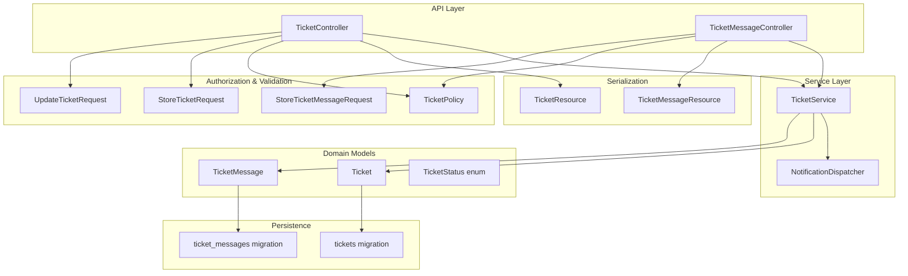
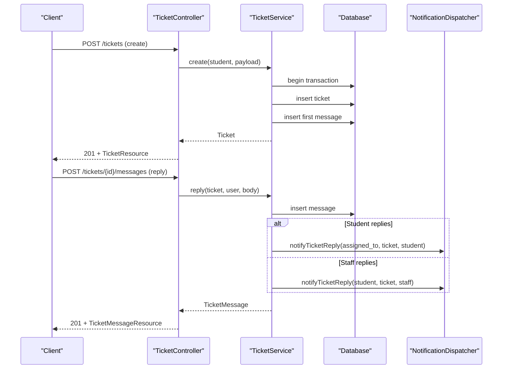
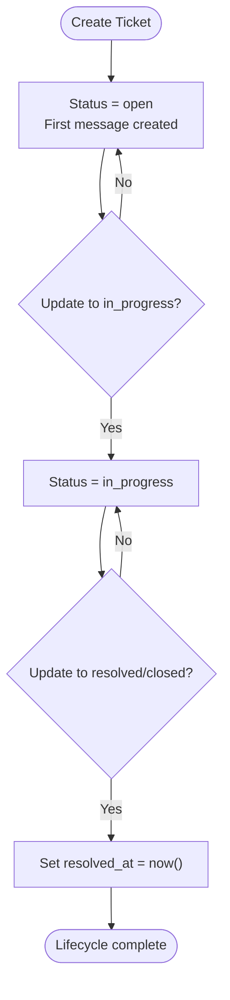
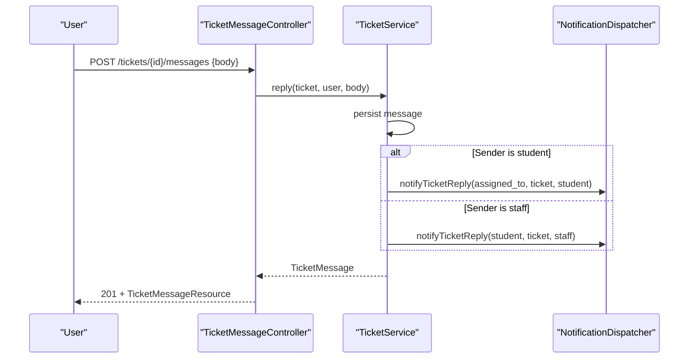
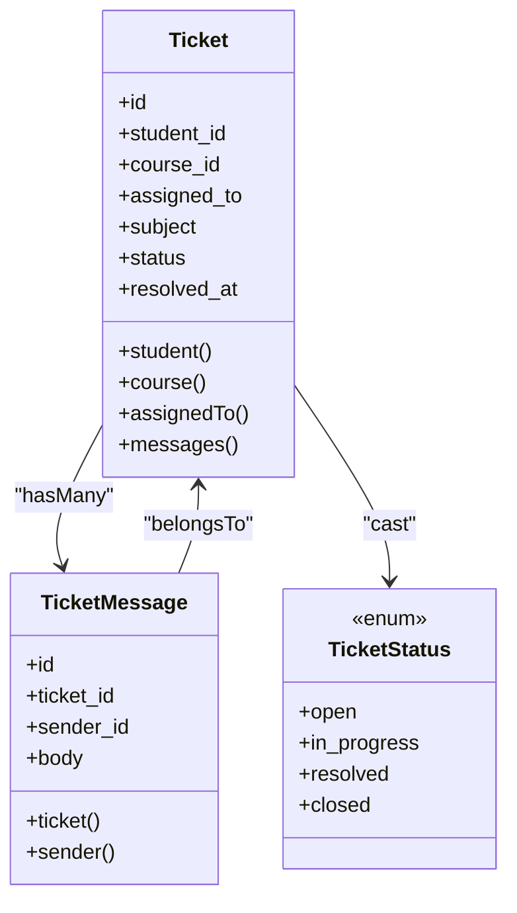
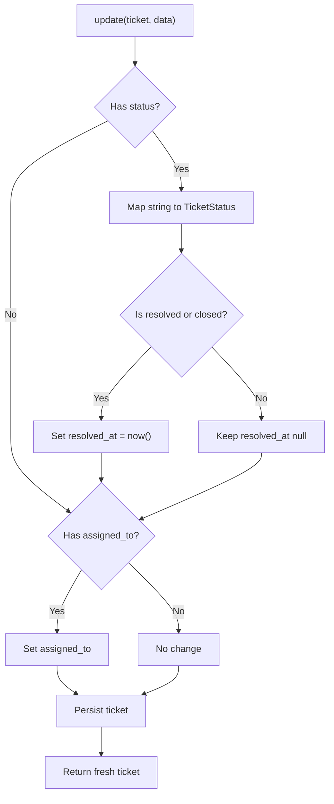
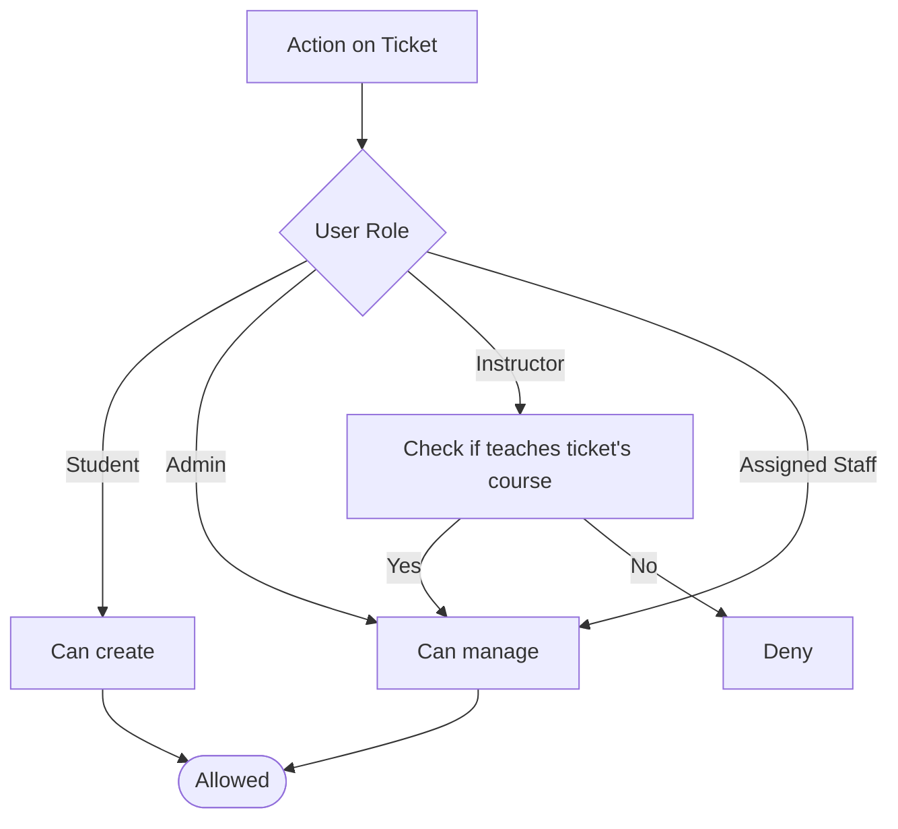
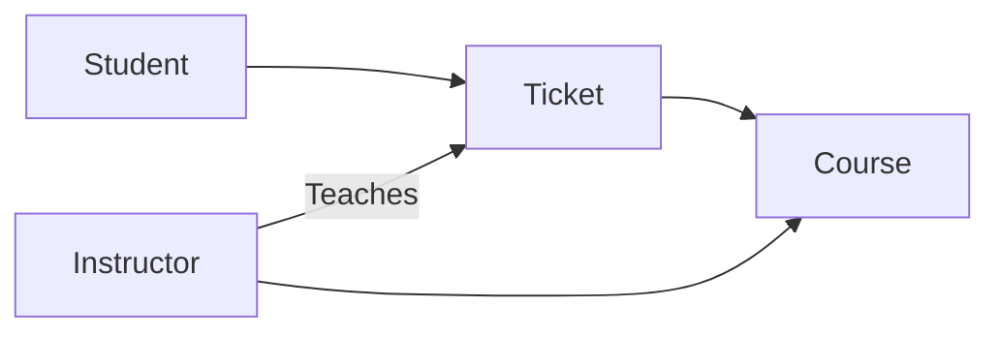
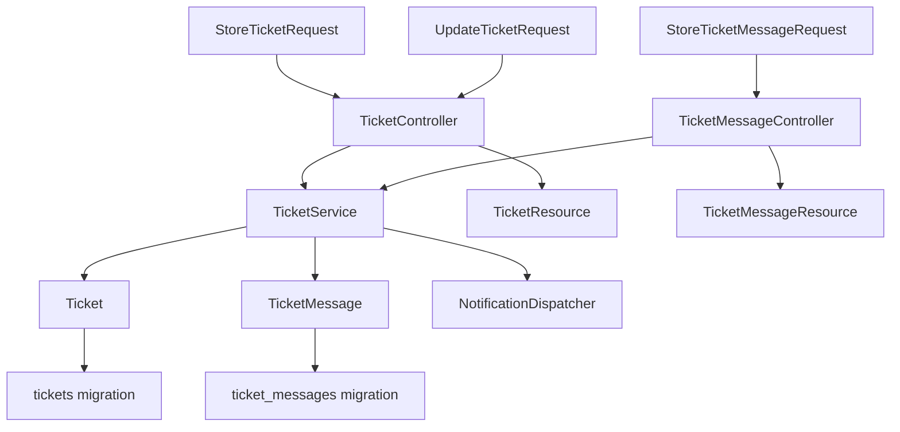

# Support Ticket System

<cite>
**Referenced Files in This Document**
- [TicketService.php](file://app/Services/Communication/TicketService.php)
- [TicketController.php](file://app/Http/Controllers/Api/V1/TicketController.php)
- [TicketMessageController.php](file://app/Http/Controllers/Api/V1/TicketMessageController.php)
- [Ticket.php](file://app/Models/Ticket.php)
- [TicketMessage.php](file://app/Models/TicketMessage.php)
- [TicketStatus.php](file://app/Enums/TicketStatus.php)
- [TicketPolicy.php](file://app/Policies/TicketPolicy.php)
- [StoreTicketRequest.php](file://app/Http/Requests/Api/V1/StoreTicketRequest.php)
- [UpdateTicketRequest.php](file://app/Http/Requests/Api/V1/UpdateTicketRequest.php)
- [StoreTicketMessageRequest.php](file://app/Http/Requests/Api/V1/StoreTicketMessageRequest.php)
- [TicketResource.php](file://app/Http/Resources/TicketResource.php)
- [TicketMessageResource.php](file://app/Http/Resources/TicketMessageResource.php)
- [NotificationDispatcher.php](file://app/Services/Notifications/NotificationDispatcher.php)
- [2024_01_01_000173_create_tickets_table.php](file://database/migrations/2024_01_01_000173_create_tickets_table.php)
- [2024_01_01_000174_create_ticket_messages_table.php](file://database/migrations/2024_01_01_000174_create_ticket_messages_table.php)
</cite>

## Table of Contents
1. [Introduction](#introduction)
2. [Project Structure](#project-structure)
3. [Core Components](#core-components)
4. [Architecture Overview](#architecture-overview)
5. [Detailed Component Analysis](#detailed-component-analysis)
6. [Dependency Analysis](#dependency-analysis)
7. [Performance Considerations](#performance-considerations)
8. [Troubleshooting Guide](#troubleshooting-guide)
9. [Conclusion](#conclusion)
10. [Appendices](#appendices)

## Introduction
This document explains the Support Ticket System implemented in the application. It covers ticket lifecycle management, message threading within tickets, status tracking, priority handling (via assignment), and the end-to-end API flow for creating, updating, and replying to tickets. It also documents how tickets integrate with course support contexts and how notifications are dispatched when messages are exchanged.

## Project Structure
The ticket system is organized into clear layers:
- Models define entities and relationships for tickets and their messages.
- Enums define allowed statuses.
- Policies enforce authorization rules based on roles and context.
- Request classes validate inputs and authorize actions.
- Controllers expose REST endpoints that delegate to a service layer.
- The service encapsulates business logic, including transactional creation and reply flows.
- Resources serialize data for API responses.
- Notifications are dispatched via a centralized dispatcher.
- Migrations define the database schema for tickets and messages.

**Diagram sources**
- [TicketController.php:1-63](file://app/Http/Controllers/Api/V1/TicketController.php#L1-L63)
- [TicketMessageController.php:1-24](file://app/Http/Controllers/Api/V1/TicketMessageController.php#L1-L24)
- [TicketService.php:1-88](file://app/Services/Communication/TicketService.php#L1-L88)
- [NotificationDispatcher.php:1-107](file://app/Services/Notifications/NotificationDispatcher.php#L1-L107)
- [Ticket.php:1-67](file://app/Models/Ticket.php#L1-L67)
- [TicketMessage.php:1-41](file://app/Models/TicketMessage.php#L1-L41)
- [TicketStatus.php:1-14](file://app/Enums/TicketStatus.php#L1-L14)
- [TicketPolicy.php:1-41](file://app/Policies/TicketPolicy.php#L1-L41)
- [StoreTicketRequest.php:1-27](file://app/Http/Requests/Api/V1/StoreTicketRequest.php#L1-L27)
- [UpdateTicketRequest.php:1-31](file://app/Http/Requests/Api/V1/UpdateTicketRequest.php#L1-L31)
- [StoreTicketMessageRequest.php:1-27](file://app/Http/Requests/Api/V1/StoreTicketMessageRequest.php#L1-L27)
- [TicketResource.php:1-30](file://app/Http/Resources/TicketResource.php#L1-L30)
- [TicketMessageResource.php:1-26](file://app/Http/Resources/TicketMessageResource.php#L1-L26)
- [2024_01_01_000173_create_tickets_table.php:1-30](file://database/migrations/2024_01_01_000173_create_tickets_table.php#L1-L30)
- [2024_01_01_000174_create_ticket_messages_table.php:1-27](file://database/migrations/2024_01_01_000174_create_ticket_messages_table.php#L1-L27)

**Section sources**
- [TicketController.php:1-63](file://app/Http/Controllers/Api/V1/TicketController.php#L1-L63)
- [TicketMessageController.php:1-24](file://app/Http/Controllers/Api/V1/TicketMessageController.php#L1-L24)
- [TicketService.php:1-88](file://app/Services/Communication/TicketService.php#L1-L88)
- [Ticket.php:1-67](file://app/Models/Ticket.php#L1-L67)
- [TicketMessage.php:1-41](file://app/Models/TicketMessage.php#L1-L41)
- [TicketStatus.php:1-14](file://app/Enums/TicketStatus.php#L1-L14)
- [TicketPolicy.php:1-41](file://app/Policies/TicketPolicy.php#L1-L41)
- [StoreTicketRequest.php:1-27](file://app/Http/Requests/Api/V1/StoreTicketRequest.php#L1-L27)
- [UpdateTicketRequest.php:1-31](file://app/Http/Requests/Api/V1/UpdateTicketRequest.php#L1-L31)
- [StoreTicketMessageRequest.php:1-27](file://app/Http/Requests/Api/V1/StoreTicketMessageRequest.php#L1-L27)
- [TicketResource.php:1-30](file://app/Http/Resources/TicketResource.php#L1-L30)
- [TicketMessageResource.php:1-26](file://app/Http/Resources/TicketMessageResource.php#L1-L26)
- [2024_01_01_000173_create_tickets_table.php:1-30](file://database/migrations/2024_01_01_000173_create_tickets_table.php#L1-L30)
- [2024_01_01_000174_create_ticket_messages_table.php:1-27](file://database/migrations/2024_01_01_000174_create_ticket_messages_table.php#L1-L27)

## Core Components
- Ticket model: Represents a support request with fields for student, optional course, assigned staff, subject, status, and resolution timestamp. Relationships include student, course, assignedTo, and messages.
- TicketMessage model: Represents individual messages within a ticket thread, linking to the ticket and sender.
- TicketStatus enum: Defines lifecycle states open, in_progress, resolved, closed.
- TicketService: Orchestrates ticket creation (transactionally creates ticket and initial message), replies (creates message and dispatches notifications), and updates (status changes set resolved_at when appropriate; supports reassignment).
- Controllers: Expose endpoints for listing, creating, viewing, and updating tickets; and for adding messages to a ticket.
- Policies: Enforce role-based access control for creating, viewing, and managing tickets.
- Requests: Validate input and authorize operations for creating/updating tickets and adding messages.
- Resources: Serialize ticket and message data for API responses.
- NotificationDispatcher: Creates in-app notifications for ticket replies.
- Migrations: Define tables for tickets and ticket_messages with foreign keys and timestamps.

**Section sources**
- [Ticket.php:1-67](file://app/Models/Ticket.php#L1-L67)
- [TicketMessage.php:1-41](file://app/Models/TicketMessage.php#L1-L41)
- [TicketStatus.php:1-14](file://app/Enums/TicketStatus.php#L1-L14)
- [TicketService.php:1-88](file://app/Services/Communication/TicketService.php#L1-L88)
- [TicketController.php:1-63](file://app/Http/Controllers/Api/V1/TicketController.php#L1-L63)
- [TicketMessageController.php:1-24](file://app/Http/Controllers/Api/V1/TicketMessageController.php#L1-L24)
- [TicketPolicy.php:1-41](file://app/Policies/TicketPolicy.php#L1-L41)
- [StoreTicketRequest.php:1-27](file://app/Http/Requests/Api/V1/StoreTicketRequest.php#L1-L27)
- [UpdateTicketRequest.php:1-31](file://app/Http/Requests/Api/V1/UpdateTicketRequest.php#L1-L31)
- [StoreTicketMessageRequest.php:1-27](file://app/Http/Requests/Api/V1/StoreTicketMessageRequest.php#L1-L27)
- [TicketResource.php:1-30](file://app/Http/Resources/TicketResource.php#L1-L30)
- [TicketMessageResource.php:1-26](file://app/Http/Resources/TicketMessageResource.php#L1-L26)
- [NotificationDispatcher.php:1-107](file://app/Services/Notifications/NotificationDispatcher.php#L1-L107)
- [2024_01_01_000173_create_tickets_table.php:1-30](file://database/migrations/2024_01_01_000173_create_tickets_table.php#L1-L30)
- [2024_01_01_000174_create_ticket_messages_table.php:1-27](file://database/migrations/2024_01_01_000174_create_ticket_messages_table.php#L1-L27)

## Architecture Overview
The ticket system follows a layered architecture:
- HTTP controllers receive requests, validate via request classes, and delegate to the service layer.
- The service performs domain operations, manages transactions, and triggers notifications.
- Models represent persistent entities and relationships.
- Policies gate access at controller/request boundaries.
- Resources format responses consistently.

**Diagram sources**
- [TicketController.php:42-61](file://app/Http/Controllers/Api/V1/TicketController.php#L42-L61)
- [TicketMessageController.php:17-22](file://app/Http/Controllers/Api/V1/TicketMessageController.php#L17-L22)
- [TicketService.php:25-62](file://app/Services/Communication/TicketService.php#L25-L62)
- [NotificationDispatcher.php:93-107](file://app/Services/Notifications/NotificationDispatcher.php#L93-L107)

## Detailed Component Analysis

### Ticket Lifecycle Management
- Creation: A student creates a ticket with a subject and body, optionally linked to a course. The service creates the ticket with status open and immediately adds the first message in a single transaction.
- Status transitions: Admins or authorized staff update status to in_progress, resolved, or closed. When resolved or closed, the resolved_at timestamp is set automatically.
- Assignment: Tickets can be assigned to a staff member. Unassigned tickets remain visible to relevant instructors/admins per policy rules.

**Diagram sources**
- [TicketService.php:25-43](file://app/Services/Communication/TicketService.php#L25-L43)
- [TicketService.php:67-86](file://app/Services/Communication/TicketService.php#L67-L86)
- [TicketStatus.php:7-13](file://app/Enums/TicketStatus.php#L7-L13)

**Section sources**
- [TicketService.php:25-86](file://app/Services/Communication/TicketService.php#L25-L86)
- [TicketStatus.php:1-14](file://app/Enums/TicketStatus.php#L1-L14)

### Message Threading Within Tickets
- Each ticket has many messages. Messages record the sender and content.
- Adding a message triggers a notification to the other party:
  - If the student replies, the assigned staff receives a notification (if any).
  - If staff replies, the student receives a notification.

**Diagram sources**
- [TicketMessageController.php:17-22](file://app/Http/Controllers/Api/V1/TicketMessageController.php#L17-L22)
- [TicketService.php:45-62](file://app/Services/Communication/TicketService.php#L45-L62)
- [NotificationDispatcher.php:93-107](file://app/Services/Notifications/NotificationDispatcher.php#L93-L107)

**Section sources**
- [TicketMessageController.php:1-24](file://app/Http/Controllers/Api/V1/TicketMessageController.php#L1-L24)
- [TicketService.php:45-62](file://app/Services/Communication/TicketService.php#L45-L62)
- [NotificationDispatcher.php:93-107](file://app/Services/Notifications/NotificationDispatcher.php#L93-L107)

### Status Tracking and Priority Handling
- Status values: open, in_progress, resolved, closed.
- Automatic resolved_at: Setting status to resolved or closed sets the resolved timestamp.
- Priority handling: Implemented via assignment. Assigning a ticket to a staff member indicates ownership and enables targeted notifications.

**Diagram sources**
- [Ticket.php:14-66](file://app/Models/Ticket.php#L14-L66)
- [TicketMessage.php:12-40](file://app/Models/TicketMessage.php#L12-L40)
- [TicketStatus.php:7-13](file://app/Enums/TicketStatus.php#L7-L13)

**Section sources**
- [Ticket.php:14-66](file://app/Models/Ticket.php#L14-L66)
- [TicketMessage.php:12-40](file://app/Models/TicketMessage.php#L12-L40)
- [TicketStatus.php:1-14](file://app/Enums/TicketStatus.php#L1-L14)

### TicketService Implementation Details
- create: Validates via request, then uses a database transaction to atomically create the ticket and its first message.
- reply: Persists the message and dispatches an in-app notification to the counterpart (student or assigned staff).
- update: Supports changing status and assignment. Automatically sets resolved_at when moving to resolved or closed.

**Diagram sources**
- [TicketService.php:67-86](file://app/Services/Communication/TicketService.php#L67-L86)

**Section sources**
- [TicketService.php:25-86](file://app/Services/Communication/TicketService.php#L25-L86)

### Authorization and Access Control
- Create: Only students can create tickets.
- View: Students see their own tickets; assigned staff and admins can view; instructors can view tickets for courses they teach.
- Manage: Only admins, the assigned staff, or instructors teaching the ticket’s course can update status or reassign.

**Diagram sources**
- [TicketPolicy.php:13-39](file://app/Policies/TicketPolicy.php#L13-L39)

**Section sources**
- [TicketPolicy.php:1-41](file://app/Policies/TicketPolicy.php#L1-L41)

### Integration With Course Support Contexts
- Optional course linkage: Tickets may be associated with a course to provide context.
- Instructor visibility: Instructors can view and manage tickets for courses they teach.
- Query scoping: Listing tickets scopes results by role and course relationships.

**Diagram sources**
- [Ticket.php:43-49](file://app/Models/Ticket.php#L43-L49)
- [TicketController.php:29-37](file://app/Http/Controllers/Api/V1/TicketController.php#L29-L37)

**Section sources**
- [TicketController.php:25-39](file://app/Http/Controllers/Api/V1/TicketController.php#L25-L39)
- [Ticket.php:43-49](file://app/Models/Ticket.php#L43-L49)

### Concrete Usage Examples
- Creating a support ticket:
  - Endpoint: POST /api/v1/tickets
  - Payload includes subject, body, and optional course_id.
  - Behavior: Creates a ticket with status open and appends the first message.
  - Reference paths: [StoreTicketRequest.php:18-25](file://app/Http/Requests/Api/V1/StoreTicketRequest.php#L18-L25), [TicketController.php:42-47](file://app/Http/Controllers/Api/V1/TicketController.php#L42-L47), [TicketService.php:25-43](file://app/Services/Communication/TicketService.php#L25-L43)

- Adding a message to a ticket:
  - Endpoint: POST /api/v1/tickets/{ticket}/messages
  - Payload includes body.
  - Behavior: Adds a message and notifies the counterpart.
  - Reference paths: [StoreTicketMessageRequest.php:20-25](file://app/Http/Requests/Api/V1/StoreTicketMessageRequest.php#L20-L25), [TicketMessageController.php:17-22](file://app/Http/Controllers/Api/V1/TicketMessageController.php#L17-L22), [TicketService.php:45-62](file://app/Services/Communication/TicketService.php#L45-L62)

- Updating status and assigning:
  - Endpoint: PATCH /api/v1/tickets/{ticket}
  - Payload includes status and/or assigned_to.
  - Behavior: Updates status and sets resolved_at when resolved/closed; reassigns if provided.
  - Reference paths: [UpdateTicketRequest.php:23-29](file://app/Http/Requests/Api/V1/UpdateTicketRequest.php#L23-L29), [TicketController.php:56-61](file://app/Http/Controllers/Api/V1/TicketController.php#L56-L61), [TicketService.php:67-86](file://app/Services/Communication/TicketService.php#L67-L86)

- Viewing a ticket:
  - Endpoint: GET /api/v1/tickets/{ticket}
  - Behavior: Returns ticket details with related resources and messages.
  - Reference paths: [TicketController.php:49-54](file://app/Http/Controllers/Api/V1/TicketController.php#L49-L54), [TicketResource.php:15-27](file://app/Http/Resources/TicketResource.php#L15-L27)

**Section sources**
- [StoreTicketRequest.php:18-25](file://app/Http/Requests/Api/V1/StoreTicketRequest.php#L18-L25)
- [StoreTicketMessageRequest.php:20-25](file://app/Http/Requests/Api/V1/StoreTicketMessageRequest.php#L20-L25)
- [UpdateTicketRequest.php:23-29](file://app/Http/Requests/Api/V1/UpdateTicketRequest.php#L23-L29)
- [TicketController.php:42-61](file://app/Http/Controllers/Api/V1/TicketController.php#L42-L61)
- [TicketService.php:25-86](file://app/Services/Communication/TicketService.php#L25-L86)
- [TicketResource.php:15-27](file://app/Http/Resources/TicketResource.php#L15-L27)

## Dependency Analysis
Key dependencies and interactions:
- Controllers depend on services for business logic and on request classes for validation/authorization.
- Service depends on models and notification dispatcher.
- Policies govern access across controllers and requests.
- Resources depend on models and nested resources for serialization.
- Database migrations define structural dependencies between entities.

**Diagram sources**
- [TicketController.php:1-63](file://app/Http/Controllers/Api/V1/TicketController.php#L1-L63)
- [TicketMessageController.php:1-24](file://app/Http/Controllers/Api/V1/TicketMessageController.php#L1-L24)
- [TicketService.php:1-88](file://app/Services/Communication/TicketService.php#L1-L88)
- [Ticket.php:1-67](file://app/Models/Ticket.php#L1-L67)
- [TicketMessage.php:1-41](file://app/Models/TicketMessage.php#L1-L41)
- [NotificationDispatcher.php:1-107](file://app/Services/Notifications/NotificationDispatcher.php#L1-L107)
- [TicketResource.php:1-30](file://app/Http/Resources/TicketResource.php#L1-L30)
- [TicketMessageResource.php:1-26](file://app/Http/Resources/TicketMessageResource.php#L1-L26)
- [2024_01_01_000173_create_tickets_table.php:1-30](file://database/migrations/2024_01_01_000173_create_tickets_table.php#L1-L30)
- [2024_01_01_000174_create_ticket_messages_table.php:1-27](file://database/migrations/2024_01_01_000174_create_ticket_messages_table.php#L1-L27)

**Section sources**
- [TicketController.php:1-63](file://app/Http/Controllers/Api/V1/TicketController.php#L1-L63)
- [TicketMessageController.php:1-24](file://app/Http/Controllers/Api/V1/TicketMessageController.php#L1-L24)
- [TicketService.php:1-88](file://app/Services/Communication/TicketService.php#L1-L88)
- [Ticket.php:1-67](file://app/Models/Ticket.php#L1-L67)
- [TicketMessage.php:1-41](file://app/Models/TicketMessage.php#L1-L41)
- [NotificationDispatcher.php:1-107](file://app/Services/Notifications/NotificationDispatcher.php#L1-L107)
- [TicketResource.php:1-30](file://app/Http/Resources/TicketResource.php#L1-L30)
- [TicketMessageResource.php:1-26](file://app/Http/Resources/TicketMessageResource.php#L1-L26)
- [2024_01_01_000173_create_tickets_table.php:1-30](file://database/migrations/2024_01_01_000173_create_tickets_table.php#L1-L30)
- [2024_01_01_000174_create_ticket_messages_table.php:1-27](file://database/migrations/2024_01_01_000174_create_ticket_messages_table.php#L1-L27)

## Performance Considerations
- Transactional creation: Ticket creation and initial message insertion occur within a single transaction to ensure consistency and avoid partial writes.
- Eager loading: Responses eagerly load necessary relationships to reduce N+1 queries.
- Minimal updates: Update logic only modifies required fields and sets resolved_at conditionally.
- Notification writes: Notifications are lightweight in-app records; consider queuing future expansions if volume increases.

[No sources needed since this section provides general guidance]

## Troubleshooting Guide
Common issues and resolutions:
- Unauthorized access: Ensure the user role matches policy requirements for create/view/manage. Verify course association for instructor visibility.
- Validation errors: Confirm request payloads match expected fields and constraints (e.g., valid course_id, non-empty body).
- Missing notifications: Verify that the ticket has an assigned_to when a student replies; otherwise, no staff notification is sent. For staff replies, ensure the student exists.
- Status not setting resolved_at: Confirm status is one of resolved or closed; other statuses will not set the timestamp.

**Section sources**
- [TicketPolicy.php:13-39](file://app/Policies/TicketPolicy.php#L13-L39)
- [StoreTicketRequest.php:18-25](file://app/Http/Requests/Api/V1/StoreTicketRequest.php#L18-L25)
- [StoreTicketMessageRequest.php:20-25](file://app/Http/Requests/Api/V1/StoreTicketMessageRequest.php#L20-L25)
- [UpdateTicketRequest.php:23-29](file://app/Http/Requests/Api/V1/UpdateTicketRequest.php#L23-L29)
- [TicketService.php:45-86](file://app/Services/Communication/TicketService.php#L45-L86)

## Conclusion
The Support Ticket System provides a robust, role-aware workflow for student support within courses. It enforces clear lifecycle states, ensures consistent message threading, and integrates notifications to keep both students and staff informed. Assignment serves as the primary mechanism for prioritization and ownership. The design separates concerns cleanly across controllers, services, models, policies, and resources, making it maintainable and extensible.

[No sources needed since this section summarizes without analyzing specific files]

## Appendices

### Data Model Summary
- tickets: id, student_id, course_id, assigned_to, subject, status, created_at, resolved_at
- ticket_messages: id, ticket_id, sender_id, body, created_at

**Section sources**
- [2024_01_01_000173_create_tickets_table.php:11-22](file://database/migrations/2024_01_01_000173_create_tickets_table.php#L11-L22)
- [2024_01_01_000174_create_ticket_messages_table.php:11-19](file://database/migrations/2024_01_01_000174_create_ticket_messages_table.php#L11-L19)