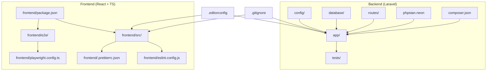
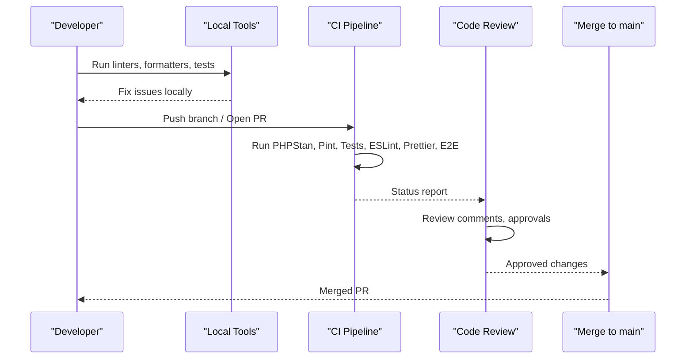
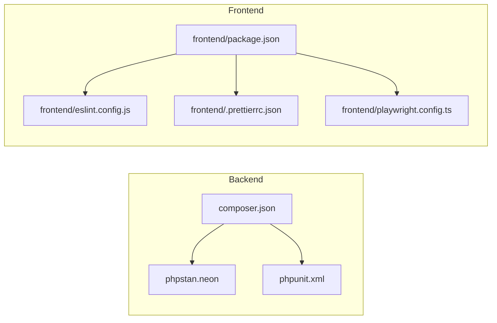

# Contributing Guidelines

<cite>
**Referenced Files in This Document**
- [README.md](file://README.md)
- [composer.json](file://composer.json)
- [phpstan.neon](file://phpstan.neon)
- [phpunit.xml](file://phpunit.xml)
- [frontend/package.json](file://frontend/package.json)
- [frontend/eslint.config.js](file://frontend/eslint.config.js)
- [frontend/.prettierrc.json](file://frontend/.prettierrc.json)
- [frontend/playwright.config.ts](file://frontend/playwright.config.ts)
- [.editorconfig](file://.editorconfig)
- [.gitignore](file://.gitignore)
- [code-standards.md](file://.agents/context/code-standards.md)
- [testing.md](file://.agents/skills/laravel-specialist/references/testing.md)
</cite>

## Table of Contents
1. Introduction
2. Project Structure
3. Core Components
4. Architecture Overview
5. Detailed Component Analysis
6. Dependency Analysis
7. Performance Considerations
8. Troubleshooting Guide
9. Conclusion
10. Appendices

## Introduction
This document defines the contributing guidelines for the ResNet Academy LMS project. It covers development standards, code review processes, testing requirements, documentation update procedures, coding conventions for PHP backend and React frontend, Git workflow, pull request procedures, static analysis setup with PHPStan, linting rules, quality gates, contribution types, issue reporting, community interaction, environment setup, and testing procedures.

The goal is to ensure consistent, high-quality contributions that are easy to review, safe to merge, and maintainable over time.

## Project Structure
ResNet Academy is a Laravel 12 backend with a separate React + TypeScript frontend built with Vite. The repository includes:
- Backend (PHP/Laravel): app, config, database, routes, tests, phpstan configuration, and composer scripts.
- Frontend (React/TypeScript): src, e2e, eslint, prettier, playwright, vitest, and vite build pipeline.
- Shared tooling: editorconfig, gitattributes, .gitignore, and Composer scripts for setup and development.

**Diagram sources**
- [composer.json:45-60](file://composer.json#L45-L60)
- [phpstan.neon:1-32](file://phpstan.neon#L1-L32)
- [phpunit.xml:1-41](file://phpunit.xml#L1-L41)
- [frontend/package.json:6-16](file://frontend/package.json#L6-L16)
- [frontend/eslint.config.js:1-28](file://frontend/eslint.config.js#L1-L28)
- [frontend/.prettierrc.json:1-7](file://frontend/.prettierrc.json#L1-L7)
- [frontend/playwright.config.ts:1-49](file://frontend/playwright.config.ts#L1-L49)
- [.editorconfig:1-19](file://.editorconfig#L1-L19)
- [.gitignore:1-25](file://.gitignore#L1-L25)

**Section sources**
- [composer.json:45-60](file://composer.json#L45-L60)
- [frontend/package.json:6-16](file://frontend/package.json#L6-L16)
- [phpstan.neon:1-32](file://phpstan.neon#L1-L32)
- [phpunit.xml:1-41](file://phpunit.xml#L1-L41)
- [frontend/eslint.config.js:1-28](file://frontend/eslint.config.js#L1-L28)
- [frontend/.prettierrc.json:1-7](file://frontend/.prettierrc.json#L1-L7)
- [frontend/playwright.config.ts:1-49](file://frontend/playwright.config.ts#L1-L49)
- [.editorconfig:1-19](file://.editorconfig#L1-L19)
- [.gitignore:1-25](file://.gitignore#L1-L25)

## Core Components
- Backend: Laravel application with API controllers, services, models, policies, resources, jobs, migrations, and feature/unit tests.
- Frontend: React + TypeScript application with Vite, ESLint, Prettier, Vitest unit tests, and Playwright E2E tests.
- Quality tools: PHPStan (via Larastan), Pint (PSR-12 formatting), PHPUnit/Pest, ESLint, Prettier, Playwright.

Key responsibilities:
- Controllers validate requests via Form Requests, authorize via Policies, delegate to Services, and return API Resources.
- Business logic resides in Services; Models represent data; Policies enforce authorization; Resources shape API responses.
- Frontend uses typed API client patterns, feature folders, and component boundaries aligned with backend resources.

**Section sources**
- [code-standards.md:22-87](file://.agents/context/code-standards.md#L22-L87)
- [code-standards.md:103-142](file://.agents/context/code-standards.md#L103-L142)

## Architecture Overview
Contributions flow through standardized stages: local development, automated checks, code review, and merge.

Quality gates enforced by CI:
- PHP: Pint (PSR-12), PHPStan level 6+, PHPUnit/Pest tests.
- Frontend: ESLint recommended rules, Prettier checks, Vitest unit tests, Playwright E2E tests.

**Diagram sources**
- [composer.json:45-60](file://composer.json#L45-L60)
- [phpstan.neon:1-32](file://phpstan.neon#L1-L32)
- [phpunit.xml:1-41](file://phpunit.xml#L1-L41)
- [frontend/package.json:6-16](file://frontend/package.json#L6-L16)
- [frontend/eslint.config.js:1-28](file://frontend/eslint.config.js#L1-L28)
- [frontend/.prettierrc.json:1-7](file://frontend/.prettierrc.json#L1-L7)
- [frontend/playwright.config.ts:1-49](file://frontend/playwright.config.ts#L1-L49)

## Detailed Component Analysis

### Development Environment Setup
- Use Composer scripts to bootstrap the project: install dependencies, generate key, run migrations, install frontend dependencies, and build assets.
- Start development server, queue listener, logs, and Vite dev server concurrently.

Recommended steps:
- Install backend dependencies and set up environment.
- Run migrations to create schema.
- Install frontend dependencies and build.
- Use the provided dev script to run all services together.

**Section sources**
- [composer.json:45-60](file://composer.json#L45-L60)

### Coding Conventions — PHP Backend
- Formatting and static analysis: PSR-12 via Laravel Pint; PHPStan at level 6+ via Larastan; strict types required; typed properties/methods; enums for status columns.
- Naming: PascalCase classes, camelCase methods/variables, singular model names matching plural table names from schema; boolean prefixes where appropriate.
- Structure: Thin controllers, business logic in Services, Policies for authorization, API Resources for responses, idempotent queued jobs.
- Eloquent: Eager-load relationships to avoid N+1; relationship names match foreign keys; avoid raw SQL unless necessary.
- Migrations: One logical change per file; explicit constraint names and onDelete behavior; careful handling of destructive changes.

**Section sources**
- [code-standards.md:22-87](file://.agents/context/code-standards.md#L22-L87)
- [phpstan.neon:1-32](file://phpstan.neon#L1-L32)

### Coding Conventions — React Frontend
- Formatting and linting: ESLint recommended rules with react-hooks plugin; Prettier configured; TypeScript strict mode; no any without justification.
- Structure: Feature-folder layout; one component per file; shared UI primitives only in components/ui; centralized typed API client.
- Components and hooks: Functional components; explicit prop interfaces; custom hooks for reusable logic; authoritative completion logic on backend.
- Styling: Consistent approach (utility-first Tailwind); accessibility mandatory (keyboard navigation, labels, alt text).
- Testing: React Testing Library with Vitest; test user-visible behavior.

**Section sources**
- [code-standards.md:103-142](file://.agents/context/code-standards.md#L103-L142)
- [frontend/eslint.config.js:1-28](file://frontend/eslint.config.js#L1-L28)
- [frontend/.prettierrc.json:1-7](file://frontend/.prettierrc.json#L1-L7)

### Static Analysis and Linting
- PHP:
  - PHPStan level 6+ via Larastan extension; excludes providers; specific ignore rules for Eloquent generics, API Resource magic access, and Request rule arrays.
  - Pint enforces PSR-12 formatting.
- Frontend:
  - ESLint with TypeScript, react-hooks, and react-refresh plugins; Prettier for formatting.

Run locally before committing to prevent CI failures.

**Section sources**
- [phpstan.neon:1-32](file://phpstan.neon#L1-L32)
- [frontend/eslint.config.js:1-28](file://frontend/eslint.config.js#L1-L28)
- [frontend/.prettierrc.json:1-7](file://frontend/.prettierrc.json#L1-L7)

### Testing Requirements
- Backend:
  - PHPUnit configured with Unit and Feature suites; source include app directory; testing environment variables defined.
  - Pest available for expressive tests; use factories, RefreshDatabase, and assertions for HTTP endpoints.
  - Best practices: one assertion per test, descriptive names, AAA pattern, mock external services, fake queues/events, coverage targets.
- Frontend:
  - Vitest for unit tests; Playwright for E2E tests with parallel execution, retries, and HTML reporter; web server auto-started for tests.

Run tests locally and ensure they pass before opening PRs.

**Section sources**
- [phpunit.xml:1-41](file://phpunit.xml#L1-L41)
- [testing.md:481-523](file://.agents/skills/laravel-specialist/references/testing.md#L481-L523)
- [frontend/package.json:6-16](file://frontend/package.json#L6-L16)
- [frontend/playwright.config.ts:1-49](file://frontend/playwright.config.ts#L1-L49)

### Git Workflow and Pull Request Procedures
- Branch naming: feature/<short-desc>, fix/<short-desc>, chore/<short-desc>.
- Commit messages: Conventional Commits in imperative mood; reference FR numbers when applicable.
- PR description must include:
  - What business rules or features this implements or touches.
  - Any schema changes with diffs.
  - Test coverage added for the change.
- PR size: Prefer small, focused PRs; split if touching more than ~400 lines of non-generated code.
- Required CI gates before merge: Pint, PHPStan, PHP tests, ESLint, Prettier check, frontend tests. No merging with red checks.

**Section sources**
- [code-standards.md:145-158](file://.agents/context/code-standards.md#L145-L158)

### Contribution Types
- Features: New functionality or enhancements.
- Fixes: Bug fixes and corrections.
- Refactors: Code improvements without changing behavior.
- Tests: Adding or improving tests.
- Docs: Documentation updates or clarifications.
- Chore: Maintenance tasks, dependency updates, tooling.

Ensure each PR aligns with one type and scope.

[No sources needed since this section provides general guidance]

### Issue Reporting
- Describe the problem clearly with steps to reproduce.
- Include environment details (PHP version, Node version, OS).
- Attach relevant logs or screenshots.
- Reference related FR numbers or tickets if applicable.

[No sources needed since this section provides general guidance]

### Community Interaction Guidelines
- Be respectful and constructive in reviews and discussions.
- Focus feedback on code and design, not individuals.
- Ask questions openly; share knowledge and rationale behind decisions.
- Follow the project’s code of conduct and maintain a welcoming environment.

[No sources needed since this section provides general guidance]

## Dependency Analysis
The project integrates multiple tools across backend and frontend:

**Diagram sources**
- [composer.json:45-60](file://composer.json#L45-L60)
- [phpstan.neon:1-32](file://phpstan.neon#L1-L32)
- [phpunit.xml:1-41](file://phpunit.xml#L1-L41)
- [frontend/package.json:6-16](file://frontend/package.json#L6-L16)
- [frontend/eslint.config.js:1-28](file://frontend/eslint.config.js#L1-L28)
- [frontend/.prettierrc.json:1-7](file://frontend/.prettierrc.json#L1-L7)
- [frontend/playwright.config.ts:1-49](file://frontend/playwright.config.ts#L1-L49)

**Section sources**
- [composer.json:45-60](file://composer.json#L45-L60)
- [frontend/package.json:6-16](file://frontend/package.json#L6-L16)

## Performance Considerations
- Avoid N+1 queries by eager-loading relationships in list endpoints.
- Keep controllers thin; move heavy logic to Services.
- Use queues for long-running tasks and ensure idempotency.
- On the frontend, prefer efficient rendering and avoid unnecessary re-renders; keep API calls centralized and typed.
- Monitor test execution times and optimize slow tests.

[No sources needed since this section provides general guidance]

## Troubleshooting Guide
Common issues and resolutions:
- PHPStan errors: Address type mismatches; avoid suppressing without explanation; ensure strict types and proper annotations.
- Pint formatting violations: Run formatter locally before committing.
- Test failures: Verify environment variables, database connectivity, and mocked services; use RefreshDatabase and factories consistently.
- Frontend lint/format errors: Run ESLint and Prettier locally; ensure TypeScript strictness and correct imports.
- E2E flakiness: Increase timeouts if needed; use retries and traces; stabilize selectors and network mocks.

**Section sources**
- [phpstan.neon:1-32](file://phpstan.neon#L1-L32)
- [phpunit.xml:1-41](file://phpunit.xml#L1-L41)
- [frontend/eslint.config.js:1-28](file://frontend/eslint.config.js#L1-L28)
- [frontend/playwright.config.ts:1-49](file://frontend/playwright.config.ts#L1-L49)

## Conclusion
Adhering to these guidelines ensures consistent, high-quality contributions to ResNet Academy. By following the established coding standards, using the configured tools, writing comprehensive tests, and maintaining clear documentation, contributors can deliver reliable features and fixes efficiently.

[No sources needed since this section summarizes without analyzing specific files]

## Appendices

### Quick Commands
- Backend setup and development:
  - Install and prepare: composer setup
  - Start dev servers: composer dev
  - Run tests: composer test
- Frontend:
  - Build: npm run build
  - Lint: npm run lint
  - Format: npm run format
  - Unit tests: npm run test
  - E2E tests: npm run test:e2e

**Section sources**
- [composer.json:45-60](file://composer.json#L45-L60)
- [frontend/package.json:6-16](file://frontend/package.json#L6-L16)

### Editor Configuration
- Global editor settings:
  - UTF-8 encoding, LF line endings, 4-space indentation for most files; YAML uses 2 spaces; trailing whitespace trimmed except markdown.
- Git attributes:
  - Auto text conversion; language-specific diff drivers for Blade, CSS, HTML, Markdown, PHP.

**Section sources**
- [.editorconfig:1-19](file://.editorconfig#L1-L19)
- [.gitattributes:1-11](file://.gitattributes#L1-L11)

### Security and Privacy
- Do not commit secrets or sensitive files (.env, vendor, node_modules, storage keys).
- Follow security vulnerability reporting procedures outlined in the project’s README.

**Section sources**
- [.gitignore:1-25](file://.gitignore#L1-L25)
- [README.md:53-55](file://README.md#L53-L55)