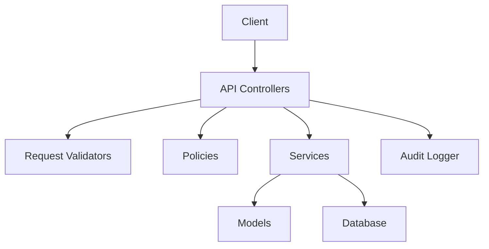
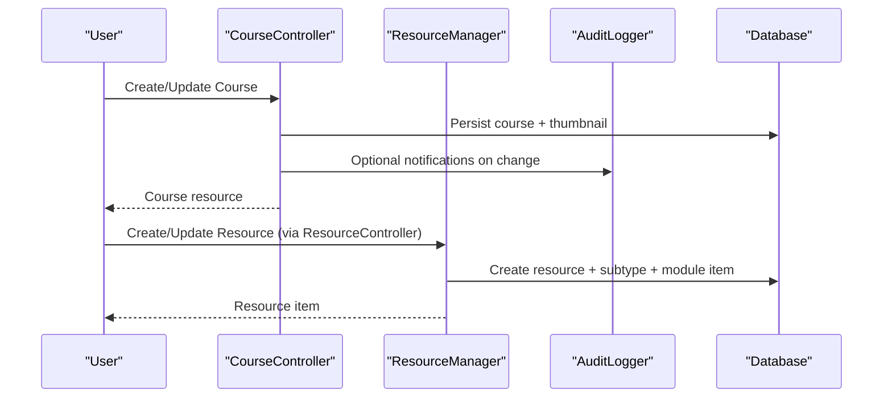
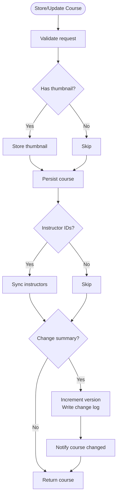
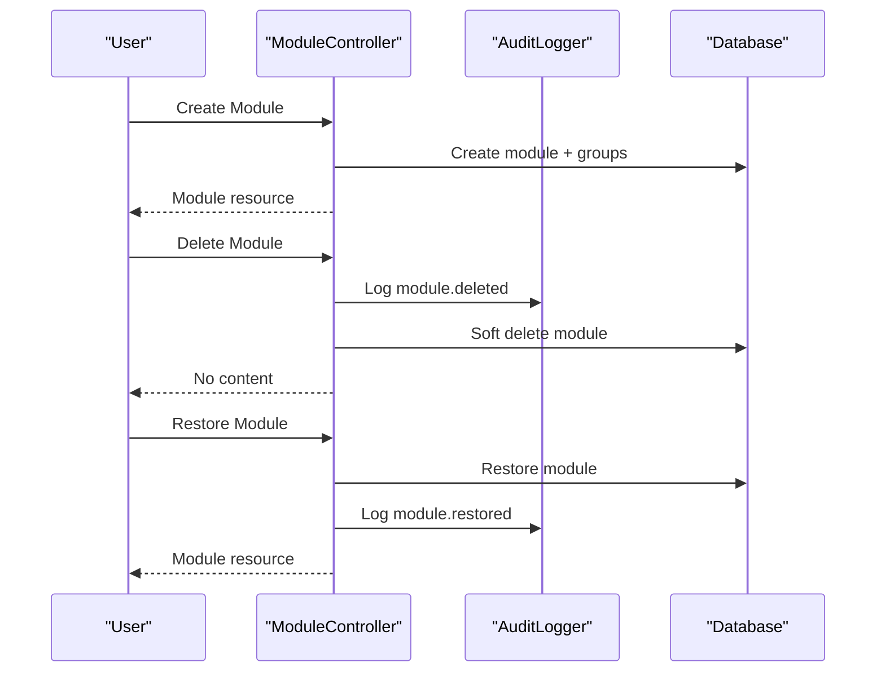
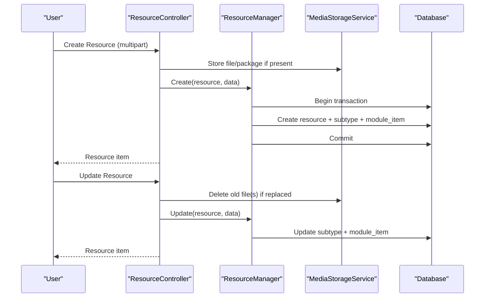
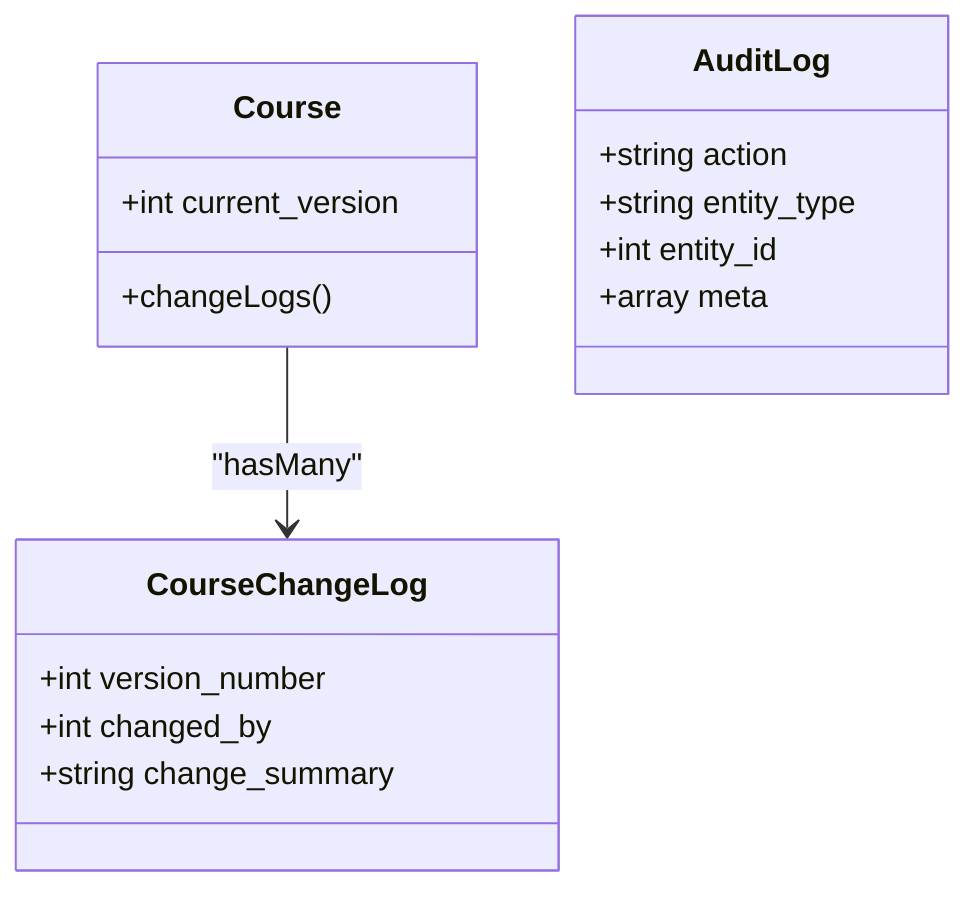
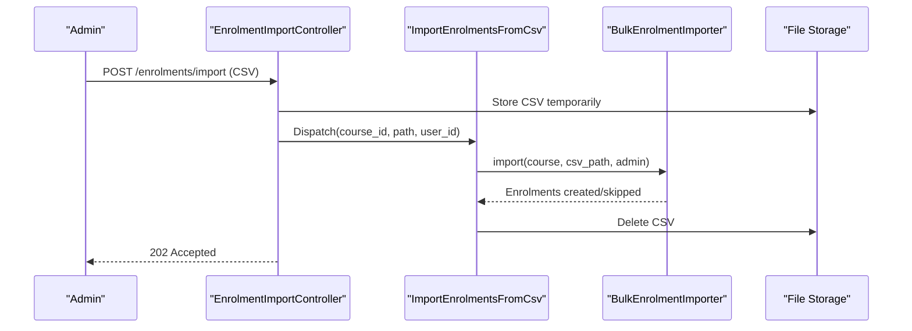
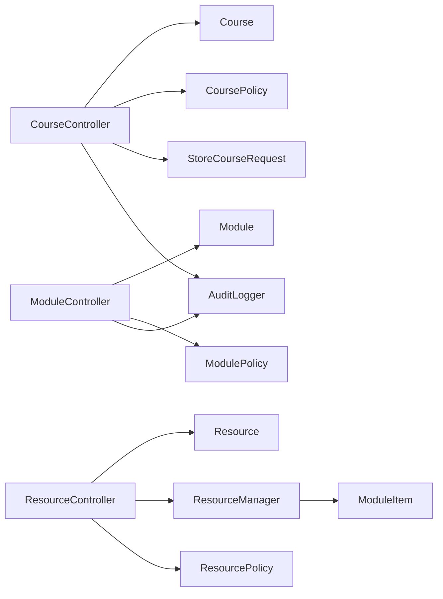

# Content Creation & Publishing Workflows

<cite>
**Referenced Files in This Document**
- [CourseController.php](file://app/Http/Controllers/Api/V1/CourseController.php)
- [ModuleController.php](file://app/Http/Controllers/Api/V1/ModuleController.php)
- [ResourceController.php](file://app/Http/Controllers/Api/V1/ResourceController.php)
- [CoursePolicy.php](file://app/Policies/CoursePolicy.php)
- [ModulePolicy.php](file://app/Policies/ModulePolicy.php)
- [ResourcePolicy.php](file://app/Policies/ResourcePolicy.php)
- [StoreCourseRequest.php](file://app/Http/Requests/Api/V1/StoreCourseRequest.php)
- [StoreModuleRequest.php](file://app/Http/Requests/Api/V1/StoreModuleRequest.php)
- [StoreResourceRequest.php](file://app/Http/Requests/Api/V1/StoreResourceRequest.php)
- [Course.php](file://app/Models/Course.php)
- [Module.php](file://app/Models/Module.php)
- [Resource.php](file://app/Models/Resource.php)
- [CourseChangeLog.php](file://app/Models/CourseChangeLog.php)
- [AuditLog.php](file://app/Models/AuditLog.php)
- [AuditLogger.php](file://app/Services/Audit/AuditLogger.php)
- [ResourceManager.php](file://app/Services/Content/ResourceManager.php)
- [EnrolmentImportController.php](file://app/Http/Controllers/Api/V1/EnrolmentImportController.php)
- [ImportEnrolmentsFromCsv.php](file://app/Jobs/ImportEnrolmentsFromCsv.php)
</cite>

## Table of Contents
1. Introduction
2. Project Structure
3. Core Components
4. Architecture Overview
5. Detailed Component Analysis
6. Dependency Analysis
7. Performance Considerations
8. Troubleshooting Guide
9. Conclusion

## Introduction
This document explains the end-to-end content creation and publishing workflows for courses, modules, and resources. It covers authorization policies, validation rules, business logic enforcement, versioning and audit trails, bulk operations, and error handling patterns. The goal is to help developers and content authors understand how content moves from draft to published state and how changes are tracked and governed.

## Project Structure
The content management system is organized around:
- API controllers that expose endpoints for creating, updating, and deleting content
- Request validators that enforce input rules and per-request authorization
- Policies that gate actions based on user roles and ownership
- Models representing entities like Course, Module, Resource, and their relationships
- Services that encapsulate complex business logic (e.g., resource creation across multiple tables)
- Audit logging and change logs for versioning and compliance

[No sources needed since this diagram shows conceptual workflow, not actual code structure]

## Core Components
- Courses: Top-level content containers with status, level, and versioning via change logs.
- Modules: Ordered sections within a course; support soft delete and restore.
- Resources: Diverse content types (video, document, reading, external link, SCORM, live session, downloadable file) attached to modules.
- Authorization: Role-based access control using policies for create/update/delete/restore/view.
- Validation: Strongly typed request classes with conditional rules per resource type.
- Versioning and Auditing: Course version increments and change log entries; module deletion/restoration logged via audit logger.
- Bulk Operations: CSV-based enrolment import queued for background processing.

**Section sources**
- [CourseController.php:78-136](file://app/Http/Controllers/Api/V1/CourseController.php#L78-L136)
- [ModuleController.php:26-119](file://app/Http/Controllers/Api/V1/ModuleController.php#L26-L119)
- [ResourceController.php:25-83](file://app/Http/Controllers/Api/V1/ResourceController.php#L25-L83)
- [CoursePolicy.php:13-48](file://app/Policies/CoursePolicy.php#L13-L48)
- [ModulePolicy.php:14-37](file://app/Policies/ModulePolicy.php#L14-L37)
- [ResourcePolicy.php:15-42](file://app/Policies/ResourcePolicy.php#L15-L42)
- [StoreCourseRequest.php:22-56](file://app/Http/Requests/Api/V1/StoreCourseRequest.php#L22-L56)
- [StoreModuleRequest.php:18-29](file://app/Http/Requests/Api/V1/StoreModuleRequest.php#L18-L29)
- [StoreResourceRequest.php:25-62](file://app/Http/Requests/Api/V1/StoreResourceRequest.php#L25-L62)
- [Course.php:116-121](file://app/Models/Course.php#L116-L121)
- [Module.php:22-34](file://app/Models/Module.php#L22-L34)
- [Resource.php:20-29](file://app/Models/Resource.php#L20-L29)
- [CourseChangeLog.php:14-29](file://app/Models/CourseChangeLog.php#L14-L29)
- [AuditLog.php:19-37](file://app/Models/AuditLog.php#L19-L37)
- [AuditLogger.php:18-27](file://app/Services/Audit/AuditLogger.php#L18-L27)

## Architecture Overview
The content lifecycle flows through controllers that validate requests, enforce policies, persist data via models, and invoke services for complex operations. Versioning and auditing are applied where appropriate.

**Diagram sources**
- [CourseController.php:78-136](file://app/Http/Controllers/Api/V1/CourseController.php#L78-L136)
- [ResourceController.php:30-66](file://app/Http/Controllers/Api/V1/ResourceController.php#L30-L66)
- [ResourceManager.php:33-84](file://app/Services/Content/ResourceManager.php#L33-L84)

## Detailed Component Analysis

### Course Creation and Publishing Workflow
- Creation: Validates inputs, stores optional thumbnail, assigns default enrolment policy based on level, creates course, attaches instructors, returns resource.
- Update: Supports optional thumbnail replacement, instructor sync, and versioning when a change summary is provided. Increments current_version and writes a change log entry, then notifies stakeholders.
- Deletion: Authorized by policy; returns no-content on success.

Authorization:
- Only admins can create or delete courses.
- Instructors can update only courses they teach.

Validation highlights:
- Required fields include title, level, price; optional fields include description, slug, thumbnail_url/thumbnail, schedule_start_date, and instructor_ids.
- Slug auto-generated if missing and title present.

Versioning and audit:
- On update with change_summary, current_version increments and a CourseChangeLog record is created. Notifications are dispatched.

**Diagram sources**
- [CourseController.php:78-136](file://app/Http/Controllers/Api/V1/CourseController.php#L78-L136)
- [StoreCourseRequest.php:22-56](file://app/Http/Requests/Api/V1/StoreCourseRequest.php#L22-L56)
- [CourseChangeLog.php:14-29](file://app/Models/CourseChangeLog.php#L14-L29)

**Section sources**
- [CourseController.php:78-136](file://app/Http/Controllers/Api/V1/CourseController.php#L78-L136)
- [StoreCourseRequest.php:22-56](file://app/Http/Requests/Api/V1/StoreCourseRequest.php#L22-L56)
- [CoursePolicy.php:13-29](file://app/Policies/CoursePolicy.php#L13-L29)
- [Course.php:116-121](file://app/Models/Course.php#L116-L121)
- [CourseChangeLog.php:14-29](file://app/Models/CourseChangeLog.php#L14-L29)

### Module Management Workflow
- Listing: Returns modules ordered by index with related groups, resources, assignments, evaluations.
- Trashed: Lists recently deleted modules for restoration.
- Create: Defaults order_index if omitted; optionally links groups.
- Update: Updates fields and optionally re-links groups.
- Delete: Soft-deletes module and logs action.
- Restore: Restores soft-deleted module and logs action.

Authorization:
- Admins and instructors teaching the course can manage modules.

Soft deletes:
- Modules use soft deletes; restoring brings them back without affecting attached items.

**Diagram sources**
- [ModuleController.php:49-119](file://app/Http/Controllers/Api/V1/ModuleController.php#L49-L119)
- [ModulePolicy.php:14-37](file://app/Policies/ModulePolicy.php#L14-L37)
- [AuditLogger.php:18-27](file://app/Services/Audit/AuditLogger.php#L18-L27)

**Section sources**
- [ModuleController.php:26-119](file://app/Http/Controllers/Api/V1/ModuleController.php#L26-L119)
- [StoreModuleRequest.php:18-29](file://app/Http/Requests/Api/V1/StoreModuleRequest.php#L18-L29)
- [ModulePolicy.php:14-37](file://app/Policies/ModulePolicy.php#L14-L37)
- [Module.php:22-34](file://app/Models/Module.php#L22-L34)

### Resource Creation and Publishing Workflow
- Single endpoint supports all resource types; validation enforces required fields per type.
- File uploads: Documents/downloadable files and SCORM packages can be uploaded or linked via URL; controller handles storage and cleanup on update.
- Business logic: ResourceManager creates the base resource, its type-specific details, and a corresponding module item in a transaction to ensure consistency.

Authorization:
- Admins and instructors teaching the course can create/update/delete resources.

Validation highlights:
- Video: requires video id; optional duration and captions.
- Document/Downloadable: requires either file or file_url; document requires file_type.
- Reading: requires HTML content.
- External link: requires url.
- SCORM: requires package or package_url plus standard.
- Live session: requires provider, meeting_url, scheduled_at, duration_minutes.

**Diagram sources**
- [ResourceController.php:30-66](file://app/Http/Controllers/Api/V1/ResourceController.php#L30-L66)
- [StoreResourceRequest.php:25-62](file://app/Http/Requests/Api/V1/StoreResourceRequest.php#L25-L62)
- [ResourceManager.php:33-84](file://app/Services/Content/ResourceManager.php#L33-L84)

**Section sources**
- [ResourceController.php:25-83](file://app/Http/Controllers/Api/V1/ResourceController.php#L25-L83)
- [StoreResourceRequest.php:25-62](file://app/Http/Requests/Api/V1/StoreResourceRequest.php#L25-L62)
- [ResourceManager.php:33-178](file://app/Services/Content/ResourceManager.php#L33-L178)
- [ResourcePolicy.php:15-42](file://app/Policies/ResourcePolicy.php#L15-L42)
- [Resource.php:20-29](file://app/Models/Resource.php#L20-L29)

### Authorization Policies Summary
- Course:
  - Create/Delete: Admin only.
  - Update: Admin or instructor teaching the course.
- Module:
  - Create/Update/Delete/Restore: Admin or instructor teaching the course.
- Resource:
  - Create/Update/Delete: Admin or instructor teaching the course.
  - View attendance (live sessions): Same as manage resource.

These policies are enforced both at the request validator level (for create) and via explicit authorize calls in controllers.

**Section sources**
- [CoursePolicy.php:13-48](file://app/Policies/CoursePolicy.php#L13-L48)
- [ModulePolicy.php:14-37](file://app/Policies/ModulePolicy.php#L14-L37)
- [ResourcePolicy.php:15-42](file://app/Policies/ResourcePolicy.php#L15-L42)
- [StoreCourseRequest.php:17-19](file://app/Http/Requests/Api/V1/StoreCourseRequest.php#L17-L19)
- [StoreModuleRequest.php:13-15](file://app/Http/Requests/Api/V1/StoreModuleRequest.php#L13-L15)
- [StoreResourceRequest.php:20-22](file://app/Http/Requests/Api/V1/StoreResourceRequest.php#L20-L22)
- [ModuleController.php:83-118](file://app/Http/Controllers/Api/V1/ModuleController.php#L83-L118)
- [ResourceController.php:77-83](file://app/Http/Controllers/Api/V1/ResourceController.php#L77-L83)

### Versioning, Change Logs, and Audit Trails
- Course versioning:
  - On update with change_summary, current_version increments and a CourseChangeLog entry is created.
  - Notifications are dispatched to inform relevant parties.
- Module audit trail:
  - Deletion and restoration actions are logged via AuditLogger with entity metadata.
- Audit model:
  - Stores actor, action, entity type/id, and JSON meta.

**Diagram sources**
- [Course.php:116-121](file://app/Models/Course.php#L116-L121)
- [CourseChangeLog.php:14-29](file://app/Models/CourseChangeLog.php#L14-L29)
- [AuditLog.php:19-37](file://app/Models/AuditLog.php#L19-L37)

**Section sources**
- [CourseController.php:104-136](file://app/Http/Controllers/Api/V1/CourseController.php#L104-L136)
- [CourseChangeLog.php:14-29](file://app/Models/CourseChangeLog.php#L14-L29)
- [ModuleController.php:83-118](file://app/Http/Controllers/Api/V1/ModuleController.php#L83-L118)
- [AuditLogger.php:18-27](file://app/Services/Audit/AuditLogger.php#L18-L27)
- [AuditLog.php:19-37](file://app/Models/AuditLog.php#L19-L37)

### Bulk Content Operations and Import/Export
- Bulk enrolment import:
  - Endpoint accepts a CSV file and course_id; queues a job to process asynchronously.
  - Job reads the stored file, imports enrolments, and deletes the temporary file.
  - Idempotent behavior prevents duplicate enrolments on retries.
- Export:
  - Not implemented in the referenced files; consider adding export endpoints for courses/modules/resources as needed.

**Diagram sources**
- [EnrolmentImportController.php:18-29](file://app/Http/Controllers/Api/V1/EnrolmentImportController.php#L18-L29)
- [ImportEnrolmentsFromCsv.php:21-49](file://app/Jobs/ImportEnrolmentsFromCsv.php#L21-L49)

**Section sources**
- [EnrolmentImportController.php:18-29](file://app/Http/Controllers/Api/V1/EnrolmentImportController.php#L18-L29)
- [ImportEnrolmentsFromCsv.php:21-49](file://app/Jobs/ImportEnrolmentsFromCsv.php#L21-L49)

### Error Handling Patterns and Best Practices
- Validation errors:
  - Returned by request validators when inputs fail rules (e.g., missing required fields, invalid enums).
- Authorization failures:
  - Policy checks prevent unauthorized actions; controllers call authorize explicitly where needed.
- File handling:
  - On update, old files are deleted before storing new ones to avoid orphaned assets.
- Transactions:
  - Resource create/update/delete wrap database operations in transactions to maintain consistency between resource, subtype, and module item.
- Background jobs:
  - Long-running tasks (like CSV import) are queued to avoid blocking requests; failures are logged.

Best practices:
- Always validate at the request layer and enforce permissions in policies.
- Use transactions for multi-table mutations.
- Log sensitive actions via the audit logger.
- Keep large operations asynchronous and provide clear status responses.

**Section sources**
- [StoreCourseRequest.php:22-56](file://app/Http/Requests/Api/V1/StoreCourseRequest.php#L22-L56)
- [StoreModuleRequest.php:18-29](file://app/Http/Requests/Api/V1/StoreModuleRequest.php#L18-L29)
- [StoreResourceRequest.php:25-62](file://app/Http/Requests/Api/V1/StoreResourceRequest.php#L25-L62)
- [ResourceController.php:48-66](file://app/Http/Controllers/Api/V1/ResourceController.php#L48-L66)
- [ResourceManager.php:33-96](file://app/Services/Content/ResourceManager.php#L33-L96)
- [ImportEnrolmentsFromCsv.php:43-49](file://app/Jobs/ImportEnrolmentsFromCsv.php#L43-L49)

## Dependency Analysis
Key dependencies among components:
- Controllers depend on request validators, policies, models, and services.
- ResourceManager depends on multiple resource subtype models and module item model.
- AuditLogger centralizes audit logging used by controllers.
- Course model exposes relationships to modules and change logs.

**Diagram sources**
- [CourseController.php:78-136](file://app/Http/Controllers/Api/V1/CourseController.php#L78-L136)
- [ModuleController.php:49-119](file://app/Http/Controllers/Api/V1/ModuleController.php#L49-L119)
- [ResourceController.php:30-83](file://app/Http/Controllers/Api/V1/ResourceController.php#L30-L83)
- [ResourceManager.php:33-96](file://app/Services/Content/ResourceManager.php#L33-L96)
- [CoursePolicy.php:13-48](file://app/Policies/CoursePolicy.php#L13-L48)
- [ModulePolicy.php:14-37](file://app/Policies/ModulePolicy.php#L14-L37)
- [ResourcePolicy.php:15-42](file://app/Policies/ResourcePolicy.php#L15-L42)

**Section sources**
- [CourseController.php:78-136](file://app/Http/Controllers/Api/V1/CourseController.php#L78-L136)
- [ModuleController.php:49-119](file://app/Http/Controllers/Api/V1/ModuleController.php#L49-L119)
- [ResourceController.php:30-83](file://app/Http/Controllers/Api/V1/ResourceController.php#L30-L83)
- [ResourceManager.php:33-96](file://app/Services/Content/ResourceManager.php#L33-L96)

## Performance Considerations
- Pagination: Course listing uses pagination to limit payload size.
- Transactions: Resource operations batch multiple writes into a single transaction to reduce round trips and ensure atomicity.
- Asynchronous processing: Bulk imports are queued to avoid blocking requests.
- Media storage: Deleting old files before replacing reduces storage bloat.

[No sources needed since this section provides general guidance]

## Troubleshooting Guide
Common issues and resolutions:
- Validation failures:
  - Ensure required fields match the resource type; check enum values and file constraints.
- Authorization errors:
  - Verify user role and course association; instructors must be assigned to the course to manage content.
- File upload problems:
  - Confirm MIME types and size limits; ensure storage disk configuration allows uploads.
- Transaction rollbacks:
  - If resource subtype creation fails, the entire operation rolls back; inspect logs for subtype-specific errors.
- Queue failures:
  - Check job logs for import failures; ensure storage paths exist and are readable.

**Section sources**
- [StoreResourceRequest.php:25-62](file://app/Http/Requests/Api/V1/StoreResourceRequest.php#L25-L62)
- [ResourceController.php:48-66](file://app/Http/Controllers/Api/V1/ResourceController.php#L48-L66)
- [ImportEnrolmentsFromCsv.php:43-49](file://app/Jobs/ImportEnrolmentsFromCsv.php#L43-L49)

## Conclusion
The content creation and publishing workflows are built around strong validation, role-based authorization, and robust business logic encapsulated in services. Versioning and auditing provide traceability for course changes, while soft deletes and restores protect module integrity. Bulk operations leverage background jobs for scalability. Following the recommended patterns ensures reliable, secure, and maintainable content management.

[No sources needed since this section summarizes without analyzing specific files]