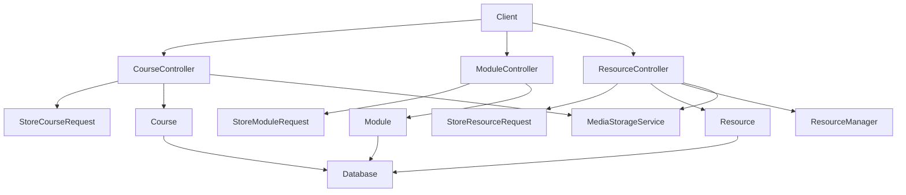
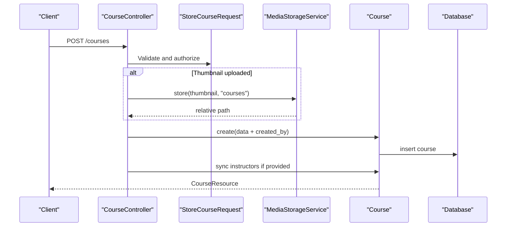
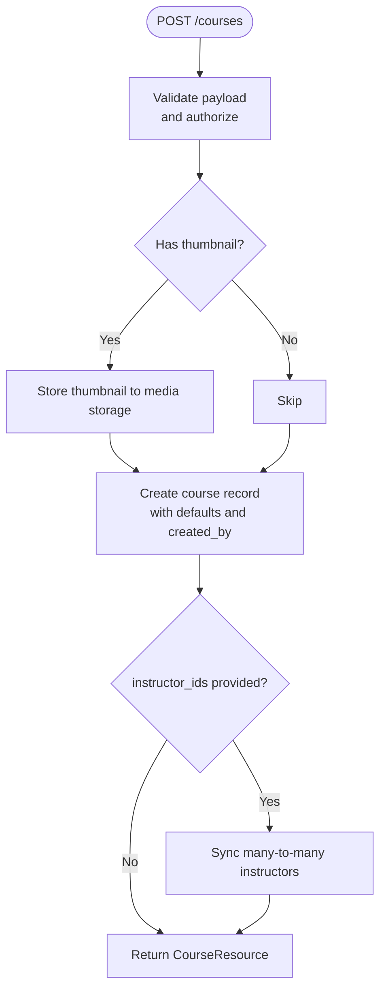
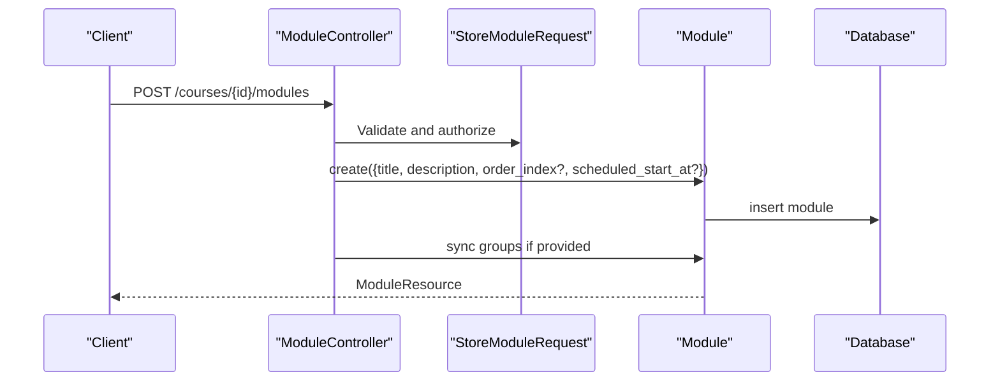
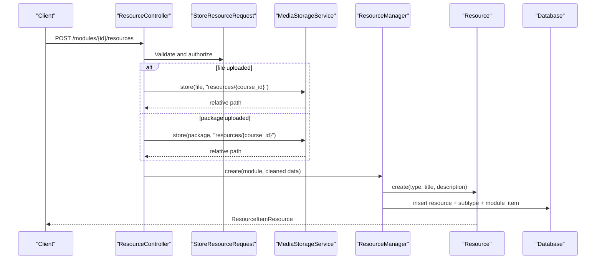
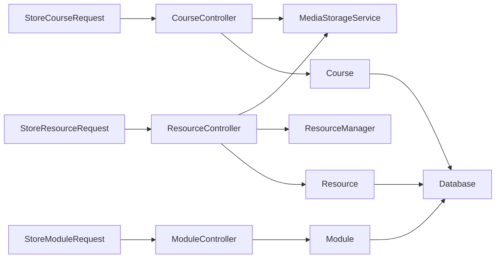

# Content Creation Workflows

<cite>
**Referenced Files in This Document**
- [CourseController.php](file://app/Http/Controllers/Api/V1/CourseController.php)
- [ModuleController.php](file://app/Http/Controllers/Api/V1/ModuleController.php)
- [ResourceController.php](file://app/Http/Controllers/Api/V1/ResourceController.php)
- [StoreCourseRequest.php](file://app/Http/Requests/Api/V1/StoreCourseRequest.php)
- [StoreModuleRequest.php](file://app/Http/Requests/Api/V1/StoreModuleRequest.php)
- [StoreResourceRequest.php](file://app/Http/Requests/Api/V1/StoreResourceRequest.php)
- [Course.php](file://app/Models/Course.php)
- [Module.php](file://app/Models/Module.php)
- [Resource.php](file://app/Models/Resource.php)
- [ResourceManager.php](file://app/Services/Content/ResourceManager.php)
- [MediaStorageService.php](file://app/Services/Storage/MediaStorageService.php)
- [2024_01_01_000030_create_courses_table.php](file://database/migrations/2024_01_01_000030_create_courses_table.php)
- [2024_01_01_000040_create_course_instructors_table.php](file://database/migrations/2024_01_01_000040_create_course_instructors_table.php)
- [2024_01_01_000100_create_modules_table.php](file://database/migrations/2024_01_01_000100_create_modules_table.php)
- [2024_01_01_000120_create_resources_table.php](file://database/migrations/2024_01_01_000120_create_resources_table.php)
- [2024_01_01_000150_create_module_items_table.php](file://database/migrations/2024_01_01_000150_create_module_items_table.php)
</cite>

## Table of Contents
1. Introduction
2. Project Structure
3. Core Components
4. Architecture Overview
5. Detailed Component Analysis
6. Dependency Analysis
7. Performance Considerations
8. Troubleshooting Guide
9. Conclusion

## Introduction
This document explains the end-to-end content creation workflows for courses, modules, and resources. It covers request validation, business logic enforcement, data relationships, file uploads, thumbnail management, instructor assignment, and error handling. The goal is to help you create a course with instructors, add modules to that course, and attach various resource types (videos, documents, readings, external links, SCORM packages, live sessions, downloadable files).

## Project Structure
The content creation features are implemented as REST endpoints under API V1 controllers, validated by dedicated Form Request classes, persisted via Eloquent models, and coordinated by services for content orchestration and media storage.

**Diagram sources**
- [CourseController.php:23-146](file://app/Http/Controllers/Api/V1/CourseController.php#L23-L146)
- [ModuleController.php:18-120](file://app/Http/Controllers/Api/V1/ModuleController.php#L18-L120)
- [ResourceController.php:18-85](file://app/Http/Controllers/Api/V1/ResourceController.php#L18-L85)
- [StoreCourseRequest.php:15-58](file://app/Http/Requests/Api/V1/StoreCourseRequest.php#L15-L58)
- [StoreModuleRequest.php:11-31](file://app/Http/Requests/Api/V1/StoreModuleRequest.php#L11-L31)
- [StoreResourceRequest.php:18-64](file://app/Http/Requests/Api/V1/StoreResourceRequest.php#L18-L64)
- [Course.php:17-179](file://app/Models/Course.php#L17-L179)
- [Module.php:15-85](file://app/Models/Module.php#L15-L85)
- [Resource.php:15-102](file://app/Models/Resource.php#L15-L102)
- [ResourceManager.php:28-179](file://app/Services/Content/ResourceManager.php#L28-L179)
- [MediaStorageService.php:24-85](file://app/Services/Storage/MediaStorageService.php#L24-L85)

**Section sources**
- [CourseController.php:23-146](file://app/Http/Controllers/Api/V1/CourseController.php#L23-L146)
- [ModuleController.php:18-120](file://app/Http/Controllers/Api/V1/ModuleController.php#L18-L120)
- [ResourceController.php:18-85](file://app/Http/Controllers/Api/V1/ResourceController.php#L18-L85)

## Core Components
- Course creation and updates handle metadata, optional thumbnail upload, and instructor assignment.
- Module creation attaches modules to a course with ordering and optional group targeting.
- Resource creation supports multiple types through a single endpoint; it persists type-specific details and keeps module item ordering consistent.
- MediaStorageService centralizes file uploads and URL resolution across the application.
- ResourceManager orchestrates creating/updating/deleting resources and their corresponding module items within transactions.

Key responsibilities:
- Validation rules enforce required fields per content type and constrain enums and sizes.
- Controllers coordinate persistence and side effects (e.g., thumbnails, change logs, notifications).
- Models define relationships and casts for enums and dates.
- Services encapsulate cross-cutting concerns like storage and content orchestration.

**Section sources**
- [StoreCourseRequest.php:22-58](file://app/Http/Requests/Api/V1/StoreCourseRequest.php#L22-L58)
- [StoreModuleRequest.php:18-31](file://app/Http/Requests/Api/V1/StoreModuleRequest.php#L18-L31)
- [StoreResourceRequest.php:25-64](file://app/Http/Requests/Api/V1/StoreResourceRequest.php#L25-L64)
- [CourseController.php:78-135](file://app/Http/Controllers/Api/V1/CourseController.php#L78-L135)
- [ModuleController.php:49-81](file://app/Http/Controllers/Api/V1/ModuleController.php#L49-L81)
- [ResourceController.php:30-66](file://app/Http/Controllers/Api/V1/ResourceController.php#L30-L66)
- [ResourceManager.php:33-96](file://app/Services/Content/ResourceManager.php#L33-L96)
- [MediaStorageService.php:32-79](file://app/Services/Storage/MediaStorageService.php#L32-L79)

## Architecture Overview
The content creation flow follows a layered approach:
- HTTP layer: Controllers receive requests and delegate to request validators and services.
- Validation layer: Form Request classes validate inputs and enforce authorization.
- Domain layer: Models represent entities and relationships.
- Service layer: ResourceManager and MediaStorageService implement business logic and infrastructure interactions.
- Persistence layer: Database tables store structured content and relationships.

**Diagram sources**
- [CourseController.php:78-98](file://app/Http/Controllers/Api/V1/CourseController.php#L78-L98)
- [StoreCourseRequest.php:17-58](file://app/Http/Requests/Api/V1/StoreCourseRequest.php#L17-L58)
- [MediaStorageService.php:32-41](file://app/Services/Storage/MediaStorageService.php#L32-L41)
- [Course.php:22-56](file://app/Models/Course.php#L22-L56)

## Detailed Component Analysis

### Create a Course with Instructors and Thumbnail
- Endpoint: POST /api/v1/courses
- Validation:
  - Required: title, level, price
  - Optional: category_id, slug (auto-generated from title if missing), description, enrolment_policy, application questions flags, thumbnail_url or thumbnail image, prerequisites_text, currency, confirmation_delay_hours, schedule_start_date, instructor_ids
  - Instructor IDs must exist in users table and have role = instructor
- Business logic:
  - Defaults enrolment_policy based on level when omitted
  - Stores thumbnail to media storage and saves relative path
  - Creates course with created_by set to current user
  - Syncs assigned instructors via many-to-many relationship
- Data relationships:
  - Courses belong to categories and have many modules, applications, orders, reviews, sections, question banks, announcements, tickets
  - Many-to-many with users via course_instructors pivot

**Diagram sources**
- [CourseController.php:78-98](file://app/Http/Controllers/Api/V1/CourseController.php#L78-L98)
- [StoreCourseRequest.php:22-58](file://app/Http/Requests/Api/V1/StoreCourseRequest.php#L22-L58)
- [MediaStorageService.php:32-41](file://app/Services/Storage/MediaStorageService.php#L32-L41)
- [Course.php:74-81](file://app/Models/Course.php#L74-L81)

**Section sources**
- [CourseController.php:78-98](file://app/Http/Controllers/Api/V1/CourseController.php#L78-L98)
- [StoreCourseRequest.php:22-58](file://app/Http/Requests/Api/V1/StoreCourseRequest.php#L22-L58)
- [Course.php:22-81](file://app/Models/Course.php#L22-L81)
- [2024_01_01_000030_create_courses_table.php:13-32](file://database/migrations/2024_01_01_000030_create_courses_table.php#L13-L32)
- [2024_01_01_000040_create_course_instructors_table.php:13-19](file://database/migrations/2024_01_01_000040_create_course_instructors_table.php#L13-L19)

### Add Modules to a Course
- Endpoint: POST /api/v1/courses/{course}/modules
- Validation:
  - Required: title
  - Optional: description, order_index, scheduled_start_at, group_ids (must belong to the same course)
- Business logic:
  - If order_index not provided, appends at the end of existing modules
  - Creates module under the specified course
  - Optionally assigns groups via many-to-many
- Data relationships:
  - Modules belong to a course and can be soft-deleted
  - Modules have many items, resources, assignments, evaluations
  - Many-to-many with groups_cohorts via module_groups

**Diagram sources**
- [ModuleController.php:49-66](file://app/Http/Controllers/Api/V1/ModuleController.php#L49-L66)
- [StoreModuleRequest.php:18-31](file://app/Http/Requests/Api/V1/StoreModuleRequest.php#L18-L31)
- [Module.php:22-52](file://app/Models/Module.php#L22-L52)
- [2024_01_01_000100_create_modules_table.php:13-22](file://database/migrations/2024_01_01_000100_create_modules_table.php#L13-L22)

**Section sources**
- [ModuleController.php:49-66](file://app/Http/Controllers/Api/V1/ModuleController.php#L49-L66)
- [StoreModuleRequest.php:18-31](file://app/Http/Requests/Api/V1/StoreModuleRequest.php#L18-L31)
- [Module.php:22-52](file://app/Models/Module.php#L22-L52)
- [2024_01_01_000100_create_modules_table.php:13-22](file://database/migrations/2024_01_01_000100_create_modules_table.php#L13-L22)

### Upload Resources to a Module
- Endpoint: POST /api/v1/modules/{module}/resources
- Validation:
  - Common: type (enum), title, description (optional), is_required (optional), order_index (optional)
  - Type-specific requirements:
    - video: bunny_stream_video_id (required), duration_seconds (optional), caption_url (optional)
    - document: file_url OR file upload (file takes precedence), file_type (pdf/pptx/docx), file_size_kb (optional)
    - reading: content_html (required)
    - external_link: url (required)
    - scorm: package_url OR package upload (package takes precedence), standard (scorm_1_2/scorm_2004/xapi)
    - live_session: provider (zoom/google_meet), meeting_url, scheduled_at, duration_minutes
- Business logic:
  - Handles file uploads for documents/downloadable files and SCORM packages via MediaStorageService
  - Delegates creation/update to ResourceManager which:
    - Persists Resource row
    - Persists type-specific detail row
    - Creates ModuleItem entry with order and required flag
    - Ensures atomicity via database transaction
- Data relationships:
  - Resources belong to a module and have one-of-many type-specific relations
  - ModuleItems link modules to resources (and other item types) with ordering and requirement flags

**Diagram sources**
- [ResourceController.php:30-46](file://app/Http/Controllers/Api/V1/ResourceController.php#L30-L46)
- [StoreResourceRequest.php:25-64](file://app/Http/Requests/Api/V1/StoreResourceRequest.php#L25-L64)
- [MediaStorageService.php:32-41](file://app/Services/Storage/MediaStorageService.php#L32-L41)
- [ResourceManager.php:33-58](file://app/Services/Content/ResourceManager.php#L33-L58)
- [Resource.php:20-29](file://app/Models/Resource.php#L20-L29)
- [2024_01_01_000120_create_resources_table.php:13-20](file://database/migrations/2024_01_01_000120_create_resources_table.php#L13-L20)
- [2024_01_01_000150_create_module_items_table.php:13-22](file://database/migrations/2024_01_01_000150_create_module_items_table.php#L13-L22)

**Section sources**
- [ResourceController.php:30-66](file://app/Http/Controllers/Api/V1/ResourceController.php#L30-L66)
- [StoreResourceRequest.php:25-64](file://app/Http/Requests/Api/V1/StoreResourceRequest.php#L25-L64)
- [ResourceManager.php:33-96](file://app/Services/Content/ResourceManager.php#L33-L96)
- [Resource.php:20-102](file://app/Models/Resource.php#L20-L102)
- [2024_01_01_000120_create_resources_table.php:13-20](file://database/migrations/2024_01_01_000120_create_resources_table.php#L13-L20)
- [2024_01_01_000150_create_module_items_table.php:13-22](file://database/migrations/2024_01_01_000150_create_module_items_table.php#L13-L22)

### Update and Delete Operations
- Course update:
  - Validates via UpdateCourseRequest (not shown here)
  - Replaces thumbnail if provided (deletes old file)
  - Updates instructors if provided
  - Increments version and logs changes when change_summary is provided
- Module update/delete:
  - Update validates via UpdateModuleRequest (not shown here)
  - Delete soft-deletes module and logs audit event
  - Restore restores soft-deleted module and logs audit event
- Resource update/delete:
  - Update validates via UpdateResourceRequest (not shown here)
  - Deletes previous file(s) before storing new ones
  - Delete removes both resource and its module item atomically

**Section sources**
- [CourseController.php:104-135](file://app/Http/Controllers/Api/V1/CourseController.php#L104-L135)
- [ModuleController.php:68-119](file://app/Http/Controllers/Api/V1/ModuleController.php#L68-L119)
- [ResourceController.php:48-84](file://app/Http/Controllers/Api/V1/ResourceController.php#L48-L84)

## Dependency Analysis
High-level dependencies among components involved in content creation:

**Diagram sources**
- [StoreCourseRequest.php:17-58](file://app/Http/Requests/Api/V1/StoreCourseRequest.php#L17-L58)
- [StoreModuleRequest.php:13-31](file://app/Http/Requests/Api/V1/StoreModuleRequest.php#L13-L31)
- [StoreResourceRequest.php:20-64](file://app/Http/Requests/Api/V1/StoreResourceRequest.php#L20-L64)
- [CourseController.php:23-146](file://app/Http/Controllers/Api/V1/CourseController.php#L23-L146)
- [ModuleController.php:18-120](file://app/Http/Controllers/Api/V1/ModuleController.php#L18-L120)
- [ResourceController.php:18-85](file://app/Http/Controllers/Api/V1/ResourceController.php#L18-L85)
- [MediaStorageService.php:24-85](file://app/Services/Storage/MediaStorageService.php#L24-L85)
- [ResourceManager.php:28-179](file://app/Services/Content/ResourceManager.php#L28-L179)
- [Course.php:17-179](file://app/Models/Course.php#L17-L179)
- [Module.php:15-85](file://app/Models/Module.php#L15-L85)
- [Resource.php:15-102](file://app/Models/Resource.php#L15-L102)

**Section sources**
- [CourseController.php:23-146](file://app/Http/Controllers/Api/V1/CourseController.php#L23-L146)
- [ModuleController.php:18-120](file://app/Http/Controllers/Api/V1/ModuleController.php#L18-L120)
- [ResourceController.php:18-85](file://app/Http/Controllers/Api/V1/ResourceController.php#L18-L85)
- [MediaStorageService.php:24-85](file://app/Services/Storage/MediaStorageService.php#L24-L85)
- [ResourceManager.php:28-179](file://app/Services/Content/ResourceManager.php#L28-L179)

## Performance Considerations
- Use batch operations where possible (e.g., syncing instructors and groups with sync() avoids N+1 updates).
- Prefer lazy loading with explicit eager loading for responses to reduce queries.
- Keep file uploads small and validate MIME types and sizes early to fail fast.
- Ensure indexes on frequently filtered columns (e.g., course_id, status, order_index) are present.
- Use transactions for multi-step writes to avoid partial state.

[No sources needed since this section provides general guidance]

## Troubleshooting Guide
Common issues and how to diagnose them:
- Validation errors:
  - Missing required fields or invalid enums will return validation failures from Form Requests. Check field names and allowed values.
  - For resources, ensure type-specific fields match the selected type.
- File upload failures:
  - Invalid MIME types or oversized files will be rejected by validation. Confirm allowed types and size limits.
  - Storage failures raise runtime exceptions; check disk configuration and permissions.
- Relationship constraints:
  - Instructor IDs must exist and have the correct role. Group IDs must belong to the same course.
  - Module items require valid item_type and item_id references.
- Soft deletes and restoration:
  - Deleted modules can be restored; ensure restore permissions and audit logging expectations are met.

Operational tips:
- Always include proper error handling around storage calls to surface meaningful messages.
- Log failed validations and storage operations for debugging.
- When updating resources, ensure old files are deleted before replacing to avoid orphaned storage entries.

**Section sources**
- [StoreCourseRequest.php:22-58](file://app/Http/Requests/Api/V1/StoreCourseRequest.php#L22-L58)
- [StoreModuleRequest.php:18-31](file://app/Http/Requests/Api/V1/StoreModuleRequest.php#L18-L31)
- [StoreResourceRequest.php:25-64](file://app/Http/Requests/Api/V1/StoreResourceRequest.php#L25-L64)
- [MediaStorageService.php:32-62](file://app/Services/Storage/MediaStorageService.php#L32-L62)
- [ModuleController.php:83-119](file://app/Http/Controllers/Api/V1/ModuleController.php#L83-L119)

## Conclusion
The content creation system provides a robust, validated, and service-driven workflow for building courses, organizing them into modules, and attaching diverse resources. Centralized storage and resource orchestration ensure consistency, while relational models and migrations define clear data boundaries. By following the validation rules and using the provided endpoints, you can reliably create and manage educational content with support for multimedia, interactive packages, and live sessions.

[No sources needed since this section summarizes without analyzing specific files]