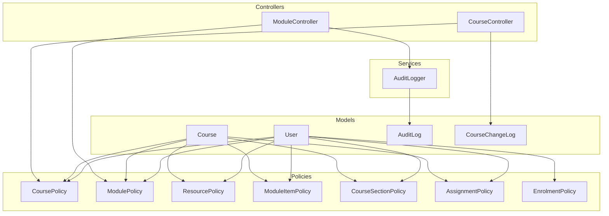
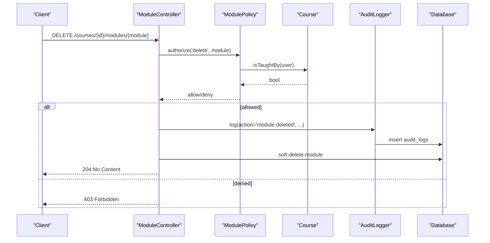
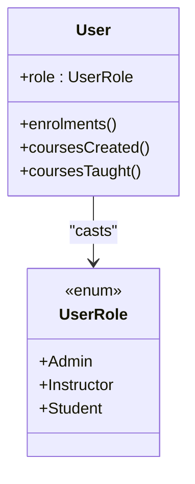
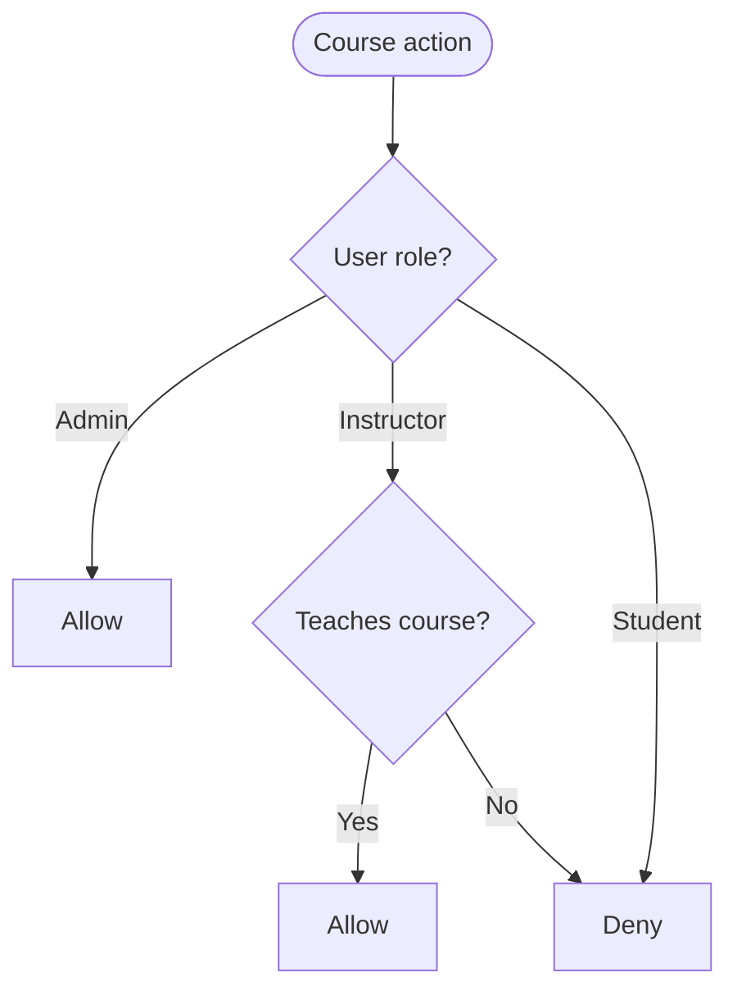
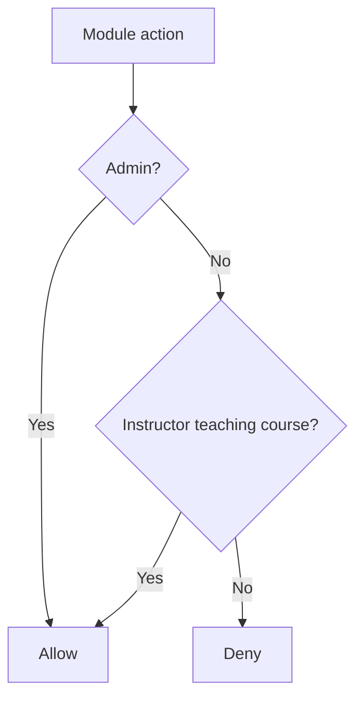
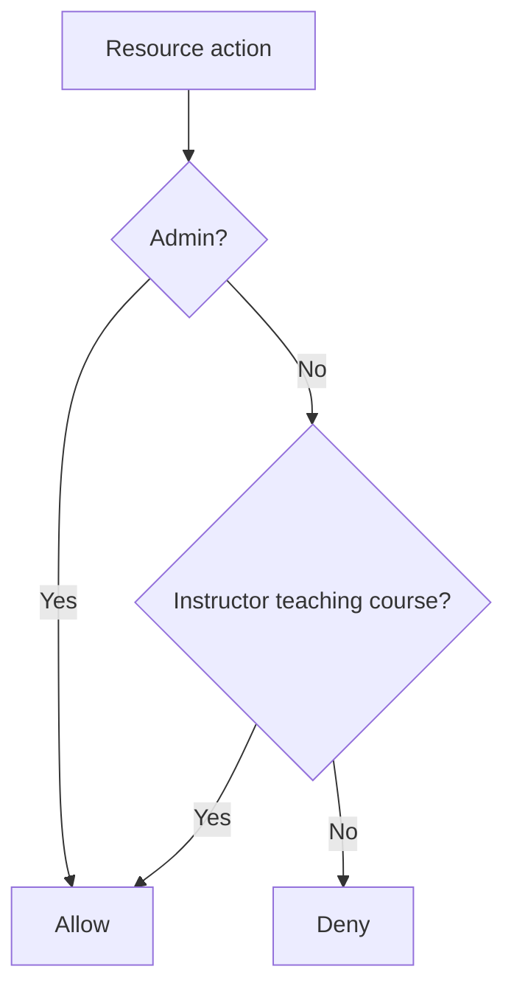
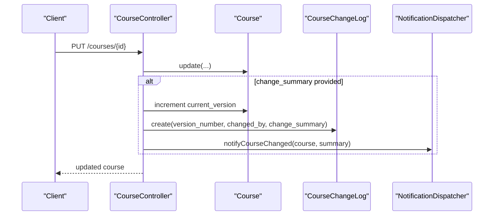
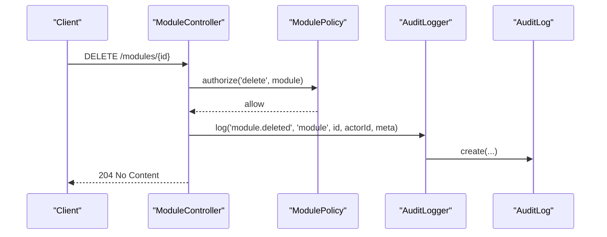
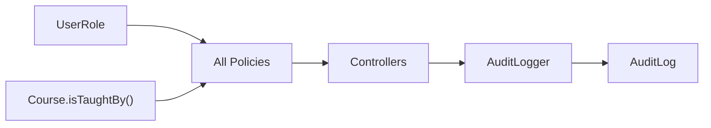

# Content Governance & Policies

<cite>
**Referenced Files in This Document**
- [CoursePolicy.php](file://app/Policies/CoursePolicy.php)
- [ModulePolicy.php](file://app/Policies/ModulePolicy.php)
- [ResourcePolicy.php](file://app/Policies/ResourcePolicy.php)
- [ModuleItemPolicy.php](file://app/Policies/ModuleItemPolicy.php)
- [CourseSectionPolicy.php](file://app/Policies/CourseSectionPolicy.php)
- [AssignmentPolicy.php](file://app/Policies/AssignmentPolicy.php)
- [EnrolmentPolicy.php](file://app/Policies/EnrolmentPolicy.php)
- [User.php](file://app/Models/User.php)
- [UserRole.php](file://app/Enums/UserRole.php)
- [Course.php](file://app/Models/Course.php)
- [AuditLog.php](file://app/Models/AuditLog.php)
- [CourseChangeLog.php](file://app/Models/CourseChangeLog.php)
- [AuditLogger.php](file://app\Services/Audit/AuditLogger.php)
- [AuditLogResource.php](file://app/Http/Resources/AuditLogResource.php)
- [CourseController.php](file://app/Http/Controllers/Api/V1/CourseController.php)
- [ModuleController.php](file://app/Http/Controllers/Api/V1/ModuleController.php)
</cite>

## Table of Contents
1. Introduction
2. Project Structure
3. Core Components
4. Architecture Overview
5. Detailed Component Analysis
6. Dependency Analysis
7. Performance Considerations
8. Troubleshooting Guide
9. Conclusion
10. Appendices

## Introduction
This document explains the content governance and authorization policies that control who can create, edit, publish, and delete courses, modules, module items, resources, sections, assignments, and enrolments. It details role-based access control (RBAC), policy implementation patterns, permission inheritance through course ownership, and how change logs and audit trails are maintained for compliance. It also provides guidance on implementing and extending policies while preserving data integrity across the system.

## Project Structure
Authorization is implemented using Laravel’s policy pattern:
- Policies define fine-grained permissions per domain model (course, module, resource, etc.).
- Controllers enforce policies before performing mutations.
- Roles are modeled as an enum and attached to users.
- Audit logging is centralized via a service and persisted with dedicated models.

**Diagram sources**
- [CoursePolicy.php:1-50](file://app/Policies/CoursePolicy.php#L1-L50)
- [ModulePolicy.php:1-39](file://app/Policies/ModulePolicy.php#L1-L39)
- [ResourcePolicy.php:1-44](file://app/Policies/ResourcePolicy.php#L1-L44)
- [ModuleItemPolicy.php:1-35](file://app/Policies/ModuleItemPolicy.php#L1-L35)
- [CourseSectionPolicy.php:1-50](file://app/Policies/CourseSectionPolicy.php#L1-L50)
- [AssignmentPolicy.php:1-44](file://app/Policies/AssignmentPolicy.php#L1-L44)
- [EnrolmentPolicy.php:1-44](file://app/Policies/EnrolmentPolicy.php#L1-L44)
- [User.php:1-100](file://app/Models/User.php#L1-L100)
- [Course.php:1-180](file://app/Models/Course.php#L1-L180)
- [AuditLog.php:1-39](file://app/Models/AuditLog.php#L1-L39)
- [CourseChangeLog.php:1-31](file://app/Models/CourseChangeLog.php#L1-L31)
- [AuditLogger.php:1-29](file://app/Services/Audit/AuditLogger.php#L1-L29)
- [CourseController.php:1-147](file://app/Http/Controllers/Api/V1/CourseController.php#L1-L147)
- [ModuleController.php:1-121](file://app/Http/Controllers/Api/V1/ModuleController.php#L1-L121)

**Section sources**
- [CoursePolicy.php:1-50](file://app/Policies/CoursePolicy.php#L1-L50)
- [ModulePolicy.php:1-39](file://app/Policies/ModulePolicy.php#L1-L39)
- [ResourcePolicy.php:1-44](file://app/Policies/ResourcePolicy.php#L1-L44)
- [ModuleItemPolicy.php:1-35](file://app/Policies/ModuleItemPolicy.php#L1-L35)
- [CourseSectionPolicy.php:1-50](file://app/Policies/CourseSectionPolicy.php#L1-L50)
- [AssignmentPolicy.php:1-44](file://app/Policies/AssignmentPolicy.php#L1-L44)
- [EnrolmentPolicy.php:1-44](file://app/Policies/EnrolmentPolicy.php#L1-L44)
- [User.php:1-100](file://app/Models/User.php#L1-L100)
- [Course.php:1-180](file://app/Models/Course.php#L1-L180)
- [AuditLog.php:1-39](file://app/Models/AuditLog.php#L1-L39)
- [CourseChangeLog.php:1-31](file://app/Models/CourseChangeLog.php#L1-L31)
- [AuditLogger.php:1-29](file://app/Services/Audit/AuditLogger.php#L1-L29)
- [CourseController.php:1-147](file://app/Http/Controllers/Api/V1/CourseController.php#L1-L147)
- [ModuleController.php:1-121](file://app/Http/Controllers/Api/V1/ModuleController.php#L1-L121)

## Core Components
- Role-based access control:
  - Users have a role from a strict enum (admin, instructor, student).
  - Policies check user roles and contextual relationships (e.g., whether an instructor teaches a course).
- Policy-per-domain-model:
  - Each major content type has a dedicated policy class defining create/update/delete/view methods.
- Permission inheritance:
  - Many policies delegate to a shared “can manage” check against the parent Course, enabling consistent admin/instructor rules across modules, resources, and module items.
- Audit and change tracking:
  - Sensitive mutations log to a centralized audit trail.
  - Course updates optionally record versioned change summaries.

**Section sources**
- [UserRole.php:1-13](file://app/Enums/UserRole.php#L1-L13)
- [User.php:1-100](file://app/Models/User.php#L1-L100)
- [Course.php:163-179](file://app/Models/Course.php#L163-L179)
- [ModulePolicy.php:34-37](file://app/Policies/ModulePolicy.php#L34-L37)
- [ResourcePolicy.php:39-42](file://app/Policies/ResourcePolicy.php#L39-L42)
- [ModuleItemPolicy.php:30-33](file://app/Policies/ModuleItemPolicy.php#L30-L33)
- [AuditLogger.php:15-27](file://app/Services/Audit/AuditLogger.php#L15-L27)
- [CourseController.php:104-135](file://app/Http/Controllers/Api/V1/CourseController.php#L104-L135)

## Architecture Overview
The authorization flow combines RBAC with context-aware checks:
- Controllers call $this->authorize() to enforce policies before mutating content.
- Policies evaluate the current user’s role and relationship to the target entity (often via the parent Course).
- Mutations may trigger audit logging or change log entries for compliance.

**Diagram sources**
- [ModuleController.php:83-98](file://app/Http/Controllers/Api/V1/ModuleController.php#L83-L98)
- [ModulePolicy.php:24-37](file://app/Policies/ModulePolicy.php#L24-L37)
- [Course.php:171-179](file://app/Models/Course.php#L171-L179)
- [AuditLogger.php:15-27](file://app/Services/Audit/AuditLogger.php#L15-L27)
- [AuditLog.php:19-29](file://app/Models/AuditLog.php#L19-L29)

## Detailed Component Analysis

### Authorization Model and Roles
- Roles:
  - Admin: broad administrative privileges across content.
  - Instructor: scoped to courses they teach; cannot act as admin.
  - Student: limited to learner actions (e.g., self-enrolment).
- User model casts role to the UserRole enum and exposes relationships used by policies.

**Diagram sources**
- [User.php:24-55](file://app/Models/User.php#L24-L55)
- [UserRole.php:7-12](file://app/Enums/UserRole.php#L7-L12)

**Section sources**
- [User.php:1-100](file://app/Models/User.php#L1-L100)
- [UserRole.php:1-13](file://app/Enums/UserRole.php#L1-L13)

### Course Management Policies
- Create: only admins.
- Update: admins or instructors teaching the course.
- Delete: only admins.
- View gradebook/analytics: admins or instructors teaching the course.

**Diagram sources**
- [CoursePolicy.php:13-48](file://app/Policies/CoursePolicy.php#L13-L48)

**Section sources**
- [CoursePolicy.php:1-50](file://app/Policies/CoursePolicy.php#L1-L50)

### Module Editing Policies
- Create/update/delete/restore: require ability to manage the parent course (admin or teaching instructor).
- Soft-deleted modules can be restored by those with restore permission.

**Diagram sources**
- [ModulePolicy.php:14-37](file://app/Policies/ModulePolicy.php#L14-L37)

**Section sources**
- [ModulePolicy.php:1-39](file://app/Policies/ModulePolicy.php#L1-L39)

### Resource Operations Policies
- Create/update/delete: require ability to manage the parent course (via module).
- Specialized viewAttendance: same audience as managing the resource.

**Diagram sources**
- [ResourcePolicy.php:15-42](file://app/Policies/ResourcePolicy.php#L15-L42)

**Section sources**
- [ResourcePolicy.php:1-44](file://app/Policies/ResourcePolicy.php#L1-L44)

### Module Item Policies
- Create/update/delete: require ability to manage the parent course (via module).

**Section sources**
- [ModuleItemPolicy.php:1-35](file://app/Policies/ModuleItemPolicy.php#L1-L35)

### Course Section Policies
- ViewAny: admin or instructor.
- View/update/delete: admin or instructor teaching the section’s course.

**Section sources**
- [CourseSectionPolicy.php:1-50](file://app/Policies/CourseSectionPolicy.php#L1-L50)

### Assignment Policies
- Create/update/delete/grade: require ability to manage the assignment’s course (admin or teaching instructor).

**Section sources**
- [AssignmentPolicy.php:1-44](file://app/Policies/AssignmentPolicy.php#L1-L44)

### Enrolment Policies
- Create: students can self-enrol.
- View: admins or the enrolled student.
- Import: admins only.
- Withdraw: admins or the enrolled student.

**Section sources**
- [EnrolmentPolicy.php:1-44](file://app/Policies/EnrolmentPolicy.php#L1-L44)

### Change Log Tracking and Audit Trails
- Course changes:
  - Updates increment a version counter and optionally record a change summary in a dedicated changelog table linked to the course and the actor.
  - Notifications may be dispatched when changes occur.
- Module lifecycle:
  - Deletion and restoration are logged via a centralized audit logger with actor, action, entity type/id, and metadata.
- Audit model:
  - Stores actor_id, action, entity_type, entity_id, and structured meta.
  - Exposed via a JSON resource for API consumption.

**Diagram sources**
- [CourseController.php:104-135](file://app/Http/Controllers/Api/V1/CourseController.php#L104-L135)
- [CourseChangeLog.php:14-29](file://app/Models/CourseChangeLog.php#L14-L29)

**Diagram sources**
- [ModuleController.php:83-98](file://app/Http/Controllers/Api/V1/ModuleController.php#L83-L98)
- [AuditLogger.php:15-27](file://app/Services/Audit/AuditLogger.php#L15-L27)
- [AuditLog.php:19-29](file://app/Models/AuditLog.php#L19-L29)

**Section sources**
- [CourseController.php:104-135](file://app/Http/Controllers/Api/V1/CourseController.php#L104-L135)
- [CourseChangeLog.php:1-31](file://app/Models/CourseChangeLog.php#L1-L31)
- [ModuleController.php:83-118](file://app/Http/Controllers/Api/V1/ModuleController.php#L83-L118)
- [AuditLogger.php:1-29](file://app/Services/Audit/AuditLogger.php#L1-L29)
- [AuditLog.php:1-39](file://app/Models/AuditLog.php#L1-L39)
- [AuditLogResource.php:15-25](file://app/Http/Resources/AuditLogResource.php#L15-L25)

### Compliance Requirements
- Immutable audit trail:
  - All sensitive mutations are recorded with actor, action, entity identity, and metadata.
- Versioned course changes:
  - Course updates can be versioned with summaries for traceability.
- Least privilege:
  - Students cannot modify content; instructors are scoped to their courses; admins have broad control.

[No sources needed since this section summarizes without analyzing specific files]

## Dependency Analysis
Key dependencies and coupling:
- Policies depend on:
  - UserRole enum for role checks.
  - Course model method isTaughtBy() for instructor scoping.
- Controllers depend on:
  - Policies via $this->authorize().
  - AuditLogger for audit events.
  - Models for persistence and relations.

**Diagram sources**
- [UserRole.php:7-12](file://app/Enums/UserRole.php#L7-L12)
- [Course.php:171-179](file://app/Models/Course.php#L171-L179)
- [CoursePolicy.php:13-48](file://app/Policies/CoursePolicy.php#L13-L48)
- [ModulePolicy.php:34-37](file://app/Policies/ModulePolicy.php#L34-L37)
- [ResourcePolicy.php:39-42](file://app/Policies/ResourcePolicy.php#L39-L42)
- [ModuleController.php:83-98](file://app/Http/Controllers/Api/V1/ModuleController.php#L83-L98)
- [AuditLogger.php:15-27](file://app/Services/Audit/AuditLogger.php#L15-L27)

**Section sources**
- [UserRole.php:1-13](file://app/Enums/UserRole.php#L1-L13)
- [Course.php:163-179](file://app/Models/Course.php#L163-L179)
- [CoursePolicy.php:1-50](file://app/Policies/CoursePolicy.php#L1-L50)
- [ModulePolicy.php:1-39](file://app/Policies/ModulePolicy.php#L1-L39)
- [ResourcePolicy.php:1-44](file://app/Policies/ResourcePolicy.php#L1-L44)
- [ModuleController.php:83-98](file://app/Http/Controllers/Api/V1/ModuleController.php#L83-L98)
- [AuditLogger.php:1-29](file://app/Services/Audit/AuditLogger.php#L1-L29)

## Performance Considerations
- Policy checks are lightweight boolean evaluations over in-memory role and simple relation existence checks.
- Avoid N+1 queries by eager-loading related entities where necessary in controllers/resources.
- Keep audit logging synchronous for critical paths to ensure consistency; consider batching if high volume.

[No sources needed since this section provides general guidance]

## Troubleshooting Guide
Common issues and resolutions:
- 403 Forbidden on module/resource operations:
  - Verify the user’s role and whether they are assigned as an instructor to the course.
  - Ensure the policy method being invoked matches the controller’s authorize call.
- Missing audit entries:
  - Confirm the controller invokes the audit logger after successful authorization and mutation.
  - Validate that the actor ID is present in the request context.
- Course change logs not created:
  - Ensure the update endpoint receives a change_summary and that version incrementing occurs before creating the changelog entry.

**Section sources**
- [ModuleController.php:83-98](file://app/Http/Controllers/Api/V1/ModuleController.php#L83-L98)
- [CourseController.php:104-135](file://app/Http/Controllers/Api/V1/CourseController.php#L104-L135)
- [AuditLogger.php:15-27](file://app/Services/Audit/AuditLogger.php#L15-L27)

## Conclusion
The system enforces clear, role-scoped content governance through explicit policies and centralized audit logging. Admins have broad control, instructors are scoped to their courses, and students are restricted to learner actions. Changes to courses are versioned and auditable, while module deletions and restorations are tracked for compliance. Extending policies should follow the established patterns: use role checks, leverage Course.isTaughtBy() for scoping, and log all sensitive mutations.

[No sources needed since this section summarizes without analyzing specific files]

## Appendices

### Implementing Custom Policies
- Create a new policy class under app/Policies with methods matching intended actions (create, update, delete, view*).
- Use the shared pattern:
  - Admin bypass.
  - Instructor scope via Course.isTaughtBy().
- Register and invoke via $this->authorize() in controllers.

**Section sources**
- [CoursePolicy.php:13-48](file://app/Policies/CoursePolicy.php#L13-L48)
- [ModulePolicy.php:34-37](file://app/Policies/ModulePolicy.php#L34-L37)
- [ResourcePolicy.php:39-42](file://app/Policies/ResourcePolicy.php#L39-L42)

### Extending Existing Policies
- Add new capability methods (e.g., publish, unpublish) following the same role/scoping logic.
- Ensure controllers enforce these new methods before performing state transitions.
- If the operation is sensitive, add audit logging via AuditLogger.

**Section sources**
- [CoursePolicy.php:32-48](file://app/Policies/CoursePolicy.php#L32-L48)
- [ModuleController.php:83-118](file://app/Http/Controllers/Api/V1/ModuleController.php#L83-L118)
- [AuditLogger.php:15-27](file://app/Services/Audit/AuditLogger.php#L15-L27)

### Maintaining Content Integrity
- Always enforce policies before mutations.
- Record audit events for destructive or sensitive actions.
- For courses, maintain versioned change logs with summaries to preserve history and support rollback decisions.

**Section sources**
- [CourseController.php:104-135](file://app/Http/Controllers/Api/V1/CourseController.php#L104-L135)
- [ModuleController.php:83-118](file://app/Http/Controllers/Api/V1/ModuleController.php#L83-L118)
- [AuditLog.php:19-29](file://app/Models/AuditLog.php#L19-L29)