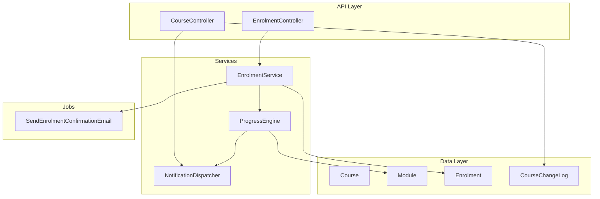
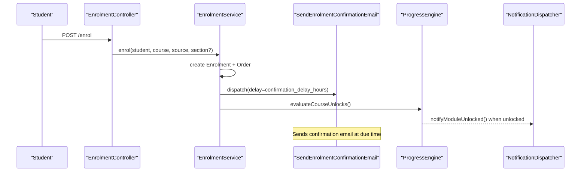
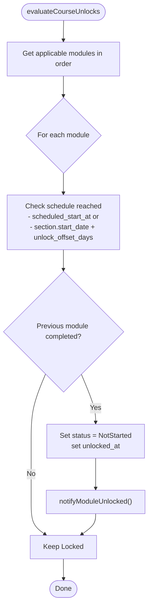
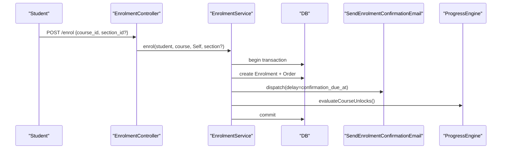
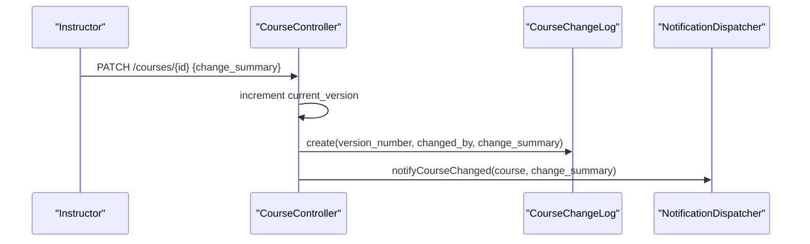
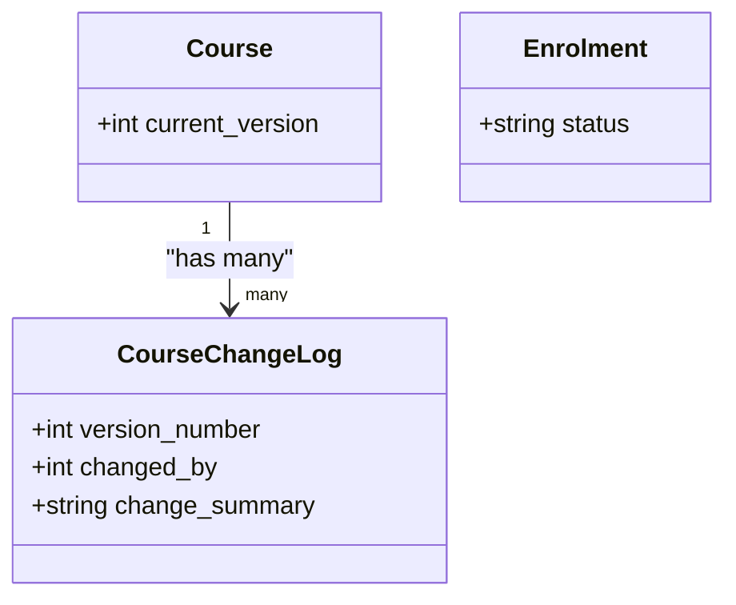
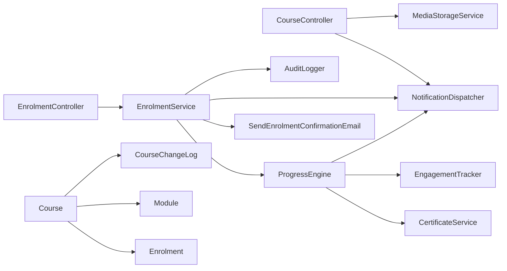

# Content Publishing Workflows

<cite>
**Referenced Files in This Document**
- [CourseController.php](file://app/Http/Controllers/Api/V1/CourseController.php)
- [EnrolmentController.php](file://app/Http/Controllers/Api/V1/EnrolmentController.php)
- [EnrolmentService.php](file://app/Services/Enrolment/EnrolmentService.php)
- [ProgressEngine.php](file://app/Services/Progress/ProgressEngine.php)
- [NotificationDispatcher.php](file://app/Services/Notifications/NotificationDispatcher.php)
- [SendEnrolmentConfirmationEmail.php](file://app/Jobs/SendEnrolmentConfirmationEmail.php)
- [Course.php](file://app/Models/Course.php)
- [Module.php](file://app/Models/Module.php)
- [Enrolment.php](file://app/Models/Enrolment.php)
- [CourseChangeLog.php](file://app/Models/CourseChangeLog.php)
- [CourseStatus.php](file://app/Enums/CourseStatus.php)
- [EnrolmentStatus.php](file://app/Enums/EnrolmentStatus.php)
</cite>

## Table of Contents
1. Introduction
2. Project Structure
3. Core Components
4. Architecture Overview
5. Detailed Component Analysis
6. Dependency Analysis
7. Performance Considerations
8. Troubleshooting Guide
9. Conclusion
10. Appendices

## Introduction
This document explains how content moves from draft to published states and how those changes affect enrolled students. It covers:
- Status management for courses and modules
- Module unlocking mechanisms (sequential and scheduled)
- Enrollment confirmation processes and notifications
- Versioning, change logs, and audit trails for published content
- Practical workflows for publishing, scheduling, bulk operations, and rollback strategies

The system enforces that course edits apply immediately to enrolled students; versioning is tracked via a changelog rather than snapshots. Module unlocking is strictly sequential with optional time-gating per module.

## Project Structure
At a high level, publishing and enrollment are implemented across controllers, services, models, jobs, and enums:
- Controllers expose API endpoints for course updates and enrollment
- Services encapsulate business logic for enrollment, progress evaluation, and notifications
- Models define entities such as Course, Module, Enrolment, and ChangeLog
- Jobs handle delayed email delivery
- Enums define status values for courses and enrollments

**Diagram sources**
- [CourseController.php:30-136](file://app/Http/Controllers/Api/V1/CourseController.php#L30-L136)
- [EnrolmentController.php:24-74](file://app/Http/Controllers/Api/V1/EnrolmentController.php#L24-L74)
- [EnrolmentService.php:44-248](file://app/Services/Enrolment/EnrolmentService.php#L44-L248)
- [ProgressEngine.php:50-151](file://app/Services/Progress/ProgressEngine.php#L50-L151)
- [NotificationDispatcher.php:27-38](file://app/Services/Notifications/NotificationDispatcher.php#L27-L38)
- [SendEnrolmentConfirmationEmail.php:37-48](file://app/Jobs/SendEnrolmentConfirmationEmail.php#L37-L48)
- [Course.php:22-56](file://app/Models/Course.php#L22-L56)
- [Module.php:22-34](file://app/Models/Module.php#L22-L34)
- [Enrolment.php:22-40](file://app/Models/Enrolment.php#L22-L40)
- [CourseChangeLog.php:14-19](file://app/Models/CourseChangeLog.php#L14-L19)

**Section sources**
- [CourseController.php:30-136](file://app/Http/Controllers/Api/V1/CourseController.php#L30-L136)
- [EnrolmentController.php:24-74](file://app/Http/Controllers/Api/V1/EnrolmentController.php#L24-L74)
- [EnrolmentService.php:44-248](file://app/Services/Enrolment/EnrolmentService.php#L44-L248)
- [ProgressEngine.php:50-151](file://app/Services/Progress/ProgressEngine.php#L50-L151)
- [NotificationDispatcher.php:27-38](file://app/Services/Notifications/NotificationDispatcher.php#L27-L38)
- [SendEnrolmentConfirmationEmail.php:37-48](file://app/Jobs/SendEnrolmentConfirmationEmail.php#L37-L48)
- [Course.php:22-56](file://app/Models/Course.php#L22-L56)
- [Module.php:22-34](file://app/Models/Module.php#L22-L34)
- [Enrolment.php:22-40](file://app/Models/Enrolment.php#L22-L40)
- [CourseChangeLog.php:14-19](file://app/Models/CourseChangeLog.php#L14-L19)

## Core Components
- Course status controls visibility: only published courses appear to students in the catalogue; instructors can see their own courses regardless of status.
- Module unlocking is governed by ProgressEngine using both sequential completion and scheduled release rules.
- Enrollment creates an order, queues a delayed confirmation email, and initializes module unlocks.
- Course updates increment version and create a change log entry; enrolled students are notified of changes.

Key responsibilities:
- CourseController: filters catalogue by status, handles update with versioning and notifications
- EnrolmentService: manages enrollment lifecycle, waitlisting, promotions, orders, emails, and progress initialization
- ProgressEngine: evaluates unlocks, rolls up module completion, issues certificates on last module completion
- NotificationDispatcher: centralizes in-app notification creation for events like course updates and module unlocks
- SendEnrolmentConfirmationEmail: idempotent job that sends confirmation after configured delay

**Section sources**
- [CourseController.php:33-70](file://app/Http/Controllers/Api/V1/CourseController.php#L33-L70)
- [CourseController.php:104-136](file://app/Http/Controllers/Api/V1/CourseController.php#L104-L136)
- [EnrolmentService.php:44-148](file://app/Services/Enrolment/EnrolmentService.php#L44-L148)
- [EnrolmentService.php:208-248](file://app/Services/Enrolment/EnrolmentService.php#L208-L248)
- [ProgressEngine.php:50-151](file://app/Services/Progress/ProgressEngine.php#L50-L151)
- [NotificationDispatcher.php:27-38](file://app/Services/Notifications/NotificationDispatcher.php#L27-L38)
- [SendEnrolmentConfirmationEmail.php:37-48](file://app/Jobs/SendEnrolmentConfirmationEmail.php#L37-L48)

## Architecture Overview
The publishing workflow spans three main flows:
- Catalogue visibility: CourseController filters by CourseStatus so only published courses are visible to students
- Enrollment and confirmation: EnrolmentController delegates to EnrolmentService, which creates enrolment/order, schedules confirmation email, and triggers unlock evaluation
- Module unlocking: ProgressEngine evaluates schedule and prerequisites to transition modules from locked to not started and eventually completed

**Diagram sources**
- [EnrolmentController.php:43-61](file://app/Http/Controllers/Api/V1/EnrolmentController.php#L43-L61)
- [EnrolmentService.php:44-148](file://app/Services/Enrolment/EnrolmentService.php#L44-L148)
- [ProgressEngine.php:50-81](file://app/Services/Progress/ProgressEngine.php#L50-L81)
- [NotificationDispatcher.php:27-38](file://app/Services/Notifications/NotificationDispatcher.php#L27-L38)
- [SendEnrolmentConfirmationEmail.php:37-48](file://app/Jobs/SendEnrolmentConfirmationEmail.php#L37-L48)

## Detailed Component Analysis

### Course Visibility and Publishing Controls
- Students see only courses with status Published in the catalogue
- Instructors can see their own courses even if not Published
- Admins can filter by any status

Publishing itself is represented by CourseStatus. The controller enforces these visibility rules during listing.

**Section sources**
- [CourseController.php:33-70](file://app/Http/Controllers/Api/V1/CourseController.php#L33-L70)
- [CourseStatus.php:7-12](file://app/Enums/CourseStatus.php#L7-L12)

### Module Unlocking Mechanisms
Unlocking is driven by two conditions:
- Schedule reached: either module.scheduled_start_at has passed or, for sections, section.start_date plus module.unlock_offset_days has passed
- Previous applicable module completed

When both are true, a module transitions from Locked to NotStarted and a notification is sent. Completion of required items rolls up to Completed and triggers evaluation for the next module.

**Diagram sources**
- [ProgressEngine.php:50-81](file://app/Services/Progress/ProgressEngine.php#L50-L81)
- [ProgressEngine.php:89-99](file://app/Services/Progress/ProgressEngine.php#L89-L99)

**Section sources**
- [ProgressEngine.php:50-151](file://app/Services/Progress/ProgressEngine.php#L50-L151)
- [Module.php:22-34](file://app/Models/Module.php#L22-L34)

### Enrollment Confirmation Process
Self-enrollment flow:
- EnrolmentController validates policy and delegates to EnrolmentService
- Service creates Enrolment and Order, sets confirmation due time based on course.confirmation_delay_hours
- Queues SendEnrolmentConfirmationEmail with unique id to prevent duplicates
- Initializes module unlocks for the student

**Diagram sources**
- [EnrolmentController.php:43-61](file://app/Http/Controllers/Api/V1/EnrolmentController.php#L43-L61)
- [EnrolmentService.php:44-148](file://app/Services/Enrolment/EnrolmentService.php#L44-L148)
- [SendEnrolmentConfirmationEmail.php:37-48](file://app/Jobs/SendEnrolmentConfirmationEmail.php#L37-L48)
- [ProgressEngine.php:50-81](file://app/Services/Progress/ProgressEngine.php#L50-L81)

**Section sources**
- [EnrolmentController.php:43-61](file://app/Http/Controllers/Api/V1/EnrolmentController.php#L43-L61)
- [EnrolmentService.php:44-148](file://app/Services/Enrolment/EnrolmentService.php#L44-L148)
- [SendEnrolmentConfirmationEmail.php:37-48](file://app/Jobs/SendEnrolmentConfirmationEmail.php#L37-L48)

### Notifications When Content Changes
- Course updates with a change summary increment current_version, persist a CourseChangeLog, and notify affected users via NotificationDispatcher
- Module unlocks trigger in-app notifications through NotificationDispatcher
- Frontend maps notification types to user-friendly labels

**Diagram sources**
- [CourseController.php:104-136](file://app/Http/Controllers/Api/V1/CourseController.php#L104-L136)
- [CourseChangeLog.php:14-19](file://app/Models/CourseChangeLog.php#L14-L19)
- [NotificationDispatcher.php:27-38](file://app/Services/Notifications/NotificationDispatcher.php#L27-L38)

**Section sources**
- [CourseController.php:104-136](file://app/Http/Controllers/Api/V1/CourseController.php#L104-L136)
- [CourseChangeLog.php:14-19](file://app/Models/CourseChangeLog.php#L14-L19)
- [NotificationDispatcher.php:27-38](file://app/Services/Notifications/NotificationDispatcher.php#L27-L38)

### Versioning Strategy, Change Logs, and Audit Trails
- Versioning: Course.current_version increments on each update that includes a change summary
- Change logs: CourseChangeLog records version_number, changed_by, and change_summary
- Audit trail: Enrolment mutations (confirm, withdraw, promote) are logged via AuditLogger with actor and metadata

**Diagram sources**
- [Course.php:22-56](file://app/Models/Course.php#L22-L56)
- [CourseChangeLog.php:14-19](file://app/Models/CourseChangeLog.php#L14-L19)
- [Enrolment.php:22-40](file://app/Models/Enrolment.php#L22-L40)

**Section sources**
- [CourseController.php:104-136](file://app/Http/Controllers/Api/V1/CourseController.php#L104-L136)
- [CourseChangeLog.php:14-19](file://app/Models/CourseChangeLog.php#L14-L19)
- [EnrolmentService.php:157-199](file://app/Services/Enrolment/EnrolmentService.php#L157-L199)

### Concrete Publishing Workflow Examples

#### Example 1: Publish a Course and Update Content
- Set Course.status to Published so it appears in the student catalogue
- Update course details with a change_summary to increment version and record a change log
- Enrolled students receive a notification about the course update

Implications for enrolled students:
- They can access the course if they are enrolled
- Any content changes apply immediately; history is preserved in change logs

**Section sources**
- [CourseController.php:33-70](file://app/Http/Controllers/Api/V1/CourseController.php#L33-L70)
- [CourseController.php:104-136](file://app/Http/Controllers/Api/V1/CourseController.php#L104-L136)

#### Example 2: Schedule Module Releases
- Set module.scheduled_start_at to gate access until a specific date/time
- Or use module.unlock_offset_days with a section’s start_date to compute unlock timing
- ProgressEngine will unlock modules when schedule is reached and previous module is complete

Implications for enrolled students:
- Modules remain locked until conditions are met
- Students receive a notification when a module becomes available

**Section sources**
- [Module.php:22-34](file://app/Models/Module.php#L22-L34)
- [ProgressEngine.php:50-99](file://app/Services/Progress/ProgressEngine.php#L50-L99)

#### Example 3: Confirm Enrollment and Trigger Unlocks
- Student enrolls via EnrolmentController → EnrolmentService
- System creates Enrolment and Order, schedules confirmation email, and evaluates unlocks
- If eligible, modules transition to NotStarted and students are notified

**Section sources**
- [EnrolmentController.php:43-61](file://app/Http/Controllers/Api/V1/EnrolmentController.php#L43-L61)
- [EnrolmentService.php:44-148](file://app/Services/Enrolment/EnrolmentService.php#L44-L148)
- [ProgressEngine.php:50-81](file://app/Services/Progress/ProgressEngine.php#L50-L81)

### Bulk Publishing Operations
- Catalogue filtering supports instructor-scoped queries and admin filters by status
- To publish multiple courses, perform batch updates to set Course.status to Published and include change summaries where appropriate to generate change logs and notifications

Operational guidance:
- Use administrative tools or scripts to update multiple courses
- Ensure change summaries are provided to maintain versioning and notifications

**Section sources**
- [CourseController.php:33-70](file://app/Http/Controllers/Api/V1/CourseController.php#L33-L70)
- [CourseController.php:104-136](file://app/Http/Controllers/Api/V1/CourseController.php#L104-L136)

### Scheduled Publishing
- Module-level scheduling uses module.scheduled_start_at or section-relative offsets
- Evaluation runs on-demand and can be triggered by scheduled tasks to ensure timely unlocks

Operational guidance:
- Configure module.scheduled_start_at for precise release times
- Ensure evaluation runs periodically to unlock modules as dates pass

**Section sources**
- [ProgressEngine.php:50-99](file://app/Services/Progress/ProgressEngine.php#L50-L99)

### Rollback Procedures for Published Content
- There is no snapshot-based rollback; edits apply immediately
- Maintain rollback safety by:
  - Providing clear change_summary entries to track what changed
  - Using CourseChangeLog to review versions and revert manually if needed
  - Auditing enrolment state changes to understand side effects

Operational guidance:
- Revert content by updating fields back to prior values and recording a new change log entry
- Communicate changes to students via notifications

**Section sources**
- [CourseController.php:104-136](file://app/Http/Controllers/Api/V1/CourseController.php#L104-L136)
- [CourseChangeLog.php:14-19](file://app/Models/CourseChangeLog.php#L14-L19)

## Dependency Analysis
Key dependencies and relationships:
- CourseController depends on NotificationDispatcher and MediaStorageService for updates and thumbnails
- EnrolmentController depends on EnrolmentService for enrollment logic
- EnrolmentService depends on AuditLogger, ProgressEngine, NotificationDispatcher, and queue jobs
- ProgressEngine depends on CertificateService, NotificationDispatcher, and EngagementTracker
- Models define relationships between Course, Module, Enrolment, and ChangeLog

**Diagram sources**
- [CourseController.php:25-28](file://app/Http/Controllers/Api/V1/CourseController.php#L25-L28)
- [EnrolmentController.php:20-22](file://app/Http/Controllers/Api/V1/EnrolmentController.php#L20-L22)
- [EnrolmentService.php:32-36](file://app/Services/Enrolment/EnrolmentService.php#L32-L36)
- [ProgressEngine.php:35-39](file://app/Services/Progress/ProgressEngine.php#L35-L39)
- [Course.php:83-121](file://app/Models/Course.php#L83-L121)
- [CourseChangeLog.php:21-29](file://app/Models/CourseChangeLog.php#L21-L29)

**Section sources**
- [CourseController.php:25-28](file://app/Http/Controllers/Api/V1/CourseController.php#L25-L28)
- [EnrolmentController.php:20-22](file://app/Http/Controllers/Api/V1/EnrolmentController.php#L20-L22)
- [EnrolmentService.php:32-36](file://app/Services/Enrolment/EnrolmentService.php#L32-L36)
- [ProgressEngine.php:35-39](file://app/Services/Progress/ProgressEngine.php#L35-L39)
- [Course.php:83-121](file://app/Models/Course.php#L83-L121)
- [CourseChangeLog.php:21-29](file://app/Models/CourseChangeLog.php#L21-L29)

## Performance Considerations
- Enrollment transactions use pessimistic locking for section capacity checks to avoid race conditions
- Module unlock evaluation is idempotent and safe to run repeatedly
- Email dispatch uses unique job IDs to prevent duplicate sends
- Avoid excessive polling by relying on on-demand evaluation and scheduled tasks for unlocks

[No sources needed since this section provides general guidance]

## Troubleshooting Guide
Common issues and resolutions:
- Module not unlocking: verify schedule conditions and previous module completion; check ProgressEngine evaluation
- Duplicate confirmation emails: ensure job uniqueness and idempotency; confirm confirmation_email_sent_at is set
- Enrollment conflicts: check for existing self-paced confirmed enrolments and section requirements
- Visibility problems: confirm Course.status is Published for student-facing listings

**Section sources**
- [ProgressEngine.php:50-99](file://app/Services/Progress/ProgressEngine.php#L50-L99)
- [SendEnrolmentConfirmationEmail.php:37-48](file://app/Jobs/SendEnrolmentConfirmationEmail.php#L37-L48)
- [EnrolmentService.php:72-93](file://app/Services/Enrolment/EnrolmentService.php#L72-L93)
- [CourseController.php:33-70](file://app/Http/Controllers/Api/V1/CourseController.php#L33-L70)

## Conclusion
Content publishing in this system centers on controlled visibility via CourseStatus, immediate application of edits with versioned change logs, and strict module unlocking rules that combine schedule and sequence. Enrollment confirms instantly, queues a delayed confirmation email, and initializes unlocks. Notifications keep students informed of changes and unlocks. Operational best practices include providing meaningful change summaries, leveraging scheduled releases, and maintaining audit trails for all sensitive mutations.

[No sources needed since this section summarizes without analyzing specific files]

## Appendices

### Status Management Summary
- CourseStatus: Draft, Published, Archived
- EnrolmentStatus: Confirmed, Withdrawn, Waitlisted

**Section sources**
- [CourseStatus.php:7-12](file://app/Enums/CourseStatus.php#L7-L12)
- [EnrolmentStatus.php:7-12](file://app/Enums/EnrolmentStatus.php#L7-L12)