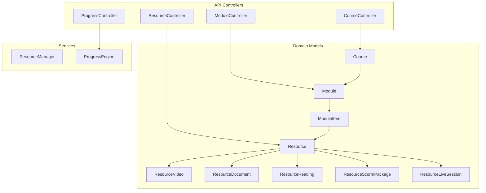
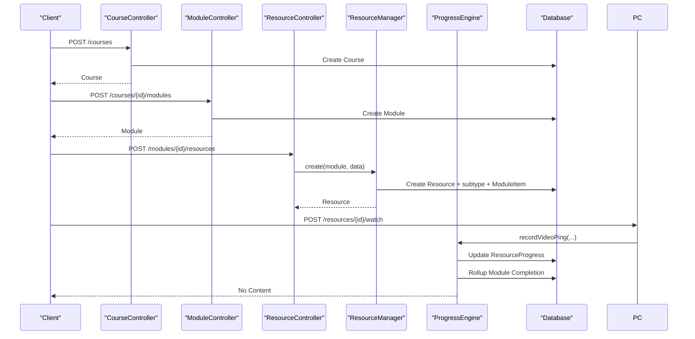
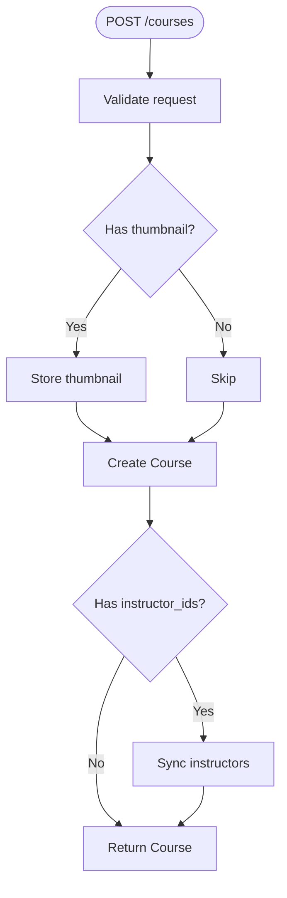
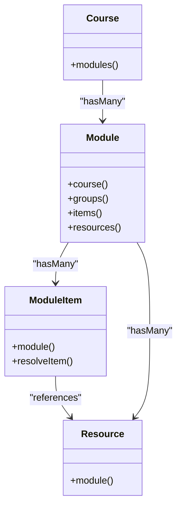
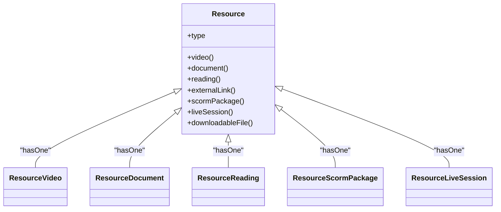
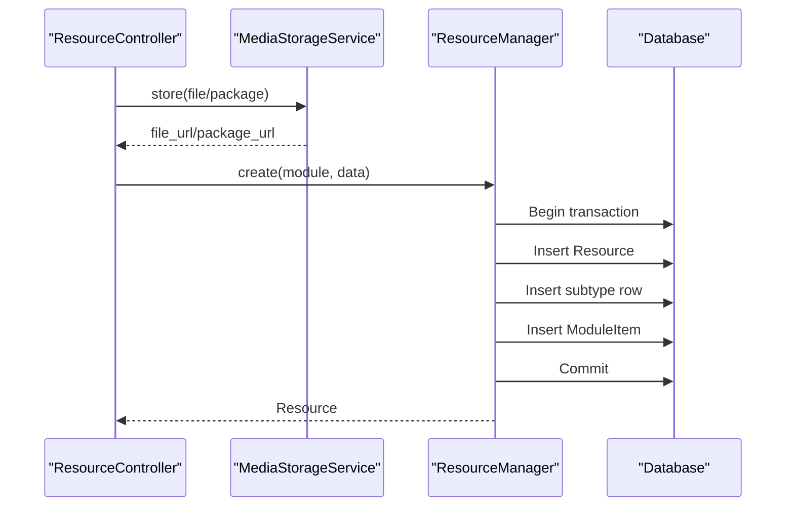
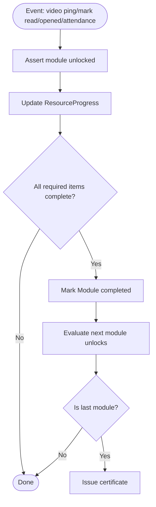
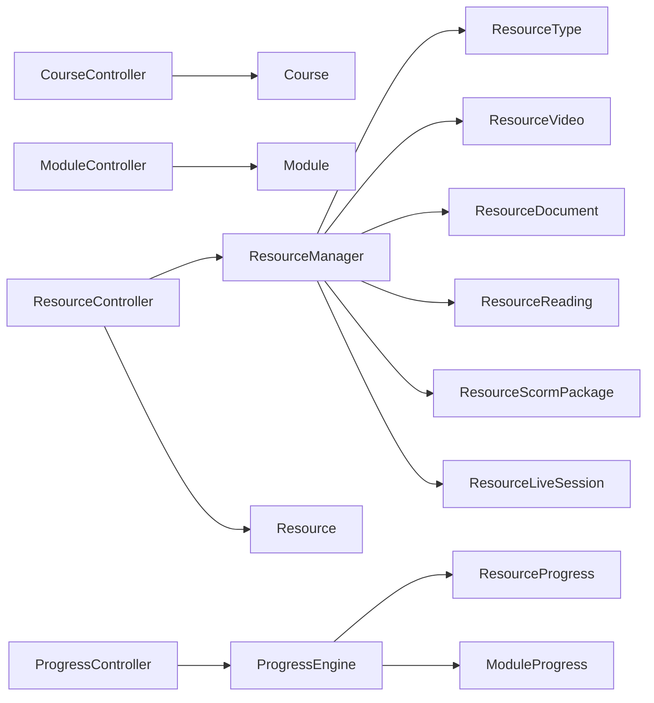

# Course Management System

<cite>
**Referenced Files in This Document**
- [Course.php](file://app/Models/Course.php)
- [Module.php](file://app/Models/Module.php)
- [Resource.php](file://app/Models/Resource.php)
- [ModuleItem.php](file://app/Models/ModuleItem.php)
- [ResourceVideo.php](file://app/Models/ResourceVideo.php)
- [ResourceDocument.php](file://app/Models/ResourceDocument.php)
- [ResourceReading.php](file://app/Models/ResourceReading.php)
- [ResourceScormPackage.php](file://app/Models/ResourceScormPackage.php)
- [ResourceLiveSession.php](file://app/Models/ResourceLiveSession.php)
- [Enrolment.php](file://app/Models/Enrolment.php)
- [ResourceProgress.php](file://app/Models/ResourceProgress.php)
- [ModuleProgress.php](file://app/Models/ModuleProgress.php)
- [ResourceManager.php](file://app/Services/Content/ResourceManager.php)
- [ProgressEngine.php](file://app/Services/Progress/ProgressEngine.php)
- [CourseController.php](file://app/Http/Controllers/Api/V1/CourseController.php)
- [ModuleController.php](file://app/Http/Controllers/Api/V1/ModuleController.php)
- [ResourceController.php](file://app/Http/Controllers/Api/V1/ResourceController.php)
- [ProgressController.php](file://app/Http/Controllers/Api/V1/ProgressController.php)
- [ResourceType.php](file://app/Enums/ResourceType.php)
</cite>

## Table of Contents
1. Introduction
2. Project Structure
3. Core Components
4. Architecture Overview
5. Detailed Component Analysis
6. Dependency Analysis
7. Performance Considerations
8. Troubleshooting Guide
9. Conclusion

## Introduction
This document explains the Course Management System sub-feature with a focus on the hierarchical structure courses → modules → resources, resource type implementations, and how the ResourceManager service coordinates content creation and updates. It also covers course creation workflows, module organization patterns, resource upload and management processes, and the integration with enrollment systems and progress tracking.

## Project Structure
The system is organized around three core layers:
- Domain models for Courses, Modules, Resources, and their type-specific details (videos, documents, readings, SCORM packages, live sessions).
- Services that encapsulate business logic: ResourceManager for content orchestration and ProgressEngine for unlocking/completion logic.
- API controllers that expose endpoints for creating and managing courses, modules, resources, and progress events.

**Diagram sources**
- [Course.php:116-121](file://app/Models/Course.php#L116-L121)
- [Module.php:54-68](file://app/Models/Module.php#L54-L68)
- [Resource.php:31-101](file://app/Models/Resource.php#L31-L101)
- [ModuleItem.php:43-50](file://app/Models/ModuleItem.php#L43-L50)
- [ResourceManager.php:33-58](file://app/Services/Content/ResourceManager.php#L33-L58)
- [ProgressEngine.php:50-81](file://app/Services/Progress/ProgressEngine.php#L50-L81)
- [CourseController.php:78-98](file://app/Http/Controllers/Api/V1/CourseController.php#L78-L98)
- [ModuleController.php:49-66](file://app/Http/Controllers/Api/V1/ModuleController.php#L49-L66)
- [ResourceController.php:30-46](file://app/Http/Controllers/Api/V1/ResourceController.php#L30-L46)
- [ProgressController.php:44-60](file://app/Http/Controllers/Api/V1/ProgressController.php#L44-L60)

**Section sources**
- [Course.php:1-180](file://app/Models/Course.php#L1-L180)
- [Module.php:1-86](file://app/Models/Module.php#L1-L86)
- [Resource.php:1-103](file://app/Models/Resource.php#L1-L103)
- [ModuleItem.php:1-52](file://app/Models/ModuleItem.php#L1-L52)
- [ResourceManager.php:1-180](file://app/Services/Content/ResourceManager.php#L1-L180)
- [ProgressEngine.php:1-288](file://app/Services/Progress/ProgressEngine.php#L1-L288)
- [CourseController.php:1-147](file://app/Http/Controllers/Api/V1/CourseController.php#L1-L147)
- [ModuleController.php:1-121](file://app/Http/Controllers/Api/V1/ModuleController.php#L1-L121)
- [ResourceController.php:1-86](file://app/Http/Controllers/Api/V1/ResourceController.php#L1-L86)
- [ProgressController.php:1-183](file://app/Http/Controllers/Api/V1/ProgressController.php#L1-L183)

## Core Components
- Course: Represents a learnable offering with metadata, instructors, sections, and relationships to modules and enrolments.
- Module: A sequential learning unit within a course, optionally scoped to groups and with scheduling/unlock behavior.
- Resource: A content item attached to a module via ModuleItem; supports multiple concrete types through one-to-one detail tables.
- ModuleItem: The ordered slot in a module that references a Resource (or other items), including ordering and required flags.
- ResourceManager: Orchestrates creation/update/delete of resources and their type-specific details while keeping ModuleItem in sync.
- ProgressEngine: Central authority for unlocking modules and computing completion based on resource signals and assessments.

Key implementation highlights:
- Hierarchical structure: Course has many Modules; Module has many ModuleItems; ModuleItem points to a Resource; Resource has one-to-one relations to type-specific details.
- Resource types: Video, Document, Reading, ExternalLink, Scorm, LiveSession, DownloadableFile are enumerated and dispatched by ResourceManager.
- Enrollment integration: Progress evaluation considers confirmed enrolments and section-based scheduling when applicable.

**Section sources**
- [Course.php:116-145](file://app/Models/Course.php#L116-L145)
- [Module.php:36-68](file://app/Models/Module.php#L36-L68)
- [Resource.php:31-101](file://app/Models/Resource.php#L31-L101)
- [ModuleItem.php:11-50](file://app/Models/ModuleItem.php#L11-L50)
- [ResourceManager.php:22-58](file://app/Services/Content/ResourceManager.php#L22-L58)
- [ProgressEngine.php:27-81](file://app/Services/Progress/ProgressEngine.php#L27-L81)

## Architecture Overview
The system follows a layered architecture:
- Controllers handle HTTP requests and delegate to services or models.
- Services encapsulate domain logic (content orchestration and progress computation).
- Models define data structures and relationships.

**Diagram sources**
- [CourseController.php:78-98](file://app/Http/Controllers/Api/V1/CourseController.php#L78-L98)
- [ModuleController.php:49-66](file://app/Http/Controllers/Api/V1/ModuleController.php#L49-L66)
- [ResourceController.php:30-46](file://app/Http/Controllers/Api/V1/ResourceController.php#L30-L46)
- [ResourceManager.php:33-58](file://app/Services/Content/ResourceManager.php#L33-L58)
- [ProgressController.php:123-128](file://app/Http/Controllers/Api/V1/ProgressController.php#L123-L128)
- [ProgressEngine.php:218-244](file://app/Services/Progress/ProgressEngine.php#L218-L244)

## Detailed Component Analysis

### Course Creation Workflow
- Input validation and optional thumbnail upload are handled in the controller before persisting the course.
- Instructors can be assigned during creation.
- Enrolment policy defaults are set based on course level.

**Diagram sources**
- [CourseController.php:78-98](file://app/Http/Controllers/Api/V1/CourseController.php#L78-L98)

**Section sources**
- [CourseController.php:78-98](file://app/Http/Controllers/Api/V1/CourseController.php#L78-L98)

### Module Organization Patterns
- Modules belong to a course and are ordered by order_index.
- Modules can be scoped to specific groups; if no groups are linked, they apply to all students.
- Scheduling and unlock behavior are enforced by the progress engine using scheduled_start_at or section-relative offsets.

**Diagram sources**
- [Course.php:116-121](file://app/Models/Course.php#L116-L121)
- [Module.php:36-68](file://app/Models/Module.php#L36-L68)
- [ModuleItem.php:35-50](file://app/Models/ModuleItem.php#L35-L50)
- [Resource.php:31-37](file://app/Models/Resource.php#L31-L37)

**Section sources**
- [Module.php:36-68](file://app/Models/Module.php#L36-L68)
- [ModuleItem.php:11-50](file://app/Models/ModuleItem.php#L11-L50)
- [ProgressEngine.php:101-118](file://app/Services/Progress/ProgressEngine.php#L101-L118)

### Resource Types and Implementation Details
Resource types are enumerated and managed uniformly by ResourceManager, which creates the base Resource row plus the corresponding subtype row and a ModuleItem entry.

Supported types:
- Video: stores streaming ID, duration, captions.
- Document: stores file URL, type, size.
- Reading: stores HTML content.
- ExternalLink: stores target URL.
- Scorm: stores package URL and standard.
- LiveSession: stores provider, meeting URL, schedule, duration.
- DownloadableFile: stores file URL and size.

**Diagram sources**
- [Resource.php:31-101](file://app/Models/Resource.php#L31-L101)
- [ResourceVideo.php:10-29](file://app/Models/ResourceVideo.php#L10-L29)
- [ResourceDocument.php:11-35](file://app/Models/ResourceDocument.php#L11-L35)
- [ResourceReading.php:10-28](file://app/Models/ResourceReading.php#L10-L28)
- [ResourceScormPackage.php:11-34](file://app/Models/ResourceScormPackage.php#L11-L34)
- [ResourceLiveSession.php:11-37](file://app/Models/ResourceLiveSession.php#L11-L37)

**Section sources**
- [ResourceType.php:7-17](file://app/Enums/ResourceType.php#L7-L17)
- [ResourceManager.php:101-178](file://app/Services/Content/ResourceManager.php#L101-L178)

### Resource Upload and Management Processes
- File uploads (documents and SCORM packages) are stored via MediaStorageService and URLs are persisted in the appropriate subtype table.
- ResourceManager ensures atomicity by wrapping creation/update in transactions and synchronizing ModuleItem fields like order_index and is_required.
- Deletion removes the ModuleItem reference first, then deletes the Resource.

**Diagram sources**
- [ResourceController.php:30-46](file://app/Http/Controllers/Api/V1/ResourceController.php#L30-L46)
- [ResourceManager.php:33-58](file://app/Services/Content/ResourceManager.php#L33-L58)

**Section sources**
- [ResourceController.php:30-66](file://app/Http/Controllers/Api/V1/ResourceController.php#L30-L66)
- [ResourceManager.php:33-96](file://app/Services/Content/ResourceManager.php#L33-L96)

### Progress Tracking and Enrollment Integration
- ProgressEngine evaluates unlocks per student based on confirmed enrolments and either absolute module schedules or section-relative offsets.
- Resource consumption signals update ResourceProgress and roll up to Module completion when all required items are complete.
- Completion of the last module triggers certificate issuance.

**Diagram sources**
- [ProgressEngine.php:218-286](file://app/Services/Progress/ProgressEngine.php#L218-L286)
- [ProgressEngine.php:126-152](file://app/Services/Progress/ProgressEngine.php#L126-L152)
- [ProgressEngine.php:50-81](file://app/Services/Progress/ProgressEngine.php#L50-L81)

**Section sources**
- [ProgressEngine.php:50-118](file://app/Services/Progress/ProgressEngine.php#L50-L118)
- [ProgressEngine.php:126-205](file://app/Services/Progress/ProgressEngine.php#L126-L205)
- [ProgressEngine.php:218-286](file://app/Services/Progress/ProgressEngine.php#L218-L286)
- [Enrolment.php:22-76](file://app/Models/Enrolment.php#L22-L76)
- [ResourceProgress.php:11-49](file://app/Models/ResourceProgress.php#L11-L49)
- [ModuleProgress.php:11-45](file://app/Models/ModuleProgress.php#L11-L45)

## Dependency Analysis
- Controllers depend on services for business logic and on models for persistence.
- ResourceManager depends on ResourceType enum and multiple resource subtype models to dispatch creation/update.
- ProgressEngine depends on enums for statuses and types, and on models for progress and attendance.

**Diagram sources**
- [CourseController.php:78-98](file://app/Http/Controllers/Api/V1/CourseController.php#L78-L98)
- [ModuleController.php:49-66](file://app/Http/Controllers/Api/V1/ModuleController.php#L49-L66)
- [ResourceController.php:30-46](file://app/Http/Controllers/Api/V1/ResourceController.php#L30-L46)
- [ResourceManager.php:101-178](file://app/Services/Content/ResourceManager.php#L101-L178)
- [ProgressController.php:44-60](file://app/Http/Controllers/Api/V1/ProgressController.php#L44-L60)
- [ProgressEngine.php:180-205](file://app/Services/Progress/ProgressEngine.php#L180-L205)

**Section sources**
- [ResourceManager.php:101-178](file://app/Services/Content/ResourceManager.php#L101-L178)
- [ProgressEngine.php:180-205](file://app/Services/Progress/ProgressEngine.php#L180-L205)

## Performance Considerations
- Use eager loading where appropriate to reduce N+1 queries when listing courses/modules/resources.
- Keep resource creation/update transactions small; ResourceManager already wraps operations atomically.
- Avoid heavy computations in hot paths; ProgressEngine methods are idempotent and safe to call repeatedly.
- For large cohorts, consider batching progress rollups and unlock evaluations.

[No sources needed since this section provides general guidance]

## Troubleshooting Guide
Common issues and checks:
- Module locked errors: Ensure the student’s module progress exists and is not Locked; verify schedule reached and previous module completion.
- Resource progress not updating: Confirm the module is unlocked before recording progress; check that the correct resource type signal is used (e.g., markRead vs markOpened).
- Missing subtype data after resource creation: Verify ResourceManager created both the Resource and its subtype row; check database constraints and foreign keys.
- Attendance roster empty: Ensure enrolments are Confirmed and attendance records exist for the live session resource.

**Section sources**
- [ProgressEngine.php:211-216](file://app/Services/Progress/ProgressEngine.php#L211-L216)
- [ProgressEngine.php:180-205](file://app/Services/Progress/ProgressEngine.php#L180-L205)
- [ProgressController.php:155-181](file://app/Http/Controllers/Api/V1/ProgressController.php#L155-L181)

## Conclusion
The Course Management System implements a clear hierarchy of courses, modules, and resources with robust support for multiple content types. ResourceManager centralizes resource lifecycle management and keeps module ordering consistent, while ProgressEngine enforces unlocking and completion rules tied to enrollment context. Together, these components provide a scalable foundation for content delivery and learner progression.

[No sources needed since this section summarizes without analyzing specific files]