# Course Structure & Hierarchy

<cite>
**Referenced Files in This Document**
- [Course.php](file://app/Models/Course.php)
- [Module.php](file://app/Models/Module.php)
- [CourseSection.php](file://app/Models/CourseSection.php)
- [Category.php](file://app/Models/Category.php)
- [Announcement.php](file://app/Models/Announcement.php)
- [Ticket.php](file://app/Models/Ticket.php)
- [QuestionBank.php](file://app/Models/QuestionBank.php)
- [CourseReview.php](file://app/Models/CourseReview.php)
- [CourseLevel.php](file://app/Enums/CourseLevel.php)
- [CourseEnrolmentPolicy.php](file://app/Enums/CourseEnrolmentPolicy.php)
- [CourseController.php](file://app/Http/Controllers/Api/V1/CourseController.php)
- [ModuleController.php](file://app/Http/Controllers/Api/V1/ModuleController.php)
- [CourseSectionController.php](file://app/Http/Controllers/Api/V1/CourseSectionController.php)
- [2024_01_01_000030_create_courses_table.php](file://database/migrations/2024_01_01_000030_create_courses_table.php)
- [2024_01_01_000100_create_modules_table.php](file://database/migrations/2024_01_01_000100_create_modules_table.php)
- [2026_08_10_010000_create_course_sections_table.php](file://database/migrations/2026_08_10_010000_create_course_sections_table.php)
- [2024_01_01_000040_create_course_instructors_table.php](file://database/migrations/2024_01_01_000040_create_course_instructors_table.php)
</cite>

## Table of Contents
1. Introduction
2. Project Structure
3. Core Components
4. Architecture Overview
5. Detailed Component Analysis
6. Dependency Analysis
7. Performance Considerations
8. Troubleshooting Guide
9. Conclusion

## Introduction
This document explains the Course Structure & Hierarchy component: how courses are organized into modules and sections, how instructors and categories relate to courses, and how supporting data such as reviews, announcements, tickets, and question banks attach to courses. It also provides practical workflows for creating, updating, and managing course hierarchies using the provided controllers and models.

## Project Structure
At a high level:
- Courses are top-level entities that can be categorized and taught by multiple instructors.
- Modules represent ordered learning units within a course.
- Sections represent scheduled runs (cohorts) of a course with capacity, dates, and status.
- Supporting entities like announcements, tickets, reviews, and question banks are associated with courses.

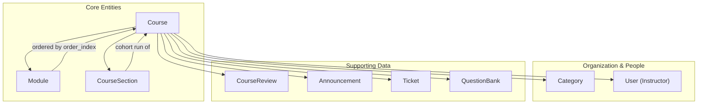

**Diagram sources**
- [Course.php:58-169](file://app/Models/Course.php#L58-L169)
- [Module.php:36-84](file://app/Models/Module.php#L36-L84)
- [CourseSection.php:40-70](file://app/Models/CourseSection.php#L40-L70)
- [Category.php:26-39](file://app/Models/Category.php#L26-L39)

**Section sources**
- [Course.php:22-56](file://app/Models/Course.php#L22-L56)
- [Module.php:22-34](file://app/Models/Module.php#L22-L34)
- [CourseSection.php:19-38](file://app/Models/CourseSection.php#L19-L38)
- [2024_01_01_000030_create_courses_table.php:13-32](file://database/migrations/2024_01_01_000030_create_courses_table.php#L13-L32)
- [2024_01_01_000100_create_modules_table.php:13-22](file://database/migrations/2024_01_01_000100_create_modules_table.php#L13-L22)
- [2026_08_10_010000_create_course_sections_table.php:18-32](file://database/migrations/2026_08_10_010000_create_course_sections_table.php#L18-L32)

## Core Components
- Course: The central entity with category, level, enrolment policy, status, schedule, and versioning. It relates to modules, sections, instructors, reviews, announcements, tickets, and question banks.
- Module: Ordered content container within a course with optional scheduling and group targeting.
- CourseSection: A time-bound cohort of a course with capacity, application deadlines, and status transitions.
- Category: Hierarchical taxonomy used to organize courses.
- Supporting entities: Reviews, announcements, tickets, and question banks are all tied to courses.

Key relationships:
- Course has many Modules (ordered by order_index).
- Course has many CourseSections.
- Course belongs to a Category.
- Course has many Instructors via a pivot table.
- Course has many Reviews, Announcements, Tickets, QuestionBanks.

**Section sources**
- [Course.php:58-169](file://app/Models/Course.php#L58-L169)
- [Module.php:36-84](file://app/Models/Module.php#L36-L84)
- [CourseSection.php:40-70](file://app/Models/CourseSection.php#L40-L70)
- [Category.php:26-39](file://app/Models/Category.php#L26-L39)
- [2024_01_01_000040_create_course_instructors_table.php:13-19](file://database/migrations/2024_01_01_000040_create_course_instructors_table.php#L13-L19)

## Architecture Overview
The API exposes endpoints to manage courses, modules, and sections. Controllers orchestrate validation, persistence, authorization, and resource serialization.

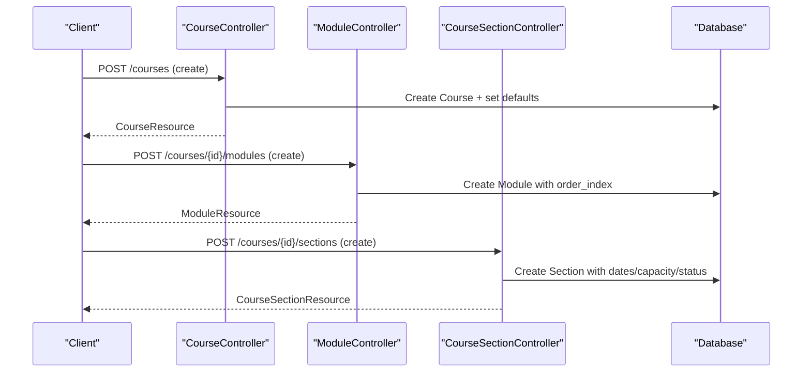

**Diagram sources**
- [CourseController.php:78-98](file://app/Http/Controllers/Api/V1/CourseController.php#L78-L98)
- [ModuleController.php:49-66](file://app/Http/Controllers/Api/V1/ModuleController.php#L49-L66)
- [CourseSectionController.php:87-98](file://app/Http/Controllers/Api/V1/CourseSectionController.php#L87-L98)

## Detailed Component Analysis

### Course Model and Relationships
- Attributes include category, title, slug, description, level, enrolment_policy, status, price, currency, schedule_start_date, sections_required, and versioning fields.
- Relationships:
  - Category (BelongsTo)
  - Instructors (BelongsToMany via course_instructors)
  - Modules (HasMany, ordered by order_index)
  - Sections (HasMany)
  - Reviews, Announcements, Tickets, QuestionBanks (HasMany)
  - Enrolments, Orders, Applications, Groups (HasMany)
  - Creator (BelongsTo User)

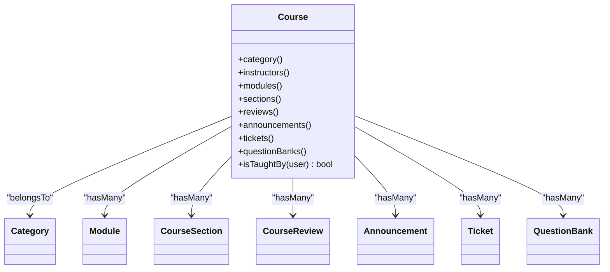

**Diagram sources**
- [Course.php:58-169](file://app/Models/Course.php#L58-L169)

**Section sources**
- [Course.php:22-56](file://app/Models/Course.php#L22-L56)
- [Course.php:58-169](file://app/Models/Course.php#L58-L169)

### Module Ordering and Content
- Modules belong to a course and are ordered by order_index.
- They can target specific groups and contain resources, assignments, and evaluations.
- Soft delete support allows restoration from a “recently deleted” view.

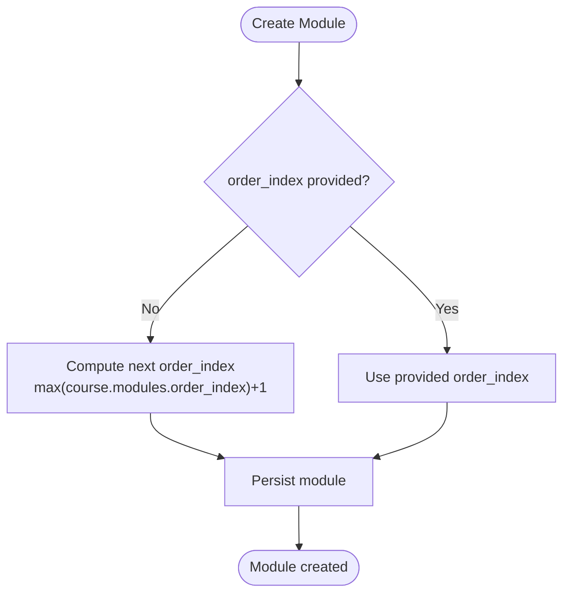

**Diagram sources**
- [ModuleController.php:49-66](file://app/Http/Controllers/Api/V1/ModuleController.php#L49-L66)
- [Module.php:36-84](file://app/Models/Module.php#L36-L84)
- [2024_01_01_000100_create_modules_table.php:13-22](file://database/migrations/2024_01_01_000100_create_modules_table.php#L13-L22)

**Section sources**
- [Module.php:22-34](file://app/Models/Module.php#L22-L34)
- [Module.php:36-84](file://app/Models/Module.php#L36-L84)
- [ModuleController.php:22-66](file://app/Http/Controllers/Api/V1/ModuleController.php#L22-L66)

### Course Sections (Cohorts)
- Sections define a run of a course with start/end dates, application deadline, capacity, seats_taken, and status.
- They link to a primary instructor and have enrollments and applications.
- Computed attributes provide enrolled_count, seats_available, isFull(), and isAcceptingApplications().

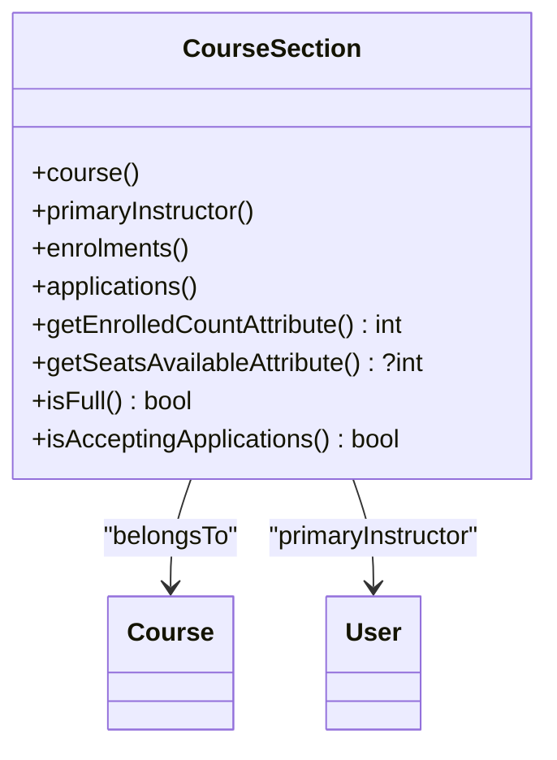

**Diagram sources**
- [CourseSection.php:40-118](file://app/Models/CourseSection.php#L40-L118)

**Section sources**
- [CourseSection.php:19-38](file://app/Models/CourseSection.php#L19-L38)
- [CourseSection.php:40-118](file://app/Models/CourseSection.php#L40-L118)
- [2026_08_10_010000_create_course_sections_table.php:18-32](file://database/migrations/2026_08_10_010000_create_course_sections_table.php#L18-L32)

### Categories, Levels, and Enrolment Policies
- Categories form a hierarchical taxonomy (parent/children) used to organize courses.
- Course levels: beginner, intermediate, advanced.
- Enrolment policies: open, advisory, application; default policy per level is provided.

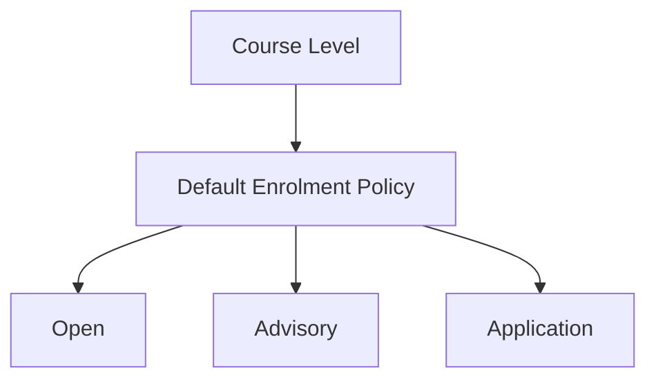

**Diagram sources**
- [CourseLevel.php:7-12](file://app/Enums/CourseLevel.php#L7-L12)
- [CourseEnrolmentPolicy.php:7-26](file://app/Enums/CourseEnrolmentPolicy.php#L7-L26)

**Section sources**
- [Category.php:20-39](file://app/Models/Category.php#L20-L39)
- [CourseLevel.php:7-12](file://app/Enums/CourseLevel.php#L7-L12)
- [CourseEnrolmentPolicy.php:7-26](file://app/Enums/CourseEnrolmentPolicy.php#L7-L26)

### Associated Data: Reviews, Announcements, Tickets, Question Banks
- Reviews: student-submitted ratings and text, with admin review fields.
- Announcements: course-wide messages posted by users.
- Tickets: student support requests linked to a course and optionally assigned to staff.
- Question Banks: collections of questions scoped to a course.

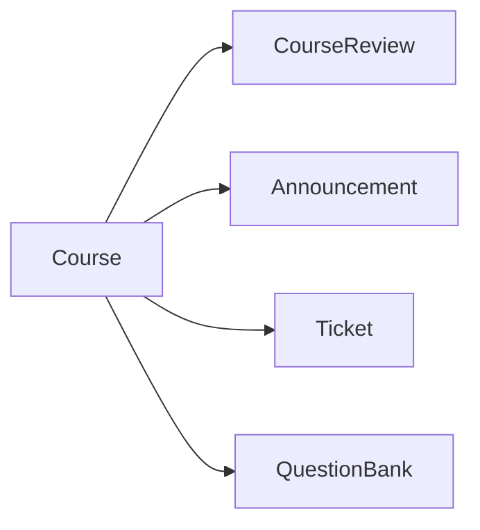

**Diagram sources**
- [CourseReview.php:44-58](file://app/Models/CourseReview.php#L44-L58)
- [Announcement.php:26-40](file://app/Models/Announcement.php#L26-L40)
- [Ticket.php:43-65](file://app/Models/Ticket.php#L43-L65)
- [QuestionBank.php:25-39](file://app/Models/QuestionBank.php#L25-L39)

**Section sources**
- [CourseReview.php:18-58](file://app/Models/CourseReview.php#L18-L58)
- [Announcement.php:19-40](file://app/Models/Announcement.php#L19-L40)
- [Ticket.php:21-65](file://app/Models/Ticket.php#L21-L65)
- [QuestionBank.php:20-39](file://app/Models/QuestionBank.php#L20-L39)

### Practical Workflows

#### Create a Course
- Validate input, set default enrolment policy based on level, handle thumbnail upload, persist course, assign instructors, return resource.

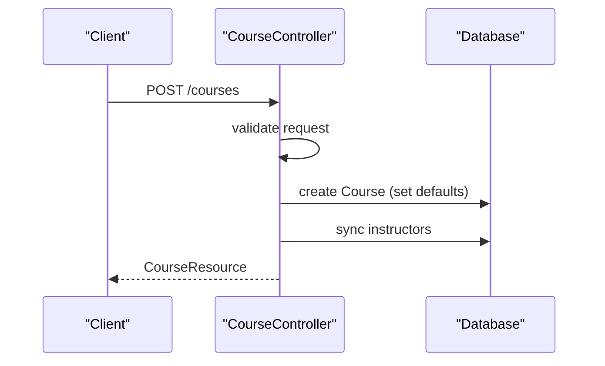

**Diagram sources**
- [CourseController.php:78-98](file://app/Http/Controllers/Api/V1/CourseController.php#L78-L98)

**Section sources**
- [CourseController.php:78-98](file://app/Http/Controllers/Api/V1/CourseController.php#L78-L98)

#### Update a Course
- Validate input, handle thumbnail replacement, update fields, optionally sync instructors, increment version and log change summary if provided.

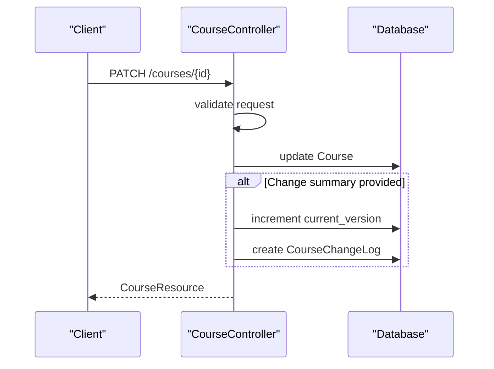

**Diagram sources**
- [CourseController.php:104-136](file://app/Http/Controllers/Api/V1/CourseController.php#L104-L136)

**Section sources**
- [CourseController.php:104-136](file://app/Http/Controllers/Api/V1/CourseController.php#L104-L136)

#### Manage Modules in a Course
- List modules (ordered), soft-delete and restore modules, create/update modules with optional group targeting.

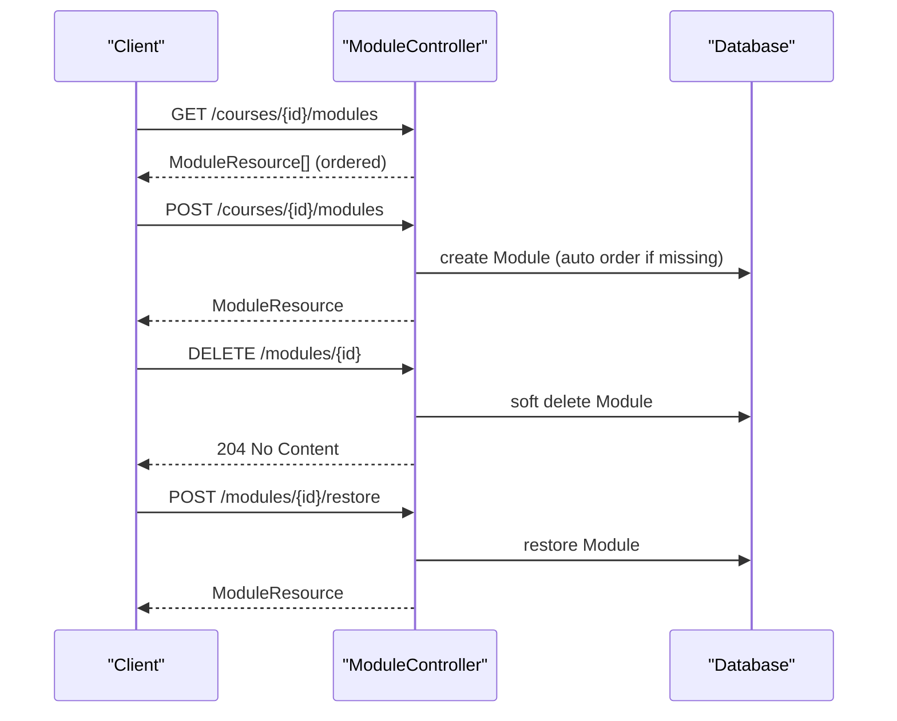

**Diagram sources**
- [ModuleController.php:22-119](file://app/Http/Controllers/Api/V1/ModuleController.php#L22-L119)

**Section sources**
- [ModuleController.php:22-119](file://app/Http/Controllers/Api/V1/ModuleController.php#L22-L119)

#### Manage Sections (Cohorts)
- Public listing of visible sections, course-scoped listing with analytics for privileged users, CRUD operations via service layer.

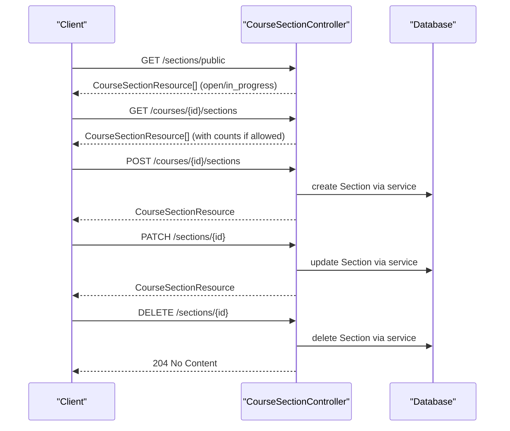

**Diagram sources**
- [CourseSectionController.php:23-141](file://app/Http/Controllers/Api/V1/CourseSectionController.php#L23-L141)

**Section sources**
- [CourseSectionController.php:23-141](file://app/Http/Controllers/Api/V1/CourseSectionController.php#L23-L141)

## Dependency Analysis
- Course depends on Category, Users (instructors), and owns Modules, Sections, Reviews, Announcements, Tickets, QuestionBanks.
- Module depends on Course and may target Groups; contains Resources, Assignments, Evaluations.
- Section depends on Course and a primary Instructor; links to Enrolments and Applications.

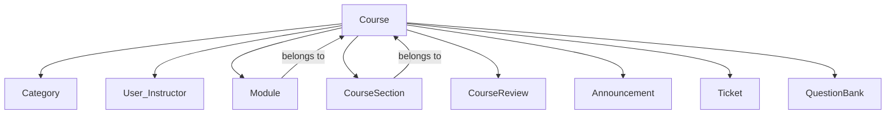

**Diagram sources**
- [Course.php:58-169](file://app/Models/Course.php#L58-L169)
- [Module.php:36-84](file://app/Models/Module.php#L36-L84)
- [CourseSection.php:40-70](file://app/Models/CourseSection.php#L40-L70)

**Section sources**
- [Course.php:58-169](file://app/Models/Course.php#L58-L169)
- [Module.php:36-84](file://app/Models/Module.php#L36-L84)
- [CourseSection.php:40-70](file://app/Models/CourseSection.php#L40-L70)

## Performance Considerations
- Eager loading: Controllers load related data (e.g., category, instructors, resources) to reduce N+1 queries.
- Indexes: Database indexes on course status, module course_id+order_index, and section course_id+status improve query performance.
- Pagination: Course listing uses pagination to limit payload size.
- Soft deletes: Module soft deletes avoid heavy cascading deletes and allow efficient restoration.

[No sources needed since this section provides general guidance]

## Troubleshooting Guide
- Module ordering issues: Ensure order_index is set or rely on auto-computation when creating modules.
- Section capacity: Verify capacity vs enrolled count; use computed attributes to check availability.
- Enrolment policy defaults: When creating courses without specifying policy, defaults are derived from level.
- Authorization: Ensure proper roles (admin/instructor) for section analytics and module management endpoints.

**Section sources**
- [ModuleController.php:49-66](file://app/Http/Controllers/Api/V1/ModuleController.php#L49-L66)
- [CourseSection.php:72-118](file://app/Models/CourseSection.php#L72-L118)
- [CourseEnrolmentPolicy.php:13-26](file://app/Enums/CourseEnrolmentPolicy.php#L13-L26)
- [CourseSectionController.php:64-82](file://app/Http/Controllers/Api/V1/CourseSectionController.php#L64-L82)

## Conclusion
The Course Structure & Hierarchy centers around the Course model, which organizes learning through ordered Modules and time-bound Sections (cohorts). Categories classify courses, while instructors teach them. Supporting data—reviews, announcements, tickets, and question banks—attach directly to courses. The API controllers provide clear workflows to create, update, and manage these entities, with sensible defaults, ordering, and capacity controls.