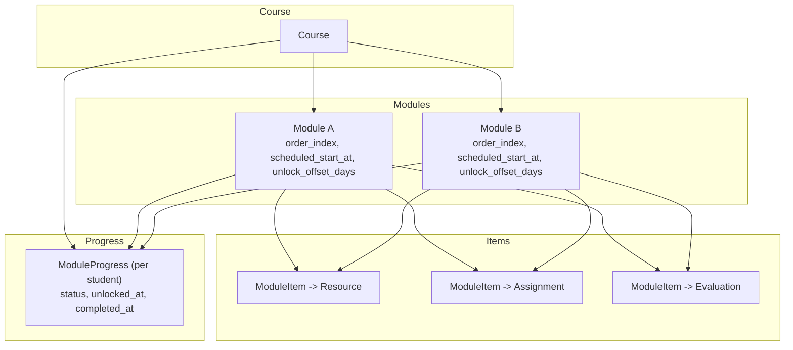
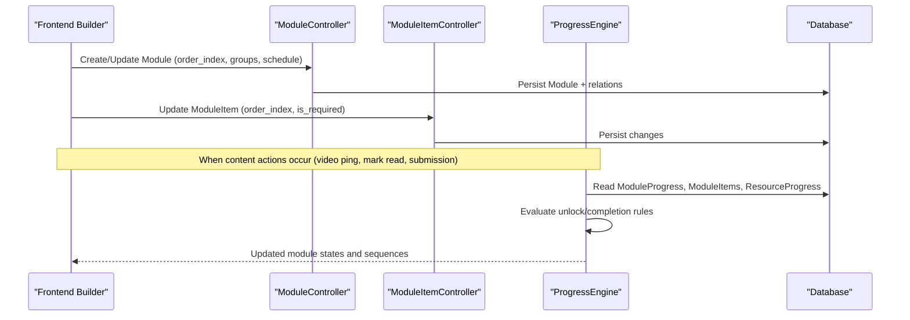
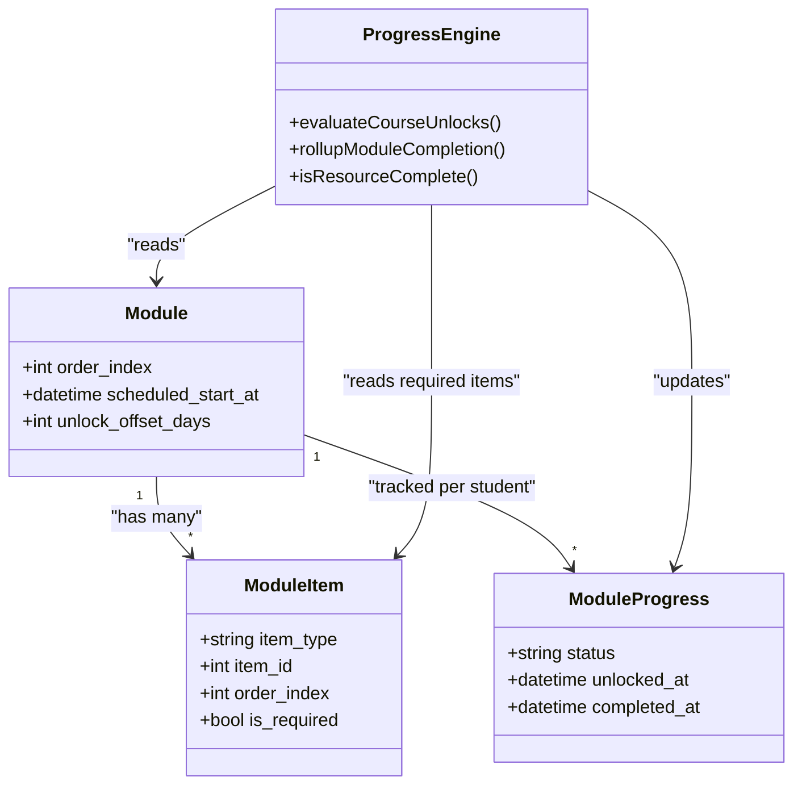

# Module Organization & Sequencing

<cite>
**Referenced Files in This Document**
- [Module.php](file://app/Models/Module.php)
- [ModuleItem.php](file://app/Models/ModuleItem.php)
- [ModuleProgress.php](file://app/Models/ModuleProgress.php)
- [ModuleController.php](file://app/Http/Controllers/Api/V1/ModuleController.php)
- [ModuleItemController.php](file://app/Http/Controllers/Api/V1/ModuleItemController.php)
- [ProgressEngine.php](file://app/Services/Progress/ProgressEngine.php)
- [courseSequence.ts](file://frontend/src/lib/courseSequence.ts)
- [2024_01_01_000100_create_modules_table.php](file://database/migrations/2024_01_01_000100_create_modules_table.php)
- [2024_01_01_000150_create_module_items_table.php](file://database/migrations/2024_01_01_000150_create_module_items_table.php)
- [2024_01_01_000153_create_module_progress_table.php](file://database/migrations/2024_01_01_000153_create_module_progress_table.php)
- [ModuleItemType.php](file://app/Enums/ModuleItemType.php)
- [ModuleProgressStatus.php](file://app/Enums/ModuleProgressStatus.php)
</cite>

## Table of Contents
1. Introduction
2. Project Structure
3. Core Components
4. Architecture Overview
5. Detailed Component Analysis
6. Dependency Analysis
7. Performance Considerations
8. Troubleshooting Guide
9. Conclusion

## Introduction
This document explains how modules are organized within courses, how items are sequenced inside modules, and how visibility and completion drive unlocking behavior. It covers:
- Module ordering and grouping
- The ModuleItem system for resources, assignments, and evaluations
- Drag-and-drop reordering via API updates
- Visibility controls through group scoping and scheduling
- Unlock conditions, completion requirements, and progress tracking
- Practical examples using the frontend course builder and backend APIs

## Project Structure
Modules live under a Course and contain ordered ModuleItems. Each ModuleItem references a Resource, Assignment, or Evaluation and carries an order_index and is_required flag. Per-student ModuleProgress tracks whether a module is locked, not started, in progress, or completed, including timestamps for unlock and completion.

**Diagram sources**
- [Module.php:22-34](file://app/Models/Module.php#L22-L34)
- [ModuleItem.php:21-33](file://app/Models/ModuleItem.php#L21-L33)
- [ModuleProgress.php:15-27](file://app/Models/ModuleProgress.php#L15-L27)
- [2024_01_01_000100_create_modules_table.php:13-22](file://database/migrations/2024_01_01_000100_create_modules_table.php#L13-L22)
- [2024_01_01_000150_create_module_items_table.php:13-22](file://database/migrations/2024_01_01_000150_create_module_items_table.php#L13-L22)
- [2024_01_01_000153_create_module_progress_table.php:13-21](file://database/migrations/2024_01_01_000153_create_module_progress_table.php#L13-L21)

**Section sources**
- [Module.php:22-34](file://app/Models/Module.php#L22-L34)
- [ModuleItem.php:21-33](file://app/Models/ModuleItem.php#L21-L33)
- [ModuleProgress.php:15-27](file://app/Models/ModuleProgress.php#L15-L27)
- [2024_01_01_000100_create_modules_table.php:13-22](file://database/migrations/2024_01_01_000100_create_modules_table.php#L13-L22)
- [2024_01_01_000150_create_module_items_table.php:13-22](file://database/migrations/2024_01_01_000150_create_module_items_table.php#L13-L22)
- [2024_01_01_000153_create_module_progress_table.php:13-21](file://database/migrations/2024_01_01_000153_create_module_progress_table.php#L13-L21)

## Core Components
- Module: Represents a course section with title, description, order_index, and optional scheduling fields (scheduled_start_at, unlock_offset_days). Modules can be scoped to specific groups; if no groups are set, they apply to all students.
- ModuleItem: Links a module to a Resource, Assignment, or Evaluation, with order_index and is_required to control completion gating.
- ModuleProgress: Tracks per-student status (locked, not_started, in_progress, completed) and timestamps for unlock and completion.
- ProgressEngine: Central logic that evaluates unlocks based on schedule and previous module completion, rolls up completion from required items, and enforces that actions occur only on unlocked modules.
- Frontend sequence helpers: Flatten module items into a single ordered list, compute adjacency for navigation, find next incomplete item, and explain why a module is locked.

**Section sources**
- [Module.php:22-34](file://app/Models/Module.php#L22-L34)
- [ModuleItem.php:21-33](file://app/Models/ModuleItem.php#L21-L33)
- [ModuleProgress.php:15-27](file://app/Models/ModuleProgress.php#L15-L27)
- [ProgressEngine.php:50-118](file://app/Services/Progress/ProgressEngine.php#L50-L118)
- [courseSequence.ts:9-14](file://frontend/src/lib/courseSequence.ts#L9-L14)

## Architecture Overview
The system separates authoring (controllers), sequencing (models and enums), progression (ProgressEngine), and UI ordering (frontend helpers). Controllers expose REST endpoints to create/update modules and reorder items. ProgressEngine computes unlock and completion state consistently across signals like video pings, mark-as-read, attendance, submissions, and passed evaluations.

**Diagram sources**
- [ModuleController.php:26-80](file://app/Http/Controllers/Api/V1/ModuleController.php#L26-L80)
- [ModuleItemController.php:18-23](file://app/Http/Controllers/Api/V1/ModuleItemController.php#L18-L23)
- [ProgressEngine.php:50-152](file://app/Services/Progress/ProgressEngine.php#L50-L152)

## Detailed Component Analysis

### Module Ordering and Grouping
- Order: Modules are ordered by order_index. The index defaults to max existing + 1 when creating a new module without an explicit index.
- Group scoping: If a module has no groups, it applies to all students. Otherwise, only students in one of the linked groups see and progress through it.
- Scheduling: Two mechanisms influence availability:
  - Absolute schedule via scheduled_start_at
  - Section-relative schedule via unlock_offset_days combined with the student’s enrolled section start date

Practical example:
- Create a module with title and description; omit order_index to append at the end.
- Assign group_ids to restrict visibility to specific cohorts.
- Set scheduled_start_at for self-paced courses or use unlock_offset_days with sections.

**Section sources**
- [ModuleController.php:49-66](file://app/Http/Controllers/Api/V1/ModuleController.php#L49-L66)
- [Module.php:22-34](file://app/Models/Module.php#L22-L34)
- [ProgressEngine.php:101-118](file://app/Services/Progress/ProgressEngine.php#L101-L118)
- [ProgressEngine.php:89-99](file://app/Services/Progress/ProgressEngine.php#L89-L99)

### ModuleItem System and Reordering
- Items link to Resource, Assignment, or Evaluation via item_type and item_id.
- order_index defines the sequence within a module.
- is_required determines whether an item blocks module completion. Optional items do not block completion.
- Reordering and toggling requirement are done via a single update endpoint for ModuleItem.

Drag-and-drop workflow:
- On drop, send an update request with the new order_index for each affected ModuleItem.
- Optionally toggle is_required to mark supplementary material.

Completion gating:
- A module completes when all required items are complete. Completion triggers unlocking of the next applicable module.

**Section sources**
- [ModuleItem.php:21-33](file://app/Models/ModuleItem.php#L21-L33)
- [ModuleItem.php:43-50](file://app/Models/ModuleItem.php#L43-L50)
- [ModuleItemController.php:18-23](file://app/Http/Controllers/Api/V1/ModuleItemController.php#L18-L23)
- [ProgressEngine.php:126-152](file://app/Services/Progress/ProgressEngine.php#L126-L152)

### Visibility Controls
- Group-based visibility: Modules without groups are visible to all; otherwise, only members of linked groups can access them.
- Schedule-based visibility: A module becomes available when its schedule condition is met (absolute or section-relative) and the previous applicable module is completed.
- Locked modules remain visible but dimmed in the UI; explanations indicate the reason (schedule or predecessor not completed).

**Section sources**
- [ProgressEngine.php:101-118](file://app/Services/Progress/ProgressEngine.php#L101-L118)
- [ProgressEngine.php:50-81](file://app/Services/Progress/ProgressEngine.php#L50-L81)
- [courseSequence.ts:66-88](file://frontend/src/lib/courseSequence.ts#L66-L88)

### Unlock Conditions and Completion Requirements
Unlock conditions:
- Schedule reached: Either scheduled_start_at has passed or (section.start_date + unlock_offset_days) has passed.
- Previous applicable module completed: Only modules that apply to the student count as predecessors.

Completion requirements:
- All required ModuleItems must be complete.
- Required item completion depends on type:
  - Resource: completion signal varies by resource type (e.g., video watch percentage threshold, mark-as-read, opened, attendance).
  - Assignment: submission exists for the student.
  - Evaluation: at least one passed attempt exists for the student.

When a module completes:
- Mark ModuleProgress as completed with timestamp.
- Evaluate unlocks for subsequent modules.
- Issue certificates upon final module completion.

**Section sources**
- [ProgressEngine.php:50-99](file://app/Services/Progress/ProgressEngine.php#L50-L99)
- [ProgressEngine.php:126-168](file://app/Services/Progress/ProgressEngine.php#L126-L168)
- [ProgressEngine.php:180-205](file://app/Services/Progress/ProgressEngine.php#L180-L205)

### Progress Tracking
- ModuleProgress stores per-student status and timestamps for unlock and completion.
- Actions that consume content (video pings, mark-as-read, opened, attendance) assert the module is unlocked before recording progress.
- ProgressEngine centralizes all rollups to ensure consistent state transitions.

**Section sources**
- [ModuleProgress.php:15-27](file://app/Models/ModuleProgress.php#L15-L27)
- [ProgressEngine.php:211-286](file://app/Services/Progress/ProgressEngine.php#L211-L286)

### Frontend Course Builder Integration
- Flattening: Build a single ordered list of items across modules to power navigation and “continue” flows.
- Navigation: Compute previous/next items based on position in the flattened sequence.
- Resume: Identify the first incomplete item to guide learners.
- Locked explanations: Mirror server-side unlock logic to show clear reasons for locked modules.

Example usage patterns:
- After drag-and-drop reordering, refresh the module list and rebuild the flattened sequence.
- Use the flattened list to render step-by-step learning paths and enable prev/next links.

**Section sources**
- [courseSequence.ts:9-14](file://frontend/src/lib/courseSequence.ts#L9-L14)
- [courseSequence.ts:33-48](file://frontend/src/lib/courseSequence.ts#L33-L48)
- [courseSequence.ts:54-56](file://frontend/src/lib/courseSequence.ts#L54-L56)
- [courseSequence.ts:66-88](file://frontend/src/lib/courseSequence.ts#L66-L88)

## Dependency Analysis

**Diagram sources**
- [Module.php:22-34](file://app/Models/Module.php#L22-L34)
- [ModuleItem.php:21-33](file://app/Models/ModuleItem.php#L21-L33)
- [ModuleProgress.php:15-27](file://app/Models/ModuleProgress.php#L15-L27)
- [ProgressEngine.php:50-152](file://app/Services/Progress/ProgressEngine.php#L50-L152)

**Section sources**
- [Module.php:22-34](file://app/Models/Module.php#L22-L34)
- [ModuleItem.php:21-33](file://app/Models/ModuleItem.php#L21-L33)
- [ModuleProgress.php:15-27](file://app/Models/ModuleProgress.php#L15-L27)
- [ProgressEngine.php:50-152](file://app/Services/Progress/ProgressEngine.php#L50-L152)

## Performance Considerations
- Keep order_index updates minimal during drag-and-drop; batch updates where possible to reduce writes.
- Avoid recomputing full unlock chains on every action; rely on ProgressEngine’s targeted rollups triggered by completion events.
- Use indexes defined in migrations for fast queries by course and order_index.
- Cache flattened sequences client-side after reordering to avoid repeated fetches.

[No sources needed since this section provides general guidance]

## Troubleshooting Guide
Common issues and resolutions:
- Module not unlocking: Verify schedule conditions (absolute or section-relative) and that the previous applicable module is completed.
- Item does not complete module: Ensure is_required is true and the corresponding completion signal occurred (e.g., video watch threshold, mark-as-read, assignment submission, passed evaluation).
- Action blocked with “module is locked”: Confirm the student’s ModuleProgress status is not locked; actions are guarded to prevent progress on locked modules.
- Incorrect ordering: Check order_index values and reapply updates via the ModuleItem update endpoint.

**Section sources**
- [ProgressEngine.php:50-99](file://app/Services/Progress/ProgressEngine.php#L50-L99)
- [ProgressEngine.php:126-168](file://app/Services/Progress/ProgressEngine.php#L126-L168)
- [ProgressEngine.php:211-216](file://app/Services/Progress/ProgressEngine.php#L211-L216)

## Conclusion
Modules provide a flexible, ordered structure for course content, with robust sequencing driven by schedules, group scoping, and completion requirements. The ModuleItem system enables fine-grained control over what counts toward completion, while ProgressEngine ensures consistent unlock and completion behavior across all content types. The frontend leverages these structures to deliver intuitive navigation, resume points, and clear explanations for locked content.