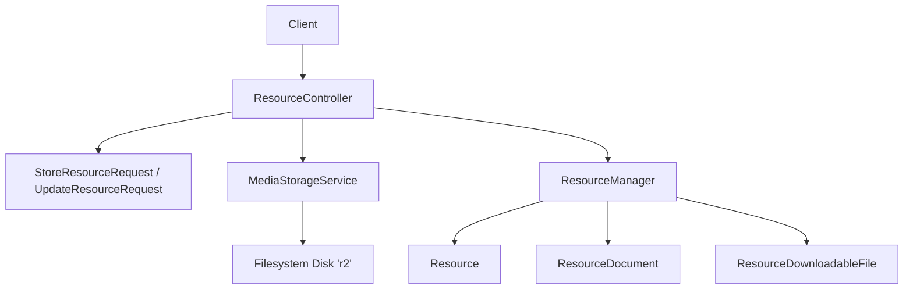
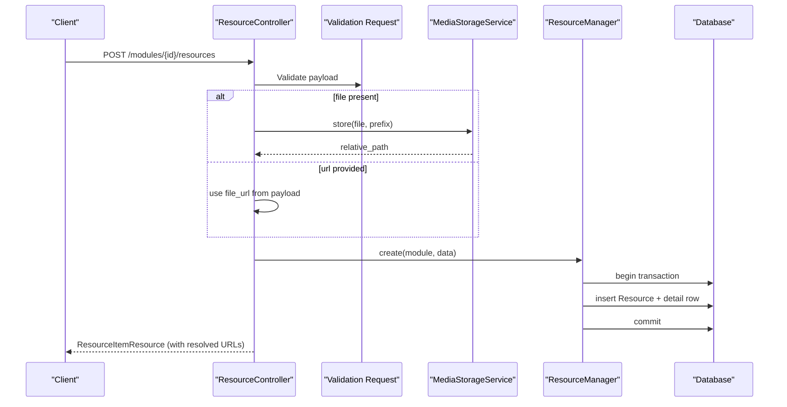
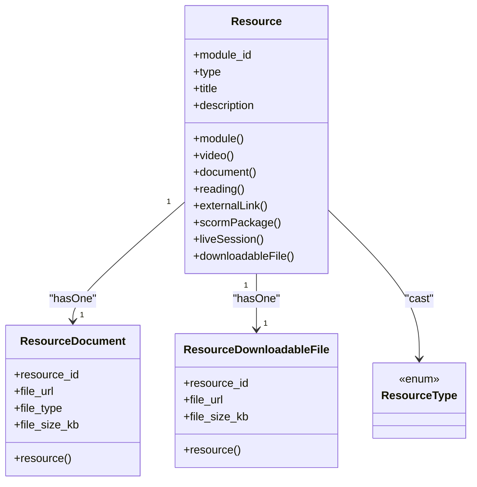
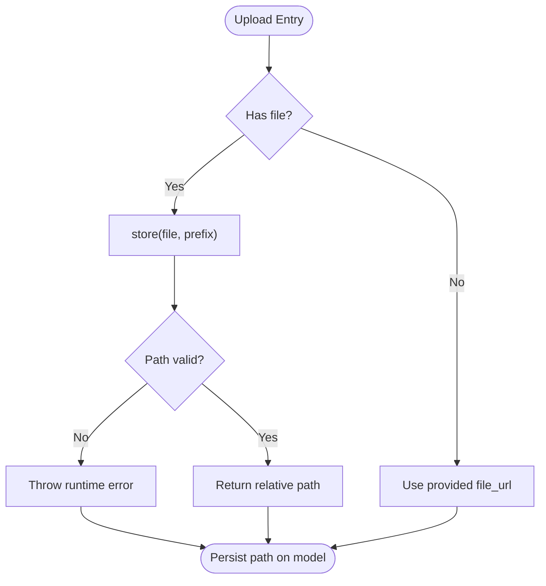
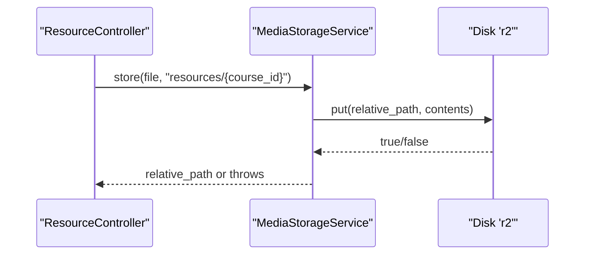
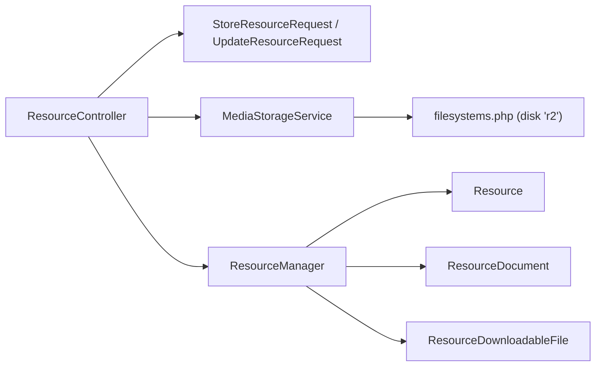

# Document Resources

<cite>
**Referenced Files in This Document**
- [Resource.php](file://app/Models/Resource.php)
- [ResourceDocument.php](file://app/Models/ResourceDocument.php)
- [ResourceDownloadableFile.php](file://app/Models/ResourceDownloadableFile.php)
- [ResourceType.php](file://app/Enums/ResourceType.php)
- [DocumentFileType.php](file://app/Enums/DocumentFileType.php)
- [ResourceManager.php](file://app/Services/Content/ResourceManager.php)
- [MediaStorageService.php](file://app\Services\Storage\MediaStorageService.php)
- [ResourceController.php](file://app\Http\Controllers\Api\V1\ResourceController.php)
- [StoreResourceRequest.php](file://app\Http\Requests\Api\V1\StoreResourceRequest.php)
- [UpdateResourceRequest.php](file://app\Http\Requests\Api\V1\UpdateResourceRequest.php)
- [filesystems.php](file://config/filesystems.php)
</cite>

## Table of Contents
1. Introduction
2. Project Structure
3. Core Components
4. Architecture Overview
5. Detailed Component Analysis
6. Dependency Analysis
7. Performance Considerations
8. Troubleshooting Guide
9. Conclusion

## Introduction
This document explains how the application manages Document Resources, covering both inline document viewing and downloadable files. It details:
- The ResourceDocument model for embedded documents such as PDFs, Word files, and presentations.
- The ResourceDownloadableFile model for file downloads with access control considerations and download tracking hooks.
- File upload processes, supported formats, size limitations, and storage management via a centralized storage service.
- Examples of creating document resources, handling uploads through MediaStorageService, and implementing secure file access.
- Preview generation, thumbnail creation, and content type detection strategies.
- Security considerations including virus scanning integration and storage optimization techniques.

## Project Structure
The resource system is centered around a polymorphic Resource entity that can be one of several types, including Document and DownloadableFile. Each type has its own detail table and model. Uploads flow through a single storage service to Cloudflare R2 (S3-compatible), while controllers orchestrate validation, persistence, and URL resolution.

**Diagram sources**
- [ResourceController.php:20-85](file://app/Http/Controllers/Api/V1/ResourceController.php#L20-L85)
- [StoreResourceRequest.php:20-63](file://app/Http/Requests/Api/V1/StoreResourceRequest.php#L20-L63)
- [UpdateResourceRequest.php:16-54](file://app/Http/Requests/Api/V1/UpdateResourceRequest.php#L16-L54)
- [MediaStorageService.php:24-84](file://app/Services/Storage/MediaStorageService.php#L24-L84)
- [ResourceManager.php:33-178](file://app/Services/Content/ResourceManager.php#L33-L178)
- [filesystems.php:75-86](file://config/filesystems.php#L75-L86)

**Section sources**
- [Resource.php:15-103](file://app/Models/Resource.php#L15-L103)
- [ResourceController.php:20-85](file://app/Http/Controllers/Api/V1/ResourceController.php#L20-L85)
- [StoreResourceRequest.php:20-63](file://app/Http/Requests/Api/V1/StoreResourceRequest.php#L20-L63)
- [UpdateResourceRequest.php:16-54](file://app/Http/Requests/Api/V1/UpdateResourceRequest.php#L16-L54)
- [MediaStorageService.php:24-84](file://app/Services/Storage/MediaStorageService.php#L24-L84)
- [ResourceManager.php:33-178](file://app/Services/Content/ResourceManager.php#L33-L178)
- [filesystems.php:75-86](file://config/filesystems.php#L75-L86)

## Core Components
- Resource: Central entity with a type enum and relationships to specific detail models (document, downloadable_file, etc.).
- ResourceDocument: Stores metadata for inline documents (PDF, DOCX, PPTX).
- ResourceDownloadableFile: Stores metadata for downloadable assets.
- ResourceManager: Orchestrates creation, update, and deletion across all resource types and their detail tables within a transaction.
- MediaStorageService: Single entry point for storing, reading URLs, and deleting files on the configured disk.
- ResourceController: Exposes API endpoints for create/update/show/delete, coordinating validation, storage, and persistence.
- Validation Requests: Enforce allowed file types, sizes, and required fields per resource type.

**Section sources**
- [Resource.php:15-103](file://app/Models/Resource.php#L15-L103)
- [ResourceDocument.php:11-34](file://app/Models/ResourceDocument.php#L11-L34)
- [ResourceDownloadableFile.php:10-28](file://app/Models/ResourceDownloadableFile.php#L10-L28)
- [ResourceManager.php:33-178](file://app/Services/Content/ResourceManager.php#L33-L178)
- [MediaStorageService.php:24-84](file://app/Services/Storage/MediaStorageService.php#L24-L84)
- [ResourceController.php:20-85](file://app/Http/Controllers/Api/V1/ResourceController.php#L20-L85)
- [StoreResourceRequest.php:20-63](file://app/Http/Requests/Api/V1/StoreResourceRequest.php#L20-L63)
- [UpdateResourceRequest.php:16-54](file://app/Http/Requests/Api/V1/UpdateResourceRequest.php#L16-L54)

## Architecture Overview
The end-to-end flow for creating or updating a document resource:
- Client sends a POST/PATCH request with either a file upload or a file URL.
- Validation requests enforce allowed MIME types and maximum sizes.
- If a file is uploaded, MediaStorageService stores it under a course-scoped prefix and returns a relative path.
- ResourceManager creates or updates the Resource and its type-specific detail row (ResourceDocument or ResourceDownloadableFile).
- Controller resolves public URLs via MediaStorageService when returning responses.

**Diagram sources**
- [ResourceController.php:30-46](file://app/Http/Controllers/Api/V1/ResourceController.php#L30-L46)
- [StoreResourceRequest.php:25-63](file://app/Http/Requests/Api/V1/StoreResourceRequest.php#L25-L63)
- [MediaStorageService.php:32-41](file://app/Services/Storage/MediaStorageService.php#L32-L41)
- [ResourceManager.php:33-58](file://app/Services/Content/ResourceManager.php#L33-L58)

## Detailed Component Analysis

### Resource Model and Relationships
- Resource holds module association and polymorphic relationships to detail models (video, document, reading, external_link, scorm_package, live_session, downloadable_file).
- ResourceType enum defines the supported kinds, including document and downloadable_file.

**Diagram sources**
- [Resource.php:15-103](file://app/Models/Resource.php#L15-L103)
- [ResourceDocument.php:11-34](file://app/Models/ResourceDocument.php#L11-L34)
- [ResourceDownloadableFile.php:10-28](file://app/Models/ResourceDownloadableFile.php#L10-L28)
- [ResourceType.php:7-16](file://app/Enums/ResourceType.php#L7-L16)

**Section sources**
- [Resource.php:15-103](file://app/Models/Resource.php#L15-L103)
- [ResourceType.php:7-16](file://app/Enums/ResourceType.php#L7-L16)

### ResourceDocument Model
- Primary key is resource_id; no auto-increment or timestamps.
- Stores file_url, file_type (cast to DocumentFileType enum), and optional file_size_kb.
- Belongs to Resource.

Supported document types are defined by the DocumentFileType enum.

**Section sources**
- [ResourceDocument.php:11-34](file://app/Models/ResourceDocument.php#L11-L34)
- [DocumentFileType.php:7-12](file://app/Enums/DocumentFileType.php#L7-L12)

### ResourceDownloadableFile Model
- Primary key is resource_id; no auto-increment or timestamps.
- Stores file_url and optional file_size_kb.
- Belongs to Resource.

Access control and download tracking:
- Access control is enforced at the controller level via authorization before any operation on a resource.
- Download tracking can be implemented by intercepting download requests and recording events; currently, the models do not include built-in counters, but the structure supports adding them.

**Section sources**
- [ResourceDownloadableFile.php:10-28](file://app/Models/ResourceDownloadableFile.php#L10-L28)
- [ResourceController.php:77-84](file://app/Http/Controllers/Api/V1/ResourceController.php#L77-L84)

### Storage Management with MediaStorageService
- Centralizes all uploads to the configured disk (R2).
- Provides methods to store files, put raw contents, delete files, and resolve public URLs.
- Safely handles external URLs by passing them through unchanged.

**Diagram sources**
- [MediaStorageService.php:32-41](file://app/Services/Storage/MediaStorageService.php#L32-L41)
- [MediaStorageService.php:55-62](file://app/Services/Storage/MediaStorageService.php#L55-L62)
- [MediaStorageService.php:68-79](file://app/Services/Storage/MediaStorageService.php#L68-L79)

**Section sources**
- [MediaStorageService.php:24-84](file://app/Services/Storage/MediaStorageService.php#L24-L84)
- [filesystems.php:75-86](file://config/filesystems.php#L75-L86)

### File Uploads, Supported Formats, and Size Limits
- Allowed MIME types for document/downloadable_file uploads: pdf, doc, docx, ppt, pptx, xls, xlsx, zip, csv, txt.
- Maximum file size for these uploads: 20 MB (20480 KB).
- SCORM packages accept only zip and up to 50 MB (51200 KB).
- Frontend enforces a 20 MB client-side limit and provides an alternate “paste URL” mode.

Validation rules ensure that either a file is uploaded or a valid file_url is provided for document and downloadable_file types.

**Section sources**
- [StoreResourceRequest.php:39-44](file://app/Http/Requests/Api/V1/StoreResourceRequest.php#L39-L44)
- [StoreResourceRequest.php:52-55](file://app/Http/Requests/Api/V1/StoreResourceRequest.php#L52-L55)
- [UpdateResourceRequest.php:33-38](file://app/Http/Requests/Api/V1/UpdateResourceRequest.php#L33-L38)
- [UpdateResourceRequest.php:44-47](file://app/Http/Requests/Api/V1/UpdateResourceRequest.php#L44-L47)

### Creating Document Resources
- Create a Resource with type = document and provide either a file or a file_url.
- For document type, also supply file_type (pdf, pptx, docx) and optionally file_size_kb.
- ResourceManager persists the Resource and the corresponding ResourceDocument within a database transaction.

Example workflow:
- Submit a POST request with type=“document”, title, description, and either file or file_url.
- On success, the response includes the created resource with related document details.

**Section sources**
- [StoreResourceRequest.php:25-44](file://app/Http/Requests/Api/V1/StoreResourceRequest.php#L25-L44)
- [ResourceManager.php:33-58](file://app/Services/Content/ResourceManager.php#L33-L58)
- [ResourceManager.php:101-141](file://app/Services/Content/ResourceManager.php#L101-L141)

### Handling File Uploads Through MediaStorageService
- When a file is present, the controller delegates storage to MediaStorageService.store(), which writes to the R2 disk under a course-scoped prefix and returns a relative path.
- On update, the previous file is deleted before storing the new one to avoid orphaned files.

**Diagram sources**
- [ResourceController.php:35-41](file://app/Http/Controllers/Api/V1/ResourceController.php#L35-L41)
- [MediaStorageService.php:32-41](file://app/Services/Storage/MediaStorageService.php#L32-L41)
- [filesystems.php:75-86](file://config/filesystems.php#L75-L86)

**Section sources**
- [ResourceController.php:35-61](file://app/Http/Controllers/Api/V1/ResourceController.php#L35-L61)
- [MediaStorageService.php:32-41](file://app/Services/Storage/MediaStorageService.php#L32-L41)

### Implementing Secure File Access
- Authorization: The controller authorizes destructive operations (delete) using policies.
- Access control for downloads: Add middleware or policy checks before serving downloadable files to ensure the requester has permission.
- URL resolution: Use MediaStorageService.url() to generate public URLs only after verifying access.

Recommended steps:
- Wrap download endpoints with authorization checks.
- Generate time-limited signed URLs if using S3-compatible storage features.
- Log access attempts for auditability.

**Section sources**
- [ResourceController.php:77-84](file://app/Http/Controllers/Api/V1/ResourceController.php#L77-L84)
- [MediaStorageService.php:68-79](file://app/Services/Storage/MediaStorageService.php#L68-L79)

### Preview Generation, Thumbnails, and Content Type Detection
- Inline preview: For document resources, render based on file_type (pdf, pptx, docx) using appropriate embeds or viewers.
- Thumbnail generation: Not implemented in the current codebase; consider generating thumbnails during upload or via queued jobs.
- Content type detection: The server relies on validated MIME types from the upload pipeline; you may add server-side MIME sniffing or magic-byte detection for extra safety.

[No sources needed since this section provides general guidance]

### File Security and Virus Scanning Integration
- Input validation: Enforce strict MIME allowlists and size limits via validation requests.
- Virus scanning: Integrate a scanning step between upload and making the file available (e.g., queue a job to scan and quarantine malicious files).
- Quarantine strategy: Move suspicious files to a restricted area and notify administrators.

[No sources needed since this section provides general guidance]

### Storage Optimization Strategies
- Deduplicate identical files by hashing content and reusing existing paths.
- Compress large documents where possible without losing quality.
- Use CDN caching for static assets and set appropriate cache headers.
- Periodically clean up orphaned files during resource updates/deletes.

[No sources needed since this section provides general guidance]

## Dependency Analysis
The following diagram shows key dependencies among controllers, services, models, and configuration.

**Diagram sources**
- [ResourceController.php:20-85](file://app/Http/Controllers/Api/V1/ResourceController.php#L20-L85)
- [StoreResourceRequest.php:20-63](file://app/Http/Requests/Api/V1/StoreResourceRequest.php#L20-L63)
- [UpdateResourceRequest.php:16-54](file://app/Http/Requests/Api/V1/UpdateResourceRequest.php#L16-L54)
- [MediaStorageService.php:24-84](file://app/Services/Storage/MediaStorageService.php#L24-L84)
- [ResourceManager.php:33-178](file://app/Services/Content/ResourceManager.php#L33-L178)
- [filesystems.php:75-86](file://config/filesystems.php#L75-L86)

**Section sources**
- [ResourceController.php:20-85](file://app/Http/Controllers/Api/V1/ResourceController.php#L20-L85)
- [ResourceManager.php:33-178](file://app/Services/Content/ResourceManager.php#L33-L178)
- [MediaStorageService.php:24-84](file://app/Services/Storage/MediaStorageService.php#L24-L84)
- [filesystems.php:75-86](file://config/filesystems.php#L75-L86)

## Performance Considerations
- Keep uploads small; prefer pre-compressed documents.
- Offload heavy processing (thumbnail generation, virus scanning) to background jobs.
- Use efficient storage paths and consistent prefixes to simplify cleanup and CDN caching.
- Avoid N+1 queries when loading resource details; eager load relations as done in the show endpoint.

[No sources needed since this section provides general guidance]

## Troubleshooting Guide
Common issues and resolutions:
- Upload fails: Check disk configuration and credentials for the R2 disk; verify environment variables for access keys, bucket, endpoint, and URL.
- Invalid file type: Ensure the uploaded file matches the allowed MIME list; adjust validation rules if expanding supported formats.
- Orphaned files: Confirm that old files are deleted during updates; review delete logic in the controller and storage service.
- URL resolution errors: Verify that MediaStorageService.url() receives a valid relative path or external URL.

**Section sources**
- [filesystems.php:75-86](file://config/filesystems.php#L75-L86)
- [StoreResourceRequest.php:39-44](file://app/Http/Requests/Api/V1/StoreResourceRequest.php#L39-L44)
- [UpdateResourceRequest.php:33-38](file://app/Http/Requests/Api/V1/UpdateResourceRequest.php#L33-L38)
- [MediaStorageService.php:55-62](file://app/Services/Storage/MediaStorageService.php#L55-L62)
- [MediaStorageService.php:68-79](file://app/Services/Storage/MediaStorageService.php#L68-L79)

## Conclusion
The Document Resources system provides a robust foundation for managing both inline documents and downloadable files. With centralized storage, strict validation, and clear separation of concerns, it supports secure, scalable content delivery. Extending the system with preview generation, thumbnails, virus scanning, and download tracking can further enhance user experience and security posture.