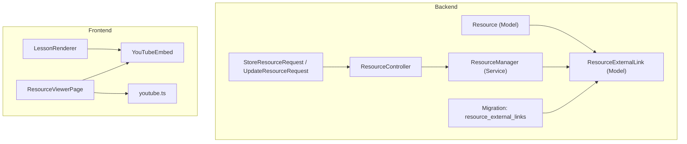
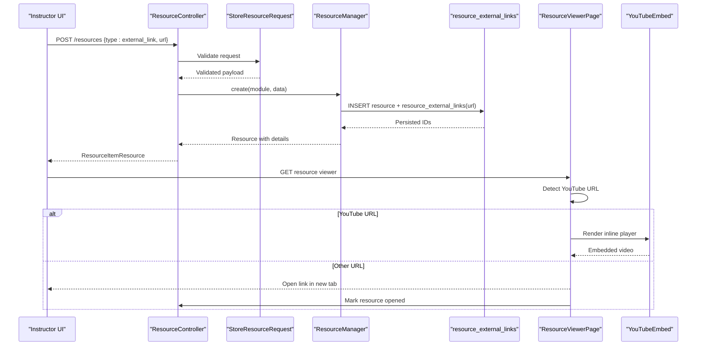
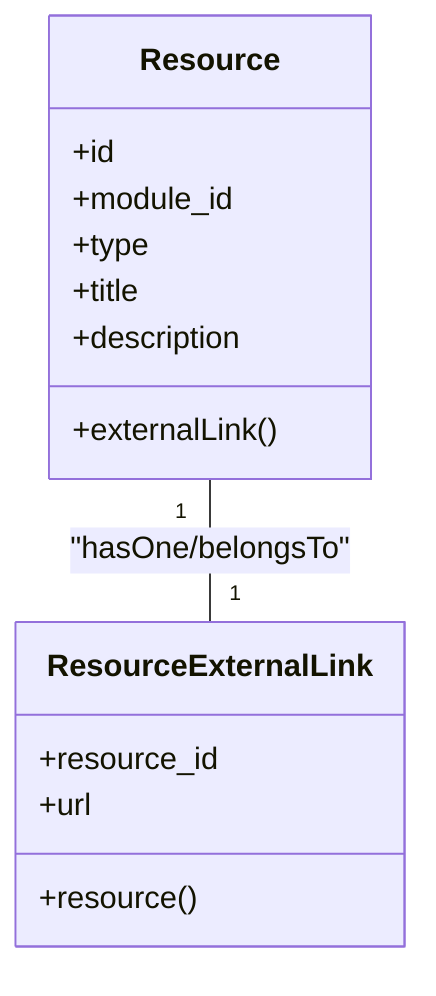
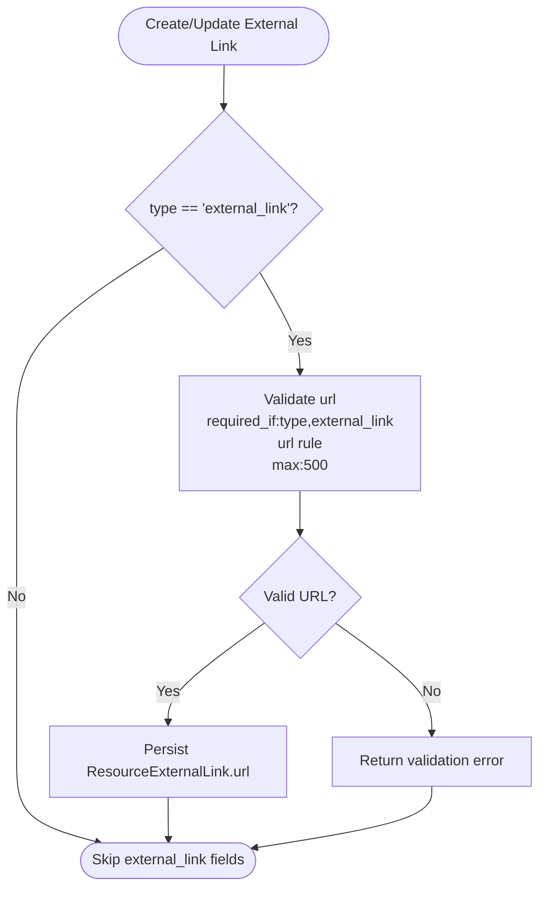
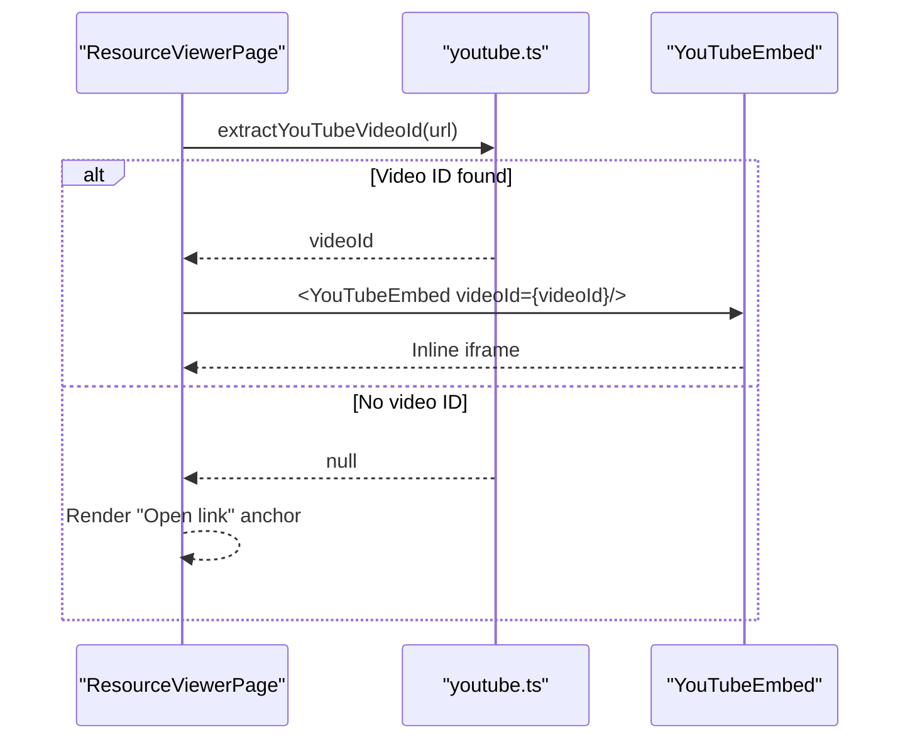
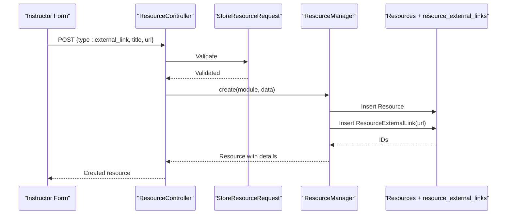
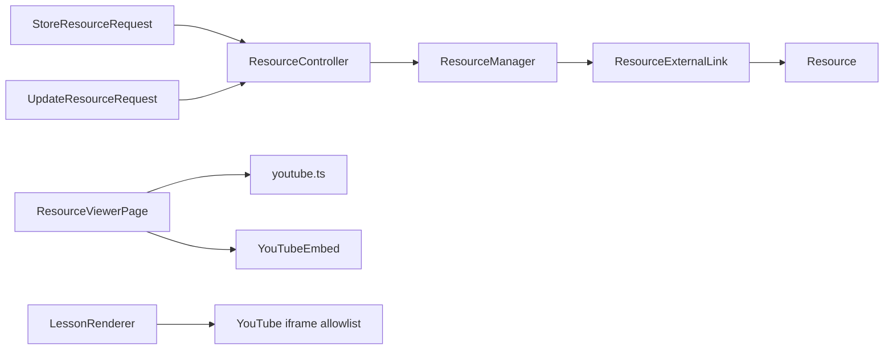

# External Link Resources

<cite>
**Referenced Files in This Document**
- [ResourceExternalLink.php](file://app/Models/ResourceExternalLink.php)
- [2024_01_01_000124_create_resource_external_links_table.php](file://database/migrations/2024_01_01_000124_create_resource_external_links_table.php)
- [Resource.php](file://app/Models/Resource.php)
- [ResourceManager.php](file://app/Services/Content/ResourceManager.php)
- [StoreResourceRequest.php](file://app/Http/Requests/Api/V1/StoreResourceRequest.php)
- [UpdateResourceRequest.php](file://app/Http/Requests/Api/V1/UpdateResourceRequest.php)
- [ResourceController.php](file://app/Http/Controllers/Api/V1/ResourceController.php)
- [ResourceViewerPage.tsx](file://frontend/src/features/learning/ResourceViewerPage.tsx)
- [YouTubeEmbed.tsx](file://frontend/src/components/media/YouTubeEmbed.tsx)
- [youtube.ts](file://frontend/src/lib/youtube.ts)
- [LessonRenderer.tsx](file://frontend/src/features/learning/LessonRenderer.tsx)
- [ProgressEngine.php](file://app/Services/Progress/ProgressEngine.php)
</cite>

## Table of Contents
1. Introduction
2. Project Structure
3. Core Components
4. Architecture Overview
5. Detailed Component Analysis
6. Dependency Analysis
7. Performance Considerations
8. Troubleshooting Guide
9. Conclusion

## Introduction
This document explains how the application stores, validates, renders, and tracks external link resources. It focuses on the ResourceExternalLink model for storing URLs, the validation pipeline that ensures safe inputs, the frontend behavior for embedding YouTube videos inline while opening other links in a new tab, and the completion tracking that marks an external link as opened. It also outlines security considerations around iframes and cross-origin content, and provides guidance for handling different content types and fallbacks when content is unavailable.

## Project Structure
External link resources are part of a unified resource system where each resource has a type and a type-specific detail table. For external links:
- The core Resource model holds common fields and relationships.
- A dedicated ResourceExternalLink model stores the URL for external_link resources.
- A migration defines the resource_external_links table with a primary key linking to resources.
- The ResourceManager creates and updates subtype details based on resource type.
- API requests validate the url field when creating or updating external_link resources.
- The frontend ResourceViewerPage renders external links, with special handling for YouTube URLs to embed them inline.
- LessonRenderer enforces strict iframe allowlists for reading content.

**Diagram sources**
- [Resource.php:64-69](file://app/Models/Resource.php#L64-L69)
- [ResourceExternalLink.php:10-27](file://app/Models/ResourceExternalLink.php#L10-L27)
- [ResourceManager.php:120-123](file://app/Services/Content/ResourceManager.php#L120-L123)
- [StoreResourceRequest.php:49-50](file://app/Http/Requests/Api/V1/StoreResourceRequest.php#L49-L50)
- [UpdateResourceRequest.php:42](file://app/Http/Requests/Api/V1/UpdateResourceRequest.php#L42)
- [ResourceController.php:25-28](file://app/Http/Controllers/Api/V1/ResourceController.php#L25-L28)
- [2024_01_01_000124_create_resource_external_links_table.php:13-16](file://database/migrations/2024_01_01_000124_create_resource_external_links_table.php#L13-L16)
- [ResourceViewerPage.tsx:23-63](file://frontend/src/features/learning/ResourceViewerPage.tsx#L23-L63)
- [YouTubeEmbed.tsx:15-25](file://frontend/src/components/media/YouTubeEmbed.tsx#L15-L25)
- [youtube.ts:1-22](file://frontend/src/lib/youtube.ts#L1-L22)
- [LessonRenderer.tsx:61-75](file://frontend/src/features/learning/LessonRenderer.tsx#L61-L75)

**Section sources**
- [Resource.php:64-69](file://app/Models/Resource.php#L64-L69)
- [ResourceExternalLink.php:10-27](file://app/Models/ResourceExternalLink.php#L10-L27)
- [2024_01_01_000124_create_resource_external_links_table.php:13-16](file://database/migrations/2024_01_01_000124_create_resource_external_links_table.php#L13-L16)
- [ResourceManager.php:120-123](file://app/Services/Content/ResourceManager.php#L120-L123)
- [StoreResourceRequest.php:49-50](file://app/Http/Requests/Api/V1/StoreResourceRequest.php#L49-L50)
- [UpdateResourceRequest.php:42](file://app/Http/Requests/Api/V1/UpdateResourceRequest.php#L42)
- [ResourceController.php:25-28](file://app/Http/Controllers/Api/V1/ResourceController.php#L25-L28)
- [ResourceViewerPage.tsx:23-63](file://frontend/src/features/learning/ResourceViewerPage.tsx#L23-L63)
- [YouTubeEmbed.tsx:15-25](file://frontend/src/components/media/YouTubeEmbed.tsx#L15-L25)
- [youtube.ts:1-22](file://frontend/src/lib/youtube.ts#L1-L22)
- [LessonRenderer.tsx:61-75](file://frontend/src/features/learning/LessonRenderer.tsx#L61-L75)

## Core Components
- ResourceExternalLink model: Stores the URL for external_link resources and relates back to its parent Resource via a one-to-one relationship using resource_id as the primary key.
- Migration: Defines the resource_external_links table with a foreign key constraint to resources and a url column limited to 500 characters.
- ResourceManager: Creates and updates the external_link subtype by persisting the validated url into ResourceExternalLink.
- Request validation: StoreResourceRequest and UpdateResourceRequest enforce that url is present and valid when the resource type is external_link.
- Frontend rendering: ResourceViewerPage detects YouTube URLs and renders an inline player; otherwise it opens the link in a new tab and records “opened” progress.
- Iframe security: LessonRenderer restricts allowed iframes to YouTube embed domains only.

**Section sources**
- [ResourceExternalLink.php:10-27](file://app/Models/ResourceExternalLink.php#L10-L27)
- [2024_01_01_000124_create_resource_external_links_table.php:13-16](file://database/migrations/2024_01_01_000124_create_resource_external_links_table.php#L13-L16)
- [ResourceManager.php:120-123](file://app/Services/Content/ResourceManager.php#L120-L123)
- [StoreResourceRequest.php:49-50](file://app/Http/Requests/Api/V1/StoreResourceRequest.php#L49-L50)
- [UpdateResourceRequest.php:42](file://app/Http/Requests/Api/V1/UpdateResourceRequest.php#L42)
- [ResourceViewerPage.tsx:23-63](file://frontend/src/features/learning/ResourceViewerPage.tsx#L23-L63)
- [LessonRenderer.tsx:61-75](file://frontend/src/features/learning/LessonRenderer.tsx#L61-L75)

## Architecture Overview
The external link flow spans backend validation, persistence, and frontend rendering with safety controls:

**Diagram sources**
- [ResourceController.php:30-45](file://app/Http/Controllers/Api/V1/ResourceController.php#L30-L45)
- [StoreResourceRequest.php:25-50](file://app/Http/Requests/Api/V1/StoreResourceRequest.php#L25-L50)
- [ResourceManager.php:33-43](file://app/Services/Content/ResourceManager.php#L33-L43)
- [ResourceManager.php:120-123](file://app/Services/Content/ResourceManager.php#L120-L123)
- [ResourceViewerPage.tsx:23-63](file://frontend/src/features/learning/ResourceViewerPage.tsx#L23-L63)
- [YouTubeEmbed.tsx:15-25](file://frontend/src/components/media/YouTubeEmbed.tsx#L15-L25)

## Detailed Component Analysis

### ResourceExternalLink Model and Schema
- Primary key: resource_id (one-to-one with Resource).
- Fields: url (string, max 500).
- Relationship: belongsTo Resource.
- Table constraints: Foreign key to resources with cascade delete.

**Diagram sources**
- [Resource.php:64-69](file://app/Models/Resource.php#L64-L69)
- [ResourceExternalLink.php:10-27](file://app/Models/ResourceExternalLink.php#L10-L27)
- [2024_01_01_000124_create_resource_external_links_table.php:13-16](file://database/migrations/2024_01_01_000124_create_resource_external_links_table.php#L13-L16)

**Section sources**
- [ResourceExternalLink.php:10-27](file://app/Models/ResourceExternalLink.php#L10-L27)
- [2024_01_01_000124_create_resource_external_links_table.php:13-16](file://database/migrations/2024_01_01_000124_create_resource_external_links_table.php#L13-L16)

### URL Validation and Security Checks
- Backend validation:
  - url is required when type is external_link.
  - url must be a valid URL string and not exceed 500 characters.
  - Update operations accept optional url with the same constraints.
- Frontend sanitization for embedded content:
  - Only YouTube embed URLs are allowed in lesson content iframes.
  - Links rendered from lesson content are forced to open in new tabs with safe rel attributes.

**Diagram sources**
- [StoreResourceRequest.php:49-50](file://app/Http/Requests/Api/V1/StoreResourceRequest.php#L49-L50)
- [UpdateResourceRequest.php:42](file://app/Http/Requests/Api/V1/UpdateResourceRequest.php#L42)
- [ResourceManager.php:120-123](file://app/Services/Content/ResourceManager.php#L120-L123)

**Section sources**
- [StoreResourceRequest.php:25-50](file://app/Http/Requests/Api/V1/StoreResourceRequest.php#L25-L50)
- [UpdateResourceRequest.php:21-53](file://app/Http/Requests/Api/V1/UpdateResourceRequest.php#L21-L53)
- [LessonRenderer.tsx:61-75](file://frontend/src/features/learning/LessonRenderer.tsx#L61-L75)

### Content Type Detection and Embedding Behavior
- YouTube detection:
  - extractYouTubeVideoId parses common YouTube URL shapes and returns the video ID or null.
  - isYouTubeUrl checks whether a URL matches YouTube patterns.
- Inline embedding:
  - YouTubeEmbed renders a responsive iframe using youtube-nocookie.com for privacy-enhanced playback.
  - ResourceViewerPage uses YouTube detection to choose between inline player and external link.
- Non-YouTube external links:
  - Opened in a new tab with target="_blank" and rel="noreferrer".
  - Clicking triggers marking the resource as opened.

**Diagram sources**
- [youtube.ts:1-22](file://frontend/src/lib/youtube.ts#L1-L22)
- [ResourceViewerPage.tsx:23-63](file://frontend/src/features/learning/ResourceViewerPage.tsx#L23-L63)
- [YouTubeEmbed.tsx:15-25](file://frontend/src/components/media/YouTubeEmbed.tsx#L15-L25)

**Section sources**
- [youtube.ts:1-22](file://frontend/src/lib/youtube.ts#L1-L22)
- [ResourceViewerPage.tsx:23-63](file://frontend/src/features/learning/ResourceViewerPage.tsx#L23-L63)
- [YouTubeEmbed.tsx:15-25](file://frontend/src/components/media/YouTubeEmbed.tsx#L15-L25)

### Cross-Origin Policies and Security Considerations
- Iframe policy:
  - LessonRenderer allows only YouTube embed URLs for iframes; any other iframe src is removed during sanitization.
  - All anchors in lesson content are forced to target="_blank" and rel="noopener noreferrer" to prevent reverse tabnabbing.
- External link behavior:
  - Non-YouTube external links open in new tabs with rel="noreferrer" to avoid leaking referrer information.
- Privacy:
  - YouTube embeds use youtube-nocookie.com to minimize tracking until playback starts.

**Section sources**
- [LessonRenderer.tsx:61-75](file://frontend/src/features/learning/LessonRenderer.tsx#L61-L75)
- [youtube.ts:14-22](file://frontend/src/lib/youtube.ts#L14-L22)
- [ResourceViewerPage.tsx:51-63](file://frontend/src/features/learning/ResourceViewerPage.tsx#L51-L63)

### Creating External Link Resources
- Create flow:
  - Instructor submits a resource with type=external_link and a url.
  - StoreResourceRequest validates url presence and format.
  - ResourceManager persists Resource and ResourceExternalLink within a transaction.
  - ResourceController returns the created resource via ResourceItemResource.
- Update flow:
  - UpdateResourceRequest accepts optional url with the same constraints.
  - ResourceManager updates the existing external_link subtype’s url.

**Diagram sources**
- [ResourceController.php:30-45](file://app/Http/Controllers/Api/V1/ResourceController.php#L30-L45)
- [StoreResourceRequest.php:25-50](file://app/Http/Requests/Api/V1/StoreResourceRequest.php#L25-L50)
- [ResourceManager.php:33-43](file://app/Services/Content/ResourceManager.php#L33-L43)
- [ResourceManager.php:120-123](file://app/Services/Content/ResourceManager.php#L120-L123)

**Section sources**
- [ResourceController.php:30-45](file://app/Http/Controllers/Api/V1/ResourceController.php#L30-L45)
- [StoreResourceRequest.php:25-50](file://app/Http/Requests/Api/V1/StoreResourceRequest.php#L25-L50)
- [ResourceManager.php:33-43](file://app/Services/Content/ResourceManager.php#L33-L43)
- [ResourceManager.php:120-123](file://app/Services/Content/ResourceManager.php#L120-L123)

### Handling Different Content Types
- YouTube videos:
  - Detected via URL pattern; rendered inline using YouTubeEmbed.
  - Opening is recorded immediately when the embed appears and the resource is not already complete.
- Other web pages:
  - Opened in a new tab; clicking marks the resource as opened.
- Fallbacks:
  - If no URL is provided or invalid, creation/update fails at validation.
  - If the external site is down or blocks embedding, non-YouTube links still open in a new tab; YouTube embeds rely on YouTube’s availability.

**Section sources**
- [ResourceViewerPage.tsx:23-63](file://frontend/src/features/learning/ResourceViewerPage.tsx#L23-L63)
- [youtube.ts:1-22](file://frontend/src/lib/youtube.ts#L1-L22)
- [StoreResourceRequest.php:49-50](file://app/Http/Requests/Api/V1/StoreResourceRequest.php#L49-L50)

### Link Monitoring, Broken Link Detection, and Fallback Mechanisms
- Monitoring:
  - The system records when an external link is marked as opened via the progress engine logic for external_link resources.
- Broken link detection:
  - There is no server-side HTTP check for link reachability in the referenced files.
  - Frontend does not perform preflight checks; it relies on the browser to navigate or load the embed.
- Fallback mechanisms:
  - For YouTube links, inline playback is used; if unavailable, students can still open the link in a new tab.
  - For other links, the default behavior is to open externally; no automatic fallback to alternative content is implemented in the referenced code.

**Section sources**
- [ProgressEngine.php:170-198](file://app/Services/Progress/ProgressEngine.php#L170-L198)
- [ResourceViewerPage.tsx:23-63](file://frontend/src/features/learning/ResourceViewerPage.tsx#L23-L63)

## Dependency Analysis
External link functionality depends on coordinated components across backend and frontend:

**Diagram sources**
- [StoreResourceRequest.php:25-50](file://app/Http/Requests/Api/V1/StoreResourceRequest.php#L25-L50)
- [UpdateResourceRequest.php:21-53](file://app/Http/Requests/Api/V1/UpdateResourceRequest.php#L21-L53)
- [ResourceController.php:30-45](file://app/Http/Controllers/Api/V1/ResourceController.php#L30-L45)
- [ResourceManager.php:120-123](file://app/Services/Content/ResourceManager.php#L120-L123)
- [ResourceExternalLink.php:10-27](file://app/Models/ResourceExternalLink.php#L10-L27)
- [Resource.php:64-69](file://app/Models/Resource.php#L64-L69)
- [ResourceViewerPage.tsx:23-63](file://frontend/src/features/learning/ResourceViewerPage.tsx#L23-L63)
- [youtube.ts:1-22](file://frontend/src/lib/youtube.ts#L1-L22)
- [YouTubeEmbed.tsx:15-25](file://frontend/src/components/media/YouTubeEmbed.tsx#L15-L25)
- [LessonRenderer.tsx:61-75](file://frontend/src/features/learning/LessonRenderer.tsx#L61-L75)

**Section sources**
- [StoreResourceRequest.php:25-50](file://app/Http/Requests/Api/V1/StoreResourceRequest.php#L25-L50)
- [UpdateResourceRequest.php:21-53](file://app/Http/Requests/Api/V1/UpdateResourceRequest.php#L21-L53)
- [ResourceController.php:30-45](file://app/Http/Controllers/Api/V1/ResourceController.php#L30-L45)
- [ResourceManager.php:120-123](file://app/Services/Content/ResourceManager.php#L120-L123)
- [ResourceExternalLink.php:10-27](file://app/Models/ResourceExternalLink.php#L10-L27)
- [Resource.php:64-69](file://app/Models/Resource.php#L64-L69)
- [ResourceViewerPage.tsx:23-63](file://frontend/src/features/learning/ResourceViewerPage.tsx#L23-L63)
- [youtube.ts:1-22](file://frontend/src/lib/youtube.ts#L1-L22)
- [YouTubeEmbed.tsx:15-25](file://frontend/src/components/media/YouTubeEmbed.tsx#L15-L25)
- [LessonRenderer.tsx:61-75](file://frontend/src/features/learning/LessonRenderer.tsx#L61-L75)

## Performance Considerations
- Database:
  - resource_external_links uses a single-row per resource with a small url column; minimal overhead.
- Frontend:
  - YouTube detection is lightweight regex-based parsing.
  - Inline embedding avoids navigation and reduces page reloads for YouTube content.
- Network:
  - External links depend on third-party availability; consider caching strategies if frequently accessed.

[No sources needed since this section provides general guidance]

## Troubleshooting Guide
- Validation errors:
  - Missing or invalid url when creating/updating external_link resources will trigger request validation errors.
- YouTube embed not showing:
  - Ensure the URL matches known YouTube patterns; otherwise, it will render as an external link.
  - LessonRenderer only allows YouTube iframe domains; other iframes are stripped.
- Progress not marking as completed:
  - External links mark as opened on click (or embed appearance for YouTube); ensure the user interaction occurs and the resource is not already complete.

**Section sources**
- [StoreResourceRequest.php:49-50](file://app/Http/Requests/Api/V1/StoreResourceRequest.php#L49-L50)
- [UpdateResourceRequest.php:42](file://app/Http/Requests/Api/V1/UpdateResourceRequest.php#L42)
- [LessonRenderer.tsx:61-75](file://frontend/src/features/learning/LessonRenderer.tsx#L61-L75)
- [ResourceViewerPage.tsx:23-63](file://frontend/src/features/learning/ResourceViewerPage.tsx#L23-L63)
- [ProgressEngine.php:170-198](file://app/Services/Progress/ProgressEngine.php#L170-L198)

## Conclusion
External link resources are stored in a dedicated table linked to the Resource model and validated strictly on both backend and frontend. YouTube links receive special treatment with inline embedding via a privacy-enhanced domain, while other links open externally and record “opened” progress. Security is enforced through narrow iframe allowlists and safe link attributes. While monitoring captures opened events, there is no built-in broken link detection in the referenced code; fallbacks rely on standard browser behaviors.

[No sources needed since this section summarizes without analyzing specific files]