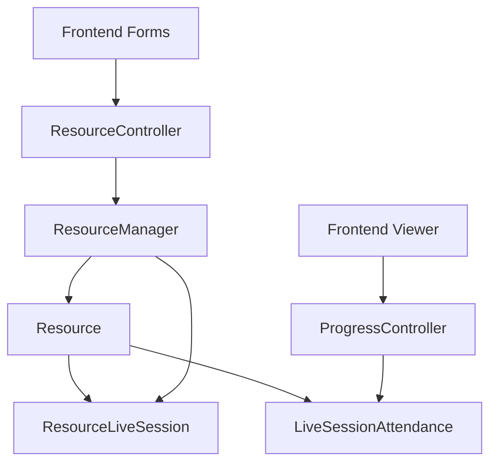
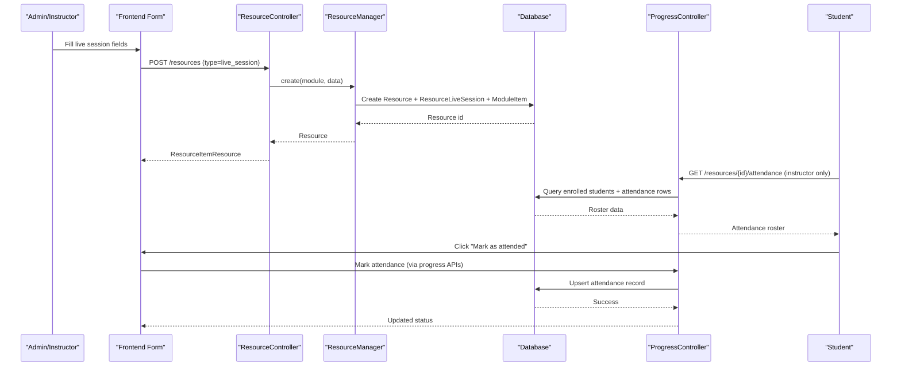
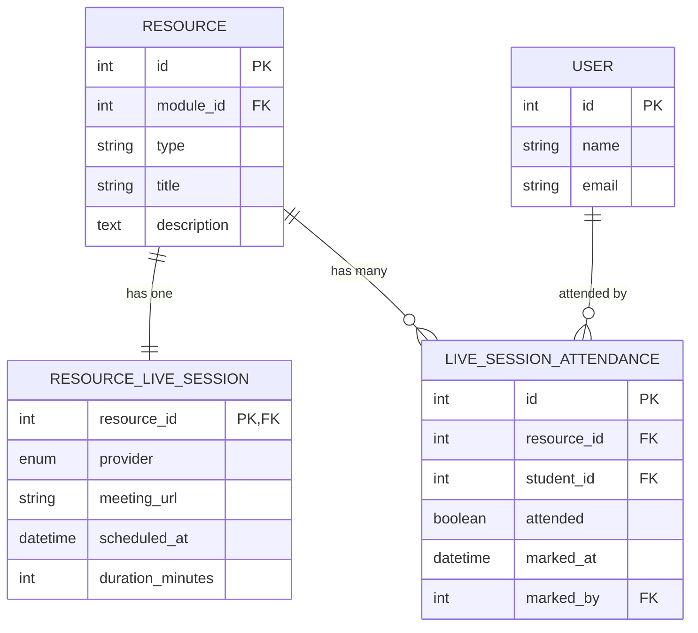
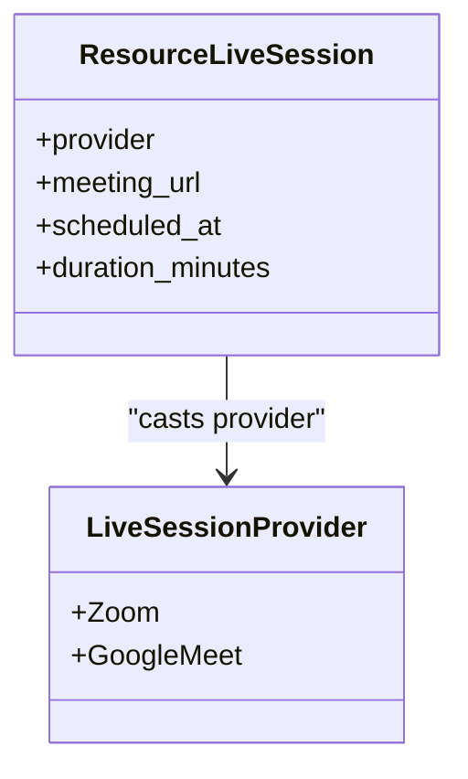
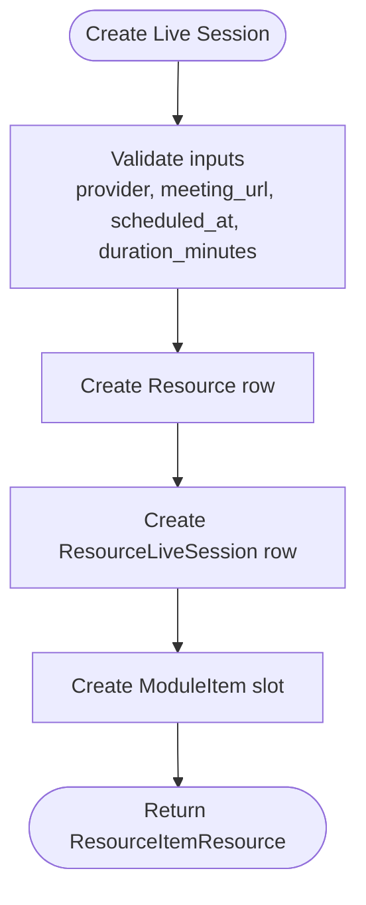
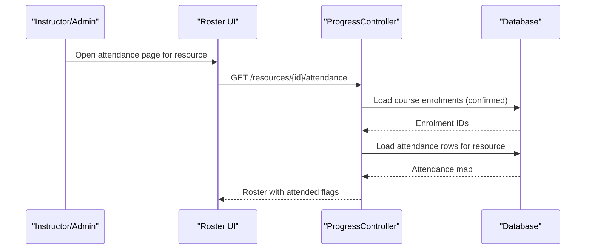
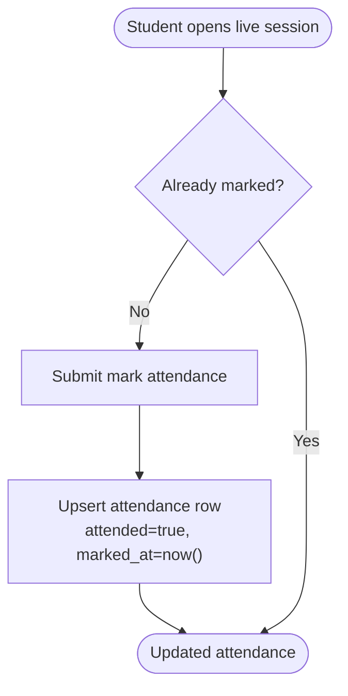
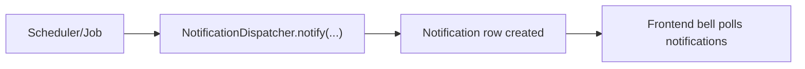
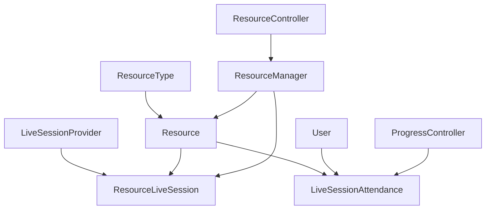

# Live Session Resources

<cite>
**Referenced Files in This Document**
- [Resource.php](file://app/Models/Resource.php)
- [ResourceLiveSession.php](file://app/Models/ResourceLiveSession.php)
- [LiveSessionAttendance.php](file://app/Models/LiveSessionAttendance.php)
- [LiveSessionProvider.php](file://app/Enums/LiveSessionProvider.php)
- [ResourceManager.php](file://app/Services/Content/ResourceManager.php)
- [ResourceController.php](file://app/Http/Controllers/Api/V1/ResourceController.php)
- [ProgressController.php](file://app/Http/Controllers/Api/V1/ProgressController.php)
- [ResourcePolicy.php](file://app/Policies/ResourcePolicy.php)
- [2024_01_01_000126_create_resource_live_sessions_table.php](file://database/migrations/2024_01_01_000126_create_resource_live_sessions_table.php)
- [2024_01_01_000128_create_live_session_attendance_table.php](file://database/migrations/2024_01_01_000128_create_live_session_attendance_table.php)
- [ResourceForm.tsx](file://frontend/src/features/courseStructure\ResourceForm.tsx)
- [ResourceViewerPage.tsx](file://frontend/src/features/learning\ResourceViewerPage.tsx)
- [useProgress.ts](file://frontend/src/features/progress/useProgress.ts)
- [api.ts](file://frontend/src/features/progress/api.ts)
- [NotificationBell.tsx](file://frontend/src/features/communication/NotificationBell.tsx)
- [NotificationDispatcher.php](file://app/Services/Notifications/NotificationDispatcher.php)
</cite>

## Table of Contents
1. Introduction
2. Project Structure
3. Core Components
4. Architecture Overview
5. Detailed Component Analysis
6. Dependency Analysis
7. Performance Considerations
8. Troubleshooting Guide
9. Conclusion
10. Appendices

## Introduction
This document explains the Live Session Resources feature that enables real-time virtual classes and meetings within the platform. It covers scheduling live sessions with provider integration (Zoom, Google Meet), creating and updating session resources, managing participant access, tracking attendance, and integrating with the notification system. It also addresses scheduling conflicts, timezone handling, and how to extend the system for calendar integrations and automated reminders.

## Project Structure
Live sessions are implemented as a resource subtype with dedicated storage and relationships:
- Resource is the parent entity for all content types, including live sessions.
- ResourceLiveSession stores provider-specific details like meeting URL, scheduled time, and duration.
- LiveSessionAttendance records per-student attendance for each live session resource.
- The frontend provides forms to create live sessions and viewers to join them and mark attendance.
- Policies enforce that only admins or course instructors can manage resources and view attendance rosters.

**Diagram sources**
- [Resource.php:79-101](file://app/Models/Resource.php#L79-L101)
- [ResourceLiveSession.php:11-35](file://app/Models/ResourceLiveSession.php#L11-L35)
- [LiveSessionAttendance.php:12-57](file://app/Models/LiveSessionAttendance.php#L12-L57)
- [ResourceManager.php:33-58](file://app/Services/Content/ResourceManager.php#L33-L58)
- [ResourceController.php:25-45](file://app/Http/Controllers/Api/V1/ResourceController.php#L25-L45)
- [ProgressController.php:155-181](file://app/Http/Controllers/Api/V1/ProgressController.php#L155-L181)

**Section sources**
- [Resource.php:15-101](file://app/Models/Resource.php#L15-L101)
- [ResourceLiveSession.php:11-35](file://app/Models/ResourceLiveSession.php#L11-L35)
- [LiveSessionAttendance.php:12-57](file://app/Models/LiveSessionAttendance.php#L12-L57)
- [ResourceManager.php:33-180](file://app/Services/Content/ResourceManager.php#L33-L180)
- [ResourceController.php:18-85](file://app/Http/Controllers/Api/V1/ResourceController.php#L18-L85)
- [ProgressController.php:155-181](file://app/Http/Controllers/Api/V1/ProgressController.php#L155-L181)

## Core Components
- Resource model: Central entity with type casting and typed relationships to detail tables, including live sessions and attendance.
- ResourceLiveSession model: Stores provider, meeting URL, scheduled time, and duration; linked to Resource via a one-to-one relationship.
- LiveSessionAttendance model: Tracks per-student attendance per session with timestamps and who marked it.
- ResourceManager service: Creates/updates resources and their subtypes atomically, including live sessions.
- ResourceController: Exposes API endpoints to create, update, show, and delete resources.
- ProgressController: Provides an attendance roster endpoint for live sessions.
- Policies: Restrict management and attendance viewing to admins or course instructors.
- Frontend: Forms to create live sessions, viewer to join and mark attendance, and roster UI for instructors.

**Section sources**
- [Resource.php:15-101](file://app/Models/Resource.php#L15-L101)
- [ResourceLiveSession.php:11-35](file://app/Models/ResourceLiveSession.php#L11-L35)
- [LiveSessionAttendance.php:12-57](file://app/Models/LiveSessionAttendance.php#L12-L57)
- [ResourceManager.php:33-180](file://app/Services/Content/ResourceManager.php#L33-L180)
- [ResourceController.php:18-85](file://app/Http/Controllers/Api/V1/ResourceController.php#L18-L85)
- [ProgressController.php:155-181](file://app/Http/Controllers/Api/V1/ProgressController.php#L155-L181)
- [ResourcePolicy.php:13-43](file://app/Policies/ResourcePolicy.php#L13-L43)
- [ResourceForm.tsx:269-297](file://frontend/src/features/courseStructure\ResourceForm.tsx#L269-L297)
- [ResourceViewerPage.tsx:242-269](file://frontend/src/features/learning\ResourceViewerPage.tsx#L242-L269)

## Architecture Overview
The live session flow spans creation, enrollment-based visibility, joining, and attendance tracking:

**Diagram sources**
- [ResourceController.php:30-45](file://app/Http/Controllers/Api/V1/ResourceController.php#L30-L45)
- [ResourceManager.php:33-58](file://app/Services/Content/ResourceManager.php#L33-L58)
- [ProgressController.php:155-181](file://app/Http/Controllers/Api/V1/ProgressController.php#L155-L181)
- [ResourceViewerPage.tsx:242-269](file://frontend/src/features/learning\ResourceViewerPage.tsx#L242-L269)

## Detailed Component Analysis

### Data Model and Relationships
- Resource has a one-to-one relationship to ResourceLiveSession and a one-to-many relationship to LiveSessionAttendance.
- ResourceLiveSession uses a primary key on resource_id and casts provider to an enum and scheduled_at to datetime.
- LiveSessionAttendance includes unique constraint on resource_id and student_id to prevent duplicate attendance entries.

**Diagram sources**
- [Resource.php:79-101](file://app/Models/Resource.php#L79-L101)
- [ResourceLiveSession.php:11-35](file://app/Models/ResourceLiveSession.php#L11-L35)
- [LiveSessionAttendance.php:12-57](file://app/Models/LiveSessionAttendance.php#L12-L57)
- [2024_01_01_000126_create_resource_live_sessions_table.php:11-19](file://database/migrations/2024_01_01_000126_create_resource_live_sessions_table.php#L11-L19)
- [2024_01_01_000128_create_live_session_attendance_table.php:11-21](file://database/migrations/2024_01_01_000128_create_live_session_attendance_table.php#L11-L21)

**Section sources**
- [Resource.php:15-101](file://app/Models/Resource.php#L15-L101)
- [ResourceLiveSession.php:11-35](file://app/Models/ResourceLiveSession.php#L11-L35)
- [LiveSessionAttendance.php:12-57](file://app/Models/LiveSessionAttendance.php#L12-L57)
- [2024_01_01_000126_create_resource_live_sessions_table.php:11-19](file://database/migrations/2024_01_01_000126_create_resource_live_sessions_table.php#L11-L19)
- [2024_01_01_000128_create_live_session_attendance_table.php:11-21](file://database/migrations/2024_01_01_000128_create_live_session_attendance_table.php#L11-L21)

### Provider Integration and Configuration
- Supported providers are defined by an enum with values for Zoom and Google Meet.
- The live session detail stores the selected provider and meeting URL.
- No provider SDKs are integrated in this codebase; URLs are stored and surfaced to users.

**Diagram sources**
- [LiveSessionProvider.php:7-11](file://app/Enums/LiveSessionProvider.php#L7-L11)
- [ResourceLiveSession.php:19-30](file://app/Models/ResourceLiveSession.php#L19-L30)

**Section sources**
- [LiveSessionProvider.php:7-11](file://app/Enums/LiveSessionProvider.php#L7-L11)
- [ResourceLiveSession.php:19-30](file://app/Models/ResourceLiveSession.php#L19-L30)

### Creating Live Session Resources
- The frontend form exposes provider selection, meeting URL, scheduled date/time, and duration for live sessions.
- On submit, the controller delegates to the resource manager which creates the Resource and its ResourceLiveSession subtype within a transaction.

**Diagram sources**
- [ResourceForm.tsx:269-297](file://frontend/src/features/courseStructure\ResourceForm.tsx#L269-L297)
- [ResourceController.php:30-45](file://app/Http/Controllers/Api/V1/ResourceController.php#L30-L45)
- [ResourceManager.php:33-58](file://app/Services/Content/ResourceManager.php#L33-L58)
- [ResourceManager.php:129-135](file://app/Services/Content/ResourceManager.php#L129-L135)

**Section sources**
- [ResourceForm.tsx:269-297](file://frontend/src/features/courseStructure\ResourceForm.tsx#L269-L297)
- [ResourceController.php:30-45](file://app/Http/Controllers/Api/V1/ResourceController.php#L30-L45)
- [ResourceManager.php:33-58](file://app/Services/Content/ResourceManager.php#L33-L58)
- [ResourceManager.php:129-135](file://app/Services/Content/ResourceManager.php#L129-L135)

### Participant Management and Access Control
- Only admins or instructors teaching the course can manage resources and view attendance rosters.
- The attendance roster endpoint returns confirmed enrollees for the course along with their attendance status for the specified live session.

**Diagram sources**
- [ResourcePolicy.php:30-43](file://app/Policies/ResourcePolicy.php#L30-L43)
- [ProgressController.php:155-181](file://app/Http/Controllers/Api/V1/ProgressController.php#L155-L181)

**Section sources**
- [ResourcePolicy.php:30-43](file://app/Policies/ResourcePolicy.php#L30-L43)
- [ProgressController.php:155-181](file://app/Http/Controllers/Api/V1/ProgressController.php#L155-L181)

### Attendance Tracking
- Students can mark themselves as attended from the resource viewer when not already complete.
- Instructors can view attendance via the roster endpoint; attendance records include who marked it and when.

**Diagram sources**
- [ResourceViewerPage.tsx:242-269](file://frontend/src/features/learning\ResourceViewerPage.tsx#L242-L269)
- [LiveSessionAttendance.php:21-32](file://app/Models/LiveSessionAttendance.php#L21-L32)
- [2024_01_01_000128_create_live_session_attendance_table.php:13-21](file://database/migrations/2024_01_01_000128_create_live_session_attendance_table.php#L13-L21)

**Section sources**
- [ResourceViewerPage.tsx:242-269](file://frontend/src/features/learning\ResourceViewerPage.tsx#L242-L269)
- [LiveSessionAttendance.php:21-32](file://app/Models/LiveSessionAttendance.php#L21-L32)
- [2024_01_01_000128_create_live_session_attendance_table.php:13-21](file://database/migrations/2024_01_01_000128_create_live_session_attendance_table.php#L13-L21)

### Notification System Integration
- The platform includes an in-app notification system used for announcements and other events.
- While there is no explicit live-session-specific notification type in the current code, you can extend the dispatcher to send reminders or updates related to upcoming sessions.

**Diagram sources**
- [NotificationDispatcher.php:27-39](file://app/Services/Notifications/NotificationDispatcher.php#L27-L39)
- [NotificationBell.tsx:12-24](file://frontend/src/features/communication/NotificationBell.tsx#L12-L24)

**Section sources**
- [NotificationDispatcher.php:27-39](file://app/Services/Notifications/NotificationDispatcher.php#L27-L39)
- [NotificationBell.tsx:12-24](file://frontend/src/features/communication/NotificationBell.tsx#L12-L24)

## Dependency Analysis
- Resource depends on ResourceType enum and has typed relationships to detail models.
- ResourceLiveSession depends on LiveSessionProvider enum and Resource model.
- LiveSessionAttendance depends on Resource and User models.
- ResourceManager orchestrates creation/update across Resource and subtype tables.
- Controllers depend on policies for authorization and services for business logic.

**Diagram sources**
- [Resource.php:15-101](file://app/Models/Resource.php#L15-L101)
- [ResourceLiveSession.php:11-35](file://app/Models/ResourceLiveSession.php#L11-L35)
- [LiveSessionAttendance.php:12-57](file://app/Models/LiveSessionAttendance.php#L12-L57)
- [ResourceManager.php:33-180](file://app/Services/Content/ResourceManager.php#L33-L180)
- [ResourceController.php:18-85](file://app/Http/Controllers/Api/V1/ResourceController.php#L18-L85)
- [ProgressController.php:155-181](file://app/Http/Controllers/Api/V1/ProgressController.php#L155-L181)

**Section sources**
- [Resource.php:15-101](file://app/Models/Resource.php#L15-L101)
- [ResourceLiveSession.php:11-35](file://app/Models/ResourceLiveSession.php#L11-L35)
- [LiveSessionAttendance.php:12-57](file://app/Models/LiveSessionAttendance.php#L12-L57)
- [ResourceManager.php:33-180](file://app/Services/Content/ResourceManager.php#L33-L180)
- [ResourceController.php:18-85](file://app/Http/Controllers/Api/V1/ResourceController.php#L18-L85)
- [ProgressController.php:155-181](file://app/Http/Controllers/Api/V1/ProgressController.php#L155-L181)

## Performance Considerations
- Use transactions when creating/updating resources to ensure consistency between Resource, ResourceLiveSession, and ModuleItem.
- Avoid N+1 queries when building attendance rosters; load enrolments and attendance once and map in memory.
- Index frequently queried columns such as resource_id and student_id in attendance lookups (already present via foreign keys).
- Keep frontend polling intervals reasonable for notifications and avoid excessive refresh on large datasets.

[No sources needed since this section provides general guidance]

## Troubleshooting Guide
- Cannot create live session: Ensure the resource type is set to live_session and required fields (provider, meeting_url, scheduled_at, duration_minutes) are provided.
- Attendance not visible: Verify the user has admin or instructor role for the course; the roster endpoint enforces policy checks.
- Duplicate attendance: The database enforces uniqueness on resource_id and student_id; attempts to insert duplicates will fail.
- Timezone issues: scheduled_at is stored as datetime; ensure client sends times in the expected timezone and convert consistently on both ends.
- Notifications not appearing: Confirm the notification system is polled by the frontend and that notifications are being created via the dispatcher.

**Section sources**
- [ResourceController.php:30-45](file://app/Http/Controllers/Api/V1/ResourceController.php#L30-L45)
- [ResourcePolicy.php:30-43](file://app/Policies/ResourcePolicy.php#L30-L43)
- [2024_01_01_000128_create_live_session_attendance_table.php:13-21](file://database/migrations/2024_01_01_000128_create_live_session_attendance_table.php#L13-L21)
- [ResourceLiveSession.php:27-30](file://app/Models/ResourceLiveSession.php#L27-L30)
- [NotificationBell.tsx:12-24](file://frontend/src/features/communication/NotificationBell.tsx#L12-L24)

## Conclusion
Live Session Resources provide a robust foundation for scheduling and tracking virtual classes. The design cleanly separates core resource management from provider-specific details and attendance tracking. Authorization ensures only authorized roles can manage sessions and view attendance. Extensibility points exist for adding calendar integrations, automated reminders, and advanced provider features.

[No sources needed since this section summarizes without analyzing specific files]

## Appendices

### Example Workflows

- Create a live session resource
  - Fill provider, meeting URL, scheduled time, and duration in the form.
  - Submit to the resource creation endpoint; the manager persists the resource and subtype.
  - Reference: [ResourceForm.tsx:269-297](file://frontend/src/features/courseStructure\ResourceForm.tsx#L269-L297), [ResourceController.php:30-45](file://app/Http/Controllers/Api/V1/ResourceController.php#L30-L45), [ResourceManager.php:129-135](file://app/Services/Content/ResourceManager.php#L129-L135)

- Manage participant access
  - Instructors/admins can view the attendance roster for a live session resource.
  - Reference: [ProgressController.php:155-181](file://app/Http/Controllers/Api/V1/ProgressController.php#L155-L181), [ResourcePolicy.php:30-43](file://app/Policies/ResourcePolicy.php#L30-L43)

- Track attendance
  - Students mark themselves as attended from the resource viewer.
  - Reference: [ResourceViewerPage.tsx:242-269](file://frontend/src/features/learning\ResourceViewerPage.tsx#L242-L269), [LiveSessionAttendance.php:21-32](file://app/Models/LiveSessionAttendance.php#L21-L32)

### Scheduling Conflicts and Timezone Handling
- Conflicts: There is no built-in conflict detection for overlapping sessions. Implement validation at the resource manager level to check for overlapping scheduled_at windows per instructor or room if needed.
- Timezones: Store scheduled_at in a consistent timezone (e.g., UTC) and convert on the client side using the browser’s local timezone for display.

[No sources needed since this section provides general guidance]

### Calendar Integrations and Automated Reminders
- Calendar integrations: Not implemented in the current codebase. You can add server-side jobs to create external calendar events using provider APIs based on ResourceLiveSession.scheduled_at and notify users via the existing notification system.
- Automated reminders: Extend the notification dispatcher to send reminders before session start times using queued jobs or scheduled tasks.

[No sources needed since this section provides general guidance]