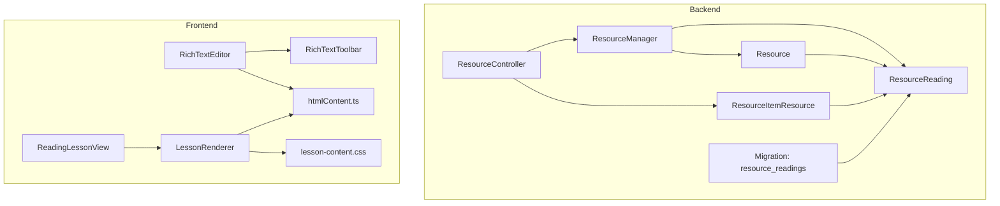
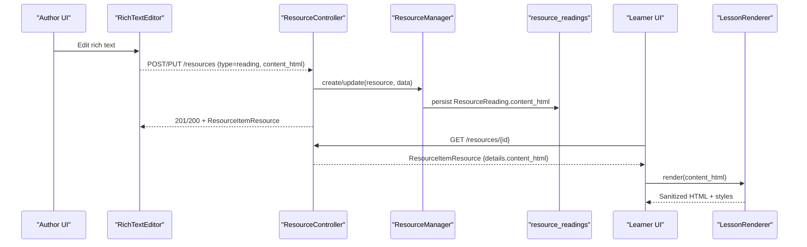
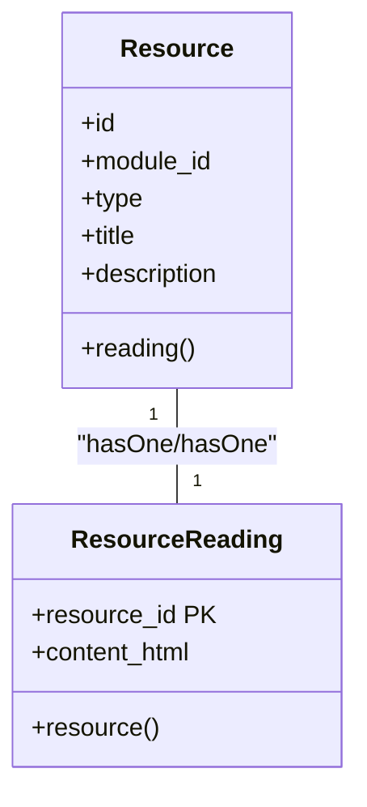
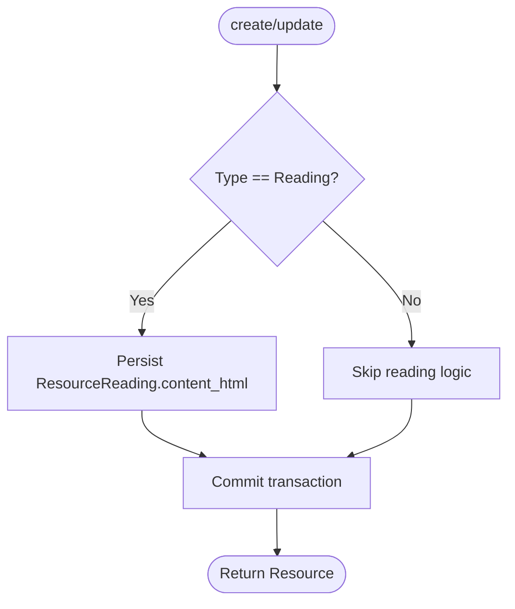
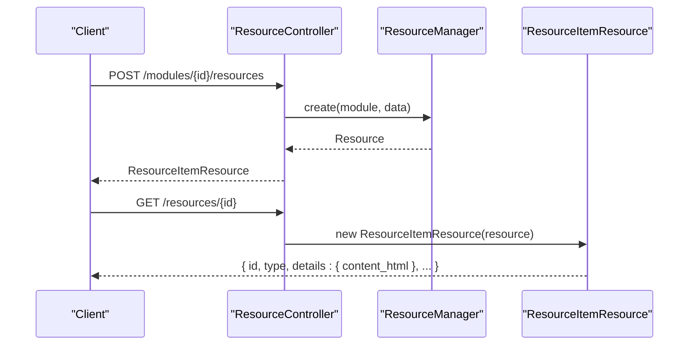
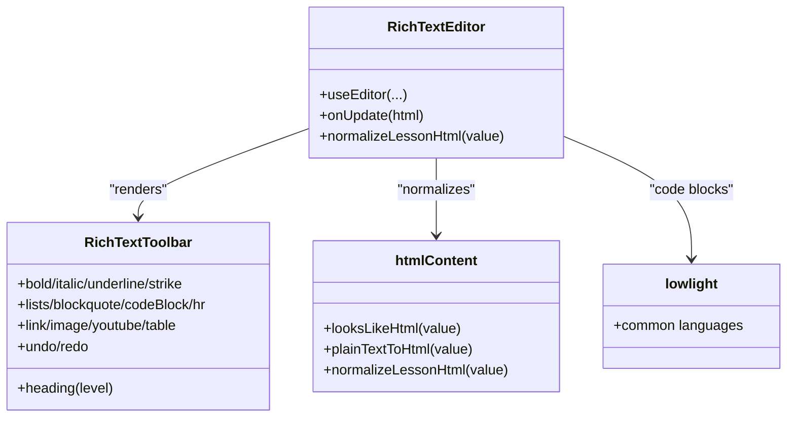
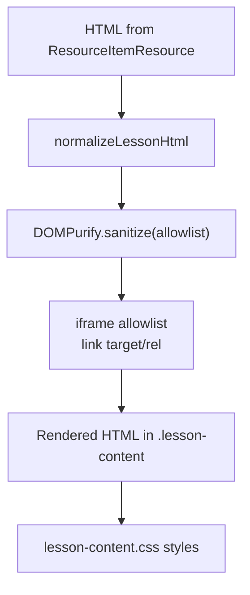
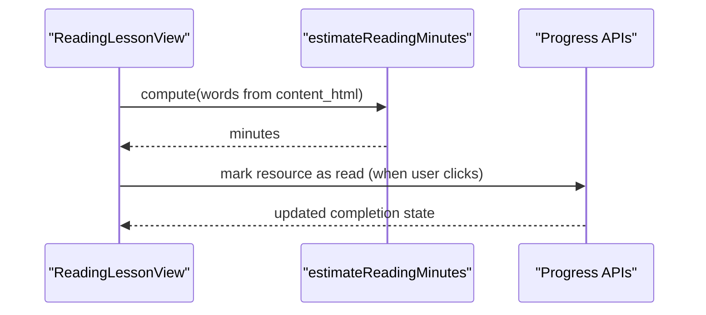
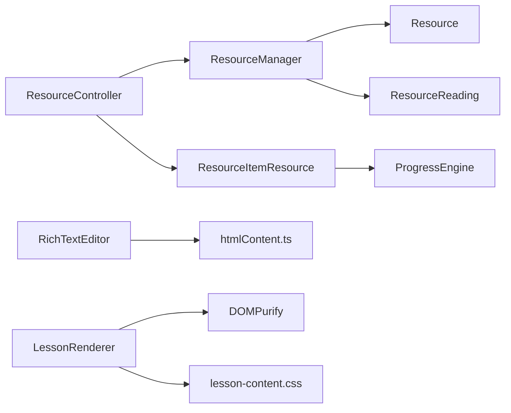

# Reading Resources

<cite>
**Referenced Files in This Document**
- [ResourceReading.php](file://app/Models/ResourceReading.php)
- [2024_01_01_000123_create_resource_readings_table.php](file://database/migrations/2024_01_01_000123_create_resource_readings_table.php)
- [Resource.php](file://app/Models/Resource.php)
- [ResourceManager.php](file://app/Services/Content/ResourceManager.php)
- [ResourceController.php](file://app/Http/Controllers/Api/V1/ResourceController.php)
- [ResourceItemResource.php](file://app/Http/Resources/ResourceItemResource.php)
- [RichTextEditor.tsx](file://frontend/src/components/editor/RichTextEditor.tsx)
- [RichTextToolbar.tsx](file://frontend/src/components/editor/RichTextToolbar.tsx)
- [htmlContent.ts](file://frontend/src/components/editor/htmlContent.ts)
- [lowlight.ts](file://frontend/src/components/editor/lowlight.ts)
- [LessonRenderer.tsx](file://frontend/src/features/learning/LessonRenderer.tsx)
- [lesson-content.css](file://frontend/src/features/learning/lesson-content.css)
- [ReadingLessonView.tsx](file://frontend/src/features/learning/ReadingLessonView.tsx)
- [ResourceProgress.php](file://app/Models/ResourceProgress.php)
- [ResourceProgressStatus.php](file://app/Enums/ResourceProgressStatus.php)
</cite>

## Table of Contents
1. [Introduction](#introduction)
2. [Project Structure](#project-structure)
3. [Core Components](#core-components)
4. [Architecture Overview](#architecture-overview)
5. [Detailed Component Analysis](#detailed-component-analysis)
6. [Dependency Analysis](#dependency-analysis)
7. [Performance Considerations](#performance-considerations)
8. [Troubleshooting Guide](#troubleshooting-guide)
9. [Conclusion](#conclusion)
10. [Appendices](#appendices)

## Introduction
This document explains the Reading Resources feature that enables rich text content creation and consumption within the learning platform. It covers:
- The ResourceReading model structure for storing formatted content (headings, lists, images, tables, code blocks, and embedded media).
- The rich text editor integration used to create and edit reading content, including toolbar features and formatting options.
- Content rendering with sanitization, accessibility considerations, and mobile-responsive styling.
- Reading progress tracking and estimated reading time calculation.
- API endpoints and data contracts for creating, updating, and consuming reading resources.
- Practical examples and best practices for integrating reading resources into the learning interface.

## Project Structure
The Reading Resources feature spans backend models, services, controllers, and resources alongside frontend editor components and a renderer for safe display.

**Diagram sources**
- [ResourceController.php:25-66](file://app/Http/Controllers/Api/V1/ResourceController.php#L25-L66)
- [ResourceManager.php:33-84](file://app/Services/Content/ResourceManager.php#L33-L84)
- [Resource.php:55-61](file://app/Models/Resource.php#L55-L61)
- [ResourceReading.php:10-27](file://app/Models/ResourceReading.php#L10-L27)
- [ResourceItemResource.php:27-53](file://app/Http/Resources/ResourceItemResource.php#L27-L53)
- [2024_01_01_000123_create_resource_readings_table.php:11-17](file://database/migrations/2024_01_01_000123_create_resource_readings_table.php#L11-L17)
- [RichTextEditor.tsx:32-104](file://frontend/src/components/editor/RichTextEditor.tsx#L32-L104)
- [RichTextToolbar.tsx:303-453](file://frontend/src/components/editor/RichTextToolbar.tsx#L303-L453)
- [htmlContent.ts:32-39](file://frontend/src/components/editor/htmlContent.ts#L32-L39)
- [LessonRenderer.tsx:77-99](file://frontend/src/features/learning/LessonRenderer.tsx#L77-L99)
- [lesson-content.css:6-186](file://frontend/src/features/learning/lesson-content.css#L6-L186)
- [ReadingLessonView.tsx:35-50](file://frontend/src/features/learning/ReadingLessonView.tsx#L35-L50)

**Section sources**
- [ResourceController.php:25-66](file://app/Http/Controllers/Api/V1/ResourceController.php#L25-L66)
- [ResourceManager.php:33-84](file://app/Services/Content/ResourceManager.php#L33-L84)
- [Resource.php:55-61](file://app/Models/Resource.php#L55-L61)
- [ResourceReading.php:10-27](file://app/Models/ResourceReading.php#L10-L27)
- [ResourceItemResource.php:27-53](file://app/Http/Resources/ResourceItemResource.php#L27-L53)
- [2024_01_01_000123_create_resource_readings_table.php:11-17](file://database/migrations/2024_01_01_000123_create_resource_readings_table.php#L11-L17)
- [RichTextEditor.tsx:32-104](file://frontend/src/components/editor/RichTextEditor.tsx#L32-L104)
- [RichTextToolbar.tsx:303-453](file://frontend/src/components/editor/RichTextToolbar.tsx#L303-L453)
- [htmlContent.ts:32-39](file://frontend/src/components/editor/htmlContent.ts#L32-L39)
- [LessonRenderer.tsx:77-99](file://frontend/src/features/learning/LessonRenderer.tsx#L77-L99)
- [lesson-content.css:6-186](file://frontend/src/features/learning/lesson-content.css#L6-L186)
- [ReadingLessonView.tsx:35-50](file://frontend/src/features/learning/ReadingLessonView.tsx#L35-L50)

## Core Components
- ResourceReading model stores the rich text content as HTML linked to a Resource via a one-to-one relationship.
- ResourceManager orchestrates creation/update of resources and their type-specific details, including reading content.
- ResourceController exposes REST endpoints to store, update, show, and delete resources, delegating to ResourceManager and MediaStorageService.
- ResourceItemResource serializes resource data, flattening subtype fields under details, including content_html for readings.
- RichTextEditor integrates Tiptap with extensions for headings, lists, images, tables, code blocks, YouTube embeds, and color/highlighting.
- LessonRenderer renders stored HTML safely using DOMPurify with an allowlist and enforces link attributes; it also normalizes legacy plain-text content.
- lesson-content.css provides responsive typography and layout for rendered reading content, including accessible contrast and mobile breakpoints.
- ReadingLessonView computes estimated reading time from HTML word count and presents a “Mark as read” action.

**Section sources**
- [ResourceReading.php:10-27](file://app/Models/ResourceReading.php#L10-L27)
- [ResourceManager.php:101-178](file://app/Services/Content/ResourceManager.php#L101-L178)
- [ResourceController.php:25-66](file://app/Http/Controllers/Api/V1/ResourceController.php#L25-L66)
- [ResourceItemResource.php:27-99](file://app/Http/Resources/ResourceItemResource.php#L27-L99)
- [RichTextEditor.tsx:32-104](file://frontend/src/components/editor/RichTextEditor.tsx#L32-L104)
- [RichTextToolbar.tsx:303-453](file://frontend/src/components/editor/RichTextToolbar.tsx#L303-L453)
- [LessonRenderer.tsx:7-75](file://frontend/src/features/learning/LessonRenderer.tsx#L7-L75)
- [lesson-content.css:6-186](file://frontend/src/features/learning/lesson-content.css#L6-L186)
- [ReadingLessonView.tsx:7-20](file://frontend/src/features/learning/ReadingLessonView.tsx#L7-L20)

## Architecture Overview
The flow from authoring to consumption involves:
- Authoring: Editors produce HTML via Tiptap; changes are persisted through API calls handled by ResourceController and ResourceManager.
- Storage: Reading content is saved in the resource_readings table linked to a Resource.
- Consumption: Frontend fetches resource details via ResourceItemResource, renders sanitized HTML with LessonRenderer, and shows reading-time estimate and completion actions.

**Diagram sources**
- [ResourceController.php:30-66](file://app/Http/Controllers/Api/V1/ResourceController.php#L30-L66)
- [ResourceManager.php:33-84](file://app/Services/Content/ResourceManager.php#L33-L84)
- [ResourceItemResource.php:27-53](file://app/Http/Resources/ResourceItemResource.php#L27-L53)
- [LessonRenderer.tsx:88-99](file://frontend/src/features/learning/LessonRenderer.tsx#L88-L99)

## Detailed Component Analysis

### Data Model: ResourceReading
- Primary key is resource_id, forming a one-to-one relationship with Resource.
- Stores content_html as medium text to support rich content.
- No timestamps; lifecycle managed by parent Resource and module items.

**Diagram sources**
- [Resource.php:55-61](file://app/Models/Resource.php#L55-L61)
- [ResourceReading.php:10-27](file://app/Models/ResourceReading.php#L10-L27)

**Section sources**
- [ResourceReading.php:10-27](file://app/Models/ResourceReading.php#L10-L27)
- [2024_01_01_000123_create_resource_readings_table.php:11-17](file://database/migrations/2024_01_01_000123_create_resource_readings_table.php#L11-L17)
- [Resource.php:55-61](file://app/Models/Resource.php#L55-L61)

### Backend Services: Creating and Updating Readings
- ResourceManager.create creates a Resource and its subtype detail; for readings, it persists content_html.
- ResourceManager.update updates title/description and subtype fields; for readings, it updates content_html.
- Both operations run inside database transactions to keep Resource and ModuleItem consistent.

**Diagram sources**
- [ResourceManager.php:33-84](file://app/Services/Content/ResourceManager.php#L33-L84)
- [ResourceManager.php:101-178](file://app/Services/Content/ResourceManager.php#L101-L178)

**Section sources**
- [ResourceManager.php:33-84](file://app/Services/Content/ResourceManager.php#L33-L84)
- [ResourceManager.php:101-178](file://app/Services/Content/ResourceManager.php#L101-L178)

### API Surface: ResourceController and ResourceItemResource
- Controller methods handle store/update/show/destroy, delegating file handling to MediaStorageService and business logic to ResourceManager.
- ResourceItemResource returns a unified envelope with details.type-specific fields; for readings, details.content_html is included.

**Diagram sources**
- [ResourceController.php:25-66](file://app/Http/Controllers/Api/V1/ResourceController.php#L25-L66)
- [ResourceItemResource.php:27-53](file://app/Http/Resources/ResourceItemResource.php#L27-L53)

**Section sources**
- [ResourceController.php:25-66](file://app/Http/Controllers/Api/V1/ResourceController.php#L25-L66)
- [ResourceItemResource.php:27-99](file://app/Http/Resources/ResourceItemResource.php#L27-L99)

### Editor Integration: RichTextEditor and Toolbar
- RichTextEditor configures Tiptap with StarterKit plus extensions for highlighting, text styles, colors, images, tables, code blocks, and YouTube embeds.
- Legacy plain-text content is normalized before loading into the editor to preserve paragraph breaks.
- Toolbar exposes formatting controls: headings (H1–H3), bold/italic/underline/strike, inline code, highlight, text color, lists, blockquote, code block, horizontal rule, links, images, YouTube embeds, tables, undo/redo.
- Code syntax highlighting uses a shared lowlight instance configured with a common language subset to balance performance and capability.

**Diagram sources**
- [RichTextEditor.tsx:32-104](file://frontend/src/components/editor/RichTextEditor.tsx#L32-L104)
- [RichTextToolbar.tsx:303-453](file://frontend/src/components/editor/RichTextToolbar.tsx#L303-L453)
- [htmlContent.ts:32-39](file://frontend/src/components/editor/htmlContent.ts#L32-L39)
- [lowlight.ts:1-9](file://frontend/src/components/editor/lowlight.ts#L1-L9)

**Section sources**
- [RichTextEditor.tsx:32-104](file://frontend/src/components/editor/RichTextEditor.tsx#L32-L104)
- [RichTextToolbar.tsx:303-453](file://frontend/src/components/editor/RichTextToolbar.tsx#L303-L453)
- [htmlContent.ts:32-39](file://frontend/src/components/editor/htmlContent.ts#L32-L39)
- [lowlight.ts:1-9](file://frontend/src/components/editor/lowlight.ts#L1-L9)

### Rendering and Safety: LessonRenderer and Styles
- LessonRenderer sanitizes HTML with DOMPurify using a strict allowlist of tags and attributes suitable for the editor’s output.
- A custom hook restricts iframes to YouTube embed URLs only, preventing arbitrary cross-origin content injection.
- Links are forced to open in new tabs with safe rel attributes for defense-in-depth.
- lesson-content.css defines readable typography, responsive scaling, accessible contrast, and mobile-friendly layouts for all supported elements, including responsive YouTube embeds.

**Diagram sources**
- [LessonRenderer.tsx:7-75](file://frontend/src/features/learning/LessonRenderer.tsx#L7-L75)
- [LessonRenderer.tsx:88-99](file://frontend/src/features/learning/LessonRenderer.tsx#L88-L99)
- [lesson-content.css:6-186](file://frontend/src/features/learning/lesson-content.css#L6-L186)

**Section sources**
- [LessonRenderer.tsx:7-75](file://frontend/src/features/learning/LessonRenderer.tsx#L7-L75)
- [LessonRenderer.tsx:88-99](file://frontend/src/features/learning/LessonRenderer.tsx#L88-L99)
- [lesson-content.css:6-186](file://frontend/src/features/learning/lesson-content.css#L6-L186)

### Reading Progress and Estimated Time
- Estimated reading time is computed by stripping HTML tags, counting words, and dividing by a constant words-per-minute rate, then clamped to a minimum.
- ReadingLessonView displays the badge and a “Mark as read” action when not complete.
- ResourceProgress tracks per-student status and timestamps for opened/completed states, enabling completion workflows across resource types.

**Diagram sources**
- [ReadingLessonView.tsx:7-20](file://frontend/src/features/learning/ReadingLessonView.tsx#L7-L20)
- [ReadingLessonView.tsx:35-50](file://frontend/src/features/learning/ReadingLessonView.tsx#L35-L50)
- [ResourceProgress.php:11-49](file://app/Models/ResourceProgress.php#L11-L49)
- [ResourceProgressStatus.php:7-12](file://app/Enums/ResourceProgressStatus.php#L7-L12)

**Section sources**
- [ReadingLessonView.tsx:7-20](file://frontend/src/features/learning/ReadingLessonView.tsx#L7-L20)
- [ReadingLessonView.tsx:35-50](file://frontend/src/features/learning/ReadingLessonView.tsx#L35-L50)
- [ResourceProgress.php:11-49](file://app/Models/ResourceProgress.php#L11-L49)
- [ResourceProgressStatus.php:7-12](file://app/Enums/ResourceProgressStatus.php#L7-L12)

## Dependency Analysis
- ResourceController depends on ResourceManager and MediaStorageService for persistence and storage operations.
- ResourceManager depends on Resource and ResourceReading models and ModuleItem for ordering and requirement flags.
- ResourceItemResource depends on ProgressEngine to determine completion status for students.
- Frontend RichTextEditor depends on Tiptap extensions and htmlContent normalization; LessonRenderer depends on DOMPurify and CSS for safe, styled rendering.

**Diagram sources**
- [ResourceController.php:25-66](file://app/Http/Controllers/Api/V1/ResourceController.php#L25-L66)
- [ResourceManager.php:33-84](file://app/Services/Content/ResourceManager.php#L33-L84)
- [ResourceItemResource.php:27-53](file://app/Http/Resources/ResourceItemResource.php#L27-L53)
- [RichTextEditor.tsx:32-104](file://frontend/src/components/editor/RichTextEditor.tsx#L32-L104)
- [LessonRenderer.tsx:88-99](file://frontend/src/features/learning/LessonRenderer.tsx#L88-L99)

**Section sources**
- [ResourceController.php:25-66](file://app/Http/Controllers/Api/V1/ResourceController.php#L25-L66)
- [ResourceManager.php:33-84](file://app/Services/Content/ResourceManager.php#L33-L84)
- [ResourceItemResource.php:27-53](file://app/Http/Resources/ResourceItemResource.php#L27-L53)
- [RichTextEditor.tsx:32-104](file://frontend/src/components/editor/RichTextEditor.tsx#L32-L104)
- [LessonRenderer.tsx:88-99](file://frontend/src/features/learning/LessonRenderer.tsx#L88-L99)

## Performance Considerations
- Code syntax highlighting uses a limited language set to keep bundle size reasonable while supporting common languages.
- YouTube embeds are constrained to trusted domains and rendered responsively to avoid layout shifts and heavy loads.
- Estimated reading time is computed client-side with simple string operations to avoid extra network calls.
- Sanitization uses a narrow allowlist to minimize processing overhead and reduce attack surface.

[No sources needed since this section provides general guidance]

## Troubleshooting Guide
- Plain-text legacy content appears collapsed: ensure normalizeLessonHtml is applied before rendering or editing to split paragraphs correctly.
- YouTube embeds not showing: verify iframe src matches allowed domain pattern; non-matching iframes are removed during sanitization.
- Links opening in same tab: confirm that link attributes are enforced by sanitizer hooks; check that content passes through LessonRenderer.
- Tables or code blocks not visible: ensure the editor includes required extensions and that the renderer’s allowlist contains corresponding tags.
- Mobile readability issues: review lesson-content.css breakpoints and ensure container widths are appropriate for small screens.

**Section sources**
- [htmlContent.ts:32-39](file://frontend/src/components/editor/htmlContent.ts#L32-L39)
- [LessonRenderer.tsx:55-75](file://frontend/src/features/learning/LessonRenderer.tsx#L55-L75)
- [lesson-content.css:170-186](file://frontend/src/features/learning/lesson-content.css#L170-L186)

## Conclusion
Reading Resources provide a robust, secure, and accessible way to author and consume rich text content. The backend cleanly separates concerns with models and services, while the frontend offers a powerful editor and a safe renderer with responsive design. Estimated reading time and progress tracking enhance the learner experience, and strict sanitization ensures safety without sacrificing flexibility.

[No sources needed since this section summarizes without analyzing specific files]

## Appendices

### Examples and Best Practices

- Create a reading resource
  - Use the resource store endpoint with type set to reading and include content_html produced by the editor.
  - Reference: [ResourceController store:30-46](file://app/Http/Controllers/Api/V1/ResourceController.php#L30-L46)

- Update reading content
  - Send an update request with the new content_html; the service will persist changes to the reading subtype.
  - Reference: [ResourceController update:48-66](file://app/Http/Controllers/Api/V1/ResourceController.php#L48-L66)

- Consume reading content
  - Fetch resource details and render details.content_html through LessonRenderer to benefit from sanitization and styling.
  - Reference: [ResourceItemResource details:76-78](file://app/Http/Resources/ResourceItemResource.php#L76-L78), [LessonRenderer render:88-99](file://frontend/src/features/learning/LessonRenderer.tsx#L88-L99)

- Formatting options in the editor
  - Headings H1–H3, bold/italic/underline/strike, inline code, highlight, text color, bullet/numbered lists, blockquotes, code blocks, horizontal rules, links, images, YouTube embeds, tables, undo/redo.
  - Reference: [RichTextToolbar controls:303-453](file://frontend/src/components/editor/RichTextToolbar.tsx#L303-L453)

- Accessibility and SEO notes
  - Use semantic headings and lists to improve screen reader navigation and search indexing.
  - Ensure images have descriptive alt attributes; links open in new tabs with safe rel attributes.
  - Reference: [LessonRenderer link enforcement:70-75](file://frontend/src/features/learning/LessonRenderer.tsx#L70-L75)

- Mobile-responsive reading
  - The renderer applies responsive typography and spacing; YouTube embeds adapt to container width.
  - Reference: [lesson-content.css responsive rules:170-186](file://frontend/src/features/learning/lesson-content.css#L170-L186)

**Section sources**
- [ResourceController.php:30-66](file://app/Http/Controllers/Api/V1/ResourceController.php#L30-L66)
- [ResourceItemResource.php:76-78](file://app/Http/Resources/ResourceItemResource.php#L76-L78)
- [LessonRenderer.tsx:70-75](file://frontend/src/features/learning/LessonRenderer.tsx#L70-L75)
- [RichTextToolbar.tsx:303-453](file://frontend/src/components/editor/RichTextToolbar.tsx#L303-L453)
- [lesson-content.css:170-186](file://frontend/src/features/learning/lesson-content.css#L170-L186)