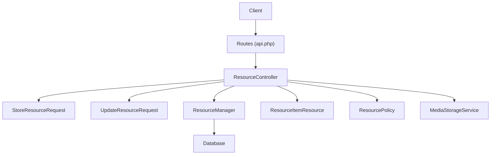
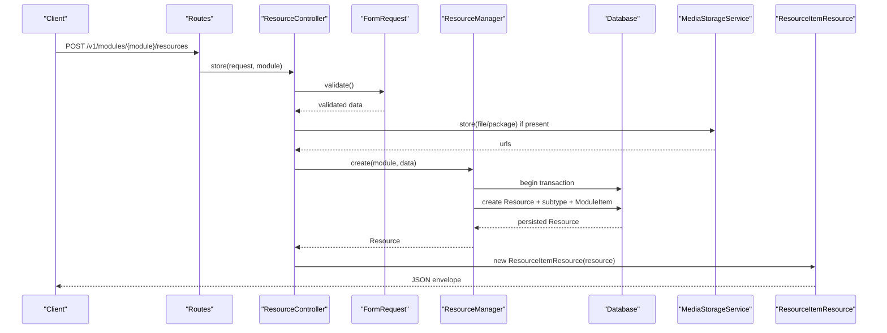
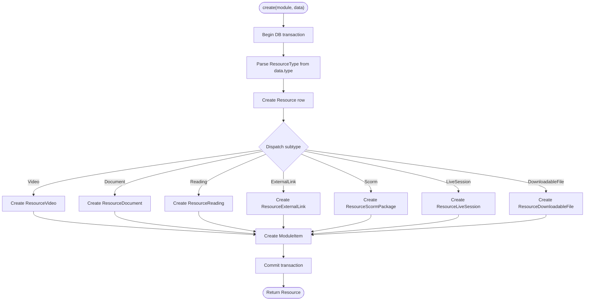
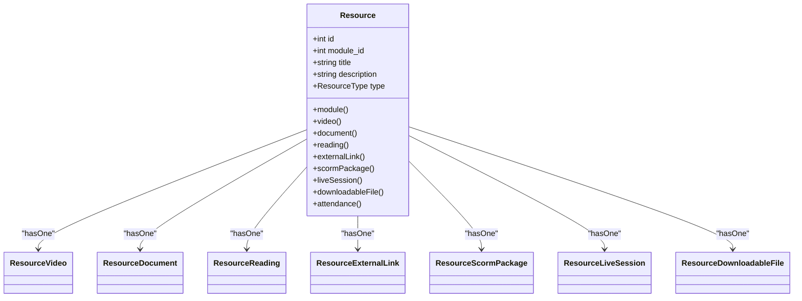
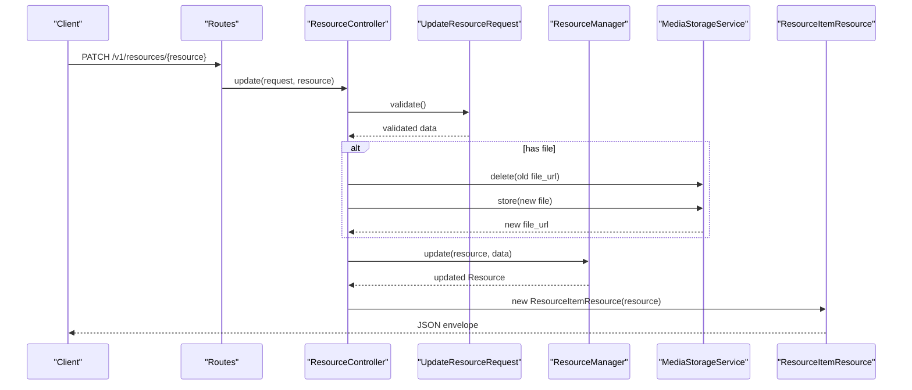
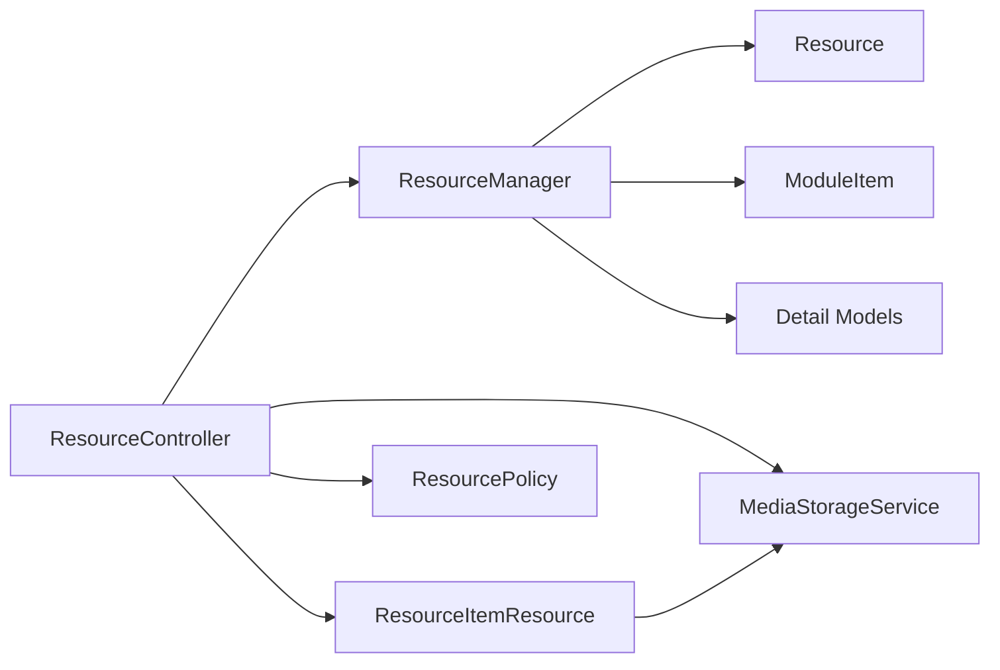

# Resource Management Service

<cite>
**Referenced Files in This Document**
- [ResourceManager.php](file://app/Services/Content/ResourceManager.php)
- [ResourceController.php](file://app/Http/Controllers/Api/V1/ResourceController.php)
- [StoreResourceRequest.php](file://app/Http/Requests/Api/V1/StoreResourceRequest.php)
- [UpdateResourceRequest.php](file://app/Http/Requests/Api/V1/UpdateResourceRequest.php)
- [ResourceItemResource.php](file://app/Http/Resources/ResourceItemResource.php)
- [Resource.php](file://app/Models/Resource.php)
- [ResourceVideo.php](file://app/Models/ResourceVideo.php)
- [ResourceDocument.php](file://app/Models/ResourceDocument.php)
- [ResourceReading.php](file://app/Models/ResourceReading.php)
- [ResourceExternalLink.php](file://app/Models/ResourceExternalLink.php)
- [ResourceScormPackage.php](file://app/Models/ResourceScormPackage.php)
- [ResourceLiveSession.php](file://app/Models/ResourceLiveSession.php)
- [ResourceDownloadableFile.php](file://app/Models/ResourceDownloadableFile.php)
- [ResourceType.php](file://app/Enums/ResourceType.php)
- [ResourcePolicy.php](file://app/Policies/ResourcePolicy.php)
- [api.php](file://routes/api.php)
</cite>

## Table of Contents
1. Introduction
2. Project Structure
3. Core Components
4. Architecture Overview
5. Detailed Component Analysis
6. Dependency Analysis
7. Performance Considerations
8. Troubleshooting Guide
9. Conclusion

## Introduction
This document explains the Resource Management Service that orchestrates polymorphic resource operations across multiple content types (video, document, reading, external link, SCORM package, live session, downloadable file). It covers service-layer patterns for coordination and validation, API endpoints for CRUD and related actions, programmatic examples, relationship handling, custom handler extensibility, error handling, transaction management, and performance strategies for large-scale operations.

## Project Structure
The resource feature spans controllers, request validators, a central service, models, enums, policies, and routes:
- Controller: exposes REST endpoints and delegates to services
- Requests: validate inputs per resource type
- Service: encapsulates business logic and coordinates persistence
- Models: base Resource plus one detail model per type
- Enum: ResourceType defines supported kinds
- Policy: authorization rules for create/update/delete/view attendance
- Routes: define public and authenticated endpoints

**Diagram sources**
- [api.php:139-153](file://routes/api.php#L139-L153)
- [ResourceController.php:18-85](file://app/Http/Controllers/Api/V1/ResourceController.php#L18-L85)
- [StoreResourceRequest.php:18-65](file://app/Http/Requests/Api/V1/StoreResourceRequest.php#L18-L65)
- [UpdateResourceRequest.php:14-56](file://app/Http/Requests/Api/V1/UpdateResourceRequest.php#L14-L56)
- [ResourceManager.php:28-179](file://app/Services/Content/ResourceManager.php#L28-L179)
- [ResourceItemResource.php:22-99](file://app/Http/Resources/ResourceItemResource.php#L22-L99)
- [ResourcePolicy.php:13-44](file://app/Policies/ResourcePolicy.php#L13-L44)

**Section sources**
- [api.php:139-153](file://routes/api.php#L139-L153)
- [ResourceController.php:18-85](file://app/Http/Controllers/Api/V1/ResourceController.php#L18-L85)
- [StoreResourceRequest.php:18-65](file://app/Http/Requests/Api/V1/StoreResourceRequest.php#L18-L65)
- [UpdateResourceRequest.php:14-56](file://app/Http/Requests/Api/V1/UpdateResourceRequest.php#L14-L56)
- [ResourceManager.php:28-179](file://app/Services/Content/ResourceManager.php#L28-L179)
- [ResourceItemResource.php:22-99](file://app/Http/Resources/ResourceItemResource.php#L22-L99)
- [ResourcePolicy.php:13-44](file://app/Policies/ResourcePolicy.php#L13-L44)

## Core Components
- ResourceManager: Central service that creates, updates, and deletes resources while synchronizing module item metadata within transactions. It dispatches subtype creation based on ResourceType.
- ResourceController: HTTP entry point for resource endpoints; handles file uploads via MediaStorageService and returns normalized JSON via ResourceItemResource.
- Request Validators: StoreResourceRequest and UpdateResourceRequest enforce type-specific field requirements and constraints.
- Models: Resource is the polymorphic root with HasOne relationships to seven detail models (video, document, reading, external link, scorm package, live session, downloadable file).
- Enums: ResourceType enumerates supported kinds and drives match-based dispatching.
- Policy: ResourcePolicy enforces admin/instructor-only write access and attendance visibility.
- Routes: Define public read and authenticated write endpoints under /v1.

**Section sources**
- [ResourceManager.php:28-179](file://app/Services/Content/ResourceManager.php#L28-L179)
- [ResourceController.php:18-85](file://app/Http/Controllers/Api/V1/ResourceController.php#L18-L85)
- [StoreResourceRequest.php:18-65](file://app/Http/Requests/Api/V1/StoreResourceRequest.php#L18-L65)
- [UpdateResourceRequest.php:14-56](file://app/Http/Requests/Api/V1/UpdateResourceRequest.php#L14-L56)
- [Resource.php:15-103](file://app/Models/Resource.php#L15-L103)
- [ResourceType.php:7-17](file://app/Enums/ResourceType.php#L7-L17)
- [ResourcePolicy.php:13-44](file://app/Policies/ResourcePolicy.php#L13-L44)
- [api.php:139-153](file://routes/api.php#L139-L153)

## Architecture Overview
The system uses a layered architecture:
- Presentation layer: Controllers and Resources shape requests/responses
- Validation layer: FormRequest classes enforce schema per resource type
- Service layer: ResourceManager encapsulates business rules and orchestration
- Data layer: Eloquent models map to tables; details are split by type
- Authorization: Policies gate operations at controller boundaries
- External integration: MediaStorageService handles storage operations

**Diagram sources**
- [api.php:139-142](file://routes/api.php#L139-L142)
- [ResourceController.php:30-46](file://app/Http/Controllers/Api/V1/ResourceController.php#L30-L46)
- [StoreResourceRequest.php:25-63](file://app/Http/Requests/Api/V1/StoreResourceRequest.php#L25-L63)
- [ResourceManager.php:33-59](file://app/Services/Content/ResourceManager.php#L33-L59)
- [ResourceItemResource.php:27-54](file://app/Http/Resources/ResourceItemResource.php#L27-L54)

## Detailed Component Analysis

### ResourceManager: Polymorphic Orchestration
Responsibilities:
- Create: persists Resource, its subtype, and corresponding ModuleItem in a single transaction
- Update: mutates Resource fields, updates subtype fields selectively, and syncs ModuleItem flags
- Delete: removes ModuleItem then Resource in a transaction

Key implementation patterns:
- Type dispatch via ResourceType enum and match expressions
- Transactional consistency between Resource and ModuleItem
- Selective field updates using array filtering

**Diagram sources**
- [ResourceManager.php:33-59](file://app/Services/Content/ResourceManager.php#L33-L59)
- [ResourceManager.php:101-142](file://app/Services/Content/ResourceManager.php#L101-L142)

**Section sources**
- [ResourceManager.php:33-96](file://app/Services/Content/ResourceManager.php#L33-L96)
- [ResourceManager.php:101-179](file://app/Services/Content/ResourceManager.php#L101-L179)

### Resource Model and Subtypes
- Resource acts as the polymorphic root with typed relationships to each subtype model
- Each subtype model uses resource_id as primary key and belongsTo Resource
- Relationships enable eager loading of details for consistent API responses

**Diagram sources**
- [Resource.php:15-103](file://app/Models/Resource.php#L15-L103)
- [ResourceVideo.php:10-29](file://app/Models/ResourceVideo.php#L10-L29)
- [ResourceDocument.php:11-34](file://app/Models/ResourceDocument.php#L11-L34)
- [ResourceReading.php:10-27](file://app/Models/ResourceReading.php#L10-L27)
- [ResourceExternalLink.php:10-27](file://app/Models/ResourceExternalLink.php#L10-L27)
- [ResourceScormPackage.php:11-33](file://app/Models/ResourceScormPackage.php#L11-L33)
- [ResourceLiveSession.php:11-36](file://app/Models/ResourceLiveSession.php#L11-L36)
- [ResourceDownloadableFile.php:10-28](file://app/Models/ResourceDownloadableFile.php#L10-L28)

**Section sources**
- [Resource.php:15-103](file://app/Models/Resource.php#L15-L103)
- [ResourceVideo.php:10-29](file://app/Models/ResourceVideo.php#L10-L29)
- [ResourceDocument.php:11-34](file://app/Models/ResourceDocument.php#L11-L34)
- [ResourceReading.php:10-27](file://app/Models/ResourceReading.php#L10-L27)
- [ResourceExternalLink.php:10-27](file://app/Models/ResourceExternalLink.php#L10-L27)
- [ResourceScormPackage.php:11-33](file://app/Models/ResourceScormPackage.php#L11-L33)
- [ResourceLiveSession.php:11-36](file://app/Models/ResourceLiveSession.php#L11-L36)
- [ResourceDownloadableFile.php:10-28](file://app/Models/ResourceDownloadableFile.php#L10-L28)

### API Endpoints and Request Flow
Endpoints:
- GET /v1/resources/{resource} — show resource with details
- POST /v1/modules/{module}/resources — create resource (supports file/package uploads)
- PATCH /v1/resources/{resource} — update resource (supports file/package replacement)
- DELETE /v1/resources/{resource} — delete resource (policy-gated)

Flow highlights:
- StoreResourceRequest validates type-specific fields
- ResourceController stores uploaded files via MediaStorageService and passes URLs into service
- ResourceItemResource flattens subtype fields into a unified response envelope

**Diagram sources**
- [api.php:139-142](file://routes/api.php#L139-L142)
- [ResourceController.php:48-66](file://app/Http/Controllers/Api/V1/ResourceController.php#L48-L66)
- [UpdateResourceRequest.php:21-53](file://app/Http/Requests/Api/V1/UpdateResourceRequest.php#L21-L53)
- [ResourceManager.php:64-84](file://app/Services/Content/ResourceManager.php#L64-L84)
- [ResourceItemResource.php:27-54](file://app/Http/Resources/ResourceItemResource.php#L27-L54)

**Section sources**
- [api.php:139-153](file://routes/api.php#L139-L153)
- [ResourceController.php:25-84](file://app/Http/Controllers/Api/V1/ResourceController.php#L25-L84)
- [StoreResourceRequest.php:25-63](file://app/Http/Requests/Api/V1/StoreResourceRequest.php#L25-L63)
- [UpdateResourceRequest.php:21-53](file://app/Http/Requests/Api/V1/UpdateResourceRequest.php#L21-L53)
- [ResourceItemResource.php:27-99](file://app/Http/Resources/ResourceItemResource.php#L27-L99)

### Authorization and Policies
- Create requires permission to create on Module context
- Update/Delete require permission on Resource context
- Attendance view is policy-gated similarly to management
- Access is granted to Admin or Instructors teaching the course

**Section sources**
- [ResourcePolicy.php:15-42](file://app/Policies/ResourcePolicy.php#L15-L42)
- [StoreResourceRequest.php:20-23](file://app/Http/Requests/Api/V1/StoreResourceRequest.php#L20-L23)
- [UpdateResourceRequest.php:16-19](file://app/Http/Requests/Api/V1/UpdateResourceRequest.php#L16-L19)
- [ResourceController.php:77-84](file://app/Http/Controllers/Api/V1/ResourceController.php#L77-L84)

### Programmatic Examples
Creating different resource types programmatically via the service:
- Video: provide type video, title, description, bunny_stream_video_id, optional duration_seconds and caption_url
- Document: provide type document, title, file_url or upload file, file_type, optional file_size_kb
- Reading: provide type reading, title, content_html
- External Link: provide type external_link, title, url
- SCORM: provide type scorm, title, package_url or upload package, standard
- Live Session: provide type live_session, title, provider, meeting_url, scheduled_at, duration_minutes
- Downloadable File: provide type downloadable_file, title, file_url or upload file, optional file_size_kb

Handling relationships:
- Each created Resource automatically gets a ModuleItem entry with order_index and is_required
- Responses include flattened details via ResourceItemResource

Custom resource handlers:
- To add a new resource type, extend ResourceType enum, add a detail model, and update ResourceManager’s match blocks for createSubtype and updateSubtype
- Ensure ResourceController and ResourceItemResource handle any new file fields and URL normalization

**Section sources**
- [ResourceManager.php:33-59](file://app/Services/Content/ResourceManager.php#L33-L59)
- [ResourceManager.php:101-179](file://app/Services/Content/ResourceManager.php#L101-L179)
- [ResourceType.php:7-17](file://app/Enums/ResourceType.php#L7-L17)
- [ResourceItemResource.php:59-99](file://app/Http/Resources/ResourceItemResource.php#L59-L99)

## Dependency Analysis
High-level dependencies:
- ResourceController depends on ResourceManager, MediaStorageService, and ResourceItemResource
- ResourceManager depends on Eloquent models and DB transactions
- ResourceItemResource depends on MediaStorageService for URL generation and ProgressEngine for completion status
- Policies depend on User roles and Course membership checks

**Diagram sources**
- [ResourceController.php:18-85](file://app/Http/Controllers/Api/V1/ResourceController.php#L18-L85)
- [ResourceManager.php:28-179](file://app/Services/Content/ResourceManager.php#L28-L179)
- [ResourceItemResource.php:22-99](file://app/Http/Resources/ResourceItemResource.php#L22-L99)
- [ResourcePolicy.php:13-44](file://app/Policies/ResourcePolicy.php#L13-L44)

**Section sources**
- [ResourceController.php:18-85](file://app/Http/Controllers/Api/V1/ResourceController.php#L18-L85)
- [ResourceManager.php:28-179](file://app/Services/Content/ResourceManager.php#L28-L179)
- [ResourceItemResource.php:22-99](file://app/Http/Resources/ResourceItemResource.php#L22-L99)
- [ResourcePolicy.php:13-44](file://app/Policies/ResourcePolicy.php#L13-L44)

## Performance Considerations
- Use transactions around create/update/delete to ensure atomicity and reduce retries
- Prefer selective field updates to minimize writes
- Eager load only needed relations when returning responses
- For bulk operations, consider batching inserts/updates and processing jobs off the request path
- Cache expensive lookups (e.g., module item metadata) where appropriate
- Offload heavy I/O (file uploads, SCORM processing) to background jobs when feasible

[No sources needed since this section provides general guidance]

## Troubleshooting Guide
Common issues and resolutions:
- Validation errors: Check StoreResourceRequest/UpdateResourceRequest rules for required fields based on type
- Authorization failures: Verify user role and course association via ResourcePolicy
- Missing subtype data: Ensure type-specific fields are provided and correctly named
- File handling errors: Confirm MediaStorageService configuration and permissions; verify old files are deleted before replacing
- Inconsistent state: Confirm operations run within transactions; check for partial updates due to exceptions

**Section sources**
- [StoreResourceRequest.php:25-63](file://app/Http/Requests/Api/V1/StoreResourceRequest.php#L25-L63)
- [UpdateResourceRequest.php:21-53](file://app/Http/Requests/Api/V1/UpdateResourceRequest.php#L21-L53)
- [ResourcePolicy.php:15-42](file://app/Policies/ResourcePolicy.php#L15-L42)
- [ResourceManager.php:33-96](file://app/Services/Content/ResourceManager.php#L33-L96)
- [ResourceController.php:30-66](file://app/Http/Controllers/Api/V1/ResourceController.php#L30-L66)

## Conclusion
The Resource Management Service provides a robust, transactional, and type-safe foundation for managing diverse content resources. By centralizing orchestration in ResourceManager, enforcing validation in dedicated request classes, and normalizing responses through ResourceItemResource, the system maintains clarity and scalability. Policies ensure secure access, while clear extension points allow adding new resource types with minimal disruption.

[No sources needed since this section summarizes without analyzing specific files]