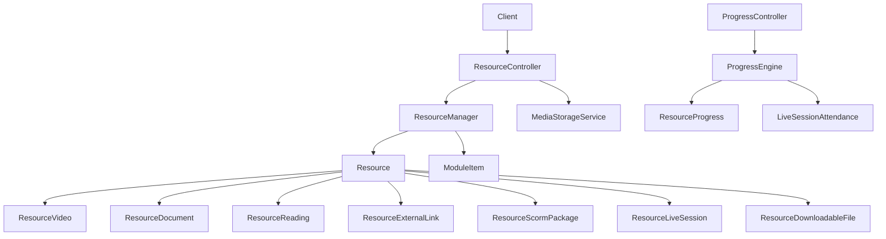
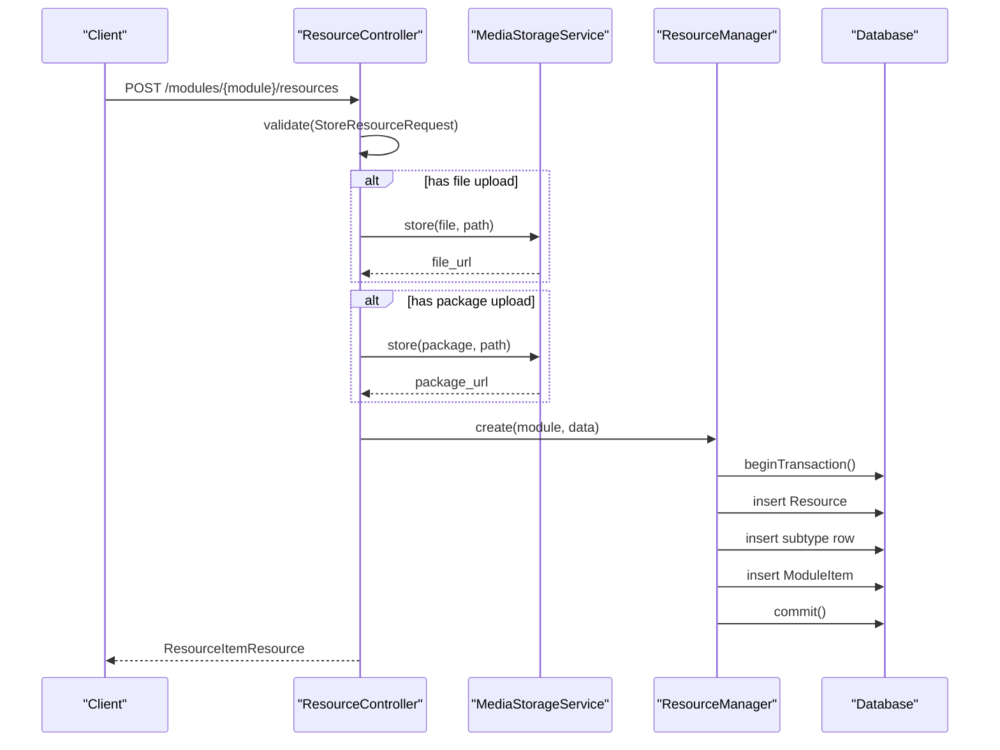
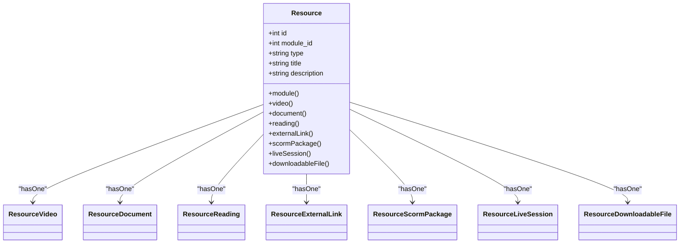
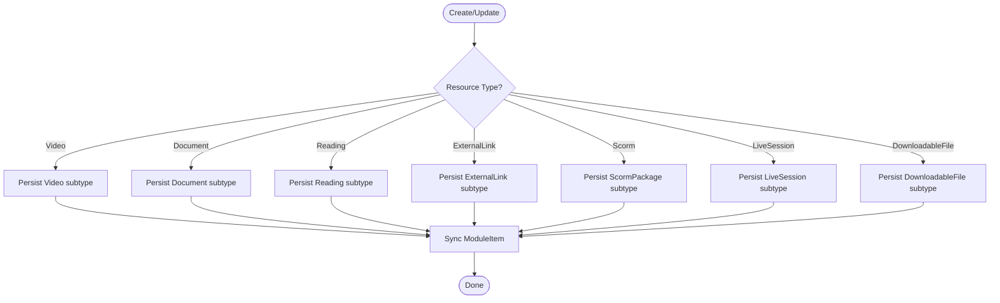
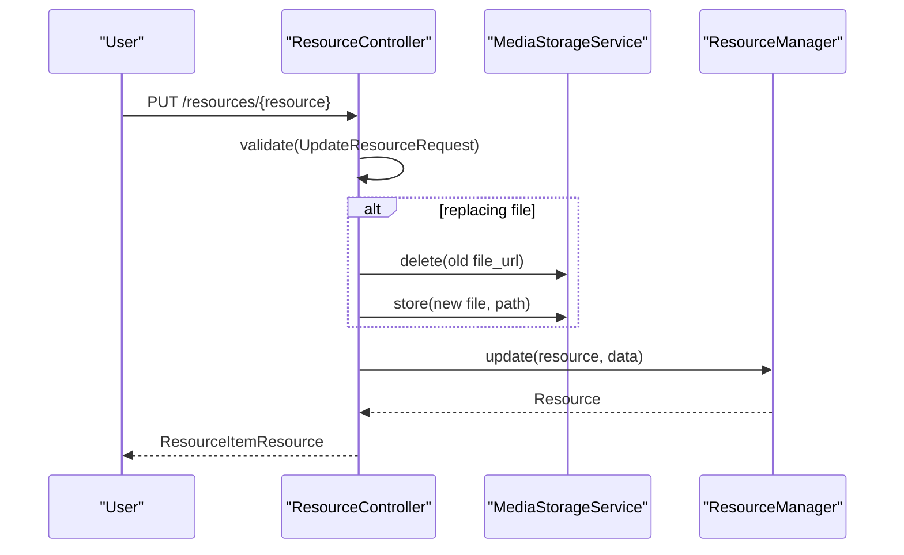
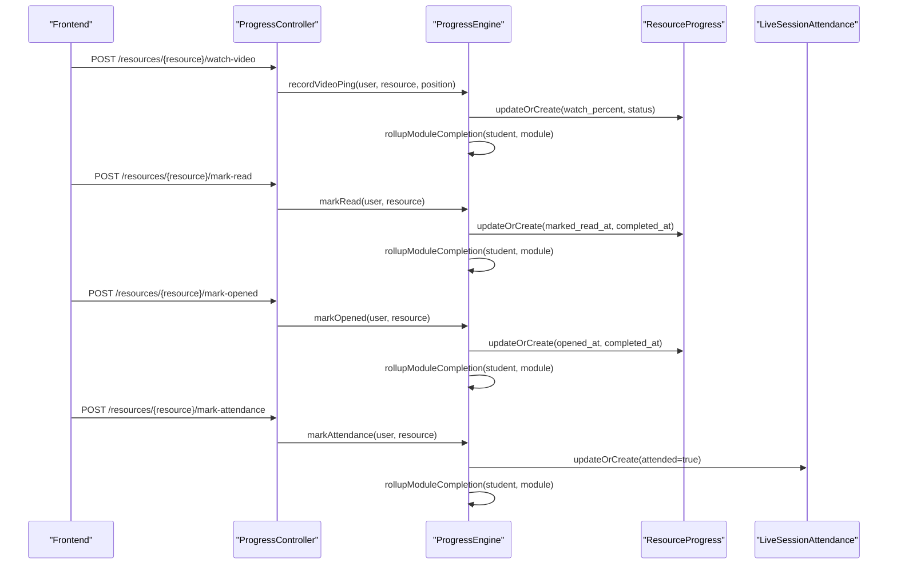
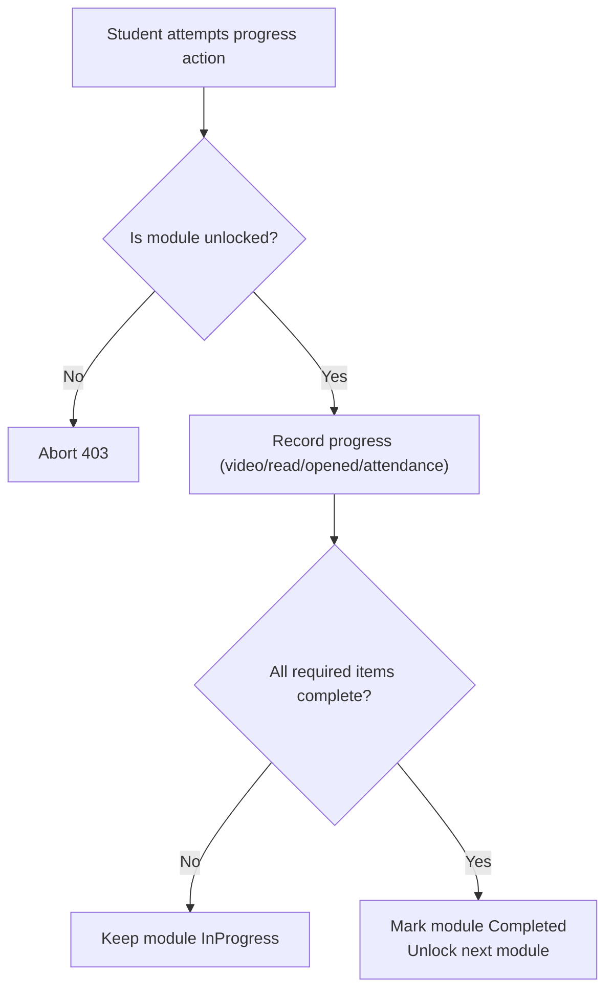
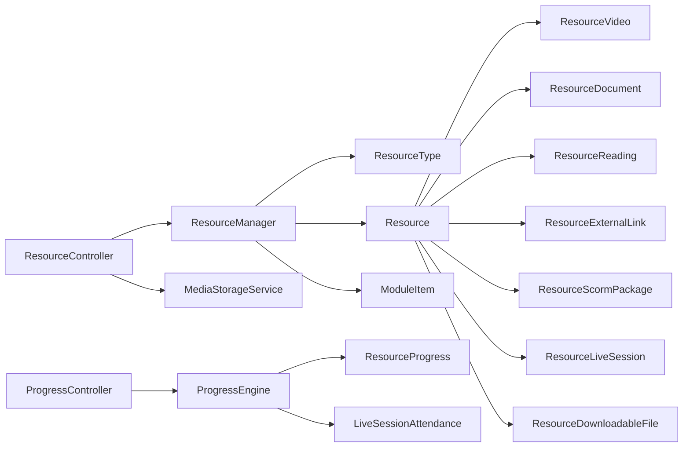

# Resource Types & Content Management

<cite>
**Referenced Files in This Document**
- [ResourceManager.php](file://app/Services/Content/ResourceManager.php)
- [ResourceController.php](file://app/Http/Controllers/Api/V1/ResourceController.php)
- [StoreResourceRequest.php](file://app/Http/Requests/Api/V1/StoreResourceRequest.php)
- [Resource.php](file://app/Models/Resource.php)
- [ResourceVideo.php](file://app/Models/ResourceVideo.php)
- [ResourceDocument.php](file://app/Models/ResourceDocument.php)
- [ResourceReading.php](file://app/Models/ResourceReading.php)
- [ResourceExternalLink.php](file://app/Models/ResourceExternalLink.php)
- [ResourceScormPackage.php](file://app/Models/ResourceScormPackage.php)
- [ResourceLiveSession.php](file://app/Models/ResourceLiveSession.php)
- [ResourceDownloadableFile.php](file://app/Models/ResourceDownloadableFile.php)
- [ResourceType.php](file://app/Enums/ResourceType.php)
- [ProgressController.php](file://app/Http/Controllers/Api/V1/ProgressController.php)
- [ProgressEngine.php](file://app/Services/Progress/ProgressEngine.php)
- [ResourceProgress.php](file://app/Models/ResourceProgress.php)
- [RecordVideoProgressRequest.php](file://app/Http/Requests/Api/V1/RecordVideoProgressRequest.php)
</cite>

## Table of Contents
1. Introduction
2. Project Structure
3. Core Components
4. Architecture Overview
5. Detailed Component Analysis
6. Dependency Analysis
7. Performance Considerations
8. Troubleshooting Guide
9. Conclusion
10. Appendices

## Introduction
This document explains the polymorphic resource system that supports videos, documents, readings, external links, SCORM packages, downloadable files, and live sessions. It covers how resources are created, updated, and deleted; how file uploads and external content are handled; how progress is tracked per resource type; how access control integrates with module unlocking; and how to extend the system with new resource types.

## Project Structure
The resource system spans models, services, controllers, and requests:
- Models define a central Resource entity with one-to-one relationships to type-specific detail tables (video, document, reading, external link, scorm package, live session, downloadable file).
- A ResourceManager service coordinates creation, updates, and deletion across all resource types while keeping ModuleItem ordering and required flags synchronized.
- The API controller handles validation, file uploads via a storage service, and delegates persistence to the manager.
- Progress tracking is centralized in a ProgressEngine that records video pings, mark-as-read/opened, and attendance, then rolls up completion to modules.

**Diagram sources**
- [ResourceController.php:25-83](file://app/Http/Controllers/Api/V1/ResourceController.php#L25-L83)
- [ResourceManager.php:33-96](file://app/Services/Content/ResourceManager.php#L33-L96)
- [Resource.php:34-101](file://app/Models/Resource.php#L34-L101)
- [ProgressController.php:123-149](file://app/Http/Controllers/Api/V1/ProgressController.php#L123-L149)
- [ProgressEngine.php:218-286](file://app/Services/Progress/ProgressEngine.php#L218-L286)

**Section sources**
- [ResourceController.php:25-83](file://app/Http/Controllers/Api/V1/ResourceController.php#L25-L83)
- [ResourceManager.php:33-96](file://app/Services/Content/ResourceManager.php#L33-L96)
- [Resource.php:34-101](file://app/Models/Resource.php#L34-L101)
- [ProgressController.php:123-149](file://app/Http/Controllers/Api/V1/ProgressController.php#L123-L149)
- [ProgressEngine.php:218-286](file://app/Services/Progress/ProgressEngine.php#L218-L286)

## Core Components
- ResourceType enum defines supported types: video, document, reading, external_link, scorm, live_session, downloadable_file.
- Resource model holds common fields (module_id, type, title, description) and typed relations to subtype models.
- ResourceManager creates/updates/deletes resources and their subtypes within transactions, and keeps ModuleItem order and required flags consistent.
- ResourceController validates input, stores uploaded files/packages via MediaStorageService, and delegates to ResourceManager.
- ProgressEngine records consumption signals per resource type and computes completion for roll-up into module progress.

Key responsibilities:
- Creation: create Resource + subtype + ModuleItem in one transaction.
- Update: update Resource fields, subtype fields, and ModuleItem flags if provided.
- Deletion: remove ModuleItem then Resource.
- Uploads: store files/packages under course-scoped paths and persist URLs.
- Progress: record watch percent, mark read/opened, or attendance based on type.

**Section sources**
- [ResourceType.php:7-16](file://app/Enums/ResourceType.php#L7-L16)
- [Resource.php:20-101](file://app/Models/Resource.php#L20-L101)
- [ResourceManager.php:33-96](file://app/Services/Content/ResourceManager.php#L33-L96)
- [ResourceController.php:30-66](file://app/Http/Controllers/Api/V1/ResourceController.php#L30-L66)
- [ProgressEngine.php:180-205](file://app/Services/Progress/ProgressEngine.php#L180-L205)

## Architecture Overview
The system uses a polymorphic design where a single Resource row points to exactly one subtype row. The ResourceManager centralizes cross-type logic, while the ProgressEngine centralizes progress and completion rules. Controllers remain thin, delegating to services and using request validators for safety.

**Diagram sources**
- [ResourceController.php:30-46](file://app/Http/Controllers/Api/V1/ResourceController.php#L30-L46)
- [StoreResourceRequest.php:25-62](file://app/Http/Requests/Api/V1/StoreResourceRequest.php#L25-L62)
- [ResourceManager.php:33-58](file://app/Services/Content/ResourceManager.php#L33-L58)

**Section sources**
- [ResourceController.php:30-46](file://app/Http/Controllers/Api/V1/ResourceController.php#L30-L46)
- [StoreResourceRequest.php:25-62](file://app/Http/Requests/Api/V1/StoreResourceRequest.php#L25-L62)
- [ResourceManager.php:33-58](file://app/Services/Content/ResourceManager.php#L33-L58)

## Detailed Component Analysis

### Polymorphic Resource Model and Subtypes
- Resource has typed HasOne relations to each subtype model. Each subtype uses resource_id as primary key and belongsTo Resource.
- ResourceType enum drives which subtype is created/updated.

**Diagram sources**
- [Resource.php:34-101](file://app/Models/Resource.php#L34-L101)
- [ResourceVideo.php:10-29](file://app/Models/ResourceVideo.php#L10-L29)
- [ResourceDocument.php:11-34](file://app/Models/ResourceDocument.php#L11-L34)
- [ResourceReading.php:10-27](file://app/Models/ResourceReading.php#L10-L27)
- [ResourceExternalLink.php:10-27](file://app/Models/ResourceExternalLink.php#L10-L27)
- [ResourceScormPackage.php:11-33](file://app/Models/ResourceScormPackage.php#L11-L33)
- [ResourceLiveSession.php:11-36](file://app/Models/ResourceLiveSession.php#L11-L36)
- [ResourceDownloadableFile.php:10-28](file://app/Models/ResourceDownloadableFile.php#L10-L28)

**Section sources**
- [Resource.php:34-101](file://app/Models/Resource.php#L34-L101)
- [ResourceVideo.php:10-29](file://app/Models/ResourceVideo.php#L10-L29)
- [ResourceDocument.php:11-34](file://app/Models/ResourceDocument.php#L11-L34)
- [ResourceReading.php:10-27](file://app/Models/ResourceReading.php#L10-L27)
- [ResourceExternalLink.php:10-27](file://app/Models/ResourceExternalLink.php#L10-L27)
- [ResourceScormPackage.php:11-33](file://app/Models/ResourceScormPackage.php#L11-L33)
- [ResourceLiveSession.php:11-36](file://app/Models/ResourceLiveSession.php#L11-L36)
- [ResourceDownloadableFile.php:10-28](file://app/Models/ResourceDownloadableFile.php#L10-L28)

### ResourceManager: Create, Update, Delete
- create: starts a transaction, persists Resource, dispatches to createSubtype by ResourceType, then creates ModuleItem with order_index and is_required.
- update: persists Resource title/description, updates subtype fields selectively, and updates ModuleItem flags when present.
- delete: removes ModuleItem then Resource in a transaction.

**Diagram sources**
- [ResourceManager.php:33-96](file://app/Services/Content/ResourceManager.php#L33-L96)
- [ResourceManager.php:101-178](file://app/Services/Content/ResourceManager.php#L101-L178)

**Section sources**
- [ResourceManager.php:33-96](file://app/Services/Content/ResourceManager.php#L33-L96)
- [ResourceManager.php:101-178](file://app/Services/Content/ResourceManager.php#L101-L178)

### ResourceController: Uploads and Delivery
- store: validates input, optionally stores uploaded file/package via MediaStorageService, then calls ResourceManager::create.
- update: deletes old file if replaced, stores new file/package, then calls ResourceManager::update.
- show: loads all subtype relations for response shaping.
- destroy: authorizes and delegates to ResourceManager::delete.

**Diagram sources**
- [ResourceController.php:48-66](file://app/Http/Controllers/Api/V1/ResourceController.php#L48-L66)
- [ResourceController.php:68-75](file://app/Http/Controllers/Api/V1/ResourceController.php#L68-L75)

**Section sources**
- [ResourceController.php:25-83](file://app/Http/Controllers/Api/V1/ResourceController.php#L25-L83)

### Validation Rules by Resource Type
- Video: requires bunny_stream_video_id; optional duration_seconds and caption_url.
- Document/DownloadableFile: either file_url or file upload; document requires file_type; size constraints apply.
- Reading: requires content_html.
- ExternalLink: requires url.
- Scorm: either package_url or package upload; standard must be one of allowed values.
- LiveSession: requires provider, meeting_url, scheduled_at, duration_minutes.

These rules ensure only relevant fields are required per type, matching the subtype tables.

**Section sources**
- [StoreResourceRequest.php:25-62](file://app/Http/Requests/Api/V1/StoreResourceRequest.php#L25-L62)

### Progress Tracking and Completion Rules
- Video: progress recorded via periodic pings; completion when watch_percent >= 90%.
- Document/Reading/Scorm: completion when marked as read.
- ExternalLink/DownloadableFile: completion when opened.
- LiveSession: completion when attended is true.

Progress actions assert the module is unlocked before recording. After recording, the engine rolls up module completion and unlocks subsequent modules.

**Diagram sources**
- [ProgressController.php:123-149](file://app/Http/Controllers/Api/V1/ProgressController.php#L123-L149)
- [ProgressEngine.php:218-286](file://app/Services/Progress/ProgressEngine.php#L218-L286)
- [ResourceProgress.php:11-48](file://app/Models/ResourceProgress.php#L11-L48)

**Section sources**
- [ProgressController.php:123-149](file://app/Http/Controllers/Api/V1/ProgressController.php#L123-L149)
- [ProgressEngine.php:180-205](file://app/Services/Progress/ProgressEngine.php#L180-L205)
- [ProgressEngine.php:218-286](file://app/Services/Progress/ProgressEngine.php#L218-L286)
- [ResourceProgress.php:11-48](file://app/Models/ResourceProgress.php#L11-L48)

### Access Control and Module Relationships
- Resources belong to a Module via module_id.
- ModuleItem links a Resource to its position and whether it is required for module completion.
- ProgressEngine enforces that progress actions require the module to be unlocked for the student; otherwise, a 403 is returned.
- Course-level unlock evaluation considers section enrollment and unlock offsets.

**Diagram sources**
- [ProgressEngine.php:211-216](file://app/Services/Progress/ProgressEngine.php#L211-L216)
- [ProgressEngine.php:126-152](file://app/Services/Progress/ProgressEngine.php#L126-L152)
- [ResourceManager.php:47-53](file://app/Services/Content/ResourceManager.php#L47-L53)

**Section sources**
- [ProgressEngine.php:211-216](file://app/Services/Progress/ProgressEngine.php#L211-L216)
- [ProgressEngine.php:126-152](file://app/Services/Progress/ProgressEngine.php#L126-L152)
- [ResourceManager.php:47-53](file://app/Services/Content/ResourceManager.php#L47-L53)

### Concrete Examples from the Codebase
- Creating a video resource: set type to video, provide bunny_stream_video_id, optional duration and captions; ModuleItem is auto-created with default ordering and required flag.
  - See: [ResourceManager.php:33-58](file://app/Services/Content/ResourceManager.php#L33-L58), [ResourceManager.php:101-141](file://app/Services/Content/ResourceManager.php#L101-L141)
- Uploading a document or downloadable file: include file field; controller stores it and sets file_url; document requires file_type.
  - See: [ResourceController.php:30-46](file://app/Http/Controllers/Api/V1/ResourceController.php#L30-L46), [StoreResourceRequest.php:39-44](file://app/Http/Requests/Api/V1/StoreResourceRequest.php#L39-L44)
- Managing external links: set type to external_link and provide url.
  - See: [StoreResourceRequest.php:49-50](file://app/Http/Requests/Api/V1/StoreResourceRequest.php#L49-L50)
- Adding SCORM packages: provide package_url or upload package; set standard.
  - See: [StoreResourceRequest.php:52-55](file://app/Http/Requests/Api/V1/StoreResourceRequest.php#L52-L55), [ResourceManager.php:124-128](file://app/Services/Content/ResourceManager.php#L124-L128)
- Scheduling live sessions: set type to live_session with provider, meeting_url, scheduled_at, duration_minutes.
  - See: [StoreResourceRequest.php:57-61](file://app/Http/Requests/Api/V1/StoreResourceRequest.php#L57-L61), [ResourceManager.php:129-135](file://app/Services/Content/ResourceManager.php#L129-L135)
- Recording video progress: send position_seconds; engine computes watch_percent and marks completion at threshold.
  - See: [ProgressController.php:123-128](file://app/Http/Controllers/Api/V1/ProgressController.php#L123-L128), [ProgressEngine.php:218-244](file://app/Services/Progress/ProgressEngine.php#L218-L244)
- Marking reading/document/scorm as read: triggers completion for those types.
  - See: [ProgressController.php:130-135](file://app/Http/Controllers/Api/V1/ProgressController.php#L130-L135), [ProgressEngine.php:246-258](file://app/Services/Progress/ProgressEngine.php#L246-L258)
- Marking external link/downloadable file as opened: triggers completion for those types.
  - See: [ProgressController.php:137-142](file://app/Http/Controllers/Api/V1/ProgressController.php#L137-L142), [ProgressEngine.php:260-272](file://app/Services/Progress/ProgressEngine.php#L260-L272)
- Live session attendance: records attendance and completes the resource.
  - See: [ProgressController.php:144-149](file://app/Http/Controllers/Api/V1/ProgressController.php#L144-L149), [ProgressEngine.php:274-286](file://app/Services/Progress/ProgressEngine.php#L274-L286)

**Section sources**
- [ResourceManager.php:33-58](file://app/Services/Content/ResourceManager.php#L33-L58)
- [ResourceManager.php:101-141](file://app/Services/Content/ResourceManager.php#L101-L141)
- [ResourceController.php:30-46](file://app/Http/Controllers/Api/V1/ResourceController.php#L30-L46)
- [StoreResourceRequest.php:39-61](file://app/Http/Requests/Api/V1/StoreResourceRequest.php#L39-L61)
- [ProgressController.php:123-149](file://app/Http/Controllers/Api/V1/ProgressController.php#L123-L149)
- [ProgressEngine.php:218-286](file://app/Services/Progress/ProgressEngine.php#L218-L286)

## Dependency Analysis
- Controller depends on Request validators and services (ResourceManager, MediaStorageService).
- ResourceManager depends on ResourceType enum and multiple subtype models; also interacts with ModuleItem.
- ProgressEngine depends on enums and models for progress and attendance; orchestrates roll-ups and notifications.

**Diagram sources**
- [ResourceController.php:20-23](file://app/Http/Controllers/Api/V1/ResourceController.php#L20-L23)
- [ResourceManager.php:7-20](file://app/Services/Content/ResourceManager.php#L7-L20)
- [Resource.php:34-101](file://app/Models/Resource.php#L34-L101)
- [ProgressController.php:34-37](file://app/Http/Controllers/Api/V1/ProgressController.php#L34-L37)
- [ProgressEngine.php:35-39](file://app/Services/Progress/ProgressEngine.php#L35-L39)

**Section sources**
- [ResourceController.php:20-23](file://app/Http/Controllers/Api/V1/ResourceController.php#L20-L23)
- [ResourceManager.php:7-20](file://app/Services/Content/ResourceManager.php#L7-L20)
- [Resource.php:34-101](file://app/Models/Resource.php#L34-L101)
- [ProgressController.php:34-37](file://app/Http/Controllers/Api/V1/ProgressController.php#L34-L37)
- [ProgressEngine.php:35-39](file://app/Services/Progress/ProgressEngine.php#L35-L39)

## Performance Considerations
- Use transactions in ResourceManager to ensure atomicity of resource and module item changes.
- Prefer selective updates in updateSubtype to minimize writes.
- Record video progress efficiently by updating only watch_percent and status thresholds.
- Avoid eager loading unrelated relations in list endpoints; load only needed subtypes for display.
- Batch operations where possible (e.g., computing applicable modules once per dashboard call).

[No sources needed since this section provides general guidance]

## Troubleshooting Guide
- Validation errors: check StoreResourceRequest rules for required fields per type; ensure file uploads meet allowed mimes and size limits.
  - See: [StoreResourceRequest.php:25-62](file://app/Http/Requests/Api/V1/StoreResourceRequest.php#L25-L62)
- Upload failures: verify MediaStorageService configuration and permissions; confirm file paths are scoped by course_id.
  - See: [ResourceController.php:35-41](file://app/Http/Controllers/Api/V1/ResourceController.php#L35-L41)
- Progress not advancing: ensure module is unlocked; check that progress actions assert unlock state and return 403 if locked.
  - See: [ProgressEngine.php:211-216](file://app/Services/Progress/ProgressEngine.php#L211-L216)
- Video completion not triggering: confirm duration_seconds is set and position_seconds pings reach the 90% threshold.
  - See: [ProgressEngine.php:218-244](file://app/Services/Progress/ProgressEngine.php#L218-L244)
- Live session attendance missing: ensure attendance endpoint is called and module is unlocked; verify roster queries.
  - See: [ProgressController.php:144-149](file://app/Http/Controllers/Api/V1/ProgressController.php#L144-L149)

**Section sources**
- [StoreResourceRequest.php:25-62](file://app/Http/Requests/Api/V1/StoreResourceRequest.php#L25-L62)
- [ResourceController.php:35-41](file://app/Http/Controllers/Api/V1/ResourceController.php#L35-L41)
- [ProgressEngine.php:211-216](file://app/Services/Progress/ProgressEngine.php#L211-L216)
- [ProgressEngine.php:218-244](file://app/Services/Progress/ProgressEngine.php#L218-L244)
- [ProgressController.php:144-149](file://app/Http/Controllers/Api/V1/ProgressController.php#L144-L149)

## Conclusion
The resource system cleanly separates concerns: controllers handle HTTP concerns, managers coordinate persistence across polymorphic types, and the progress engine centralizes completion logic. This design makes it straightforward to add new resource types by extending the enum, adding a subtype model, and wiring validation and progress rules consistently.

[No sources needed since this section summarizes without analyzing specific files]

## Appendices

### Extending the System with a New Resource Type
Steps to add a new resource type:
1. Add a case to ResourceType enum.
   - See: [ResourceType.php:7-16](file://app/Enums/ResourceType.php#L7-L16)
2. Create a subtype model with resource_id primary key and BelongsTo Resource relation.
   - Example pattern: see [ResourceDocument.php:11-34](file://app/Models/ResourceDocument.php#L11-L34)
3. Add a HasOne relation on Resource to the new subtype.
   - See: [Resource.php:34-101](file://app/Models/Resource.php#L34-L101)
4. Update ResourceManager::createSubtype and updateSubtype to handle the new type.
   - See: [ResourceManager.php:101-178](file://app/Services/Content/ResourceManager.php#L101-L178)
5. Extend StoreResourceRequest rules to accept type-specific fields.
   - See: [StoreResourceRequest.php:25-62](file://app/Http/Requests/Api/V1/StoreResourceRequest.php#L25-L62)
6. Define completion semantics in ProgressEngine::isResourceComplete and implement progress methods if needed.
   - See: [ProgressEngine.php:180-205](file://app/Services/Progress/ProgressEngine.php#L180-L205)
7. If uploads are involved, handle them in ResourceController::store/update similar to existing patterns.
   - See: [ResourceController.php:30-66](file://app/Http/Controllers/Api/V1/ResourceController.php#L30-L66)

**Section sources**
- [ResourceType.php:7-16](file://app/Enums/ResourceType.php#L7-L16)
- [ResourceDocument.php:11-34](file://app/Models/ResourceDocument.php#L11-L34)
- [Resource.php:34-101](file://app/Models/Resource.php#L34-L101)
- [ResourceManager.php:101-178](file://app/Services/Content/ResourceManager.php#L101-L178)
- [StoreResourceRequest.php:25-62](file://app/Http/Requests/Api/V1/StoreResourceRequest.php#L25-L62)
- [ProgressEngine.php:180-205](file://app/Services/Progress/ProgressEngine.php#L180-L205)
- [ResourceController.php:30-66](file://app/Http/Controllers/Api/V1/ResourceController.php#L30-L66)