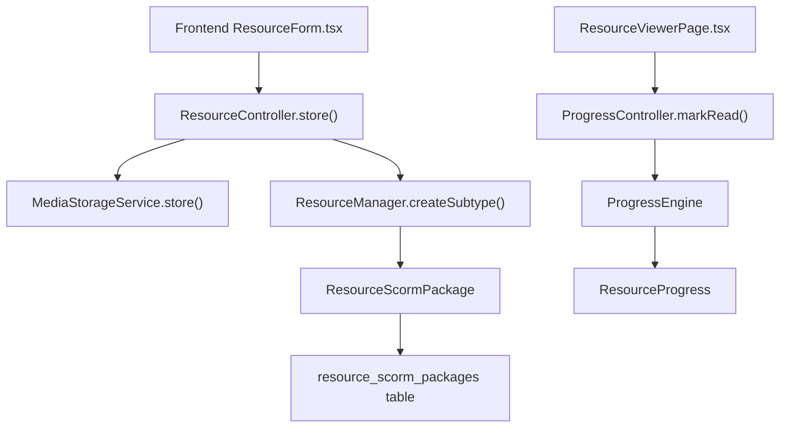
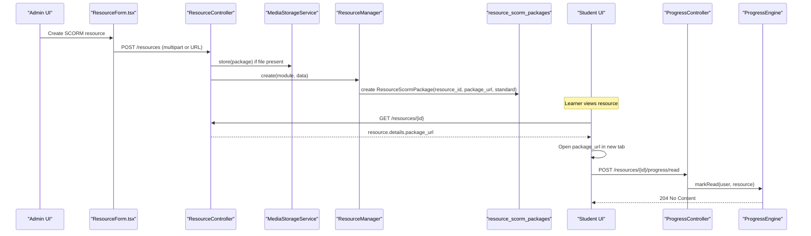
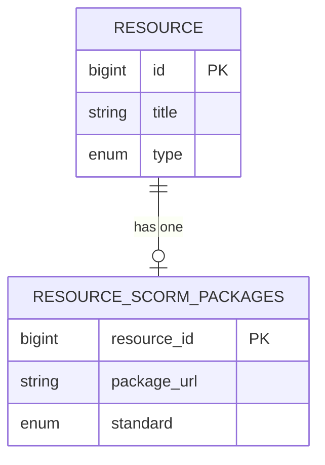
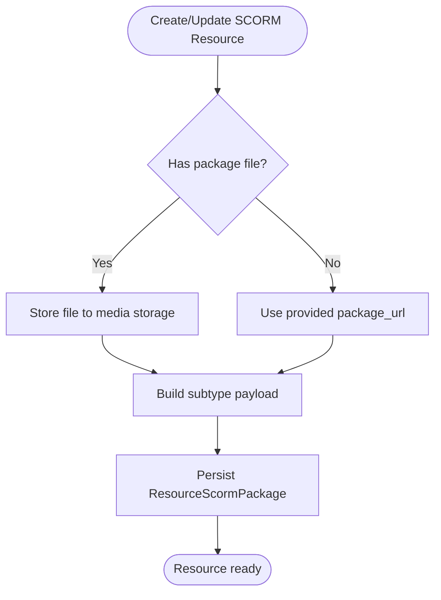
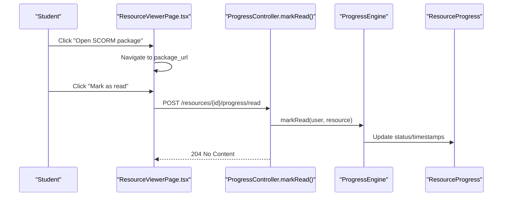
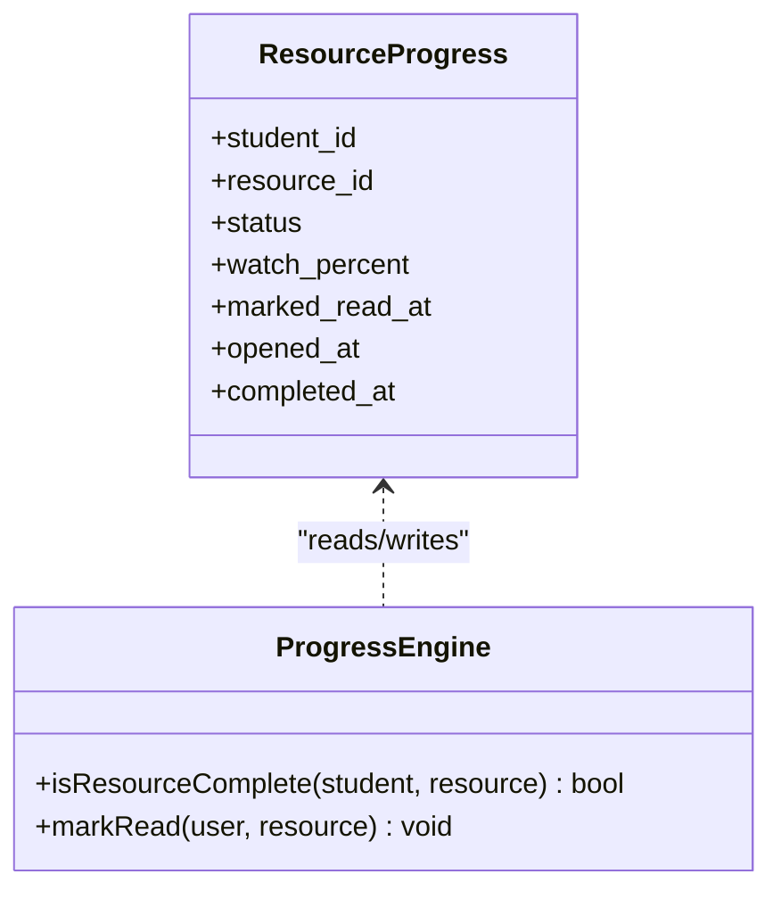
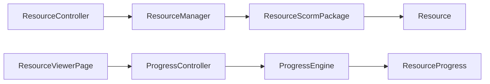

# SCORM Package Resources

<cite>
**Referenced Files in This Document**
- [ResourceScormPackage.php](file://app/Models/ResourceScormPackage.php)
- [ScormStandard.php](file://app/Enums/ScormStandard.php)
- [Resource.php](file://app/Models/Resource.php)
- [2024_01_01_000125_create_resource_scorm_packages_table.php](file://database/migrations/2024_01_01_000125_create_resource_scorm_packages_table.php)
- [ResourceManager.php](file://app\Services\Content\ResourceManager.php)
- [ResourceController.php](file://app/Http/Controllers/Api/V1/ResourceController.php)
- [ProgressEngine.php](file://app\Services\Progress\ProgressEngine.php)
- [ResourceProgress.php](file://app/Models/ResourceProgress.php)
- [ProgressController.php](file://app/Http/Controllers/Api/V1/ProgressController.php)
- [ResourceForm.tsx](file://frontend/src/features/courseStructure/ResourceForm.tsx)
- [ResourceViewerPage.tsx](file://frontend/src/features/learning/ResourceViewerPage.tsx)
</cite>

## Table of Contents
1. [Introduction](#introduction)
2. [Project Structure](#project-structure)
3. [Core Components](#core-components)
4. [Architecture Overview](#architecture-overview)
5. [Detailed Component Analysis](#detailed-component-analysis)
6. [Dependency Analysis](#dependency-analysis)
7. [Performance Considerations](#performance-considerations)
8. [Troubleshooting Guide](#troubleshooting-guide)
9. [Conclusion](#conclusion)
10. [Appendices](#appendices)

## Introduction
This document explains how the platform supports SCORM Package Resources for standardized e-learning content. It covers the data model, upload and storage flow, validation boundaries, extraction expectations, progress tracking integration, and reporting. It also clarifies current capabilities and limitations regarding SCORM runtime communication and completion synchronization.

## Project Structure
SCORM support is implemented as a resource subtype alongside other resource types (video, document, reading, external link, live session, downloadable file). The key pieces are:
- A dedicated model to store SCORM package metadata
- An enum defining supported standards
- A controller that handles uploads and delegates creation/update to a service
- A service that persists the subtype-specific details
- A progress engine that integrates SCORM resources into the general completion model
- Frontend forms and viewers that allow uploading and consuming SCORM packages

**Diagram sources**
- [ResourceController.php:30-46](file://app/Http/Controllers/Api/V1/ResourceController.php#L30-L46)
- [ResourceManager.php:101-128](file://app/Services/Content/ResourceManager.php#L101-L128)
- [ResourceScormPackage.php:11-32](file://app/Models/ResourceScormPackage.php#L11-L32)
- [ProgressController.php:130-135](file://app/Http/Controllers/Api/V1/ProgressController.php#L130-L135)
- [ProgressEngine.php:170-198](file://app/Services/Progress/ProgressEngine.php#L170-L198)

**Section sources**
- [ResourceController.php:30-66](file://app/Http/Controllers/Api/V1/ResourceController.php#L30-L66)
- [ResourceManager.php:101-128](file://app/Services/Content/ResourceManager.php#L101-L128)
- [ResourceScormPackage.php:11-32](file://app/Models/ResourceScormPackage.php#L11-L32)
- [ProgressController.php:130-149](file://app/Http/Controllers/Api/V1/ProgressController.php#L130-L149)
- [ProgressEngine.php:170-198](file://app/Services/Progress/ProgressEngine.php#L170-L198)

## Core Components
- ResourceScormPackage model stores the package URL and selected standard per resource.
- ScormStandard enum defines supported values: SCORM 1.2, SCORM 2004, and xAPI.
- Resource model exposes a one-to-one relationship to ResourceScormPackage.
- Database migration creates the resource_scorm_packages table with a primary key on resource_id, package_url, and standard enum.
- ResourceManager creates subtype records including SCORM packages after files are stored.
- ResourceController handles multipart uploads for SCORM packages and updates, delegating storage and persistence.
- ProgressEngine treats SCORM completion via the generic “mark as read” signal; there is no in-house SCORM/xAPI runtime.
- ResourceProgress tracks per-resource status and timestamps used by the progress system.
- ProgressController exposes mark-read endpoints used by the frontend to record completion signals.
- Frontend ResourceForm allows selecting a .zip package or providing a package URL and choosing a standard.
- Frontend ResourceViewerPage opens the SCORM package in a new tab and provides a “Mark as read” action.

**Section sources**
- [ResourceScormPackage.php:11-32](file://app/Models/ResourceScormPackage.php#L11-L32)
- [ScormStandard.php:7-12](file://app/Enums/ScormStandard.php#L7-L12)
- [Resource.php:71-77](file://app/Models/Resource.php#L71-L77)
- [2024_01_01_000125_create_resource_scorm_packages_table.php:11-17](file://database/migrations/2024_01_01_000125_create_resource_scorm_packages_table.php#L11-L17)
- [ResourceManager.php:124-128](file://app/Services/Content/ResourceManager.php#L124-L128)
- [ResourceController.php:30-66](file://app/Http/Controllers/Api/V1/ResourceController.php#L30-L66)
- [ProgressEngine.php:170-198](file://app/Services/Progress/ProgressEngine.php#L170-L198)
- [ResourceProgress.php:11-48](file://app/Models/ResourceProgress.php#L11-L48)
- [ProgressController.php:130-135](file://app/Http/Controllers/Api/V1/ProgressController.php#L130-L135)
- [ResourceForm.tsx:246-267](file://frontend/src/features/courseStructure/ResourceForm.tsx#L246-L267)
- [ResourceViewerPage.tsx:197-217](file://frontend/src/features/learning/ResourceViewerPage.tsx#L197-L217)

## Architecture Overview
The SCORM feature follows the platform’s resource abstraction:
- Admins create a resource of type SCORM via the admin UI.
- The frontend submits either a .zip file or a package URL along with the chosen standard.
- The backend stores the file (if provided) and persists the SCORM subtype record.
- Learners open the SCORM package externally; completion is recorded through the generic “mark as read” action.
- The progress engine uses this signal to determine resource completion and module roll-up.

**Diagram sources**
- [ResourceController.php:30-46](file://app/Http/Controllers/Api/V1/ResourceController.php#L30-L46)
- [ResourceManager.php:124-128](file://app/Services/Content/ResourceManager.php#L124-L128)
- [ProgressController.php:130-135](file://app/Http/Controllers/Api/V1/ProgressController.php#L130-L135)
- [ProgressEngine.php:170-198](file://app/Services/Progress/ProgressEngine.php#L170-L198)

## Detailed Component Analysis

### Data Model: ResourceScormPackage
- Primary key is resource_id, linking directly to the parent Resource.
- Stores package_url and standard (enum cast).
- No timestamps; lifecycle tied to the parent resource.

**Diagram sources**
- [Resource.php:71-77](file://app/Models/Resource.php#L71-L77)
- [ResourceScormPackage.php:11-32](file://app/Models/ResourceScormPackage.php#L11-L32)
- [2024_01_01_000125_create_resource_scorm_packages_table.php:11-17](file://database/migrations/2024_01_01_000125_create_resource_scorm_packages_table.php#L11-L17)

**Section sources**
- [ResourceScormPackage.php:11-32](file://app/Models/ResourceScormPackage.php#L11-L32)
- [2024_01_01_000125_create_resource_scorm_packages_table.php:11-17](file://database/migrations/2024_01_01_000125_create_resource_scorm_packages_table.php#L11-L17)

### Upload and Storage Flow
- The form accepts either a .zip file or a direct URL for the package.
- If a file is uploaded, it is stored via MediaStorageService under a course-scoped path.
- The controller strips raw file/package fields from validated data before passing to the service.
- The service creates the subtype record with package_url and standard.

**Diagram sources**
- [ResourceController.php:30-66](file://app/Http/Controllers/Api/V1/ResourceController.php#L30-L66)
- [ResourceManager.php:124-128](file://app/Services/Content/ResourceManager.php#L124-L128)

**Section sources**
- [ResourceController.php:30-66](file://app/Http/Controllers/Api/V1/ResourceController.php#L30-L66)
- [ResourceManager.php:124-128](file://app/Services/Content/ResourceManager.php#L124-L128)

### Validation and Standards
- The frontend restricts package selection to .zip files and enforces a size limit.
- The standard field is constrained to the defined enum values.
- Backend validation is handled by request classes and enums; the service writes only validated data.

**Section sources**
- [ResourceForm.tsx:246-267](file://frontend/src/features/courseStructure/ResourceForm.tsx#L246-L267)
- [ScormStandard.php:7-12](file://app/Enums/ScormStandard.php#L7-L12)

### Extraction Behavior
- There is no explicit extraction step in the codebase. The package URL is persisted and served to learners.
- Any extraction or hosting of SCORM content is expected to be handled by an external system or by serving the stored package directly.

[No sources needed since this section summarizes behavior without analyzing specific files]

### SCORM Runtime Communication and Completion
- The platform does not include an in-house SCORM/xAPI runtime.
- Learners open the package_url in a new tab.
- Completion is recorded using the generic “mark as read” endpoint, which updates ResourceProgress and influences module completion logic.

**Diagram sources**
- [ResourceViewerPage.tsx:197-217](file://frontend/src/features/learning/ResourceViewerPage.tsx#L197-L217)
- [ProgressController.php:130-135](file://app/Http/Controllers/Api/V1/ProgressController.php#L130-L135)
- [ProgressEngine.php:170-198](file://app/Services/Progress/ProgressEngine.php#L170-L198)
- [ResourceProgress.php:11-48](file://app/Models/ResourceProgress.php#L11-L48)

**Section sources**
- [ResourceViewerPage.tsx:197-217](file://frontend/src/features/learning/ResourceViewerPage.tsx#L197-L217)
- [ProgressController.php:130-135](file://app/Http/Controllers/Api/V1/ProgressController.php#L130-L135)
- [ProgressEngine.php:170-198](file://app/Services/Progress/ProgressEngine.php#L170-L198)

### Progress Tracking Integration and Reporting
- ResourceProgress tracks per-resource status and timestamps.
- ProgressEngine determines completion based on the resource type; for SCORM, it relies on the “mark as read” signal.
- Module-level completion and unlocking are computed by the same engine, enabling consistent reporting across resource types.

**Diagram sources**
- [ResourceProgress.php:11-48](file://app/Models/ResourceProgress.php#L11-L48)
- [ProgressEngine.php:170-198](file://app/Services/Progress/ProgressEngine.php#L170-L198)

**Section sources**
- [ResourceProgress.php:11-48](file://app/Models/ResourceProgress.php#L11-L48)
- [ProgressEngine.php:170-198](file://app/Services/Progress/ProgressEngine.php#L170-L198)

### Creating SCORM Resources (Examples)
- In the admin UI, select resource type SCORM, provide either a .zip file or a package URL, and choose a standard (SCORM 1.2, SCORM 2004, or xAPI).
- On update, replacing the package deletes the previous file and stores the new one.

**Section sources**
- [ResourceForm.tsx:246-267](file://frontend/src/features/courseStructure/ResourceForm.tsx#L246-L267)
- [ResourceController.php:48-66](file://app/Http/Controllers/Api/V1/ResourceController.php#L48-L66)

### Monitoring Learner Interactions
- Learner interactions are tracked via the progress endpoints:
  - Mark as read for SCORM resources
  - Other actions like video watch pings and opened links exist for other resource types
- The dashboard aggregates module progress and completion percentages.

**Section sources**
- [ProgressController.php:123-149](file://app/Http/Controllers/Api/V1/ProgressController.php#L123-L149)
- [ProgressController.php:67-121](file://app/Http/Controllers/Api/V1/ProgressController.php#L67-L121)

## Dependency Analysis

**Diagram sources**
- [ResourceController.php:30-66](file://app/Http/Controllers/Api/V1/ResourceController.php#L30-L66)
- [ResourceManager.php:124-128](file://app/Services/Content/ResourceManager.php#L124-L128)
- [ResourceScormPackage.php:11-32](file://app/Models/ResourceScormPackage.php#L11-L32)
- [Resource.php:71-77](file://app/Models/Resource.php#L71-L77)
- [ResourceViewerPage.tsx:197-217](file://frontend/src/features/learning/ResourceViewerPage.tsx#L197-L217)
- [ProgressController.php:130-135](file://app/Http/Controllers/Api/V1/ProgressController.php#L130-L135)
- [ProgressEngine.php:170-198](file://app/Services/Progress/ProgressEngine.php#L170-L198)
- [ResourceProgress.php:11-48](file://app/Models/ResourceProgress.php#L11-L48)

**Section sources**
- [ResourceController.php:30-66](file://app/Http/Controllers/Api/V1/ResourceController.php#L30-L66)
- [ResourceManager.php:124-128](file://app/Services/Content/ResourceManager.php#L124-L128)
- [ResourceScormPackage.php:11-32](file://app/Models/ResourceScormPackage.php#L11-L32)
- [Resource.php:71-77](file://app/Models/Resource.php#L71-L77)
- [ResourceViewerPage.tsx:197-217](file://frontend/src/features/learning/ResourceViewerPage.tsx#L197-L217)
- [ProgressController.php:130-135](file://app/Http/Controllers/Api/V1/ProgressController.php#L130-L135)
- [ProgressEngine.php:170-198](file://app/Services/Progress/ProgressEngine.php#L170-L198)
- [ResourceProgress.php:11-48](file://app/Models/ResourceProgress.php#L11-L48)

## Performance Considerations
- Storing large SCORM packages can impact storage and bandwidth; ensure appropriate limits and CDN usage for delivery.
- Avoid repeated reads of large package URLs; cache where possible at the application or edge layer.
- Progress updates are lightweight; batch or throttle frontend calls if necessary to reduce load.

[No sources needed since this section provides general guidance]

## Troubleshooting Guide
- Package not opening: verify package_url is accessible and correctly stored; check permissions on storage.
- Completion not updating: confirm the learner clicked “Mark as read”; verify ResourceProgress has a record for the student/resource pair.
- Standard mismatch: ensure the selected standard matches the package’s expectations; while the platform does not enforce runtime compatibility, authoring tools should align with the chosen standard.
- Upload failures: validate file size and format (.zip); check storage configuration and disk space.

**Section sources**
- [ResourceController.php:30-66](file://app/Http/Controllers/Api/V1/ResourceController.php#L30-L66)
- [ResourceViewerPage.tsx:197-217](file://frontend/src/features/learning/ResourceViewerPage.tsx#L197-L217)
- [ProgressEngine.php:170-198](file://app/Services/Progress/ProgressEngine.php#L170-L198)

## Conclusion
SCORM Package Resources are fully integrated into the platform’s resource and progress systems. The implementation focuses on reliable storage, clear standard selection, and consistent completion signaling via “mark as read.” While there is no in-house SCORM/xAPI runtime, the design allows straightforward extension to integrate external runtimes or APIs in the future.

[No sources needed since this section summarizes without analyzing specific files]

## Appendices

### API Endpoints Summary
- Create/Update SCORM resource: POST/PATCH /resources/{module?}/{resource}
  - Accepts multipart with package file or package_url and standard
- View resource: GET /resources/{resource}
  - Returns details including package_url for SCORM resources
- Mark as read: POST /resources/{resource}/progress/read
  - Updates ResourceProgress and affects completion

**Section sources**
- [ResourceController.php:25-66](file://app/Http/Controllers/Api/V1/ResourceController.php#L25-L66)
- [ProgressController.php:130-135](file://app/Http/Controllers/Api/V1/ProgressController.php#L130-L135)