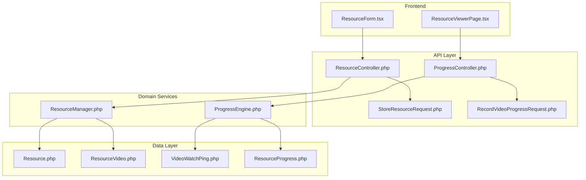
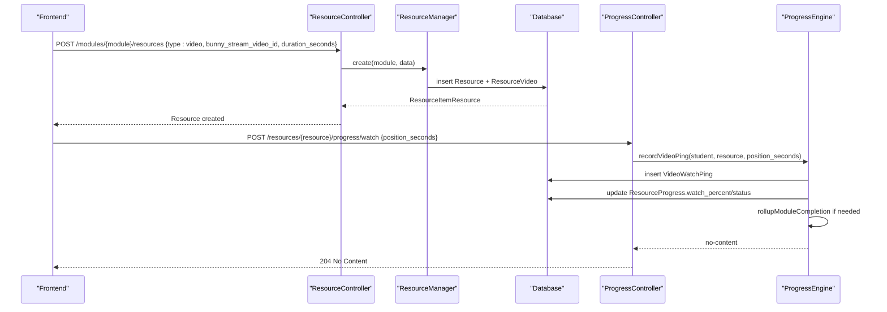
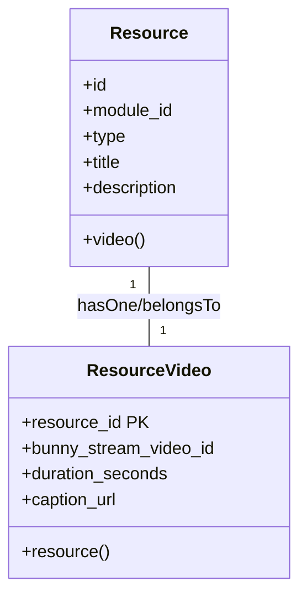
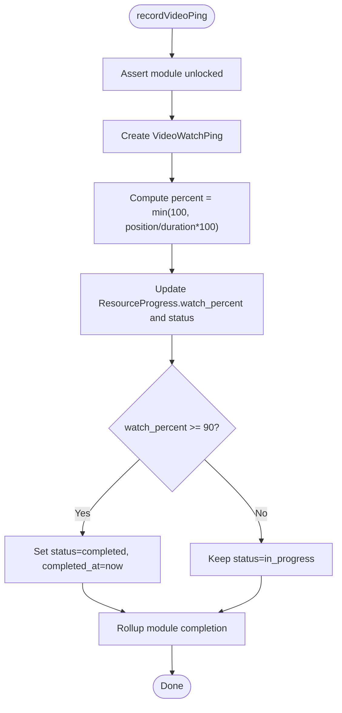
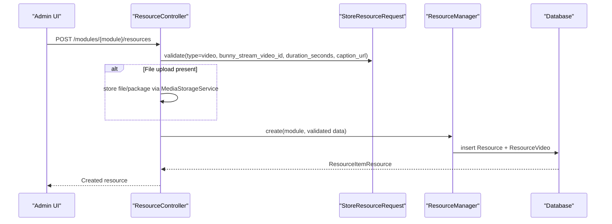
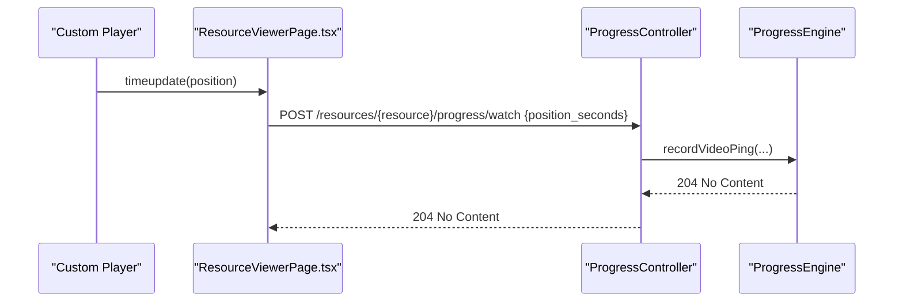
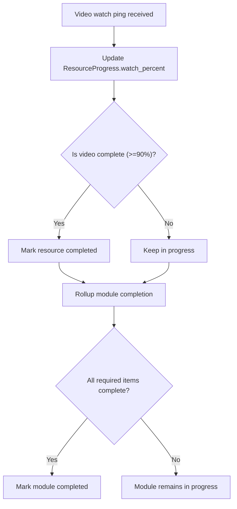
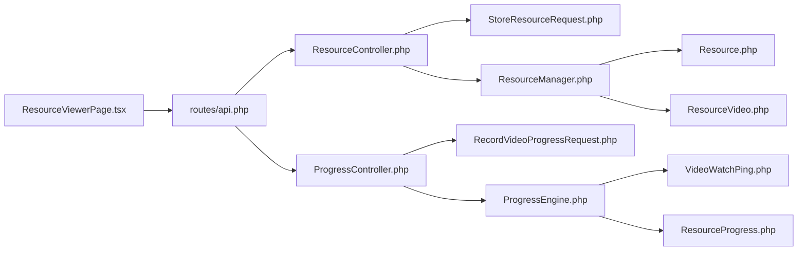

# Video Resources

<cite>
**Referenced Files in This Document**
- [ResourceVideo.php](file://app/Models/ResourceVideo.php)
- [VideoWatchPing.php](file://app/Models/VideoWatchPing.php)
- [ResourceProgress.php](file://app/Models/ResourceProgress.php)
- [Resource.php](file://app/Models/Resource.php)
- [2024_01_01_000121_create_resource_videos_table.php](file://database/migrations/2024_01_01_000121_create_resource_videos_table.php)
- [2024_01_01_000152_create_video_watch_pings_table.php](file://database/migrations/2024_01_01_000152_create_video_watch_pings_table.php)
- [2024_01_01_000151_create_resource_progress_table.php](file://database/migrations/2024_01_01_000151_create_resource_progress_table.php)
- [StoreResourceRequest.php](file://app/Http/Requests/Api/V1/StoreResourceRequest.php)
- [RecordVideoProgressRequest.php](file://app/Http/Requests/Api/V1/RecordVideoProgressRequest.php)
- [ResourceController.php](file://app/Http/Controllers/Api/V1/ResourceController.php)
- [ProgressController.php](file://app/Http/Controllers/Api/V1/ProgressController.php)
- [ResourceManager.php](file://app/Services/Content/ResourceManager.php)
- [ProgressEngine.php](file://app/Services/Progress/ProgressEngine.php)
- [api.php](file://routes/api.php)
- [ResourceViewerPage.tsx](file://frontend/src/features/learning/ResourceViewerPage.tsx)
- [ResourceForm.tsx](file://frontend/src/features/courseStructure/ResourceForm.tsx)
</cite>

## Table of Contents
1. [Introduction](#introduction)
2. [Project Structure](#project-structure)
3. [Core Components](#core-components)
4. [Architecture Overview](#architecture-overview)
5. [Detailed Component Analysis](#detailed-component-analysis)
6. [Dependency Analysis](#dependency-analysis)
7. [Performance Considerations](#performance-considerations)
8. [Troubleshooting Guide](#troubleshooting-guide)
9. [Conclusion](#conclusion)
10. [Appendices](#appendices)

## Introduction
This document explains how video resources work in the ResNet Academy LMS. It covers the ResourceVideo model, video creation and processing workflows, integration with Bunny Stream, progress tracking via VideoWatchPing and ResourceProgress, completion calculation at 90% watched, embedding and playback controls, and how video completion drives module-level progress. It also includes guidance for streaming optimization, bandwidth considerations, mobile compatibility, and implementing custom players.

## Project Structure
The video feature spans models, migrations, controllers, services, routes, and frontend components:
- Models define data structures for videos, watch pings, and per-resource progress.
- Migrations create tables for resource_videos, video_watch_pings, and resource_progress.
- Controllers expose endpoints to create/update resources and record video progress.
- Services encapsulate business logic for creating resources and computing progress/completion.
- Routes wire API endpoints for content management and progress recording.
- Frontend provides a form to create video resources and a viewer that simulates playback and records progress.

**Diagram sources**
- [ResourceForm.tsx:170-196](file://frontend/src/features/courseStructure/ResourceForm.tsx#L170-L196)
- [ResourceViewerPage.tsx:65-138](file://frontend/src/features/learning/ResourceViewerPage.tsx#L65-L138)
- [ResourceController.php:25-66](file://app/Http/Controllers/Api/V1/ResourceController.php#L25-L66)
- [ProgressController.php:123-149](file://app/Http/Controllers/Api/V1/ProgressController.php#L123-L149)
- [StoreResourceRequest.php:25-37](file://app/Http/Requests/Api/V1/StoreResourceRequest.php#L25-L37)
- [RecordVideoProgressRequest.php:16-21](file://app/Http/Requests/Api/V1/RecordVideoProgressRequest.php#L16-L21)
- [ResourceManager.php:98-128](file://app/Services/Content/ResourceManager.php#L98-L128)
- [ProgressEngine.php:218-244](file://app/Services/Progress/ProgressEngine.php#L218-L244)
- [Resource.php:40-45](file://app/Models/Resource.php#L40-L45)
- [ResourceVideo.php:10-28](file://app/Models/ResourceVideo.php#L10-L28)
- [VideoWatchPing.php:10-34](file://app/Models/VideoWatchPing.php#L10-L34)
- [ResourceProgress.php:11-47](file://app/Models/ResourceProgress.php#L11-L47)

**Section sources**
- [ResourceForm.tsx:170-196](file://frontend/src/features/courseStructure/ResourceForm.tsx#L170-L196)
- [ResourceViewerPage.tsx:65-138](file://frontend/src/features/learning/ResourceViewerPage.tsx#L65-L138)
- [ResourceController.php:25-66](file://app/Http/Controllers/Api/V1/ResourceController.php#L25-L66)
- [ProgressController.php:123-149](file://app/Http/Controllers/Api/V1/ProgressController.php#L123-L149)
- [StoreResourceRequest.php:25-37](file://app/Http/Requests/Api/V1/StoreResourceRequest.php#L25-L37)
- [RecordVideoProgressRequest.php:16-21](file://app/Http/Requests/Api/V1/RecordVideoProgressRequest.php#L16-L21)
- [ResourceManager.php:98-128](file://app/Services/Content/ResourceManager.php#L98-L128)
- [ProgressEngine.php:218-244](file://app/Services/Progress/ProgressEngine.php#L218-L244)
- [Resource.php:40-45](file://app/Models/Resource.php#L40-L45)
- [ResourceVideo.php:10-28](file://app/Models/ResourceVideo.php#L10-L28)
- [VideoWatchPing.php:10-34](file://app/Models/VideoWatchPing.php#L10-L34)
- [ResourceProgress.php:11-47](file://app/Models/ResourceProgress.php#L11-L47)

## Core Components
- ResourceVideo stores Bunny Stream identifiers, duration, and caption URL; it is linked one-to-one with a Resource.
- VideoWatchPing records periodic watch events (student, resource, position_seconds).
- ResourceProgress tracks per-resource completion state including watch_percent and timestamps for read/opened/completed.
- ProgressEngine centralizes all completion logic, including video ping handling and module rollup.
- ResourceManager handles creation of type-specific resource details (e.g., video subtype).
- Controllers expose APIs for resource CRUD and progress recording.

Key behaviors:
- Video completion threshold is 90% watched.
- Module completion rolls up when all required items are complete.
- Access control ensures students can only record progress on unlocked modules.

**Section sources**
- [ResourceVideo.php:10-28](file://app/Models/ResourceVideo.php#L10-L28)
- [VideoWatchPing.php:10-34](file://app/Models/VideoWatchPing.php#L10-L34)
- [ResourceProgress.php:11-47](file://app/Models/ResourceProgress.php#L11-L47)
- [ProgressEngine.php:180-244](file://app/Services/Progress/ProgressEngine.php#L180-L244)
- [ResourceManager.php:98-128](file://app/Services/Content/ResourceManager.php#L98-L128)
- [ResourceController.php:25-66](file://app/Http/Controllers/Api/V1/ResourceController.php#L25-L66)
- [ProgressController.php:123-149](file://app/Http/Controllers/Api/V1/ProgressController.php#L123-L149)

## Architecture Overview
The system separates concerns across layers:
- Frontend forms and viewers interact with REST APIs.
- Controllers validate requests and delegate to services.
- Services implement domain rules (resource creation, progress computation, module rollups).
- Models and migrations persist data.

**Diagram sources**
- [ResourceController.php:30-46](file://app/Http/Controllers/Api/V1/ResourceController.php#L30-L46)
- [ResourceManager.php:98-128](file://app/Services/Content/ResourceManager.php#L98-L128)
- [ProgressController.php:123-128](file://app/Http/Controllers/Api/V1/ProgressController.php#L123-L128)
- [ProgressEngine.php:218-244](file://app/Services/Progress/ProgressEngine.php#L218-L244)

## Detailed Component Analysis

### ResourceVideo Model and Schema
- Primary key is resource_id (one-to-one with Resource).
- Stores bunny_stream_video_id, duration_seconds, caption_url.
- Relationship back to Resource via belongsTo.

**Diagram sources**
- [Resource.php:40-45](file://app/Models/Resource.php#L40-L45)
- [ResourceVideo.php:10-28](file://app/Models/ResourceVideo.php#L10-L28)
- [2024_01_01_000121_create_resource_videos_table.php:13-18](file://database/migrations/2024_01_01_000121_create_resource_videos_table.php#L13-L18)

**Section sources**
- [ResourceVideo.php:10-28](file://app/Models/ResourceVideo.php#L10-L28)
- [2024_01_01_000121_create_resource_videos_table.php:13-18](file://database/migrations/2024_01_01_000121_create_resource_videos_table.php#L13-L18)

### Video Watch Pings and Progress Tracking
- VideoWatchPing captures student_id, resource_id, position_seconds, pinged_at.
- ResourceProgress tracks status, watch_percent, marked_read_at, opened_at, completed_at.
- Completion rule: video is considered complete when watch_percent >= 90%.

**Diagram sources**
- [ProgressEngine.php:218-244](file://app/Services/Progress/ProgressEngine.php#L218-L244)
- [2024_01_01_000152_create_video_watch_pings_table.php:13-20](file://database/migrations/2024_01_01_000152_create_video_watch_pings_table.php#L13-L20)
- [2024_01_01_000151_create_resource_progress_table.php:13-24](file://database/migrations/2024_01_01_000151_create_resource_progress_table.php#L13-L24)

**Section sources**
- [VideoWatchPing.php:10-34](file://app/Models/VideoWatchPing.php#L10-L34)
- [ResourceProgress.php:11-47](file://app/Models/ResourceProgress.php#L11-L47)
- [ProgressEngine.php:218-244](file://app/Services/Progress/ProgressEngine.php#L218-L244)
- [2024_01_01_000152_create_video_watch_pings_table.php:13-20](file://database/migrations/2024_01_01_000152_create_video_watch_pings_table.php#L13-L20)
- [2024_01_01_000151_create_resource_progress_table.php:13-24](file://database/migrations/2024_01_01_000151_create_resource_progress_table.php#L13-L24)

### Video Resource Creation Workflow
- StoreResourceRequest validates type and video fields (bunny_stream_video_id, duration_seconds, caption_url).
- ResourceController.store handles optional file uploads via MediaStorageService and delegates to ResourceManager.create.
- ResourceManager.create writes Resource and type-specific details (ResourceVideo for video type).

**Diagram sources**
- [StoreResourceRequest.php:25-37](file://app/Http/Requests/Api/V1/StoreResourceRequest.php#L25-L37)
- [ResourceController.php:30-46](file://app/Http/Controllers/Api/V1/ResourceController.php#L30-L46)
- [ResourceManager.php:98-128](file://app/Services/Content/ResourceManager.php#L98-L128)

**Section sources**
- [StoreResourceRequest.php:25-37](file://app/Http/Requests/Api/V1/StoreResourceRequest.php#L25-L37)
- [ResourceController.php:30-46](file://app/Http/Controllers/Api/V1/ResourceController.php#L30-L46)
- [ResourceManager.php:98-128](file://app/Services/Content/ResourceManager.php#L98-L128)

### Playback Controls and Custom Player Integration
- The frontend ResourceViewerPage simulates playback and sends periodic progress updates to the backend.
- To integrate a real player (e.g., Bunny Stream), bind player events (timeupdate, pause, resume, ended) to call the watch endpoint with current position.
- Ensure progress is sent at intervals (e.g., every few seconds) and on significant events (pause/resume, seek, end).

**Diagram sources**
- [ResourceViewerPage.tsx:65-138](file://frontend/src/features/learning/ResourceViewerPage.tsx#L65-L138)
- [ProgressController.php:123-128](file://app/Http/Controllers/Api/V1/ProgressController.php#L123-L128)
- [ProgressEngine.php:218-244](file://app/Services/Progress/ProgressEngine.php#L218-L244)

**Section sources**
- [ResourceViewerPage.tsx:65-138](file://frontend/src/features/learning/ResourceViewerPage.tsx#L65-L138)
- [ProgressController.php:123-128](file://app/Http/Controllers/Api/V1/ProgressController.php#L123-L128)
- [ProgressEngine.php:218-244](file://app/Services/Progress/ProgressEngine.php#L218-L244)

### Video Streaming Optimization and Bandwidth Considerations
- Videos are hosted externally via Bunny Stream; the app does not store or transcode media.
- Use adaptive bitrate streams provided by the external service to optimize bandwidth and quality.
- Cache captions and thumbnails where possible; leverage CDN caching headers from the provider.
- Monitor network conditions and adjust quality selection in the player.

[No sources needed since this section provides general guidance]

### Mobile Compatibility
- Ensure the player supports touch gestures, responsive layouts, and accessibility features.
- Provide keyboard navigation and screen reader support for controls and captions.
- Test playback on various devices and browsers; ensure captions are accessible.

[No sources needed since this section provides general guidance]

### Relationship Between Video Resources and Module Progress Tracking
- A video resource contributes to module completion when its watch_percent reaches 90%.
- ProgressEngine.isResourceComplete checks ResourceType::Video against ResourceProgress.watch_percent.
- When all required module items are complete, ProgressEngine.rollupModuleCompletion marks the module as completed and unlocks subsequent modules.

**Diagram sources**
- [ProgressEngine.php:180-244](file://app/Services/Progress/ProgressEngine.php#L180-L244)

**Section sources**
- [ProgressEngine.php:180-244](file://app/Services/Progress/ProgressEngine.php#L180-L244)

## Dependency Analysis
- Controllers depend on Requests for validation and Services for business logic.
- Services depend on Models and Migrations for persistence.
- Frontend depends on API routes exposed by Controllers.

**Diagram sources**
- [api.php:139-153](file://routes/api.php#L139-L153)
- [ResourceController.php:25-66](file://app/Http/Controllers/Api/V1/ResourceController.php#L25-L66)
- [ProgressController.php:123-149](file://app/Http/Controllers/Api/V1/ProgressController.php#L123-L149)
- [StoreResourceRequest.php:25-37](file://app/Http/Requests/Api/V1/StoreResourceRequest.php#L25-L37)
- [RecordVideoProgressRequest.php:16-21](file://app/Http/Requests/Api/V1/RecordVideoProgressRequest.php#L16-L21)
- [ResourceManager.php:98-128](file://app/Services/Content/ResourceManager.php#L98-L128)
- [ProgressEngine.php:218-244](file://app/Services/Progress/ProgressEngine.php#L218-L244)
- [Resource.php:40-45](file://app/Models/Resource.php#L40-L45)
- [ResourceVideo.php:10-28](file://app/Models/ResourceVideo.php#L10-L28)
- [VideoWatchPing.php:10-34](file://app/Models/VideoWatchPing.php#L10-L34)
- [ResourceProgress.php:11-47](file://app/Models/ResourceProgress.php#L11-L47)

**Section sources**
- [api.php:139-153](file://routes/api.php#L139-L153)
- [ResourceController.php:25-66](file://app/Http/Controllers/Api/V1/ResourceController.php#L25-L66)
- [ProgressController.php:123-149](file://app/Http/Controllers/Api/V1/ProgressController.php#L123-L149)
- [StoreResourceRequest.php:25-37](file://app/Http/Requests/Api/V1/StoreResourceRequest.php#L25-L37)
- [RecordVideoProgressRequest.php:16-21](file://app/Http/Requests/Api/V1/RecordVideoProgressRequest.php#L16-L21)
- [ResourceManager.php:98-128](file://app/Services/Content/ResourceManager.php#L98-L128)
- [ProgressEngine.php:218-244](file://app/Services/Progress/ProgressEngine.php#L218-L244)
- [Resource.php:40-45](file://app/Models/Resource.php#L40-L45)
- [ResourceVideo.php:10-28](file://app/Models/ResourceVideo.php#L10-L28)
- [VideoWatchPing.php:10-34](file://app/Models/VideoWatchPing.php#L10-L34)
- [ResourceProgress.php:11-47](file://app/Models/ResourceProgress.php#L11-L47)

## Performance Considerations
- Offload video hosting to Bunny Stream to keep the application stateless and avoid large media storage overhead.
- Use adaptive streaming to reduce bandwidth usage and improve playback on low-connectivity devices.
- Throttle progress pings to balance accuracy and server load (e.g., every 5–10 seconds or on key events).
- Leverage database indexes on student_id and resource_id for efficient progress queries.

[No sources needed since this section provides general guidance]

## Troubleshooting Guide
Common issues and resolutions:
- Module locked: Students cannot record progress until the module is unlocked. Ensure schedule and prerequisites are met.
- Invalid video ID: Validate bunny_stream_video_id during resource creation; ensure it exists in Bunny Stream.
- Missing duration: If duration_seconds is null, watch_percent will be 0; set accurate durations to enable correct completion calculation.
- Excessive pings: Reduce frequency to avoid unnecessary writes; use debouncing or event-driven updates.
- Caption accessibility: Ensure caption_url points to valid WCAG-compliant captions for accessibility compliance.

**Section sources**
- [ProgressEngine.php:211-216](file://app/Services/Progress/ProgressEngine.php#L211-L216)
- [StoreResourceRequest.php:25-37](file://app/Http/Requests/Api/V1/StoreResourceRequest.php#L25-L37)
- [2024_01_01_000121_create_resource_videos_table.php:13-18](file://database/migrations/2024_01_01_000121_create_resource_videos_table.php#L13-L18)

## Conclusion
The ResNet Academy LMS implements a robust video resource system using external hosting (Bunny Stream), precise progress tracking, and centralized completion logic. Video completion at 90% drives module progression, while flexible APIs and frontend components enable both simulated and real player integrations. Proper streaming optimization, bandwidth management, and mobile compatibility ensure a smooth learning experience.

[No sources needed since this section summarizes without analyzing specific files]

## Appendices

### API Endpoints for Video Resources
- Create resource: POST /modules/{module}/resources
- Update resource: PATCH /resources/{resource}
- Delete resource: DELETE /resources/{resource}
- Record video progress: POST /resources/{resource}/progress/watch
- Mark read/opened/attendance: POST /resources/{resource}/progress/mark-read | mark-opened | attendance

**Section sources**
- [api.php:139-153](file://routes/api.php#L139-L153)

### Data Models Summary
- Resource: core entity linking to module and type-specific details.
- ResourceVideo: Bunny Stream ID, duration, captions.
- VideoWatchPing: periodic watch events.
- ResourceProgress: per-resource completion state.

**Section sources**
- [Resource.php:40-45](file://app/Models/Resource.php#L40-L45)
- [ResourceVideo.php:10-28](file://app/Models/ResourceVideo.php#L10-L28)
- [VideoWatchPing.php:10-34](file://app/Models/VideoWatchPing.php#L10-L34)
- [ResourceProgress.php:11-47](file://app/Models/ResourceProgress.php#L11-L47)