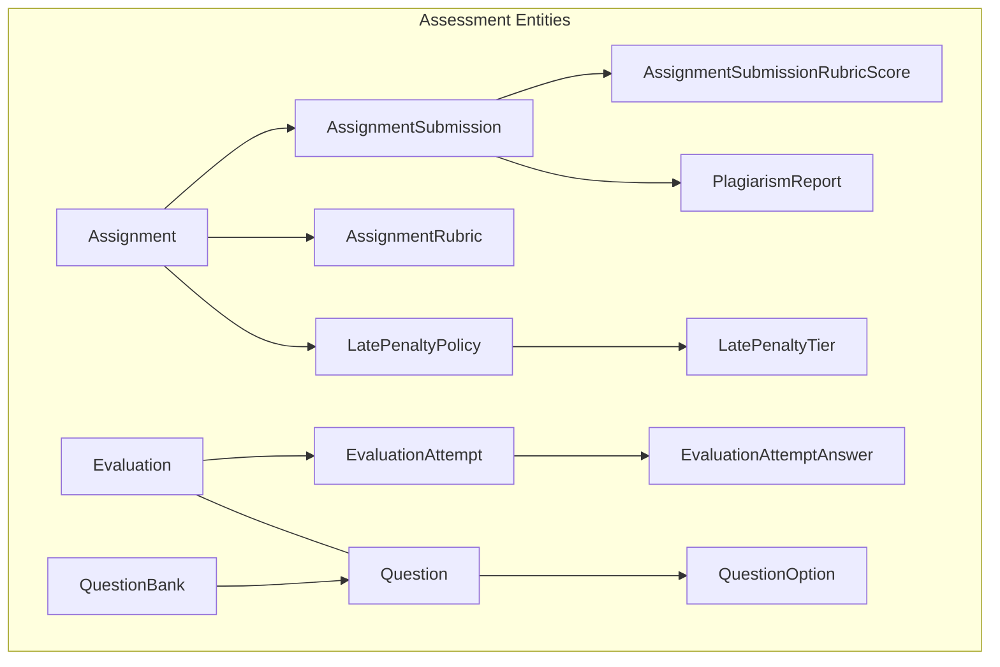
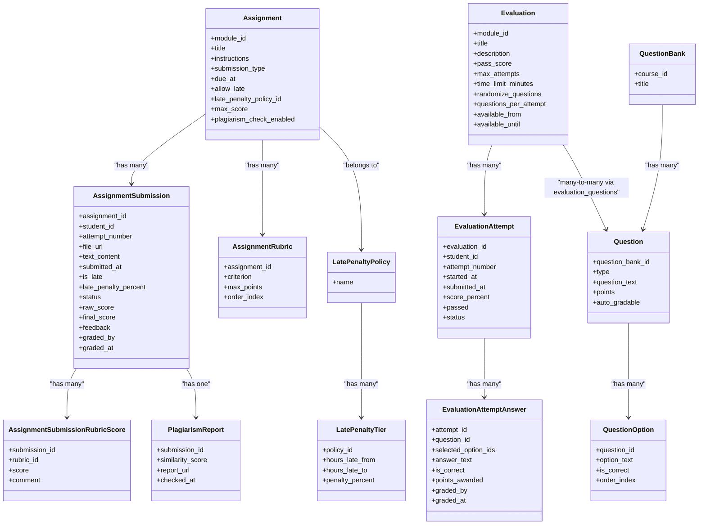
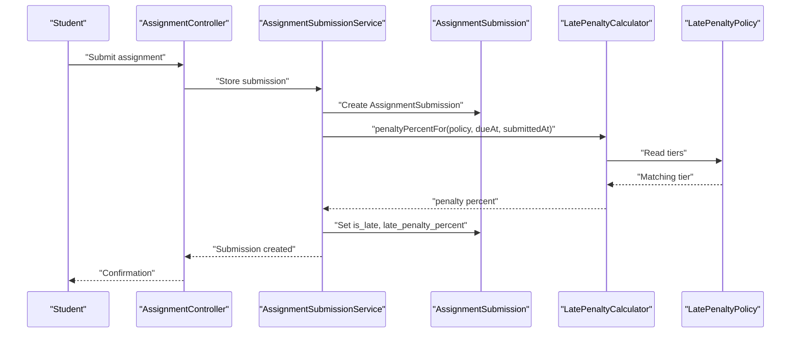
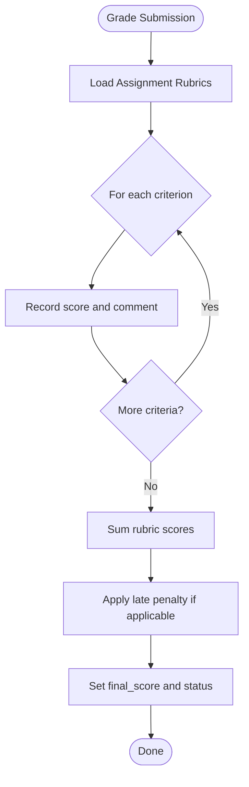
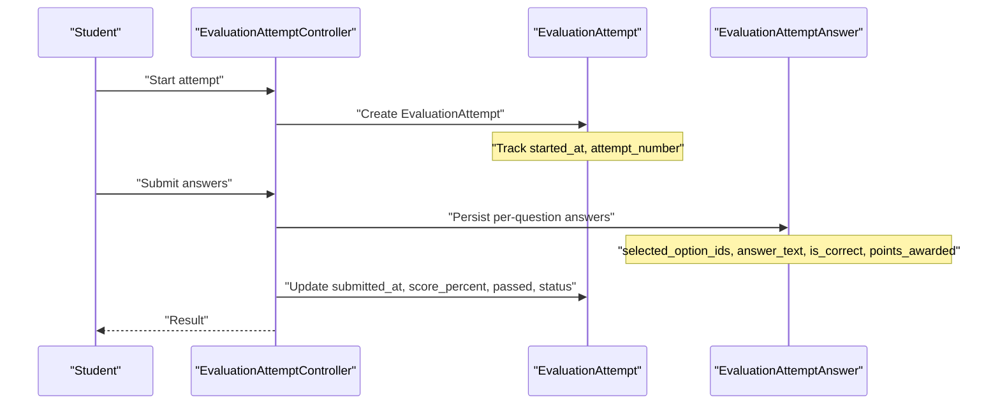
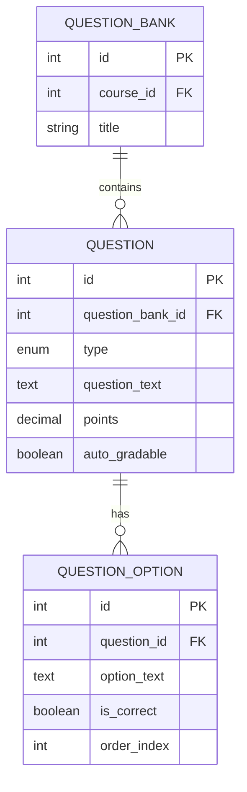
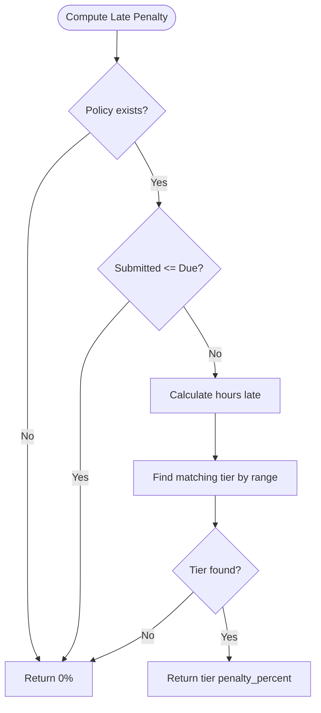
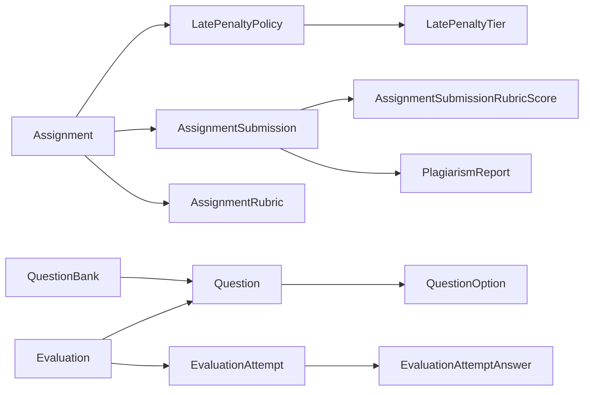

# Assessment System

<cite>
**Referenced Files in This Document**
- [Assignment.php](file://app/Models/Assignment.php)
- [AssignmentSubmission.php](file://app/Models/AssignmentSubmission.php)
- [AssignmentRubric.php](file://app/Models/AssignmentRubric.php)
- [AssignmentSubmissionRubricScore.php](file://app/Models/AssignmentSubmissionRubricScore.php)
- [Evaluation.php](file://app/Models/Evaluation.php)
- [EvaluationAttempt.php](file://app/Models/EvaluationAttempt.php)
- [EvaluationAttemptAnswer.php](file://app/Models/EvaluationAttemptAnswer.php)
- [QuestionBank.php](file://app/Models/QuestionBank.php)
- [Question.php](file://app/Models/Question.php)
- [QuestionOption.php](file://app/Models/QuestionOption.php)
- [PlagiarismReport.php](file://app/Models/PlagiarismReport.php)
- [LatePenaltyPolicy.php](file://app/Models/LatePenaltyPolicy.php)
- [LatePenaltyTier.php](file://app/Models/LatePenaltyTier.php)
- [LatePenaltyCalculator.php](file://app\Services/Assessment/LatePenaltyCalculator.php)
- [QuestionType.php](file://app/Enums/QuestionType.php)
- [SubmissionStatus.php](file://app/Enums/SubmissionStatus.php)
- [EvaluationAttemptStatus.php](file://app/Enums/EvaluationAttemptStatus.php)
- [AssignmentSubmissionType.php](file://app/Enums/AssignmentSubmissionType.php)
</cite>

## Table of Contents
1. Introduction
2. Project Structure
3. Core Components
4. Architecture Overview
5. Detailed Component Analysis
6. Dependency Analysis
7. Performance Considerations
8. Troubleshooting Guide
9. Conclusion

## Introduction
This document describes the data model and processing logic for the assessment system. It covers assignments, evaluations, question banks, submissions, attempts, rubrics, late penalties, plagiarism reports, and analytics-related structures. It explains how questions, options, and assessment types relate to each other, how grading works with rubrics, how evaluation attempts are tracked, and how late penalties are calculated.

## Project Structure
The assessment domain is implemented as a set of Eloquent models, enums, and services:
- Models define entities such as Assignment, Evaluation, Question, Submission, Attempt, Rubric, PlagiarismReport, and LatePenaltyPolicy/Tier.
- Enums capture controlled values like submission type, question type, and attempt status.
- Services encapsulate business rules, notably the late penalty calculation.

**Diagram sources**
- [Assignment.php:19-69](file://app/Models/Assignment.php#L19-L69)
- [AssignmentSubmission.php:22-87](file://app/Models/AssignmentSubmission.php#L22-L87)
- [AssignmentRubric.php:20-45](file://app/Models/AssignmentRubric.php#L20-L45)
- [AssignmentSubmissionRubricScore.php:14-39](file://app/Models/AssignmentSubmissionRubricScore.php#L14-L39)
- [PlagiarismReport.php:14-32](file://app/Models/PlagiarismReport.php#L14-L32)
- [LatePenaltyPolicy.php:19-37](file://app/Models/LatePenaltyPolicy.php#L19-L37)
- [LatePenaltyTier.php:19-36](file://app/Models/LatePenaltyTier.php#L19-L36)
- [Evaluation.php:19-61](file://app/Models/Evaluation.php#L19-L61)
- [EvaluationAttempt.php:21-62](file://app/Models/EvaluationAttempt.php#L21-L62)
- [EvaluationAttemptAnswer.php:14-54](file://app/Models/EvaluationAttemptAnswer.php#L14-L54)
- [QuestionBank.php:20-39](file://app/Models/QuestionBank.php#L20-L39)
- [Question.php:22-58](file://app/Models/Question.php#L22-L58)
- [QuestionOption.php:19-36](file://app/Models/QuestionOption.php#L19-L36)

**Section sources**
- [Assignment.php:19-69](file://app/Models/Assignment.php#L19-L69)
- [Evaluation.php:19-61](file://app/Models/Evaluation.php#L19-L61)
- [Question.php:22-58](file://app/Models/Question.php#L22-L58)
- [QuestionBank.php:20-39](file://app/Models/QuestionBank.php#L20-L39)

## Core Components
- Assignments: Define tasks with due dates, submission types, max scores, and optional plagiarism checks. They link to a module, a late penalty policy, rubrics, and student submissions.
- Evaluations: Quizzes/tests composed of questions from a bank, with pass score, attempts, time limits, availability windows, and randomization settings.
- Questions and Options: Reusable items stored in question banks, supporting multiple choice (single/multi), true/false, short answer, and essay. Options support correctness flags and ordering.
- Submissions: Student responses to assignments, tracking file/text content, timestamps, lateness, penalties, status, raw/final scores, feedback, and grader identity.
- Attempts: Per-student tries on evaluations, capturing start/submit times, percentage score, pass result, and status. Answers record per-question selections, correctness, points awarded, and grading metadata.
- Rubrics: Criteria with maximum points used to grade assignment submissions; each criterion can receive a score and comment per submission.
- Late Penalties: Policy-driven tiered deductions based on hours late.
- Plagiarism Reports: Optional similarity results linked to submissions.

**Section sources**
- [Assignment.php:19-69](file://app/Models/Assignment.php#L19-L69)
- [AssignmentSubmission.php:22-87](file://app/Models/AssignmentSubmission.php#L22-L87)
- [Evaluation.php:19-61](file://app/Models/Evaluation.php#L19-L61)
- [EvaluationAttempt.php:21-62](file://app/Models/EvaluationAttempt.php#L21-L62)
- [EvaluationAttemptAnswer.php:14-54](file://app/Models/EvaluationAttemptAnswer.php#L14-L54)
- [Question.php:22-58](file://app/Models/Question.php#L22-L58)
- [QuestionOption.php:19-36](file://app/Models/QuestionOption.php#L19-L36)
- [QuestionBank.php:20-39](file://app/Models/QuestionBank.php#L20-L39)
- [AssignmentRubric.php:20-45](file://app/Models/AssignmentRubric.php#L20-L45)
- [AssignmentSubmissionRubricScore.php:14-39](file://app/Models/AssignmentSubmissionRubricScore.php#L14-L39)
- [LatePenaltyPolicy.php:19-37](file://app/Models/LatePenaltyPolicy.php#L19-L37)
- [LatePenaltyTier.php:19-36](file://app/Models/LatePenaltyTier.php#L19-L36)
- [PlagiarismReport.php:14-32](file://app/Models/PlagiarismReport.php#L14-L32)

## Architecture Overview
The assessment system separates concerns into models for data, enums for state/type control, and services for business rules. Relationships connect assessments to their components and outcomes.

**Diagram sources**
- [Assignment.php:19-69](file://app/Models/Assignment.php#L19-L69)
- [AssignmentSubmission.php:22-87](file://app/Models/AssignmentSubmission.php#L22-L87)
- [AssignmentRubric.php:20-45](file://app/Models/AssignmentRubric.php#L20-L45)
- [AssignmentSubmissionRubricScore.php:14-39](file://app/Models/AssignmentSubmissionRubricScore.php#L14-L39)
- [Evaluation.php:19-61](file://app/Models/Evaluation.php#L19-L61)
- [EvaluationAttempt.php:21-62](file://app/Models/EvaluationAttempt.php#L21-L62)
- [EvaluationAttemptAnswer.php:14-54](file://app/Models/EvaluationAttemptAnswer.php#L14-L54)
- [QuestionBank.php:20-39](file://app/Models/QuestionBank.php#L20-L39)
- [Question.php:22-58](file://app/Models/Question.php#L22-L58)
- [QuestionOption.php:19-36](file://app/Models/QuestionOption.php#L19-L36)
- [LatePenaltyPolicy.php:19-37](file://app/Models/LatePenaltyPolicy.php#L19-L37)
- [LatePenaltyTier.php:19-36](file://app/Models/LatePenaltyTier.php#L19-L36)
- [PlagiarismReport.php:14-32](file://app/Models/PlagiarismReport.php#L14-L32)

## Detailed Component Analysis

### Assignments and Submissions
- Assignment defines task metadata, due date, submission type (file, text, or both), allowance for late work, max score, and whether plagiarism checking is enabled. It links to a module, a late penalty policy, rubrics, and submissions.
- AssignmentSubmission records each student’s attempt, including content (file URL or text), submission timestamp, lateness flag, computed late penalty percent, status, raw and final scores, feedback, and who graded it and when. It also links to rubric scores and an optional plagiarism report.

**Diagram sources**
- [Assignment.php:19-69](file://app/Models/Assignment.php#L19-L69)
- [AssignmentSubmission.php:22-87](file://app/Models/AssignmentSubmission.php#L22-L87)
- [LatePenaltyCalculator.php:17-34](file://app/Services/Assessment/LatePenaltyCalculator.php#L17-L34)
- [LatePenaltyPolicy.php:19-37](file://app/Models/LatePenaltyPolicy.php#L19-L37)

**Section sources**
- [Assignment.php:19-69](file://app/Models/Assignment.php#L19-L69)
- [AssignmentSubmission.php:22-87](file://app/Models/AssignmentSubmission.php#L22-L87)
- [AssignmentSubmissionType.php:7-12](file://app/Enums/AssignmentSubmissionType.php#L7-L12)
- [SubmissionStatus.php:7-11](file://app/Enums/SubmissionStatus.php#L7-L11)

### Rubric-Based Grading
- AssignmentRubric defines criteria with maximum points and order. Each submission can have per-criterion scores and comments via AssignmentSubmissionRubricScore. The sum of rubric scores contributes to the final score alongside any adjustments (e.g., late penalties).

**Diagram sources**
- [AssignmentRubric.php:20-45](file://app/Models/AssignmentRubric.php#L20-L45)
- [AssignmentSubmissionRubricScore.php:14-39](file://app/Models/AssignmentSubmissionRubricScore.php#L14-L39)
- [AssignmentSubmission.php:22-87](file://app/Models/AssignmentSubmission.php#L22-L87)

**Section sources**
- [AssignmentRubric.php:20-45](file://app/Models/AssignmentRubric.php#L20-L45)
- [AssignmentSubmissionRubricScore.php:14-39](file://app/Models/AssignmentSubmissionRubricScore.php#L14-L39)

### Evaluations, Attempts, and Answers
- Evaluation configures quiz parameters: pass score, max attempts, time limit, availability window, randomization, and number of questions per attempt. It relates to questions via a pivot table that preserves order.
- EvaluationAttempt captures per-student attempts with timing, percentage score, pass result, and status. Answers store selected options, free-text answers, correctness, points awarded, and grading metadata.

**Diagram sources**
- [Evaluation.php:19-61](file://app/Models/Evaluation.php#L19-L61)
- [EvaluationAttempt.php:21-62](file://app/Models/EvaluationAttempt.php#L21-L62)
- [EvaluationAttemptAnswer.php:14-54](file://app/Models/EvaluationAttemptAnswer.php#L14-L54)

**Section sources**
- [Evaluation.php:19-61](file://app/Models/Evaluation.php#L19-L61)
- [EvaluationAttempt.php:21-62](file://app/Models/EvaluationAttempt.php#L21-L62)
- [EvaluationAttemptAnswer.php:14-54](file://app/Models/EvaluationAttemptAnswer.php#L14-L54)
- [EvaluationAttemptStatus.php:7-12](file://app/Enums/EvaluationAttemptStatus.php#L7-L12)

### Question Banks, Types, and Options
- QuestionBank groups questions by course. Questions carry type, text, points, and auto-gradability. Options provide possible choices with correctness flags and ordering.
- Supported question types include single-choice, multi-choice, true/false, short answer, and essay.

**Diagram sources**
- [QuestionBank.php:20-39](file://app/Models/QuestionBank.php#L20-L39)
- [Question.php:22-58](file://app/Models/Question.php#L22-L58)
- [QuestionOption.php:19-36](file://app/Models/QuestionOption.php#L19-L36)
- [QuestionType.php:7-14](file://app/Enums/QuestionType.php#L7-L14)

**Section sources**
- [QuestionBank.php:20-39](file://app/Models/QuestionBank.php#L20-L39)
- [Question.php:22-58](file://app/Models/Question.php#L22-L58)
- [QuestionOption.php:19-36](file://app/Models/QuestionOption.php#L19-L36)
- [QuestionType.php:7-14](file://app/Enums/QuestionType.php#L7-L14)

### Late Penalty Calculation
- LatePenaltyPolicy defines named policies with associated tiers. Each tier specifies hour ranges and a penalty percentage. LatePenaltyCalculator computes the applicable tier based on hours late between due_at and submitted_at.

**Diagram sources**
- [LatePenaltyCalculator.php:17-34](file://app/Services/Assessment/LatePenaltyCalculator.php#L17-L34)
- [LatePenaltyPolicy.php:19-37](file://app/Models/LatePenaltyPolicy.php#L19-L37)
- [LatePenaltyTier.php:19-36](file://app/Models/LatePenaltyTier.php#L19-L36)

**Section sources**
- [LatePenaltyCalculator.php:17-34](file://app/Services/Assessment/LatePenaltyCalculator.php#L17-L34)
- [LatePenaltyPolicy.php:19-37](file://app/Models/LatePenaltyPolicy.php#L19-L37)
- [LatePenaltyTier.php:19-36](file://app/Models/LatePenaltyTier.php#L19-L36)

### Plagiarism Reports
- PlagiarismReport stores similarity score, report URL, and check timestamp for a submission. It is optional and linked to AssignmentSubmission.

**Section sources**
- [PlagiarismReport.php:14-32](file://app/Models/PlagiarismReport.php#L14-L32)
- [AssignmentSubmission.php:82-87](file://app/Models/AssignmentSubmission.php#L82-L87)

### Assessment Analytics Foundations
- The data model provides key inputs for analytics:
  - Assignment and Evaluation metadata (scores, due dates, availability).
  - Submission and Attempt records (timestamps, scores, statuses).
  - Per-question answers and rubric scores for detailed performance insights.
  - Plagiarism similarity scores for integrity metrics.
- These entities enable reporting on completion rates, average scores, attempt distributions, late submission trends, and risk indicators.

[No sources needed since this section synthesizes existing model capabilities without analyzing specific files]

## Dependency Analysis
- Assignment depends on Module, LatePenaltyPolicy, and produces AssignmentSubmission and AssignmentRubric entries.
- AssignmentSubmission depends on Assignment and User (student, grader), and may produce AssignmentSubmissionRubricScore and PlagiarismReport.
- Evaluation depends on Module and Question (via pivot), and produces EvaluationAttempt and EvaluationAttemptAnswer.
- Question depends on QuestionBank and produces QuestionOption.
- LatePenaltyPolicy depends on LatePenaltyTier.

**Diagram sources**
- [Assignment.php:19-69](file://app/Models/Assignment.php#L19-L69)
- [AssignmentSubmission.php:22-87](file://app/Models/AssignmentSubmission.php#L22-L87)
- [AssignmentRubric.php:20-45](file://app/Models/AssignmentRubric.php#L20-L45)
- [AssignmentSubmissionRubricScore.php:14-39](file://app/Models/AssignmentSubmissionRubricScore.php#L14-L39)
- [PlagiarismReport.php:14-32](file://app/Models/PlagiarismReport.php#L14-L32)
- [Evaluation.php:19-61](file://app/Models/Evaluation.php#L19-L61)
- [EvaluationAttempt.php:21-62](file://app/Models/EvaluationAttempt.php#L21-L62)
- [EvaluationAttemptAnswer.php:14-54](file://app/Models/EvaluationAttemptAnswer.php#L14-L54)
- [QuestionBank.php:20-39](file://app/Models/QuestionBank.php#L20-L39)
- [Question.php:22-58](file://app/Models/Question.php#L22-L58)
- [QuestionOption.php:19-36](file://app/Models/QuestionOption.php#L19-L36)
- [LatePenaltyPolicy.php:19-37](file://app/Models/LatePenaltyPolicy.php#L19-L37)
- [LatePenaltyTier.php:19-36](file://app/Models/LatePenaltyTier.php#L19-L36)

**Section sources**
- [Assignment.php:19-69](file://app/Models/Assignment.php#L19-L69)
- [Evaluation.php:19-61](file://app/Models/Evaluation.php#L19-L61)
- [Question.php:22-58](file://app/Models/Question.php#L22-L58)
- [LatePenaltyPolicy.php:19-37](file://app/Models/LatePenaltyPolicy.php#L19-L37)

## Performance Considerations
- Use eager loading for relationships when rendering dashboards or reports (e.g., load assignment rubrics with submissions, attempts with answers, questions with options).
- Index foreign keys commonly queried in analytics (e.g., student_id, assignment_id, evaluation_id, question_id).
- Avoid recalculating late penalties repeatedly; cache or persist computed values where appropriate.
- For large evaluations, paginate attempts and answers to reduce payload size.

[No sources needed since this section provides general guidance]

## Troubleshooting Guide
- Late penalty not applied: Verify the assignment has a valid late penalty policy and that the submission timestamp is after due_at. Confirm tiers cover the observed hours late.
- Incorrect attempt status: Ensure EvaluationAttemptStatus transitions align with workflow (in_progress -> submitted -> graded).
- Missing rubric scores: Confirm rubrics exist for the assignment and that scoring was recorded per criterion.
- Plagiarism report missing: Check whether plagiarism checking is enabled for the assignment and that a report was generated post-submission.

**Section sources**
- [LatePenaltyCalculator.php:17-34](file://app/Services/Assessment/LatePenaltyCalculator.php#L17-L34)
- [EvaluationAttemptStatus.php:7-12](file://app/Enums/EvaluationAttemptStatus.php#L7-L12)
- [AssignmentRubric.php:20-45](file://app/Models/AssignmentRubric.php#L20-L45)
- [AssignmentSubmissionRubricScore.php:14-39](file://app/Models/AssignmentSubmissionRubricScore.php#L14-L39)
- [PlagiarismReport.php:14-32](file://app/Models/PlagiarismReport.php#L14-L32)

## Conclusion
The assessment system models assignments and evaluations as distinct assessment types with shared concepts (students, attempts/submissions, scoring). Rubrics provide structured grading for assignments, while evaluations rely on question-based attempts with per-answer scoring. Late penalties are configurable via policies and tiers, and plagiarism reports integrate with submissions. The data model supports robust analytics by exposing granular records of attempts, answers, rubric scores, and integrity checks.