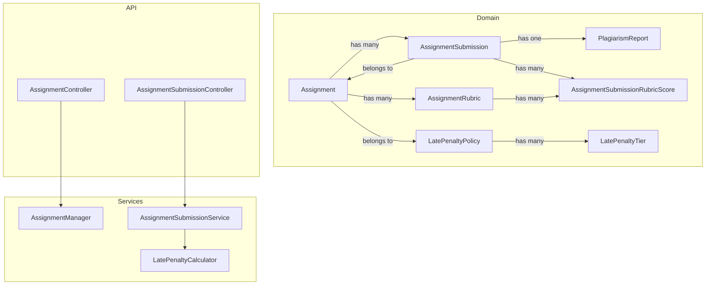
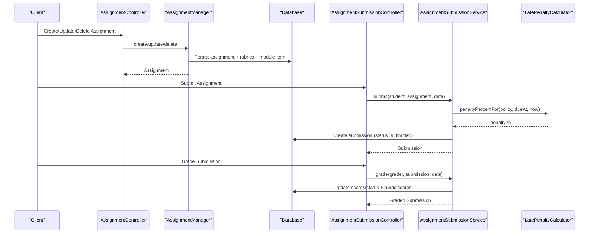
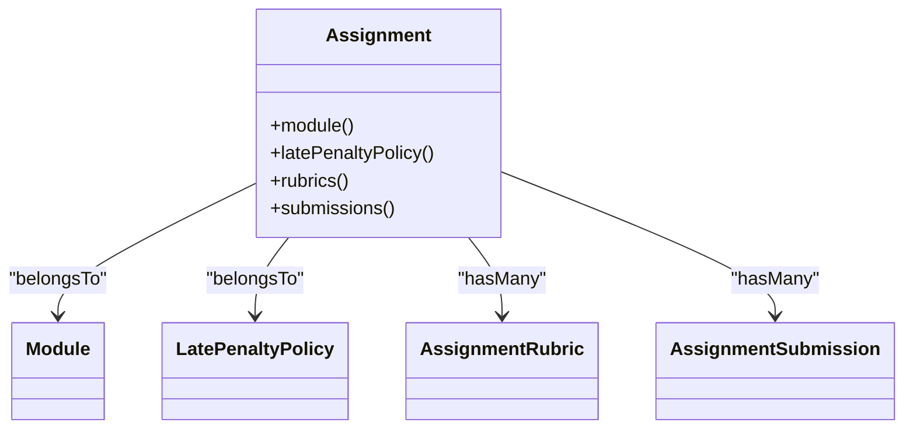
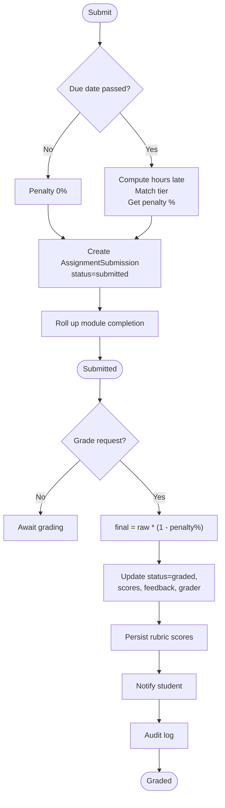
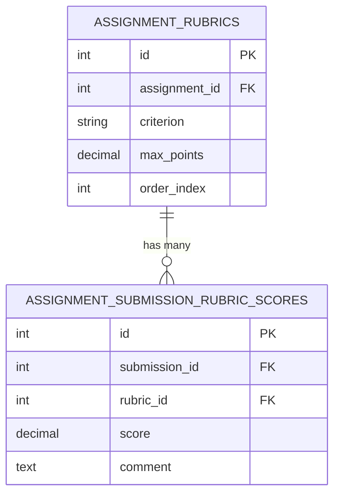
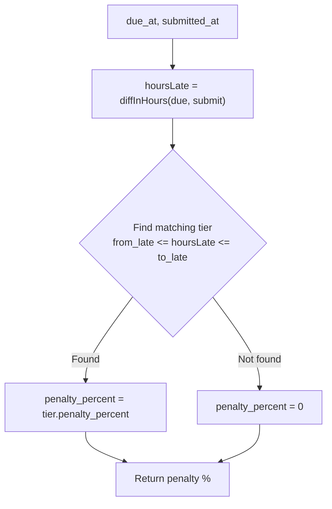
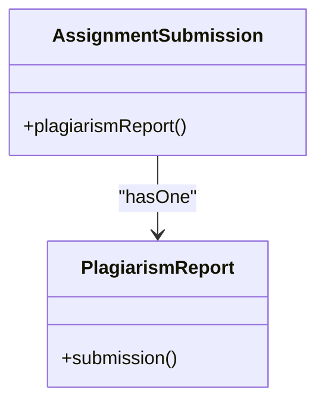
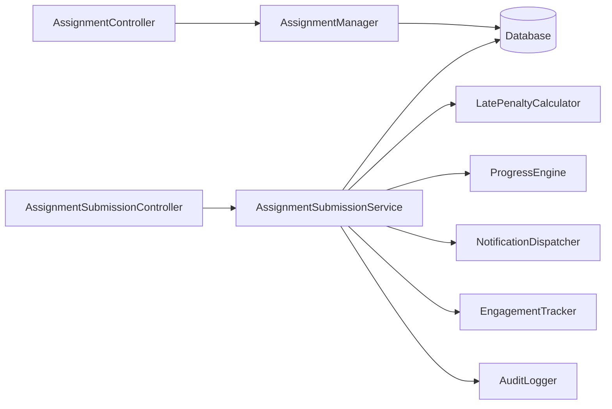

# Assignments

<cite>
**Referenced Files in This Document**
- [Assignment.php](file://app/Models/Assignment.php)
- [AssignmentSubmission.php](file://app/Models/AssignmentSubmission.php)
- [AssignmentRubric.php](file://app/Models/AssignmentRubric.php)
- [AssignmentSubmissionRubricScore.php](file://app/Models/AssignmentSubmissionRubricScore.php)
- [LatePenaltyPolicy.php](file://app/Models/LatePenaltyPolicy.php)
- [LatePenaltyTier.php](file://app/Models/LatePenaltyTier.php)
- [PlagiarismReport.php](file://app/Models/PlagiarismReport.php)
- [AssignmentSubmissionType.php](file://app/Enums/AssignmentSubmissionType.php)
- [SubmissionStatus.php](file://app/Enums/SubmissionStatus.php)
- [AssignmentManager.php](file://app/services/Assessment/AssignmentManager.php)
- [AssignmentSubmissionService.php](file://app/services/Assessment/AssignmentSubmissionService.php)
- [LatePenaltyCalculator.php](file://app/services/Assessment/LatePenaltyCalculator.php)
- [AssignmentController.php](file://app/Http/Controllers/Api/V1/AssignmentController.php)
- [AssignmentSubmissionController.php](file://app/Http/Controllers/Api/V1/AssignmentSubmissionController.php)
- [2024_01_01_000132_create_assignments_table.php](file://database/migrations/2024_01_01_000132_create_assignments_table.php)
- [2024_01_01_000133_create_assignment_rubrics_table.php](file://database/migrations/2024_01_01_000133_create_assignment_rubrics_table.php)
- [2024_01_01_000134_create_assignment_submissions_table.php](file://database/migrations/2024_01_01_000134_create_assignment_submissions_table.php)
- [2024_01_01_000135_create_assignment_submission_rubric_scores_table.php](file://database/migrations/2024_01_01_000135_create_assignment_submission_rubric_scores_table.php)
- [2024_01_01_000136_create_plagiarism_reports_table.php](file://database/migrations/2024_01_01_000136_create_plagiarism_reports_table.php)
</cite>

## Table of Contents
1. Introduction
2. Project Structure
3. Core Components
4. Architecture Overview
5. Detailed Component Analysis
6. Dependency Analysis
7. Performance Considerations
8. Troubleshooting Guide
9. Conclusion

## Introduction
This document provides comprehensive data model documentation for assignments, covering the Assignment entity, submission types, due dates, late penalty policies, plagiarism checking, rubrics, and student submissions. It explains relationships with modules, late penalty policies, and how submissions are tracked through their lifecycle from creation to grading, including status management and score calculations.

## Project Structure
The assignment feature is implemented across models, enums, services, controllers, and database migrations:
- Models define entities such as Assignment, AssignmentSubmission, AssignmentRubric, LatePenaltyPolicy, LatePenaltyTier, and PlagiarismReport.
- Enums capture submission types and statuses.
- Services encapsulate business logic for creating/updating assignments, submitting work, calculating late penalties, and grading.
- Controllers expose API endpoints for managing assignments and submissions.
- Migrations define the persistent schema for all tables involved.



**Diagram sources**
- [Assignment.php:14-70](file://app/Models/Assignment.php#L14-L70)
- [AssignmentSubmission.php:15-87](file://app/Models/AssignmentSubmission.php#L15-L87)
- [AssignmentRubric.php:13-45](file://app/Models/AssignmentRubric.php#L13-L45)
- [AssignmentSubmissionRubricScore.php:10-39](file://app/Models/AssignmentSubmissionRubricScore.php#L10-L39)
- [LatePenaltyPolicy.php:12-37](file://app/Models/LatePenaltyPolicy.php#L12-L37)
- [LatePenaltyTier.php:12-36](file://app/Models/LatePenaltyTier.php#L12-L36)
- [PlagiarismReport.php:10-32](file://app/Models/PlagiarismReport.php#L10-L32)
- [AssignmentManager.php:21-115](file://app/services/Assessment/AssignmentManager.php#L21-L115)
- [AssignmentSubmissionService.php:24-117](file://app/services/Assessment/AssignmentSubmissionService.php#L24-L117)
- [LatePenaltyCalculator.php:15-35](file://app/services/Assessment/LatePenaltyCalculator.php#L15-L35)
- [AssignmentController.php:16-47](file://app/Http/Controllers/Api/V1/AssignmentController.php#L16-L47)
- [AssignmentSubmissionController.php:19-58](file://app/Http/Controllers/Api/V1/AssignmentSubmissionController.php#L19-L58)

**Section sources**
- [Assignment.php:14-70](file://app/Models/Assignment.php#L14-L70)
- [AssignmentSubmission.php:15-87](file://app/Models/AssignmentSubmission.php#L15-L87)
- [AssignmentRubric.php:13-45](file://app/Models/AssignmentRubric.php#L13-L45)
- [AssignmentSubmissionRubricScore.php:10-39](file://app/Models/AssignmentSubmissionRubricScore.php#L10-L39)
- [LatePenaltyPolicy.php:12-37](file://app/Models/LatePenaltyPolicy.php#L12-L37)
- [LatePenaltyTier.php:12-36](file://app/Models/LatePenaltyTier.php#L12-L36)
- [PlagiarismReport.php:10-32](file://app/Models/PlagiarismReport.php#L10-L32)
- [AssignmentManager.php:21-115](file://app/services/Assessment/AssignmentManager.php#L21-L115)
- [AssignmentSubmissionService.php:24-117](file://app/services/Assessment/AssignmentSubmissionService.php#L24-L117)
- [LatePenaltyCalculator.php:15-35](file://app/services/Assessment/LatePenaltyCalculator.php#L15-L35)
- [AssignmentController.php:16-47](file://app/Http/Controllers/Api/V1/AssignmentController.php#L16-L47)
- [AssignmentSubmissionController.php:19-58](file://app/Http/Controllers/Api/V1/AssignmentSubmissionController.php#L19-L58)

## Core Components
- Assignment: Represents a module-based assessment with submission type, due date, late policy, max score, and plagiarism check flag.
- AssignmentSubmission: Tracks each student attempt, including file/text content, timestamps, lateness, penalty percent, status, scores, feedback, and grader info.
- AssignmentRubric: Defines grading criteria per assignment with max points and ordering.
- AssignmentSubmissionRubricScore: Per-submission scoring against each rubric criterion.
- LatePenaltyPolicy and LatePenaltyTier: Configurable tiered late deduction rules applied at grading time.
- PlagiarismReport: Optional report linked to a submission with similarity score and report URL.

Key attributes and relationships are defined by the models and migrations listed below.

**Section sources**
- [Assignment.php:19-69](file://app/Models/Assignment.php#L19-L69)
- [AssignmentSubmission.php:22-87](file://app/Models/AssignmentSubmission.php#L22-L87)
- [AssignmentRubric.php:20-45](file://app/Models/AssignmentRubric.php#L20-L45)
- [AssignmentSubmissionRubricScore.php:14-39](file://app/Models/AssignmentSubmissionRubricScore.php#L14-L39)
- [LatePenaltyPolicy.php:19-37](file://app/Models/LatePenaltyPolicy.php#L19-L37)
- [LatePenaltyTier.php:19-36](file://app/Models/LatePenaltyTier.php#L19-L36)
- [PlagiarismReport.php:14-32](file://app/Models/PlagiarismReport.php#L14-L32)

## Architecture Overview
The assignment workflow spans controllers, services, and models:
- AssignmentController orchestrates CRUD operations on assignments via AssignmentManager.
- AssignmentSubmissionController handles listing, submitting, and grading submissions via AssignmentSubmissionService.
- LatePenaltyCalculator computes late deductions based on configured tiers.
- Data persistence is enforced by Eloquent models backed by migrations.



**Diagram sources**
- [AssignmentController.php:20-47](file://app/Http/Controllers/Api/V1/AssignmentController.php#L20-L47)
- [AssignmentManager.php:26-92](file://app/services/Assessment/AssignmentManager.php#L26-L92)
- [AssignmentSubmissionController.php:29-58](file://app/Http/Controllers/Api/V1/AssignmentSubmissionController.php#L29-L58)
- [AssignmentSubmissionService.php:37-117](file://app/services/Assessment/AssignmentSubmissionService.php#L37-L117)
- [LatePenaltyCalculator.php:17-34](file://app/services/Assessment/LatePenaltyCalculator.php#L17-L34)

## Detailed Component Analysis

### Assignment Model
- Purpose: Central entity for an assignment within a module.
- Key fields: title, instructions, submission_type, due_at, allow_late, late_penalty_policy_id, max_score, plagiarism_check_enabled.
- Relationships:
  - Belongs to Module.
  - Belongs to LatePenaltyPolicy.
  - Has many AssignmentRubric entries.
  - Has many AssignmentSubmission entries.
- Enums and casts:
  - submission_type cast to AssignmentSubmissionType.
  - due_at cast to datetime; booleans and decimals appropriately cast.



**Diagram sources**
- [Assignment.php:42-69](file://app/Models/Assignment.php#L42-L69)

**Section sources**
- [Assignment.php:19-69](file://app/Models/Assignment.php#L19-L69)
- [2024_01_01_000132_create_assignments_table.php:13-24](file://database/migrations/2024_01_01_000132_create_assignments_table.php#L13-L24)

### Assignment Submission Lifecycle
- Creation:
  - Student submits via AssignmentSubmissionController.store.
  - File stored via MediaStorageService; text or file captured per assignment submission_type.
  - AssignmentSubmissionService.submit computes lateness and penalty percent using LatePenaltyCalculator.
  - Status set to Submitted; progress engine updates module completion upon submission.
- Grading:
  - Instructor grades via AssignmentSubmissionController.grade.
  - Service calculates final_score = raw_score * (1 - late_penalty_percent/100).
  - Updates status to Graded, records graded_by and graded_at, persists rubric scores, sends notifications, and logs audit events.



**Diagram sources**
- [AssignmentSubmissionController.php:38-58](file://app/Http/Controllers/Api/V1/AssignmentSubmissionController.php#L38-L58)
- [AssignmentSubmissionService.php:37-117](file://app/services/Assessment/AssignmentSubmissionService.php#L37-L117)
- [LatePenaltyCalculator.php:17-34](file://app/services/Assessment/LatePenaltyCalculator.php#L17-L34)

**Section sources**
- [AssignmentSubmissionController.php:29-58](file://app/Http/Controllers/Api/V1/AssignmentSubmissionController.php#L29-L58)
- [AssignmentSubmissionService.php:37-117](file://app/services/Assessment/AssignmentSubmissionService.php#L37-L117)
- [LatePenaltyCalculator.php:17-34](file://app/services/Assessment/LatePenaltyCalculator.php#L17-L34)

### Rubrics and Scoring
- AssignmentRubric defines criteria with max_points and order_index.
- AssignmentSubmissionRubricScore stores per-criterion scores and optional comments for a submission.
- Grading replaces previous rubric scores atomically to ensure consistency.



**Diagram sources**
- [2024_01_01_000133_create_assignment_rubrics_table.php:13-19](file://database/migrations/2024_01_01_000133_create_assignment_rubrics_table.php#L13-L19)
- [2024_01_01_000135_create_assignment_submission_rubric_scores_table.php:13-19](file://database/migrations/2024_01_01_000135_create_assignment_submission_rubric_scores_table.php#L13-L19)

**Section sources**
- [AssignmentRubric.php:20-45](file://app/Models/AssignmentRubric.php#L20-L45)
- [AssignmentSubmissionRubricScore.php:14-39](file://app/Models/AssignmentSubmissionRubricScore.php#L14-L39)
- [AssignmentSubmissionService.php:87-96](file://app/services/Assessment/AssignmentSubmissionService.php#L87-L96)

### Late Penalty Policies
- LatePenaltyPolicy groups multiple LatePenaltyTier entries defining hour bands and corresponding penalty percentages.
- LatePenaltyCalculator matches submitted-at vs due-at to find the applicable tier and returns the percentage.
- AssignmentSubmissionService applies the penalty when computing final_score during grading.



**Diagram sources**
- [LatePenaltyCalculator.php:17-34](file://app/services/Assessment/LatePenaltyCalculator.php#L17-L34)
- [LatePenaltyPolicy.php:24-37](file://app/Models/LatePenaltyPolicy.php#L24-L37)
- [LatePenaltyTier.php:19-36](file://app/Models/LatePenaltyTier.php#L19-L36)

**Section sources**
- [LatePenaltyCalculator.php:17-34](file://app/services/Assessment/LatePenaltyCalculator.php#L17-L34)
- [LatePenaltyPolicy.php:19-37](file://app/Models/LatePenaltyPolicy.php#L19-L37)
- [LatePenaltyTier.php:19-36](file://app/Models/LatePenaltyTier.php#L19-L36)
- [AssignmentSubmissionService.php:40-43](file://app/services/Assessment/AssignmentSubmissionService.php#L40-L43)
- [AssignmentSubmissionService.php:75-85](file://app/services/Assessment/AssignmentSubmissionService.php#L75-L85)

### Plagiarism Checking
- PlagiarismReport is linked to AssignmentSubmission and can store similarity_score, report_url, and checked_at.
- The Assignment model includes a flag plagiarism_check_enabled to indicate whether checks should be run for an assignment.
- Integration with external plagiarism providers is not shown here; the model supports storing results once available.



**Diagram sources**
- [AssignmentSubmission.php:81-87](file://app/Models/AssignmentSubmission.php#L81-L87)
- [PlagiarismReport.php:26-32](file://app/Models/PlagiarismReport.php#L26-L32)

**Section sources**
- [PlagiarismReport.php:14-32](file://app/Models/PlagiarismReport.php#L14-L32)
- [AssignmentSubmission.php:81-87](file://app/Models/AssignmentSubmission.php#L81-L87)
- [2024_01_01_000136_create_plagiarism_reports_table.php:13-18](file://database/migrations/2024_01_01_000136_create_plagiarism_reports_table.php#L13-L18)
- [Assignment.php:19-37](file://app/Models/Assignment.php#L19-L37)

### Relationships with Modules and Students
- Assignment belongs to Module and is also represented as a ModuleItem so it participates in module sequencing and requirements.
- AssignmentSubmission belongs to User as student and optionally to User as graded_by.

```mermaid
classDiagram
class Module
class Assignment
class ModuleItem
class User
class AssignmentSubmission
Module ||--o{ ModuleItem : "contains"
ModuleItem --> Assignment : "item_id"
Assignment --> Module : "belongsTo"
AssignmentSubmission --> User : "student"
AssignmentSubmission --> User : "graded_by"
```

**Diagram sources**
- [Assignment.php:42-45](file://app/Models/Assignment.php#L42-L45)
- [AssignmentSubmission.php:52-71](file://app/Models/AssignmentSubmission.php#L52-L71)
- [AssignmentManager.php:40-46](file://app/services/Assessment/AssignmentManager.php#L40-L46)

**Section sources**
- [Assignment.php:42-45](file://app/Models/Assignment.php#L42-L45)
- [AssignmentSubmission.php:52-71](file://app/Models/AssignmentSubmission.php#L52-L71)
- [AssignmentManager.php:40-46](file://app/services/Assessment/AssignmentManager.php#L40-L46)

## Dependency Analysis
- Controllers depend on services for business logic.
- Services depend on models and other services (e.g., AssignmentSubmissionService depends on LatePenaltyCalculator, ProgressEngine, NotificationDispatcher, EngagementTracker, AuditLogger).
- Models define relationships that enforce referential integrity via foreign keys defined in migrations.



**Diagram sources**
- [AssignmentController.php:16-47](file://app/Http/Controllers/Api/V1/AssignmentController.php#L16-L47)
- [AssignmentSubmissionController.php:19-58](file://app/Http/Controllers/Api/V1/AssignmentSubmissionController.php#L19-L58)
- [AssignmentManager.php:21-115](file://app/services/Assessment/AssignmentManager.php#L21-L115)
- [AssignmentSubmissionService.php:24-117](file://app/services/Assessment/AssignmentSubmissionService.php#L24-L117)

**Section sources**
- [AssignmentController.php:16-47](file://app/Http/Controllers/Api/V1/AssignmentController.php#L16-L47)
- [AssignmentSubmissionController.php:19-58](file://app/Http/Controllers/Api/V1/AssignmentSubmissionController.php#L19-L58)
- [AssignmentManager.php:21-115](file://app/services/Assessment/AssignmentManager.php#L21-L115)
- [AssignmentSubmissionService.php:24-117](file://app/services/Assessment/AssignmentSubmissionService.php#L24-L117)

## Performance Considerations
- Use transactions for atomic updates when creating/updating assignments and rubrics to avoid partial writes.
- Paginate submissions lists to reduce payload size and improve responsiveness.
- Avoid N+1 queries by eager loading related data (e.g., rubrics, student, rubric scores) where needed.
- Keep rubric score replacement atomic to prevent inconsistent states under concurrent grading.

## Troubleshooting Guide
- Late penalty not applied:
  - Verify assignment has a due_at and a valid late_penalty_policy with appropriate tiers.
  - Confirm submitted_at > due_at and that LatePenaltyCalculator finds a matching tier.
- Final score mismatch:
  - Ensure late_penalty_percent is correctly computed and applied as final_score = raw_score * (1 - penalty%).
- Rubric scores missing after grading:
  - Check that rubric_scores array is provided and rubric_ids exist for the assignment.
- Plagiarism report not visible:
  - Ensure plagiarism_check_enabled is true and a report was created for the submission.

**Section sources**
- [LatePenaltyCalculator.php:17-34](file://app/services/Assessment/LatePenaltyCalculator.php#L17-L34)
- [AssignmentSubmissionService.php:75-96](file://app/services/Assessment/AssignmentSubmissionService.php#L75-L96)
- [AssignmentSubmission.php:22-47](file://app/Models/AssignmentSubmission.php#L22-L47)
- [PlagiarismReport.php:14-32](file://app/Models/PlagiarismReport.php#L14-L32)

## Conclusion
The assignment system centers on a robust data model that captures assignment metadata, flexible submission types, configurable late penalties, detailed rubric-based grading, and optional plagiarism reporting. Services encapsulate the lifecycle from creation to grading, ensuring consistent state transitions, accurate score calculations, and integration with progress tracking and notifications. The design promotes clarity, maintainability, and extensibility for future enhancements.