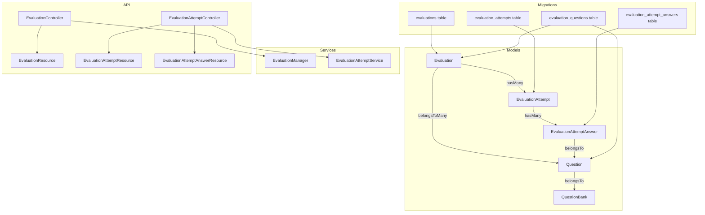
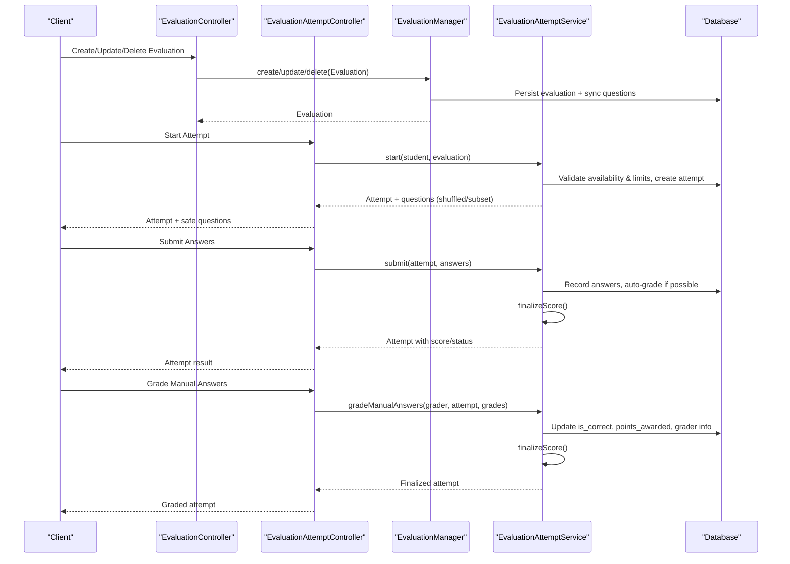
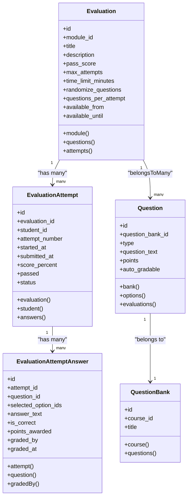
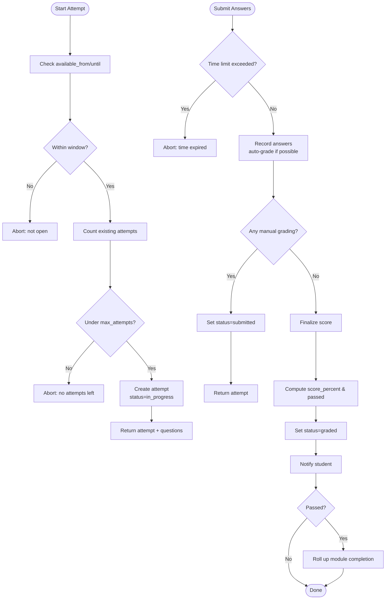
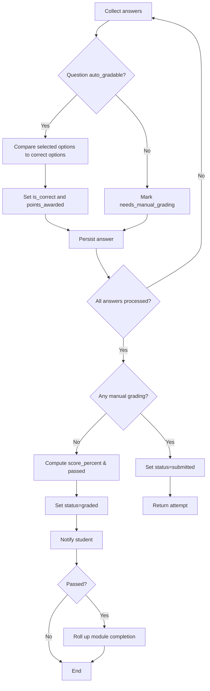
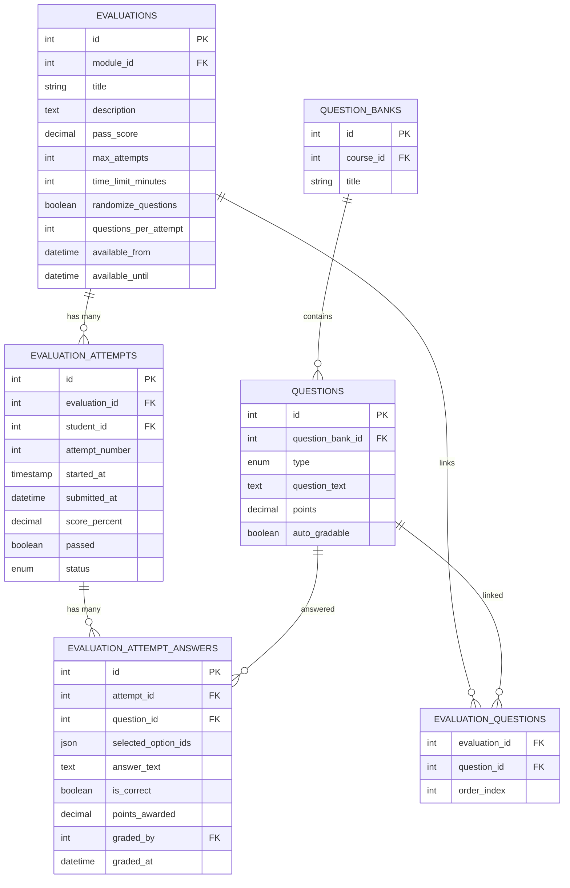
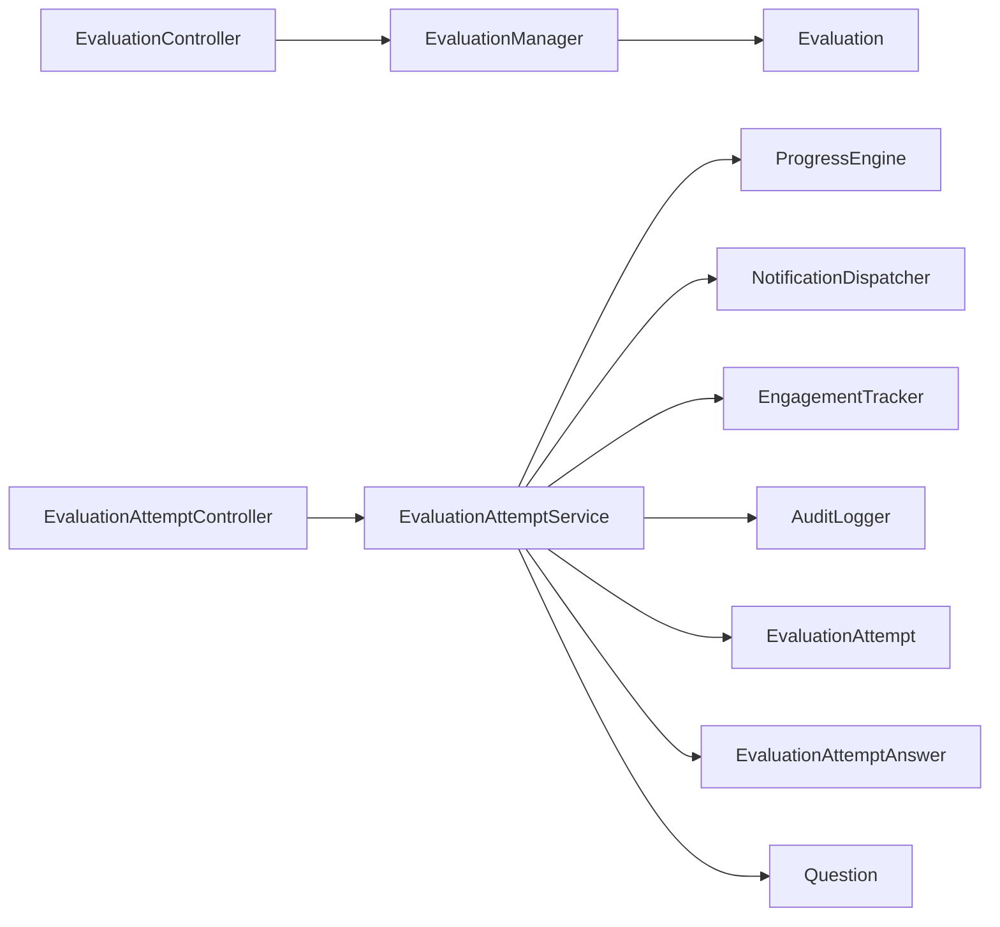

# Evaluations & Quizzes

<cite>
**Referenced Files in This Document**
- [Evaluation.php](file://app/Models/Evaluation.php)
- [EvaluationAttempt.php](file://app/Models/EvaluationAttempt.php)
- [EvaluationAttemptAnswer.php](file://app/Models/EvaluationAttemptAnswer.php)
- [Question.php](file://app/Models/Question.php)
- [QuestionBank.php](file://app/Models/QuestionBank.php)
- [EvaluationAttemptStatus.php](file://app/Enums/EvaluationAttemptStatus.php)
- [2024_01_01_000143_create_evaluations_table.php](file://database/migrations/2024_01_01_000143_create_evaluations_table.php)
- [2024_01_01_000144_create_evaluation_questions_table.php](file://database/migrations/2024_01_01_000144_create_evaluation_questions_table.php)
- [2024_01_01_000145_create_evaluation_attempts_table.php](file://database/migrations/2024_01_01_000145_create_evaluation_attempts_table.php)
- [2024_01_01_000146_create_evaluation_attempt_answers_table.php](file://database/migrations/2024_01_01_000146_create_evaluation_attempt_answers_table.php)
- [EvaluationManager.php](file://app/Services/Assessment/EvaluationManager.php)
- [EvaluationAttemptService.php](file://app/Services/Assessment/EvaluationAttemptService.php)
- [EvaluationController.php](file://app/Http/Controllers/Api/V1/EvaluationController.php)
- [EvaluationAttemptController.php](file://app/Http/Controllers/Api/V1/EvaluationAttemptController.php)
- [EvaluationResource.php](file://app/Http/Resources/EvaluationResource.php)
- [EvaluationAttemptResource.php](file://app/Http/Resources/EvaluationAttemptResource.php)
- [EvaluationAttemptAnswerResource.php](file://app/Http/Resources/EvaluationAttemptAnswerResource.php)
</cite>

## Table of Contents
1. Introduction
2. Project Structure
3. Core Components
4. Architecture Overview
5. Detailed Component Analysis
6. Dependency Analysis
7. Performance Considerations
8. Troubleshooting Guide
9. Conclusion

## Introduction
This document explains the data model and processing logic for evaluations (quizzes) and their attempts. It covers how evaluations are configured, associated with questions, how attempts are tracked, answers recorded, and scoring computed. It also details evaluation settings such as time limits, question randomization, passing scores, and attempt limits, and clarifies relationships between evaluations, attempts, answers, and question banks.

## Project Structure
The evaluation feature spans models, migrations, services, controllers, and API resources:
- Models define entities and relationships for evaluations, attempts, answers, questions, and question banks.
- Migrations define database schema for evaluations, evaluation questions, attempts, and attempt answers.
- Services implement business logic for creating/updating evaluations, starting attempts, submitting answers, grading, and finalizing scores.
- Controllers expose API endpoints to manage evaluations and attempt lifecycles.
- Resources shape API responses for clients.

**Diagram sources**
- [Evaluation.php:14-62](file://app/Models/Evaluation.php#L14-L62)
- [EvaluationAttempt.php:14-63](file://app/Models/EvaluationAttempt.php#L14-L63)
- [EvaluationAttemptAnswer.php:10-55](file://app/Models/EvaluationAttemptAnswer.php#L10-L55)
- [Question.php:15-59](file://app/Models/Question.php#L15-L59)
- [QuestionBank.php:13-40](file://app/Models/QuestionBank.php#L13-L40)
- [2024_01_01_000143_create_evaluations_table.php:11-26](file://database/migrations/2024_01_01_000143_create_evaluations_table.php#L11-L26)
- [2024_01_01_000144_create_evaluation_questions_table.php:11-18](file://database/migrations/2024_01_01_000144_create_evaluation_questions_table.php#L11-L18)
- [2024_01_01_000145_create_evaluation_attempts_table.php:11-24](file://database/migrations/2024_01_01_000145_create_evaluation_attempts_table.php#L11-L24)
- [2024_01_01_000146_create_evaluation_attempt_answers_table.php:11-23](file://database/migrations/2024_01_01_000146_create_evaluation_attempt_answers_table.php#L11-L23)
- [EvaluationManager.php:18-103](file://app/Services/Assessment/EvaluationManager.php#L18-L103)
- [EvaluationAttemptService.php:26-218](file://app/Services/Assessment/EvaluationAttemptService.php#L26-L218)
- [EvaluationController.php:16-49](file://app/Http/Controllers/Api/V1/EvaluationController.php#L16-L49)
- [EvaluationAttemptController.php:19-83](file://app/Http/Controllers/Api/V1/EvaluationAttemptController.php#L19-L83)
- [EvaluationResource.php:11-43](file://app/Http/Resources/EvaluationResource.php#L11-L43)
- [EvaluationAttemptResource.php:10-30](file://app/Http/Resources/EvaluationAttemptResource.php#L10-L30)
- [EvaluationAttemptAnswerResource.php:10-26](file://app/Http/Resources/EvaluationAttemptAnswerResource.php#L10-L26)

**Section sources**
- [Evaluation.php:14-62](file://app/Models/Evaluation.php#L14-L62)
- [EvaluationAttempt.php:14-63](file://app/Models/EvaluationAttempt.php#L14-L63)
- [EvaluationAttemptAnswer.php:10-55](file://app/Models/EvaluationAttemptAnswer.php#L10-L55)
- [Question.php:15-59](file://app/Models/Question.php#L15-L59)
- [QuestionBank.php:13-40](file://app/Models/QuestionBank.php#L13-L40)
- [2024_01_01_000143_create_evaluations_table.php:11-26](file://database/migrations/2024_01_01_000143_create_evaluations_table.php#L11-L26)
- [2024_01_01_000144_create_evaluation_questions_table.php:11-18](file://database/migrations/2024_01_01_000144_create_evaluation_questions_table.php#L11-L18)
- [2024_01_01_000145_create_evaluation_attempts_table.php:11-24](file://database/migrations/2024_01_01_000145_create_evaluation_attempts_table.php#L11-L24)
- [2024_01_01_000146_create_evaluation_attempt_answers_table.php:11-23](file://database/migrations/2024_01_01_000146_create_evaluation_attempt_answers_table.php#L11-L23)
- [EvaluationManager.php:18-103](file://app/Services/Assessment/EvaluationManager.php#L18-L103)
- [EvaluationAttemptService.php:26-218](file://app/Services/Assessment/EvaluationAttemptService.php#L26-L218)
- [EvaluationController.php:16-49](file://app/Http/Controllers/Api/V1/EvaluationController.php#L16-L49)
- [EvaluationAttemptController.php:19-83](file://app/Http/Controllers/Api/V1/EvaluationAttemptController.php#L19-L83)
- [EvaluationResource.php:11-43](file://app/Http/Resources/EvaluationResource.php#L11-L43)
- [EvaluationAttemptResource.php:10-30](file://app/Http/Resources/EvaluationAttemptResource.php#L10-L30)
- [EvaluationAttemptAnswerResource.php:10-26](file://app/Http/Resources/EvaluationAttemptAnswerResource.php#L10-L26)

## Core Components
- Evaluation: Represents a quiz or assessment with configuration such as pass score, max attempts, time limit, randomization, question subset size, and availability window. Linked to a module and many attempts; associated with questions via a pivot table that preserves order.
- EvaluationAttempt: A student’s try at an evaluation, capturing attempt number, start/submit times, status, computed score percentage, and pass/fail flag.
- EvaluationAttemptAnswer: Records each answer within an attempt, including selected options, free-text answers, correctness, points awarded, and manual grading metadata.
- Question and QuestionBank: Questions belong to question banks and can be linked to evaluations. Options determine correctness for objective types.
- EvaluationAttemptStatus: Enumerates attempt lifecycle states: in_progress, submitted, graded.

Key behaviors:
- Attempt creation enforces availability windows and attempt limits.
- Question selection supports optional randomization and per-attempt question count.
- Auto-grading for objective questions; manual grading queue for short-answer/essay.
- Final scoring computes percentage based on total vs earned points and determines pass against evaluation pass_score.

**Section sources**
- [Evaluation.php:19-61](file://app/Models/Evaluation.php#L19-L61)
- [EvaluationAttempt.php:21-62](file://app/Models/EvaluationAttempt.php#L21-L62)
- [EvaluationAttemptAnswer.php:14-54](file://app/Models/EvaluationAttemptAnswer.php#L14-L54)
- [Question.php:22-58](file://app/Models/Question.php#L22-L58)
- [QuestionBank.php:20-39](file://app/Models/QuestionBank.php#L20-L39)
- [EvaluationAttemptStatus.php:7-12](file://app/Enums/EvaluationAttemptStatus.php#L7-L12)

## Architecture Overview
The system exposes REST-like APIs to manage evaluations and run attempts. Controllers delegate to services for business rules, which interact with models and persist changes. Resources serialize data for clients.

**Diagram sources**
- [EvaluationController.php:20-49](file://app/Http/Controllers/Api/V1/EvaluationController.php#L20-L49)
- [EvaluationAttemptController.php:27-83](file://app/Http/Controllers/Api/V1/EvaluationAttemptController.php#L27-L83)
- [EvaluationManager.php:28-103](file://app/Services/Assessment/EvaluationManager.php#L28-L103)
- [EvaluationAttemptService.php:35-218](file://app/Services/Assessment/EvaluationAttemptService.php#L35-L218)

## Detailed Component Analysis

### Evaluation Model and Settings
- Fields include title, description, pass_score, max_attempts, time_limit_minutes, randomize_questions, questions_per_attempt, available_from, available_until.
- Relationships: belongsTo Module, belongsToMany Question via evaluation_questions with order_index, hasMany EvaluationAttempt.
- Settings impact behavior:
  - max_attempts: NULL means unlimited; otherwise enforced at attempt start.
  - time_limit_minutes: enforced at submission time relative to started_at.
  - randomize_questions: shuffles question order when serving questions.
  - questions_per_attempt: subsets the question set per attempt.
  - available_from/until: restricts when students can start attempts.

**Diagram sources**
- [Evaluation.php:14-62](file://app/Models/Evaluation.php#L14-L62)
- [EvaluationAttempt.php:14-63](file://app/Models/EvaluationAttempt.php#L14-L63)
- [EvaluationAttemptAnswer.php:10-55](file://app/Models/EvaluationAttemptAnswer.php#L10-L55)
- [Question.php:15-59](file://app/Models/Question.php#L15-L59)
- [QuestionBank.php:13-40](file://app/Models/QuestionBank.php#L13-L40)

**Section sources**
- [Evaluation.php:19-61](file://app/Models/Evaluation.php#L19-L61)
- [2024_01_01_000143_create_evaluations_table.php:13-25](file://database/migrations/2024_01_01_000143_create_evaluations_table.php#L13-L25)
- [2024_01_01_000144_create_evaluation_questions_table.php:13-17](file://database/migrations/2024_01_01_000144_create_evaluation_questions_table.php#L13-L17)

### Evaluation Attempts Tracking
- Attempt lifecycle:
  - Start: validates availability window and attempt limits; returns existing in-progress attempt if present; creates new attempt with incremented attempt_number and sets status to in_progress.
  - Submit: enforces time limit; records answers; auto-grades objective questions; marks status submitted if any manual grading needed; otherwise finalizes immediately.
  - Grade: allows instructors to mark correctness and points for manual items; updates grader metadata; finalizes score.
  - Finalization: calculates score_percent from earned vs total points; sets passed based on pass_score; transitions status to graded; notifies student; rolls up module completion if passed.

**Diagram sources**
- [EvaluationAttemptService.php:35-218](file://app/Services/Assessment/EvaluationAttemptService.php#L35-L218)

**Section sources**
- [EvaluationAttemptService.php:35-218](file://app/Services/Assessment/EvaluationAttemptService.php#L35-L218)
- [2024_01_01_000145_create_evaluation_attempts_table.php:13-24](file://database/migrations/2024_01_01_000145_create_evaluation_attempts_table.php#L13-L24)
- [EvaluationAttemptStatus.php:7-12](file://app/Enums/EvaluationAttemptStatus.php#L7-L12)

### Answer Recording and Scoring Mechanisms
- Answer storage captures:
  - selected_option_ids for multiple-choice or similar types.
  - answer_text for short-answer/essay.
  - is_correct and points_awarded for auto-graded items; null until manually graded for subjective items.
  - graded_by and graded_at for auditability.
- Auto-grading compares selected options to correct options for objective questions.
- Scoring:
  - totalPoints = sum of all question points in the attempt.
  - earnedPoints = sum of points_awarded across answers.
  - score_percent = round(earnedPoints / totalPoints * 100, 2).
  - passed = score_percent >= evaluation.pass_score.
- After finalization, notifications are sent and module completion may be rolled up if passed.

**Diagram sources**
- [EvaluationAttemptService.php:102-218](file://app/Services/Assessment/EvaluationAttemptService.php#L102-L218)
- [2024_01_01_000146_create_evaluation_attempt_answers_table.php:13-23](file://database/migrations/2024_01_01_000146_create_evaluation_attempt_answers_table.php#L13-L23)

**Section sources**
- [EvaluationAttemptService.php:102-218](file://app/Services/Assessment/EvaluationAttemptService.php#L102-L218)
- [EvaluationAttemptAnswer.php:14-54](file://app/Models/EvaluationAttemptAnswer.php#L14-L54)
- [2024_01_01_000146_create_evaluation_attempt_answers_table.php:13-23](file://database/migrations/2024_01_01_000146_create_evaluation_attempt_answers_table.php#L13-L23)

### Relationship Between Evaluations, Attempts, Answers, and Question Banks
- Evaluations link to questions directly via evaluation_questions with order_index to preserve sequence.
- Questions belong to question banks; evaluations can pull from banks by linking specific questions.
- Per-attempt behavior:
  - randomize_questions: shuffles the ordered list before serving.
  - questions_per_attempt: takes the first N questions from the (possibly shuffled) list.
- Attempts record answers per question; answers reference both attempt and question.

**Diagram sources**
- [2024_01_01_000143_create_evaluations_table.php:13-25](file://database/migrations/2024_01_01_000143_create_evaluations_table.php#L13-L25)
- [2024_01_01_000144_create_evaluation_questions_table.php:13-17](file://database/migrations/2024_01_01_000144_create_evaluation_questions_table.php#L13-L17)
- [2024_01_01_000145_create_evaluation_attempts_table.php:13-24](file://database/migrations/2024_01_01_000145_create_evaluation_attempts_table.php#L13-L24)
- [2024_01_01_000146_create_evaluation_attempt_answers_table.php:13-23](file://database/migrations/2024_01_01_000146_create_evaluation_attempt_answers_table.php#L13-L23)
- [Question.php:22-58](file://app/Models/Question.php#L22-L58)
- [QuestionBank.php:20-39](file://app/Models/QuestionBank.php#L20-L39)

**Section sources**
- [Evaluation.php:47-61](file://app/Models/Evaluation.php#L47-L61)
- [EvaluationAttemptService.php:83-97](file://app/Services/Assessment/EvaluationAttemptService.php#L83-L97)
- [2024_01_01_000144_create_evaluation_questions_table.php:13-17](file://database/migrations/2024_01_01_000144_create_evaluation_questions_table.php#L13-L17)

### API Surface for Evaluations and Attempts
- EvaluationController:
  - Show, Store, Update, Delete evaluations with authorization checks.
  - Delegates to EvaluationManager for persistence and question synchronization.
- EvaluationAttemptController:
  - Index: lists attempts for grading (instructor/admin).
  - Start: starts/resumes attempt, returns safe question view.
  - Show: retrieves attempt with answers.
  - Submit: submits answers and triggers grading/finalization.
  - Grade: applies manual grades and finalizes.
- Resources:
  - EvaluationResource serializes evaluation fields and links to module item properties.
  - EvaluationAttemptResource serializes attempt metadata and answers.
  - EvaluationAttemptAnswerResource serializes answer details.

**Section sources**
- [EvaluationController.php:16-49](file://app/Http/Controllers/Api/V1/EvaluationController.php#L16-L49)
- [EvaluationAttemptController.php:19-83](file://app/Http/Controllers/Api/V1/EvaluationAttemptController.php#L19-L83)
- [EvaluationResource.php:11-43](file://app/Http/Resources/EvaluationResource.php#L11-L43)
- [EvaluationAttemptResource.php:10-30](file://app/Http/Resources/EvaluationAttemptResource.php#L10-L30)
- [EvaluationAttemptAnswerResource.php:10-26](file://app/Http/Resources/EvaluationAttemptAnswerResource.php#L10-L26)

## Dependency Analysis
- EvaluationManager depends on Evaluation and ModuleItem to persist evaluation configurations and maintain module ordering.
- EvaluationAttemptService depends on:
  - ProgressEngine to roll up module completion upon passing.
  - NotificationDispatcher to notify students of grades.
  - EngagementTracker to log quiz attempts.
  - AuditLogger to record grade changes.
- Controllers depend on services for business logic and on policies for authorization.
- Models depend on enums for typed state and casts for consistent data handling.

**Diagram sources**
- [EvaluationController.php:16-49](file://app/Http/Controllers/Api/V1/EvaluationController.php#L16-L49)
- [EvaluationAttemptController.php:19-83](file://app/Http/Controllers/Api/V1/EvaluationAttemptController.php#L19-L83)
- [EvaluationManager.php:18-103](file://app/Services/Assessment/EvaluationManager.php#L18-L103)
- [EvaluationAttemptService.php:26-218](file://app/Services/Assessment/EvaluationAttemptService.php#L26-L218)

**Section sources**
- [EvaluationManager.php:18-103](file://app/Services/Assessment/EvaluationManager.php#L18-L103)
- [EvaluationAttemptService.php:26-218](file://app/Services/Assessment/EvaluationAttemptService.php#L26-L218)

## Performance Considerations
- Question retrieval uses eager loading of options to minimize queries during question serving.
- Randomization and subsetting occur in memory; ensure evaluation question counts remain manageable.
- Scoring aggregates sums over answers; consider indexing on attempt_id and question_id for large datasets.
- Time limit checks are simple arithmetic comparisons; avoid repeated recalculations by caching started_at where appropriate.
- Batch operations like syncing questions use efficient bulk operations via Laravel’s sync method.

[No sources needed since this section provides general guidance]

## Troubleshooting Guide
Common issues and resolutions:
- Cannot start evaluation:
  - Ensure current time falls within available_from and available_until.
  - Verify max_attempts is not exceeded; check existing attempts count.
- Submission rejected due to time limit:
  - Confirm time_limit_minutes is set and compute deadline from started_at.
- Answers not graded:
  - For non-auto_gradable questions, status will be submitted; require manual grading.
  - Use grade endpoint to set is_correct and points_awarded; finalization occurs after grading.
- Score appears incorrect:
  - Verify question points and points_awarded values.
  - Ensure totalPoints calculation includes all attempted questions.
- Module completion not updated:
  - Only passes trigger rollup; verify score_percent meets pass_score threshold.

**Section sources**
- [EvaluationAttemptService.php:35-218](file://app/Services/Assessment/EvaluationAttemptService.php#L35-L218)
- [EvaluationAttemptController.php:27-83](file://app/Http/Controllers/Api/V1/EvaluationAttemptController.php#L27-L83)

## Conclusion
The evaluation system provides robust support for quizzes with configurable settings, attempt management, flexible question selection, and mixed auto/manual grading. The data model cleanly separates concerns across evaluations, attempts, answers, and questions, while services enforce business rules and integrate with progress tracking and notifications. This design enables scalable assessments with clear audit trails and reliable scoring.

[No sources needed since this section summarizes without analyzing specific files]