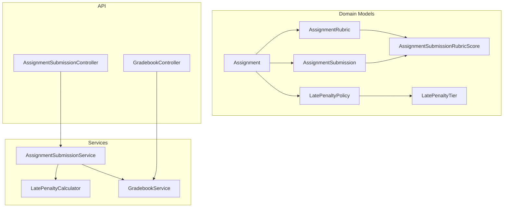
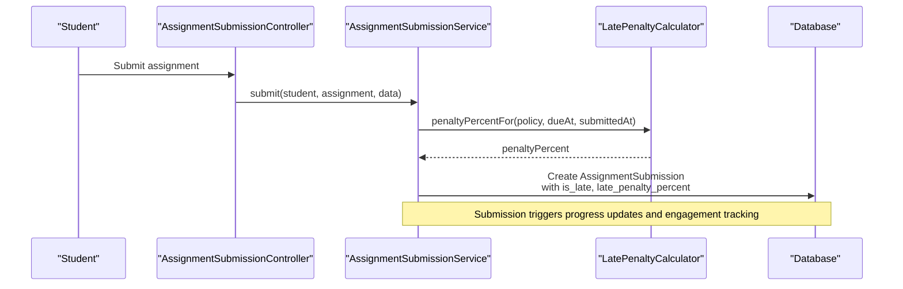
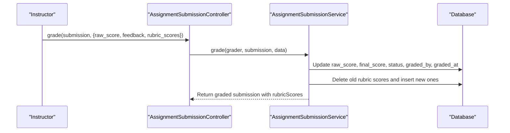
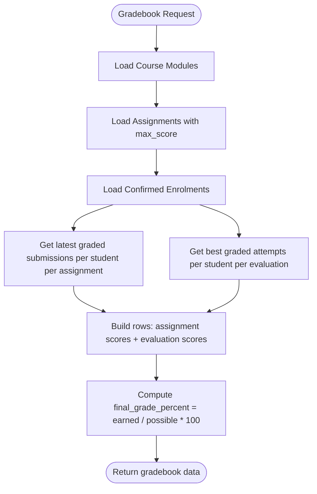
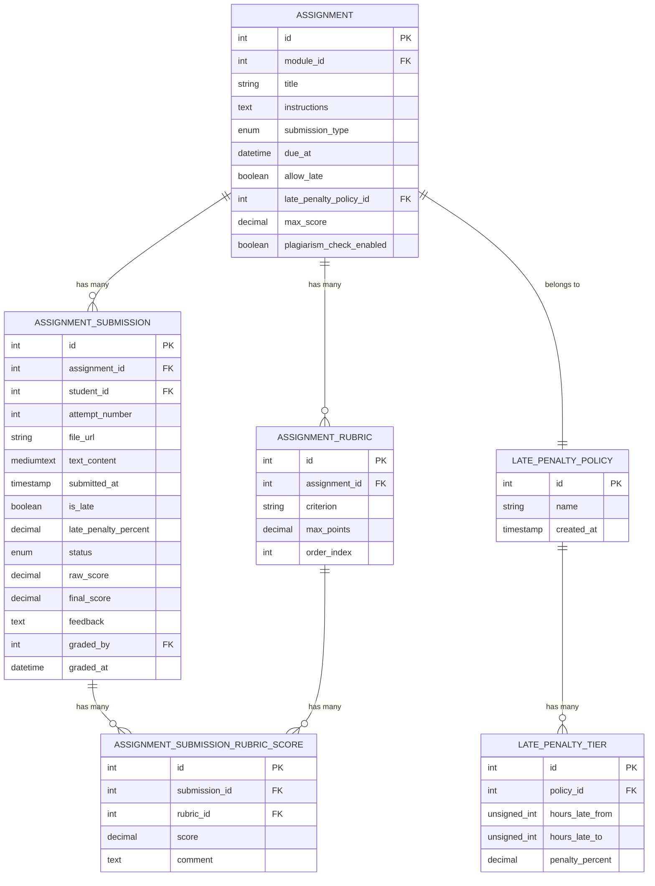
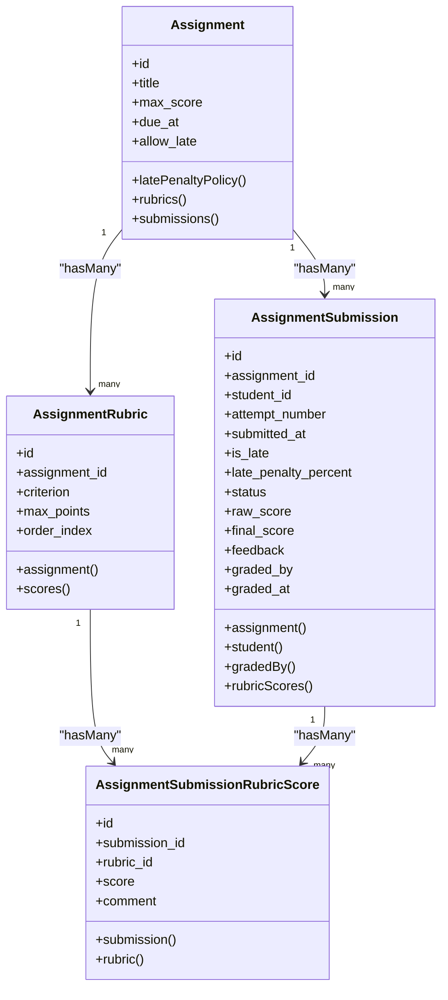
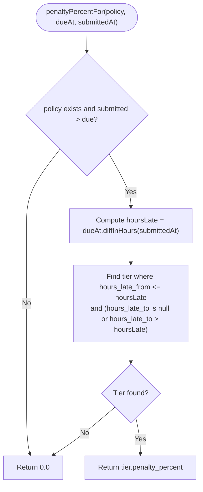
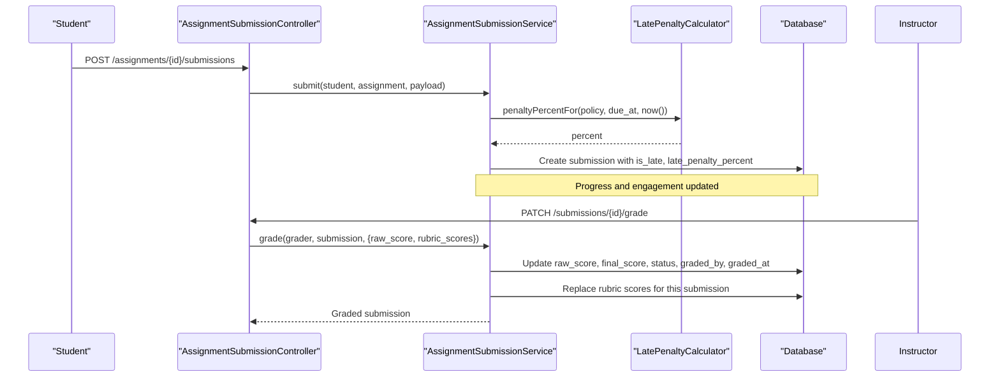
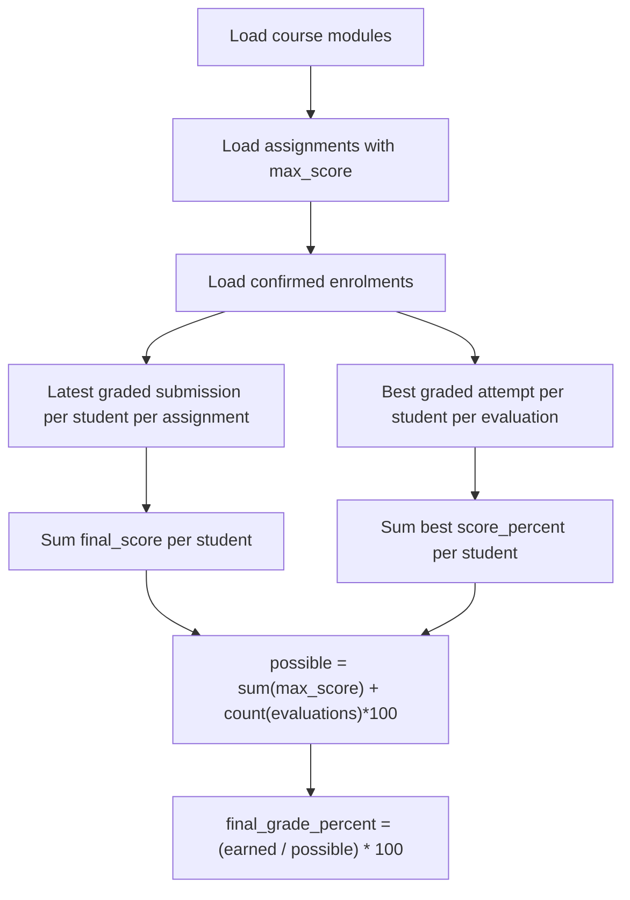
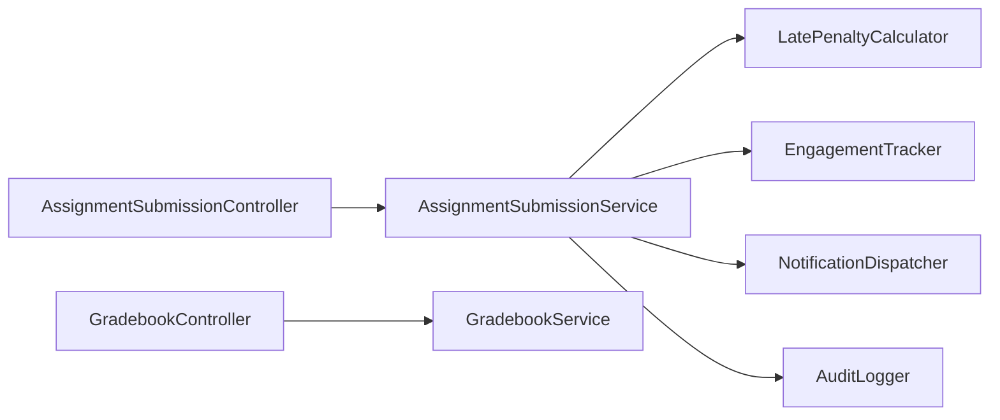

# Grading & Rubrics

<cite>
**Referenced Files in This Document**
- [Assignment.php](file://app/Models/Assignment.php)
- [AssignmentRubric.php](file://app/Models/AssignmentRubric.php)
- [AssignmentSubmission.php](file://app/Models/AssignmentSubmission.php)
- [AssignmentSubmissionRubricScore.php](file://app/Models/AssignmentSubmissionRubricScore.php)
- [LatePenaltyPolicy.php](file://app/Models/LatePenaltyPolicy.php)
- [LatePenaltyTier.php](file://app/Models/LatePenaltyTier.php)
- [LatePenaltyCalculator.php](file://app\Services/Assessment/LatePenaltyCalculator.php)
- [AssignmentSubmissionService.php](file://app\Services/Assessment/AssignmentSubmissionService.php)
- [GradebookService.php](file://app/services/Assessment/GradebookService.php)
- [AssignmentSubmissionController.php](file://app/Http/Controllers/Api/V1/AssignmentSubmissionController.php)
- [GradebookController.php](file://app/Http/Controllers/Api/V1/GradebookController.php)
- [2024_01_01_000130_create_late_penalty_policies_table.php](file://database/migrations/2024_01_01_000130_create_late_penalty_policies_table.php)
- [2024_01_01_000131_create_late_penalty_tiers_table.php](file://database/migrations/2024_01_01_000131_create_late_penalty_tiers_table.php)
- [2024_01_01_000132_create_assignments_table.php](file://database/migrations/2024_01_01_000132_create_assignments_table.php)
- [2024_01_01_000133_create_assignment_rubrics_table.php](file://database/migrations/2024_01_01_000133_create_assignment_rubrics_table.php)
- [2024_01_01_000134_create_assignment_submissions_table.php](file://database/migrations/2024_01_01_000134_create_assignment_submissions_table.php)
- [2024_01_01_000135_create_assignment_submission_rubric_scores_table.php](file://database/migrations/2024_01_01_000135_create_assignment_submission_rubric_scores_table.php)
</cite>

## Table of Contents
1. Introduction
2. Project Structure
3. Core Components
4. Architecture Overview
5. Detailed Component Analysis
6. Dependency Analysis
7. Performance Considerations
8. Troubleshooting Guide
9. Conclusion

## Introduction
This document explains the grading system’s data model and workflows for rubric-based assignment grading, per-submission rubric scores, and late penalty policies. It covers how assignments define grading criteria via rubrics, how instructors score submissions against those criteria, how late penalties are computed from configurable tiers, and how final grades are derived for reporting.

## Project Structure
The grading system is implemented as a set of Eloquent models, services, controllers, and database migrations:
- Models define entities such as Assignment, AssignmentRubric, AssignmentSubmission, AssignmentSubmissionRubricScore, LatePenaltyPolicy, and LatePenaltyTier.
- Services encapsulate business logic for submission handling, grading, late penalty calculation, and gradebook aggregation.
- Controllers expose API endpoints for submitting work and grading.
- Migrations define the persistent schema for all entities and relationships.

**Diagram sources**
- [Assignment.php:14-70](file://app/Models/Assignment.php#L14-L70)
- [AssignmentRubric.php:13-46](file://app/Models/AssignmentRubric.php#L13-L46)
- [AssignmentSubmission.php:15-88](file://app/Models/AssignmentSubmission.php#L15-L88)
- [AssignmentSubmissionRubricScore.php:10-40](file://app/Models/AssignmentSubmissionRubricScore.php#L10-L40)
- [LatePenaltyPolicy.php:12-38](file://app/Models/LatePenaltyPolicy.php#L12-L38)
- [LatePenaltyTier.php:12-37](file://app/Models/LatePenaltyTier.php#L12-L37)
- [LatePenaltyCalculator.php:15-35](file://app/Services/Assessment/LatePenaltyCalculator.php#L15-L35)
- [AssignmentSubmissionService.php:24-116](file://app/Services/Assessment/AssignmentSubmissionService.php#L24-L116)
- [GradebookService.php:18-120](file://app/services/Assessment/GradebookService.php#L18-L120)
- [AssignmentSubmissionController.php:19-58](file://app/Http/Controllers/Api/V1/AssignmentSubmissionController.php#L19-L58)
- [GradebookController.php:12-22](file://app/Http/Controllers/Api/V1/GradebookController.php#L12-L22)

**Section sources**
- [Assignment.php:14-70](file://app/Models/Assignment.php#L14-L70)
- [AssignmentRubric.php:13-46](file://app/Models/AssignmentRubric.php#L13-L46)
- [AssignmentSubmission.php:15-88](file://app/Models/AssignmentSubmission.php#L15-L88)
- [AssignmentSubmissionRubricScore.php:10-40](file://app/Models/AssignmentSubmissionRubricScore.php#L10-L40)
- [LatePenaltyPolicy.php:12-38](file://app/Models/LatePenaltyPolicy.php#L12-L38)
- [LatePenaltyTier.php:12-37](file://app/Models/LatePenaltyTier.php#L12-L37)
- [LatePenaltyCalculator.php:15-35](file://app/Services/Assessment/LatePenaltyCalculator.php#L15-L35)
- [AssignmentSubmissionService.php:24-116](file://app/Services/Assessment/AssignmentSubmissionService.php#L24-L116)
- [GradebookService.php:18-120](file://app/services/Assessment/GradebookService.php#L18-L120)
- [AssignmentSubmissionController.php:19-58](file://app/Http/Controllers/Api/V1/AssignmentSubmissionController.php#L19-L58)
- [GradebookController.php:12-22](file://app/Http/Controllers/Api/V1/GradebookController.php#L12-L22)

## Core Components
- Assignment: Defines an assignable task with due date, max score, and optional late policy.
- AssignmentRubric: Defines grading criteria (criterion) and maximum points per criterion for an assignment.
- AssignmentSubmission: Represents a student’s attempt, including whether it was late, the applied penalty percentage, raw score, and final score after penalty.
- AssignmentSubmissionRubricScore: Records per-criterion scores and comments for a specific submission.
- LatePenaltyPolicy and LatePenaltyTier: Define time-based deduction bands (e.g., hours late ranges and corresponding percentages).
- LatePenaltyCalculator: Computes the applicable penalty percentage based on due time, submission time, and configured tiers.
- AssignmentSubmissionService: Orchestrates submission creation, late penalty computation, grading, rubric score persistence, notifications, and audit logging.
- GradebookService: Aggregates assignment scores and evaluation attempts to compute per-student final grade percentages.

Key behaviors:
- Rubrics provide structured criteria; each submission can have one score per rubric criterion.
- Late penalties are automatically calculated at submission time and stored on the submission record.
- Final score equals raw score adjusted by the stored late penalty percent.
- The gradebook sums assignment final scores and evaluation best attempts to produce a course-level final grade percentage.

**Section sources**
- [Assignment.php:19-69](file://app/Models/Assignment.php#L19-L69)
- [AssignmentRubric.php:20-45](file://app/Models/AssignmentRubric.php#L20-L45)
- [AssignmentSubmission.php:22-87](file://app/Models/AssignmentSubmission.php#L22-L87)
- [AssignmentSubmissionRubricScore.php:14-39](file://app/Models/AssignmentSubmissionRubricScore.php#L14-L39)
- [LatePenaltyPolicy.php:19-37](file://app/Models/LatePenaltyPolicy.php#L19-L37)
- [LatePenaltyTier.php:19-36](file://app/Models/LatePenaltyTier.php#L19-L36)
- [LatePenaltyCalculator.php:17-34](file://app/Services/Assessment/LatePenaltyCalculator.php#L17-L34)
- [AssignmentSubmissionService.php:37-115](file://app/Services/Assessment/AssignmentSubmissionService.php#L37-L115)
- [GradebookService.php:31-119](file://app/services/Assessment/GradebookService.php#L31-L119)

## Architecture Overview
The grading workflow spans API controllers, domain services, and models. Students submit work; the system computes late penalties immediately. Instructors later grade submissions, optionally providing per-criterion rubric scores. The gradebook aggregates results into a final percentage.

**Diagram sources**
- [AssignmentSubmissionController.php:38-49](file://app/Http/Controllers/Api/V1/AssignmentSubmissionController.php#L38-L49)
- [AssignmentSubmissionService.php:37-67](file://app/Services/Assessment/AssignmentSubmissionService.php#L37-L67)
- [LatePenaltyCalculator.php:17-34](file://app/Services/Assessment/LatePenaltyCalculator.php#L17-L34)

**Diagram sources**
- [AssignmentSubmissionController.php:52-57](file://app/Http/Controllers/Api/V1/AssignmentSubmissionController.php#L52-L57)
- [AssignmentSubmissionService.php:72-115](file://app/Services/Assessment/AssignmentSubmissionService.php#L72-L115)

**Diagram sources**
- [GradebookController.php:16-21](file://app/Http/Controllers/Api/V1/GradebookController.php#L16-L21)
- [GradebookService.php:31-119](file://app/services/Assessment/GradebookService.php#L31-L119)

## Detailed Component Analysis

### Data Model: Entities and Relationships

**Diagram sources**
- [2024_01_01_000132_create_assignments_table.php:13-25](file://database/migrations/2024_01_01_000132_create_assignments_table.php#L13-L25)
- [2024_01_01_000133_create_assignment_rubrics_table.php:13-19](file://database/migrations/2024_01_01_000133_create_assignment_rubrics_table.php#L13-L19)
- [2024_01_01_000134_create_assignment_submissions_table.php:13-32](file://database/migrations/2024_01_01_000134_create_assignment_submissions_table.php#L13-L32)
- [2024_01_01_000135_create_assignment_submission_rubric_scores_table.php:13-20](file://database/migrations/2024_01_01_000135_create_assignment_submission_rubric_scores_table.php#L13-L20)
- [2024_01_01_000130_create_late_penalty_policies_table.php:13-17](file://database/migrations/2024_01_01_000130_create_late_penalty_policies_table.php#L13-L17)
- [2024_01_01_000131_create_late_penalty_tiers_table.php:13-19](file://database/migrations/2024_01_01_000131_create_late_penalty_tiers_table.php#L13-L19)

**Section sources**
- [2024_01_01_000132_create_assignments_table.php:13-25](file://database/migrations/2024_01_01_000132_create_assignments_table.php#L13-L25)
- [2024_01_01_000133_create_assignment_rubrics_table.php:13-19](file://database/migrations/2024_01_01_000133_create_assignment_rubrics_table.php#L13-L19)
- [2024_01_01_000134_create_assignment_submissions_table.php:13-32](file://database/migrations/2024_01_01_000134_create_assignment_submissions_table.php#L13-L32)
- [2024_01_01_000135_create_assignment_submission_rubric_scores_table.php:13-20](file://database/migrations/2024_01_01_000135_create_assignment_submission_rubric_scores_table.php#L13-L20)
- [2024_01_01_000130_create_late_penalty_policies_table.php:13-17](file://database/migrations/2024_01_01_000130_create_late_penalty_policies_table.php#L13-L17)
- [2024_01_01_000131_create_late_penalty_tiers_table.php:13-19](file://database/migrations/2024_01_01_000131_create_late_penalty_tiers_table.php#L13-L19)

### Rubrics and Rubric Scores
- AssignmentRubric defines criteria and maximum points per criterion for an assignment.
- AssignmentSubmissionRubricScore records the actual score and optional comment for each criterion on a specific submission.
- During grading, existing rubric scores for a submission are removed and replaced with the instructor-provided scores.

**Diagram sources**
- [Assignment.php:42-69](file://app/Models/Assignment.php#L42-L69)
- [AssignmentRubric.php:34-45](file://app/Models/AssignmentRubric.php#L34-L45)
- [AssignmentSubmission.php:52-79](file://app/Models/AssignmentSubmission.php#L52-L79)
- [AssignmentSubmissionRubricScore.php:28-39](file://app/Models/AssignmentSubmissionRubricScore.php#L28-L39)

**Section sources**
- [AssignmentRubric.php:20-45](file://app/Models/AssignmentRubric.php#L20-L45)
- [AssignmentSubmissionRubricScore.php:14-39](file://app/Models/AssignmentSubmissionRubricScore.php#L14-L39)
- [AssignmentSubmissionService.php:87-96](file://app/Services/Assessment/AssignmentSubmissionService.php#L87-L96)

### Late Penalty Policies and Tier Calculations
- LatePenaltyPolicy groups one or more LatePenaltyTier entries that define hour ranges and corresponding penalty percentages.
- LatePenaltyCalculator determines the applicable tier based on hours late between due_at and submitted_at and returns the penalty percentage.
- At submission time, the service calculates and stores the penalty percentage on the submission.

**Diagram sources**
- [LatePenaltyCalculator.php:17-34](file://app/Services/Assessment/LatePenaltyCalculator.php#L17-L34)
- [LatePenaltyTier.php:19-28](file://app/Models/LatePenaltyTier.php#L19-L28)

**Section sources**
- [LatePenaltyPolicy.php:19-37](file://app/Models/LatePenaltyPolicy.php#L19-L37)
- [LatePenaltyTier.php:19-36](file://app/Models/LatePenaltyTier.php#L19-L36)
- [LatePenaltyCalculator.php:17-34](file://app/Services/Assessment/LatePenaltyCalculator.php#L17-L34)
- [AssignmentSubmissionService.php:37-67](file://app/Services/Assessment/AssignmentSubmissionService.php#L37-L67)

### Grading Workflow: From Submission to Final Score
- Students submit work; the system marks it as submitted and computes any late penalty.
- Instructors grade submissions by providing a raw score and optional rubric scores per criterion.
- Final score is computed as raw_score adjusted by the stored late_penalty_percent.
- Notifications and audit logs are recorded upon grading.

**Diagram sources**
- [AssignmentSubmissionController.php:38-57](file://app/Http/Controllers/Api/V1/AssignmentSubmissionController.php#L38-L57)
- [AssignmentSubmissionService.php:37-115](file://app/Services/Assessment/AssignmentSubmissionService.php#L37-L115)
- [LatePenaltyCalculator.php:17-34](file://app/Services/Assessment/LatePenaltyCalculator.php#L17-L34)

**Section sources**
- [AssignmentSubmissionController.php:38-57](file://app/Http/Controllers/Api/V1/AssignmentSubmissionController.php#L38-L57)
- [AssignmentSubmissionService.php:37-115](file://app/Services/Assessment/AssignmentSubmissionService.php#L37-L115)

### Final Grade Computation in the Gradebook
- The gradebook aggregates per-student assignment final scores and best evaluation attempts.
- Final grade percent is computed as total earned points divided by total possible points across assignments and evaluations.

**Diagram sources**
- [GradebookService.php:31-119](file://app/services/Assessment/GradebookService.php#L31-L119)

**Section sources**
- [GradebookService.php:31-119](file://app/services/Assessment/GradebookService.php#L31-L119)

## Dependency Analysis
- AssignmentSubmissionService depends on LatePenaltyCalculator for penalty computation, and interacts with progress, notification, engagement, and audit services.
- AssignmentSubmissionController depends on AssignmentSubmissionService and MediaStorageService for storing files and returning resources.
- GradebookController depends on GradebookService to aggregate scores.
- Models form a clear relational graph with foreign keys enforced by migrations.

**Diagram sources**
- [AssignmentSubmissionController.php:21-24](file://app/Http/Controllers/Api/V1/AssignmentSubmissionController.php#L21-L24)
- [AssignmentSubmissionService.php:26-32](file://app/Services/Assessment/AssignmentSubmissionService.php#L26-L32)
- [GradebookController.php:14-14](file://app/Http/Controllers/Api/V1/GradebookController.php#L14-L14)

**Section sources**
- [AssignmentSubmissionController.php:21-24](file://app/Http/Controllers/Api/V1/AssignmentSubmissionController.php#L21-L24)
- [AssignmentSubmissionService.php:26-32](file://app/Services/Assessment/AssignmentSubmissionService.php#L26-L32)
- [GradebookController.php:14-14](file://app/Http/Controllers/Api/V1/GradebookController.php#L14-L14)

## Performance Considerations
- Late penalty calculation queries only the relevant policy tiers and uses ordering to pick the most appropriate tier; ensure indexes on policy_id and hours_late_from/hours_late_to for large datasets.
- Grading replaces rubric scores in a transaction to avoid partial updates and maintain consistency.
- Gradebook queries group and map collections in memory; consider pagination or materialized views if courses have very large enrolment sets.

[No sources needed since this section provides general guidance]

## Troubleshooting Guide
Common issues and checks:
- Missing late penalty: Verify the assignment has a late_penalty_policy_id and that due_at is set; confirm the policy contains at least one tier covering the hours late.
- Incorrect final score: Ensure raw_score is provided during grading and that late_penalty_percent is correctly set at submission time.
- Duplicate rubric scores: The unique constraint on submission_id and rubric_id prevents duplicates; regrading deletes previous scores before inserting new ones.
- Gradebook shows zero: Confirm submissions have final_score set and evaluations have graded attempts; check enrolment status is confirmed.

**Section sources**
- [AssignmentSubmissionService.php:72-115](file://app/Services/Assessment/AssignmentSubmissionService.php#L72-L115)
- [2024_01_01_000135_create_assignment_submission_rubric_scores_table.php:13-20](file://database/migrations/2024_01_01_000135_create_assignment_submission_rubric_scores_table.php#L13-L20)
- [GradebookService.php:31-119](file://app/services/Assessment/GradebookService.php#L31-L119)

## Conclusion
The grading system combines structured rubrics, per-submission scoring, and configurable late penalties to produce accurate final scores and a comprehensive gradebook view. Rubrics enable detailed feedback per criterion, while late penalty tiers enforce consistent deductions. The service layer centralizes business rules, ensuring reliable computation and consistent state transitions across submission and grading workflows.