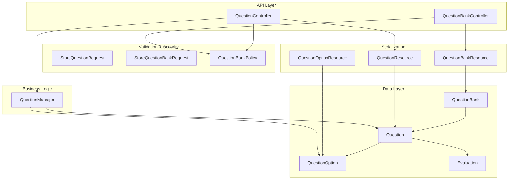
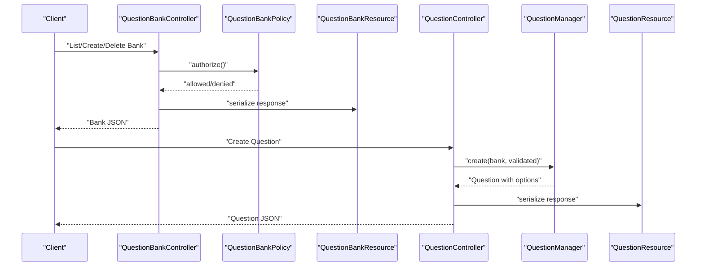
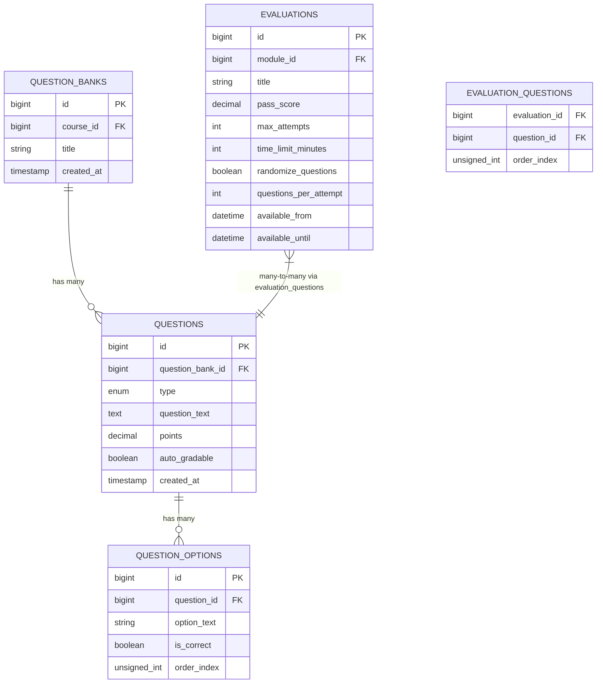
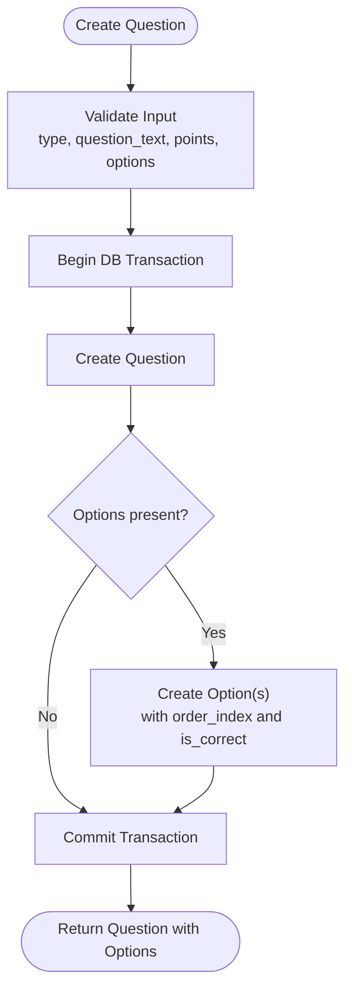
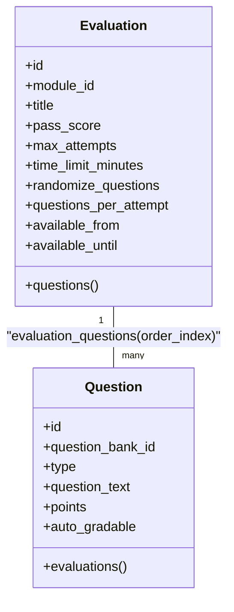
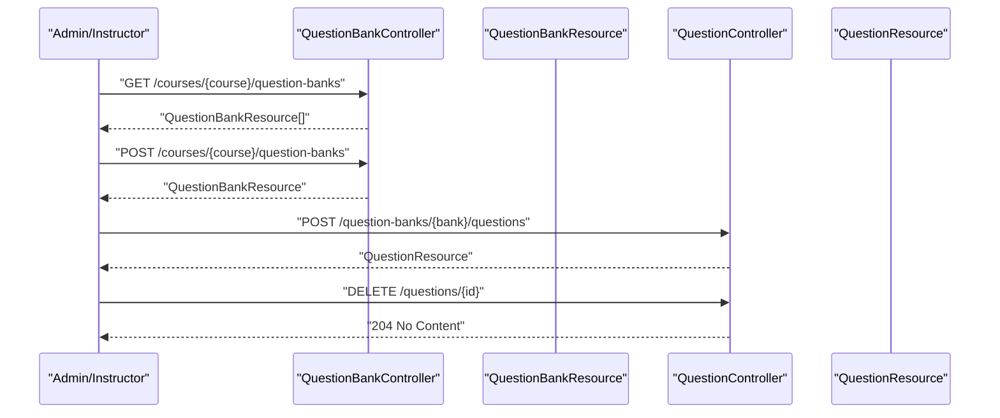
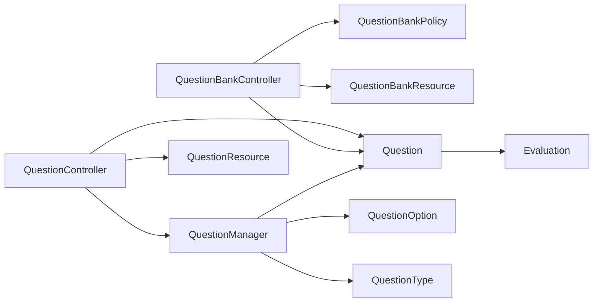

# Question Banks & Questions

<cite>
**Referenced Files in This Document**
- [QuestionBank.php](file://app/Models/QuestionBank.php)
- [Question.php](file://app/Models/Question.php)
- [QuestionOption.php](file://app/Models/QuestionOption.php)
- [QuestionType.php](file://app/Enums/QuestionType.php)
- [2024_01_01_000140_create_question_banks_table.php](file://database/migrations/2024_01_01_000140_create_question_banks_table.php)
- [2024_01_01_000141_create_questions_table.php](file://database/migrations/2024_01_01_000141_create_questions_table.php)
- [2024_01_01_000142_create_question_options_table.php](file://database/migrations/2024_01_01_000142_create_question_options_table.php)
- [2024_01_01_000144_create_evaluation_questions_table.php](file://database/migrations/2024_01_01_000144_create_evaluation_questions_table.php)
- [Evaluation.php](file://app/Models/Evaluation.php)
- [QuestionBankController.php](file://app/Http/Controllers/Api/V1/QuestionBankController.php)
- [QuestionController.php](file://app/Http/Controllers/Api/V1/QuestionController.php)
- [QuestionManager.php](file://app/Services/Assessment/QuestionManager.php)
- [StoreQuestionRequest.php](file://app/Http/Requests/Api/V1/StoreQuestionRequest.php)
- [StoreQuestionBankRequest.php](file://app/Http/Requests/Api/V1/StoreQuestionBankRequest.php)
- [QuestionBankResource.php](file://app/Http/Resources/QuestionBankResource.php)
- [QuestionResource.php](file://app/Http/Resources/QuestionResource.php)
- [QuestionOptionResource.php](file://app/Http/Resources/QuestionOptionResource.php)
- [QuestionBankPolicy.php](file://app/Policies/QuestionBankPolicy.php)
- [QuestionFactory.php](file://database/factories/QuestionFactory.php)
- [QuestionOptionFactory.php](file://database/factories/QuestionOptionFactory.php)
</cite>

## Table of Contents
1. [Introduction](#introduction)
2. [Project Structure](#project-structure)
3. [Core Components](#core-components)
4. [Architecture Overview](#architecture-overview)
5. [Detailed Component Analysis](#detailed-component-analysis)
6. [Dependency Analysis](#dependency-analysis)
7. [Performance Considerations](#performance-considerations)
8. [Troubleshooting Guide](#troubleshooting-guide)
9. [Conclusion](#conclusion)

## Introduction
This document describes the data model and integration points for question banks, questions, and answer options used to build assessments. It explains how questions are organized into course-scoped banks, how different question types are represented, how difficulty is modeled (or not), and how questions are reused across evaluations. It also covers validation rules, option management, and security considerations around exposing answer keys.

## Project Structure
The question system spans models, migrations, controllers, services, request validators, resources, policies, and factories:
- Models define entities and relationships between QuestionBank, Question, QuestionOption, and Evaluation.
- Migrations define database schema and constraints.
- Controllers expose API endpoints for managing banks and questions.
- Services encapsulate business logic for creating and deleting questions.
- Request classes enforce input validation and authorization.
- Resources serialize data for API responses.
- Policies control access based on user roles and course ownership.
- Factories generate test data.

**Diagram sources**
- [QuestionBankController.php:17-38](file://app/Http/Controllers/Api/V1/QuestionBankController.php#L17-L38)
- [QuestionController.php:19-33](file://app/Http/Controllers/Api/V1/QuestionController.php#L19-L33)
- [QuestionManager.php:24-53](file://app/Services/Assessment/QuestionManager.php#L24-L53)
- [QuestionBankResource.php:15-23](file://app/Http/Resources/QuestionBankResource.php#L15-L23)
- [QuestionResource.php:15-25](file://app/Http/Resources/QuestionResource.php#L15-L25)
- [QuestionOptionResource.php:20-27](file://app/Http/Resources/QuestionOptionResource.php#L20-L27)
- [QuestionBankPolicy.php:14-37](file://app/Policies/QuestionBankPolicy.php#L14-L37)
- [Question.php:39-58](file://app/Models/Question.php#L39-L58)
- [QuestionBank.php:28-39](file://app/Models/QuestionBank.php#L28-L39)
- [QuestionOption.php:30-36](file://app/Models/QuestionOption.php#L30-L36)
- [Evaluation.php:47-53](file://app/Models/Evaluation.php#L47-L53)

**Section sources**
- [QuestionBank.php:13-39](file://app/Models/QuestionBank.php#L13-L39)
- [Question.php:15-59](file://app/Models/Question.php#L15-L59)
- [QuestionOption.php:12-36](file://app/Models/QuestionOption.php#L12-L36)
- [QuestionBankController.php:17-38](file://app/Http/Controllers/Api/V1/QuestionBankController.php#L17-L38)
- [QuestionController.php:19-33](file://app/Http/Controllers/Api/V1/QuestionController.php#L19-L33)
- [QuestionManager.php:24-53](file://app/Services/Assessment/QuestionManager.php#L24-L53)
- [StoreQuestionRequest.php:22-31](file://app/Http/Requests/Api/V1/StoreQuestionRequest.php#L22-L31)
- [StoreQuestionBankRequest.php:17-22](file://app/Http/Requests/Api/V1/StoreQuestionBankRequest.php#L17-L22)
- [QuestionBankResource.php:15-23](file://app/Http/Resources/QuestionBankResource.php#L15-L23)
- [QuestionResource.php:15-25](file://app/Http/Resources/QuestionResource.php#L15-L25)
- [QuestionOptionResource.php:20-27](file://app/Http/Resources/QuestionOptionResource.php#L20-L27)
- [QuestionBankPolicy.php:14-37](file://app/Policies/QuestionBankPolicy.php#L14-L37)

## Core Components
- QuestionBank: A course-scoped container for questions. Owned by a Course and contains many Questions.
- Question: Represents an assessment item with a type from a strict enum, text, point value, and auto-grading flag. Belongs to a bank and can be linked to multiple Evaluations via a pivot table that preserves order.
- QuestionOption: Answer choices attached to a Question, including correctness flag and display order.
- Evaluation: Links to many Questions through a join table that records the order of questions per evaluation.

Key behaviors:
- Auto-grading is derived from question type; manual grading is required for short answer and essay types.
- Options are created in a transaction when a question is created.
- Authorization ensures only admins or instructors teaching the course can manage banks and questions.

**Section sources**
- [QuestionBank.php:13-39](file://app/Models/QuestionBank.php#L13-L39)
- [Question.php:15-59](file://app/Models/Question.php#L15-L59)
- [QuestionOption.php:12-36](file://app/Models/QuestionOption.php#L12-L36)
- [Evaluation.php:14-63](file://app/Models/Evaluation.php#L14-L63)
- [QuestionType.php:7-14](file://app/Enums/QuestionType.php#L7-L14)
- [QuestionManager.php:24-53](file://app/Services/Assessment/QuestionManager.php#L24-L53)
- [QuestionBankPolicy.php:14-37](file://app/Policies/QuestionBankPolicy.php#L14-L37)

## Architecture Overview
The system separates concerns across layers:
- API layer exposes endpoints for listing/creating/deleting banks and creating/deleting questions.
- Service layer enforces business rules such as deriving auto-grading from type and atomically creating options.
- Validation layer restricts inputs and requires options for certain question types.
- Policy layer gates operations by role and course ownership.
- Resource layer serializes data, carefully controlling exposure of answer keys.

**Diagram sources**
- [QuestionBankController.php:17-38](file://app/Http/Controllers/Api/V1/QuestionBankController.php#L17-L38)
- [QuestionBankPolicy.php:14-37](file://app/Policies/QuestionBankPolicy.php#L14-L37)
- [QuestionBankResource.php:15-23](file://app/Http/Resources/QuestionBankResource.php#L15-L23)
- [QuestionController.php:19-33](file://app/Http/Controllers/Api/V1/QuestionController.php#L19-L33)
- [QuestionManager.php:24-53](file://app/Services/Assessment/QuestionManager.php#L24-L53)
- [QuestionResource.php:15-25](file://app/Http/Resources/QuestionResource.php#L15-L25)

## Detailed Component Analysis

### Data Model Relationships

**Diagram sources**
- [2024_01_01_000140_create_question_banks_table.php:13-18](file://database/migrations/2024_01_01_000140_create_question_banks_table.php#L13-L18)
- [2024_01_01_000141_create_questions_table.php:13-21](file://database/migrations/2024_01_01_000141_create_questions_table.php#L13-L21)
- [2024_01_01_000142_create_question_options_table.php:13-19](file://database/migrations/2024_01_01_000142_create_question_options_table.php#L13-L19)
- [2024_01_01_000144_create_evaluation_questions_table.php:13-18](file://database/migrations/2024_01_01_000144_create_evaluation_questions_table.php#L13-L18)
- [Evaluation.php:19-30](file://app/Models/Evaluation.php#L19-L30)

**Section sources**
- [2024_01_01_000140_create_question_banks_table.php:13-18](file://database/migrations/2024_01_01_000140_create_question_banks_table.php#L13-L18)
- [2024_01_01_000141_create_questions_table.php:13-21](file://database/migrations/2024_01_01_000141_create_questions_table.php#L13-L21)
- [2024_01_01_000142_create_question_options_table.php:13-19](file://database/migrations/2024_01_01_000142_create_question_options_table.php#L13-L19)
- [2024_01_01_000144_create_evaluation_questions_table.php:13-18](file://database/migrations/2024_01_01_000144_create_evaluation_questions_table.php#L13-L18)
- [Question.php:39-58](file://app/Models/Question.php#L39-L58)
- [Evaluation.php:47-53](file://app/Models/Evaluation.php#L47-L53)

### Question Types and Difficulty
- Supported types are enforced via an enum: single-choice MCQ, multi-choice MCQ, true/false, short answer, and essay.
- Auto-grading is automatically set based on type:
  - Auto-gradable: mcq_single, mcq_multi, true_false
  - Manual grading required: short_answer, essay
- There is no explicit difficulty field in the current schema. If needed, it could be added later as a new attribute on Question or QuestionBank.

**Section sources**
- [QuestionType.php:7-14](file://app/Enums/QuestionType.php#L7-L14)
- [QuestionManager.php:19-35](file://app/Services/Assessment/QuestionManager.php#L19-L35)
- [2024_01_01_000141_create_questions_table.php:16-20](file://database/migrations/2024_01_01_000141_create_questions_table.php#L16-L20)

### Question Validation Rules
- Creating a question validates:
  - Type must be one of the allowed enum values.
  - Question text is required and a string.
  - Points are optional but must be numeric and non-negative.
  - Options are required for mcq_single, mcq_multi, and true_false, with at least two options.
  - Each option must have text (string up to 500 characters).
  - Correctness flag is optional per option.

These rules ensure consistent question structure and prevent invalid configurations.

**Section sources**
- [StoreQuestionRequest.php:22-31](file://app/Http/Requests/Api/V1/StoreQuestionRequest.php#L22-L31)

### Answer Options Management
- Options are created atomically with the question in a database transaction.
- Order is preserved using an index field.
- Correctness is stored per option and exposed only in admin/instructor contexts.

**Diagram sources**
- [QuestionManager.php:24-47](file://app/Services/Assessment/QuestionManager.php#L24-L47)
- [StoreQuestionRequest.php:22-31](file://app/Http/Requests/Api/V1/StoreQuestionRequest.php#L22-L31)

**Section sources**
- [QuestionManager.php:24-47](file://app/Services/Assessment/QuestionManager.php#L24-L47)
- [QuestionOption.php:19-28](file://app/Models/QuestionOption.php#L19-L28)

### Reuse Across Evaluations
- Questions are reusable across evaluations via a many-to-many relationship.
- The join table stores the order of questions within each evaluation attempt.
- Evaluation configuration supports randomization and limiting the number of questions per attempt.

**Diagram sources**
- [Evaluation.php:19-53](file://app/Models/Evaluation.php#L19-L53)
- [Question.php:52-58](file://app/Models/Question.php#L52-L58)
- [2024_01_01_000144_create_evaluation_questions_table.php:13-18](file://database/migrations/2024_01_01_000144_create_evaluation_questions_table.php#L13-L18)

**Section sources**
- [Evaluation.php:19-53](file://app/Models/Evaluation.php#L19-L53)
- [Question.php:52-58](file://app/Models/Question.php#L52-L58)
- [2024_01_01_000144_create_evaluation_questions_table.php:13-18](file://database/migrations/2024_01_01_000144_create_evaluation_questions_table.php#L13-L18)

### API Endpoints and Serialization
- List/Create/Delete Question Banks scoped to a Course.
- Create/Delete Questions within a Question Bank.
- Responses are serialized via dedicated resources:
  - QuestionBankResource includes bank metadata and optionally nested questions.
  - QuestionResource includes question metadata and options.
  - QuestionOptionResource includes option details and correctness flag (admin context).

**Diagram sources**
- [QuestionBankController.php:17-38](file://app/Http/Controllers/Api/V1/QuestionBankController.php#L17-L38)
- [QuestionController.php:19-33](file://app/Http/Controllers/Api/V1/QuestionController.php#L19-L33)
- [QuestionBankResource.php:15-23](file://app/Http/Resources/QuestionBankResource.php#L15-L23)
- [QuestionResource.php:15-25](file://app/Http/Resources/QuestionResource.php#L15-L25)

**Section sources**
- [QuestionBankController.php:17-38](file://app/Http/Controllers/Api/V1/QuestionBankController.php#L17-L38)
- [QuestionController.php:19-33](file://app/Http/Controllers/Api/V1/QuestionController.php#L19-L33)
- [QuestionBankResource.php:15-23](file://app/Http/Resources/QuestionBankResource.php#L15-L23)
- [QuestionResource.php:15-25](file://app/Http/Resources/QuestionResource.php#L15-L25)
- [QuestionOptionResource.php:20-27](file://app/Http/Resources/QuestionOptionResource.php#L20-L27)

### Security and Access Control
- Managing question banks and questions is restricted to admins or instructors who teach the associated course.
- Authorization checks occur before list/create/delete operations.
- Answer key exposure is controlled by resource usage; student-facing flows do not include correctness flags.

**Section sources**
- [QuestionBankPolicy.php:14-37](file://app/Policies/QuestionBankPolicy.php#L14-L37)
- [QuestionBankController.php:17-38](file://app/Http/Controllers/Api/V1/QuestionBankController.php#L17-L38)
- [QuestionController.php:19-33](file://app/Http/Controllers/Api/V1/QuestionController.php#L19-L33)
- [QuestionOptionResource.php:10-14](file://app/Http/Resources/QuestionOptionResource.php#L10-L14)

## Dependency Analysis
- Controllers depend on Policies for authorization and on Services for business logic.
- Services depend on Models and Enums to enforce type safety and derive behavior.
- Requests validate inputs and delegate authorization to Policies.
- Resources depend on Models to serialize data consistently.
- Models define relationships to other domain entities like Course and Evaluation.

**Diagram sources**
- [QuestionBankController.php:17-38](file://app/Http/Controllers/Api/V1/QuestionBankController.php#L17-L38)
- [QuestionController.php:19-33](file://app/Http/Controllers/Api/V1/QuestionController.php#L19-L33)
- [QuestionManager.php:24-53](file://app/Services/Assessment/QuestionManager.php#L24-L53)
- [QuestionBankPolicy.php:14-37](file://app/Policies/QuestionBankPolicy.php#L14-L37)
- [Question.php:39-58](file://app/Models/Question.php#L39-L58)
- [QuestionOption.php:30-36](file://app/Models/QuestionOption.php#L30-L36)
- [QuestionType.php:7-14](file://app/Enums/QuestionType.php#L7-L14)
- [Evaluation.php:47-53](file://app/Models/Evaluation.php#L47-L53)

**Section sources**
- [QuestionBankController.php:17-38](file://app/Http/Controllers/Api/V1/QuestionBankController.php#L17-L38)
- [QuestionController.php:19-33](file://app/Http/Controllers/Api/V1/QuestionController.php#L19-L33)
- [QuestionManager.php:24-53](file://app/Services/Assessment/QuestionManager.php#L24-L53)
- [QuestionBankPolicy.php:14-37](file://app/Policies/QuestionBankPolicy.php#L14-L37)
- [Question.php:39-58](file://app/Models/Question.php#L39-L58)
- [QuestionOption.php:30-36](file://app/Models/QuestionOption.php#L30-L36)
- [QuestionType.php:7-14](file://app/Enums/QuestionType.php#L7-L14)
- [Evaluation.php:47-53](file://app/Models/Evaluation.php#L47-L53)

## Performance Considerations
- Use eager loading for related data when listing banks with questions to avoid N+1 queries.
- Keep transactions small and focused; the current create flow groups question and options creation in a single transaction for consistency.
- Indexes on foreign keys (defined by migrations) support efficient joins and cascade deletes.
- Avoid returning unnecessary fields; resources should only include what consumers need.

[No sources needed since this section provides general guidance]

## Troubleshooting Guide
Common issues and resolutions:
- Missing options for MCQ or True/False: Ensure the request includes at least two options when the type requires them.
- Invalid question type: Verify the type matches the allowed enum values.
- Unauthorized actions: Confirm the user has appropriate role and teaches the course associated with the bank.
- Incorrect auto-grading expectation: Remember that short answer and essay require manual grading; auto_gradable will be false for these types.
- Answer key exposure: Only admin/instructor contexts include correctness flags; student flows should not rely on them.

**Section sources**
- [StoreQuestionRequest.php:22-31](file://app/Http/Requests/Api/V1/StoreQuestionRequest.php#L22-L31)
- [QuestionType.php:7-14](file://app/Enums/QuestionType.php#L7-L14)
- [QuestionBankPolicy.php:14-37](file://app/Policies/QuestionBankPolicy.php#L14-L37)
- [QuestionManager.php:19-35](file://app/Services/Assessment/QuestionManager.php#L19-L35)
- [QuestionOptionResource.php:10-14](file://app/Http/Resources/QuestionOptionResource.php#L10-L14)

## Conclusion
The question system provides a robust, secure, and extensible foundation for building assessments. Question banks organize content by course, questions support multiple types with clear auto-grading semantics, and evaluations reuse questions while preserving order. Validation and policies ensure data integrity and proper access control. Future enhancements may include adding difficulty levels and richer analytics around question performance.

[No sources needed since this section summarizes without analyzing specific files]