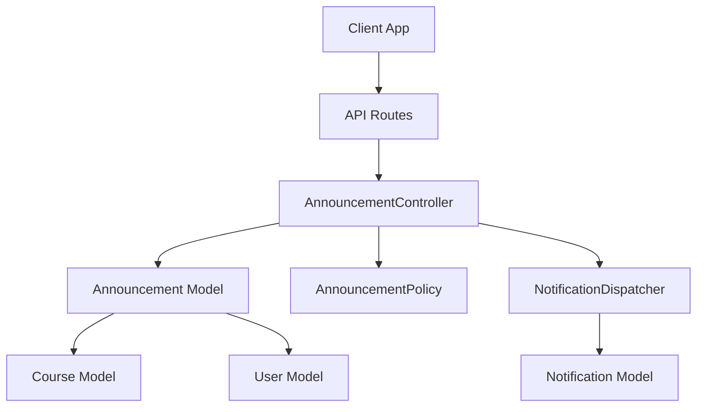
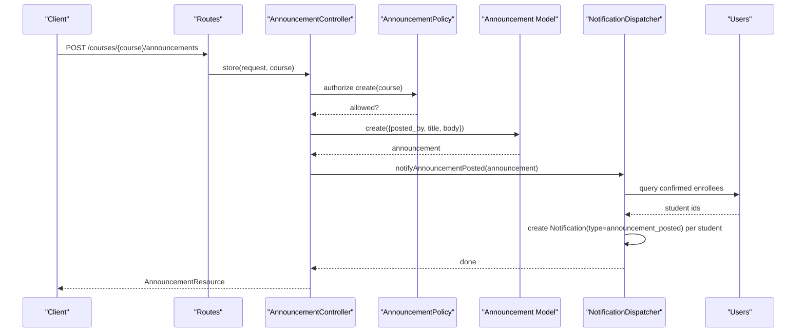
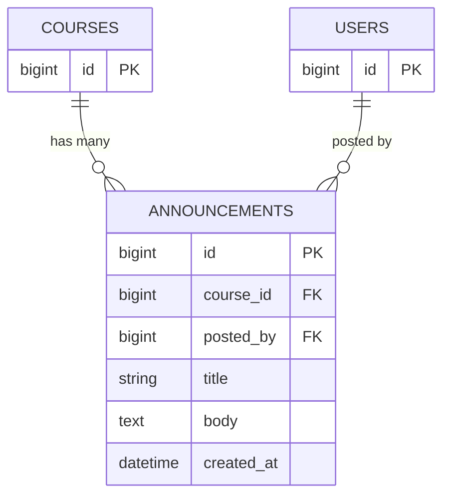
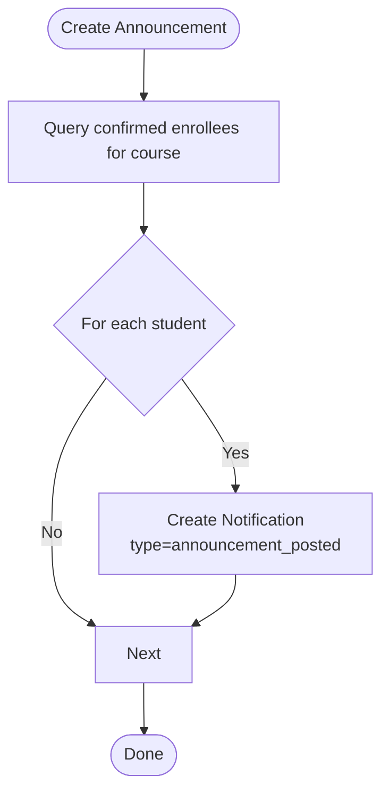
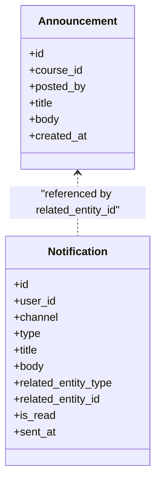
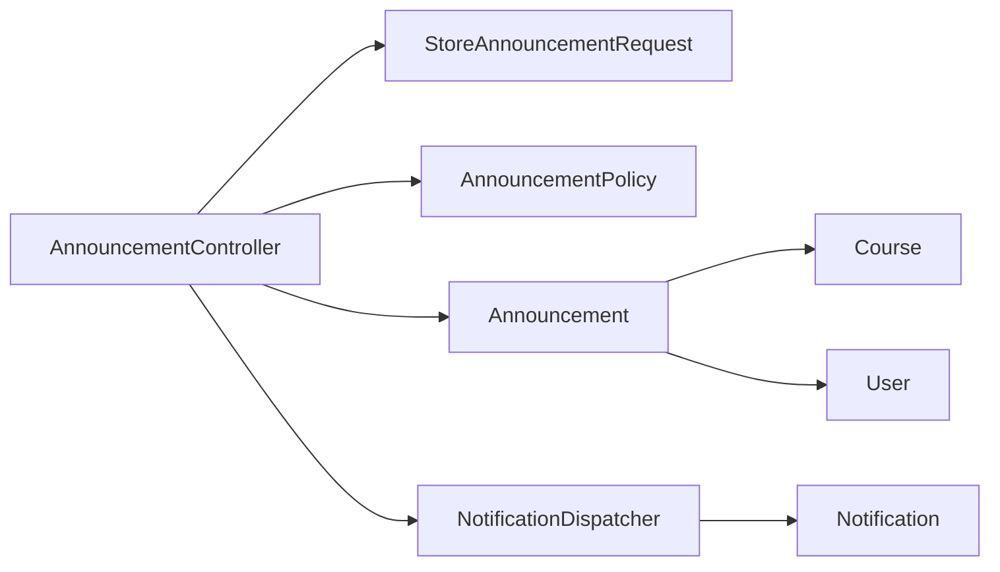

# Announcements System

<cite>
**Referenced Files in This Document**
- [Announcement.php](file://app/Models/Announcement.php)
- [Course.php](file://app/Models/Course.php)
- [Notification.php](file://app/Models/Notification.php)
- [AnnouncementController.php](file://app/Http/Controllers/Api/V1/AnnouncementController.php)
- [StoreAnnouncementRequest.php](file://app/Http/Requests/Api/V1/StoreAnnouncementRequest.php)
- [AnnouncementResource.php](file://app/Http/Resources/AnnouncementResource.php)
- [AnnouncementPolicy.php](file://app/Policies/AnnouncementPolicy.php)
- [NotificationDispatcher.php](file://app/Services/Notifications/NotificationDispatcher.php)
- [2024_01_01_000175_create_announcements_table.php](file://database/migrations/2024_01_01_000175_create_announcements_table.php)
- [api.php](file://routes/api.php)
- [AnnouncementFactory.php](file://database/factories/AnnouncementFactory.php)
- [DatabaseSeeder.php](file://database/seeders/DatabaseSeeder.php)
- [types.ts](file://frontend/src/lib/api/types.ts)
- [api.ts](file://frontend/src/features/communication/api.ts)
- [NotificationBell.tsx](file://frontend/src/features/communication/NotificationBell.tsx)
- [statusBadge.ts](file://frontend/src/lib/statusBadge.ts)
</cite>

## Table of Contents
1. [Introduction](#introduction)
2. [Project Structure](#project-structure)
3. [Core Components](#core-components)
4. [Architecture Overview](#architecture-overview)
5. [Detailed Component Analysis](#detailed-component-analysis)
6. [Dependency Analysis](#dependency-analysis)
7. [Performance Considerations](#performance-considerations)
8. [Troubleshooting Guide](#troubleshooting-guide)
9. [Conclusion](#conclusion)
10. [Appendices](#appendices)

## Introduction
This document describes the announcements system data model and behavior: how announcements are created, who can see them, how they are distributed to users, and how notifications are generated. It also clarifies current limitations (visibility controls, expiration, scheduling, archival) and outlines where future enhancements could be added.

## Project Structure
The announcements feature is implemented as a scoped broadcast within a course context:
- Data model: Announcement belongs to a Course and records the posting user.
- API: CRUD endpoints for listing, creating, and deleting announcements per course.
- Notifications: Creating an announcement triggers in-app notifications to all confirmed-enrolled students.
- Policies: Access control restricts viewing and creation based on role and enrollment status.

**Diagram sources**
- [api.php:231-234](file://routes/api.php#L231-L234)
- [AnnouncementController.php:20-49](file://app/Http/Controllers/Api/V1/AnnouncementController.php#L20-L49)
- [Announcement.php:12-41](file://app/Models/Announcement.php#L12-L41)
- [Course.php:155-161](file://app/Models/Course.php#L155-L161)
- [NotificationDispatcher.php:142-156](file://app/Services/Notifications/NotificationDispatcher.php#L142-L156)
- [Notification.php:13-45](file://app/Models/Notification.php#L13-L45)

**Section sources**
- [api.php:231-234](file://routes/api.php#L231-L234)
- [AnnouncementController.php:20-49](file://app/Http/Controllers/Api/V1/AnnouncementController.php#L20-L49)
- [Announcement.php:12-41](file://app/Models/Announcement.php#L12-L41)
- [Course.php:155-161](file://app/Models/Course.php#L155-L161)
- [NotificationDispatcher.php:142-156](file://app/Services/Notifications/NotificationDispatcher.php#L142-L156)
- [Notification.php:13-45](file://app/Models/Notification.php#L13-L45)

## Core Components
- Announcement model: Stores title, body, associated course, and posting user; no update timestamp; relationships to Course and User.
- Announcement controller: Lists announcements for a course, creates announcements, deletes announcements; enforces policies and dispatches notifications.
- Store request: Validates title and body and authorizes creation against the course policy.
- Resource: Serializes announcement fields including posted-by details when loaded.
- Policy: Controls view/create/delete permissions based on admin/instructor roles or confirmed enrollment.
- Notification dispatcher: Broadcasts in-app notifications to all confirmed-enrolled students upon announcement creation.

Key responsibilities:
- Creation: Validate input, persist announcement, notify recipients.
- Listing: Authorize access, load announcements with poster info, order by newest first.
- Deletion: Authorize deletion and remove the record.

**Section sources**
- [Announcement.php:12-41](file://app/Models/Announcement.php#L12-L41)
- [AnnouncementController.php:20-49](file://app/Http/Controllers/Api/V1/AnnouncementController.php#L20-L49)
- [StoreAnnouncementRequest.php:13-26](file://app/Http/Requests/Api/V1/StoreAnnouncementRequest.php#L13-L26)
- [AnnouncementResource.php:15-24](file://app/Http/Resources/AnnouncementResource.php#L15-L24)
- [AnnouncementPolicy.php:15-35](file://app/Policies/AnnouncementPolicy.php#L15-L35)
- [NotificationDispatcher.php:142-156](file://app/Services/Notifications/NotificationDispatcher.php#L142-L156)

## Architecture Overview
The announcements flow integrates models, controllers, policies, and the notification subsystem.

**Diagram sources**
- [api.php:231-234](file://routes/api.php#L231-L234)
- [AnnouncementController.php:29-39](file://app/Http/Controllers/Api/V1/AnnouncementController.php#L29-L39)
- [StoreAnnouncementRequest.php:13-26](file://app/Http/Requests/Api/V1/StoreAnnouncementRequest.php#L13-L26)
- [AnnouncementPolicy.php:27-30](file://app/Policies/AnnouncementPolicy.php#L27-L30)
- [Announcement.php:19-24](file://app/Models/Announcement.php#L19-L24)
- [NotificationDispatcher.php:142-156](file://app/Services/Notifications/NotificationDispatcher.php#L142-L156)

## Detailed Component Analysis

### Data Model
- Announcement table: id, course_id (FK to courses), posted_by (FK to users), title (string), body (text), created_at. No updated_at, no soft delete, no visibility flags, no expiration dates.
- Relationships:
  - Announcement belongs to Course (scoped broadcasts).
  - Announcement belongs to User via posted_by (author).
- Course has many Announcements.

**Diagram sources**
- [2024_01_01_000175_create_announcements_table.php:13-20](file://database/migrations/2024_01_01_000175_create_announcements_table.php#L13-L20)
- [Course.php:155-161](file://app/Models/Course.php#L155-L161)
- [Announcement.php:26-40](file://app/Models/Announcement.php#L26-L40)

**Section sources**
- [2024_01_01_000175_create_announcements_table.php:13-20](file://database/migrations/2024_01_01_000175_create_announcements_table.php#L13-L20)
- [Announcement.php:12-41](file://app/Models/Announcement.php#L12-L41)
- [Course.php:155-161](file://app/Models/Course.php#L155-L161)

### API Endpoints
- GET /courses/{course}/announcements: List announcements for a course, ordered newest first, includes posted-by if loaded.
- POST /courses/{course}/announcements: Create an announcement; posts notification to all confirmed-enrolled students.
- DELETE /announcements/{announcement}: Delete an announcement.

Authorization:
- View: Admin, course instructor, or confirmed-enrolled student.
- Create: Admin or course instructor.
- Delete: Same as create (must manage the course).

Validation:
- Title required, string, max length.
- Body required, string.

Response shape:
- ID, course_id, posted_by (user resource when loaded), title, body, created_at (ISO 8601).

**Section sources**
- [api.php:231-234](file://routes/api.php#L231-L234)
- [AnnouncementController.php:20-49](file://app/Http/Controllers/Api/V1/AnnouncementController.php#L20-L49)
- [StoreAnnouncementRequest.php:21-26](file://app/Http/Requests/Api/V1/StoreAnnouncementRequest.php#L21-L26)
- [AnnouncementResource.php:15-24](file://app/Http/Resources/AnnouncementResource.php#L15-L24)
- [AnnouncementPolicy.php:15-35](file://app/Policies/AnnouncementPolicy.php#L15-L35)

### Visibility Controls
- Access to list announcements is governed by AnnouncementPolicy::viewAny:
  - Admins always have access.
  - Instructors of the course have access.
  - Students must have a confirmed enrollment in that course.
- There is no per-announcement visibility flag; visibility is entirely tied to course membership and role.

**Section sources**
- [AnnouncementPolicy.php:15-25](file://app/Policies/AnnouncementPolicy.php#L15-L25)

### Targeting and Distribution
- Target audience: All users with a confirmed enrollment in the course.
- Distribution mechanism: On creation, NotificationDispatcher::notifyAnnouncementPosted queries confirmed enrollments and creates one in-app notification per student with type announcement_posted.
- The frontend displays these notifications in a bell dropdown and marks them read/unread via separate notification endpoints.

**Diagram sources**
- [NotificationDispatcher.php:142-156](file://app/Services/Notifications/NotificationDispatcher.php#L142-L156)

**Section sources**
- [NotificationDispatcher.php:142-156](file://app/Services/Notifications/NotificationDispatcher.php#L142-L156)
- [AnnouncementController.php:29-39](file://app/Http/Controllers/Api/V1/AnnouncementController.php#L29-L39)

### Expiration Dates and Scheduling
- Current implementation does not include expiration dates or scheduled publishing. Announcements are immediately visible and immediately trigger notifications upon creation.
- Future enhancement points:
  - Add published_at and expires_at columns to the announcements table.
  - Introduce a scheduler job to publish/schedule announcements at a specific time.
  - Filter listing by current visibility window.

[No sources needed since this section proposes future enhancements not present in code]

### Archival Features
- There is no soft-delete or archive state for announcements. Deleting an announcement removes it permanently.
- If archival is desired, consider adding a deleted_at column or an archived boolean and adjust listing/query logic accordingly.

[No sources needed since this section proposes future enhancements not present in code]

### User Notification Systems
- Notifications are stored in the notifications table with channel in-app, type announcement_posted, and related entity metadata pointing to the announcement.
- Frontend surfaces these notifications in a bell component and supports marking individual or all notifications as read.

**Diagram sources**
- [Announcement.php:19-24](file://app/Models/Announcement.php#L19-L24)
- [Notification.php:20-36](file://app/Models/Notification.php#L20-L36)

**Section sources**
- [Notification.php:20-36](file://app/Models/Notification.php#L20-L36)
- [NotificationDispatcher.php:142-156](file://app/Services/Notifications/NotificationDispatcher.php#L142-L156)
- [NotificationBell.tsx:17-76](file://frontend/src/features/communication/NotificationBell.tsx#L17-L76)
- [statusBadge.ts:181-207](file://frontend/src/lib/statusBadge.ts#L181-L207)

### Relationship to Course Contexts, User Groups, Institution-wide Broadcasts
- Announcements are scoped to a single Course. There is no direct relationship to user groups or institution-wide broadcasts in the current model.
- To support group-scoped or institution-wide announcements, you would need additional scoping fields (e.g., scope enum or target tables) and adjustments to distribution logic.

**Section sources**
- [Announcement.php:26-40](file://app/Models/Announcement.php#L26-L40)
- [Course.php:155-161](file://app/Models/Course.php#L155-L161)

## Dependency Analysis
- Controllers depend on Models, Requests, Resources, and Services.
- Policies enforce authorization using Course and User relationships.
- NotificationDispatcher depends on EnrolmentStatus and User queries to fan out notifications.

**Diagram sources**
- [AnnouncementController.php:16-49](file://app/Http/Controllers/Api/V1/AnnouncementController.php#L16-L49)
- [StoreAnnouncementRequest.php:13-26](file://app/Http/Requests/Api/V1/StoreAnnouncementRequest.php#L13-L26)
- [AnnouncementPolicy.php:15-35](file://app/Policies/AnnouncementPolicy.php#L15-L35)
- [NotificationDispatcher.php:142-156](file://app/Services/Notifications/NotificationDispatcher.php#L142-L156)
- [Announcement.php:26-40](file://app/Models/Announcement.php#L26-L40)
- [Course.php:155-161](file://app/Models/Course.php#L155-L161)
- [Notification.php:20-36](file://app/Models/Notification.php#L20-L36)

**Section sources**
- [AnnouncementController.php:16-49](file://app/Http/Controllers/Api/V1/AnnouncementController.php#L16-L49)
- [StoreAnnouncementRequest.php:13-26](file://app/Http/Requests/Api/V1/StoreAnnouncementRequest.php#L13-L26)
- [AnnouncementPolicy.php:15-35](file://app/Policies/AnnouncementPolicy.php#L15-L35)
- [NotificationDispatcher.php:142-156](file://app/Services/Notifications/NotificationDispatcher.php#L142-L156)

## Performance Considerations
- Fan-out on announcement creation: Each confirmed-enrolled student receives a notification. For large cohorts, this can be heavy. Consider queuing notification creation to avoid blocking requests.
- Eager loading: Listing announcements uses with('postedBy') to reduce N+1 queries. Keep this pattern consistent.
- Indexes: Ensure indexes exist on course_id and posted_by for efficient joins and lookups.

[No sources needed since this section provides general guidance]

## Troubleshooting Guide
- Authorization failures:
  - Users cannot list announcements unless they are admins, instructors, or confirmed-enrolled students. Verify enrollment status and role.
- Missing notifications:
  - Only confirmed-enrolled students receive announcement notifications. Check enrolment status.
- Frontend display issues:
  - Ensure the client fetches notifications and marks them read appropriately.
- Data integrity:
  - Announcements are cascade-deleted with their course. Deleting a course removes its announcements.

**Section sources**
- [AnnouncementPolicy.php:15-35](file://app/Policies/AnnouncementPolicy.php#L15-L35)
- [NotificationDispatcher.php:142-156](file://app/Services/Notifications/NotificationDispatcher.php#L142-L156)
- [api.php:231-234](file://routes/api.php#L231-L234)

## Conclusion
The announcements system provides course-scoped broadcasting from instructors/admins to confirmed-enrolled students, with immediate visibility and in-app notifications. It currently lacks expiration dates, scheduling, archival, and broader targeting beyond the course context. Extending the model and services will enable advanced features like timed publishing, soft deletes, and multi-scope broadcasts.

## Appendices

### API Reference Summary
- GET /courses/{course}/announcements
  - Purpose: List announcements for a course.
  - Authorization: Admin, instructor, or confirmed-enrolled student.
  - Response: Array of announcements with posted-by details when loaded.
- POST /courses/{course}/announcements
  - Purpose: Create an announcement.
  - Validation: title (required, string, max 200), body (required, string).
  - Side effect: Creates in-app notifications for all confirmed-enrolled students.
- DELETE /announcements/{announcement}
  - Purpose: Delete an announcement.
  - Authorization: Admin or instructor of the announcement’s course.

**Section sources**
- [api.php:231-234](file://routes/api.php#L231-L234)
- [StoreAnnouncementRequest.php:21-26](file://app/Http/Requests/Api/V1/StoreAnnouncementRequest.php#L21-L26)
- [AnnouncementController.php:20-49](file://app/Http/Controllers/Api/V1/AnnouncementController.php#L20-L49)

### Frontend Integration Notes
- Types define Announcement and AppNotification structures used by the UI.
- API helpers provide functions to fetch announcements, create/delete them, and manage notifications.
- Notification bell shows unread counts and allows composing new announcements for authorized users.

**Section sources**
- [types.ts:575-598](file://frontend/src/lib/api/types.ts#L575-L598)
- [api.ts:212-224](file://frontend/src/features/communication/api.ts#L212-L224)
- [NotificationBell.tsx:17-76](file://frontend/src/features/communication/NotificationBell.tsx#L17-L76)
- [statusBadge.ts:181-207](file://frontend/src/lib/statusBadge.ts#L181-L207)