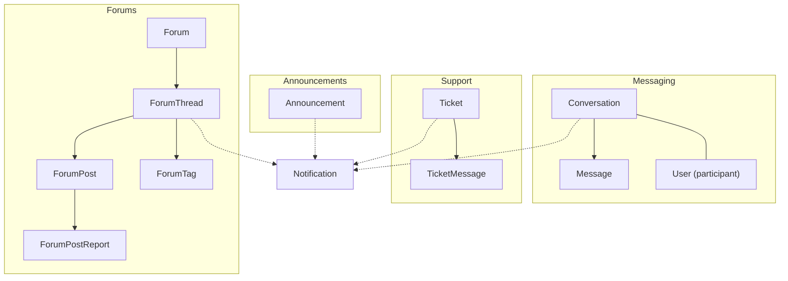
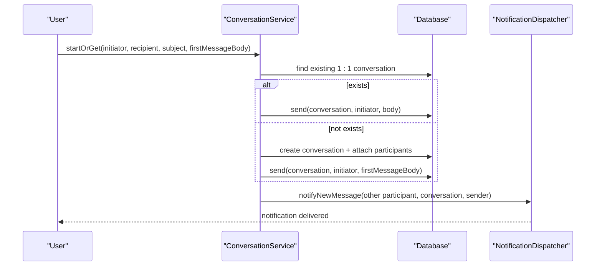
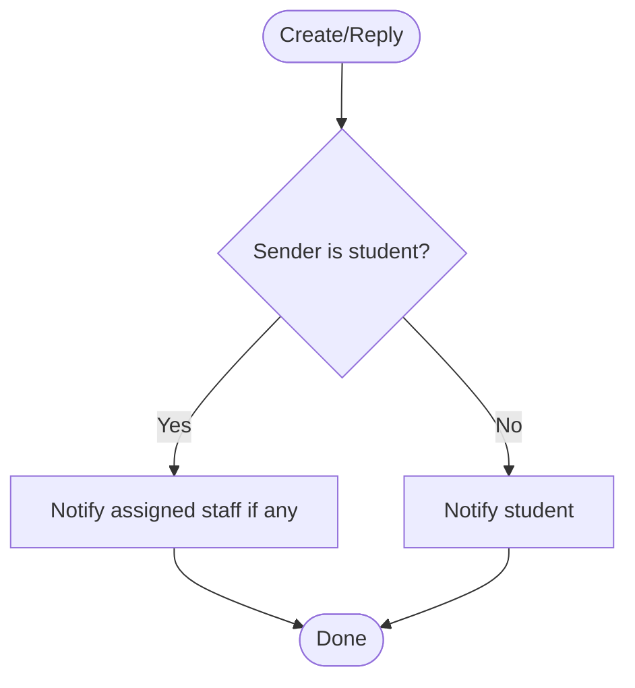
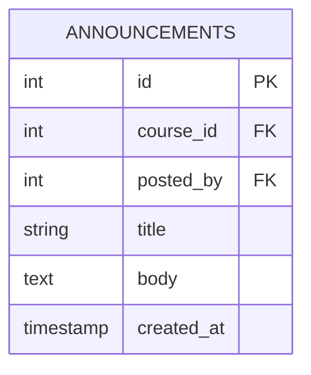
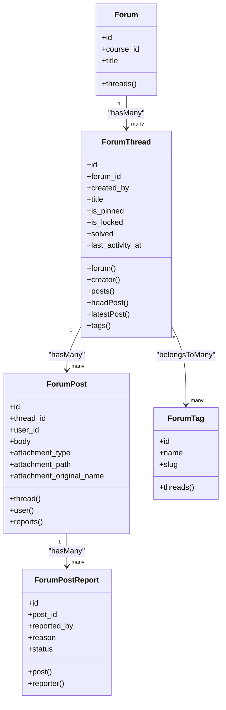
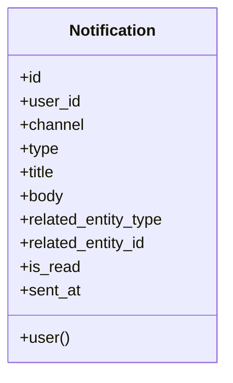
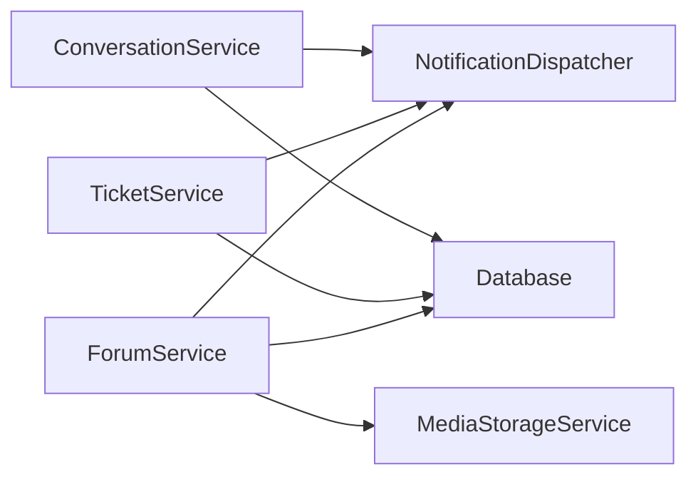

# Communication Platform

<cite>
**Referenced Files in This Document**
- [Conversation.php](file://app/Models/Conversation.php)
- [Message.php](file://app/Models/Message.php)
- [Ticket.php](file://app/Models/Ticket.php)
- [TicketMessage.php](file://app/Models/TicketMessage.php)
- [Announcement.php](file://app/Models/Announcement.php)
- [Forum.php](file://app/Models/Forum.php)
- [ForumThread.php](file://app/Models/ForumThread.php)
- [ForumPost.php](file://app/Models/ForumPost.php)
- [ForumPostReport.php](file://app/Models/ForumPostReport.php)
- [ForumTag.php](file://app/Models/ForumTag.php)
- [Notification.php](file://app/Models/Notification.php)
- [ConversationService.php](file://app/Services/Communication/ConversationService.php)
- [TicketService.php](file://app/Services/Communication/TicketService.php)
- [ForumService.php](file://app/Services/Communication/ForumService.php)
- [2024_01_01_000170_create_conversations_table.php](file://database/migrations/2024_01_01_000170_create_conversations_table.php)
- [2024_01_01_000171_create_conversation_participants_table.php](file://database/migrations/2024_01_01_000171_create_conversation_participants_table.php)
- [2024_01_01_000172_create_messages_table.php](file://database/migrations/2024_01_01_000172_create_messages_table.php)
- [2024_01_01_000173_create_tickets_table.php](file://database/migrations/2024_01_01_000173_create_tickets_table.php)
- [2024_01_01_000175_create_announcements_table.php](file://database/migrations/2024_01_01_000175_create_announcements_table.php)
- [2024_01_01_000176_create_forums_table.php](file://database/migrations/2024_01_01_000176_create_forums_table.php)
- [2024_01_01_000177_create_forum_threads_table.php](file://database/migrations/2024_01_01_000177_create_forum_threads_table.php)
- [2024_01_01_000178_create_forum_posts_table.php](file://database/migrations/2024_01_01_000178_create_forum_posts_table.php)
</cite>

## Table of Contents
1. [Introduction](#introduction)
2. [Project Structure](#project-structure)
3. [Core Components](#core-components)
4. [Architecture Overview](#architecture-overview)
5. [Detailed Component Analysis](#detailed-component-analysis)
6. [Dependency Analysis](#dependency-analysis)
7. [Performance Considerations](#performance-considerations)
8. [Troubleshooting Guide](#troubleshooting-guide)
9. [Conclusion](#conclusion)

## Introduction
This document describes the data model and communication channels for the platform’s messaging, support tickets, announcements, and forums. It explains how conversations, messages, tickets, announcements, forums, threads, posts, and notifications relate to each other, and how participant management, message threading, ticket workflows, forum moderation, and notification flows are implemented.

## Project Structure
The communication subsystem is organized around:
- Models that define entities such as Conversations, Messages, Tickets, Announcements, Forums, Threads, Posts, Reports, Tags, and Notifications.
- Services that encapsulate business logic for starting conversations, sending messages, managing tickets, and handling forum operations.
- Database migrations that define tables, foreign keys, indexes, and constraints.



**Diagram sources**
- [Conversation.php:13-39](file://app/Models/Conversation.php#L13-L39)
- [Message.php:12-47](file://app/Models/Message.php#L12-L47)
- [Ticket.php:14-66](file://app/Models/Ticket.php#L14-L66)
- [TicketMessage.php:12-40](file://app/Models/TicketMessage.php#L12-L40)
- [Announcement.php:12-41](file://app/Models/Announcement.php#L12-L41)
- [Forum.php:13-39](file://app/Models/Forum.php#L13-L39)
- [ForumThread.php:15-93](file://app/Models/ForumThread.php#L15-L93)
- [ForumPost.php:14-55](file://app/Models/ForumPost.php#L14-L55)
- [ForumPostReport.php:13-46](file://app/Models/ForumPostReport.php#L13-L46)
- [ForumTag.php:12-31](file://app/Models/ForumTag.php#L12-L31)
- [Notification.php:13-45](file://app/Models/Notification.php#L13-L45)

**Section sources**
- [Conversation.php:13-39](file://app/Models/Conversation.php#L13-L39)
- [Message.php:12-47](file://app/Models/Message.php#L12-L47)
- [Ticket.php:14-66](file://app/Models/Ticket.php#L14-L66)
- [TicketMessage.php:12-40](file://app/Models/TicketMessage.php#L12-L40)
- [Announcement.php:12-41](file://app/Models/Announcement.php#L12-L41)
- [Forum.php:13-39](file://app/Models/Forum.php#L13-L39)
- [ForumThread.php:15-93](file://app/Models/ForumThread.php#L15-L93)
- [ForumPost.php:14-55](file://app/Models/ForumPost.php#L14-L55)
- [ForumPostReport.php:13-46](file://app/Models/ForumPostReport.php#L13-L46)
- [ForumTag.php:12-31](file://app/Models/ForumTag.php#L12-L31)
- [Notification.php:13-45](file://app/Models/Notification.php#L13-L45)

## Core Components
- Conversations and Messages: One-to-one private chats between two users with read receipts and role-based permissions.
- Tickets and TicketMessages: Course-scoped support threads with status workflow and assignment.
- Announcements: Course-wide broadcast messages posted by authorized users.
- Forums, Threads, Posts, Reports, Tags: Course-scoped threaded discussions with moderation flags, tagging, and reporting.
- Notifications: Per-user records tracking channel, type, and related entity for cross-feature alerts.

Key relationships:
- Conversation has many Messages and many Participants (via pivot).
- Message belongs to a Conversation and a Sender (User).
- Ticket belongs to a Student (User), optional Course, optional AssignedTo (User), and has many TicketMessages.
- Announcement belongs to a Course and a Poster (User).
- Forum belongs to a Course and has many Threads; Thread belongs to Forum and Creator (User), has many Posts, and many Tags; Post belongs to Thread and User, and can have Reports.
- Notification belongs to a User and carries metadata about event type and related entity.

**Section sources**
- [Conversation.php:13-39](file://app/Models/Conversation.php#L13-L39)
- [Message.php:12-47](file://app/Models/Message.php#L12-L47)
- [Ticket.php:14-66](file://app/Models/Ticket.php#L14-L66)
- [TicketMessage.php:12-40](file://app/Models/TicketMessage.php#L12-L40)
- [Announcement.php:12-41](file://app/Models/Announcement.php#L12-L41)
- [Forum.php:13-39](file://app/Models/Forum.php#L13-L39)
- [ForumThread.php:15-93](file://app/Models/ForumThread.php#L15-L93)
- [ForumPost.php:14-55](file://app/Models/ForumPost.php#L14-L55)
- [ForumPostReport.php:13-46](file://app/Models/ForumPostReport.php#L13-L46)
- [ForumTag.php:12-31](file://app/Models/ForumTag.php#L12-L31)
- [Notification.php:13-45](file://app/Models/Notification.php#L13-L45)

## Architecture Overview
The system separates concerns into models (data), services (business rules), and database schema (persistence). Services coordinate multi-step operations, enforce policies, and trigger notifications.



**Diagram sources**
- [ConversationService.php:27-79](file://app/Services/Communication/ConversationService.php#L27-L79)
- [ConversationService.php:81-97](file://app/Services/Communication/ConversationService.php#L81-L97)

**Section sources**
- [ConversationService.php:27-97](file://app/Services/Communication/ConversationService.php#L27-L97)

## Detailed Component Analysis

### Conversations and Messages
- Data model:
  - Conversation holds a subject and timestamps; it relates to Users via a pivot table recording join time.
  - Message stores conversation reference, sender, body, sent timestamp, and an optional read receipt timestamp.
- Business rules:
  - Only specific role pairs may converse (Admin with anyone; Instructor with their enrolled Students).
  - Existing 1:1 conversations are reused; new ones are created atomically with the first message.
  - Read receipts mark all unread messages from others as read when the current user views the conversation.
- Indexing:
  - Messages are indexed by conversation and sent_at for efficient ordering and pagination.

```mermaid
classDiagram
class Conversation {
+id
+subject
+created_at
+participants()
+messages()
}
class Message {
+id
+conversation_id
+sender_id
+body
+sent_at
+read_at
+conversation()
+sender()
}
class User {
+id
+role
}
Conversation "1" --> "many" Message : "hasMany"
Conversation "many" --> "many" User : "belongsToMany (pivot : joined_at)"
Message --> User : "belongsTo (sender)"
```

**Diagram sources**
- [Conversation.php:13-39](file://app/Models/Conversation.php#L13-L39)
- [Message.php:12-47](file://app/Models/Message.php#L12-L47)

**Section sources**
- [Conversation.php:13-39](file://app/Models/Conversation.php#L13-L39)
- [Message.php:12-47](file://app/Models/Message.php#L12-L47)
- [2024_01_01_000170_create_conversations_table.php:11-18](file://database/migrations/2024_01_01_000170_create_conversations_table.php#L11-L18)
- [2024_01_01_000171_create_conversation_participants_table.php:11-18](file://database/migrations/2024_01_01_000171_create_conversation_participants_table.php#L11-L18)
- [2024_01_01_000172_create_messages_table.php:11-21](file://database/migrations/2024_01_01_000172_create_messages_table.php#L11-L21)
- [ConversationService.php:27-111](file://app/Services/Communication/ConversationService.php#L27-L111)

### Tickets and TicketMessages
- Data model:
  - Ticket links a Student (User), optional Course, optional AssignedTo (User), includes subject, status enum, and resolved timestamp.
  - TicketMessage stores thread-like replies within a ticket, referencing the ticket and sender.
- Workflow:
  - Creating a ticket opens it and posts the initial message.
  - Replies notify either the assigned staff or the student depending on who replied.
  - Updating status sets resolved_at when moving to resolved/closed states.



**Diagram sources**
- [TicketService.php:25-62](file://app/Services/Communication/TicketService.php#L25-L62)

**Section sources**
- [Ticket.php:14-66](file://app/Models/Ticket.php#L14-L66)
- [TicketMessage.php:12-40](file://app/Models/TicketMessage.php#L12-L40)
- [2024_01_01_000173_create_tickets_table.php:11-22](file://database/migrations/2024_01_01_000173_create_tickets_table.php#L11-L22)
- [TicketService.php:25-86](file://app/Services/Communication/TicketService.php#L25-L86)

### Announcements
- Data model:
  - Announcement belongs to a Course and a Poster (User), with title and body.
- Usage:
  - Used for course-wide broadcasts; typically managed by instructors/admins.



**Diagram sources**
- [Announcement.php:12-41](file://app/Models/Announcement.php#L12-L41)
- [2024_01_01_000175_create_announcements_table.php:11-20](file://database/migrations/2024_01_01_000175_create_announcements_table.php#L11-L20)

**Section sources**
- [Announcement.php:12-41](file://app/Models/Announcement.php#L12-L41)
- [2024_01_01_000175_create_announcements_table.php:11-20](file://database/migrations/2024_01_01_000175_create_announcements_table.php#L11-L20)

### Forums, Threads, Posts, Reports, Tags
- Data model:
  - Forum belongs to a Course and contains many Threads.
  - Thread belongs to Forum and a Creator (User), tracks pin/lock/solved state and last activity, and has many Posts and many Tags.
  - Post belongs to Thread and User, stores body and optional attachment metadata, and can be reported.
  - Report belongs to a Post and a Reporter (User), with reason and status.
  - Tag is a reusable label linked to Threads via a pivot.
- Moderation features:
  - Threads can be pinned or locked.
  - Staff can mark threads solved.
  - Posts can be reported and tracked.



**Diagram sources**
- [Forum.php:13-39](file://app/Models/Forum.php#L13-L39)
- [ForumThread.php:15-93](file://app/Models/ForumThread.php#L15-L93)
- [ForumPost.php:14-55](file://app/Models/ForumPost.php#L14-L55)
- [ForumPostReport.php:13-46](file://app/Models/ForumPostReport.php#L13-L46)
- [ForumTag.php:12-31](file://app/Models/ForumTag.php#L12-L31)

**Section sources**
- [Forum.php:13-39](file://app/Models/Forum.php#L13-L39)
- [ForumThread.php:15-93](file://app/Models/ForumThread.php#L15-L93)
- [ForumPost.php:14-55](file://app/Models/ForumPost.php#L14-L55)
- [ForumPostReport.php:13-46](file://app/Models/ForumPostReport.php#L13-L46)
- [ForumTag.php:12-31](file://app/Models/ForumTag.php#L12-L31)
- [2024_01_01_000176_create_forums_table.php:11-18](file://database/migrations/2024_01_01_000176_create_forums_table.php#L11-L18)
- [2024_01_01_000177_create_forum_threads_table.php:11-22](file://database/migrations/2024_01_01_000177_create_forum_threads_table.php#L11-L22)
- [2024_01_01_000178_create_forum_posts_table.php:11-21](file://database/migrations/2024_01_01_000178_create_forum_posts_table.php#L11-L21)
- [ForumService.php:39-153](file://app/Services/Communication/ForumService.php#L39-L153)

### Notifications
- Data model:
  - Notification stores user, channel, type, title, body, related entity type/id, read flag, and sent timestamp.
- Integration points:
  - Triggered by conversation messages, ticket replies, forum replies, and thread resolution events through a dispatcher service.



**Diagram sources**
- [Notification.php:13-45](file://app/Models/Notification.php#L13-L45)

**Section sources**
- [Notification.php:13-45](file://app/Models/Notification.php#L13-L45)
- [ConversationService.php:81-97](file://app/Services/Communication/ConversationService.php#L81-L97)
- [TicketService.php:45-62](file://app/Services/Communication/TicketService.php#L45-L62)
- [ForumService.php:92-119](file://app/Services/Communication/ForumService.php#L92-L119)

## Dependency Analysis
- Service dependencies:
  - ConversationService depends on NotificationDispatcher and enforces role-based permissions using User roles and Enrolment data.
  - TicketService depends on NotificationDispatcher and uses TicketStatus enum for workflow transitions.
  - ForumService depends on NotificationDispatcher and MediaStorageService for attachments, and manages tags and read receipts.
- Model coupling:
  - All communication entities tie back to User and often to Course, ensuring consistent scoping and access control.
  - ForumThread references ForumPost via headPost/latestPost relations for feed rendering without ad-hoc queries.



**Diagram sources**
- [ConversationService.php:23-25](file://app/Services/Communication/ConversationService.php#L23-L25)
- [TicketService.php:18-20](file://app/Services/Communication/TicketService.php#L18-L20)
- [ForumService.php:34-37](file://app/Services/Communication/ForumService.php#L34-L37)

**Section sources**
- [ConversationService.php:23-164](file://app/Services/Communication/ConversationService.php#L23-L164)
- [TicketService.php:18-88](file://app/Services/Communication/TicketService.php#L18-L88)
- [ForumService.php:34-223](file://app/Services/Communication/ForumService.php#L34-L223)

## Performance Considerations
- Messaging:
  - Use the index on messages(conversation_id, sent_at) for fast chronological retrieval.
  - Mark-read updates target only unread messages from the other participant to minimize writes.
- Forums:
  - Full-text index on post bodies supports efficient search.
  - headPost and latestPost use optimized relations to avoid expensive subqueries.
- Tickets:
  - Status transitions set resolved_at only when appropriate, reducing unnecessary updates.
- Attachments:
  - Forum posts store only metadata; actual files are handled by storage service to keep DB lightweight.

[No sources needed since this section provides general guidance]

## Troubleshooting Guide
- Cannot start conversation:
  - Ensure both users satisfy role-pair rules; Admins can message anyone, Instructors can message their enrolled Students.
- Missing read receipts:
  - Verify that markRead is called for the correct conversation and that messages are not from the reader themselves.
- Ticket reply not notifying:
  - Confirm assignment is set when student replies; otherwise no staff notification is sent.
- Forum post deletion side effects:
  - Deleting the head post deletes the entire thread; deleting other posts removes only that reply.

**Section sources**
- [ConversationService.php:27-44](file://app/Services/Communication/ConversationService.php#L27-L44)
- [ConversationService.php:104-111](file://app/Services/Communication/ConversationService.php#L104-L111)
- [TicketService.php:45-62](file://app/Services/Communication/TicketService.php#L45-L62)
- [ForumService.php:187-202](file://app/Services/Communication/ForumService.php#L187-L202)

## Conclusion
The communication platform provides robust, role-aware private messaging, structured support tickets, course-wide announcements, and moderated forums with tagging and reporting. The data model cleanly separates concerns across models, services, and persistence, while notifications ensure timely awareness across channels. Proper indexing and relation design support scalable performance for high-volume interactions.