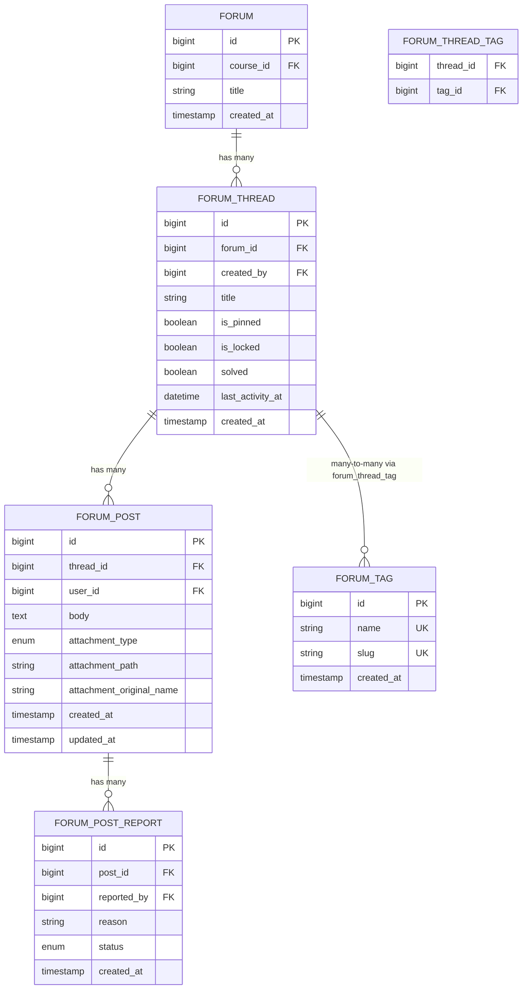
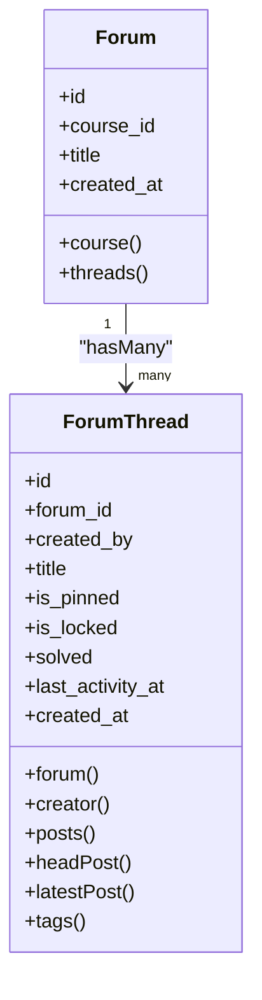
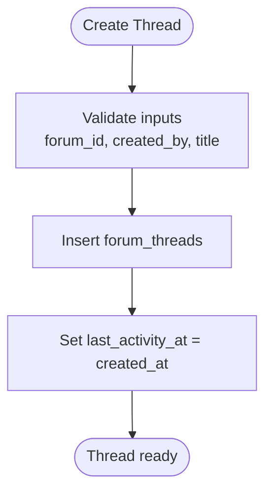
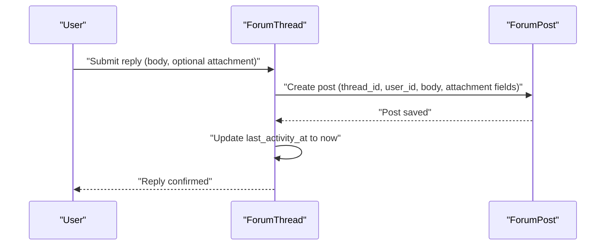
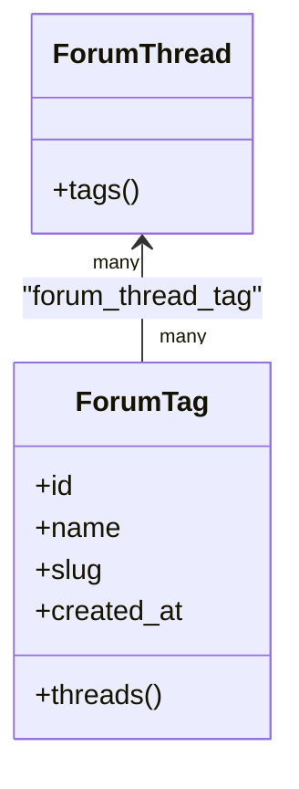
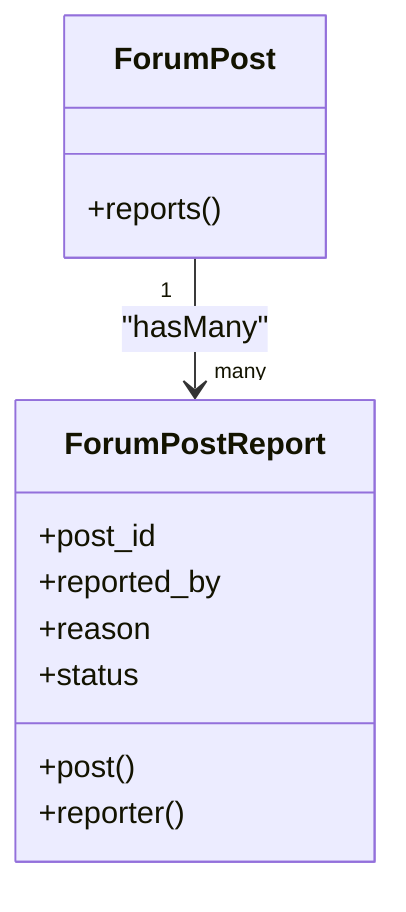
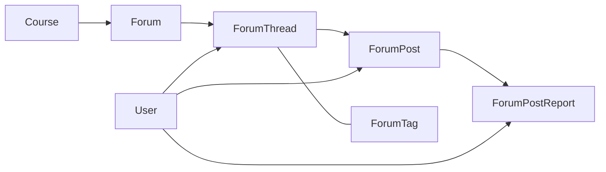

# Forum System

<cite>
**Referenced Files in This Document**
- [Forum.php](file://app/Models/Forum.php)
- [ForumThread.php](file://app/Models/ForumThread.php)
- [ForumPost.php](file://app/Models/ForumPost.php)
- [ForumTag.php](file://app/Models/ForumTag.php)
- [ForumPostReport.php](file://app/Models/ForumPostReport.php)
- [ForumPostAttachmentType.php](file://app/Enums/ForumPostAttachmentType.php)
- [ForumPostReportStatus.php](file://app/Enums/ForumPostReportStatus.php)
- [2024_01_01_000176_create_forums_table.php](file://database/migrations/2024_01_01_000176_create_forums_table.php)
- [2024_01_01_000177_create_forum_threads_table.php](file://database/migrations/2024_01_01_000177_create_forum_threads_table.php)
- [2024_01_01_000178_create_forum_posts_table.php](file://database/migrations/2024_01_01_000178_create_forum_posts_table.php)
- [2024_01_01_000179_create_forum_post_reports_table.php](file://database/migrations/2024_01_01_000179_create_forum_post_reports_table.php)
- [2026_07_21_195856_add_attachment_columns_to_forum_posts_table.php](file://database/migrations/2026_07_21_195856_add_attachment_columns_to_forum_posts_table.php)
- [2026_07_23_100000_add_solved_and_last_activity_to_forum_threads_table.php](file://database/migrations/2026_07_23_100000_add_solved_and_last_activity_to_forum_threads_table.php)
- [2026_07_23_100001_create_forum_tags_table.php](file://database/migrations/2026_07_23_100001_create_forum_tags_table.php)
- [2026_07_23_100002_create_forum_thread_reads_table.php](file://database/migrations/2026_07_23_100002_create_forum_thread_reads_table.php)
</cite>

## Table of Contents
1. Introduction
2. Project Structure
3. Core Components
4. Architecture Overview
5. Detailed Component Analysis
6. Dependency Analysis
7. Performance Considerations
8. Troubleshooting Guide
9. Conclusion

## Introduction
This document describes the data model and relationships for the forum system, including forums, threads, posts, tags, and moderation features such as pinned threads, locked threads, solved status, and post reports. It explains how threads are created within a forum hierarchy, how replies are modeled as posts, how tagging works, and how user permissions influence thread creation, posting, and content management.

## Project Structure
The forum subsystem is implemented with Eloquent models and database migrations:
- Models define entities and relationships (forums, threads, posts, tags, reports).
- Migrations define tables, columns, constraints, indexes, and enums.
- Enums standardize attachment types and report statuses.

```mermaid
graph TB
subgraph "Forum Domain"
F["Forum"]
T["ForumThread"]
P["ForumPost"]
R["ForumPostReport"]
G["ForumTag"]
end
F --> |hasMany| T
T --> |belongsTo| F
T --> |hasMany| P
P --> |belongsTo| T
P --> |hasMany| R
R --> |belongsTo| P
T < --> |belongsToMany| G
```

**Diagram sources**
- [Forum.php:25-39](file://app/Models/Forum.php#L25-L39)
- [ForumThread.php:39-92](file://app/Models/ForumThread.php#L39-L92)
- [ForumPost.php:32-54](file://app/Models/ForumPost.php#L32-L54)
- [ForumTag.php:24-30](file://app/Models/ForumTag.php#L24-L30)
- [ForumPostReport.php:31-45](file://app/Models/ForumPostReport.php#L31-L45)

**Section sources**
- [Forum.php:13-39](file://app/Models/Forum.php#L13-L39)
- [ForumThread.php:15-92](file://app/Models/ForumThread.php#L15-L92)
- [ForumPost.php:14-54](file://app/Models/ForumPost.php#L14-L54)
- [ForumTag.php:12-30](file://app/Models/ForumTag.php#L12-L30)
- [ForumPostReport.php:13-45](file://app/Models/ForumPostReport.php#L13-L45)

## Core Components
- Forum: A discussion container scoped to a course; holds many threads.
- ForumThread: A topic within a forum; belongs to a forum and a creator; has many posts; supports pinned, locked, solved flags and last activity timestamp; can be tagged.
- ForumPost: A message within a thread; authored by a user; may include an attachment; can be reported.
- ForumTag: Global tag vocabulary; many-to-many with threads.
- ForumPostReport: Moderation artifact per post with reason and status.

Key attributes and behaviors:
- Thread flags: is_pinned, is_locked, solved; last_activity_at drives sorting and “latest activity.”
- Post attachments: image, video, audio, article via enum; optional path and original name.
- Reports: pending, reviewed, dismissed states.

**Section sources**
- [ForumThread.php:22-37](file://app/Models/ForumThread.php#L22-L37)
- [ForumPost.php:19-30](file://app/Models/ForumPost.php#L19-L30)
- [ForumPostReport.php:20-29](file://app/Models/ForumPostReport.php#L20-L29)
- [ForumPostAttachmentType.php:7-13](file://app/Enums/ForumPostAttachmentType.php#L7-L13)
- [ForumPostReportStatus.php:7-12](file://app/Enums/ForumPostReportStatus.php#L7-L12)

## Architecture Overview
The forum follows a hierarchical structure: Course -> Forum -> Thread -> Posts. Tags are global and applied to threads. Reports attach to posts for moderation workflows.



**Diagram sources**
- [2024_01_01_000176_create_forums_table.php:13-18](file://database/migrations/2024_01_01_000176_create_forums_table.php#L13-L18)
- [2024_01_01_000177_create_forum_threads_table.php:13-22](file://database/migrations/2024_01_01_000177_create_forum_threads_table.php#L13-L22)
- [2024_01_01_000178_create_forum_posts_table.php:13-21](file://database/migrations/2024_01_01_000178_create_forum_posts_table.php#L13-L21)
- [2026_07_21_195856_add_attachment_columns_to_forum_posts_table.php:17-21](file://database/migrations/2026_07_21_195856_add_attachment_columns_to_forum_posts_table.php#L17-L21)
- [2026_07_23_100000_add_solved_and_last_activity_to_forum_threads_table.php:17-29](file://database/migrations/2026_07_23_100000_add_solved_and_last_activity_to_forum_threads_table.php#L17-L29)
- [2026_07_23_100001_create_forum_tags_table.php:17-30](file://database/migrations/2026_07_23_100001_create_forum_tags_table.php#L17-L30)
- [2024_01_01_000179_create_forum_post_reports_table.php:13-20](file://database/migrations/2024_01_01_000179_create_forum_post_reports_table.php#L13-L20)

## Detailed Component Analysis

### Forums and Hierarchical Structure
- A Forum belongs to a Course and contains many Threads.
- The hierarchy enables organizing discussions per course while keeping tags global across courses.



**Diagram sources**
- [Forum.php:25-39](file://app/Models/Forum.php#L25-L39)
- [ForumThread.php:39-92](file://app/Models/ForumThread.php#L39-L92)
- [2024_01_01_000176_create_forums_table.php:13-18](file://database/migrations/2024_01_01_000176_create_forums_table.php#L13-L18)
- [2024_01_01_000177_create_forum_threads_table.php:13-22](file://database/migrations/2024_01_01_000177_create_forum_threads_table.php#L13-L22)

**Section sources**
- [Forum.php:13-39](file://app/Models/Forum.php#L13-L39)
- [2024_01_01_000176_create_forums_table.php:13-18](file://database/migrations/2024_01_01_000176_create_forums_table.php#L13-L18)

### Threads: Creation, Moderation Flags, and Activity
- Thread creation: belongs to a Forum and a Creator (User).
- Moderation flags:
  - is_pinned: pins a thread for visibility.
  - is_locked: prevents further replies when true.
  - solved: marks a thread resolved by staff.
- last_activity_at: updated on new replies to drive sorting and grouping.



**Diagram sources**
- [2024_01_01_000177_create_forum_threads_table.php:13-22](file://database/migrations/2024_01_01_000177_create_forum_threads_table.php#L13-L22)
- [2026_07_23_100000_add_solved_and_last_activity_to_forum_threads_table.php:17-29](file://database/migrations/2026_07_23_100000_add_solved_and_last_activity_to_forum_threads_table.php#L17-L29)

**Section sources**
- [ForumThread.php:22-37](file://app/Models/ForumThread.php#L22-L37)
- [2024_01_01_000177_create_forum_threads_table.php:13-22](file://database/migrations/2024_01_01_000177_create_forum_threads_table.php#L13-L22)
- [2026_07_23_100000_add_solved_and_last_activity_to_forum_threads_table.php:17-29](file://database/migrations/2026_07_23_100000_add_solved_and_last_activity_to_forum_threads_table.php#L17-L29)

### Posts: Replies and Attachments
- A Post belongs to a Thread and a User.
- Supports optional attachments with type enumeration: image, video, audio, article.
- Full-text index on body for searchability.



**Diagram sources**
- [2024_01_01_000178_create_forum_posts_table.php:13-21](file://database/migrations/2024_01_01_000178_create_forum_posts_table.php#L13-L21)
- [2026_07_21_195856_add_attachment_columns_to_forum_posts_table.php:17-21](file://database/migrations/2026_07_21_195856_add_attachment_columns_to_forum_posts_table.php#L17-L21)
- [2026_07_23_100000_add_solved_and_last_activity_to_forum_threads_table.php:17-29](file://database/migrations/2026_07_23_100000_add_solved_and_last_activity_to_forum_threads_table.php#L17-L29)

**Section sources**
- [ForumPost.php:19-30](file://app/Models/ForumPost.php#L19-L30)
- [ForumPost.php:32-54](file://app/Models/ForumPost.php#L32-L54)
- [2024_01_01_000178_create_forum_posts_table.php:13-21](file://database/migrations/2024_01_01_000178_create_forum_posts_table.php#L13-L21)
- [2026_07_21_195856_add_attachment_columns_to_forum_posts_table.php:17-21](file://database/migrations/2026_07_21_195856_add_attachment_columns_to_forum_posts_table.php#L17-L21)

### Tagging System: Global Vocabulary and Many-to-Many
- Tags are global (not per-course) to avoid duplication across courses.
- Many-to-many relationship between threads and tags via forum_thread_tag pivot.
- Any thread author can create a new tag on the fly (find-or-create by name).



**Diagram sources**
- [2026_07_23_100001_create_forum_tags_table.php:17-30](file://database/migrations/2026_07_23_100001_create_forum_tags_table.php#L17-L30)
- [ForumTag.php:24-30](file://app/Models/ForumTag.php#L24-L30)
- [ForumThread.php:86-92](file://app/Models/ForumThread.php#L86-L92)

**Section sources**
- [2026_07_23_100001_create_forum_tags_table.php:17-30](file://database/migrations/2026_07_23_100001_create_forum_tags_table.php#L17-L30)
- [ForumTag.php:12-30](file://app/Models/ForumTag.php#L12-L30)
- [ForumThread.php:86-92](file://app/Models/ForumThread.php#L86-L92)

### Moderation Features: Reports and Statuses
- Posts can be reported with a reason and status.
- Report statuses: pending, reviewed, dismissed.
- Reports link to posts and reporters (users).



**Diagram sources**
- [2024_01_01_000179_create_forum_post_reports_table.php:13-20](file://database/migrations/2024_01_01_000179_create_forum_post_reports_table.php#L13-L20)
- [ForumPost.php:48-54](file://app/Models/ForumPost.php#L48-L54)
- [ForumPostReport.php:20-45](file://app/Models/ForumPostReport.php#L20-L45)
- [ForumPostReportStatus.php:7-12](file://app/Enums/ForumPostReportStatus.php#L7-L12)

**Section sources**
- [ForumPostReport.php:13-45](file://app/Models/ForumPostReport.php#L13-L45)
- [2024_01_01_000179_create_forum_post_reports_table.php:13-20](file://database/migrations/2024_01_01_000179_create_forum_post_reports_table.php#L13-L20)

### Read Tracking (Threads)
- A dedicated table tracks which users have read which threads, enabling read indicators and activity tracking.

**Section sources**
- [2026_07_23_100002_create_forum_thread_reads_table.php](file://database/migrations/2026_07_23_100002_create_forum_thread_reads_table.php)

## Dependency Analysis
- Forum depends on Course (foreign key).
- ForumThread depends on Forum and User (creator).
- ForumPost depends on ForumThread and User (author).
- ForumPostReport depends on ForumPost and User (reporter).
- ForumTag is independent but linked to ForumThread via pivot.



**Diagram sources**
- [Forum.php:25-39](file://app/Models/Forum.php#L25-L39)
- [ForumThread.php:39-92](file://app/Models/ForumThread.php#L39-L92)
- [ForumPost.php:32-54](file://app/Models/ForumPost.php#L32-L54)
- [ForumPostReport.php:31-45](file://app/Models/ForumPostReport.php#L31-L45)
- [ForumTag.php:24-30](file://app/Models/ForumTag.php#L24-L30)

**Section sources**
- [Forum.php:13-39](file://app/Models/Forum.php#L13-L39)
- [ForumThread.php:15-92](file://app/Models/ForumThread.php#L15-L92)
- [ForumPost.php:14-54](file://app/Models/ForumPost.php#L14-L54)
- [ForumPostReport.php:13-45](file://app/Models/ForumPostReport.php#L13-L45)
- [ForumTag.php:12-30](file://app/Models/ForumTag.php#L12-L30)

## Performance Considerations
- Indexes:
  - forum_threads.forum_id for fast thread listing per forum.
  - forum_threads.last_activity_at for efficient sorting by latest activity.
  - forum_posts.thread_id for quick retrieval of thread replies.
  - Full-text index on forum_posts.body for search.
- Enum casts reduce validation overhead and ensure consistent values.
- Avoiding unnecessary updates: last_activity_at is updated only on new replies to minimize writes.

[No sources needed since this section provides general guidance]

## Troubleshooting Guide
- Thread not appearing in sorted lists:
  - Ensure last_activity_at is set on thread creation and updated on each new reply.
- Locked threads still accepting replies:
  - Verify is_locked flag checks before creating posts.
- Solved threads still receiving replies:
  - Confirm business logic allows or restricts replies based on solved state if required.
- Attachment issues:
  - Check attachment_type matches allowed enum values; ensure attachment_path and attachment_original_name are stored appropriately.
- Reports not visible:
  - Confirm status transitions (pending -> reviewed/dismissed) and that reporter and post links are valid.

**Section sources**
- [2026_07_23_100000_add_solved_and_last_activity_to_forum_threads_table.php:17-29](file://database/migrations/2026_07_23_100000_add_solved_and_last_activity_to_forum_threads_table.php#L17-L29)
- [2026_07_21_195856_add_attachment_columns_to_forum_posts_table.php:17-21](file://database/migrations/2026_07_21_195856_add_attachment_columns_to_forum_posts_table.php#L17-L21)
- [ForumPostReportStatus.php:7-12](file://app/Enums/ForumPostReportStatus.php#L7-L12)

## Conclusion
The forum system models a clear hierarchy from Course to Forum to Thread to Posts, with global tagging and robust moderation via reports. Thread-level flags support pinning, locking, and solving, while last_activity_at ensures responsive sorting. Post attachments enable rich media sharing. Together, these components provide a scalable foundation for community-driven discussions with strong data integrity and performance considerations.