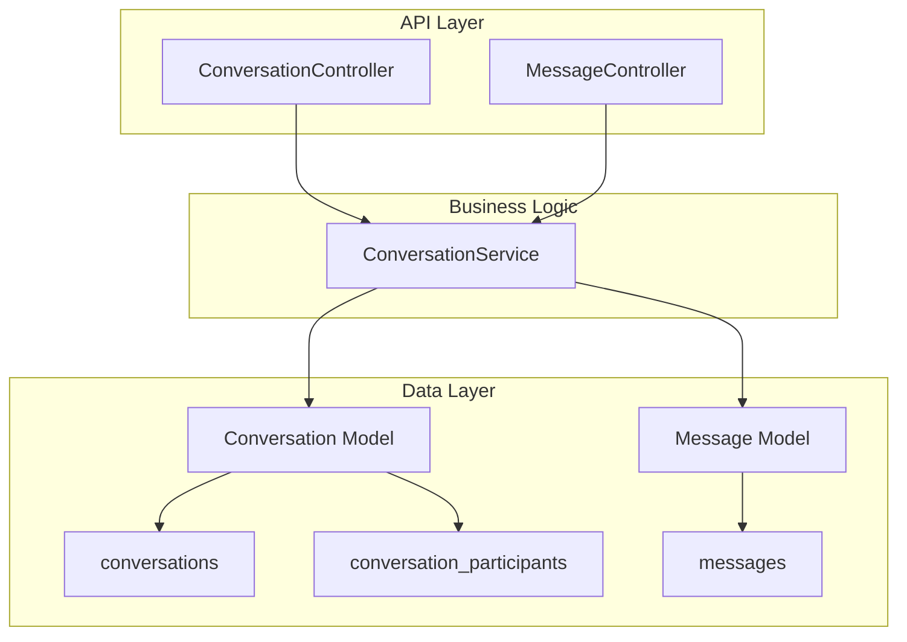
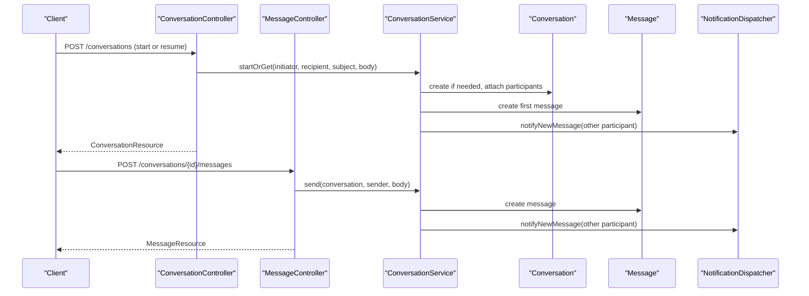
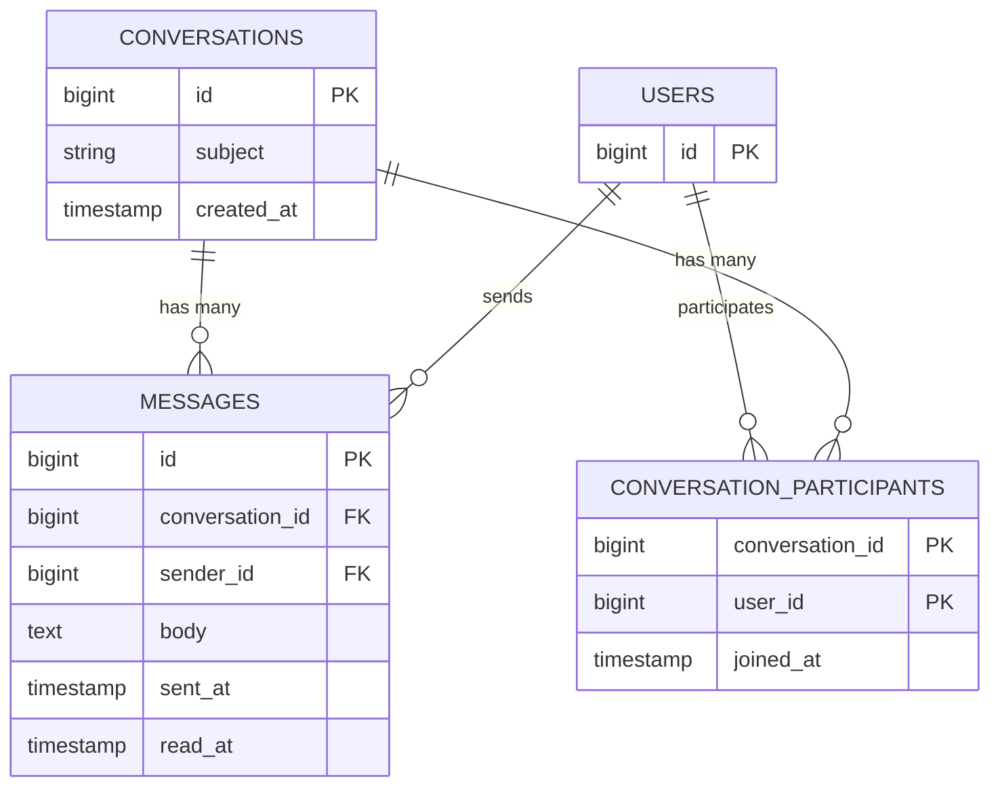
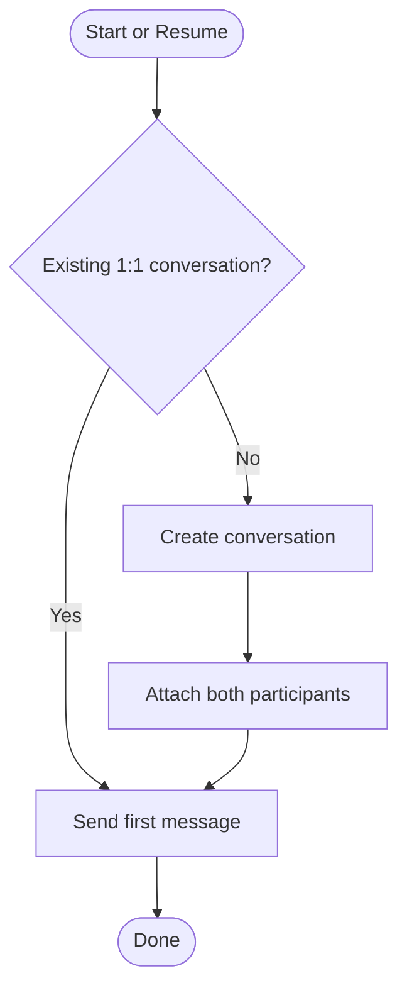
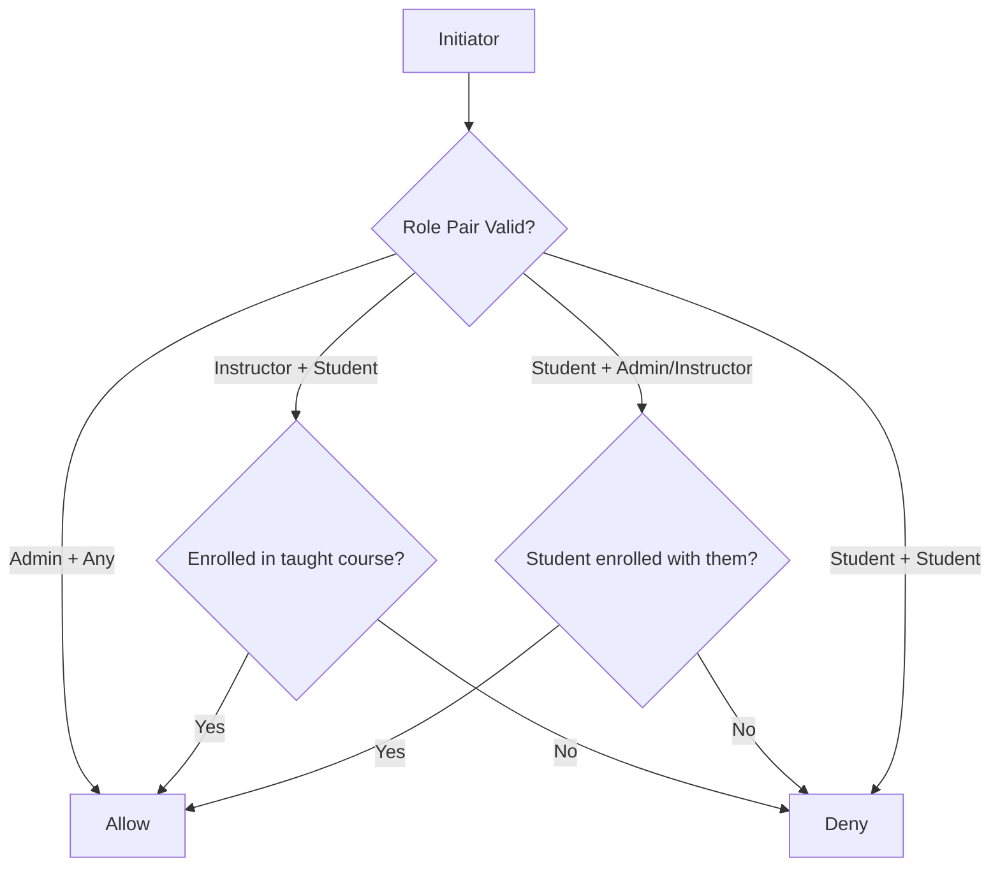
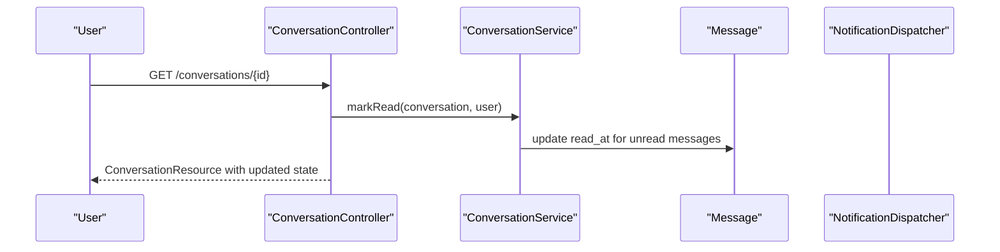
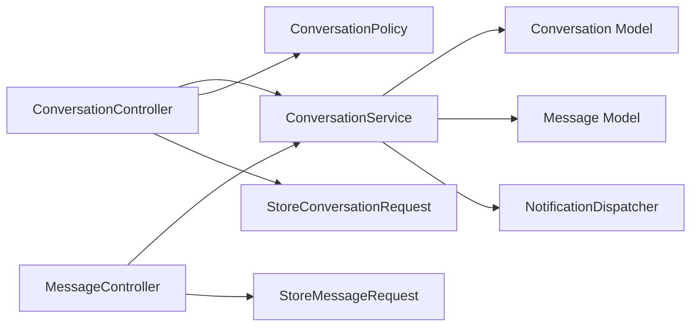

# Messaging System

<cite>
**Referenced Files in This Document**
- [Conversation.php](file://app/Models/Conversation.php)
- [Message.php](file://app/Models/Message.php)
- [2024_01_01_000170_create_conversations_table.php](file://database/migrations/2024_01_01_000170_create_conversations_table.php)
- [2024_01_01_000171_create_conversation_participants_table.php](file://database/migrations/2024_01_01_000171_create_conversation_participants_table.php)
- [2024_01_01_000172_create_messages_table.php](file://database/migrations/2024_01_01_000172_create_messages_table.php)
- [ConversationController.php](file://app/Http/Controllers/Api/V1/ConversationController.php)
- [MessageController.php](file://app/Http/Controllers/Api/V1/MessageController.php)
- [ConversationService.php](file://app/Services/Communication/ConversationService.php)
- [ConversationPolicy.php](file://app/Policies/ConversationPolicy.php)
- [StoreConversationRequest.php](file://app/Http/Requests/Api/V1/StoreConversationRequest.php)
- [StoreMessageRequest.php](file://app/Http/Requests/Api/V1/StoreMessageRequest.php)
- [ConversationResource.php](file://app/Http/Resources/ConversationResource.php)
- [MessageResource.php](file://app/Http/Resources/MessageResource.php)
</cite>

## Table of Contents
1. Introduction
2. Project Structure
3. Core Components
4. Architecture Overview
5. Detailed Component Analysis
6. Dependency Analysis
7. Performance Considerations
8. Troubleshooting Guide
9. Conclusion

## Introduction
This document describes the data model and behavior of the messaging system, focusing on conversations, messages, and participant management. It explains how one-to-one conversations are created and managed, how messages are sent and read, and how privacy and access controls are enforced. It also outlines real-time readiness and notification integration points present in the service layer.

## Project Structure
The messaging subsystem spans models, migrations, controllers, requests, resources, policies, and a service that encapsulates business rules:
- Models define entities and relationships (Conversation, Message).
- Migrations define persistent schema for conversations, participants, and messages.
- Controllers expose API endpoints to list conversations, start conversations, show details, and send messages.
- Requests validate inputs and authorize actions.
- Resources shape JSON responses.
- Policy enforces view permissions based on participation.
- Service implements core logic: role-based pairing, conversation reuse, message sending, read receipts, and contact discovery.

**Diagram sources**
- [ConversationController.php:21-61](file://app/Http/Controllers/Api/V1/ConversationController.php#L21-L61)
- [MessageController.php:17-22](file://app/Http/Controllers/Api/V1/MessageController.php#L17-L22)
- [ConversationService.php:27-162](file://app/Services/Communication/ConversationService.php#L27-L162)
- [Conversation.php:27-39](file://app/Models/Conversation.php#L27-L39)
- [Message.php:35-46](file://app/Models/Message.php#L35-L46)
- [2024_01_01_000170_create_conversations_table.php:13-17](file://database/migrations/2024_01_01_000170_create_conversations_table.php#L13-L17)
- [2024_01_01_000171_create_conversation_participants_table.php:13-18](file://database/migrations/2024_01_01_000171_create_conversation_participants_table.php#L13-L18)
- [2024_01_01_000172_create_messages_table.php:13-21](file://database/migrations/2024_01_01_000172_create_messages_table.php#L13-L21)

**Section sources**
- [ConversationController.php:21-61](file://app/Http/Controllers/Api/V1/ConversationController.php#L21-L61)
- [MessageController.php:17-22](file://app/Http/Controllers/Api/V1/MessageController.php#L17-L22)
- [ConversationService.php:27-162](file://app/Services/Communication/ConversationService.php#L27-L162)
- [Conversation.php:27-39](file://app/Models/Conversation.php#L27-L39)
- [Message.php:35-46](file://app/Models/Message.php#L35-L46)
- [2024_01_01_000170_create_conversations_table.php:13-17](file://database/migrations/2024_01_01_000170_create_conversations_table.php#L13-L17)
- [2024_01_01_000171_create_conversation_participants_table.php:13-18](file://database/migrations/2024_01_01_000171_create_conversation_participants_table.php#L13-L18)
- [2024_01_01_000172_create_messages_table.php:13-21](file://database/migrations/2024_01_01_000172_create_messages_table.php#L13-L21)

## Core Components
- Conversation: Represents a private thread between exactly two users. It has an optional subject and tracks creation time. Participants are linked via a pivot table with a join timestamp.
- Message: A single message within a conversation, including sender, body, sent timestamp, and optional read receipt timestamp.
- Participant Management: Enforced by a many-to-many relationship between users and conversations; each conversation is restricted to two participants by design.
- Access Control: View permission requires membership in the conversation; creating a conversation delegates role-pair validation to the service.
- Business Rules: Only specific role pairings can converse (Admin with any role; Instructor with their enrolled Students); Student-to-Student messaging is not supported.

Key responsibilities:
- ConversationService: Validates who can message whom, reuses existing 1:1 threads, sends messages, marks messages as read, and computes eligible contacts per role.
- ConversationController: Lists user’s conversations, provides contactable users, starts or resumes a conversation, shows conversation details, and marks messages read.
- MessageController: Sends a new message into an existing conversation.
- Policies and Requests: Ensure authorization and input validation at the API boundary.

**Section sources**
- [Conversation.php:20-39](file://app/Models/Conversation.php#L20-L39)
- [Message.php:19-46](file://app/Models/Message.php#L19-L46)
- [ConversationService.php:27-162](file://app/Services/Communication/ConversationService.php#L27-L162)
- [ConversationController.php:21-61](file://app/Http/Controllers/Api/V1/ConversationController.php#L21-L61)
- [MessageController.php:17-22](file://app/Http/Controllers/Api/V1/MessageController.php#L17-L22)
- [ConversationPolicy.php:12-25](file://app/Policies/ConversationPolicy.php#L12-L25)
- [StoreConversationRequest.php:13-24](file://app/Http/Requests/Api/V1/StoreConversationRequest.php#L13-L24)
- [StoreMessageRequest.php:12-24](file://app/Http/Requests/Api/V1/StoreMessageRequest.php#L12-L24)

## Architecture Overview
The messaging system follows a layered architecture:
- API Layer: Controllers handle HTTP requests, delegate to service, and return resources.
- Service Layer: Encapsulates domain logic (pairing rules, conversation reuse, message dispatch, read receipts, contact discovery).
- Data Layer: Eloquent models map to database tables defined by migrations.

**Diagram sources**
- [ConversationController.php:40-61](file://app/Http/Controllers/Api/V1/ConversationController.php#L40-L61)
- [MessageController.php:17-22](file://app/Http/Controllers/Api/V1/MessageController.php#L17-L22)
- [ConversationService.php:50-97](file://app/Services/Communication/ConversationService.php#L50-L97)

## Detailed Component Analysis

### Data Model and Relationships
- Conversations:
  - Fields: id, subject, created_at.
  - Relationships: belongsToMany User via conversation_participants; hasMany Message.
- Messages:
  - Fields: id, conversation_id, sender_id, body, sent_at, read_at.
  - Relationships: belongsTo Conversation; belongsTo User as sender.
- Participants:
  - Pivot fields: conversation_id, user_id, joined_at; composite primary key on conversation_id and user_id.

**Diagram sources**
- [2024_01_01_000170_create_conversations_table.php:13-17](file://database/migrations/2024_01_01_000170_create_conversations_table.php#L13-L17)
- [2024_01_01_000171_create_conversation_participants_table.php:13-18](file://database/migrations/2024_01_01_000171_create_conversation_participants_table.php#L13-L18)
- [2024_01_01_000172_create_messages_table.php:13-21](file://database/migrations/2024_01_01_000172_create_messages_table.php#L13-L21)
- [Conversation.php:27-39](file://app/Models/Conversation.php#L27-L39)
- [Message.php:35-46](file://app/Models/Message.php#L35-L46)

**Section sources**
- [Conversation.php:20-39](file://app/Models/Conversation.php#L20-L39)
- [Message.php:19-46](file://app/Models/Message.php#L19-L46)
- [2024_01_01_000170_create_conversations_table.php:13-17](file://database/migrations/2024_01_01_000170_create_conversations_table.php#L13-L17)
- [2024_01_01_000171_create_conversation_participants_table.php:13-18](file://database/migrations/2024_01_01_000171_create_conversation_participants_table.php#L13-L18)
- [2024_01_01_000172_create_messages_table.php:13-21](file://database/migrations/2024_01_01_000172_create_messages_table.php#L13-L21)

### Conversation Lifecycle
- Start or Resume:
  - If a 1:1 conversation exists between the two users, reuse it and send the first message.
  - Otherwise, create a new conversation, add both participants, and send the first message within a transaction.
- Read Receipts:
  - When a participant views a conversation, mark all unread messages from the other participant as read.
- Listing and Filtering:
  - Users see only conversations they participate in.
  - Unread counts are computed per current user context.

**Diagram sources**
- [ConversationService.php:50-79](file://app/Services/Communication/ConversationService.php#L50-L79)

**Section sources**
- [ConversationService.php:50-79](file://app/Services/Communication/ConversationService.php#L50-L79)
- [ConversationService.php:104-111](file://app/Services/Communication/ConversationService.php#L104-L111)
- [ConversationController.php:21-30](file://app/Http/Controllers/Api/V1/ConversationController.php#L21-L30)
- [ConversationController.php:54-61](file://app/Http/Controllers/Api/V1/ConversationController.php#L54-L61)

### One-to-One vs Group Conversations
- The system explicitly supports one-to-one conversations only. Each conversation contains exactly two participants.
- Group conversations are not implemented in this MVP; forums are used for group discussions.

**Section sources**
- [ConversationService.php:17-22](file://app/Services/Communication/ConversationService.php#L17-L22)
- [ConversationService.php:54-65](file://app/Services/Communication/ConversationService.php#L54-L65)

### Message Threading
- Messages belong to a single conversation and are ordered by sent timestamp.
- There is no explicit parent-child threading within a conversation; replies are represented as sequential messages within the same conversation.

**Section sources**
- [Message.php:19-46](file://app/Models/Message.php#L19-L46)
- [Conversation.php:33-39](file://app/Models/Conversation.php#L33-L39)
- [ConversationResource.php:27-37](file://app/Http/Resources/ConversationResource.php#L27-L37)

### Participant Roles and Privacy Controls
- Role-based pairing:
  - Admin can message any role.
  - Instructor can message students enrolled in courses they teach.
  - Student can message admins and their instructors.
  - Student-to-Student messaging is not allowed.
- Privacy:
  - View permission requires being a participant.
  - Contact lists are filtered by role and enrollment status to ensure privacy.

**Diagram sources**
- [ConversationService.php:27-44](file://app/Services/Communication/ConversationService.php#L27-L44)
- [ConversationService.php:119-148](file://app/Services/Communication/ConversationService.php#L119-L148)
- [ConversationPolicy.php:12-15](file://app/Policies/ConversationPolicy.php#L12-L15)

**Section sources**
- [ConversationService.php:27-44](file://app/Services/Communication/ConversationService.php#L27-L44)
- [ConversationService.php:119-148](file://app/Services/Communication/ConversationService.php#L119-L148)
- [ConversationPolicy.php:12-25](file://app/Policies/ConversationPolicy.php#L12-L25)

### Message Delivery and Read Receipts
- Sending a message creates a record and triggers notifications to the other participant(s).
- Read receipts: viewing a conversation marks all unread messages from the other participant as read.

**Diagram sources**
- [ConversationController.php:54-61](file://app/Http/Controllers/Api/V1/ConversationController.php#L54-L61)
- [ConversationService.php:104-111](file://app/Services/Communication/ConversationService.php#L104-L111)

**Section sources**
- [ConversationService.php:81-97](file://app/Services/Communication/ConversationService.php#L81-L97)
- [ConversationService.php:104-111](file://app/Services/Communication/ConversationService.php#L104-L111)

### Real-Time Messaging Capabilities
- Current implementation uses synchronous HTTP requests for sending and retrieving messages.
- Notifications are dispatched via NotificationDispatcher when a new message is sent, which is suitable for integrating with real-time channels (e.g., broadcasting events) in future enhancements.

**Section sources**
- [ConversationService.php:81-97](file://app/Services/Communication/ConversationService.php#L81-L97)

### Notification Integration
- On message send, the service calls NotificationDispatcher to notify the other participant(s).
- This decouples notification delivery from message persistence and allows flexible channel strategies.

**Section sources**
- [ConversationService.php:81-97](file://app/Services/Communication/ConversationService.php#L81-L97)

## Dependency Analysis
- Controllers depend on ConversationService for business logic.
- ConversationService depends on Conversation and Message models and NotificationDispatcher.
- Policies enforce view permissions based on participation.
- Requests validate inputs and delegate authorization checks to policies.

**Diagram sources**
- [ConversationController.php:21-61](file://app/Http/Controllers/Api/V1/ConversationController.php#L21-L61)
- [MessageController.php:17-22](file://app/Http/Controllers/Api/V1/MessageController.php#L17-L22)
- [ConversationService.php:27-162](file://app/Services/Communication/ConversationService.php#L27-L162)
- [ConversationPolicy.php:12-25](file://app/Policies/ConversationPolicy.php#L12-L25)
- [StoreConversationRequest.php:13-24](file://app/Http/Requests/Api/V1/StoreConversationRequest.php#L13-L24)
- [StoreMessageRequest.php:12-24](file://app/Http/Requests/Api/V1/StoreMessageRequest.php#L12-L24)

**Section sources**
- [ConversationController.php:21-61](file://app/Http/Controllers/Api/V1/ConversationController.php#L21-L61)
- [MessageController.php:17-22](file://app/Http/Controllers/Api/V1/MessageController.php#L17-L22)
- [ConversationService.php:27-162](file://app/Services/Communication/ConversationService.php#L27-L162)
- [ConversationPolicy.php:12-25](file://app/Policies/ConversationPolicy.php#L12-L25)
- [StoreConversationRequest.php:13-24](file://app/Http/Requests/Api/V1/StoreConversationRequest.php#L13-L24)
- [StoreMessageRequest.php:12-24](file://app/Http/Requests/Api/V1/StoreMessageRequest.php#L12-L24)

## Performance Considerations
- Indexes:
  - Messages are indexed by conversation_id and sent_at to optimize listing and ordering.
- Query Efficiency:
  - Conversation listing filters by participant and eager loads participants and messages to reduce N+1 queries.
  - Unread count is computed in memory after loading messages; consider pagination for large conversations.
- Transactions:
  - Creating a conversation and sending the first message occur within a transaction to ensure consistency.

**Section sources**
- [2024_01_01_000172_create_messages_table.php:13-21](file://database/migrations/2024_01_01_000172_create_messages_table.php#L13-L21)
- [ConversationController.php:21-30](file://app/Http/Controllers/Api/V1/ConversationController.php#L21-L30)
- [ConversationService.php:67-79](file://app/Services/Communication/ConversationService.php#L67-L79)

## Troubleshooting Guide
- Forbidden when starting a conversation:
  - Cause: Role pairing not allowed (e.g., Student-to-Student).
  - Resolution: Adjust roles or enrollments so the pairing is valid per service rules.
- Cannot send a message:
  - Cause: User does not have view permission for the conversation.
  - Resolution: Ensure the user is a participant; verify policy evaluation.
- Read receipts not updating:
  - Cause: Viewing endpoint not called or messages already marked read.
  - Resolution: Call the show endpoint to mark messages read; check read_at values.

**Section sources**
- [ConversationService.php:27-44](file://app/Services/Communication/ConversationService.php#L27-L44)
- [ConversationPolicy.php:12-15](file://app/Policies/ConversationPolicy.php#L12-L15)
- [ConversationService.php:104-111](file://app/Services/Communication/ConversationService.php#L104-L111)

## Conclusion
The messaging system provides a robust, role-gated, one-to-one conversation model with clear lifecycle management, message threading within conversations, and read receipts. It integrates notifications at message send and exposes clean APIs for listing, starting, and messaging. While group conversations are not supported in this version, the design cleanly separates concerns and leaves room for future extensions such as real-time broadcasting and richer threading features.