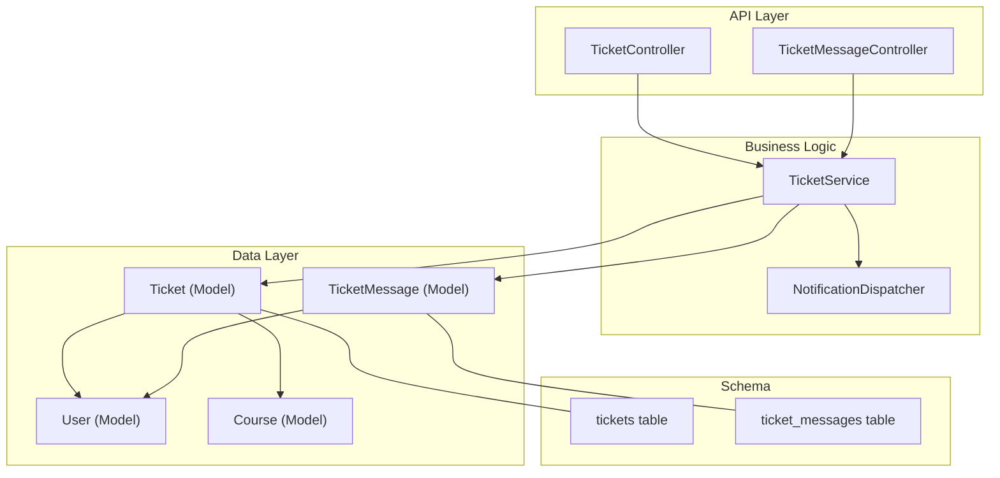
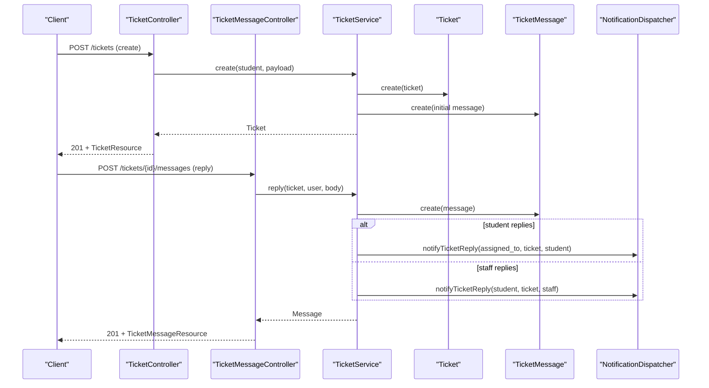
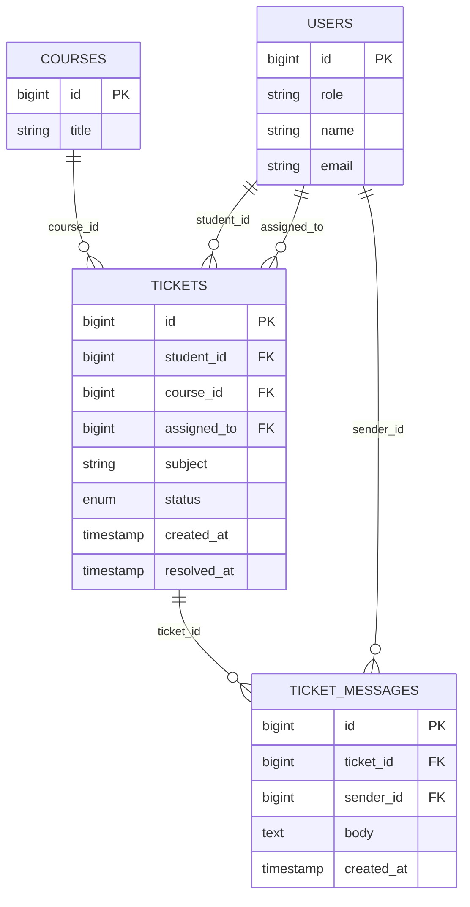
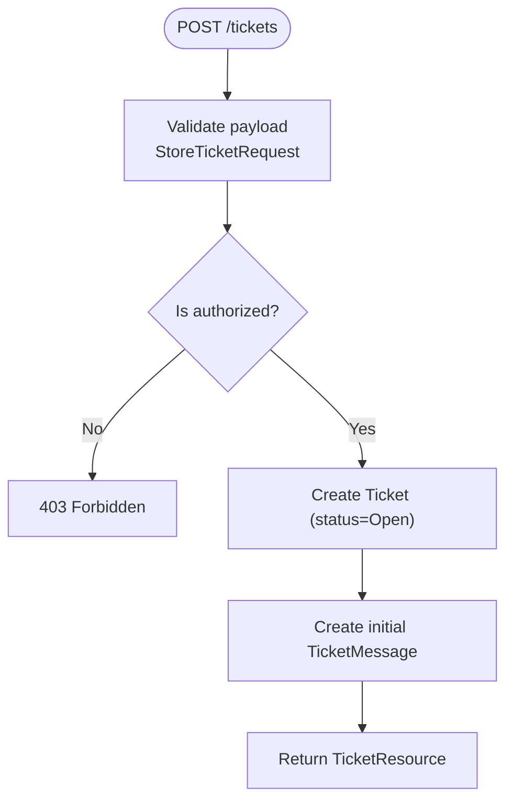
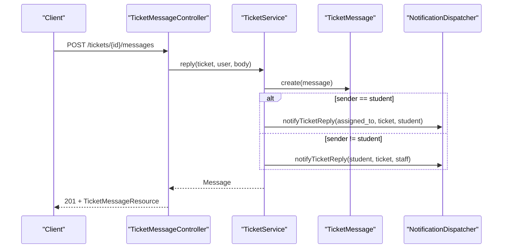
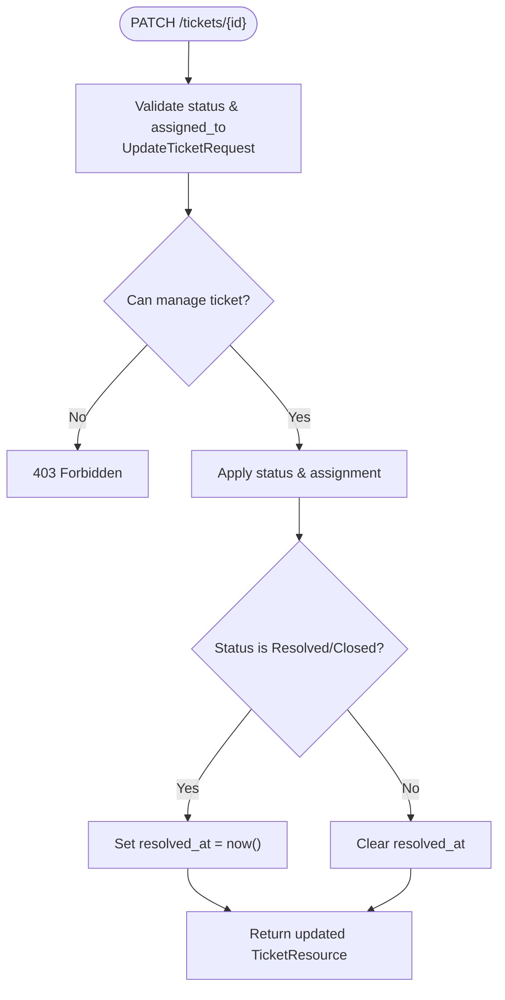
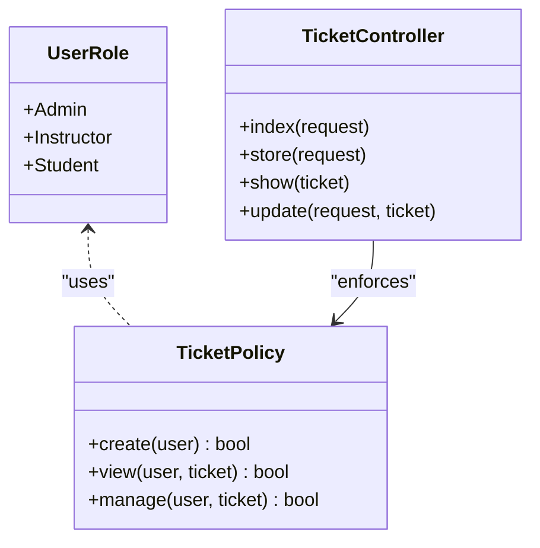
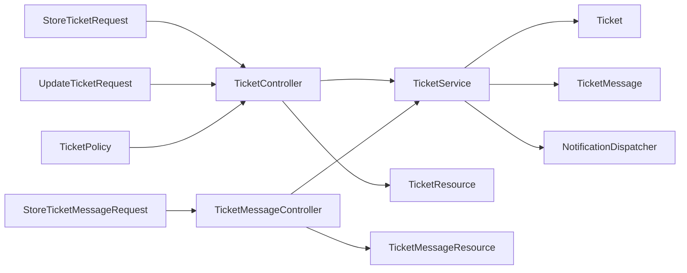

# Ticket System

<cite>
**Referenced Files in This Document**
- [Ticket.php](file://app/Models/Ticket.php)
- [TicketMessage.php](file://app/Models/TicketMessage.php)
- [User.php](file://app/Models/User.php)
- [TicketStatus.php](file://app/Enums/TicketStatus.php)
- [UserRole.php](file://app/Enums/UserRole.php)
- [2024_01_01_000173_create_tickets_table.php](file://database/migrations/2024_01_01_000173_create_tickets_table.php)
- [2024_01_01_000174_create_ticket_messages_table.php](file://database/migrations/2024_01_01_000174_create_ticket_messages_table.php)
- [TicketController.php](file://app/Http/Controllers/Api/V1/TicketController.php)
- [TicketMessageController.php](file://app/Http/Controllers/Api/V1/TicketMessageController.php)
- [StoreTicketRequest.php](file://app/Http/Requests/Api/V1/StoreTicketRequest.php)
- [UpdateTicketRequest.php](file://app/Http/Requests/Api/V1/UpdateTicketRequest.php)
- [StoreTicketMessageRequest.php](file://app/Http/Requests/Api/V1/StoreTicketMessageRequest.php)
- [TicketResource.php](file://app/Http/Resources/TicketResource.php)
- [TicketMessageResource.php](file://app/Http/Resources/TicketMessageResource.php)
- [TicketPolicy.php](file://app/Policies/TicketPolicy.php)
- [TicketService.php](file://app/Services/Communication/TicketService.php)
- [NotificationDispatcher.php](file://app/Services/Notifications/NotificationDispatcher.php)
</cite>

## Table of Contents
1. Introduction
2. Project Structure
3. Core Components
4. Architecture Overview
5. Detailed Component Analysis
6. Dependency Analysis
7. Performance Considerations
8. Troubleshooting Guide
9. Conclusion

## Introduction
This document describes the data model and workflows for the ticket system used by students to request support and by instructors/admins to manage issues. It covers tickets, ticket messages, status management, assignment, resolution, notifications, and role-based access control. The system is separate from the general conversation feature and focuses on student support.

## Project Structure
The ticket system spans models, migrations, controllers, services, policies, requests, resources, and notifications:
- Data layer: Eloquent models and database migrations define the schema for tickets and messages.
- Access control: Policies enforce who can view or manage tickets based on roles and relationships.
- API surface: Controllers expose endpoints for listing, creating, viewing, updating tickets and replying with messages.
- Business logic: A service encapsulates creation, replies, and updates, including status transitions and timestamps.
- Notifications: A dispatcher writes in-app notifications when a ticket receives a reply.

**Diagram sources**
- [TicketController.php:17-62](file://app/Http/Controllers/Api/V1/TicketController.php#L17-L62)
- [TicketMessageController.php:13-23](file://app/Http/Controllers/Api/V1/TicketMessageController.php#L13-L23)
- [TicketService.php:18-87](file://app/Services/Communication/TicketService.php#L18-L87)
- [NotificationDispatcher.php:98-107](file://app/Services/Notifications/NotificationDispatcher.php#L98-L107)
- [Ticket.php:14-66](file://app/Models/Ticket.php#L14-L66)
- [TicketMessage.php:12-40](file://app/Models/TicketMessage.php#L12-L40)
- [User.php:19-99](file://app/Models/User.php#L19-L99)
- [2024_01_01_000173_create_tickets_table.php:11-23](file://database/migrations/2024_01_01_000173_create_tickets_table.php#L11-L23)
- [2024_01_01_000174_create_ticket_messages_table.php:11-19](file://database/migrations/2024_01_01_000174_create_ticket_messages_table.php#L11-L19)

**Section sources**
- [TicketController.php:17-62](file://app/Http/Controllers/Api/V1/TicketController.php#L17-L62)
- [TicketMessageController.php:13-23](file://app/Http/Controllers/Api/V1/TicketMessageController.php#L13-L23)
- [TicketService.php:18-87](file://app/Services/Communication/TicketService.php#L18-L87)
- [NotificationDispatcher.php:98-107](file://app/Services/Notifications/NotificationDispatcher.php#L98-L107)
- [Ticket.php:14-66](file://app/Models/Ticket.php#L14-L66)
- [TicketMessage.php:12-40](file://app/Models/TicketMessage.php#L12-L40)
- [User.php:19-99](file://app/Models/User.php#L19-L99)
- [2024_01_01_000173_create_tickets_table.php:11-23](file://database/migrations/2024_01_01_000173_create_tickets_table.php#L11-L23)
- [2024_01_01_000174_create_ticket_messages_table.php:11-19](file://database/migrations/2024_01_01_000174_create_ticket_messages_table.php#L11-L19)

## Core Components
- Ticket: Represents a support issue created by a student, optionally linked to a course, assigned to an instructor/admin, and tracked with status and timestamps.
- TicketMessage: A message within a ticket thread sent by either the student or staff.
- Statuses: Open, InProgress, Resolved, Closed.
- Roles: Student, Instructor, Admin.
- Policies: Control who can create, view, or manage tickets.
- Service: Encapsulates business rules for creating tickets, replying, and updating status/assignment.
- Resources: Shape JSON responses for clients.
- Requests: Validate inputs and authorize actions at the controller boundary.

Key responsibilities:
- TicketService::create: Creates a ticket and initial message atomically; sets status to Open.
- TicketService::reply: Appends a message and notifies the other party via NotificationDispatcher.
- TicketService::update: Changes status and/or assignment; sets resolved_at when moving to Resolved or Closed.

**Section sources**
- [Ticket.php:14-66](file://app/Models/Ticket.php#L14-L66)
- [TicketMessage.php:12-40](file://app/Models/TicketMessage.php#L12-L40)
- [TicketStatus.php:7-13](file://app/Enums/TicketStatus.php#L7-L13)
- [UserRole.php:7-12](file://app/Enums/UserRole.php#L7-L12)
- [TicketPolicy.php:11-40](file://app/Policies/TicketPolicy.php#L11-L40)
- [TicketService.php:22-87](file://app/Services/Communication/TicketService.php#L22-L87)
- [TicketResource.php:10-29](file://app/Http/Resources/TicketResource.php#L10-L29)
- [TicketMessageResource.php:10-25](file://app/Http/Resources/TicketMessageResource.php#L10-L25)
- [StoreTicketRequest.php:11-26](file://app/Http/Requests/Api/V1/StoreTicketRequest.php#L11-L26)
- [UpdateTicketRequest.php:13-30](file://app/Http/Requests/Api/V1/UpdateTicketRequest.php#L13-L30)
- [StoreTicketMessageRequest.php:10-26](file://app/Http/Requests/Api/V1/StoreTicketMessageRequest.php#L10-L26)

## Architecture Overview
The API exposes REST-like endpoints for tickets and messages. Controllers delegate to the service for business logic, which interacts with models and dispatches notifications. Policies gate access at the controller/request level.

**Diagram sources**
- [TicketController.php:42-54](file://app/Http/Controllers/Api/V1/TicketController.php#L42-L54)
- [TicketMessageController.php:17-22](file://app/Http/Controllers/Api/V1/TicketMessageController.php#L17-L22)
- [TicketService.php:25-62](file://app/Services/Communication/TicketService.php#L25-L62)
- [NotificationDispatcher.php:98-107](file://app/Services/Notifications/NotificationDispatcher.php#L98-L107)

## Detailed Component Analysis

### Data Model
- Tickets table: id, student_id (FK to users), course_id (nullable FK to courses), assigned_to (nullable FK to users), subject, status enum, created_at, resolved_at.
- Ticket messages table: id, ticket_id (FK to tickets), sender_id (FK to users), body, created_at.
- Relationships:
  - Ticket belongs to User (student), optional Course, optional User (assigned_to).
  - Ticket has many TicketMessages.
  - TicketMessage belongs to Ticket and User (sender).

**Diagram sources**
- [2024_01_01_000173_create_tickets_table.php:11-23](file://database/migrations/2024_01_01_000173_create_tickets_table.php#L11-L23)
- [2024_01_01_000174_create_ticket_messages_table.php:11-19](file://database/migrations/2024_01_01_000174_create_ticket_messages_table.php#L11-L19)
- [Ticket.php:35-65](file://app/Models/Ticket.php#L35-L65)
- [TicketMessage.php:25-39](file://app/Models/TicketMessage.php#L25-L39)
- [User.php:89-93](file://app/Models/User.php#L89-L93)

**Section sources**
- [2024_01_01_000173_create_tickets_table.php:11-23](file://database/migrations/2024_01_01_000173_create_tickets_table.php#L11-L23)
- [2024_01_01_000174_create_ticket_messages_table.php:11-19](file://database/migrations/2024_01_01_000174_create_ticket_messages_table.php#L11-L19)
- [Ticket.php:14-66](file://app/Models/Ticket.php#L14-L66)
- [TicketMessage.php:12-40](file://app/Models/TicketMessage.php#L12-L40)

### Ticket Creation Workflow
- Validation: StoreTicketRequest ensures subject/body are present and course_id exists if provided. Authorization requires Student role.
- Service: TicketService::create creates a ticket with status Open and immediately appends the first message from the student inside a transaction.
- Response: TicketResource serializes the ticket with related entities and messages.

**Diagram sources**
- [StoreTicketRequest.php:13-26](file://app/Http/Requests/Api/V1/StoreTicketRequest.php#L13-L26)
- [TicketService.php:25-43](file://app/Services/Communication/TicketService.php#L25-L43)
- [TicketResource.php:15-28](file://app/Http/Resources/TicketResource.php#L15-L28)

**Section sources**
- [StoreTicketRequest.php:13-26](file://app/Http/Requests/Api/V1/StoreTicketRequest.php#L13-L26)
- [TicketService.php:25-43](file://app/Services/Communication/TicketService.php#L25-L43)
- [TicketResource.php:15-28](file://app/Http/Resources/TicketResource.php#L15-L28)

### Reply and Messaging Workflow
- Validation: StoreTicketMessageRequest requires a body and checks that the requester can view the ticket.
- Service: TicketService::reply persists the message and sends an in-app notification to the counterparty (student or assigned staff).
- Response: TicketMessageResource returns the new message with sender details.

**Diagram sources**
- [StoreTicketMessageRequest.php:12-26](file://app/Http/Requests/Api/V1/StoreTicketMessageRequest.php#L12-L26)
- [TicketMessageController.php:17-22](file://app/Http/Controllers/Api/V1/TicketMessageController.php#L17-L22)
- [TicketService.php:45-62](file://app/Services/Communication/TicketService.php#L45-L62)
- [NotificationDispatcher.php:98-107](file://app/Services/Notifications/NotificationDispatcher.php#L98-L107)
- [TicketMessageResource.php:15-24](file://app/Http/Resources/TicketMessageResource.php#L15-L24)

**Section sources**
- [StoreTicketMessageRequest.php:12-26](file://app/Http/Requests/Api/V1/StoreTicketMessageRequest.php#L12-L26)
- [TicketMessageController.php:17-22](file://app/Http/Controllers/Api/V1/TicketMessageController.php#L17-L22)
- [TicketService.php:45-62](file://app/Services/Communication/TicketService.php#L45-L62)
- [NotificationDispatcher.php:98-107](file://app/Services/Notifications/NotificationDispatcher.php#L98-L107)
- [TicketMessageResource.php:15-24](file://app/Http/Resources/TicketMessageResource.php#L15-L24)

### Assignment and Status Management
- Update endpoint: UpdateTicketRequest validates optional status and assigned_to fields and enforces authorization via policy.
- Service: TicketService::update applies changes and sets resolved_at when status becomes Resolved or Closed.
- Policy: Only admins, the assigned person, or course instructors (for course-linked tickets) can manage tickets.

**Diagram sources**
- [UpdateTicketRequest.php:15-30](file://app/Http/Requests/Api/V1/UpdateTicketRequest.php#L15-L30)
- [TicketService.php:67-86](file://app/Services/Communication/TicketService.php#L67-L86)
- [TicketPolicy.php:27-39](file://app/Policies/TicketPolicy.php#L27-L39)
- [TicketResource.php:15-28](file://app/Http/Resources/TicketResource.php#L15-L28)

**Section sources**
- [UpdateTicketRequest.php:15-30](file://app/Http/Requests/Api/V1/UpdateTicketRequest.php#L15-L30)
- [TicketService.php:67-86](file://app/Services/Communication/TicketService.php#L67-L86)
- [TicketPolicy.php:27-39](file://app/Policies/TicketPolicy.php#L27-L39)
- [TicketResource.php:15-28](file://app/Http/Resources/TicketResource.php#L15-L28)

### Role-Based Access and Visibility
- Create: Only Students can create tickets.
- View: Admins, the ticket’s student, the assigned staff, or instructors teaching the ticket’s course can view.
- Manage: Only admins, the assigned staff, or instructors teaching the ticket’s course can change status/assignment.
- Listing: Index filters by role—students see their own, instructors see assigned plus tickets for courses they teach, admins see all.

**Diagram sources**
- [UserRole.php:7-12](file://app/Enums/UserRole.php#L7-L12)
- [TicketPolicy.php:11-40](file://app/Policies/TicketPolicy.php#L11-L40)
- [TicketController.php:21-61](file://app/Http/Controllers/Api/V1/TicketController.php#L21-L61)

**Section sources**
- [TicketPolicy.php:11-40](file://app/Policies/TicketPolicy.php#L11-L40)
- [TicketController.php:21-61](file://app/Http/Controllers/Api/V1/TicketController.php#L21-L61)
- [UserRole.php:7-12](file://app/Enums/UserRole.php#L7-L12)

### Resolution Process and Timestamps
- When status moves to Resolved or Closed, resolved_at is set to the current time; otherwise it is cleared.
- This provides a clear audit point for when a ticket was considered resolved.

**Section sources**
- [TicketService.php:67-86](file://app/Services/Communication/TicketService.php#L67-L86)
- [TicketStatus.php:7-13](file://app/Enums/TicketStatus.php#L7-L13)

### Priority Handling and Escalation Procedures
- There is no explicit priority field or escalation workflow implemented in the current codebase.
- Practical escalation can be achieved by reassigning tickets to different users or changing status to reflect progress.

[No sources needed since this section summarizes current behavior without analyzing specific files]

## Dependency Analysis
- Controllers depend on Request classes for validation and authorization, and on the TicketService for business logic.
- TicketService depends on Models and NotificationDispatcher.
- Policies depend on UserRole and relationships on Ticket and User.
- Resources depend on Models and other Resources to shape API output.

**Diagram sources**
- [StoreTicketRequest.php:11-26](file://app/Http/Requests/Api/V1/StoreTicketRequest.php#L11-L26)
- [UpdateTicketRequest.php:13-30](file://app/Http/Requests/Api/V1/UpdateTicketRequest.php#L13-L30)
- [StoreTicketMessageRequest.php:10-26](file://app/Http/Requests/Api/V1/StoreTicketMessageRequest.php#L10-L26)
- [TicketController.php:17-62](file://app/Http/Controllers/Api/V1/TicketController.php#L17-L62)
- [TicketMessageController.php:13-23](file://app/Http/Controllers/Api/V1/TicketMessageController.php#L13-L23)
- [TicketService.php:18-87](file://app/Services/Communication/TicketService.php#L18-L87)
- [TicketPolicy.php:11-40](file://app/Policies/TicketPolicy.php#L11-L40)
- [TicketResource.php:10-29](file://app/Http/Resources/TicketResource.php#L10-L29)
- [TicketMessageResource.php:10-25](file://app/Http/Resources/TicketMessageResource.php#L10-L25)

**Section sources**
- [TicketController.php:17-62](file://app/Http/Controllers/Api/V1/TicketController.php#L17-L62)
- [TicketMessageController.php:13-23](file://app/Http/Controllers/Api/V1/TicketMessageController.php#L13-L23)
- [TicketService.php:18-87](file://app/Services/Communication/TicketService.php#L18-L87)
- [TicketPolicy.php:11-40](file://app/Policies/TicketPolicy.php#L11-L40)
- [TicketResource.php:10-29](file://app/Http/Resources/TicketResource.php#L10-L29)
- [TicketMessageResource.php:10-25](file://app/Http/Resources/TicketMessageResource.php#L10-L25)

## Performance Considerations
- Use eager loading for related entities in list/detail endpoints to avoid N+1 queries (controllers already load student, course, assignedTo, and messages where appropriate).
- Keep transactions small; creation uses a single transaction around ticket and initial message insertion.
- Avoid heavy operations in synchronous paths; notifications are written synchronously here but could be queued in future phases.

[No sources needed since this section provides general guidance]

## Troubleshooting Guide
- Authorization errors: Ensure the user role matches expectations (Students create; Admins/Assigned/Instructors manage). Check policy methods for view/manage permissions.
- Validation errors: Confirm required fields (subject/body) and valid references (course_id exists).
- Missing notifications: Verify that the correct recipient is determined by sender identity and assignment; check NotificationDispatcher calls.
- Status not updating: Ensure UpdateTicketRequest allows the requested status and that the user has manage permission.

**Section sources**
- [TicketPolicy.php:11-40](file://app/Policies/TicketPolicy.php#L11-L40)
- [StoreTicketRequest.php:18-26](file://app/Http/Requests/Api/V1/StoreTicketRequest.php#L18-L26)
- [UpdateTicketRequest.php:23-30](file://app/Http/Requests/Api/V1/UpdateTicketRequest.php#L23-L30)
- [StoreTicketMessageRequest.php:20-26](file://app/Http/Requests/Api/V1/StoreTicketMessageRequest.php#L20-L26)
- [TicketService.php:45-62](file://app/Services/Communication/TicketService.php#L45-L62)
- [NotificationDispatcher.php:98-107](file://app/Services/Notifications/NotificationDispatcher.php#L98-L107)

## Conclusion
The ticket system provides a focused, role-aware support workflow with clear data boundaries between tickets and messages. It supports creation, messaging, assignment, and status transitions with automatic resolution timestamps and in-app notifications. While priority and escalation are not explicitly modeled, assignment and status changes enable practical workflows. Future enhancements may include priority levels, escalation rules, and asynchronous notifications.