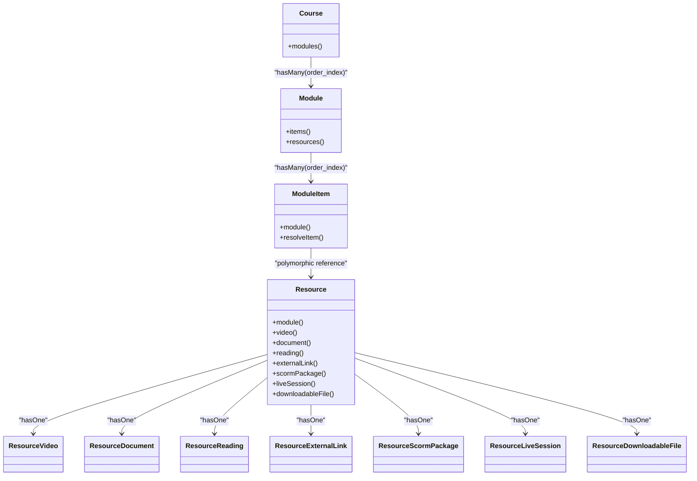
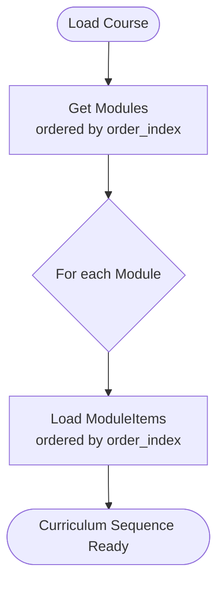
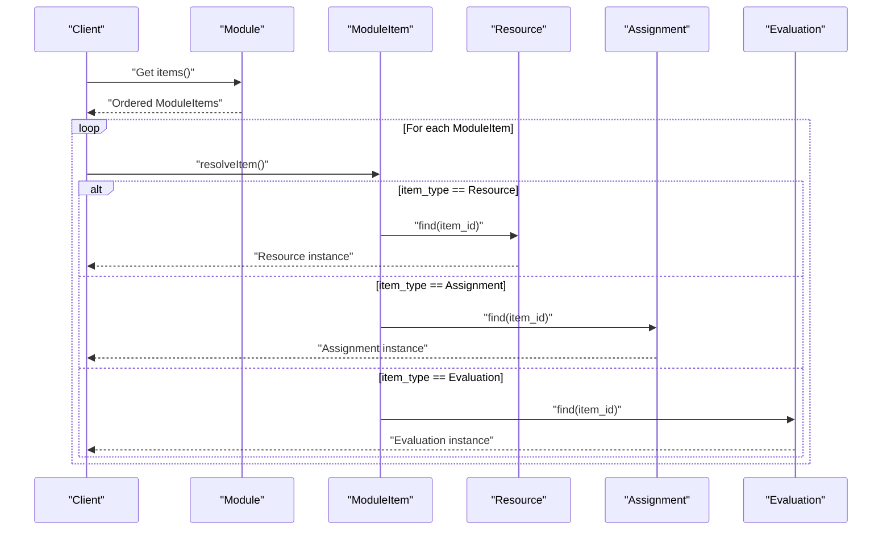
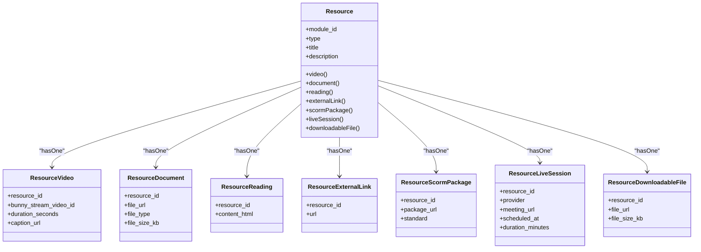
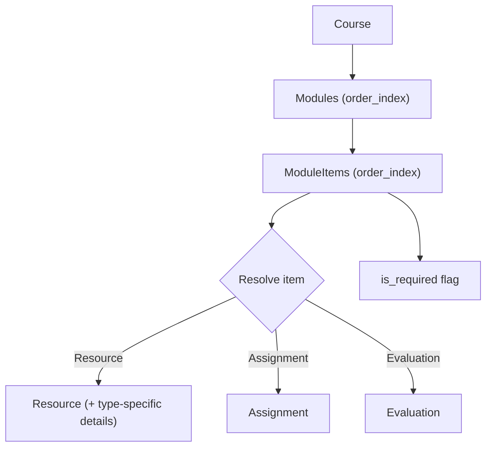
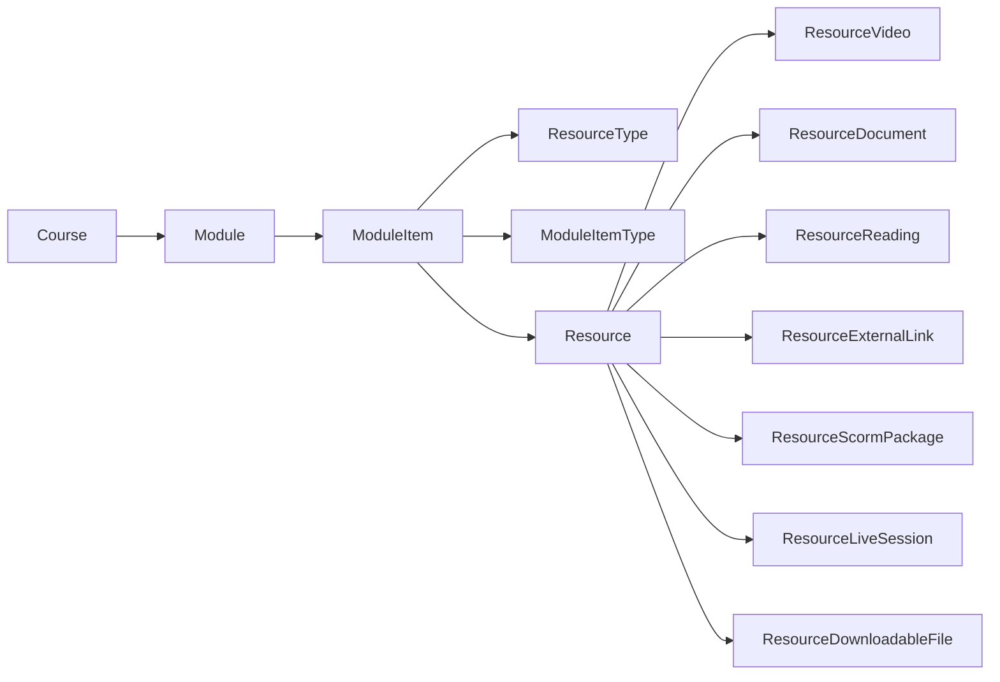

# Content Management

<cite>
**Referenced Files in This Document**
- [Course.php](file://app/Models/Course.php)
- [Module.php](file://app/Models/Module.php)
- [ModuleItem.php](file://app/Models/ModuleItem.php)
- [Resource.php](file://app/Models/Resource.php)
- [ResourceVideo.php](file://app/Models/ResourceVideo.php)
- [ResourceDocument.php](file://app/Models/ResourceDocument.php)
- [ResourceReading.php](file://app/Models/ResourceReading.php)
- [ResourceExternalLink.php](file://app/Models/ResourceExternalLink.php)
- [ResourceScormPackage.php](file://app/Models/ResourceScormPackage.php)
- [ResourceLiveSession.php](file://app/Models/ResourceLiveSession.php)
- [ResourceDownloadableFile.php](file://app/Models/ResourceDownloadableFile.php)
- [ResourceType.php](file://app/Enums/ResourceType.php)
- [ModuleItemType.php](file://app/Enums/ModuleItemType.php)
</cite>

## Table of Contents
1. [Introduction](#introduction)
2. [Project Structure](#project-structure)
3. [Core Components](#core-components)
4. [Architecture Overview](#architecture-overview)
5. [Detailed Component Analysis](#detailed-component-analysis)
6. [Dependency Analysis](#dependency-analysis)
7. [Performance Considerations](#performance-considerations)
8. [Troubleshooting Guide](#troubleshooting-guide)
9. [Conclusion](#conclusion)

## Introduction
This document describes the data model for the content management system with a focus on the hierarchical structure Courses → Modules → Resources and the polymorphic resource types. It explains how modules sequence items, how resources are typed and extended, and how ordering is enforced across the hierarchy. The goal is to help developers understand how content is organized, sequenced, and accessed at scale.

## Project Structure
The content hierarchy is modeled using Eloquent models:
- Course contains ordered Modules.
- Module contains ordered ModuleItems that reference Resources (or other learnables).
- Resource is a base entity with one-to-one extensions for each concrete type (video, document, reading, external link, SCORM package, live session, downloadable file).

```mermaid
graph TB
Course["Course"] --> |hasMany| Module["Module"]
Module --> |hasMany| ModuleItem["ModuleItem"]
ModuleItem --> |belongsTo| Module
ModuleItem --> |"item_type + item_id"| Resource["Resource"]
Resource --> |"hasOne" RV["ResourceVideo"]
Resource --> |"hasOne" RD["ResourceDocument"]
Resource --> |"hasOne" RR["ResourceReading"]
Resource --> |"hasOne" REL["ResourceExternalLink"]
Resource --> |"hasOne" RSP["ResourceScormPackage"]
Resource --> |"hasOne" RLS["ResourceLiveSession"]
Resource --> |"hasOne" RDF["ResourceDownloadableFile"]
```

**Diagram sources**
- [Course.php:116-121](file://app/Models/Course.php#L116-L121)
- [Module.php:54-60](file://app/Models/Module.php#L54-L60)
- [ModuleItem.php:21-33](file://app/Models/ModuleItem.php#L21-L33)
- [Resource.php:31-93](file://app/Models/Resource.php#L31-L93)

**Section sources**
- [Course.php:116-121](file://app/Models/Course.php#L116-L121)
- [Module.php:54-60](file://app/Models/Module.php#L54-L60)
- [ModuleItem.php:21-33](file://app/Models/ModuleItem.php#L21-L33)
- [Resource.php:31-93](file://app/Models/Resource.php#L31-L93)

## Core Components
- Course: Top-level container for learning content; exposes ordered modules via order_index.
- Module: A section within a course; holds ordered items and optional scheduling/unlock behavior.
- ModuleItem: Sequencing layer that references a specific item by type and id; supports required flags.
- Resource: Polymorphic content entity with a type discriminator and one-to-one type-specific details.
- Resource Types: Video, Document, Reading, External Link, SCORM Package, Live Session, Downloadable File.

Key ordering fields:
- Course → Module: order_index
- Module → ModuleItem: order_index
- Module → Resource: direct relationship exists but sequencing is typically controlled through ModuleItem

**Section sources**
- [Course.php:116-121](file://app/Models/Course.php#L116-L121)
- [Module.php:22-34](file://app/Models/Module.php#L22-L34)
- [Module.php:54-60](file://app/Models/Module.php#L54-L60)
- [ModuleItem.php:21-33](file://app/Models/ModuleItem.php#L21-L33)
- [Resource.php:20-29](file://app/Models/Resource.php#L20-L29)

## Architecture Overview
The system uses a two-layer approach to content organization:
- Structural layer: Course → Module → ModuleItem defines the curriculum flow and sequencing.
- Content layer: Resource and its type-specific children define what learners consume.



**Diagram sources**
- [Course.php:116-121](file://app/Models/Course.php#L116-L121)
- [Module.php:54-60](file://app/Models/Module.php#L54-L60)
- [ModuleItem.php:21-33](file://app/Models/ModuleItem.php#L21-L33)
- [Resource.php:31-93](file://app/Models/Resource.php#L31-L93)

## Detailed Component Analysis

### Course → Module Hierarchy
- Course has many Modules ordered by order_index.
- Module belongs to a Course and can be soft-deleted.
- Module also exposes a direct resources relationship, but recommended sequencing is via ModuleItem.



**Diagram sources**
- [Course.php:116-121](file://app/Models/Course.php#L116-L121)
- [Module.php:54-60](file://app/Models/Module.php#L54-L60)

**Section sources**
- [Course.php:116-121](file://app/Models/Course.php#L116-L121)
- [Module.php:22-34](file://app/Models/Module.php#L22-L34)
- [Module.php:54-60](file://app/Models/Module.php#L54-L60)

### ModuleItem Sequencing and Resolution
- ModuleItem stores module_id, item_type, item_id, order_index, and is_required.
- resolveItem returns the actual domain object based on item_type.
- This design avoids Laravel’s default morphTo and instead uses explicit type-directed lookup.



**Diagram sources**
- [ModuleItem.php:21-33](file://app/Models/ModuleItem.php#L21-L33)
- [ModuleItem.php:43-50](file://app/Models/ModuleItem.php#L43-L50)

**Section sources**
- [ModuleItem.php:21-33](file://app/Models/ModuleItem.php#L21-L33)
- [ModuleItem.php:43-50](file://app/Models/ModuleItem.php#L43-L50)

### Resource Polymorphism and Type-Specific Fields
- Resource stores module_id, type (enum), title, description.
- Each concrete type extends Resource via a one-to-one relationship keyed by resource_id.
- ResourceType enumerates supported kinds: video, document, reading, external_link, scorm, live_session, downloadable_file.



**Diagram sources**
- [Resource.php:20-29](file://app/Models/Resource.php#L20-L29)
- [Resource.php:31-93](file://app/Models/Resource.php#L31-L93)
- [ResourceVideo.php:12-28](file://app/Models/ResourceVideo.php#L12-L28)
- [ResourceDocument.php:12-33](file://app/Models/ResourceDocument.php#L12-L33)
- [ResourceReading.php:12-26](file://app/Models/ResourceReading.php#L12-L26)
- [ResourceExternalLink.php:12-26](file://app/Models/ResourceExternalLink.php#L12-L26)
- [ResourceScormPackage.php:12-32](file://app/Models/ResourceScormPackage.php#L12-L32)
- [ResourceLiveSession.php:12-35](file://app/Models/ResourceLiveSession.php#L12-L35)
- [ResourceDownloadableFile.php:12-27](file://app/Models/ResourceDownloadableFile.php#L12-L27)

**Section sources**
- [Resource.php:20-29](file://app/Models/Resource.php#L20-L29)
- [Resource.php:31-93](file://app/Models/Resource.php#L31-L93)
- [ResourceType.php:7-16](file://app/Enums/ResourceType.php#L7-L16)
- [ResourceVideo.php:12-28](file://app/Models/ResourceVideo.php#L12-L28)
- [ResourceDocument.php:12-33](file://app/Models/ResourceDocument.php#L12-L33)
- [ResourceReading.php:12-26](file://app/Models/ResourceReading.php#L12-L26)
- [ResourceExternalLink.php:12-26](file://app/Models/ResourceExternalLink.php#L12-L26)
- [ResourceScormPackage.php:12-32](file://app/Models/ResourceScormPackage.php#L12-L32)
- [ResourceLiveSession.php:12-35](file://app/Models/ResourceLiveSession.php#L12-L35)
- [ResourceDownloadableFile.php:12-27](file://app/Models/ResourceDownloadableFile.php#L12-L27)

### Module Ordering and Resource Sequencing Patterns
- Module ordering: Course.modules() orders by order_index.
- Module item ordering: Module.items() orders by order_index.
- Resource sequencing: Use ModuleItem to sequence Resources within a Module; Module.resources() exists but is not the canonical sequence source.
- Required items: ModuleItem.is_required indicates mandatory completion.



**Diagram sources**
- [Course.php:116-121](file://app/Models/Course.php#L116-L121)
- [Module.php:54-60](file://app/Models/Module.php#L54-L60)
- [ModuleItem.php:21-33](file://app/Models/ModuleItem.php#L21-L33)
- [ModuleItem.php:43-50](file://app/Models/ModuleItem.php#L43-L50)

**Section sources**
- [Course.php:116-121](file://app/Models/Course.php#L116-L121)
- [Module.php:54-60](file://app/Models/Module.php#L54-L60)
- [ModuleItem.php:21-33](file://app/Models/ModuleItem.php#L21-L33)
- [ModuleItem.php:43-50](file://app/Models/ModuleItem.php#L43-L50)

## Dependency Analysis
- Course depends on Module for curriculum structure.
- Module depends on ModuleItem for sequencing and on Resource for direct content access.
- ModuleItem depends on ResourceType and ModuleItemType enums to resolve and validate content references.
- Resource depends on type-specific models for detailed attributes.



**Diagram sources**
- [Course.php:116-121](file://app/Models/Course.php#L116-L121)
- [Module.php:54-60](file://app/Models/Module.php#L54-L60)
- [ModuleItem.php:21-33](file://app/Models/ModuleItem.php#L21-L33)
- [ResourceType.php:7-16](file://app/Enums/ResourceType.php#L7-L16)
- [ModuleItemType.php:7-12](file://app/Enums/ModuleItemType.php#L7-L12)
- [Resource.php:31-93](file://app/Models/Resource.php#L31-L93)

**Section sources**
- [Course.php:116-121](file://app/Models/Course.php#L116-L121)
- [Module.php:54-60](file://app/Models/Module.php#L54-L60)
- [ModuleItem.php:21-33](file://app/Models/ModuleItem.php#L21-L33)
- [ResourceType.php:7-16](file://app/Enums/ResourceType.php#L7-L16)
- [ModuleItemType.php:7-12](file://app/Enums/ModuleItemType.php#L7-L12)
- [Resource.php:31-93](file://app/Models/Resource.php#L31-L93)

## Performance Considerations
- Prefer loading sequences via Module.items() with eager loading of resolved items to avoid N+1 queries when rendering curricula.
- When accessing resource details, load only the relevant type-specific relation based on Resource.type to minimize joins.
- Use order_index consistently to ensure stable sorting without client-side reordering.
- Soft deletes on Module allow safe archival without breaking referential integrity for existing sequences.

[No sources needed since this section provides general guidance]

## Troubleshooting Guide
- Missing or invalid item references: ModuleItem.resolveItem will fail if item_id does not exist for the given item_type. Ensure item_id matches the target table and item_type is correct.
- Incorrect resource type mapping: Resource.type must match the concrete type-specific relation present. If a relation is null, verify that the corresponding type-specific record exists and is linked by resource_id.
- Ordering issues: Verify order_index values are set correctly on both Module and ModuleItem. Duplicate indices may lead to unstable ordering depending on database behavior.
- Required items: Check ModuleItem.is_required to enforce mandatory completion in progress tracking logic.

**Section sources**
- [ModuleItem.php:43-50](file://app/Models/ModuleItem.php#L43-L50)
- [Resource.php:31-93](file://app/Models/Resource.php#L31-L93)
- [Module.php:54-60](file://app/Models/Module.php#L54-L60)
- [ModuleItem.php:21-33](file://app/Models/ModuleItem.php#L21-L33)

## Conclusion
The content management system models a clear hierarchy: Courses contain ordered Modules, which sequence content via ModuleItems. Resources provide a polymorphic content layer with type-specific details for videos, documents, readings, external links, SCORM packages, live sessions, and downloadable files. Ordering is enforced through order_index at both module and item levels, while ModuleItem.is_required enables mandatory content enforcement. This design balances flexibility (polymorphic resources) with predictable sequencing (explicit ordering fields), supporting scalable content delivery and learner progression.