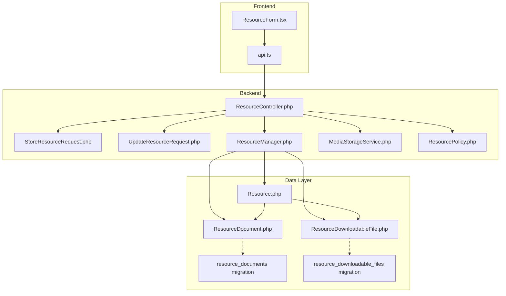
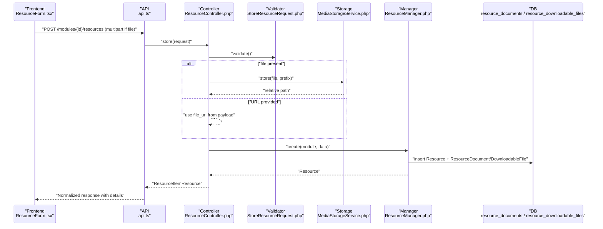
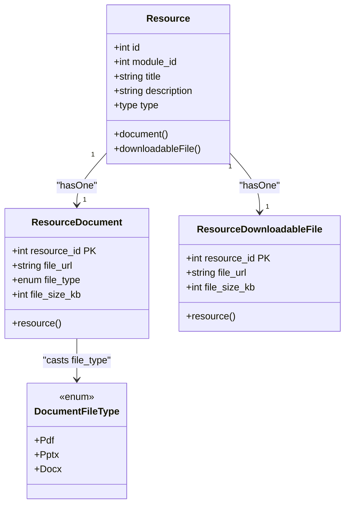
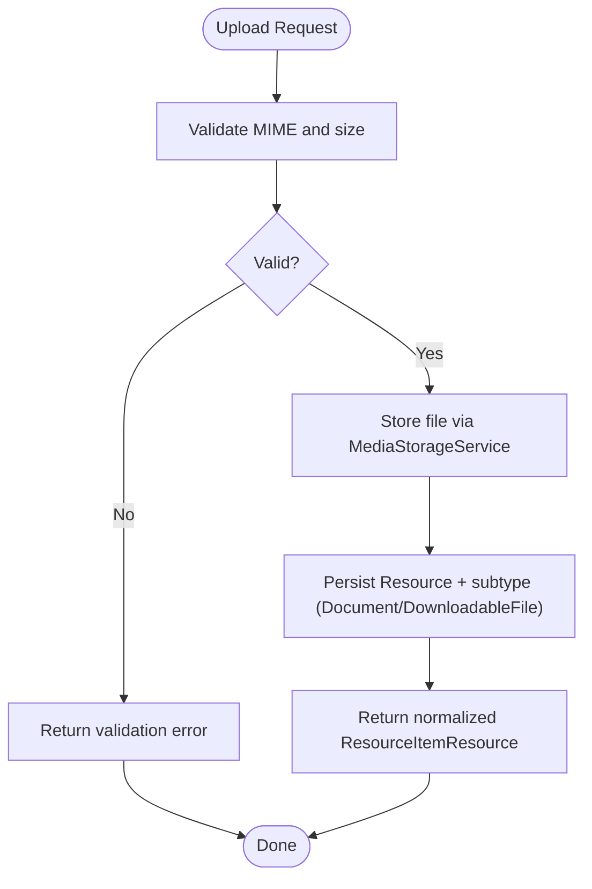
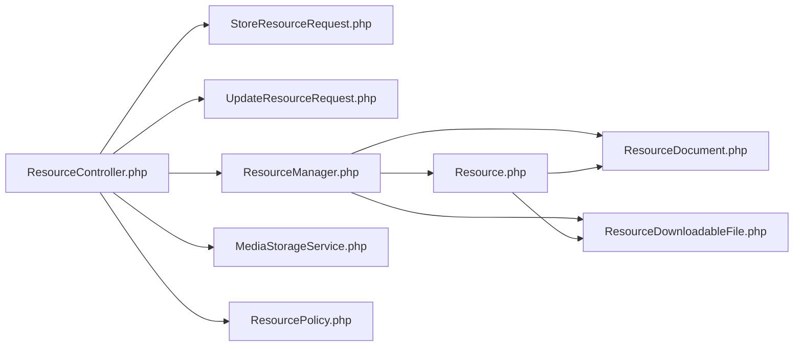

# Document Resources

<cite>
**Referenced Files in This Document**
- [Resource.php](file://app/Models/Resource.php)
- [ResourceDocument.php](file://app/Models/ResourceDocument.php)
- [ResourceDownloadableFile.php](file://app/Models/ResourceDownloadableFile.php)
- [DocumentFileType.php](file://app/Enums/DocumentFileType.php)
- [2024_01_01_000122_create_resource_documents_table.php](file://database/migrations/2024_01_01_000122_create_resource_documents_table.php)
- [2024_01_01_000127_create_resource_downloadable_files_table.php](file://database/migrations/2024_01_01_000127_create_resource_downloadable_files_table.php)
- [ResourceController.php](file://app/Http/Controllers/Api/V1/ResourceController.php)
- [StoreResourceRequest.php](file://app/Http/Requests/Api/V1/StoreResourceRequest.php)
- [UpdateResourceRequest.php](file://app/Http/Requests/Api/V1/UpdateResourceRequest.php)
- [ResourceManager.php](file://app/Services/Content/ResourceManager.php)
- [MediaStorageService.php](file://app/Services/Storage/MediaStorageService.php)
- [ResourceItemResource.php](file://app/Http/Resources/ResourceItemResource.php)
- [ResourcePolicy.php](file://app/Policies/ResourcePolicy.php)
- [ResourceForm.tsx](file://frontend/src/features/courseStructure/ResourceForm.tsx)
- [api.ts](file://frontend/src/features/courseStructure/api.ts)
</cite>

## Table of Contents
1. [Introduction](#introduction)
2. [Project Structure](#project-structure)
3. [Core Components](#core-components)
4. [Architecture Overview](#architecture-overview)
5. [Detailed Component Analysis](#detailed-component-analysis)
6. [Dependency Analysis](#dependency-analysis)
7. [Performance Considerations](#performance-considerations)
8. [Troubleshooting Guide](#troubleshooting-guide)
9. [Conclusion](#conclusion)
10. [Appendices](#appendices)

## Introduction
This document explains the data model and file-handling capabilities for document resources in the system. It focuses on:
- The ResourceDocument model and its metadata (file type, size).
- How files are validated, stored, and served via ResourceDownloadableFile.
- Storage management through a centralized storage service.
- Relationships between Resource, ResourceDocument, and ResourceDownloadableFile.
- Access control for creating, updating, and deleting document resources.
- Practical examples for uploading documents, managing versions, and controlling download permissions.

## Project Structure
The document resource feature spans models, migrations, controllers, request validators, services, policies, and frontend form logic. Key responsibilities:
- Models define typed relationships and casts for document metadata.
- Migrations define the database schema for document and downloadable file records.
- Controllers orchestrate uploads, updates, and deletions while delegating to services.
- Request classes enforce validation rules for file types and sizes.
- Services centralize storage operations and business logic for resource creation/update.
- Policies enforce authorization based on course roles.
- Frontend provides upload UI with client-side validation and multipart submission.

**Diagram sources**
- [ResourceForm.tsx:20-61](file://frontend/src/features/courseStructure/ResourceForm.tsx#L20-L61)
- [api.ts:62-87](file://frontend/src/features/courseStructure/api.ts#L62-L87)
- [ResourceController.php:25-83](file://app/Http/Controllers/Api/V1/ResourceController.php#L25-L83)
- [StoreResourceRequest.php:25-62](file://app/Http/Requests/Api/V1/StoreResourceRequest.php#L25-L62)
- [UpdateResourceRequest.php:21-38](file://app/Http/Requests/Api/V1/UpdateResourceRequest.php#L21-L38)
- [ResourceManager.php:33-178](file://app/Services/Content/ResourceManager.php#L33-L178)
- [MediaStorageService.php:32-79](file://app/Services/Storage/MediaStorageService.php#L32-L79)
- [ResourcePolicy.php:15-42](file://app/Policies/ResourcePolicy.php#L15-L42)
- [Resource.php:34-93](file://app/Models/Resource.php#L34-L93)
- [ResourceDocument.php:11-33](file://app/Models/ResourceDocument.php#L11-L33)
- [ResourceDownloadableFile.php:10-27](file://app/Models/ResourceDownloadableFile.php#L10-L27)
- [2024_01_01_000122_create_resource_documents_table.php:11-18](file://database/migrations/2024_01_01_000122_create_resource_documents_table.php#L11-L18)
- [2024_01_01_000127_create_resource_downloadable_files_table.php:11-17](file://database/migrations/2024_01_01_000127_create_resource_downloadable_files_table.php#L11-L17)

**Section sources**
- [ResourceController.php:25-83](file://app/Http/Controllers/Api/V1/ResourceController.php#L25-L83)
- [ResourceManager.php:33-178](file://app/Services/Content/ResourceManager.php#L33-L178)
- [MediaStorageService.php:32-79](file://app/Services/Storage/MediaStorageService.php#L32-L79)
- [StoreResourceRequest.php:25-62](file://app/Http/Requests/Api/V1/StoreResourceRequest.php#L25-L62)
- [UpdateResourceRequest.php:21-38](file://app/Http/Requests/Api/V1/UpdateResourceRequest.php#L21-L38)
- [ResourcePolicy.php:15-42](file://app/Policies/ResourcePolicy.php#L15-L42)
- [ResourceForm.tsx:20-61](file://frontend/src/features/courseStructure/ResourceForm.tsx#L20-L61)
- [api.ts:62-87](file://frontend/src/features/courseStructure/api.ts#L62-L87)

## Core Components
- Resource: Central entity representing any content item within a module; has one-to-one relationships to specific detail types including Document and DownloadableFile.
- ResourceDocument: Stores document-specific metadata such as file URL, file type, and file size.
- ResourceDownloadableFile: Stores generic downloadable file metadata (URL and size).
- DocumentFileType: Enumerates allowed document types (PDF, PPTX, DOCX).
- ResourceManager: Orchestrates creation and updates across resource types and their detail tables within transactions.
- MediaStorageService: Centralized storage abstraction for uploading, reading, and deleting files on a configured disk.
- ResourceController: Exposes endpoints to create, update, show, and delete resources; handles file uploads and delegates to services.
- StoreResourceRequest / UpdateResourceRequest: Validate inputs, including file types, sizes, and conditional requirements.
- ResourceItemResource: Normalizes responses by flattening subtype details into a consistent envelope.
- ResourcePolicy: Enforces role-based access for creating, updating, and deleting resources.

**Section sources**
- [Resource.php:34-93](file://app/Models/Resource.php#L34-L93)
- [ResourceDocument.php:11-33](file://app/Models/ResourceDocument.php#L11-L33)
- [ResourceDownloadableFile.php:10-27](file://app/Models/ResourceDownloadableFile.php#L10-L27)
- [DocumentFileType.php:7-12](file://app/Enums/DocumentFileType.php#L7-L12)
- [ResourceManager.php:33-178](file://app/Services/Content/ResourceManager.php#L33-L178)
- [MediaStorageService.php:32-79](file://app/Services/Storage/MediaStorageService.php#L32-L79)
- [ResourceController.php:25-83](file://app/Http/Controllers/Api/V1/ResourceController.php#L25-L83)
- [StoreResourceRequest.php:25-62](file://app/Http/Requests/Api/V1/StoreResourceRequest.php#L25-L62)
- [UpdateResourceRequest.php:21-38](file://app/Http/Requests/Api/V1/UpdateResourceRequest.php#L21-L38)
- [ResourceItemResource.php:27-97](file://app/Http/Resources/ResourceItemResource.php#L27-L97)
- [ResourcePolicy.php:15-42](file://app/Policies/ResourcePolicy.php#L15-L42)

## Architecture Overview
The document resource flow integrates frontend uploads, backend validation, centralized storage, and typed persistence.

**Diagram sources**
- [ResourceForm.tsx:20-61](file://frontend/src/features/courseStructure/ResourceForm.tsx#L20-L61)
- [api.ts:62-87](file://frontend/src/features/courseStructure/api.ts#L62-L87)
- [ResourceController.php:30-45](file://app/Http/Controllers/Api/V1/ResourceController.php#L30-L45)
- [StoreResourceRequest.php:25-62](file://app/Http/Requests/Api/V1/StoreResourceRequest.php#L25-L62)
- [MediaStorageService.php:32-41](file://app/Services/Storage/MediaStorageService.php#L32-L41)
- [ResourceManager.php:33-58](file://app/Services/Content/ResourceManager.php#L33-L58)
- [2024_01_01_000122_create_resource_documents_table.php:11-18](file://database/migrations/2024_01_01_000122_create_resource_documents_table.php#L11-L18)
- [2024_01_01_000127_create_resource_downloadable_files_table.php:11-17](file://database/migrations/2024_01_01_000127_create_resource_downloadable_files_table.php#L11-L17)

## Detailed Component Analysis

### Data Model: Resource, ResourceDocument, ResourceDownloadableFile
- Resource is the parent entity with typed relationships to detail tables. For documents, it links to ResourceDocument; for generic downloads, to ResourceDownloadableFile.
- ResourceDocument stores:
  - Primary key: resource_id (foreign key to resources)
  - file_url: string (up to 500 chars)
  - file_type: enum restricted to pdf, pptx, docx
  - file_size_kb: optional integer
- ResourceDownloadableFile stores:
  - Primary key: resource_id (foreign key to resources)
  - file_url: string (up to 500 chars)
  - file_size_kb: optional integer
- DocumentFileType enum defines allowed values for document types.

**Diagram sources**
- [Resource.php:34-93](file://app/Models/Resource.php#L34-L93)
- [ResourceDocument.php:11-33](file://app/Models/ResourceDocument.php#L11-L33)
- [ResourceDownloadableFile.php:10-27](file://app/Models/ResourceDownloadableFile.php#L10-L27)
- [DocumentFileType.php:7-12](file://app/Enums/DocumentFileType.php#L7-L12)
- [2024_01_01_000122_create_resource_documents_table.php:11-18](file://database/migrations/2024_01_01_000122_create_resource_documents_table.php#L11-L18)
- [2024_01_01_000127_create_resource_downloadable_files_table.php:11-17](file://database/migrations/2024_01_01_000127_create_resource_downloadable_files_table.php#L11-L17)

**Section sources**
- [Resource.php:34-93](file://app/Models/Resource.php#L34-L93)
- [ResourceDocument.php:11-33](file://app/Models/ResourceDocument.php#L11-L33)
- [ResourceDownloadableFile.php:10-27](file://app/Models/ResourceDownloadableFile.php#L10-L27)
- [DocumentFileType.php:7-12](file://app/Enums/DocumentFileType.php#L7-L12)
- [2024_01_01_000122_create_resource_documents_table.php:11-18](file://database/migrations/2024_01_01_000122_create_resource_documents_table.php#L11-L18)
- [2024_01_01_000127_create_resource_downloadable_files_table.php:11-17](file://database/migrations/2024_01_01_000127_create_resource_downloadable_files_table.php#L11-L17)

### File Handling and Validation
- Upload path:
  - Frontend accepts either a file or a URL for document/downloadable/scorm types.
  - If a file is selected, it is sent as multipart form data.
  - Backend validates MIME types and maximum file size.
  - Uploaded files are stored via MediaStorageService under a per-course prefix.
  - On update, previous files are deleted before storing new ones.
- Validation rules:
  - Allowed MIME types include common document formats.
  - Maximum file size enforced server-side.
  - For document type, file_type must be one of the allowed enums when present.
- Response normalization:
  - Responses flatten subtype fields into a details object.
  - Stored paths are converted to public URLs using the storage service.

**Diagram sources**
- [ResourceForm.tsx:20-61](file://frontend/src/features/courseStructure/ResourceForm.tsx#L20-L61)
- [api.ts:62-87](file://frontend/src/features/courseStructure/api.ts#L62-L87)
- [StoreResourceRequest.php:25-62](file://app/Http/Requests/Api/V1/StoreResourceRequest.php#L25-L62)
- [UpdateResourceRequest.php:21-38](file://app/Http/Requests/Api/V1/UpdateResourceRequest.php#L21-L38)
- [ResourceController.php:30-66](file://app/Http/Controllers/Api/V1/ResourceController.php#L30-L66)
- [MediaStorageService.php:32-79](file://app/Services/Storage/MediaStorageService.php#L32-L79)
- [ResourceItemResource.php:61-97](file://app/Http/Resources/ResourceItemResource.php#L61-L97)

**Section sources**
- [StoreResourceRequest.php:25-62](file://app/Http/Requests/Api/V1/StoreResourceRequest.php#L25-L62)
- [UpdateResourceRequest.php:21-38](file://app/Http/Requests/Api/V1/UpdateResourceRequest.php#L21-L38)
- [ResourceController.php:30-66](file://app/Http/Controllers/Api/V1/ResourceController.php#L30-L66)
- [MediaStorageService.php:32-79](file://app/Services/Storage/MediaStorageService.php#L32-L79)
- [ResourceItemResource.php:61-97](file://app/Http/Resources/ResourceItemResource.php#L61-L97)

### Storage Management
- Centralized storage service:
  - All uploads go through a single service that writes to a configured disk.
  - Provides methods to store files, put raw content, delete files, and resolve public URLs.
  - Detects external URLs and passes them through unchanged.
- Prefixing:
  - Files are stored under a per-course prefix to isolate content.
- Deletion:
  - On update, old files are deleted before saving new ones to avoid orphaned assets.

**Section sources**
- [MediaStorageService.php:32-79](file://app/Services/Storage/MediaStorageService.php#L32-L79)
- [ResourceController.php:53-61](file://app/Http/Controllers/Api/V1/ResourceController.php#L53-L61)

### Access Control
- Authorization:
  - Creating, updating, and deleting resources requires appropriate roles.
  - Policy checks ensure only admins or instructors teaching the course can manage resources.
- Read access:
  - Listing/showing resources is not gated by policy in the controller shown; read flows typically rely on route-level auth and module visibility elsewhere.

**Section sources**
- [ResourcePolicy.php:15-42](file://app/Policies/ResourcePolicy.php#L15-L42)
- [StoreResourceRequest.php:20-23](file://app/Http/Requests/Api/V1/StoreResourceRequest.php#L20-L23)
- [UpdateResourceRequest.php:16-19](file://app/Http/Requests/Api/V1/UpdateResourceRequest.php#L16-L19)
- [ResourceController.php:77-83](file://app/Http/Controllers/Api/V1/ResourceController.php#L77-L83)

### Examples

#### Uploading a Document
- Frontend:
  - User selects a file or pastes a URL.
  - If a file is chosen, it is sent as multipart form data with the resource payload.
- Backend:
  - Validates MIME types and size limits.
  - Stores the file via the storage service under a per-course prefix.
  - Creates a Resource and a ResourceDocument with metadata.
- Result:
  - Returns a normalized resource with details containing file_url, file_type, and file_size_kb.

**Section sources**
- [ResourceForm.tsx:20-61](file://frontend/src/features/courseStructure/ResourceForm.tsx#L20-L61)
- [api.ts:62-87](file://frontend/src/features/courseStructure/api.ts#L62-L87)
- [StoreResourceRequest.php:25-62](file://app/Http/Requests/Api/V1/StoreResourceRequest.php#L25-L62)
- [ResourceController.php:30-45](file://app/Http/Controllers/Api/V1/ResourceController.php#L30-L45)
- [ResourceManager.php:101-141](file://app/Services/Content/ResourceManager.php#L101-L141)
- [ResourceItemResource.php:71-75](file://app/Http/Resources/ResourceItemResource.php#L71-L75)

#### Managing File Versions
- Update flow:
  - When updating a document resource with a new file, the previous file is deleted before storing the replacement.
  - Metadata (file_url, file_type, file_size_kb) is updated accordingly.
- Behavior:
  - Ensures no orphaned files remain after replacement.
  - Maintains a single current version per resource at the application level.

**Section sources**
- [ResourceController.php:48-66](file://app/Http/Controllers/Api/V1/ResourceController.php#L48-L66)
- [MediaStorageService.php:55-62](file://app/Services/Storage/MediaStorageService.php#L55-L62)
- [ResourceManager.php:147-178](file://app/Services/Content/ResourceManager.php#L147-L178)

#### Controlling Download Permissions
- Creation/update/delete:
  - Only authorized users (admins or course instructors) can modify resources.
- Reading/downloading:
  - The controller exposes a show endpoint that returns normalized details including the resolved file URL.
  - Actual enforcement of who can view/download depends on higher-level module/resource visibility and authentication; the controller authorizes destructive actions explicitly.

**Section sources**
- [ResourcePolicy.php:15-42](file://app/Policies/ResourcePolicy.php#L15-L42)
- [ResourceController.php:25-28](file://app/Http/Controllers/Api/V1/ResourceController.php#L25-L28)
- [ResourceController.php:77-83](file://app/Http/Controllers/Api/V1/ResourceController.php#L77-L83)
- [ResourceItemResource.php:71-75](file://app/Http/Resources/ResourceItemResource.php#L71-L75)

## Dependency Analysis

**Diagram sources**
- [ResourceController.php:25-83](file://app/Http/Controllers/Api/V1/ResourceController.php#L25-L83)
- [StoreResourceRequest.php:25-62](file://app/Http/Requests/Api/V1/StoreResourceRequest.php#L25-L62)
- [UpdateResourceRequest.php:21-38](file://app/Http/Requests/Api/V1/UpdateResourceRequest.php#L21-L38)
- [ResourceManager.php:33-178](file://app/Services/Content/ResourceManager.php#L33-L178)
- [MediaStorageService.php:32-79](file://app/Services/Storage/MediaStorageService.php#L32-L79)
- [ResourcePolicy.php:15-42](file://app/Policies/ResourcePolicy.php#L15-L42)
- [Resource.php:34-93](file://app/Models/Resource.php#L34-L93)
- [ResourceDocument.php:11-33](file://app/Models/ResourceDocument.php#L11-L33)
- [ResourceDownloadableFile.php:10-27](file://app/Models/ResourceDownloadableFile.php#L10-L27)

**Section sources**
- [ResourceController.php:25-83](file://app/Http/Controllers/Api/V1/ResourceController.php#L25-L83)
- [ResourceManager.php:33-178](file://app/Services/Content/ResourceManager.php#L33-L178)
- [MediaStorageService.php:32-79](file://app/Services/Storage/MediaStorageService.php#L32-L79)
- [ResourcePolicy.php:15-42](file://app/Policies/ResourcePolicy.php#L15-L42)

## Performance Considerations
- Single storage service reduces duplication and ensures consistent URL resolution.
- Using per-course prefixes avoids large directory scans and improves storage performance.
- Deleting old files on update prevents orphaned assets and keeps storage lean.
- Server-side validation minimizes unnecessary uploads and reduces bandwidth usage.
- Normalized responses reduce payload complexity and simplify client handling.

[No sources needed since this section provides general guidance]

## Troubleshooting Guide
- Validation errors:
  - Ensure MIME types match allowed list and file size does not exceed limits.
  - For document type, provide a valid file_type when uploading.
- Upload failures:
  - Check storage configuration and disk availability.
  - Verify that the storage prefix resolves correctly.
- Orphaned files:
  - Confirm that update flows delete previous files before storing replacements.
- Access denied:
  - Verify user role and course association for modification actions.

**Section sources**
- [StoreResourceRequest.php:25-62](file://app/Http/Requests/Api/V1/StoreResourceRequest.php#L25-L62)
- [UpdateResourceRequest.php:21-38](file://app/Http/Requests/Api/V1/UpdateResourceRequest.php#L21-L38)
- [MediaStorageService.php:32-79](file://app/Services/Storage/MediaStorageService.php#L32-L79)
- [ResourcePolicy.php:15-42](file://app/Policies/ResourcePolicy.php#L15-L42)

## Conclusion
The document resource feature uses a clean separation of concerns: typed models for metadata, centralized storage for file handling, strict validation for safety, and policies for secure access. ResourceDocument captures document-specific metadata, while ResourceDownloadableFile supports generic downloadable assets. Together with ResourceManager and MediaStorageService, they provide a robust foundation for uploading, versioning, and serving documents securely and efficiently.

[No sources needed since this section summarizes without analyzing specific files]

## Appendices

### API Payload Summary for Documents and Downloadable Files
- Common fields:
  - type: document | downloadable_file
  - title: string
  - description: optional string
  - is_required: optional boolean
  - order_index: optional integer
- Document-specific:
  - file_url: optional URL (required if no file uploaded)
  - file: optional file (mimes include pdf, doc, docx, ppt, pptx, xls, xlsx, zip, csv, txt; max size enforced)
  - file_type: required for document type (pdf, pptx, docx)
  - file_size_kb: optional integer
- Downloadable file-specific:
  - file_url: optional URL (required if no file uploaded)
  - file: optional file (same MIME and size constraints)
  - file_size_kb: optional integer

**Section sources**
- [StoreResourceRequest.php:25-62](file://app/Http/Requests/Api/V1/StoreResourceRequest.php#L25-L62)
- [UpdateResourceRequest.php:21-38](file://app/Http/Requests/Api/V1/UpdateResourceRequest.php#L21-L38)
- [ResourceItemResource.php:71-95](file://app/Http/Resources/ResourceItemResource.php#L71-L95)