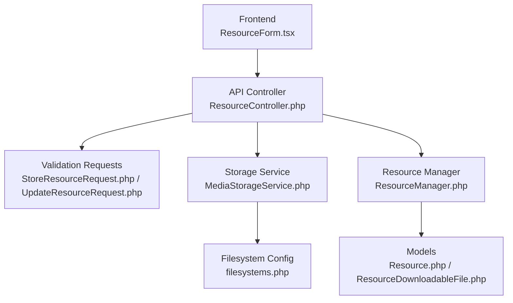
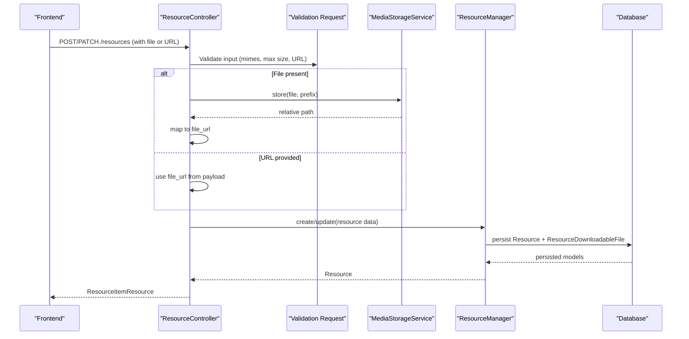
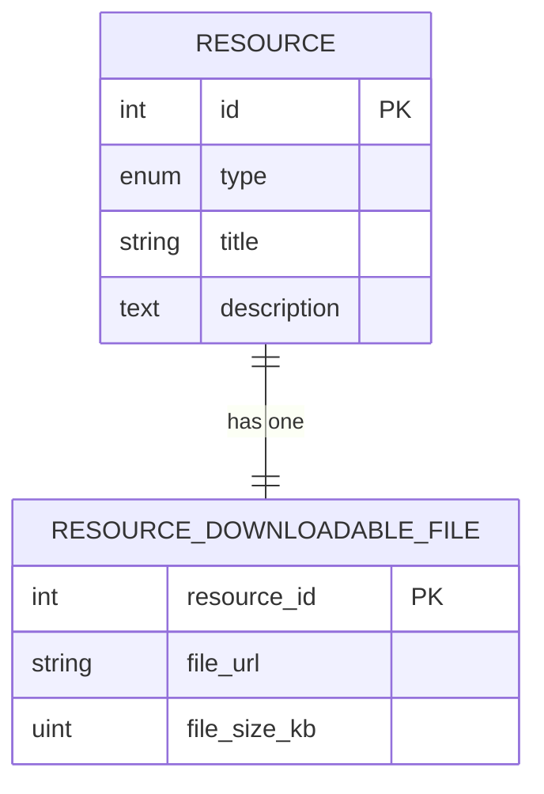
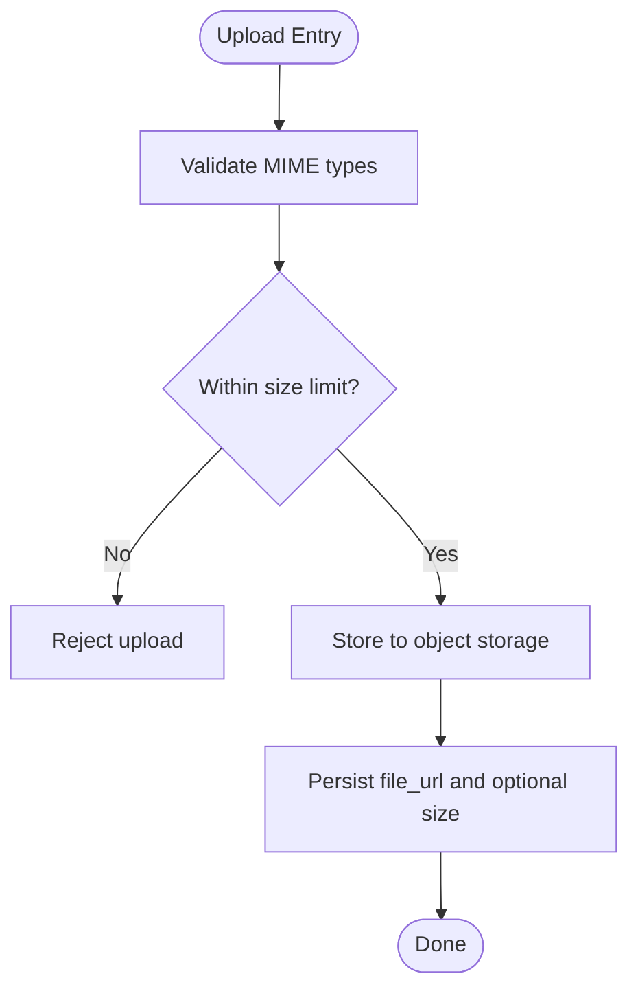
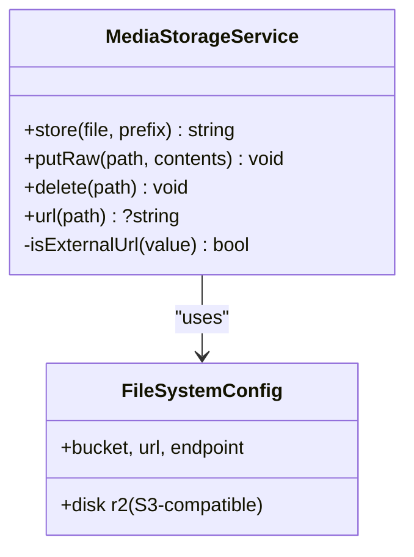
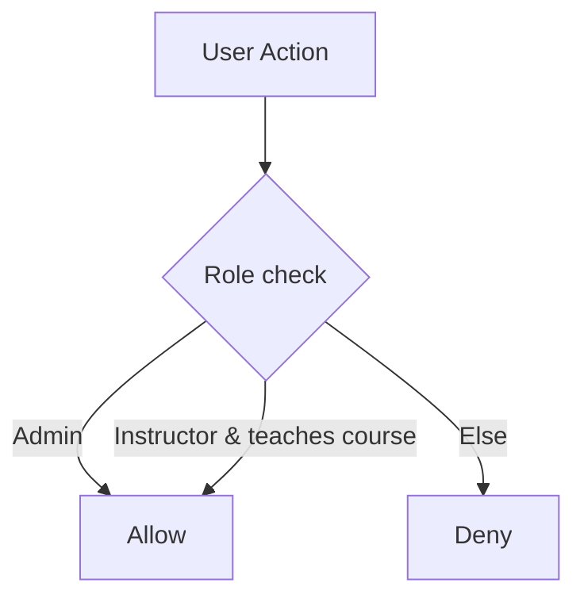
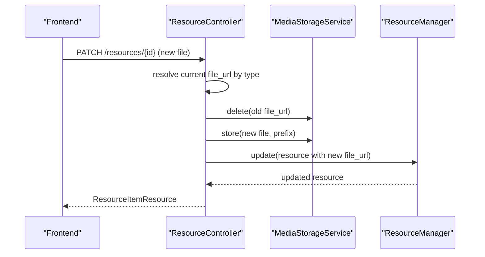
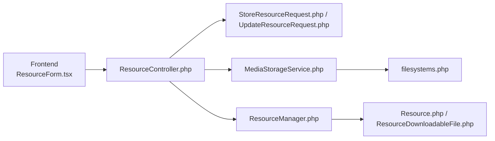

# Downloadable File Resources

<cite>
**Referenced Files in This Document**
- [ResourceDownloadableFile.php](file://app/Models/ResourceDownloadableFile.php)
- [2024_01_01_000127_create_resource_downloadable_files_table.php](file://database/migrations/2024_01_01_000127_create_resource_downloadable_files_table.php)
- [Resource.php](file://app/Models/Resource.php)
- [ResourceController.php](file://app/Http/Controllers/Api/V1/ResourceController.php)
- [StoreResourceRequest.php](file://app/Http/Requests/Api/V1/StoreResourceRequest.php)
- [UpdateResourceRequest.php](file://app/Http/Requests/Api/V1/UpdateResourceRequest.php)
- [ResourceManager.php](file://app/Services/Content/ResourceManager.php)
- [MediaStorageService.php](file://app/Services/Storage/MediaStorageService.php)
- [filesystems.php](file://config/filesystems.php)
- [ResourceForm.tsx](file://frontend/src/features/courseStructure/ResourceForm.tsx)
- [formData.ts](file://frontend/src/lib/api/formData.ts)
- [api.ts](file://frontend/src/features/courseStructure/api.ts)
- [ResourcePolicy.php](file://app/Policies/ResourcePolicy.php)
</cite>

## Table of Contents
1. Introduction
2. Project Structure
3. Core Components
4. Architecture Overview
5. Detailed Component Analysis
6. Dependency Analysis
7. Performance Considerations
8. Troubleshooting Guide
9. Conclusion

## Introduction
This document explains the downloadable file resource functionality, focusing on the ResourceDownloadableFile model and how files are uploaded, validated, stored, and served. It covers format validation, size restrictions, secure storage via a cloud object store, access control for managing resources, and how to manage versions when replacing files. It also outlines where download statistics could be tracked and provides practical examples for uploading and updating downloadable files through the API.

## Project Structure
The downloadable file feature is part of a polymorphic resource system. A Resource can be one of several types; for downloadable files, a one-to-one detail record stores the file URL and optional size metadata. Uploads go through a centralized storage service that writes to a configured disk (Cloudflare R2). The frontend supports both direct uploads and pasting external URLs.

**Diagram sources**
- [ResourceForm.tsx:20-61](file://frontend/src/features/courseStructure/ResourceForm.tsx#L20-L61)
- [ResourceController.php:30-66](file://app/Http/Controllers/Api/V1/ResourceController.php#L30-L66)
- [StoreResourceRequest.php:25-63](file://app/Http/Requests/Api/V1/StoreResourceRequest.php#L25-L63)
- [UpdateResourceRequest.php:21-55](file://app/Http/Requests/Api/V1/UpdateResourceRequest.php#L21-L55)
- [MediaStorageService.php:32-79](file://app/Services/Storage/MediaStorageService.php#L32-L79)
- [ResourceManager.php:33-84](file://app/Services/Content/ResourceManager.php#L33-L84)
- [Resource.php:87-93](file://app/Models/Resource.php#L87-L93)
- [ResourceDownloadableFile.php:10-27](file://app/Models/ResourceDownloadableFile.php#L10-L27)
- [filesystems.php:75-86](file://config/filesystems.php#L75-L86)

**Section sources**
- [Resource.php:87-93](file://app/Models/Resource.php#L87-L93)
- [ResourceDownloadableFile.php:10-27](file://app/Models/ResourceDownloadableFile.php#L10-L27)
- [2024_01_01_000127_create_resource_downloadable_files_table.php:11-18](file://database/migrations/2024_01_01_000127_create_resource_downloadable_files_table.php#L11-L18)
- [ResourceController.php:30-66](file://app/Http/Controllers/Api/V1/ResourceController.php#L30-L66)
- [StoreResourceRequest.php:25-63](file://app/Http/Requests/Api/V1/StoreResourceRequest.php#L25-L63)
- [UpdateResourceRequest.php:21-55](file://app/Http/Requests/Api/V1/UpdateResourceRequest.php#L21-L55)
- [ResourceManager.php:101-178](file://app/Services/Content/ResourceManager.php#L101-L178)
- [MediaStorageService.php:32-79](file://app/Services/Storage/MediaStorageService.php#L32-L79)
- [filesystems.php:75-86](file://config/filesystems.php#L75-L86)
- [ResourceForm.tsx:20-61](file://frontend/src/features/courseStructure/ResourceForm.tsx#L20-L61)
- [formData.ts:11-37](file://frontend/src/lib/api/formData.ts#L11-L37)
- [api.ts:75-86](file://frontend/src/features/courseStructure/api.ts#L75-L86)

## Core Components
- ResourceDownloadableFile model: Stores the file URL and optional file size in kilobytes for a downloadable resource. It uses the resource’s primary key as its own primary key and belongs to Resource.
- Resource model: Declares a one-to-one relationship to ResourceDownloadableFile for the downloadable type.
- Storage service: Centralizes upload, delete, and URL resolution against a configured disk (R2), handling both relative paths and external URLs.
- Resource controller: Orchestrates create/update flows, handles file uploads vs URL inputs, deletes old files when replaced, and delegates persistence to the resource manager.
- Validation requests: Enforce allowed MIME types and maximum sizes for uploads; require either an uploaded file or a valid URL for downloadable resources.
- Resource manager: Creates/updates the appropriate subtype table (including downloadable files) and keeps module item ordering and required flags in sync within transactions.
- Frontend form: Supports selecting a file or pasting a URL, with client-side size checks and accepted extensions.

**Section sources**
- [ResourceDownloadableFile.php:10-27](file://app/Models/ResourceDownloadableFile.php#L10-L27)
- [Resource.php:87-93](file://app/Models/Resource.php#L87-L93)
- [MediaStorageService.php:32-79](file://app/Services/Storage/MediaStorageService.php#L32-L79)
- [ResourceController.php:30-66](file://app/Http/Controllers/Api/V1/ResourceController.php#L30-L66)
- [StoreResourceRequest.php:25-63](file://app/Http/Requests/Api/V1/StoreResourceRequest.php#L25-L63)
- [UpdateResourceRequest.php:21-55](file://app/Http/Requests/Api/V1/UpdateResourceRequest.php#L21-L55)
- [ResourceManager.php:101-178](file://app/Services/Content/ResourceManager.php#L101-L178)
- [ResourceForm.tsx:20-61](file://frontend/src/features/courseStructure/ResourceForm.tsx#L20-L61)

## Architecture Overview
The end-to-end flow for creating or updating a downloadable resource involves frontend validation, server-side request validation, optional file upload to object storage, and persistence of the resource and its downloadable file metadata.

**Diagram sources**
- [ResourceController.php:30-66](file://app/Http/Controllers/Api/V1/ResourceController.php#L30-L66)
- [StoreResourceRequest.php:25-63](file://app/Http/Requests/Api/V1/StoreResourceRequest.php#L25-L63)
- [UpdateResourceRequest.php:21-55](file://app/Http/Requests/Api/V1/UpdateResourceRequest.php#L21-L55)
- [MediaStorageService.php:32-79](file://app/Services/Storage/MediaStorageService.php#L32-L79)
- [ResourceManager.php:33-84](file://app/Services/Content/ResourceManager.php#L33-L84)

## Detailed Component Analysis

### Data Model: ResourceDownloadableFile
- Primary key: resource_id (one-to-one with Resource)
- Fields:
  - file_url: string (up to 500 characters)
  - file_size_kb: unsigned integer, nullable
- Relationship: belongsTo Resource

**Diagram sources**
- [Resource.php:87-93](file://app/Models/Resource.php#L87-L93)
- [ResourceDownloadableFile.php:10-27](file://app/Models/ResourceDownloadableFile.php#L10-L27)
- [2024_01_01_000127_create_resource_downloadable_files_table.php:11-18](file://database/migrations/2024_01_01_000127_create_resource_downloadable_files_table.php#L11-L18)

**Section sources**
- [ResourceDownloadableFile.php:10-27](file://app/Models/ResourceDownloadableFile.php#L10-L27)
- [2024_01_01_000127_create_resource_downloadable_files_table.php:11-18](file://database/migrations/2024_01_01_000127_create_resource_downloadable_files_table.php#L11-L18)

### Upload Handling and Validation
- Allowed MIME types for downloadable files: pdf, doc, docx, ppt, pptx, xls, xlsx, zip, csv, txt
- Maximum upload size: 20 MB per file
- Either an uploaded file or a valid URL must be provided; if both are present, the uploaded file takes precedence
- Frontend enforces a 20 MB limit and accepts the same extensions

**Diagram sources**
- [StoreResourceRequest.php:39-44](file://app/Http/Requests/Api/V1/StoreResourceRequest.php#L39-L44)
- [UpdateResourceRequest.php:33-38](file://app/Http/Requests/Api/V1/UpdateResourceRequest.php#L33-L38)
- [ResourceForm.tsx:20-61](file://frontend/src/features/courseStructure/ResourceForm.tsx#L20-L61)

**Section sources**
- [StoreResourceRequest.php:39-44](file://app/Http/Requests/Api/V1/StoreResourceRequest.php#L39-L44)
- [UpdateResourceRequest.php:33-38](file://app/Http/Requests/Api/V1/UpdateResourceRequest.php#L33-L38)
- [ResourceForm.tsx:20-61](file://frontend/src/features/courseStructure/ResourceForm.tsx#L20-L61)

### Secure Storage and Serving
- All uploads go through MediaStorageService, which writes to the configured disk (R2) under a course-scoped prefix
- Relative paths are stored in the database; public URLs are resolved at read time via the storage service
- External URLs are passed through unchanged, enabling legacy “paste a URL” workflows
- Deletion removes only owned relative paths; external URLs are ignored

**Diagram sources**
- [MediaStorageService.php:32-79](file://app/Services/Storage/MediaStorageService.php#L32-L79)
- [filesystems.php:75-86](file://config/filesystems.php#L75-L86)

**Section sources**
- [MediaStorageService.php:32-79](file://app/Services/Storage/MediaStorageService.php#L32-L79)
- [filesystems.php:75-86](file://config/filesystems.php#L75-L86)

### Access Control
- Creating, updating, and deleting resources is authorized by ResourcePolicy based on user role and course membership
- Only admins or instructors teaching the course can manage resources

**Diagram sources**
- [ResourcePolicy.php:15-42](file://app/Policies/ResourcePolicy.php#L15-L42)

**Section sources**
- [ResourcePolicy.php:15-42](file://app/Policies/ResourcePolicy.php#L15-L42)

### Version Management (Replacing Files)
- When updating a downloadable resource with a new file, the previous file is deleted before storing the replacement
- The controller maps the current file URL based on resource type and calls the storage service to remove it prior to upload

**Diagram sources**
- [ResourceController.php:48-66](file://app/Http/Controllers/Api/V1/ResourceController.php#L48-L66)
- [MediaStorageService.php:55-62](file://app/Services/Storage/MediaStorageService.php#L55-L62)
- [ResourceManager.php:64-84](file://app/Services/Content/ResourceManager.php#L64-L84)

**Section sources**
- [ResourceController.php:48-66](file://app/Http/Controllers/Api/V1/ResourceController.php#L48-L66)
- [MediaStorageService.php:55-62](file://app/Services/Storage/MediaStorageService.php#L55-L62)
- [ResourceManager.php:64-84](file://app/Services/Content/ResourceManager.php#L64-L84)

### API Usage Examples
- Create a downloadable resource:
  - Method: POST /modules/{moduleId}/resources
  - Body fields: type=downloadable_file, title, description, and either file (multipart) or file_url
  - If file is provided, it must match allowed MIME types and size limits
- Update a downloadable resource:
  - Method: PATCH /resources/{resourceId}
  - Provide a new file to replace the existing one; the old file will be deleted automatically
- Delete a downloadable resource:
  - Method: DELETE /resources/{resourceId}
  - Requires authorization per policy

Frontend helpers:
- Multipart form builder converts fields to FormData, including proper boolean encoding
- Resource API functions detect file presence and send multipart requests accordingly

**Section sources**
- [StoreResourceRequest.php:25-63](file://app/Http/Requests/Api/V1/StoreResourceRequest.php#L25-L63)
- [UpdateResourceRequest.php:21-55](file://app/Http/Requests/Api/V1/UpdateResourceRequest.php#L21-L55)
- [ResourceController.php:30-84](file://app/Http/Controllers/Api/V1/ResourceController.php#L30-L84)
- [formData.ts:11-37](file://frontend/src/lib/api/formData.ts#L11-L37)
- [api.ts:75-86](file://frontend/src/features/courseStructure/api.ts#L75-L86)

### Tracking Download Statistics
- There is no built-in download tracking for downloadable files in the current implementation
- To add statistics, introduce a lightweight audit log or event table capturing user, timestamp, and resource_id on each download, then expose analytics endpoints

[No sources needed since this section proposes future enhancements not present in the codebase]

## Dependency Analysis
The following diagram shows how components depend on each other during resource operations.

**Diagram sources**
- [ResourceForm.tsx:20-61](file://frontend/src/features/courseStructure/ResourceForm.tsx#L20-L61)
- [ResourceController.php:30-66](file://app/Http/Controllers/Api/V1/ResourceController.php#L30-L66)
- [StoreResourceRequest.php:25-63](file://app/Http/Requests/Api/V1/StoreResourceRequest.php#L25-L63)
- [UpdateResourceRequest.php:21-55](file://app/Http/Requests/Api/V1/UpdateResourceRequest.php#L21-L55)
- [MediaStorageService.php:32-79](file://app/Services/Storage/MediaStorageService.php#L32-L79)
- [ResourceManager.php:33-84](file://app/Services/Content/ResourceManager.php#L33-L84)
- [Resource.php:87-93](file://app/Models/Resource.php#L87-L93)
- [ResourceDownloadableFile.php:10-27](file://app/Models/ResourceDownloadableFile.php#L10-L27)
- [filesystems.php:75-86](file://config/filesystems.php#L75-L86)

**Section sources**
- [ResourceController.php:30-66](file://app/Http/Controllers/Api/V1/ResourceController.php#L30-L66)
- [ResourceManager.php:33-84](file://app/Services/Content/ResourceManager.php#L33-L84)
- [MediaStorageService.php:32-79](file://app/Services/Storage/MediaStorageService.php#L32-L79)
- [StoreResourceRequest.php:25-63](file://app/Http/Requests/Api/V1/StoreResourceRequest.php#L25-L63)
- [UpdateResourceRequest.php:21-55](file://app/Http/Requests/Api/V1/UpdateResourceRequest.php#L21-L55)
- [Resource.php:87-93](file://app/Models/Resource.php#L87-L93)
- [ResourceDownloadableFile.php:10-27](file://app/Models/ResourceDownloadableFile.php#L10-L27)
- [filesystems.php:75-86](file://config/filesystems.php#L75-L86)

## Performance Considerations
- Keep file sizes within the enforced limits to avoid large transfers and long upload times
- Use the object storage disk (R2) for scalable, high-throughput storage
- Avoid unnecessary re-uploads by checking for changes before triggering updates
- Consider caching public URLs at the edge (CDN) if serving frequently accessed files

[No sources needed since this section provides general guidance]

## Troubleshooting Guide
- Upload rejected due to invalid MIME type: Ensure the file extension matches allowed types for downloadable resources
- Upload rejected due to size: Confirm the file is under the 20 MB limit on both frontend and backend
- URL not resolving: Verify the stored value is either a valid external URL or a relative path resolvable by the configured disk
- Old file not deleted on update: Confirm the controller resolves the correct current file URL for the resource type before deletion
- Authorization errors: Ensure the user has admin rights or is an instructor teaching the course associated with the resource

**Section sources**
- [StoreResourceRequest.php:39-44](file://app/Http/Requests/Api/V1/StoreResourceRequest.php#L39-L44)
- [UpdateResourceRequest.php:33-38](file://app/Http/Requests/Api/V1/UpdateResourceRequest.php#L33-L38)
- [MediaStorageService.php:55-79](file://app/Services/Storage/MediaStorageService.php#L55-L79)
- [ResourceController.php:48-75](file://app/Http/Controllers/Api/V1/ResourceController.php#L48-L75)
- [ResourcePolicy.php:15-42](file://app/Policies/ResourcePolicy.php#L15-L42)

## Conclusion
The downloadable file resource feature provides a robust, extensible way to attach files to learning modules. It combines strict validation, centralized storage, and clear relationships between resources and their file metadata. While downloads are currently served directly via stored URLs, adding authentication-gated delivery and download tracking would further enhance security and observability.

[No sources needed since this section summarizes without analyzing specific files]