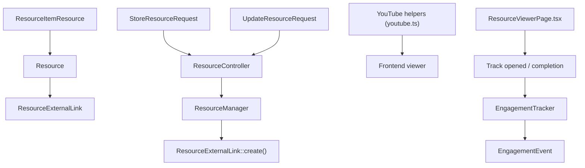
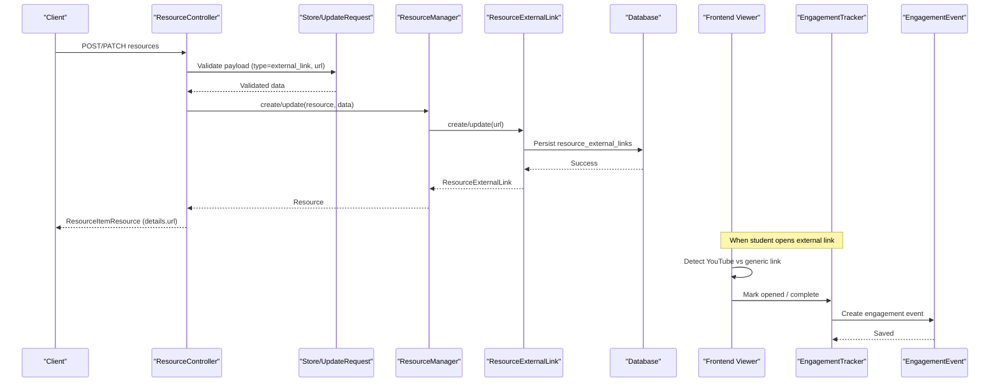
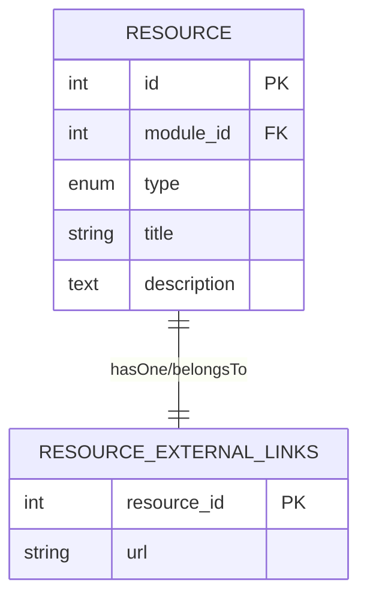
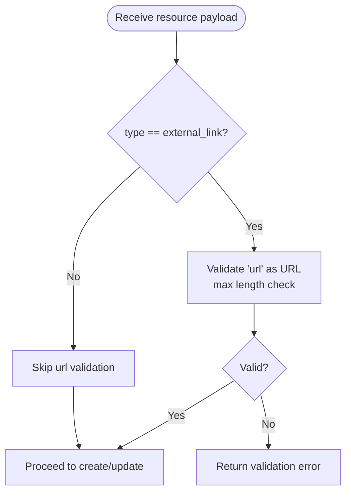
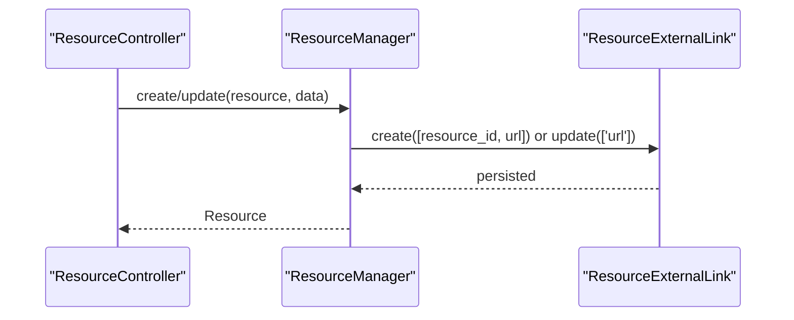
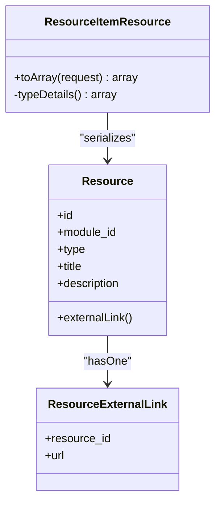
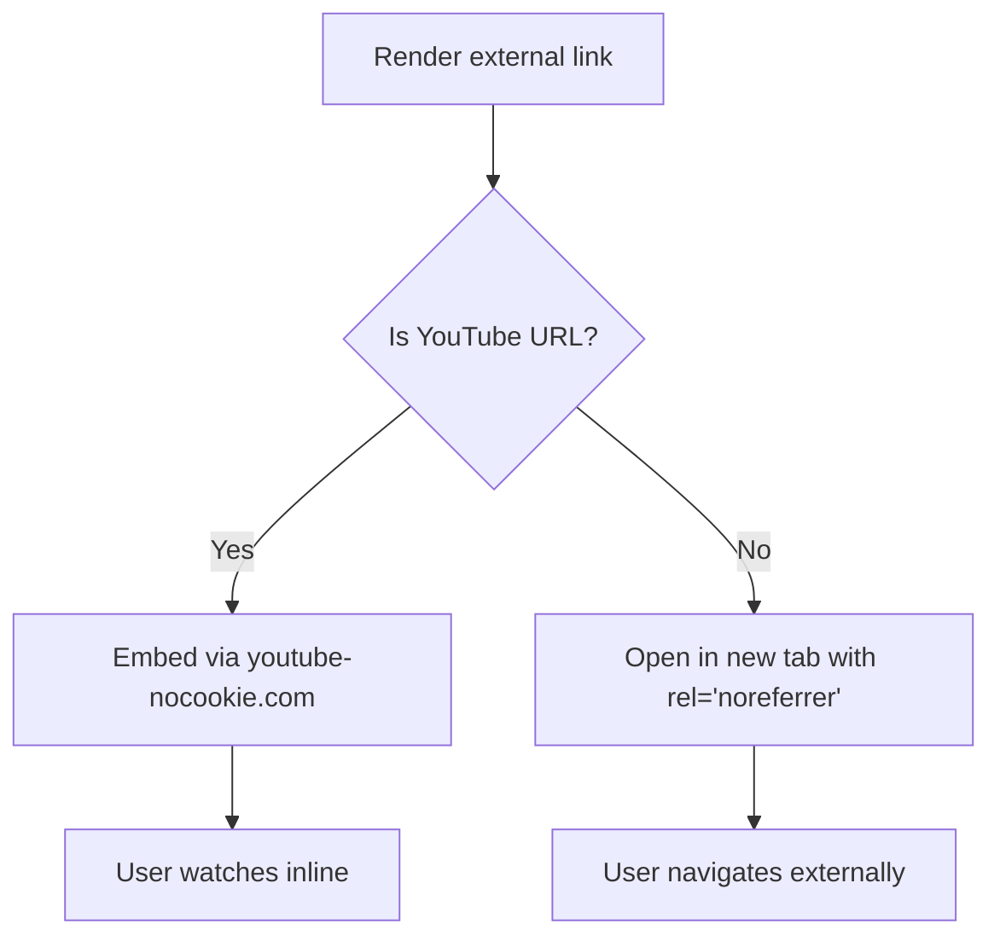
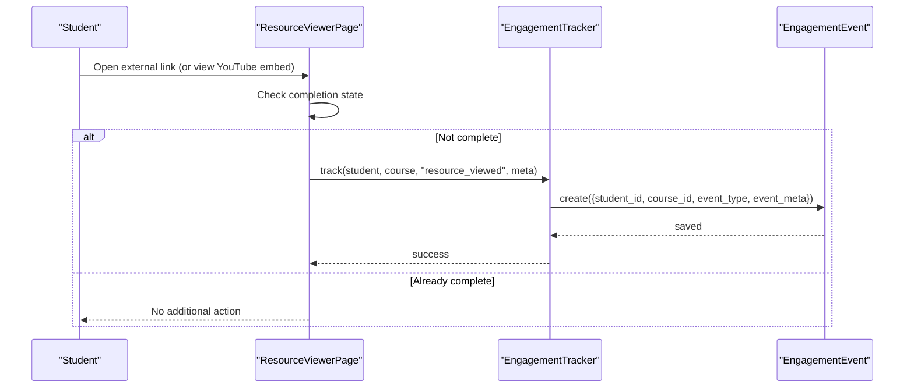
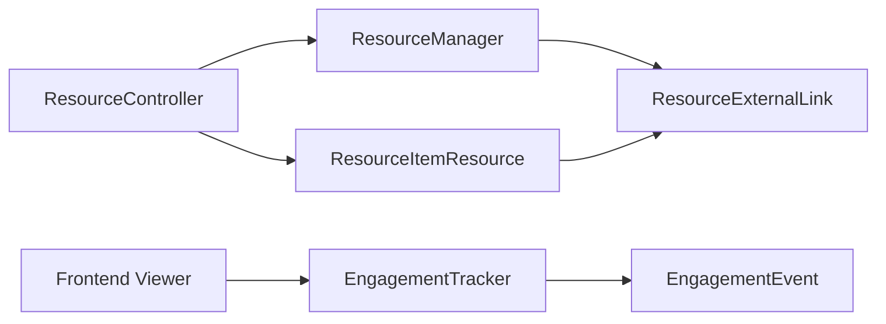

# External Link Resources

<cite>
**Referenced Files in This Document**
- [ResourceExternalLink.php](file://app/Models/ResourceExternalLink.php)
- [2024_01_01_000124_create_resource_external_links_table.php](file://database/migrations/2024_01_01_000124_create_resource_external_links_table.php)
- [Resource.php](file://app/Models/Resource.php)
- [StoreResourceRequest.php](file://app/Http/Requests/Api/V1/StoreResourceRequest.php)
- [UpdateResourceRequest.php](file://app/Http/Requests/Api/V1/UpdateResourceRequest.php)
- [ResourceManager.php](file://app/Services/Content/ResourceManager.php)
- [ResourceController.php](file://app/Http/Controllers/Api/V1/ResourceController.php)
- [ResourceItemResource.php](file://app/Http/Resources/ResourceItemResource.php)
- [EngagementTracker.php](file://app/Services/Analytics/EngagementTracker.php)
- [EngagementEvent.php](file://app/Models/EngagementEvent.php)
- [youtube.ts](file://frontend/src/lib/youtube.ts)
- [ResourceViewerPage.tsx](file://frontend/src/features/learning/ResourceViewerPage.tsx)
</cite>

## Table of Contents
1. Introduction
2. Project Structure
3. Core Components
4. Architecture Overview
5. Detailed Component Analysis
6. Dependency Analysis
7. Performance Considerations
8. Troubleshooting Guide
9. Conclusion

## Introduction
This document explains the external link resource functionality, focusing on the ResourceExternalLink model and how URLs are managed, validated, presented, and tracked. It covers:
- Data model for external links
- URL validation rules at the API layer
- How external links are created and updated through the resource pipeline
- Security considerations when opening or embedding external content
- Click tracking and engagement logging to monitor student interaction with external resources
- Examples for adding external resources, validating URLs, and monitoring engagement

## Project Structure
External link resources are part of a unified resource system that supports multiple content types (video, document, reading, external link, SCORM, live session, downloadable file). The external link type is stored in its own detail table linked to the core Resource entity.

**Diagram sources**
- [Resource.php:63-69](file://app/Models/Resource.php#L63-L69)
- [ResourceExternalLink.php:10-27](file://app/Models/ResourceExternalLink.php#L10-L27)
- [ResourceController.php:25-66](file://app/Http/Controllers/Api/V1/ResourceController.php#L25-L66)
- [ResourceManager.php:33-58](file://app/Services/Content/ResourceManager.php#L33-L58)
- [ResourceManager.php:101-142](file://app/Services/Content/ResourceManager.php#L101-L142)
- [StoreResourceRequest.php:25-63](file://app/Http/Requests/Api/V1/StoreResourceRequest.php#L25-L63)
- [UpdateResourceRequest.php:21-54](file://app/Http/Requests/Api/V1/UpdateResourceRequest.php#L21-L54)
- [ResourceItemResource.php:27-53](file://app/Http/Resources/ResourceItemResource.php#L27-L53)
- [youtube.ts:1-22](file://frontend/src/lib/youtube.ts#L1-L22)
- [ResourceViewerPage.tsx:23-63](file://frontend/src/features/learning/ResourceViewerPage.tsx#L23-L63)
- [EngagementTracker.php:21-35](file://app/Services/Analytics/EngagementTracker.php#L21-L35)
- [EngagementEvent.php:12-46](file://app/Models/EngagementEvent.php#L12-L46)

**Section sources**
- [Resource.php:15-103](file://app/Models/Resource.php#L15-L103)
- [ResourceExternalLink.php:10-27](file://app/Models/ResourceExternalLink.php#L10-L27)
- [2024_01_01_000124_create_resource_external_links_table.php:11-17](file://database/migrations/2024_01_01_000124_create_resource_external_links_table.php#L11-L17)
- [ResourceController.php:18-86](file://app/Http/Controllers/Api/V1/ResourceController.php#L18-L86)
- [ResourceManager.php:22-180](file://app/Services/Content/ResourceManager.php#L22-L180)
- [StoreResourceRequest.php:13-65](file://app/Http/Requests/Api/V1/StoreResourceRequest.php#L13-L65)
- [UpdateResourceRequest.php:10-56](file://app/Http/Requests/Api/V1/UpdateResourceRequest.php#L10-L56)
- [ResourceItemResource.php:15-99](file://app/Http/Resources/ResourceItemResource.php#L15-L99)
- [youtube.ts:1-22](file://frontend/src/lib/youtube.ts#L1-L22)
- [ResourceViewerPage.tsx:23-63](file://frontend/src/features/learning/ResourceViewerPage.tsx#L23-L63)
- [EngagementTracker.php:11-35](file://app/Services/Analytics/EngagementTracker.php#L11-L35)
- [EngagementEvent.php:12-46](file://app/Models/EngagementEvent.php#L12-L46)

## Core Components
- ResourceExternalLink model: Stores one URL per resource using a one-to-one relationship with Resource.
- Database schema: A dedicated table with a primary key foreign key to resources and a string column for the URL.
- Validation: Store and Update requests enforce URL format and length for external_link type.
- Creation/update flow: ResourceManager creates or updates the external link subtype based on the resource type.
- API response: ResourceItemResource flattens details so clients receive a consistent envelope including the URL for external links.
- Frontend handling: YouTube links are embedded inline; other external links open in a new tab with security attributes.
- Engagement tracking: Opening an external link triggers a completion event via the frontend’s mark-opened flow, recorded by EngagementTracker.

**Section sources**
- [ResourceExternalLink.php:10-27](file://app/Models/ResourceExternalLink.php#L10-L27)
- [2024_01_01_000124_create_resource_external_links_table.php:11-17](file://database/migrations/2024_01_01_000124_create_resource_external_links_table.php#L11-L17)
- [StoreResourceRequest.php:49-50](file://app/Http/Requests/Api/V1/StoreResourceRequest.php#L49-L50)
- [UpdateResourceRequest.php:42](file://app/Http/Requests/Api/V1/UpdateResourceRequest.php#L42)
- [ResourceManager.php:101-142](file://app/Services/Content/ResourceManager.php#L101-L142)
- [ResourceItemResource.php:79-81](file://app/Http/Resources/ResourceItemResource.php#L79-L81)
- [ResourceViewerPage.tsx:23-63](file://frontend/src/features/learning/ResourceViewerPage.tsx#L23-L63)
- [youtube.ts:14-22](file://frontend/src/lib/youtube.ts#L14-L22)
- [EngagementTracker.php:21-35](file://app/Services/Analytics/EngagementTracker.php#L21-L35)

## Architecture Overview
The external link feature integrates across request validation, service orchestration, data persistence, API serialization, and frontend rendering/tracking.

**Diagram sources**
- [ResourceController.php:25-66](file://app/Http/Controllers/Api/V1/ResourceController.php#L25-L66)
- [StoreResourceRequest.php:25-63](file://app/Http/Requests/Api/V1/StoreResourceRequest.php#L25-L63)
- [UpdateResourceRequest.php:21-54](file://app/Http/Requests/Api/V1/UpdateResourceRequest.php#L21-L54)
- [ResourceManager.php:33-58](file://app/Services/Content/ResourceManager.php#L33-L58)
- [ResourceManager.php:101-142](file://app/Services/Content/ResourceManager.php#L101-L142)
- [ResourceExternalLink.php:10-27](file://app/Models/ResourceExternalLink.php#L10-L27)
- [ResourceItemResource.php:27-53](file://app/Http/Resources/ResourceItemResource.php#L27-L53)
- [ResourceViewerPage.tsx:23-63](file://frontend/src/features/learning/ResourceViewerPage.tsx#L23-L63)
- [EngagementTracker.php:21-35](file://app/Services/Analytics/EngagementTracker.php#L21-L35)
- [EngagementEvent.php:12-46](file://app/Models/EngagementEvent.php#L12-L46)

## Detailed Component Analysis

### Data Model: ResourceExternalLink
- Purpose: Holds the destination URL for a resource of type external_link.
- Primary key: Uses resource_id as the primary key, enforcing a one-to-one relationship with Resource.
- Columns:
  - resource_id: Foreign key to resources, cascade delete ensures cleanup.
  - url: String field storing the external URL.
- Relationship: BelongsTo Resource; Resource has a HasOne externalLink relation.

**Diagram sources**
- [Resource.php:63-69](file://app/Models/Resource.php#L63-L69)
- [ResourceExternalLink.php:10-27](file://app/Models/ResourceExternalLink.php#L10-L27)
- [2024_01_01_000124_create_resource_external_links_table.php:11-17](file://database/migrations/2024_01_01_000124_create_resource_external_links_table.php#L11-L17)

**Section sources**
- [ResourceExternalLink.php:10-27](file://app/Models/ResourceExternalLink.php#L10-L27)
- [2024_01_01_000124_create_resource_external_links_table.php:11-17](file://database/migrations/2024_01_01_000124_create_resource_external_links_table.php#L11-L17)
- [Resource.php:63-69](file://app/Models/Resource.php#L63-L69)

### URL Validation
- Creation: StoreResourceRequest enforces required_if:url when type is external_link, validates it as a proper URL, and limits length.
- Update: UpdateResourceRequest allows optional url updates with the same URL validation constraints.
- Effect: Only syntactically valid URLs within allowed size are persisted.

**Diagram sources**
- [StoreResourceRequest.php:49-50](file://app/Http/Requests/Api/V1/StoreResourceRequest.php#L49-L50)
- [UpdateResourceRequest.php:42](file://app/Http/Requests/Api/V1/UpdateResourceRequest.php#L42)

**Section sources**
- [StoreResourceRequest.php:25-63](file://app/Http/Requests/Api/V1/StoreResourceRequest.php#L25-L63)
- [UpdateResourceRequest.php:21-54](file://app/Http/Requests/Api/V1/UpdateResourceRequest.php#L21-L54)

### Creation and Update Flow
- Controller delegates to ResourceManager after validation and optional file handling.
- ResourceManager creates the Resource and then dispatches to createSubtype, which persists ResourceExternalLink for external_link type.
- Updates target only the relevant subtype fields; for external_link, only url can be changed.

**Diagram sources**
- [ResourceController.php:30-66](file://app/Http/Controllers/Api/V1/ResourceController.php#L30-L66)
- [ResourceManager.php:33-58](file://app/Services/Content/ResourceManager.php#L33-L58)
- [ResourceManager.php:101-142](file://app/Services/Content/ResourceManager.php#L101-L142)
- [ResourceManager.php:147-178](file://app/Services/Content/ResourceManager.php#L147-L178)

**Section sources**
- [ResourceController.php:18-86](file://app/Http/Controllers/Api/V1/ResourceController.php#L18-L86)
- [ResourceManager.php:22-180](file://app/Services/Content/ResourceManager.php#L22-L180)

### API Response Shape
- ResourceItemResource returns a unified envelope with details flattened per type.
- For external_link, details contains the url field sourced from the related ResourceExternalLink.

**Diagram sources**
- [ResourceItemResource.php:27-53](file://app/Http/Resources/ResourceItemResource.php#L27-L53)
- [ResourceItemResource.php:59-99](file://app/Http/Resources/ResourceItemResource.php#L59-L99)
- [Resource.php:63-69](file://app/Models/Resource.php#L63-L69)
- [ResourceExternalLink.php:10-27](file://app/Models/ResourceExternalLink.php#L10-L27)

**Section sources**
- [ResourceItemResource.php:15-99](file://app/Http/Resources/ResourceItemResource.php#L15-L99)

### Security Measures for External Links
- Opening behavior: Non-YouTube external links open in a new tab with rel="noreferrer", reducing potential referrer leakage to the destination site.
- Embedding safety: YouTube links are embedded via a privacy-enhanced domain, minimizing tracking cookies until playback starts.
- Input validation: All URLs are validated server-side before storage, preventing malformed or excessively long values.

**Diagram sources**
- [ResourceViewerPage.tsx:23-63](file://frontend/src/features/learning/ResourceViewerPage.tsx#L23-L63)
- [youtube.ts:14-22](file://frontend/src/lib/youtube.ts#L14-L22)

**Section sources**
- [ResourceViewerPage.tsx:23-63](file://frontend/src/features/learning/ResourceViewerPage.tsx#L23-L63)
- [youtube.ts:1-22](file://frontend/src/lib/youtube.ts#L1-22)

### Click Tracking and Engagement Monitoring
- Trigger points:
  - Generic external links: On click, if not already complete, mark as opened.
  - YouTube links: When the embed becomes visible and not complete, mark as opened immediately.
- Backend recording: The frontend calls a mark-opened mutation that ultimately records an engagement event via EngagementTracker.
- Persistence: Events are stored in EngagementEvent with student, course, event_type, and metadata.

**Diagram sources**
- [ResourceViewerPage.tsx:23-63](file://frontend/src/features/learning/ResourceViewerPage.tsx#L23-L63)
- [ResourceViewerPage.tsx:219-240](file://frontend/src/features/learning/ResourceViewerPage.tsx#L219-L240)
- [EngagementTracker.php:21-35](file://app/Services/Analytics/EngagementTracker.php#L21-L35)
- [EngagementEvent.php:12-46](file://app/Models/EngagementEvent.php#L12-L46)

**Section sources**
- [ResourceViewerPage.tsx:23-63](file://frontend/src/features/learning/ResourceViewerPage.tsx#L23-L63)
- [ResourceViewerPage.tsx:219-240](file://frontend/src/features/learning/ResourceViewerPage.tsx#L219-L240)
- [EngagementTracker.php:11-35](file://app/Services/Analytics/EngagementTracker.php#L11-L35)
- [EngagementEvent.php:12-46](file://app/Models/EngagementEvent.php#L12-L46)

### Preview Generation
- There is no dedicated preview generation logic for external links in the backend.
- The frontend renders either an embedded YouTube player (for YouTube URLs) or a clickable link button for other external URLs.

[No sources needed since this section summarizes behavior without analyzing specific files]

## Dependency Analysis
- Resource depends on ResourceExternalLink via a one-to-one relationship.
- ResourceManager orchestrates creation/update of the external link subtype.
- ResourceController coordinates request validation and delegates to ResourceManager.
- ResourceItemResource serializes the external link URL into a consistent API shape.
- Frontend uses YouTube helpers to detect and safely render YouTube links; otherwise, opens them securely.
- EngagementTracker writes to EngagementEvent to record interactions.

**Diagram sources**
- [ResourceController.php:18-86](file://app/Http/Controllers/Api/V1/ResourceController.php#L18-L86)
- [ResourceManager.php:22-180](file://app/Services/Content/ResourceManager.php#L22-L180)
- [ResourceExternalLink.php:10-27](file://app/Models/ResourceExternalLink.php#L10-L27)
- [ResourceItemResource.php:15-99](file://app/Http/Resources/ResourceItemResource.php#L15-L99)
- [ResourceViewerPage.tsx:23-63](file://frontend/src/features/learning/ResourceViewerPage.tsx#L23-L63)
- [EngagementTracker.php:21-35](file://app/Services/Analytics/EngagementTracker.php#L21-L35)
- [EngagementEvent.php:12-46](file://app/Models/EngagementEvent.php#L12-L46)

**Section sources**
- [ResourceController.php:18-86](file://app/Http/Controllers/Api/V1/ResourceController.php#L18-L86)
- [ResourceManager.php:22-180](file://app/Services/Content/ResourceManager.php#L22-L180)
- [ResourceExternalLink.php:10-27](file://app/Models/ResourceExternalLink.php#L10-L27)
- [ResourceItemResource.php:15-99](file://app/Http/Resources/ResourceItemResource.php#L15-L99)
- [ResourceViewerPage.tsx:23-63](file://frontend/src/features/learning/ResourceViewerPage.tsx#L23-L63)
- [EngagementTracker.php:21-35](file://app/Services/Analytics/EngagementTracker.php#L21-L35)
- [EngagementEvent.php:12-46](file://app/Models/EngagementEvent.php#L12-L46)

## Performance Considerations
- Minimal overhead: External links store a single URL string; no heavy processing on read/write.
- Efficient reads: Relationships are eager-loaded where needed (e.g., show endpoint loads externalLink).
- Frontend efficiency: YouTube detection avoids unnecessary network calls; embedding uses a lightweight iframe.
- Engagement events: Lightweight inserts for tracking; consider batching or queuing if high volume is expected.

[No sources needed since this section provides general guidance]

## Troubleshooting Guide
- Invalid URL submission:
  - Symptom: Validation errors on create/update for external_link type.
  - Cause: Missing or malformed url field.
  - Resolution: Ensure url is present and a valid URL format; check max length.
- External link not appearing in API response:
  - Symptom: details.url missing or null.
  - Cause: Resource type mismatch or missing externalLink relation.
  - Resolution: Verify resource.type is external_link and externalLink exists.
- Engagement not recorded:
  - Symptom: No engagement event after opening a link.
  - Cause: Resource already marked complete or frontend did not trigger mark-opened.
  - Resolution: Confirm completion state and ensure mark-opened call is executed.

**Section sources**
- [StoreResourceRequest.php:49-50](file://app/Http/Requests/Api/V1/StoreResourceRequest.php#L49-L50)
- [UpdateResourceRequest.php:42](file://app/Http/Requests/Api/V1/UpdateResourceRequest.php#L42)
- [ResourceItemResource.php:79-81](file://app/Http/Resources/ResourceItemResource.php#L79-L81)
- [ResourceViewerPage.tsx:23-63](file://frontend/src/features/learning/ResourceViewerPage.tsx#L23-L63)
- [EngagementTracker.php:21-35](file://app/Services/Analytics/EngagementTracker.php#L21-L35)

## Conclusion
External link resources provide a simple, secure, and trackable way to include off-platform content within courses. The design separates concerns across validation, service orchestration, persistence, API serialization, and frontend rendering. Security is addressed through input validation, safe embedding for YouTube, and noreferrer for outbound navigation. Engagement tracking enables monitoring of student interaction with external content, supporting analytics and progress reporting.

[No sources needed since this section summarizes without analyzing specific files]