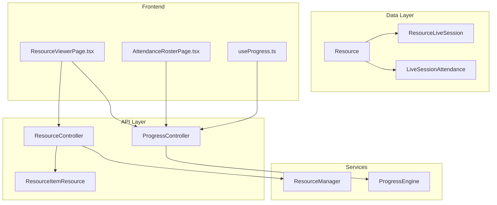
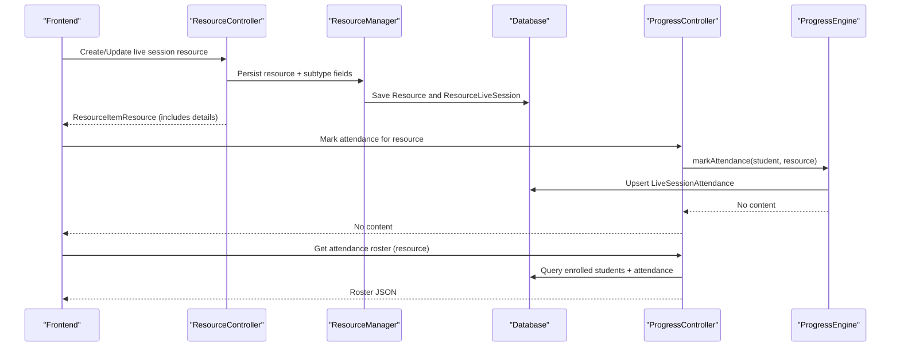
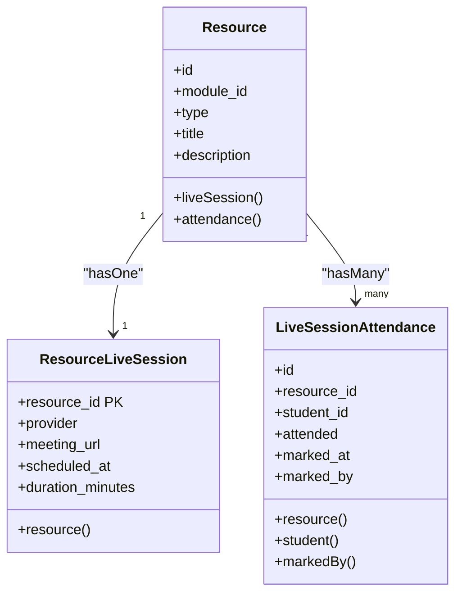
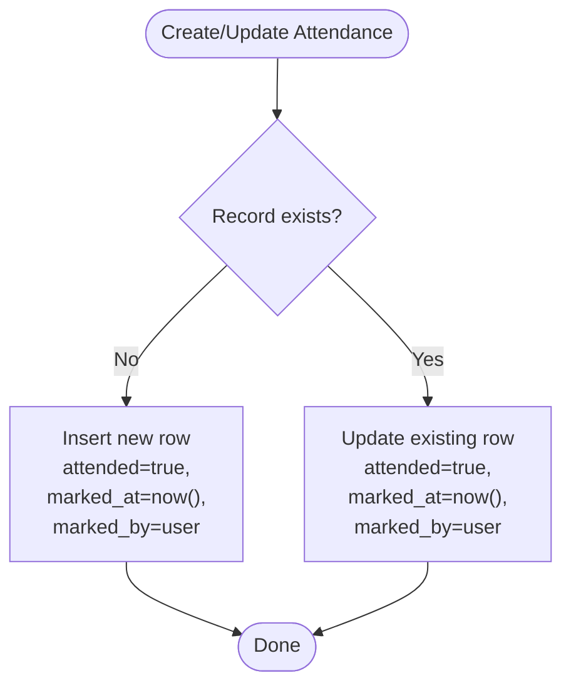
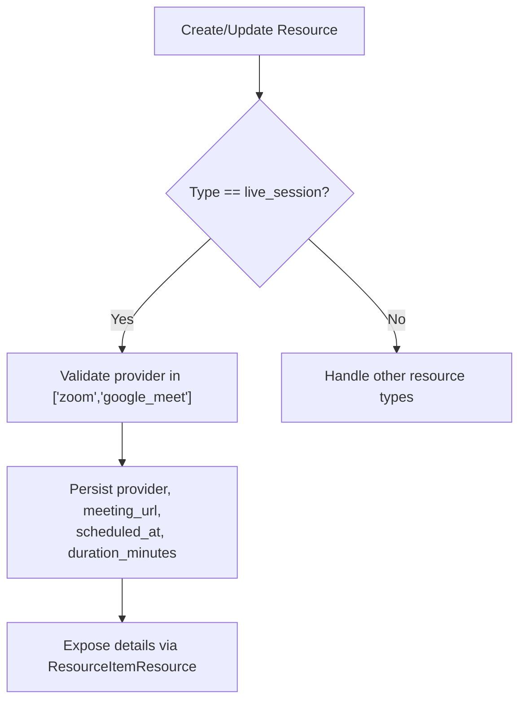
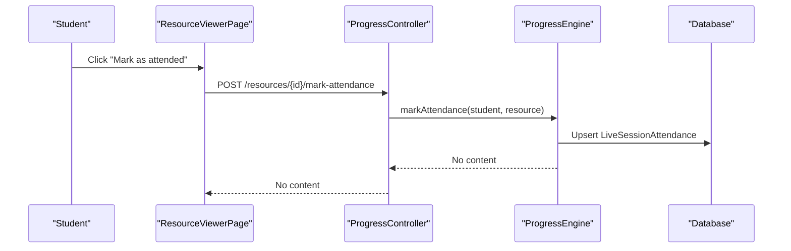
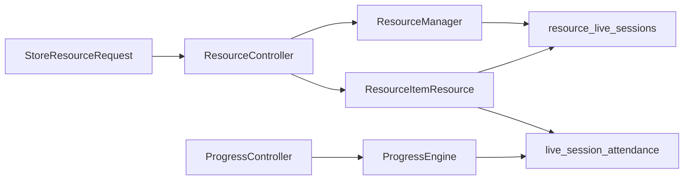

# Live Session Resources

<cite>
**Referenced Files in This Document**
- [Resource.php](file://app/Models/Resource.php)
- [ResourceLiveSession.php](file://app/Models/ResourceLiveSession.php)
- [LiveSessionAttendance.php](file://app/Models/LiveSessionAttendance.php)
- [LiveSessionProvider.php](file://app/Enums/LiveSessionProvider.php)
- [2024_01_01_000126_create_resource_live_sessions_table.php](file://database/migrations/2024_01_01_000126_create_resource_live_sessions_table.php)
- [2024_01_01_000128_create_live_session_attendance_table.php](file://database/migrations/2024_01_01_000128_create_live_session_attendance_table.php)
- [StoreResourceRequest.php](file://app/Http/Requests/Api/V1/StoreResourceRequest.php)
- [UpdateResourceRequest.php](file://app/Http/Requests/Api/V1/UpdateResourceRequest.php)
- [ResourceController.php](file://app/Http/Controllers/Api/V1/ResourceController.php)
- [ProgressController.php](file://app/Http/Controllers/Api/V1/ProgressController.php)
- [ResourceItemResource.php](file://app/Http/Resources/ResourceItemResource.php)
- [ResourceManager.php](file://app/Services/Content/ResourceManager.php)
- [ProgressEngine.php](file://app/Services/Progress/ProgressEngine.php)
- [ResourceViewerPage.tsx](file://frontend/src/features/learning/ResourceViewerPage.tsx)
- [AttendanceRosterPage.tsx](file://frontend/src/features/progress/AttendanceRosterPage.tsx)
- [useProgress.ts](file://frontend/src/features/progress/useProgress.ts)
</cite>

## Table of Contents
1. Introduction
2. Project Structure
3. Core Components
4. Architecture Overview
5. Detailed Component Analysis
6. Dependency Analysis
7. Performance Considerations
8. Troubleshooting Guide
9. Conclusion
10. Appendices

## Introduction
This document explains the live session resource functionality, focusing on data modeling, scheduling, provider integration, and attendance tracking. It covers how live sessions are represented as a specialized resource type, how they integrate with third-party video conferencing providers (Zoom and Google Meet), and how student participation is recorded and viewed by instructors.

## Project Structure
Live sessions are implemented as a subtype of Resource. The core pieces include:
- A dedicated subtype table for live session configuration
- An attendance table to record student participation per session
- API endpoints to create/update live sessions and mark attendance
- Frontend components to display session details and manage attendance

**Diagram sources**
- [Resource.php:80-101](file://app/Models/Resource.php#L80-L101)
- [ResourceLiveSession.php:11-36](file://app/Models/ResourceLiveSession.php#L11-L36)
- [LiveSessionAttendance.php:12-57](file://app/Models/LiveSessionAttendance.php#L12-L57)
- [ResourceController.php:25-66](file://app/Http/Controllers/Api/V1/ResourceController.php#L25-L66)
- [ProgressController.php:144-181](file://app/Http/Controllers/Api/V1/ProgressController.php#L144-L181)
- [ResourceItemResource.php:86-91](file://app/Http/Resources/ResourceItemResource.php#L86-L91)
- [ResourceManager.php:147-179](file://app/Services/Content/ResourceManager.php#L147-L179)
- [ProgressEngine.php:274-286](file://app/Services/Progress/ProgressEngine.php#L274-L286)
- [ResourceViewerPage.tsx:242-269](file://frontend/src/features/learning/ResourceViewerPage.tsx#L242-L269)
- [AttendanceRosterPage.tsx:11-49](file://frontend/src/features/progress/AttendanceRosterPage.tsx#L11-L49)
- [useProgress.ts:24-30](file://frontend/src/features/progress/useProgress.ts#L24-L30)

**Section sources**
- [Resource.php:80-101](file://app/Models/Resource.php#L80-L101)
- [ResourceLiveSession.php:11-36](file://app/Models/ResourceLiveSession.php#L11-L36)
- [LiveSessionAttendance.php:12-57](file://app/Models/LiveSessionAttendance.php#L12-L57)
- [ResourceController.php:25-66](file://app/Http/Controllers/Api/V1/ResourceController.php#L25-L66)
- [ProgressController.php:144-181](file://app/Http/Controllers/Api/V1/ProgressController.php#L144-L181)
- [ResourceItemResource.php:86-91](file://app/Http/Resources/ResourceItemResource.php#L86-L91)
- [ResourceManager.php:147-179](file://app/Services/Content/ResourceManager.php#L147-L179)
- [ProgressEngine.php:274-286](file://app/Services/Progress/ProgressEngine.php#L274-L286)
- [ResourceViewerPage.tsx:242-269](file://frontend/src/features/learning/ResourceViewerPage.tsx#L242-L269)
- [AttendanceRosterPage.tsx:11-49](file://frontend/src/features/progress/AttendanceRosterPage.tsx#L11-L49)
- [useProgress.ts:24-30](file://frontend/src/features/progress/useProgress.ts#L24-L30)

## Core Components
- Resource model exposes a one-to-one relationship to ResourceLiveSession and a one-to-many relationship to LiveSessionAttendance.
- ResourceLiveSession stores provider-specific scheduling details for a live session resource.
- LiveSessionAttendance records whether a student attended a specific live session and who marked it.

Key responsibilities:
- Resource: central entity that can be a live session; owns relationships to subtype and attendance.
- ResourceLiveSession: holds provider selection, meeting URL, scheduled time, and duration.
- LiveSessionAttendance: tracks per-student attendance status and metadata.

**Section sources**
- [Resource.php:80-101](file://app/Models/Resource.php#L80-L101)
- [ResourceLiveSession.php:11-36](file://app/Models/ResourceLiveSession.php#L11-L36)
- [LiveSessionAttendance.php:12-57](file://app/Models/LiveSessionAttendance.php#L12-L57)

## Architecture Overview
The system supports creating live sessions as resources, exposing their details via a unified API, and recording attendance through a progress service. Instructors can view an attendance roster per live session.

**Diagram sources**
- [ResourceController.php:30-66](file://app/Http/Controllers/Api/V1/ResourceController.php#L30-L66)
- [ResourceManager.php:147-179](file://app/Services/Content/ResourceManager.php#L147-L179)
- [ProgressController.php:144-181](file://app/Http/Controllers/Api/V1/ProgressController.php#L144-L181)
- [ProgressEngine.php:274-286](file://app/Services/Progress/ProgressEngine.php#L274-L286)

## Detailed Component Analysis

### Data Model: ResourceLiveSession
- Purpose: Stores live session configuration tied to a Resource.
- Key fields:
  - provider: enum value indicating Zoom or Google Meet
  - meeting_url: external link to join the session
  - scheduled_at: datetime when the session starts
  - duration_minutes: planned length of the session
- Relationships: belongs to Resource via resource_id primary key.

**Diagram sources**
- [Resource.php:80-101](file://app/Models/Resource.php#L80-L101)
- [ResourceLiveSession.php:11-36](file://app/Models/ResourceLiveSession.php#L11-L36)
- [LiveSessionAttendance.php:12-57](file://app/Models/LiveSessionAttendance.php#L12-L57)

**Section sources**
- [ResourceLiveSession.php:11-36](file://app/Models/ResourceLiveSession.php#L11-L36)
- [2024_01_01_000126_create_resource_live_sessions_table.php:11-19](file://database/migrations/2024_01_01_000126_create_resource_live_sessions_table.php#L11-L19)

### Data Model: LiveSessionAttendance
- Purpose: Tracks whether a student attended a specific live session and who marked it.
- Key fields:
  - resource_id: links to the live session resource
  - student_id: links to the user who attended
  - attended: boolean flag
  - marked_at: timestamp when attendance was recorded
  - marked_by: optional instructor who manually marked attendance
- Constraints: unique composite key on (resource_id, student_id) ensures one record per student per session.

**Diagram sources**
- [ProgressEngine.php:274-286](file://app/Services/Progress/ProgressEngine.php#L274-L286)
- [2024_01_01_000128_create_live_session_attendance_table.php:13-21](file://database/migrations/2024_01_01_000128_create_live_session_attendance_table.php#L13-L21)

**Section sources**
- [LiveSessionAttendance.php:12-57](file://app/Models/LiveSessionAttendance.php#L12-L57)
- [2024_01_01_000128_create_live_session_attendance_table.php:13-21](file://database/migrations/2024_01_01_000128_create_live_session_attendance_table.php#L13-L21)

### Provider Integration (Zoom, Google Meet)
- Providers are enumerated to constrain input and ensure consistent handling.
- Live session resources store provider selection along with a meeting URL.
- Frontend displays provider name and a “Join session” link based on stored details.

**Diagram sources**
- [LiveSessionProvider.php:7-11](file://app/Enums/LiveSessionProvider.php#L7-L11)
- [StoreResourceRequest.php:57-61](file://app/Http/Requests/Api/V1/StoreResourceRequest.php#L57-L61)
- [UpdateResourceRequest.php:49-52](file://app/Http/Requests/Api/V1/UpdateResourceRequest.php#L49-L52)
- [ResourceItemResource.php:86-91](file://app/Http/Resources/ResourceItemResource.php#L86-L91)
- [ResourceViewerPage.tsx:242-269](file://frontend/src/features/learning/ResourceViewerPage.tsx#L242-L269)

**Section sources**
- [LiveSessionProvider.php:7-11](file://app/Enums/LiveSessionProvider.php#L7-L11)
- [StoreResourceRequest.php:57-61](file://app/Http/Requests/Api/V1/StoreResourceRequest.php#L57-L61)
- [UpdateResourceRequest.php:49-52](file://app/Http/Requests/Api/V1/UpdateResourceRequest.php#L49-L52)
- [ResourceItemResource.php:86-91](file://app/Http/Resources/ResourceItemResource.php#L86-L91)
- [ResourceViewerPage.tsx:242-269](file://frontend/src/features/learning/ResourceViewerPage.tsx#L242-L269)

### Scheduling Features
- Scheduled start time and duration are stored with each live session resource.
- These fields enable UI to show session timing and help learners plan participation.

**Section sources**
- [ResourceLiveSession.php:19-30](file://app/Models/ResourceLiveSession.php#L19-L30)
- [2024_01_01_000126_create_resource_live_sessions_table.php:13-18](file://database/migrations/2024_01_01_000126_create_resource_live_sessions_table.php#L13-L18)
- [ResourceItemResource.php:86-91](file://app/Http/Resources/ResourceItemResource.php#L86-L91)

### Attendance Tracking and Real-Time Synchronization
- Students can mark attendance from the learning viewer; this triggers persistence and engagement tracking.
- Instructors can view an attendance roster per live session, showing all enrolled students and their attendance status.

**Diagram sources**
- [ResourceViewerPage.tsx:242-269](file://frontend/src/features/learning/ResourceViewerPage.tsx#L242-L269)
- [ProgressController.php:144-149](file://app/Http/Controllers/Api/V1/ProgressController.php#L144-L149)
- [ProgressEngine.php:274-286](file://app/Services/Progress/ProgressEngine.php#L274-L286)

**Section sources**
- [ProgressController.php:144-181](file://app/Http/Controllers/Api/V1/ProgressController.php#L144-L181)
- [ProgressEngine.php:274-286](file://app/Services/Progress/ProgressEngine.php#L274-L286)
- [AttendanceRosterPage.tsx:11-49](file://frontend/src/features/progress/AttendanceRosterPage.tsx#L11-L49)
- [useProgress.ts:24-30](file://frontend/src/features/progress/useProgress.ts#L24-L30)

## Dependency Analysis
- Resource depends on ResourceType to identify live sessions and exposes relationships to subtype and attendance.
- ResourceController delegates creation/update to ResourceManager, which persists subtype fields for live sessions.
- ProgressController uses ProgressEngine to record attendance and build rosters.
- ResourceItemResource flattens subtype details into a consistent API envelope.

**Diagram sources**
- [StoreResourceRequest.php:57-61](file://app/Http/Requests/Api/V1/StoreResourceRequest.php#L57-L61)
- [ResourceController.php:30-66](file://app/Http/Controllers/Api/V1/ResourceController.php#L30-L66)
- [ResourceManager.php:147-179](file://app/Services/Content/ResourceManager.php#L147-L179)
- [ProgressController.php:144-181](file://app/Http/Controllers/Api/V1/ProgressController.php#L144-L181)
- [ProgressEngine.php:274-286](file://app/Services/Progress/ProgressEngine.php#L274-L286)
- [ResourceItemResource.php:86-91](file://app/Http/Resources/ResourceItemResource.php#L86-L91)

**Section sources**
- [ResourceController.php:30-66](file://app/Http/Controllers/Api/V1/ResourceController.php#L30-L66)
- [ResourceManager.php:147-179](file://app/Services/Content/ResourceManager.php#L147-L179)
- [ProgressController.php:144-181](file://app/Http/Controllers/Api/V1/ProgressController.php#L144-L181)
- [ResourceItemResource.php:86-91](file://app/Http/Resources/ResourceItemResource.php#L86-L91)

## Performance Considerations
- Attendance upserts use unique constraints to avoid duplicates and reduce write overhead.
- Roster queries filter by confirmed enrolments and key attendance records by student ID for efficient mapping.
- Resource detail responses load only necessary subtype relations to minimize payload size.

[No sources needed since this section provides general guidance]

## Troubleshooting Guide
- Creating a live session fails validation if provider is not supported or required fields are missing. Ensure provider is one of the allowed values and provide meeting_url, scheduled_at, and duration_minutes.
- Marking attendance returns no content on success; verify the request targets a valid resource and that the module is unlocked for the student.
- Viewing the attendance roster requires appropriate authorization and only works for live_session resources; otherwise, a validation error is returned.

**Section sources**
- [StoreResourceRequest.php:57-61](file://app/Http/Requests/Api/V1/StoreResourceRequest.php#L57-L61)
- [UpdateResourceRequest.php:49-52](file://app/Http/Requests/Api/V1/UpdateResourceRequest.php#L49-L52)
- [ProgressController.php:144-181](file://app/Http/Controllers/Api/V1/ProgressController.php#L144-L181)

## Conclusion
Live sessions are modeled as a specialized resource subtype with clear separation between scheduling details and attendance records. The system integrates with Zoom and Google Meet by storing provider and meeting URLs, while attendance is tracked per student and exposed via an instructor-facing roster. The design balances simplicity, extensibility, and performance.

[No sources needed since this section summarizes without analyzing specific files]

## Appendices

### API Examples

- Create a live session resource
  - Method: POST
  - Path: /modules/{module}/resources
  - Body includes: type = live_session, provider, meeting_url, scheduled_at, duration_minutes
  - Validation rules enforce required fields for live_session type.

- Update a live session resource
  - Method: PATCH/PUT
  - Path: /resources/{resource}
  - Body includes subset of live_session fields to update.

- Mark attendance
  - Method: POST
  - Path: /resources/{resource}/mark-attendance
  - Records attendance for the authenticated student.

- View attendance roster
  - Method: GET
  - Path: /resources/{resource}/attendance
  - Returns list of enrolled students with attendance status and timestamps.

**Section sources**
- [StoreResourceRequest.php:57-61](file://app/Http/Requests/Api/V1/StoreResourceRequest.php#L57-L61)
- [UpdateResourceRequest.php:49-52](file://app/Http/Requests/Api/V1/UpdateResourceRequest.php#L49-L52)
- [ProgressController.php:144-181](file://app/Http/Controllers/Api/V1/ProgressController.php#L144-L181)