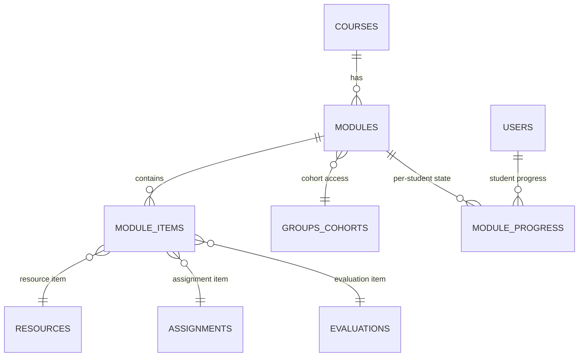
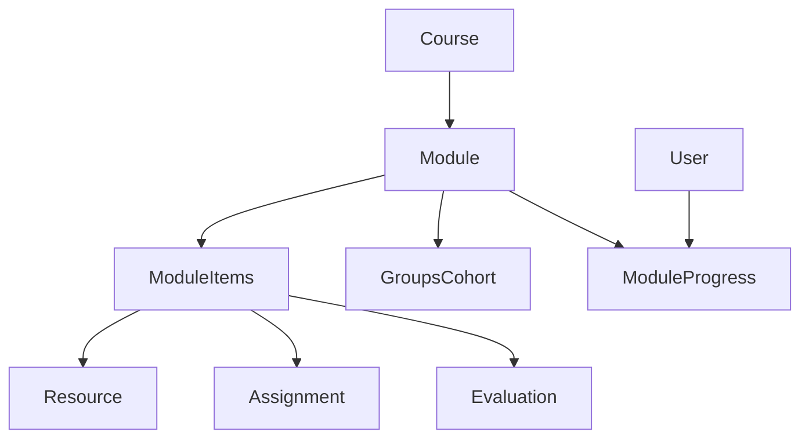
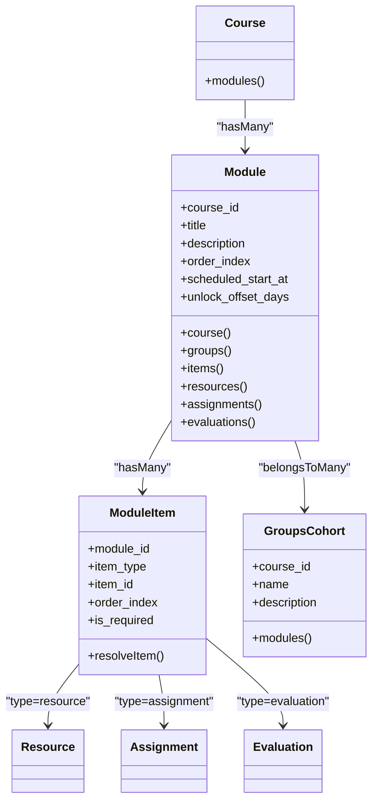
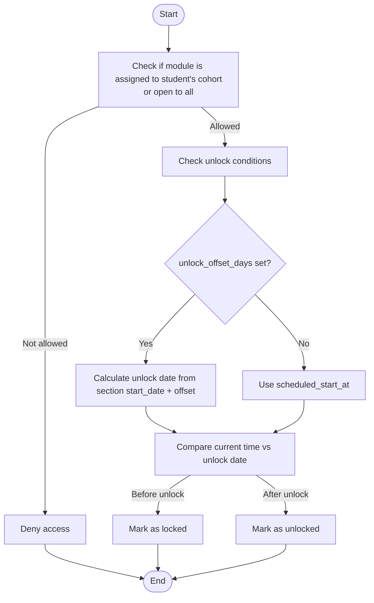
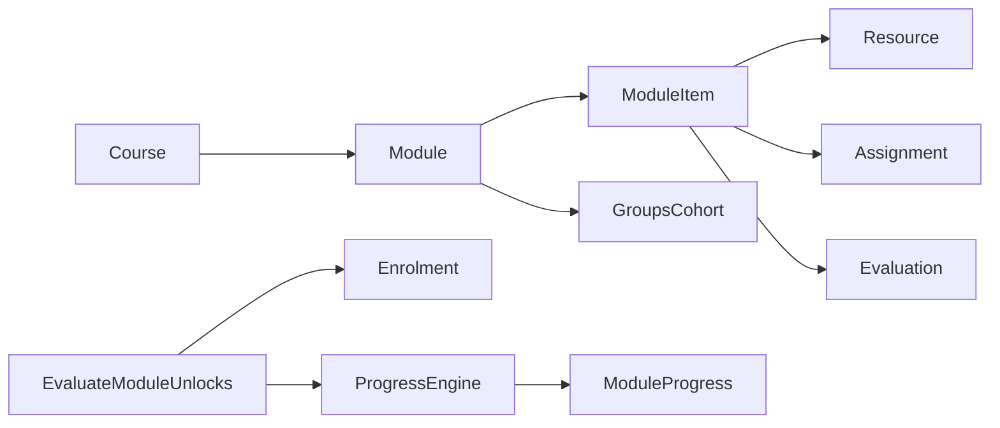

# Module Structure & Organization

<cite>
**Referenced Files in This Document**
- [Module.php](file://app/Models/Module.php)
- [Course.php](file://app/Models/Course.php)
- [ModuleItem.php](file://app/Models/ModuleItem.php)
- [GroupsCohort.php](file://app/Models/GroupsCohort.php)
- [Resource.php](file://app/Models/Resource.php)
- [Assignment.php](file://app/Models/Assignment.php)
- [Evaluation.php](file://app/Models/Evaluation.php)
- [ModuleProgress.php](file://app/Models/ModuleProgress.php)
- [ModuleItemType.php](file://app/Enums/ModuleItemType.php)
- [2024_01_01_000100_create_modules_table.php](file://database/migrations/2024_01_01_000100_create_modules_table.php)
- [2024_01_01_000150_create_module_items_table.php](file://database/migrations/2024_01_01_000150_create_module_items_table.php)
- [2024_01_01_000110_create_module_groups_table.php](file://database/migrations/2024_01_01_000110_create_module_groups_table.php)
- [2026_08_10_060000_add_unlock_offset_days_to_modules_table.php](file://database/migrations/2026_08_10_060000_add_unlock_offset_days_to_modules_table.php)
- [EvaluateModuleUnlocks.php](file://app/Console/Commands/EvaluateModuleUnlocks.php)
</cite>

## Table of Contents
1. Introduction
2. Project Structure
3. Core Components
4. Architecture Overview
5. Detailed Component Analysis
6. Dependency Analysis
7. Performance Considerations
8. Troubleshooting Guide
9. Conclusion

## Introduction
This document explains the data model and organization of the module structure system. It focuses on how modules belong to courses, how they are sequenced and scheduled, how access is controlled for cohort groups, and how modules contain both learning resources and assessments (assignments and evaluations). It also describes how unlocks are evaluated over time and per student progress.

## Project Structure
The module system centers around a few core models and tables:
- Modules define ordered, schedulable units within a course.
- Module items link modules to specific resources, assignments, or evaluations.
- Cohort-based access control is implemented via a many-to-many relationship between modules and groups.
- Student progress tracks unlock and completion states per module.

**Diagram sources**
- [2024_01_01_000100_create_modules_table.php:13-22](file://database/migrations/2024_01_01_000100_create_modules_table.php#L13-L22)
- [2024_01_01_000150_create_module_items_table.php:13-22](file://database/migrations/2024_01_01_000150_create_module_items_table.php#L13-L22)
- [2024_01_01_000110_create_module_groups_table.php:16-20](file://database/migrations/2024_01_01_000110_create_module_groups_table.php#L16-L20)
- [ModuleProgress.php:15-21](file://app/Models/ModuleProgress.php#L15-L21)

**Section sources**
- [Module.php:22-34](file://app/Models/Module.php#L22-L34)
- [Course.php:116-121](file://app/Models/Course.php#L116-L121)
- [ModuleItem.php:21-33](file://app/Models/ModuleItem.php#L21-L33)
- [GroupsCohort.php:22-26](file://app/Models/GroupsCohort.php#L22-L26)
- [Resource.php:20-25](file://app/Models/Resource.php#L20-L25)
- [Assignment.php:19-29](file://app/Models/Assignment.php#L19-L29)
- [Evaluation.php:19-30](file://app/Models/Evaluation.php#L19-L30)
- [ModuleProgress.php:15-21](file://app/Models/ModuleProgress.php#L15-L21)

## Core Components
- Module: Represents a course unit with ordering and scheduling controls.
  - Belongs to Course.
  - Has many ModuleItems, Resources, Assignments, Evaluations.
  - Many-to-many with GroupsCohort for cohort-based access.
  - Fields include order_index, scheduled_start_at, unlock_offset_days.
- ModuleItem: Links a module to a Resource, Assignment, or Evaluation using a type discriminator and item_id.
- GroupsCohort: A cohort group within a course; modules can be restricted to specific cohorts.
- Resource, Assignment, Evaluation: Content and assessment types that can be included as module items.
- ModuleProgress: Per-student tracking of module unlock and completion timestamps and status.

Key relationships:
- Course -> Module (ordered by order_index).
- Module -> ModuleItem (ordered by order_index).
- ModuleItem -> Resource|Assignment|Evaluation (resolved by item_type).
- Module <-> GroupsCohort (access control).
- User -> ModuleProgress (per-student unlock/completion).

**Section sources**
- [Module.php:36-84](file://app/Models/Module.php#L36-L84)
- [ModuleItem.php:21-50](file://app/Models/ModuleItem.php#L21-L50)
- [GroupsCohort.php:28-51](file://app/Models/GroupsCohort.php#L28-L51)
- [Resource.php:31-101](file://app/Models/Resource.php#L31-L101)
- [Assignment.php:39-69](file://app/Models/Assignment.php#L39-L69)
- [Evaluation.php:39-61](file://app/Models/Evaluation.php#L39-L61)
- [ModuleProgress.php:29-43](file://app/Models/ModuleProgress.php#L29-L43)

## Architecture Overview
The module architecture supports:
- Hierarchical organization: Courses contain ordered Modules.
- Sequencing: Modules and their items are ordered via order_index.
- Scheduling: Modules can be gated by absolute dates (scheduled_start_at) or relative offsets from section start (unlock_offset_days).
- Access control: Cohort-based visibility through module_groups; empty means open to all students in the course.
- Content composition: Modules include Resources and Assessments (Assignments, Evaluations) via ModuleItems.
- Progress tracking: ModuleProgress records when a student unlocks and completes a module.

**Diagram sources**
- [Course.php:116-121](file://app/Models/Course.php#L116-L121)
- [Module.php:54-84](file://app/Models/Module.php#L54-L84)
- [ModuleItem.php:43-50](file://app/Models/ModuleItem.php#L43-L50)
- [GroupsCohort.php:45-51](file://app/Models/GroupsCohort.php#L45-L51)
- [ModuleProgress.php:29-43](file://app/Models/ModuleProgress.php#L29-L43)

## Detailed Component Analysis

### Module Model
Responsibilities:
- Defines a module’s identity, description, and position within a course.
- Controls availability via scheduled_start_at and unlock_offset_days.
- Associates with cohort groups for access control.
- Aggregates content (resources, assignments, evaluations) and items.

Key fields:
- course_id: Parent course.
- title, description: Human-readable metadata.
- order_index: Sequence within the course.
- scheduled_start_at: Absolute date/time gating.
- unlock_offset_days: Days after section start_date to unlock.

Relationships:
- belongsTo Course.
- hasMany ModuleItems, Resources, Assignments, Evaluations.
- belongsToMany GroupsCohort for cohort-based access.

Example usage patterns:
- Create a module with an order_index to sequence it within a course.
- Set scheduled_start_at to gate availability until a specific time.
- Use unlock_offset_days to schedule modules relative to a cohort’s section start date.
- Associate one or more GroupsCohort to restrict access; leave empty to apply to all students.

**Section sources**
- [Module.php:22-34](file://app/Models/Module.php#L22-L34)
- [Module.php:36-84](file://app/Models/Module.php#L36-L84)
- [2024_01_01_000100_create_modules_table.php:13-22](file://database/migrations/2024_01_01_000100_create_modules_table.php#L13-L22)
- [2026_08_10_060000_add_unlock_offset_days_to_modules_table.php:16-21](file://database/migrations/2026_08_10_060000_add_unlock_offset_days_to_modules_table.php#L16-L21)

#### Class Diagram: Module Relationships

**Diagram sources**
- [Course.php:116-121](file://app/Models/Course.php#L116-L121)
- [Module.php:36-84](file://app/Models/Module.php#L36-L84)
- [ModuleItem.php:21-50](file://app/Models/ModuleItem.php#L21-L50)
- [GroupsCohort.php:28-51](file://app/Models/GroupsCohort.php#L28-L51)

### ModuleItem Model
Responsibilities:
- Declares which resource, assignment, or evaluation belongs to a module and its order.
- Indicates whether the item is required for module completion.

Key fields:
- module_id: Parent module.
- item_type: Discriminator among Resource, Assignment, Evaluation.
- item_id: Foreign key into the corresponding table based on item_type.
- order_index: Order within the module.
- is_required: Whether completion is mandatory.

Resolution:
- resolveItem returns the actual entity based on item_type.

**Section sources**
- [ModuleItem.php:21-50](file://app/Models/ModuleItem.php#L21-L50)
- [ModuleItemType.php:7-12](file://app/Enums/ModuleItemType.php#L7-L12)
- [2024_01_01_000150_create_module_items_table.php:13-22](file://database/migrations/2024_01_01_000150_create_module_items_table.php#L13-L22)

### Cohort-Based Access Control (module_groups)
Mechanism:
- The module_groups table links modules to groups_cohorts.
- If a module has no entries in module_groups, it applies to every student in the course.
- If entries exist, only members of those cohorts can access the module.

Implications:
- Enables cohort-specific sequencing and scheduling.
- Supports different learning paths for different groups within the same course.

**Section sources**
- [2024_01_01_000110_create_module_groups_table.php:11-20](file://database/migrations/2024_01_01_000110_create_module_groups_table.php#L11-L20)
- [Module.php:44-52](file://app/Models/Module.php#L44-L52)
- [GroupsCohort.php:45-51](file://app/Models/GroupsCohort.php#L45-L51)

### Resources and Assessments in Modules
Modules aggregate three kinds of content:
- Resources: Learning materials (videos, documents, readings, external links, SCORM packages, live sessions, downloadable files).
- Assignments: Submissions with due dates, late penalties, rubrics, and scoring.
- Evaluations: Quizzes/tests with pass scores, attempts, time limits, and question sets.

ModuleItem ties these together under a single ordered list per module.

**Section sources**
- [Resource.php:20-101](file://app/Models/Resource.php#L20-L101)
- [Assignment.php:19-69](file://app/Models/Assignment.php#L19-L69)
- [Evaluation.php:19-61](file://app/Models/Evaluation.php#L19-L61)
- [ModuleItem.php:43-50](file://app/Models/ModuleItem.php#L43-L50)

### Scheduling and Unlock Mechanisms
Two mechanisms govern when a module becomes available:
- scheduled_start_at: Absolute datetime gating.
- unlock_offset_days: Relative gating based on the cohort’s section start date.

A scheduled command periodically re-evaluates unlocks for confirmed enrolments to ensure time-based gates are enforced even without user interaction.

**Diagram sources**
- [2026_08_10_060000_add_unlock_offset_days_to_modules_table.php:9-21](file://database/migrations/2026_08_10_060000_add_unlock_offset_days_to_modules_table.php#L9-L21)
- [2024_01_01_000100_create_modules_table.php:13-22](file://database/migrations/2024_01_01_000100_create_modules_table.php#L13-L22)
- [EvaluateModuleUnlocks.php:22-38](file://app/Console/Commands/EvaluateModuleUnlocks.php#L22-L38)

**Section sources**
- [Module.php:22-34](file://app/Models/Module.php#L22-L34)
- [2026_08_10_060000_add_unlock_offset_days_to_modules_table.php:16-21](file://database/migrations/2026_08_10_060000_add_unlock_offset_days_to_modules_table.php#L16-L21)
- [EvaluateModuleUnlocks.php:22-38](file://app/Console/Commands/EvaluateModuleUnlocks.php#L22-L38)

### Student Progress Tracking
ModuleProgress records per-student state:
- student_id: The learner.
- module_id: The module being tracked.
- status: Current progress state.
- unlocked_at: When the module became accessible.
- completed_at: When the module was finished.

This enables features like “next module” logic and completion dashboards.

**Section sources**
- [ModuleProgress.php:15-43](file://app/Models/ModuleProgress.php#L15-L43)

## Dependency Analysis
High-level dependencies:
- Course depends on Module ordering.
- Module depends on ModuleItem for content sequencing.
- ModuleItem depends on ResourceType enums to resolve entities.
- Module depends on GroupsCohort for cohort-based access.
- EvaluateModuleUnlocks depends on Enrolment and ProgressEngine to update ModuleProgress.

**Diagram sources**
- [Course.php:116-121](file://app/Models/Course.php#L116-L121)
- [Module.php:54-84](file://app/Models/Module.php#L54-L84)
- [ModuleItem.php:43-50](file://app/Models/ModuleItem.php#L43-L50)
- [GroupsCohort.php:45-51](file://app/Models/GroupsCohort.php#L45-L51)
- [EvaluateModuleUnlocks.php:22-38](file://app/Console/Commands/EvaluateModuleUnlocks.php#L22-L38)

**Section sources**
- [Course.php:116-121](file://app/Models/Course.php#L116-L121)
- [Module.php:54-84](file://app/Models/Module.php#L54-L84)
- [ModuleItem.php:43-50](file://app/Models/ModuleItem.php#L43-L50)
- [EvaluateModuleUnlocks.php:22-38](file://app/Console/Commands/EvaluateModuleUnlocks.php#L22-L38)

## Performance Considerations
- Ordering queries: Both Course.modules and Module.items use order_index; ensure indexes exist for efficient retrieval.
- Cohort filtering: module_groups is a small join table; keep it normalized and indexed by module_id and group_id.
- Unlock evaluation: Batch processing via chunking avoids memory pressure during scheduled unlock checks.
- Item resolution: ModuleItem.resolveItem uses direct lookups; consider caching frequently accessed items if needed.

[No sources needed since this section provides general guidance]

## Troubleshooting Guide
Common issues and resolutions:
- Module not visible to students:
  - Verify module_groups associations; absence means open to all, presence restricts to specified cohorts.
  - Confirm student belongs to an associated cohort.
- Module locked despite scheduled_start_at passed:
  - Ensure scheduled_start_at is set correctly and timezone-aware.
  - Run the scheduled unlock evaluation command to update ModuleProgress.
- Module not unlocking based on section timing:
  - Check unlock_offset_days and confirm cohort’s section start date is set.
- Module item missing:
  - Validate item_type and item_id match existing Resource, Assignment, or Evaluation records.

Operational commands:
- Re-evaluate unlocks across all confirmed enrolments to refresh ModuleProgress.

**Section sources**
- [2024_01_01_000110_create_module_groups_table.php:11-20](file://database/migrations/2024_01_01_000110_create_module_groups_table.php#L11-L20)
- [Module.php:44-52](file://app/Models/Module.php#L44-L52)
- [ModuleProgress.php:15-43](file://app/Models/ModuleProgress.php#L15-L43)
- [EvaluateModuleUnlocks.php:22-38](file://app/Console/Commands/EvaluateModuleUnlocks.php#L22-L38)

## Conclusion
The module structure system provides a robust foundation for organizing course content with clear sequencing, flexible scheduling, and cohort-based access control. Modules act as containers for resources and assessments, while ModuleProgress tracks individual learner journeys. Together, these components enable structured, time-gated learning experiences tailored to different cohorts within a course.

[No sources needed since this section summarizes without analyzing specific files]