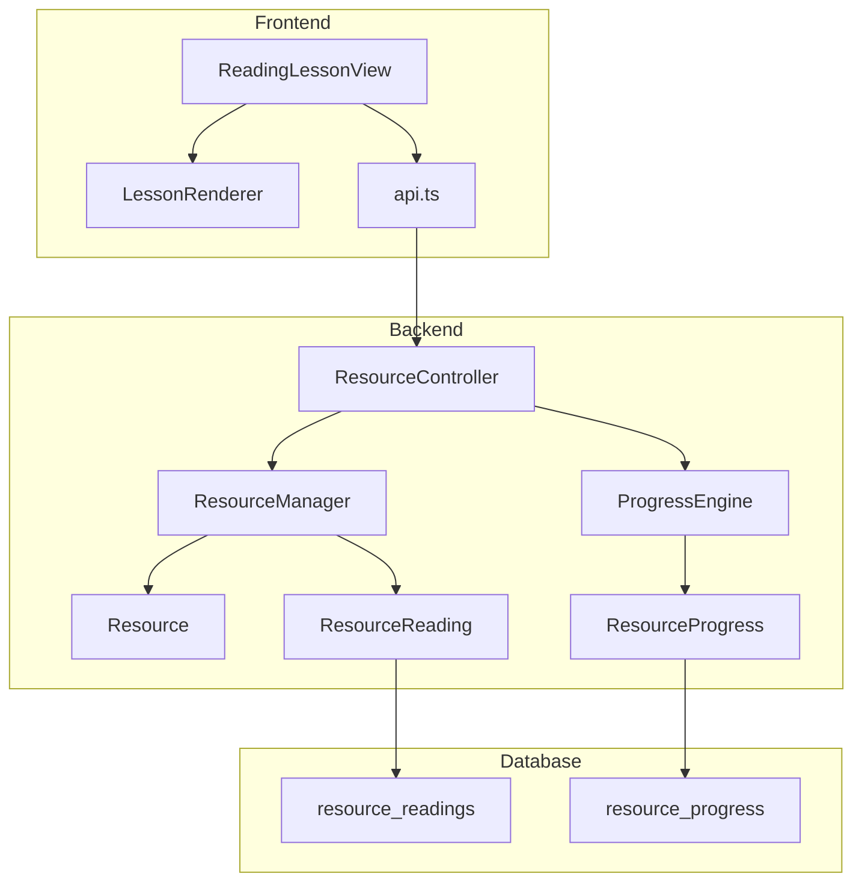
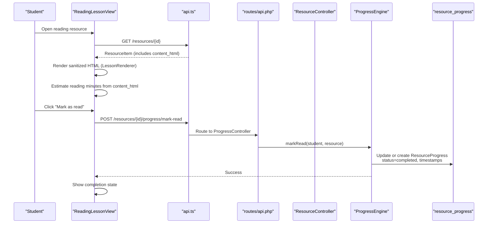
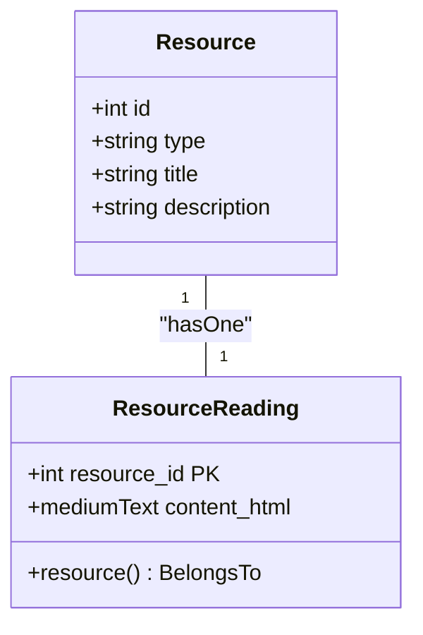
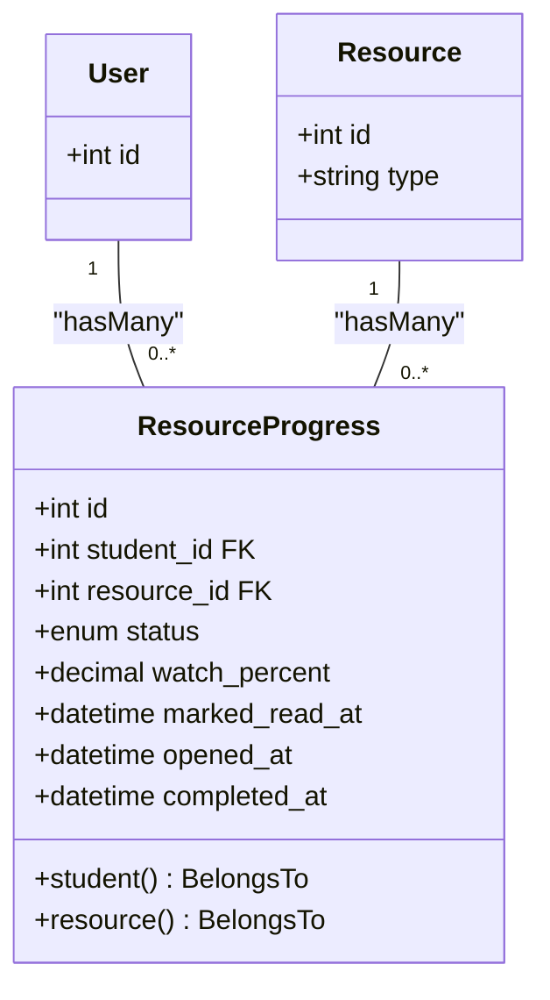
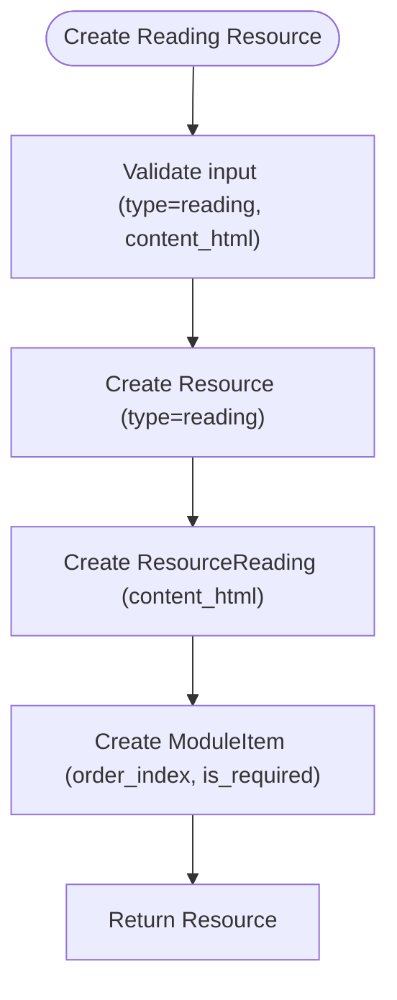
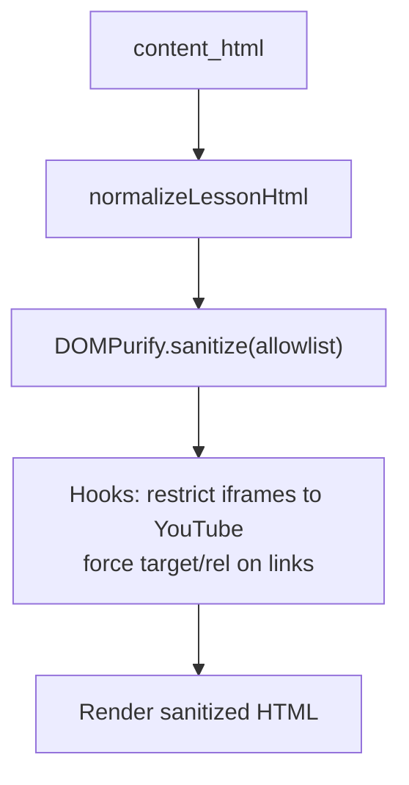
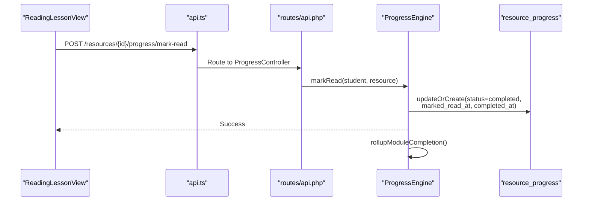
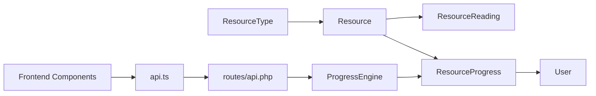

# Reading Resources

<cite>
**Referenced Files in This Document**
- [ResourceReading.php](file://app/Models/ResourceReading.php)
- [ResourceProgress.php](file://app/Models/ResourceProgress.php)
- [Resource.php](file://app/Models/Resource.php)
- [2024_01_01_000123_create_resource_readings_table.php](file://database/migrations/2024_01_01_000123_create_resource_readings_table.php)
- [2024_01_01_000151_create_resource_progress_table.php](file://database/migrations/2024_01_01_000151_create_resource_progress_table.php)
- [ResourceType.php](file://app/Enums/ResourceType.php)
- [ResourceProgressStatus.php](file://app/Enums/ResourceProgressStatus.php)
- [ResourceManager.php](file://app/Services/Content/ResourceManager.php)
- [ProgressEngine.php](file://app/Services/Progress/ProgressEngine.php)
- [ResourceController.php](file://app/Http/Controllers/Api/V1/ResourceController.php)
- [api.php](file://routes/api.php)
- [htmlContent.ts](file://frontend/src/components/editor/htmlContent.ts)
- [LessonRenderer.tsx](file://frontend/src/features/learning/LessonRenderer.tsx)
- [ReadingLessonView.tsx](file://frontend/src/features/learning/ReadingLessonView.tsx)
- [ResourceViewerPage.tsx](file://frontend/src/features/learning/ResourceViewerPage.tsx)
- [api.ts](file://frontend/src/features/learning/api.ts)
- [useLearning.ts](file://frontend/src/features/learning/useLearning.ts)
</cite>

## Table of Contents
1. Introduction
2. Project Structure
3. Core Components
4. Architecture Overview
5. Detailed Component Analysis
6. Dependency Analysis
7. Performance Considerations
8. Troubleshooting Guide
9. Conclusion

## Introduction
This document explains the data model and functionality for reading resources, focusing on how rich text content is stored and rendered, how reading materials are created and updated, and how student reading progress is tracked to determine completion. It also provides practical examples for creating reading materials, embedding multimedia content safely, and tracking student progress through mark-as-read actions and module rollup.

## Project Structure
The reading resource feature spans models, migrations, services, controllers, routes, and frontend components:
- Models define the reading content and per-student progress.
- Migrations define the database schema for reading content and progress.
- Services orchestrate creation/update of reading resources and compute completion signals.
- Controllers expose API endpoints for reading resources and progress actions.
- Routes wire up the API endpoints.
- Frontend components render rich HTML content, estimate reading time, and trigger progress updates.

**Diagram sources**
- [ResourceController.php:25-66](file://app/Http/Controllers/Api/V1/ResourceController.php#L25-L66)
- [ResourceManager.php:33-83](file://app/Services/Content/ResourceManager.php#L33-L83)
- [ProgressEngine.php:246-272](file://app/Services/Progress/ProgressEngine.php#L246-L272)
- [Resource.php:55-61](file://app/Models/Resource.php#L55-L61)
- [ResourceReading.php:10-26](file://app/Models/ResourceReading.php#L10-L26)
- [ResourceProgress.php:11-47](file://app/Models/ResourceProgress.php#L11-L47)
- [2024_01_01_000123_create_resource_readings_table.php:13-16](file://database/migrations/2024_01_01_000123_create_resource_readings_table.php#L13-L16)
- [2024_01_01_000151_create_resource_progress_table.php:13-23](file://database/migrations/2024_01_01_000151_create_resource_progress_table.php#L13-L23)
- [ReadingLessonView.tsx:35-51](file://frontend/src/features/learning/ReadingLessonView.tsx#L35-L51)
- [LessonRenderer.tsx:77-99](file://frontend/src/features/learning/LessonRenderer.tsx#L77-L99)
- [api.ts:9-24](file://frontend/src/features/learning/api.ts#L9-L24)

**Section sources**
- [ResourceController.php:25-66](file://app/Http/Controllers/Api/V1/ResourceController.php#L25-L66)
- [ResourceManager.php:33-83](file://app/Services/Content/ResourceManager.php#L33-L83)
- [ProgressEngine.php:246-272](file://app/Services/Progress/ProgressEngine.php#L246-L272)
- [Resource.php:55-61](file://app/Models/Resource.php#L55-L61)
- [ResourceReading.php:10-26](file://app/Models/ResourceReading.php#L10-L26)
- [ResourceProgress.php:11-47](file://app/Models/ResourceProgress.php#L11-L47)
- [2024_01_01_000123_create_resource_readings_table.php:13-16](file://database/migrations/2024_01_01_000123_create_resource_readings_table.php#L13-L16)
- [2024_01_01_000151_create_resource_progress_table.php:13-23](file://database/migrations/2024_01_01_000151_create_resource_progress_table.php#L13-L23)
- [ReadingLessonView.tsx:35-51](file://frontend/src/features/learning/ReadingLessonView.tsx#L35-L51)
- [LessonRenderer.tsx:77-99](file://frontend/src/features/learning/LessonRenderer.tsx#L77-L99)
- [api.ts:9-24](file://frontend/src/features/learning/api.ts#L9-L24)

## Core Components
- ResourceReading stores rich HTML content for reading-type resources and links back to its parent Resource.
- ResourceProgress tracks per-student progress for any resource type, including timestamps for when a reading was marked as read and when it completed.
- ResourceManager creates and updates reading resources and their subtype details atomically with module item metadata.
- ProgressEngine defines completion rules: readings complete when marked as read; it also rolls up module completion and unlocks subsequent modules.
- Frontend components render sanitized HTML, estimate reading time, and call progress APIs to mark readings as read.

Key behaviors:
- Content storage: Rich HTML stored in resource_readings.content_html.
- Formatting options: A curated allowlist of tags and attributes is enforced at render time; legacy plain text is normalized into paragraphs.
- Multimedia support: Safe iframe embedding (YouTube only) via sanitization hooks; other iframes are removed.
- Progress tracking: Marking a reading as read sets status to completed and records timestamps; module completion rolls up based on required items.

**Section sources**
- [ResourceReading.php:10-26](file://app/Models/ResourceReading.php#L10-L26)
- [ResourceProgress.php:11-47](file://app/Models/ResourceProgress.php#L11-L47)
- [ResourceManager.php:116-119](file://app/Services/Content/ResourceManager.php#L116-L119)
- [ProgressEngine.php:170-205](file://app/Services/Progress/ProgressEngine.php#L170-L205)
- [LessonRenderer.tsx:7-75](file://frontend/src/features/learning/LessonRenderer.tsx#L7-L75)
- [htmlContent.ts:1-39](file://frontend/src/components/editor/htmlContent.ts#L1-L39)

## Architecture Overview
The reading resource flow connects the frontend UI to backend services and persistence:

**Diagram sources**
- [ReadingLessonView.tsx:35-51](file://frontend/src/features/learning/ReadingLessonView.tsx#L35-L51)
- [LessonRenderer.tsx:77-99](file://frontend/src/features/learning/LessonRenderer.tsx#L77-L99)
- [api.ts:9-24](file://frontend/src/features/learning/api.ts#L9-L24)
- [api.php:146-153](file://routes/api.php#L146-L153)
- [ProgressEngine.php:246-258](file://app/Services/Progress/ProgressEngine.php#L246-L258)
- [2024_01_01_000151_create_resource_progress_table.php:13-23](file://database/migrations/2024_01_01_000151_create_resource_progress_table.php#L13-L23)

## Detailed Component Analysis

### Data Model: ResourceReading
- Purpose: Stores rich HTML content for reading-type resources.
- Storage: mediumText field for content_html; primary key is resource_id linked to resources.
- Relationship: belongsTo Resource.

**Diagram sources**
- [Resource.php:55-61](file://app/Models/Resource.php#L55-L61)
- [ResourceReading.php:10-26](file://app/Models/ResourceReading.php#L10-L26)
- [2024_01_01_000123_create_resource_readings_table.php:13-16](file://database/migrations/2024_01_01_000123_create_resource_readings_table.php#L13-L16)

**Section sources**
- [ResourceReading.php:10-26](file://app/Models/ResourceReading.php#L10-L26)
- [2024_01_01_000123_create_resource_readings_table.php:13-16](file://database/migrations/2024_01_01_000123_create_resource_readings_table.php#L13-L16)

### Data Model: ResourceProgress
- Purpose: Tracks per-student progress for all resource types, including readings.
- Fields: status enum, watch_percent (for video), marked_read_at (for reading/document/scorm), opened_at (for external link/downloadable file), completed_at.
- Relationships: belongsTo User (student), belongsTo Resource.

**Diagram sources**
- [ResourceProgress.php:11-47](file://app/Models/ResourceProgress.php#L11-L47)
- [2024_01_01_000151_create_resource_progress_table.php:13-23](file://database/migrations/2024_01_01_000151_create_resource_progress_table.php#L13-L23)

**Section sources**
- [ResourceProgress.php:11-47](file://app/Models/ResourceProgress.php#L11-L47)
- [2024_01_01_000151_create_resource_progress_table.php:13-23](file://database/migrations/2024_01_01_000151_create_resource_progress_table.php#L13-L23)

### Content Management: Creating and Updating Readings
- Creation: ResourceManager.create builds a Resource with type=reading and persists ResourceReading with content_html within a transaction, plus a ModuleItem row.
- Update: ResourceManager.update modifies Resource fields and updates ResourceReading.content_html when provided.

**Diagram sources**
- [ResourceManager.php:33-58](file://app/Services/Content/ResourceManager.php#L33-L58)
- [ResourceManager.php:116-119](file://app/Services/Content/ResourceManager.php#L116-L119)

**Section sources**
- [ResourceManager.php:33-83](file://app/Services/Content/ResourceManager.php#L33-L83)

### Rendering and Formatting: Rich Text Support
- Normalization: Legacy plain text is converted to paragraphed HTML; existing HTML is preserved.
- Sanitization: Only a narrow allowlist of tags and attributes is permitted; links get target/rel for safety.
- Multimedia: Iframe embedding is restricted to YouTube embed URLs; other iframes are stripped.

**Diagram sources**
- [htmlContent.ts:1-39](file://frontend/src/components/editor/htmlContent.ts#L1-L39)
- [LessonRenderer.tsx:7-75](file://frontend/src/features/learning/LessonRenderer.tsx#L7-L75)
- [LessonRenderer.tsx:77-99](file://frontend/src/features/learning/LessonRenderer.tsx#L77-L99)

**Section sources**
- [htmlContent.ts:1-39](file://frontend/src/components/editor/htmlContent.ts#L1-L39)
- [LessonRenderer.tsx:7-75](file://frontend/src/features/learning/LessonRenderer.tsx#L7-L75)
- [LessonRenderer.tsx:77-99](file://frontend/src/features/learning/LessonRenderer.tsx#L77-L99)

### Progress Tracking: Marking Readings Complete
- Completion rule: A reading completes when marked as read; status becomes completed and timestamps are recorded.
- Rollup: After marking read, the engine evaluates module completion and unlocks subsequent modules if required items are done.

**Diagram sources**
- [ReadingLessonView.tsx:35-51](file://frontend/src/features/learning/ReadingLessonView.tsx#L35-L51)
- [api.ts:18-20](file://frontend/src/features/learning/api.ts#L18-L20)
- [api.php:146-153](file://routes/api.php#L146-L153)
- [ProgressEngine.php:246-258](file://app/Services/Progress/ProgressEngine.php#L246-L258)
- [ProgressEngine.php:126-152](file://app/Services/Progress/ProgressEngine.php#L126-L152)

**Section sources**
- [ProgressEngine.php:170-205](file://app/Services/Progress/ProgressEngine.php#L170-L205)
- [ProgressEngine.php:246-258](file://app/Services/Progress/ProgressEngine.php#L246-L258)
- [ProgressEngine.php:126-152](file://app/Services/Progress/ProgressEngine.php#L126-L152)

### Example Workflows

#### Creating a Reading Material
- Use the resource creation endpoint to create a resource with type=reading and provide content_html. The service will persist both the Resource and ResourceReading rows and associate them with a module item.

References:
- [ResourceManager.php:33-58](file://app/Services/Content/ResourceManager.php#L33-L58)
- [ResourceManager.php:116-119](file://app/Services/Content/ResourceManager.php#L116-L119)
- [api.php:139-142](file://routes/api.php#L139-L142)

#### Embedding Multimedia Safely
- Include images and links using allowed tags; embed YouTube videos via iframes; other iframes are stripped by sanitization.

References:
- [LessonRenderer.tsx:7-75](file://frontend/src/features/learning/LessonRenderer.tsx#L7-L75)

#### Tracking Student Reading Progress
- Students view the reading, optionally see an estimated reading time, and click “Mark as read” to complete the item. The system updates ResourceProgress and may unlock subsequent modules.

References:
- [ReadingLessonView.tsx:35-51](file://frontend/src/features/learning/ReadingLessonView.tsx#L35-L51)
- [api.ts:18-20](file://frontend/src/features/learning/api.ts#L18-L20)
- [ProgressEngine.php:246-258](file://app/Services/Progress/ProgressEngine.php#L246-L258)
- [ProgressEngine.php:126-152](file://app/Services/Progress/ProgressEngine.php#L126-L152)

## Dependency Analysis
- ResourceType determines behavior across the system (e.g., reading vs video).
- Resource has a one-to-one relationship with ResourceReading for reading-type resources.
- ResourceProgress depends on Resource and User to track per-student completion.
- ProgressEngine centralizes completion logic and module rollups.
- Frontend components depend on API functions to fetch resources and record progress.

**Diagram sources**
- [ResourceType.php:7-16](file://app/Enums/ResourceType.php#L7-L16)
- [Resource.php:55-61](file://app/Models/Resource.php#L55-L61)
- [ResourceProgress.php:11-47](file://app/Models/ResourceProgress.php#L11-L47)
- [ProgressEngine.php:170-205](file://app/Services/Progress/ProgressEngine.php#L170-L205)
- [api.ts:9-24](file://frontend/src/features/learning/api.ts#L9-L24)
- [api.php:146-153](file://routes/api.php#L146-L153)

**Section sources**
- [ResourceType.php:7-16](file://app/Enums/ResourceType.php#L7-L16)
- [Resource.php:55-61](file://app/Models/Resource.php#L55-L61)
- [ResourceProgress.php:11-47](file://app/Models/ResourceProgress.php#L11-L47)
- [ProgressEngine.php:170-205](file://app/Services/Progress/ProgressEngine.php#L170-L205)
- [api.ts:9-24](file://frontend/src/features/learning/api.ts#L9-L24)
- [api.php:146-153](file://routes/api.php#L146-L153)

## Performance Considerations
- HTML normalization and sanitization run client-side; keep content size reasonable to avoid rendering overhead.
- Progress updates are idempotent; repeated mark-read calls do not cause duplicate work due to updateOrCreate semantics.
- Module rollup runs after each completion signal; ensure required items are minimal to reduce evaluation frequency.

[No sources needed since this section provides general guidance]

## Troubleshooting Guide
- Reading does not appear complete:
  - Ensure the student clicked “Mark as read” and the request reached the server.
  - Verify ResourceProgress.status is set to completed and timestamps are recorded.
- Module not unlocking after marking reading complete:
  - Confirm the reading item is marked as required in the module item configuration.
  - Check that previous modules are completed and schedules allow unlocking.
- Multimedia not displaying:
  - Only YouTube iframes are allowed; other iframes are stripped by sanitization.
  - Links should use allowed attributes; target/rel are enforced for security.

**Section sources**
- [ProgressEngine.php:246-258](file://app/Services/Progress/ProgressEngine.php#L246-L258)
- [ProgressEngine.php:126-152](file://app/Services/Progress/ProgressEngine.php#L126-L152)
- [LessonRenderer.tsx:7-75](file://frontend/src/features/learning/LessonRenderer.tsx#L7-L75)

## Conclusion
Reading resources store rich HTML content and rely on a robust rendering pipeline to safely display formatted content and limited multimedia. Progress tracking uses explicit user actions to mark readings as complete, which then propagate through the Progress Engine to update module completion and unlock subsequent content. This design ensures clear, auditable progress while maintaining security and performance.

[No sources needed since this section summarizes without analyzing specific files]