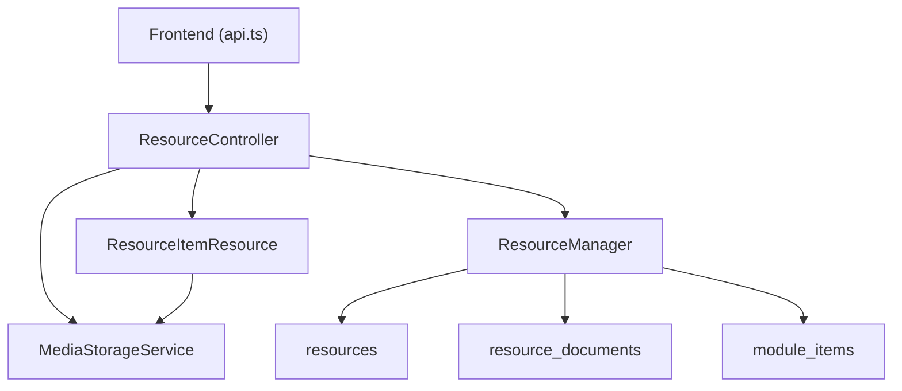
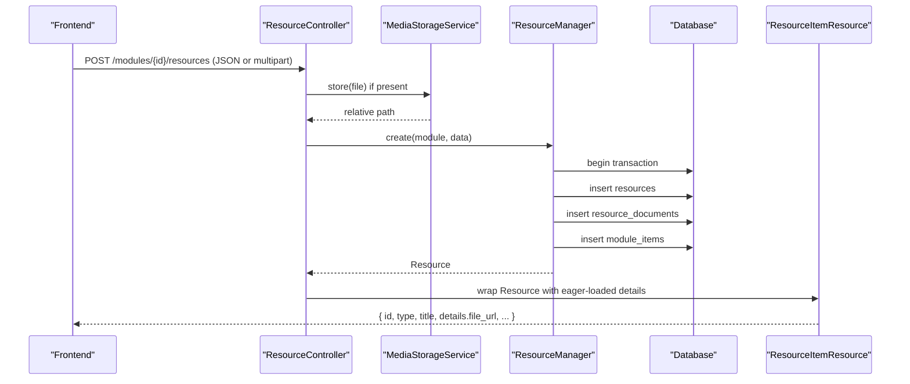
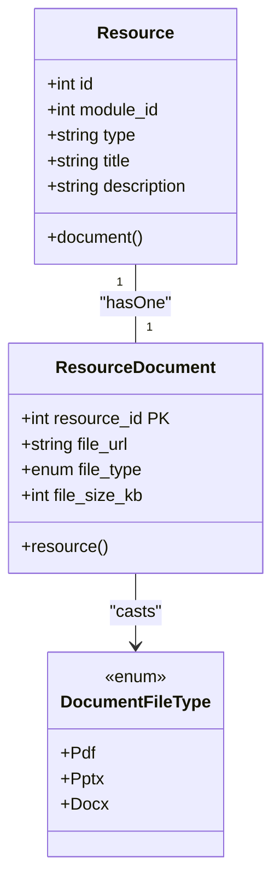
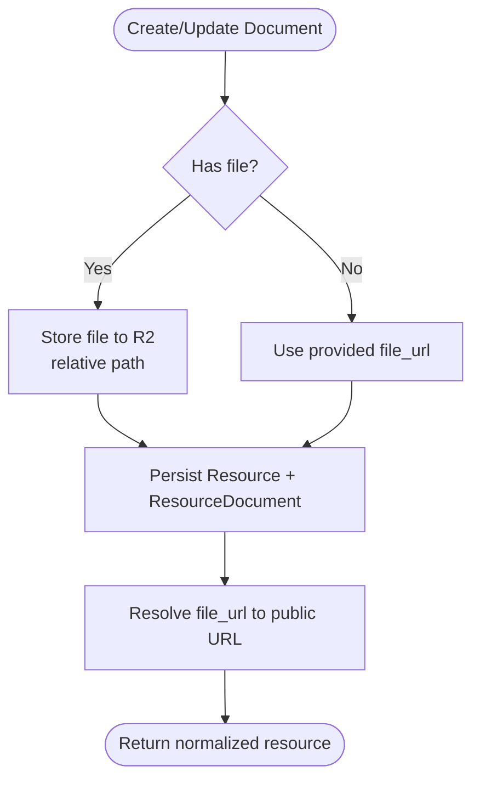
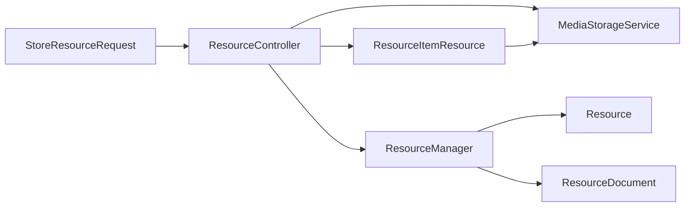

# Document Resources

<cite>
**Referenced Files in This Document**
- [ResourceDocument.php](file://app/Models/ResourceDocument.php)
- [ResourceDownloadableFile.php](file://app/Models/ResourceDownloadableFile.php)
- [Resource.php](file://app/Models/Resource.php)
- [DocumentFileType.php](file://app/Enums/DocumentFileType.php)
- [2024_01_01_000122_create_resource_documents_table.php](file://database/migrations/2024_01_01_000122_create_resource_documents_table.php)
- [2024_01_01_000127_create_resource_downloadable_files_table.php](file://database/migrations/2024_01_01_000127_create_resource_downloadable_files_table.php)
- [ResourceController.php](file://app/Http/Controllers/Api/V1/ResourceController.php)
- [ResourceManager.php](file://app/Services/Content/ResourceManager.php)
- [StoreResourceRequest.php](file://app/Http/Requests/Api/V1/StoreResourceRequest.php)
- [ResourceItemResource.php](file://app/Http/Resources/ResourceItemResource.php)
- [MediaStorageService.php](file://app/Services/Storage/MediaStorageService.php)
- [filesystems.php](file://config/filesystems.php)
- [api.ts](file://frontend/src/features/courseStructure/api.ts)
- [ResourcePolicy.php](file://app/Policies/ResourcePolicy.php)
</cite>

## Table of Contents
1. Introduction
2. Project Structure
3. Core Components
4. Architecture Overview
5. Detailed Component Analysis
6. Dependency Analysis
7. Performance Considerations
8. Troubleshooting Guide
9. Conclusion
10. Appendices

## Introduction
This document explains the data model and end-to-end workflow for Document resources in the platform. It covers the ResourceDocument model structure, file handling capabilities, document-specific attributes, and how documents are uploaded, stored, persisted, and served to users. It also provides examples of creating and managing document resources via the API and frontend.

## Project Structure
The Document resource is one of several resource types attached to a Module. The system uses a polymorphic pattern: a central Resource record points to a type-specific detail table (for documents, ResourceDocument). Files are stored on an object storage disk (Cloudflare R2) through a centralized MediaStorageService, and URLs are resolved for public access.

**Diagram sources**
- [ResourceController.php:25-66](file://app/Http/Controllers/Api/V1/ResourceController.php#L25-L66)
- [ResourceManager.php:33-84](file://app/Services/Content/ResourceManager.php#L33-L84)
- [ResourceItemResource.php:61-75](file://app/Http/Resources/ResourceItemResource.php#L61-L75)
- [MediaStorageService.php:24-79](file://app/Services/Storage/MediaStorageService.php#L24-L79)
- [api.ts:62-87](file://frontend/src/features/courseStructure/api.ts#L62-L87)

**Section sources**
- [ResourceController.php:25-66](file://app/Http/Controllers/Api/V1/ResourceController.php#L25-L66)
- [ResourceManager.php:33-84](file://app/Services/Content/ResourceManager.php#L33-L84)
- [ResourceItemResource.php:61-75](file://app/Http/Resources/ResourceItemResource.php#L61-L75)
- [MediaStorageService.php:24-79](file://app/Services/Storage/MediaStorageService.php#L24-L79)
- [filesystems.php:63-86](file://config/filesystems.php#L63-L86)
- [api.ts:62-87](file://frontend/src/features/courseStructure/api.ts#L62-L87)

## Core Components
- ResourceDocument: Eloquent model representing a document subtype with typed file metadata.
- ResourceDownloadableFile: Similar to ResourceDocument but without a typed file_type; used for generic downloadable files.
- Resource: Central entity linking to its type-specific details (document, video, reading, etc.).
- StoreResourceRequest: Validates inputs for all resource types, including document uploads or URL-based references.
- ResourceManager: Orchestrates creation/update across Resource and its subtype tables within a transaction.
- ResourceController: Handles HTTP requests, delegates file storage, and returns normalized responses.
- ResourceItemResource: Normalizes response payloads and resolves storage URLs for clients.
- MediaStorageService: Single entry point for storing, deleting, and resolving URLs for files on the configured disk.
- Filesystem configuration: Defines the R2 disk used for persistent storage and URL resolution.

**Section sources**
- [ResourceDocument.php:11-33](file://app/Models/ResourceDocument.php#L11-L33)
- [ResourceDownloadableFile.php:10-27](file://app/Models/ResourceDownloadableFile.php#L10-L27)
- [Resource.php:15-93](file://app/Models/Resource.php#L15-L93)
- [StoreResourceRequest.php:25-62](file://app/Http/Requests/Api/V1/StoreResourceRequest.php#L25-L62)
- [ResourceManager.php:33-178](file://app/Services/Content/ResourceManager.php#L33-L178)
- [ResourceController.php:18-84](file://app/Http/Controllers/Api/V1/ResourceController.php#L18-L84)
- [ResourceItemResource.php:22-98](file://app/Http/Resources/ResourceItemResource.php#L22-L98)
- [MediaStorageService.php:24-85](file://app/Services/Storage/MediaStorageService.php#L24-L85)
- [filesystems.php:63-86](file://config/filesystems.php#L63-L86)

## Architecture Overview
The Document resource lifecycle spans request validation, optional file upload, persistence, and response normalization.

**Diagram sources**
- [ResourceController.php:30-46](file://app/Http/Controllers/Api/V1/ResourceController.php#L30-L46)
- [ResourceManager.php:33-58](file://app/Services/Content/ResourceManager.php#L33-L58)
- [ResourceItemResource.php:27-53](file://app/Http/Resources/ResourceItemResource.php#L27-L53)
- [MediaStorageService.php:32-41](file://app/Services/Storage/MediaStorageService.php#L32-L41)

## Detailed Component Analysis

### Data Model: ResourceDocument
- Primary key: resource_id (one-to-one with Resource)
- Attributes:
  - file_url: string, up to 500 characters
  - file_type: enum restricted to pdf, pptx, docx
  - file_size_kb: unsigned integer, nullable
- Relationships:
  - belongsTo Resource via resource_id
- Casting:
  - file_type cast to DocumentFileType enum

**Diagram sources**
- [Resource.php:47-53](file://app/Models/Resource.php#L47-L53)
- [ResourceDocument.php:11-33](file://app/Models/ResourceDocument.php#L11-L33)
- [DocumentFileType.php:7-12](file://app/Enums/DocumentFileType.php#L7-L12)

**Section sources**
- [ResourceDocument.php:11-33](file://app/Models/ResourceDocument.php#L11-L33)
- [2024_01_01_000122_create_resource_documents_table.php:11-18](file://database/migrations/2024_01_01_000122_create_resource_documents_table.php#L11-L18)
- [DocumentFileType.php:7-12](file://app/Enums/DocumentFileType.php#L7-L12)

### Data Model: ResourceDownloadableFile
- Primary key: resource_id (one-to-one with Resource)
- Attributes:
  - file_url: string, up to 500 characters
  - file_size_kb: unsigned integer, nullable
- Differences from ResourceDocument: no file_type field; used for generic downloadable assets.

**Section sources**
- [ResourceDownloadableFile.php:10-27](file://app/Models/ResourceDownloadableFile.php#L10-L27)
- [2024_01_01_000127_create_resource_downloadable_files_table.php:11-17](file://database/migrations/2024_01_01_000127_create_resource_downloadable_files_table.php#L11-L17)

### Upload and Storage Flow
- Frontend sends either JSON or multipart/form-data when a file is included.
- Controller stores the file using MediaStorageService under a per-course prefix.
- Relative paths are saved into the appropriate subtype table (e.g., resource_documents.file_url).
- Responses resolve relative paths to public URLs via MediaStorageService.

**Diagram sources**
- [ResourceController.php:30-66](file://app/Http/Controllers/Api/V1/ResourceController.php#L30-L66)
- [ResourceManager.php:101-141](file://app/Services/Content/ResourceManager.php#L101-L141)
- [ResourceItemResource.php:61-75](file://app/Http/Resources/ResourceItemResource.php#L61-L75)
- [MediaStorageService.php:32-79](file://app/Services/Storage/MediaStorageService.php#L32-L79)

**Section sources**
- [ResourceController.php:30-66](file://app/Http/Controllers/Api/V1/ResourceController.php#L30-L66)
- [StoreResourceRequest.php:39-44](file://app/Http/Requests/Api/V1/StoreResourceRequest.php#L39-L44)
- [ResourceManager.php:101-141](file://app/Services/Content/ResourceManager.php#L101-L141)
- [ResourceItemResource.php:61-75](file://app/Http/Resources/ResourceItemResource.php#L61-L75)
- [MediaStorageService.php:32-79](file://app/Services/Storage/MediaStorageService.php#L32-L79)

### API Request Validation for Documents
- For document type:
  - Either provide file_url (if no file uploaded) or upload a file via the file field.
  - Allowed MIME types include pdf, doc, docx, ppt, pptx, xls, xlsx, zip, csv, txt.
  - file_type must be one of pdf, pptx, docx for document resources.
  - file_size_kb is optional.

**Section sources**
- [StoreResourceRequest.php:39-44](file://app/Http/Requests/Api/V1/StoreResourceRequest.php#L39-L44)

### Response Normalization and Serving
- ResourceItemResource flattens subtype fields into a details object.
- For documents, it includes file_url (resolved to a public URL), file_type, and file_size_kb.
- Clients can use the returned file_url to download or view the document.

**Section sources**
- [ResourceItemResource.php:61-75](file://app/Http/Resources/ResourceItemResource.php#L61-L75)

### Authorization
- Creating, updating, and deleting resources is authorized by ResourcePolicy based on user role and course ownership.

**Section sources**
- [ResourcePolicy.php:15-28](file://app/Policies/ResourcePolicy.php#L15-L28)

## Dependency Analysis

**Diagram sources**
- [StoreResourceRequest.php:25-62](file://app/Http/Requests/Api/V1/StoreResourceRequest.php#L25-L62)
- [ResourceController.php:18-66](file://app/Http/Controllers/Api/V1/ResourceController.php#L18-L66)
- [ResourceManager.php:33-141](file://app/Services/Content/ResourceManager.php#L33-L141)
- [ResourceItemResource.php:27-75](file://app/Http/Resources/ResourceItemResource.php#L27-L75)

**Section sources**
- [StoreResourceRequest.php:25-62](file://app/Http/Requests/Api/V1/StoreResourceRequest.php#L25-L62)
- [ResourceController.php:18-66](file://app/Http/Controllers/Api/V1/ResourceController.php#L18-L66)
- [ResourceManager.php:33-141](file://app/Services/Content/ResourceManager.php#L33-L141)
- [ResourceItemResource.php:27-75](file://app/Http/Resources/ResourceItemResource.php#L27-L75)

## Performance Considerations
- Prefer uploading smaller documents where possible; large files increase upload time and storage costs.
- Reuse existing file URLs when updating to avoid redundant uploads.
- Ensure proper indexing on resource_id in subtype tables (already enforced via primary keys and foreign constraints).
- Avoid unnecessary eager loading; only load required relationships when serving lists.

[No sources needed since this section provides general guidance]

## Troubleshooting Guide
- Upload fails:
  - Verify file size and MIME type against allowed rules.
  - Confirm R2 disk configuration and credentials.
- File not accessible after upload:
  - Ensure MediaStorageService.url resolves relative paths to public URLs.
  - Check that the disk’s public base URL is correctly set.
- Update replaces old file:
  - Controller deletes previous file before storing new one for document and SCORM package types.
- Permission denied:
  - Confirm user has permission to manage the course/module via ResourcePolicy.

**Section sources**
- [StoreResourceRequest.php:39-44](file://app/Http/Requests/Api/V1/StoreResourceRequest.php#L39-L44)
- [filesystems.php:63-86](file://config/filesystems.php#L63-L86)
- [ResourceController.php:48-66](file://app/Http/Controllers/Api/V1/ResourceController.php#L48-L66)
- [ResourcePolicy.php:15-28](file://app/Policies/ResourcePolicy.php#L15-L28)

## Conclusion
Document resources are modeled as a dedicated subtype linked to a central Resource. Files are centrally managed via MediaStorageService and stored on Cloudflare R2, with URLs resolved for public access. The API supports both direct uploads and external URL references, validates inputs strictly, and returns a normalized payload with document metadata. Authorization ensures only authorized users can manage resources within their courses.

## Appendices

### Example: Create a Document Resource
- Frontend sends a POST to modules/{moduleId}/resources with:
  - type: "document"
  - title and optional description
  - Either file (multipart) or file_url (external link)
  - Optional order_index and is_required
- Backend stores the file (if provided), persists Resource and ResourceDocument, and returns a normalized resource with details.file_url.

**Section sources**
- [api.ts:62-73](file://frontend/src/features/courseStructure/api.ts#L62-L73)
- [StoreResourceRequest.php:25-44](file://app/Http/Requests/Api/V1/StoreResourceRequest.php#L25-L44)
- [ResourceController.php:30-46](file://app/Http/Controllers/Api/V1/ResourceController.php#L30-L46)
- [ResourceManager.php:101-115](file://app/Services/Content/ResourceManager.php#L101-L115)
- [ResourceItemResource.php:71-75](file://app/Http/Resources/ResourceItemResource.php#L71-L75)

### Example: Update a Document Resource
- PATCH /resources/{resourceId}
- If a new file is uploaded, the previous file is deleted and replaced.
- Returns updated resource with resolved file_url.

**Section sources**
- [api.ts:75-87](file://frontend/src/features/courseStructure/api.ts#L75-L87)
- [ResourceController.php:48-66](file://app/Http/Controllers/Api/V1/ResourceController.php#L48-L66)
- [ResourceManager.php:147-178](file://app/Services/Content/ResourceManager.php#L147-L178)

### Example: Delete a Document Resource
- DELETE /resources/{resourceId}
- Removes associated module item and resource; subtype row is cascade-deleted.

**Section sources**
- [api.ts:89-91](file://frontend/src/features/courseStructure/api.ts#L89-L91)
- [ResourceController.php:77-84](file://app/Http/Controllers/Api/V1/ResourceController.php#L77-L84)
- [ResourceManager.php:86-96](file://app/Services/Content/ResourceManager.php#L86-L96)