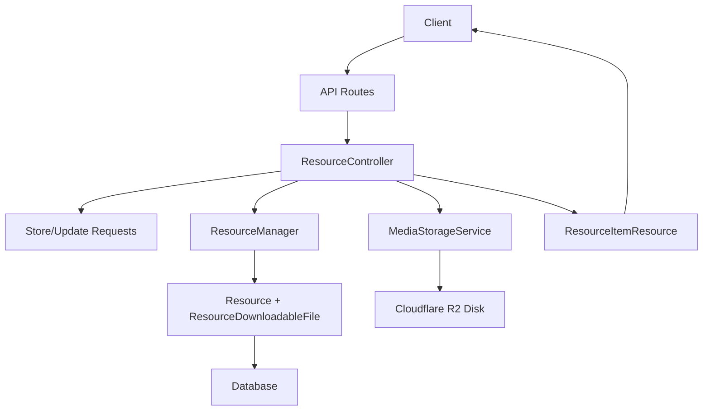
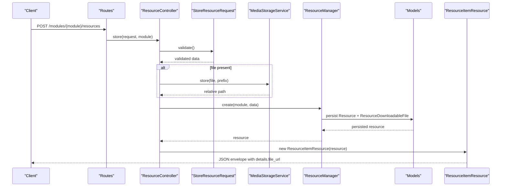
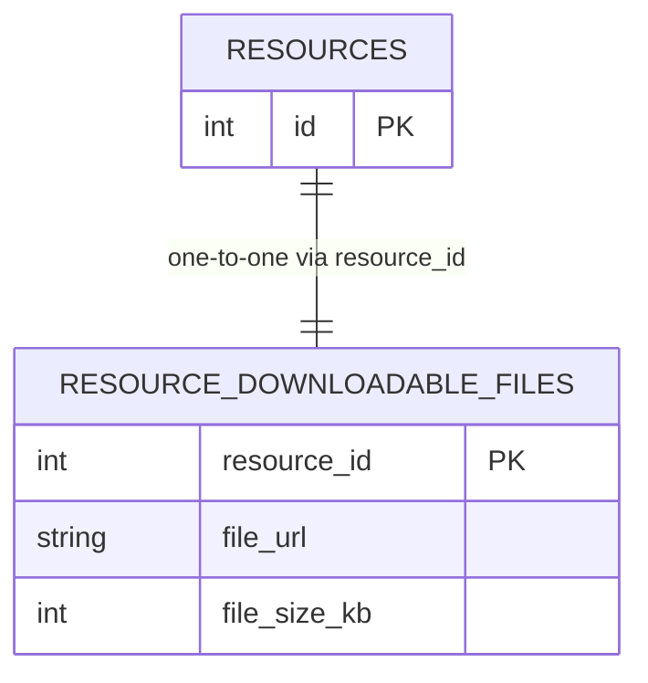
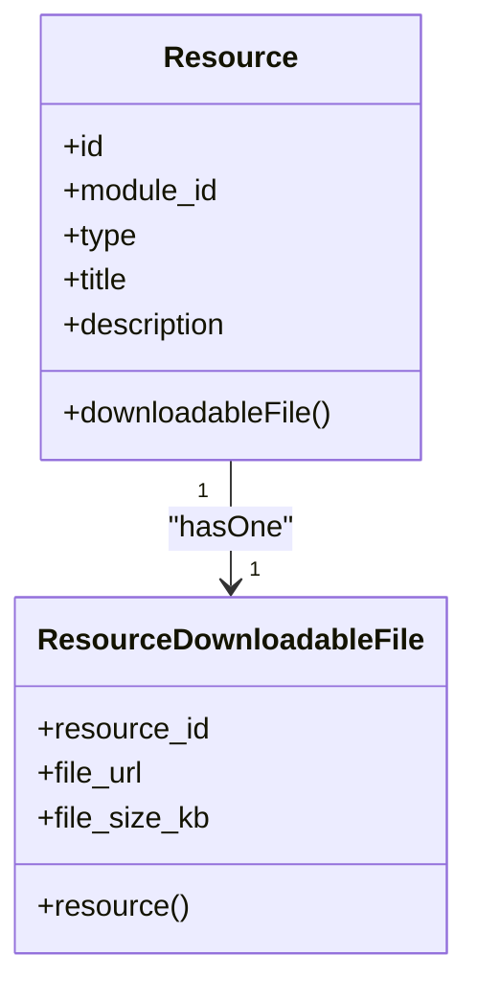
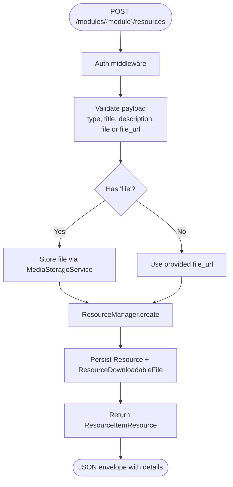
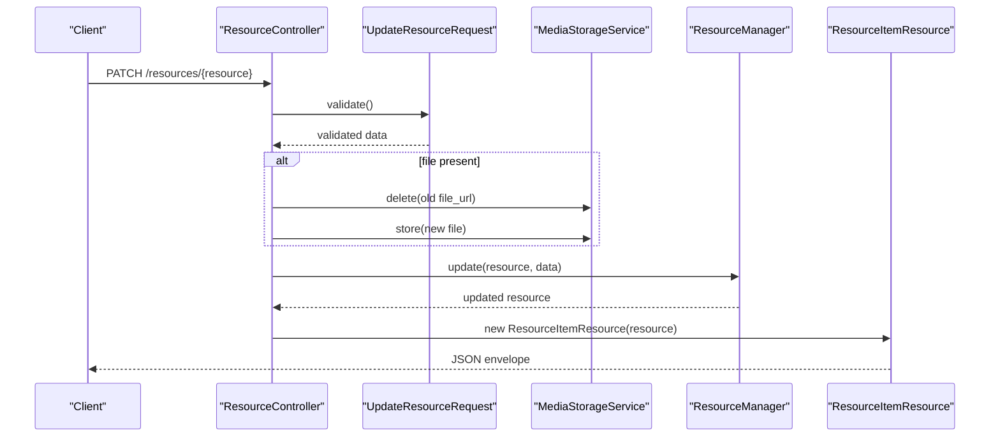
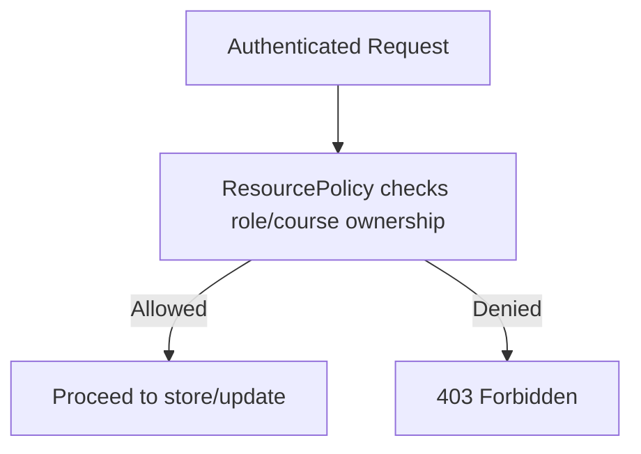
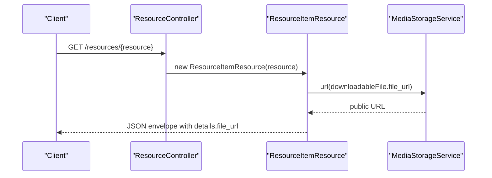
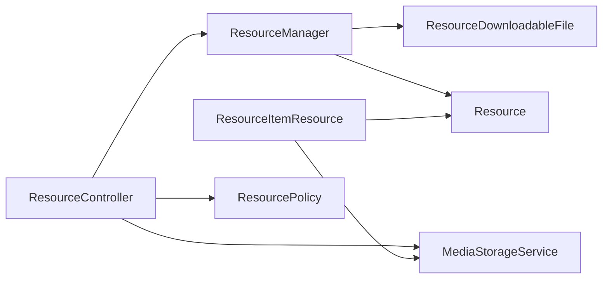

# Downloadable File Resources

<cite>
**Referenced Files in This Document**
- [ResourceDownloadableFile.php](file://app/Models/ResourceDownloadableFile.php)
- [2024_01_01_000127_create_resource_downloadable_files_table.php](file://database/migrations/2024_01_01_000127_create_resource_downloadable_files_table.php)
- [Resource.php](file://app/Models/Resource.php)
- [ResourceManager.php](file://app/Services/Content/ResourceManager.php)
- [MediaStorageService.php](file://app/Services/Storage/MediaStorageService.php)
- [filesystems.php](file://config/filesystems.php)
- [ResourceController.php](file://app/Http/Controllers/Api/V1/ResourceController.php)
- [StoreResourceRequest.php](file://app/Http/Requests/Api/V1/StoreResourceRequest.php)
- [UpdateResourceRequest.php](file://app/Http/Requests/Api/V1/UpdateResourceRequest.php)
- [ResourceItemResource.php](file://app/Http/Resources/ResourceItemResource.php)
- [api.php](file://routes/api.php)
- [ResourcePolicy.php](file://app/Policies/ResourcePolicy.php)
</cite>

## Table of Contents
1. [Introduction](#introduction)
2. [Project Structure](#project-structure)
3. [Core Components](#core-components)
4. [Architecture Overview](#architecture-overview)
5. [Detailed Component Analysis](#detailed-component-analysis)
6. [Dependency Analysis](#dependency-analysis)
7. [Performance Considerations](#performance-considerations)
8. [Troubleshooting Guide](#troubleshooting-guide)
9. [Conclusion](#conclusion)

## Introduction
This document explains the downloadable file resource type for the platform, focusing on the ResourceDownloadableFile model and how downloadable files are created, stored, secured, and served to authorized users. It covers the end-to-end flow from API request to storage and response, including validation, authorization, persistence, and URL resolution through a centralized media service.

## Project Structure
The downloadable file feature is implemented across models, services, controllers, requests, resources, routes, policies, and configuration:
- Model and database schema define the downloadable file record tied to a resource.
- A content service creates and updates resources and their subtype details (including downloadable files).
- A controller handles uploads, delegates to the content service, and returns a normalized resource response.
- Request classes validate inputs and enforce authorization.
- A resource class flattens type-specific details into a consistent API envelope and resolves public URLs.
- Routes expose endpoints under an authenticated scope.
- Policies restrict creation/update/delete to course managers.
- Storage configuration points to a cloud disk used by the media service.

**Diagram sources**
- [api.php:139-142](file://routes/api.php#L139-L142)
- [ResourceController.php:25-66](file://app/Http/Controllers/Api/V1/ResourceController.php#L25-L66)
- [StoreResourceRequest.php:20-44](file://app/Http/Requests/Api/V1/StoreResourceRequest.php#L20-L44)
- [UpdateResourceRequest.php:16-38](file://app/Http/Requests/Api/V1/UpdateResourceRequest.php#L16-L38)
- [MediaStorageService.php:24-79](file://app/Services/Storage/MediaStorageService.php#L24-L79)
- [ResourceManager.php:33-141](file://app/Services/Content/ResourceManager.php#L33-L141)
- [Resource.php:87-93](file://app/Models/Resource.php#L87-L93)
- [ResourceDownloadableFile.php:10-27](file://app/Models/ResourceDownloadableFile.php#L10-L27)
- [ResourceItemResource.php:27-96](file://app/Http/Resources/ResourceItemResource.php#L27-L96)
- [filesystems.php:75-86](file://config/filesystems.php#L75-L86)

**Section sources**
- [api.php:139-142](file://routes/api.php#L139-L142)
- [ResourceController.php:25-66](file://app/Http/Controllers/Api/V1/ResourceController.php#L25-L66)
- [StoreResourceRequest.php:20-44](file://app/Http/Requests/Api/V1/StoreResourceRequest.php#L20-L44)
- [UpdateResourceRequest.php:16-38](file://app/Http/Requests/Api/V1/UpdateResourceRequest.php#L16-L38)
- [MediaStorageService.php:24-79](file://app/Services/Storage/MediaStorageService.php#L24-L79)
- [ResourceManager.php:33-141](file://app/Services/Content/ResourceManager.php#L33-L141)
- [Resource.php:87-93](file://app/Models/Resource.php#L87-L93)
- [ResourceDownloadableFile.php:10-27](file://app/Models/ResourceDownloadableFile.php#L10-L27)
- [ResourceItemResource.php:27-96](file://app/Http/Resources/ResourceItemResource.php#L27-L96)
- [filesystems.php:75-86](file://config/filesystems.php#L75-L86)

## Core Components
- ResourceDownloadableFile model: Represents the downloadable file detail linked one-to-one with a Resource via a primary key that is also a foreign key. Stores the file URL and optional size.
- Resource model: Declares a hasOne relationship to ResourceDownloadableFile and other resource subtypes.
- ResourceManager: Creates/updates resources and their subtype details in a single transaction; for downloadable files, it persists file_url and file_size_kb.
- MediaStorageService: Centralizes upload, deletion, and URL resolution against the configured cloud disk.
- ResourceController: Orchestrates store/update flows, handling file uploads, delegating to MediaStorageService and ResourceManager, and returning normalized responses.
- StoreResourceRequest / UpdateResourceRequest: Validate inputs and authorize operations based on roles and context.
- ResourceItemResource: Flattens subtype data into a unified response shape and resolves public URLs for downloadable files.
- Routes and Policy: Expose authenticated endpoints and enforce that only course managers can create/update/delete resources.

**Section sources**
- [ResourceDownloadableFile.php:10-27](file://app/Models/ResourceDownloadableFile.php#L10-L27)
- [Resource.php:87-93](file://app/Models/Resource.php#L87-L93)
- [ResourceManager.php:33-141](file://app/Services/Content/ResourceManager.php#L33-L141)
- [MediaStorageService.php:24-79](file://app/Services/Storage/MediaStorageService.php#L24-L79)
- [ResourceController.php:25-66](file://app/Http/Controllers/Api/V1/ResourceController.php#L25-L66)
- [StoreResourceRequest.php:20-44](file://app/Http/Requests/Api/V1/StoreResourceRequest.php#L20-L44)
- [UpdateResourceRequest.php:16-38](file://app/Http/Requests/Api/V1/UpdateResourceRequest.php#L16-L38)
- [ResourceItemResource.php:27-96](file://app/Http/Resources/ResourceItemResource.php#L27-L96)
- [api.php:139-142](file://routes/api.php#L139-L142)
- [ResourcePolicy.php:15-28](file://app/Policies/ResourcePolicy.php#L15-L28)

## Architecture Overview
The downloadable file lifecycle spans authentication, validation, storage, persistence, and response formatting. Authorization ensures only course managers can manage resources. Storage uses a cloud disk via a dedicated service that abstracts path vs URL handling. The response layer normalizes all resource types into a consistent envelope.

**Diagram sources**
- [api.php:139-142](file://routes/api.php#L139-L142)
- [ResourceController.php:30-46](file://app/Http/Controllers/Api/V1/ResourceController.php#L30-L46)
- [StoreResourceRequest.php:20-44](file://app/Http/Requests/Api/V1/StoreResourceRequest.php#L20-L44)
- [MediaStorageService.php:32-41](file://app/Services/Storage/MediaStorageService.php#L32-L41)
- [ResourceManager.php:33-58](file://app/Services/Content/ResourceManager.php#L33-L58)
- [ResourceManager.php:136-141](file://app/Services/Content/ResourceManager.php#L136-L141)
- [ResourceItemResource.php:27-96](file://app/Http/Resources/ResourceItemResource.php#L27-L96)

## Detailed Component Analysis

### Data Model: ResourceDownloadableFile
- Primary key: resource_id (also a foreign key to resources), no auto-increment, no timestamps.
- Fields:
  - file_url: string (up to 500 characters)
  - file_size_kb: unsigned integer, nullable
- Relationship: belongsTo Resource via resource_id.

**Diagram sources**
- [2024_01_01_000127_create_resource_downloadable_files_table.php:13-17](file://database/migrations/2024_01_01_000127_create_resource_downloadable_files_table.php#L13-L17)
- [ResourceDownloadableFile.php:12-22](file://app/Models/ResourceDownloadableFile.php#L12-L22)

**Section sources**
- [ResourceDownloadableFile.php:10-27](file://app/Models/ResourceDownloadableFile.php#L10-L27)
- [2024_01_01_000127_create_resource_downloadable_files_table.php:11-18](file://database/migrations/2024_01_01_000127_create_resource_downloadable_files_table.php#L11-L18)

### Relationships and Type Dispatch
- Resource declares a hasOne relationship to ResourceDownloadableFile, enabling eager loading and typed access.
- ResourceManager dispatches creation/update to the correct subtype table based on ResourceType::DownloadableFile, persisting file_url and file_size_kb.

**Diagram sources**
- [Resource.php:87-93](file://app/Models/Resource.php#L87-L93)
- [ResourceDownloadableFile.php:24-27](file://app/Models/ResourceDownloadableFile.php#L24-L27)
- [ResourceManager.php:136-141](file://app/Services/Content/ResourceManager.php#L136-L141)

**Section sources**
- [Resource.php:87-93](file://app/Models/Resource.php#L87-L93)
- [ResourceManager.php:136-141](file://app/Services/Content/ResourceManager.php#L136-L141)

### Upload and Creation Flow
- Route: POST /modules/{module}/resources (authenticated).
- Validation: StoreResourceRequest enforces type, title/description, and type-specific fields. For downloadable_file, either file or file_url is required; file takes precedence when both are provided. Allowed MIME types and size limits apply.
- Storage: If a file is uploaded, ResourceController stores it via MediaStorageService under a module-scoped prefix.
- Persistence: ResourceManager.create persists Resource and its ResourceDownloadableFile subtype within a transaction, also creating a ModuleItem entry.
- Response: ResourceItemResource flattens details, resolving file_url to a public URL.

**Diagram sources**
- [api.php:139-142](file://routes/api.php#L139-L142)
- [StoreResourceRequest.php:25-44](file://app/Http/Requests/Api/V1/StoreResourceRequest.php#L25-L44)
- [ResourceController.php:30-46](file://app/Http/Controllers/Api/V1/ResourceController.php#L30-L46)
- [ResourceManager.php:33-58](file://app/Services/Content/ResourceManager.php#L33-L58)
- [ResourceManager.php:136-141](file://app/Services/Content/ResourceManager.php#L136-L141)
- [ResourceItemResource.php:27-96](file://app/Http/Resources/ResourceItemResource.php#L27-L96)

**Section sources**
- [api.php:139-142](file://routes/api.php#L139-L142)
- [StoreResourceRequest.php:25-44](file://app/Http/Requests/Api/V1/StoreResourceRequest.php#L25-L44)
- [ResourceController.php:30-46](file://app/Http/Controllers/Api/V1/ResourceController.php#L30-L46)
- [ResourceManager.php:33-58](file://app/Services/Content/ResourceManager.php#L33-L58)
- [ResourceManager.php:136-141](file://app/Services/Content/ResourceManager.php#L136-L141)
- [ResourceItemResource.php:27-96](file://app/Http/Resources/ResourceItemResource.php#L27-L96)

### Update Flow
- Route: PATCH /resources/{resource} (authenticated).
- Validation: UpdateResourceRequest allows selective updates to metadata and subtype fields. For downloadable_file, file or file_url may be updated; file takes precedence if present.
- Storage: On update with a new file, old file is deleted before storing the replacement.
- Persistence: ResourceManager.update modifies Resource metadata and subtype fields within a transaction.
- Response: ResourceItemResource returns updated details with resolved URLs.

**Diagram sources**
- [api.php:140-142](file://routes/api.php#L140-L142)
- [UpdateResourceRequest.php:16-38](file://app/Http/Requests/Api/V1/UpdateResourceRequest.php#L16-L38)
- [ResourceController.php:48-66](file://app/Http/Controllers/Api/V1/ResourceController.php#L48-L66)
- [ResourceManager.php:64-83](file://app/Services/Content/ResourceManager.php#L64-L83)
- [ResourceManager.php:147-177](file://app/Services/Content/ResourceManager.php#L147-L177)
- [ResourceItemResource.php:27-96](file://app/Http/Resources/ResourceItemResource.php#L27-L96)

**Section sources**
- [api.php:140-142](file://routes/api.php#L140-L142)
- [UpdateResourceRequest.php:16-38](file://app/Http/Requests/Api/V1/UpdateResourceRequest.php#L16-L38)
- [ResourceController.php:48-66](file://app/Http/Controllers/Api/V1/ResourceController.php#L48-L66)
- [ResourceManager.php:64-83](file://app/Services/Content/ResourceManager.php#L64-L83)
- [ResourceManager.php:147-177](file://app/Services/Content/ResourceManager.php#L147-L177)
- [ResourceItemResource.php:27-96](file://app/Http/Resources/ResourceItemResource.php#L27-L96)

### Security and Access Control
- Authentication: All write endpoints are protected by Sanctum middleware.
- Authorization: ResourcePolicy restricts create/update/delete to Admin or Instructors teaching the course.
- Storage security: Files are stored on a cloud disk configured via filesystems.php; URLs are resolved through MediaStorageService, which passes through external URLs and builds public URLs for internal paths.

**Diagram sources**
- [api.php:68-142](file://routes/api.php#L68-L142)
- [ResourcePolicy.php:15-28](file://app/Policies/ResourcePolicy.php#L15-L28)
- [MediaStorageService.php:64-79](file://app/Services/Storage/MediaStorageService.php#L64-L79)
- [filesystems.php:75-86](file://config/filesystems.php#L75-L86)

**Section sources**
- [api.php:68-142](file://routes/api.php#L68-L142)
- [ResourcePolicy.php:15-28](file://app/Policies/ResourcePolicy.php#L15-L28)
- [MediaStorageService.php:64-79](file://app/Services/Storage/MediaStorageService.php#L64-L79)
- [filesystems.php:75-86](file://config/filesystems.php#L75-L86)

### Serving Downloadable Files
- Read endpoint: GET /resources/{resource} returns a normalized resource envelope.
- Details: For downloadable_file, details include file_url (resolved to a public URL) and file_size_kb.
- URL resolution: MediaStorageService.url converts stored relative paths to public URLs or passes through external URLs unchanged.

**Diagram sources**
- [api.php:59](file://routes/api.php#L59)
- [ResourceController.php:25-28](file://app/Http/Controllers/Api/V1/ResourceController.php#L25-L28)
- [ResourceItemResource.php:27-96](file://app/Http/Resources/ResourceItemResource.php#L27-L96)
- [MediaStorageService.php:64-79](file://app/Services/Storage/MediaStorageService.php#L64-L79)

**Section sources**
- [api.php:59](file://routes/api.php#L59)
- [ResourceController.php:25-28](file://app/Http/Controllers/Api/V1/ResourceController.php#L25-L28)
- [ResourceItemResource.php:27-96](file://app/Http/Resources/ResourceItemResource.php#L27-L96)
- [MediaStorageService.php:64-79](file://app/Services/Storage/MediaStorageService.php#L64-L79)

## Dependency Analysis
Key dependencies and coupling:
- ResourceController depends on ResourceManager and MediaStorageService for orchestration.
- ResourceManager depends on ResourceType enum and multiple subtype models; it centralizes cross-cutting concerns like transactions and ModuleItem synchronization.
- MediaStorageService abstracts storage driver details and URL resolution, decoupling callers from disk specifics.
- ResourceItemResource depends on MediaStorageService to resolve public URLs consistently.
- Policies depend on user roles and course relationships to enforce access control.

**Diagram sources**
- [ResourceController.php:20-23](file://app/Http/Controllers/Api/V1/ResourceController.php#L20-L23)
- [ResourceManager.php:33-141](file://app/Services/Content/ResourceManager.php#L33-L141)
- [ResourceItemResource.php:27-96](file://app/Http/Resources/ResourceItemResource.php#L27-L96)
- [ResourcePolicy.php:15-28](file://app/Policies/ResourcePolicy.php#L15-L28)

**Section sources**
- [ResourceController.php:20-23](file://app/Http/Controllers/Api/V1/ResourceController.php#L20-L23)
- [ResourceManager.php:33-141](file://app/Services/Content/ResourceManager.php#L33-L141)
- [ResourceItemResource.php:27-96](file://app/Http/Resources/ResourceItemResource.php#L27-L96)
- [ResourcePolicy.php:15-28](file://app/Policies/ResourcePolicy.php#L15-L28)

## Performance Considerations
- Eager loading: The show endpoint loads all possible resource subtypes; ensure only needed relations are loaded in list endpoints to avoid N+1 queries.
- Transactional writes: ResourceManager wraps create/update/delete in transactions to maintain consistency between Resource, subtype tables, and ModuleItem.
- Storage I/O: MediaStorageService centralizes disk calls; consider caching public URLs if frequently accessed and stable.
- Validation: Strict MIME and size limits reduce risk and processing overhead during uploads.

[No sources needed since this section provides general guidance]

## Troubleshooting Guide
Common issues and resolutions:
- Validation errors: Ensure type matches expected values and that either file or file_url is provided for downloadable_file. Check allowed MIME types and size limits.
- Authorization failures: Verify the user has appropriate role and course ownership per ResourcePolicy.
- Storage failures: Confirm cloud disk credentials and bucket configuration; MediaStorageService throws on store failure and ignores deletion for external URLs.
- Missing URLs in responses: Ensure downloadableFile exists and file_url is set; ResourceItemResource resolves URLs via MediaStorageService.

**Section sources**
- [StoreResourceRequest.php:25-44](file://app/Http/Requests/Api/V1/StoreResourceRequest.php#L25-L44)
- [UpdateResourceRequest.php:21-38](file://app/Http/Requests/Api/V1/UpdateResourceRequest.php#L21-L38)
- [ResourcePolicy.php:15-28](file://app/Policies/ResourcePolicy.php#L15-L28)
- [MediaStorageService.php:32-41](file://app/Services/Storage/MediaStorageService.php#L32-L41)
- [MediaStorageService.php:55-62](file://app/Services/Storage/MediaStorageService.php#L55-L62)
- [ResourceItemResource.php:92-95](file://app/Http/Resources/ResourceItemResource.php#L92-L95)

## Conclusion
The downloadable file resource type integrates cleanly with the broader resource system. It leverages a dedicated model, centralized storage, robust validation, and policy-based authorization to provide secure, reliable file management. The unified API surface and normalized response shape simplify client integration while maintaining strong separation of concerns across layers.

[No sources needed since this section summarizes without analyzing specific files]