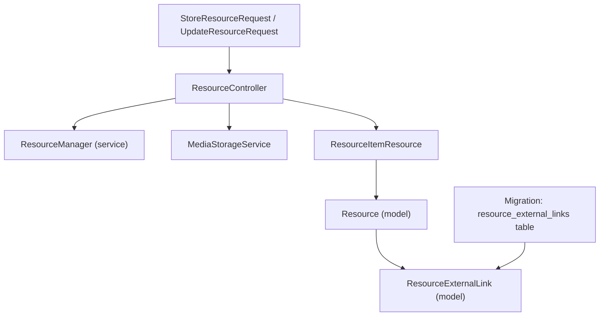
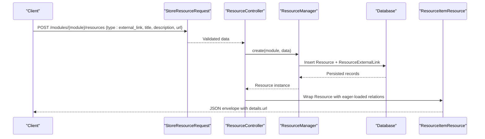
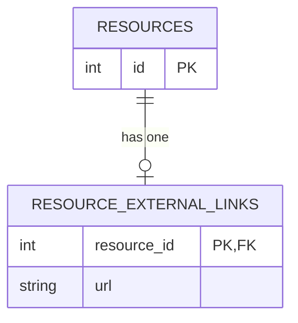
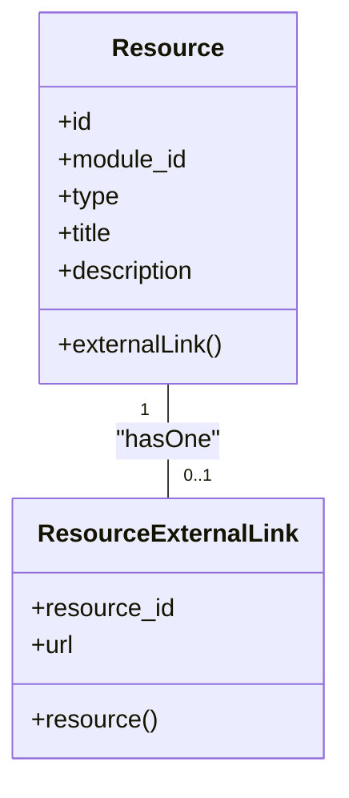
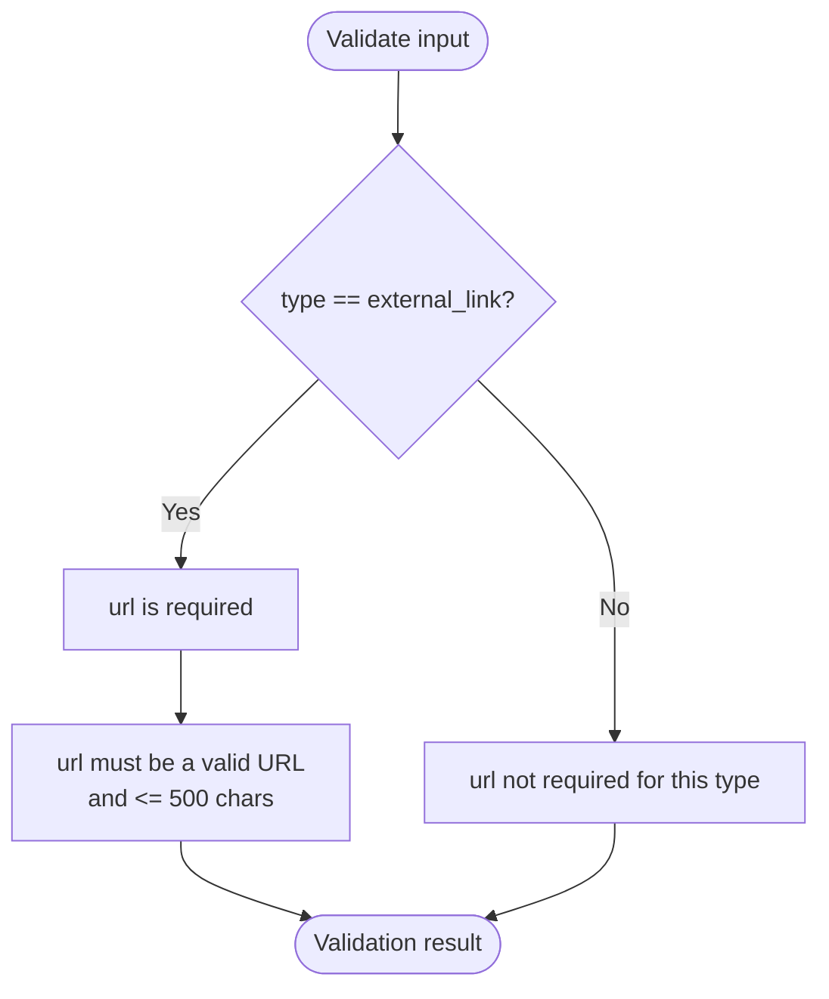
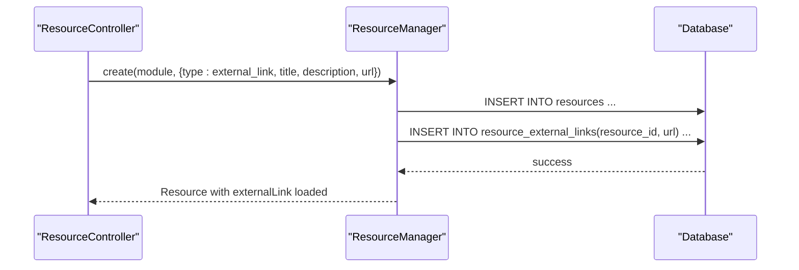
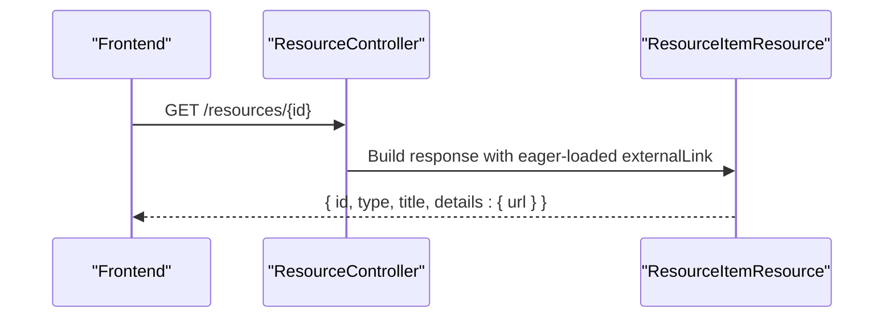
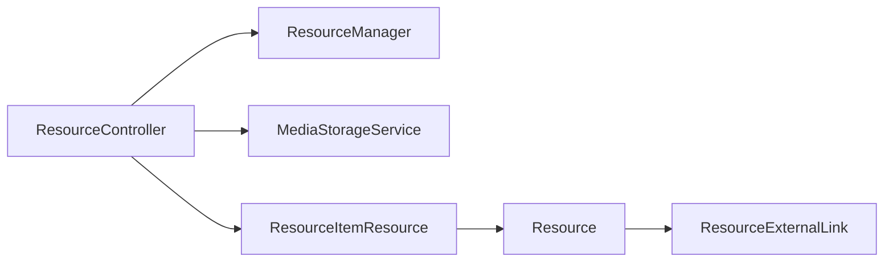

# External Link Resources

<cite>
**Referenced Files in This Document**
- [ResourceExternalLink.php](file://app/Models/ResourceExternalLink.php)
- [2024_01_01_000124_create_resource_external_links_table.php](file://database/migrations/2024_01_01_000124_create_resource_external_links_table.php)
- [Resource.php](file://app/Models/Resource.php)
- [StoreResourceRequest.php](file://app/Http/Requests/Api/V1/StoreResourceRequest.php)
- [UpdateResourceRequest.php](file://app/Http/Requests/Api/V1/UpdateResourceRequest.php)
- [ResourceItemResource.php](file://app/Http/Resources/ResourceItemResource.php)
- [ResourceController.php](file://app/Http/Controllers/Api/V1/ResourceController.php)
</cite>

## Table of Contents
1. Introduction
2. Project Structure
3. Core Components
4. Architecture Overview
5. Detailed Component Analysis
6. Dependency Analysis
7. Performance Considerations
8. Troubleshooting Guide
9. Conclusion

## Introduction
This document explains the external link resource type used in the learning platform. It covers the ResourceExternalLink data model, how URLs are validated and stored, and how external links are rendered to learners. It also provides examples for creating external link resources and handling different URL types.

## Project Structure
The external link feature spans models, migrations, API requests, resources, and controllers:
- Model defines the external link record and its relationship to a Resource.
- Migration defines the database schema for storing external link URLs.
- Request classes validate incoming URL inputs during create/update operations.
- Controller orchestrates creation and updates via a content service.
- Resource normalizes the response payload to include external link details.

**Diagram sources**
- [ResourceController.php:25-66](file://app/Http/Controllers/Api/V1/ResourceController.php#L25-L66)
- [StoreResourceRequest.php:25-62](file://app/Http/Requests/Api/V1/StoreResourceRequest.php#L25-L62)
- [UpdateResourceRequest.php:21-53](file://app/Http/Requests/Api/V1/UpdateResourceRequest.php#L21-L53)
- [Resource.php:63-69](file://app/Models/Resource.php#L63-L69)
- [ResourceExternalLink.php:10-26](file://app/Models/ResourceExternalLink.php#L10-L26)
- [2024_01_01_000124_create_resource_external_links_table.php:11-16](file://database/migrations/2024_01_01_000124_create_resource_external_links_table.php#L11-L16)
- [ResourceItemResource.php:27-53](file://app/Http/Resources/ResourceItemResource.php#L27-L53)

**Section sources**
- [ResourceExternalLink.php:10-26](file://app/Models/ResourceExternalLink.php#L10-L26)
- [2024_01_01_000124_create_resource_external_links_table.php:11-16](file://database/migrations/2024_01_01_000124_create_resource_external_links_table.php#L11-L16)
- [Resource.php:63-69](file://app/Models/Resource.php#L63-L69)
- [StoreResourceRequest.php:49-50](file://app/Http/Requests/Api/V1/StoreResourceRequest.php#L49-L50)
- [UpdateResourceRequest.php:42-42](file://app/Http/Requests/Api/V1/UpdateResourceRequest.php#L42-L42)
- [ResourceItemResource.php:79-81](file://app/Http/Resources/ResourceItemResource.php#L79-L81)
- [ResourceController.php:25-66](file://app/Http/Controllers/Api/V1/ResourceController.php#L25-L66)

## Core Components
- ResourceExternalLink model: Stores a single URL per external link resource and links back to its parent Resource.
- Database schema: A primary key foreign key to resources and a string column for the URL with a length limit.
- Validation rules: The URL field is required when the resource type is external_link and must be a valid URL with a maximum length.
- Rendering: The API response flattens type-specific details into a details object; for external links, it includes the url field.

Key behaviors:
- One-to-one relationship between Resource and ResourceExternalLink.
- No auto-incrementing or timestamps on the external link table.
- URL validation enforced at the request layer before persistence.

**Section sources**
- [ResourceExternalLink.php:10-26](file://app/Models/ResourceExternalLink.php#L10-L26)
- [2024_01_01_000124_create_resource_external_links_table.php:11-16](file://database/migrations/2024_01_01_000124_create_resource_external_links_table.php#L11-L16)
- [StoreResourceRequest.php:49-50](file://app/Http/Requests/Api/V1/StoreResourceRequest.php#L49-L50)
- [UpdateResourceRequest.php:42-42](file://app/Http/Requests/Api/V1/UpdateResourceRequest.php#L42-L42)
- [ResourceItemResource.php:79-81](file://app/Http/Resources/ResourceItemResource.php#L79-L81)

## Architecture Overview
End-to-end flow for creating an external link resource:

**Diagram sources**
- [StoreResourceRequest.php:25-62](file://app/Http/Requests/Api/V1/StoreResourceRequest.php#L25-L62)
- [ResourceController.php:30-46](file://app/Http/Controllers/Api/V1/ResourceController.php#L30-L46)
- [ResourceItemResource.php:27-53](file://app/Http/Resources/ResourceItemResource.php#L27-L53)

## Detailed Component Analysis

### Data Model: ResourceExternalLink
- Primary key: resource_id (foreign key to resources).
- Columns:
  - resource_id: integer, primary key, cascading delete.
  - url: string(500), stores the external destination URL.
- Relationships:
  - belongsTo Resource via resource_id.

**Diagram sources**
- [2024_01_01_000124_create_resource_external_links_table.php:11-16](file://database/migrations/2024_01_01_000124_create_resource_external_links_table.php#L11-L16)

**Section sources**
- [ResourceExternalLink.php:10-26](file://app/Models/ResourceExternalLink.php#L10-L26)
- [2024_01_01_000124_create_resource_external_links_table.php:11-16](file://database/migrations/2024_01_01_000124_create_resource_external_links_table.php#L11-L16)

### Relationship to Resource
- Resource has a one-to-one relation to ResourceExternalLink named externalLink.
- When loading a Resource for API responses, the externalLink relation is eager-loaded to include the URL in the response.

**Diagram sources**
- [Resource.php:63-69](file://app/Models/Resource.php#L63-L69)
- [ResourceExternalLink.php:23-26](file://app/Models/ResourceExternalLink.php#L23-L26)

**Section sources**
- [Resource.php:63-69](file://app/Models/Resource.php#L63-L69)
- [ResourceExternalLink.php:23-26](file://app/Models/ResourceExternalLink.php#L23-L26)

### Validation Rules for External Links
- Creation:
  - When type equals external_link, url is required and must be a valid URL with a maximum length.
- Update:
  - url is optional and, if provided, must be a valid URL with a maximum length.

**Diagram sources**
- [StoreResourceRequest.php:49-50](file://app/Http/Requests/Api/V1/StoreResourceRequest.php#L49-L50)
- [UpdateResourceRequest.php:42-42](file://app/Http/Requests/Api/V1/UpdateResourceRequest.php#L42-L42)

**Section sources**
- [StoreResourceRequest.php:49-50](file://app/Http/Requests/Api/V1/StoreResourceRequest.php#L49-L50)
- [UpdateResourceRequest.php:42-42](file://app/Http/Requests/Api/V1/UpdateResourceRequest.php#L42-L42)

### Storage and Persistence
- The controller delegates creation and updates to a content service (ResourceManager).
- For external links, no file storage is involved; only the URL is persisted in the resource_external_links table.
- On update, existing files may be replaced for other resource types; external links simply overwrite the url value.

**Diagram sources**
- [ResourceController.php:30-46](file://app/Http/Controllers/Api/V1/ResourceController.php#L30-L46)
- [2024_01_01_000124_create_resource_external_links_table.php:11-16](file://database/migrations/2024_01_01_000124_create_resource_external_links_table.php#L11-L16)

**Section sources**
- [ResourceController.php:30-46](file://app/Http/Controllers/Api/V1/ResourceController.php#L30-L46)

### Rendering in the Learning Interface
- The API returns a normalized envelope containing basic resource metadata plus a details object.
- For external links, details contains a url field sourced from the related ResourceExternalLink.
- Frontend components can render a clickable link using this url.

**Diagram sources**
- [ResourceController.php:25-28](file://app/Http/Controllers/Api/V1/ResourceController.php#L25-L28)
- [ResourceItemResource.php:27-53](file://app/Http/Resources/ResourceItemResource.php#L27-L53)
- [ResourceItemResource.php:79-81](file://app/Http/Resources/ResourceItemResource.php#L79-L81)

**Section sources**
- [ResourceItemResource.php:27-53](file://app/Http/Resources/ResourceItemResource.php#L27-L53)
- [ResourceItemResource.php:79-81](file://app/Http/Resources/ResourceItemResource.php#L79-L81)

### Examples: Creating External Link Resources
- Create an external link resource:
  - Set type to external_link.
  - Provide title and optional description.
  - Provide url that passes validation (valid URL, max length).
- Update an external link resource:
  - Optionally update url; it must still pass validation if included.

Notes:
- The controller strips file-related fields before delegating to the service; for external links, only the url matters.
- The response will include details.url for consumption by the frontend.

**Section sources**
- [StoreResourceRequest.php:49-50](file://app/Http/Requests/Api/V1/StoreResourceRequest.php#L49-L50)
- [UpdateResourceRequest.php:42-42](file://app/Http/Requests/Api/V1/UpdateResourceRequest.php#L42-L42)
- [ResourceController.php:30-46](file://app/Http/Controllers/Api/V1/ResourceController.php#L30-L46)
- [ResourceItemResource.php:79-81](file://app/Http/Resources/ResourceItemResource.php#L79-L81)

### Handling Different URL Types
- The system accepts any URL that passes standard URL validation and length constraints.
- There is no explicit allowlist or protocol restriction in the validation rules shown.
- Typical supported schemes include http and https; ensure your client sends well-formed URLs.

Best practices:
- Always use absolute URLs.
- Avoid extremely long query strings to stay within the length limit.
- Ensure the target site allows embedding or linking from your learning interface.

**Section sources**
- [StoreResourceRequest.php:49-50](file://app/Http/Requests/Api/V1/StoreResourceRequest.php#L49-L50)
- [UpdateResourceRequest.php:42-42](file://app/Http/Requests/Api/V1/UpdateResourceRequest.php#L42-L42)

## Dependency Analysis
- Resource depends on ResourceType enum to determine behavior.
- ResourceExternalLink depends on Resource via a foreign key.
- ResourceController depends on ResourceManager and MediaStorageService; for external links, MediaStorageService is not used.
- ResourceItemResource depends on Resource and its relations to build the response envelope.

**Diagram sources**
- [ResourceController.php:20-23](file://app/Http/Controllers/Api/V1/ResourceController.php#L20-L23)
- [ResourceItemResource.php:27-53](file://app/Http/Resources/ResourceItemResource.php#L27-L53)
- [Resource.php:63-69](file://app/Models/Resource.php#L63-L69)
- [ResourceExternalLink.php:23-26](file://app/Models/ResourceExternalLink.php#L23-L26)

**Section sources**
- [ResourceController.php:20-23](file://app/Http/Controllers/Api/V1/ResourceController.php#L20-L23)
- [ResourceItemResource.php:27-53](file://app/Http/Resources/ResourceItemResource.php#L27-L53)
- [Resource.php:63-69](file://app/Models/Resource.php#L63-L69)
- [ResourceExternalLink.php:23-26](file://app/Models/ResourceExternalLink.php#L23-L26)

## Performance Considerations
- Eager-loading relations: The show endpoint loads all possible detail relations; for external links, this ensures the url is available without extra queries.
- Indexes: The migration uses a foreign key constraint which typically creates an index; this supports efficient joins when querying resources with their external links.
- Payload size: External links add minimal overhead since only a short string is stored and returned.

[No sources needed since this section provides general guidance]

## Troubleshooting Guide
Common issues and resolutions:
- Validation error on url:
  - Ensure the url is a properly formatted URL and does not exceed the maximum length.
  - Confirm that type is set to external_link when providing url on create.
- Missing url in response:
  - Verify that the resource was created with type external_link and that the externalLink relation is present.
  - Check that the show endpoint loads the externalLink relation.
- Unexpected behavior on update:
  - If updating url, confirm it passes validation rules.
  - Other resource types may involve file uploads; external links do not use file storage.

**Section sources**
- [StoreResourceRequest.php:49-50](file://app/Http/Requests/Api/V1/StoreResourceRequest.php#L49-L50)
- [UpdateResourceRequest.php:42-42](file://app/Http/Requests/Api/V1/UpdateResourceRequest.php#L42-L42)
- [ResourceController.php:25-28](file://app/Http/Controllers/Api/V1/ResourceController.php#L25-L28)

## Conclusion
The external link resource type provides a simple, robust way to attach external URLs to learning content. The model stores a single URL per resource, validation ensures correctness, and the API returns a consistent envelope with details.url for rendering. This design keeps the database normalized while presenting a unified interface to clients.

[No sources needed since this section summarizes without analyzing specific files]