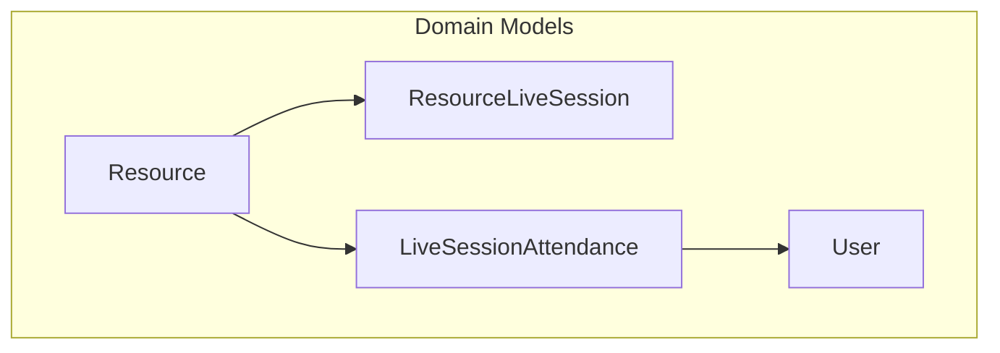
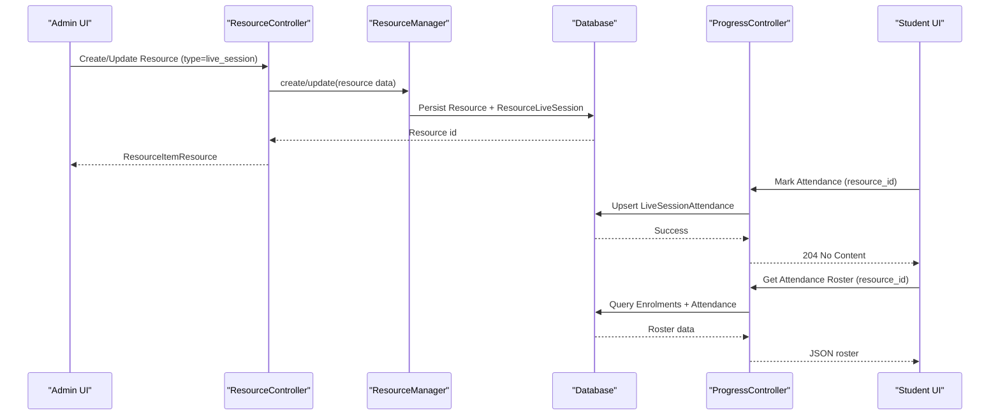
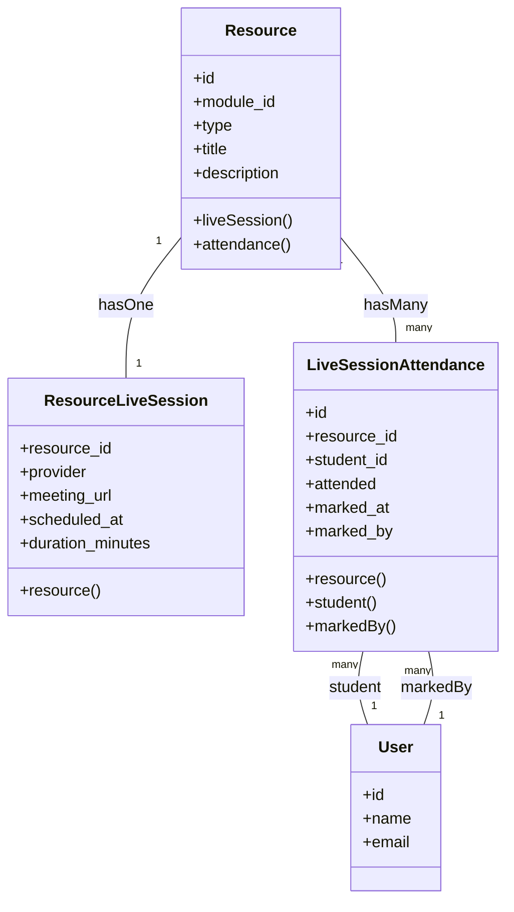
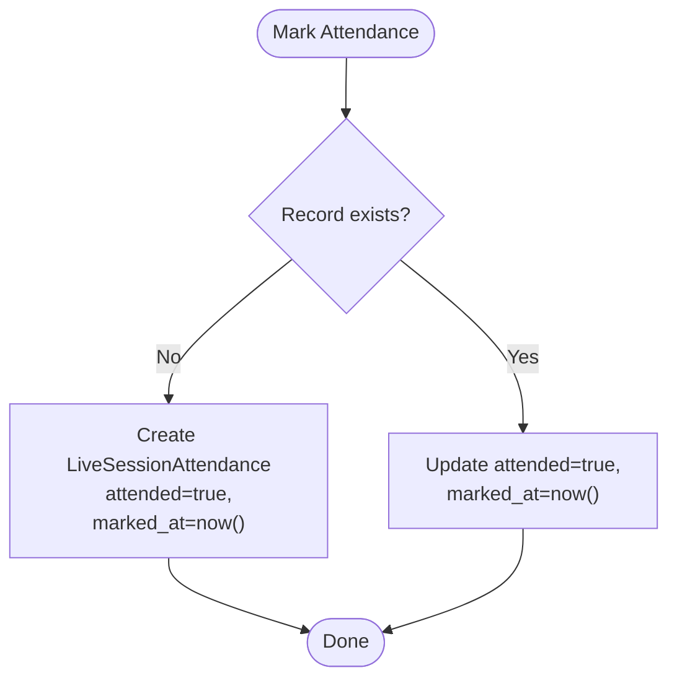
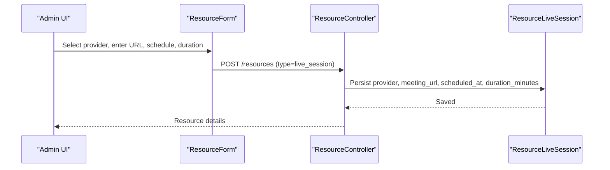
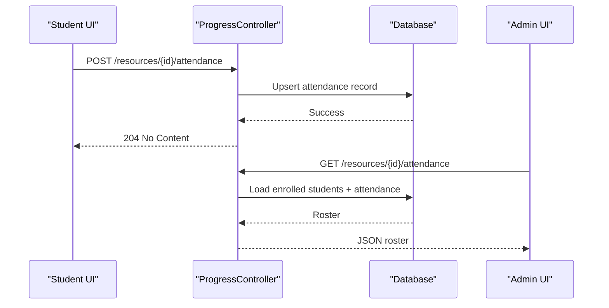
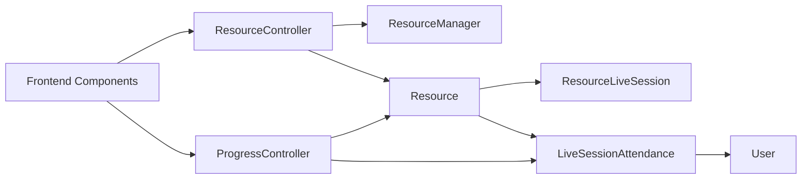

# Live Session Resources

<cite>
**Referenced Files in This Document**
- [ResourceLiveSession.php](file://app/Models/ResourceLiveSession.php)
- [LiveSessionAttendance.php](file://app/Models/LiveSessionAttendance.php)
- [Resource.php](file://app/Models/Resource.php)
- [LiveSessionProvider.php](file://app/Enums/LiveSessionProvider.php)
- [2024_01_01_000126_create_resource_live_sessions_table.php](file://database/migrations/2024_01_01_000126_create_resource_live_sessions_table.php)
- [2024_01_01_000128_create_live_session_attendance_table.php](file://database/migrations/2024_01_01_000128_create_live_session_attendance_table.php)
- [ResourceController.php](file://app/Http/Controllers/Api/V1/ResourceController.php)
- [ProgressController.php](file://app/Http/Controllers/Api/V1/ProgressController.php)
- [ResourceForm.tsx](file://frontend/src/features/courseStructure(ResourceForm.tsx)
- [ResourceViewerPage.tsx](file://frontend/src/features/learning(ResourceViewerPage.tsx)
- [api.ts](file://frontend/src/features/progress/api.ts)
- [useProgress.ts](file://frontend/src/features/progress/useProgress.ts)
- [AttendanceRosterPage.tsx](file://frontend/src/features/progress/AttendanceRosterPage.tsx)
- [LiveSessionAttendanceFactory.php](file://database/factories/LiveSessionAttendanceFactory.php)
</cite>

## Table of Contents
1. Introduction
2. Project Structure
3. Core Components
4. Architecture Overview
5. Detailed Component Analysis
6. Dependency Analysis
7. Performance Considerations
8. Troubleshooting Guide
9. Conclusion
10. Appendices

## Introduction
This document explains the live session resource type within the course structure, focusing on:
- The ResourceLiveSession data model and scheduling capabilities
- Integration with live session providers (Zoom, Google Meet)
- Attendance tracking via the LiveSessionAttendance model
- How live sessions are created, viewed, and managed through the API and frontend
- Practical examples for creating live sessions and tracking participant attendance

## Project Structure
Live sessions are modeled as a specialized resource type attached to a module item. Scheduling details and provider information are stored in a dedicated table linked one-to-one with the resource. Attendance is tracked per student per session.

**Diagram sources**
- [Resource.php:80-101](file://app/Models/Resource.php#L80-L101)
- [ResourceLiveSession.php:32-35](file://app/Models/ResourceLiveSession.php#L32-L35)
- [LiveSessionAttendance.php:37-56](file://app/Models/LiveSessionAttendance.php#L37-L56)

**Section sources**
- [Resource.php:20-29](file://app/Models/Resource.php#L20-L29)
- [ResourceLiveSession.php:19-30](file://app/Models/ResourceLiveSession.php#L19-L30)
- [LiveSessionAttendance.php:21-32](file://app/Models/LiveSessionAttendance.php#L21-L32)

## Core Components
- ResourceLiveSession: Stores provider, meeting URL, scheduled time, and duration for a live session resource. It uses a one-to-one relationship with Resource and casts provider to an enum and scheduled_at to datetime.
- LiveSessionAttendance: Records whether a student attended a specific live session, when it was marked, and who marked it. It enforces a unique constraint per resource and student.
- LiveSessionProvider: Enumerates supported providers (Zoom, Google Meet).
- Resource: Central content entity that can be a video, document, reading, external link, SCORM package, downloadable file, or live session. It exposes relationships to each subtype and to attendance records.

Key behaviors:
- Creation/update of live session resources flows through the resource controller and manager; scheduling fields are part of the resource’s payload.
- Attendance marking is exposed via a progress endpoint and enforced by authorization policies.
- Attendance roster retrieval lists all enrolled students for the session’s course and their attendance status.

**Section sources**
- [ResourceLiveSession.php:11-35](file://app/Models/ResourceLiveSession.php#L11-L35)
- [LiveSessionAttendance.php:12-56](file://app/Models/LiveSessionAttendance.php#L12-L56)
- [LiveSessionProvider.php:7-11](file://app/Enums/LiveSessionProvider.php#L7-L11)
- [Resource.php:80-101](file://app/Models/Resource.php#L80-L101)

## Architecture Overview
The live session feature integrates across models, controllers, and the frontend:
- Admins create live session resources with provider, meeting URL, schedule, and duration.
- Students view live session details and can mark attendance.
- Instructors/admins retrieve attendance rosters for reporting.

**Diagram sources**
- [ResourceController.php:30-66](file://app/Http/Controllers/Api/V1/ResourceController.php#L30-L66)
- [ProgressController.php:144-181](file://app/Http/Controllers/Api/V1/ProgressController.php#L144-L181)

## Detailed Component Analysis

### ResourceLiveSession Model
- Purpose: Holds live session metadata for a resource.
- Primary key: resource_id (one-to-one with Resource).
- Fields:
  - provider: enum (Zoom, Google Meet)
  - meeting_url: string
  - scheduled_at: datetime
  - duration_minutes: unsigned integer
- Relationships: belongsTo Resource.

**Diagram sources**
- [Resource.php:80-101](file://app/Models/Resource.php#L80-L101)
- [ResourceLiveSession.php:11-35](file://app/Models/ResourceLiveSession.php#L11-L35)
- [LiveSessionAttendance.php:12-56](file://app/Models/LiveSessionAttendance.php#L12-L56)

**Section sources**
- [ResourceLiveSession.php:11-35](file://app/Models/ResourceLiveSession.php#L11-L35)
- [2024_01_01_000126_create_resource_live_sessions_table.php:13-19](file://database/migrations/2024_01_01_000126_create_resource_live_sessions_table.php#L13-L19)

### LiveSessionAttendance Model
- Purpose: Tracks per-student attendance for a live session resource.
- Fields:
  - resource_id: foreign key to Resource
  - student_id: foreign key to User
  - attended: boolean
  - marked_at: nullable datetime
  - marked_by: nullable foreign key to User (instructor if manual)
- Constraints: Unique index on (resource_id, student_id).
- Relationships: belongsTo Resource, User (student), User (markedBy).

**Diagram sources**
- [ProgressController.php:144-149](file://app/Http/Controllers/Api/V1/ProgressController.php#L144-L149)
- [LiveSessionAttendance.php:21-32](file://app/Models/LiveSessionAttendance.php#L21-L32)
- [2024_01_01_000128_create_live_session_attendance_table.php:13-21](file://database/migrations/2024_01_01_000128_create_live_session_attendance_table.php#L13-L21)

**Section sources**
- [LiveSessionAttendance.php:12-56](file://app/Models/LiveSessionAttendance.php#L12-L56)
- [2024_01_01_000128_create_live_session_attendance_table.php:13-21](file://database/migrations/2024_01_01_000128_create_live_session_attendance_table.php#L13-L21)

### Provider Integration
- Supported providers are enumerated and cast at the model level.
- Frontend form allows selecting provider and entering meeting URL.
- Student viewer displays provider name and a join link.

**Diagram sources**
- [ResourceForm.tsx:269-297](file://frontend/src/features/courseStructure(ResourceForm.tsx)#L269-L297)
- [ResourceController.php:30-45](file://app/Http/Controllers/Api/V1/ResourceController.php#L30-L45)
- [ResourceLiveSession.php:19-30](file://app/Models/ResourceLiveSession.php#L19-L30)
- [LiveSessionProvider.php:7-11](file://app/Enums/LiveSessionProvider.php#L7-L11)

**Section sources**
- [LiveSessionProvider.php:7-11](file://app/Enums/LiveSessionProvider.php#L7-L11)
- [ResourceForm.tsx:269-297](file://frontend/src/features/courseStructure(ResourceForm.tsx)#L269-L297)
- [ResourceViewerPage.tsx:242-269](file://frontend/src/features/learning(ResourceViewerPage.tsx)#L242-L269)

### Attendance Tracking Flow
- Students mark attendance from the resource viewer.
- Instructors/admins fetch the attendance roster for a live session resource.

**Diagram sources**
- [ResourceViewerPage.tsx:242-269](file://frontend/src/features/learning(ResourceViewerPage.tsx)#L242-L269)
- [ProgressController.php:144-181](file://app/Http/Controllers/Api/V1/ProgressController.php#L144-L181)
- [api.ts:21-24](file://frontend/src/features/progress/api.ts#L21-L24)
- [useProgress.ts:24-30](file://frontend/src/features/progress/useProgress.ts#L24-L30)
- [AttendanceRosterPage.tsx:1-49](file://frontend/src/features/progress/AttendanceRosterPage.tsx#L1-L49)

**Section sources**
- [ProgressController.php:144-181](file://app/Http/Controllers/Api/V1/ProgressController.php#L144-L181)
- [api.ts:21-24](file://frontend/src/features/progress/api.ts#L21-L24)
- [useProgress.ts:24-30](file://frontend/src/features/progress/useProgress.ts#L24-L30)
- [AttendanceRosterPage.tsx:1-49](file://frontend/src/features/progress/AttendanceRosterPage.tsx#L1-L49)

## Dependency Analysis
- ResourceLiveSession depends on Resource (one-to-one) and uses LiveSessionProvider enum.
- LiveSessionAttendance depends on Resource and two User references (student and marker).
- Controllers depend on models and services; ProgressController orchestrates attendance operations and roster generation.
- Frontend components call REST endpoints to create resources, mark attendance, and fetch rosters.

**Diagram sources**
- [ResourceController.php:30-66](file://app/Http/Controllers/Api/V1/ResourceController.php#L30-L66)
- [ProgressController.php:144-181](file://app/Http/Controllers/Api/V1/ProgressController.php#L144-L181)
- [Resource.php:80-101](file://app/Models/Resource.php#L80-L101)
- [ResourceLiveSession.php:32-35](file://app/Models/ResourceLiveSession.php#L32-L35)
- [LiveSessionAttendance.php:37-56](file://app/Models/LiveSessionAttendance.php#L37-L56)

**Section sources**
- [ResourceController.php:30-66](file://app/Http/Controllers/Api/V1/ResourceController.php#L30-L66)
- [ProgressController.php:144-181](file://app/Http/Controllers/Api/V1/ProgressController.php#L144-L181)

## Performance Considerations
- Attendance queries use indexed foreign keys and a unique constraint to ensure fast upserts and lookups.
- Roster generation loads only confirmed enrolments and existing attendance records, minimizing unnecessary joins.
- One-to-one live session detail avoids extra rows per resource.

[No sources needed since this section provides general guidance]

## Troubleshooting Guide
Common issues and checks:
- Creating a live session fails validation: Ensure provider is one of the supported values and meeting_url is present.
- Attendance not recorded: Verify the student is enrolled in the course and the resource type is live_session.
- Roster shows no entries: Confirm the resource belongs to a module under a course with confirmed enrolments.

Operational notes:
- Use factories to seed test attendance records for development and testing.
- Authorization is enforced for roster access; ensure the caller has appropriate permissions.

**Section sources**
- [LiveSessionAttendanceFactory.php:19-27](file://database/factories/LiveSessionAttendanceFactory.php#L19-L27)
- [ProgressController.php:155-181](file://app/Http/Controllers/Api/V1/ProgressController.php#L155-L181)

## Conclusion
Live sessions are first-class resources with explicit scheduling and provider support. Attendance is tracked per student with clear auditability. The system provides straightforward APIs for creation, participation, and reporting, enabling robust management of live learning events within courses.

[No sources needed since this section summarizes without analyzing specific files]

## Appendices

### Data Model Reference

- ResourceLiveSession
  - resource_id: primary key, FK to Resource
  - provider: enum (zoom, google_meet)
  - meeting_url: string
  - scheduled_at: datetime
  - duration_minutes: unsigned integer

- LiveSessionAttendance
  - id: auto-increment PK
  - resource_id: FK to Resource
  - student_id: FK to User
  - attended: boolean
  - marked_at: nullable datetime
  - marked_by: nullable FK to User
  - Unique constraint: (resource_id, student_id)

**Section sources**
- [2024_01_01_000126_create_resource_live_sessions_table.php:13-19](file://database/migrations/2024_01_01_000126_create_resource_live_sessions_table.php#L13-L19)
- [2024_01_01_000128_create_live_session_attendance_table.php:13-21](file://database/migrations/2024_01_01_000128_create_live_session_attendance_table.php#L13-L21)

### Example Workflows

- Create a live session resource
  - Use the resource creation endpoint with type set to live_session and include provider, meeting_url, scheduled_at, and duration_minutes.
  - The backend persists both the Resource and its ResourceLiveSession details.

- Mark attendance for a student
  - Call the attendance marking endpoint for the resource. The system creates or updates the attendance record with attended=true and marks the timestamp.

- View attendance roster
  - Call the attendance roster endpoint for the resource. The response lists all enrolled students and their attendance status for that session.

**Section sources**
- [ResourceController.php:30-45](file://app/Http/Controllers/Api/V1/ResourceController.php#L30-L45)
- [ProgressController.php:144-181](file://app/Http/Controllers/Api/V1/ProgressController.php#L144-L181)
- [ResourceForm.tsx:269-297](file://frontend/src/features/courseStructure(ResourceForm.tsx)#L269-L297)
- [ResourceViewerPage.tsx:242-269](file://frontend/src/features/learning(ResourceViewerPage.tsx)#L242-L269)
- [api.ts:21-24](file://frontend/src/features/progress/api.ts#L21-L24)
- [useProgress.ts:24-30](file://frontend/src/features/progress/useProgress.ts#L24-L30)
- [AttendanceRosterPage.tsx:1-49](file://frontend/src/features/progress/AttendanceRosterPage.tsx#L1-L49)