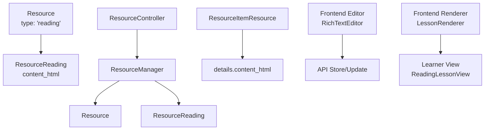
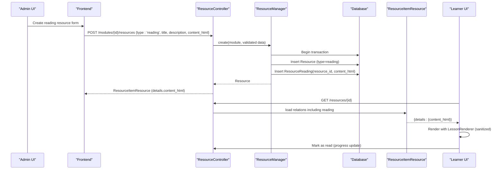
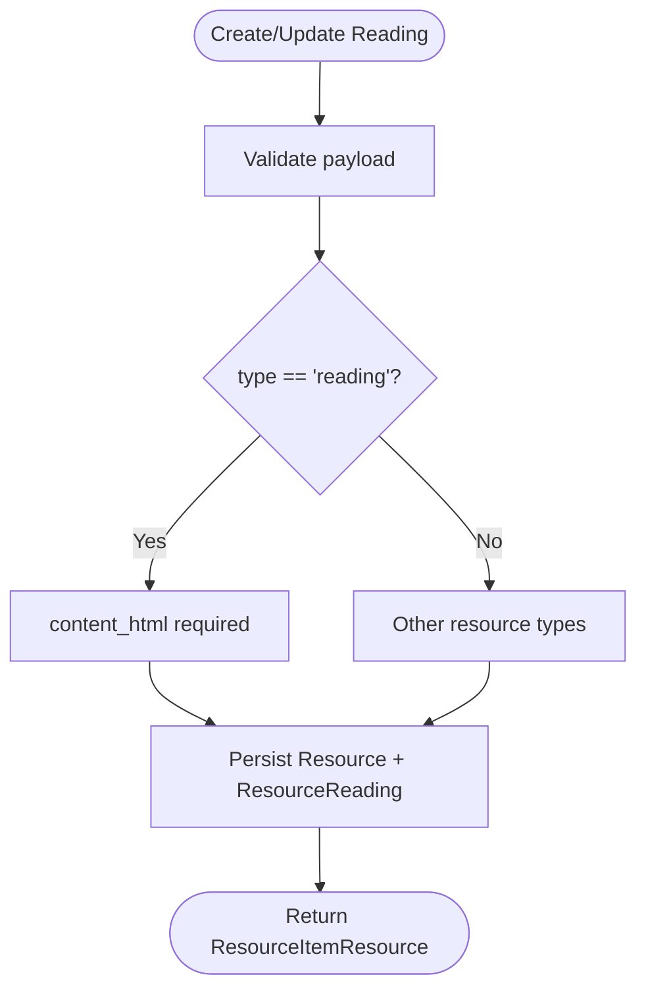
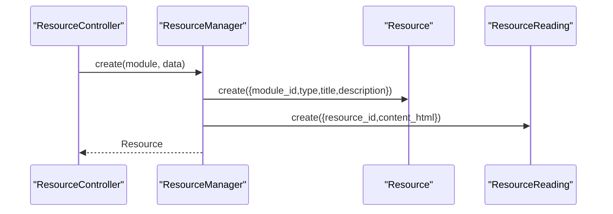
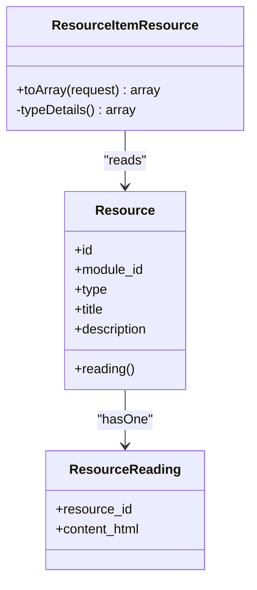
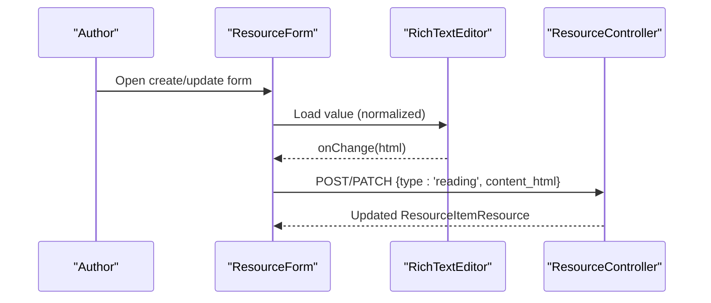
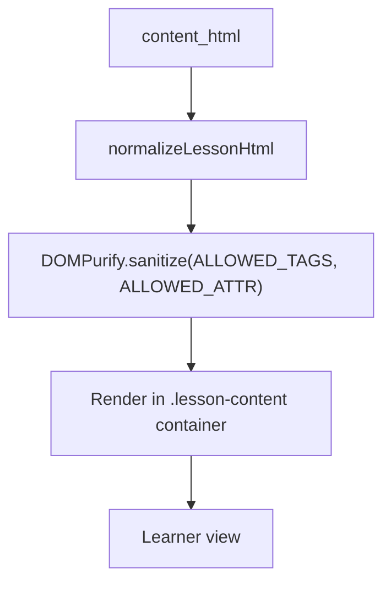
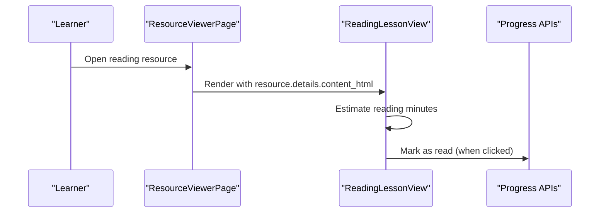
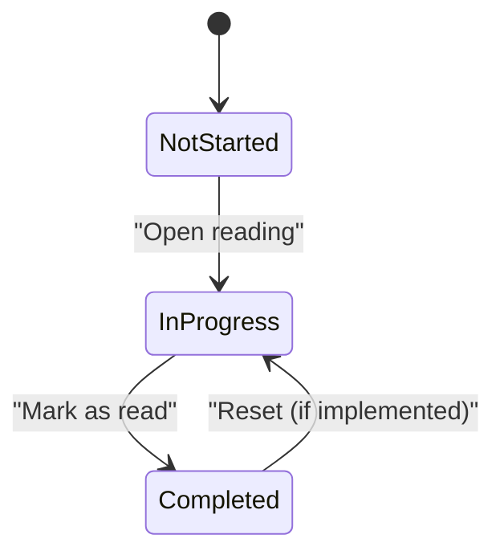
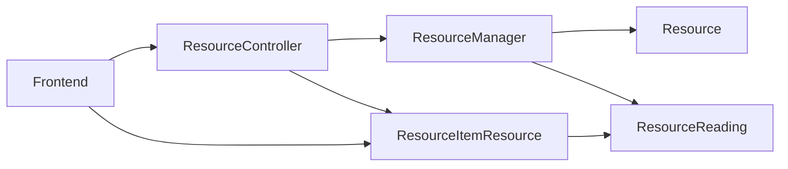

# Reading Resources

<cite>
**Referenced Files in This Document**
- [ResourceReading.php](file://app/Models/ResourceReading.php)
- [2024_01_01_000123_create_resource_readings_table.php](file://database/migrations/2024_01_01_000123_create_resource_readings_table.php)
- [Resource.php](file://app/Models/Resource.php)
- [ResourceType.php](file://app/Enums/ResourceType.php)
- [StoreResourceRequest.php](file://app/Http/Requests/Api/V1/StoreResourceRequest.php)
- [UpdateResourceRequest.php](file://app/Http/Requests/Api/V1/UpdateResourceRequest.php)
- [ResourceManager.php](file://app/Services/Content/ResourceManager.php)
- [ResourceController.php](file://app/Http/Controllers/Api/V1/ResourceController.php)
- [ResourceItemResource.php](file://app/Http/Resources/ResourceItemResource.php)
- [ProgressEngine.php](file://app/Services/Progress/ProgressEngine.php)
- [schema.sql](file://.agents/context/schema.sql)
- [RichTextEditor.tsx](file://frontend/src/components/editor/RichTextEditor.tsx)
- [htmlContent.ts](file://frontend/src/components/editor/htmlContent.ts)
- [LessonRenderer.tsx](file://frontend/src/features/learning/LessonRenderer.tsx)
- [ReadingLessonView.tsx](file://frontend/src/features/learning/ReadingLessonView.tsx)
- [ResourceViewerPage.tsx](file://frontend/src/features/learning/ResourceViewerPage.tsx)
</cite>

## Table of Contents
1. [Introduction](#introduction)
2. [Project Structure](#project-structure)
3. [Core Components](#core-components)
4. [Architecture Overview](#architecture-overview)
5. [Detailed Component Analysis](#detailed-component-analysis)
6. [Dependency Analysis](#dependency-analysis)
7. [Performance Considerations](#performance-considerations)
8. [Troubleshooting Guide](#troubleshooting-guide)
9. [Conclusion](#conclusion)
10. [Appendices](#appendices)

## Introduction
This document explains how reading resources are modeled, created, stored, and displayed for text-based learning materials. It focuses on the ResourceReading model and its integration across the API, services, and frontend to support rich HTML content, safe rendering, progress tracking, and a learner-friendly reading experience.

## Project Structure
Reading resources are part of a unified resource system with multiple types (video, document, reading, external link, SCORM, live session, downloadable file). The reading type uses a dedicated detail table that stores rich HTML content linked to a base Resource record.



**Diagram sources**
- [ResourceController.php:25-66](file://app/Http/Controllers/Api/V1/ResourceController.php#L25-L66)
- [ResourceManager.php:33-45](file://app/Services/Content/ResourceManager.php#L33-L45)
- [ResourceItemResource.php:63-78](file://app/Http/Resources/ResourceItemResource.php#L63-L78)
- [RichTextEditor.tsx:32-57](file://frontend/src/components/editor/RichTextEditor.tsx#L32-L57)
- [LessonRenderer.tsx:77-99](file://frontend/src/features/learning/LessonRenderer.tsx#L77-L99)
- [ReadingLessonView.tsx:35-51](file://frontend/src/features/learning/ReadingLessonView.tsx#L35-L51)

**Section sources**
- [ResourceType.php:7-16](file://app/Enums/ResourceType.php#L7-L16)
- [Resource.php:15-61](file://app/Models/Resource.php#L15-L61)
- [ResourceReading.php:10-27](file://app/Models/ResourceReading.php#L10-L27)
- [2024_01_01_000123_create_resource_readings_table.php:11-16](file://database/migrations/2024_01_01_000123_create_resource_readings_table.php#L11-L16)

## Core Components
- ResourceReading model: Stores rich HTML content for reading resources and links back to the parent Resource via a one-to-one relationship.
- Database schema: A single-row detail table keyed by resource_id with a mediumText column for content_html.
- API validation: Conditional rules ensure content_html is present when creating or updating a reading resource.
- Service layer: ResourceManager creates/updates the Resource and its type-specific details atomically.
- API response: ResourceItemResource flattens type-specific fields into details, exposing content_html for reading resources.
- Frontend editor: RichTextEditor captures rich HTML using Tiptap and normalizes legacy plain-text content.
- Frontend renderer: LessonRenderer sanitizes and renders HTML safely for learners.
- Progress tracking: Mark-as-read updates per-resource completion status for reading resources.

**Section sources**
- [ResourceReading.php:10-27](file://app/Models/ResourceReading.php#L10-L27)
- [2024_01_01_000123_create_resource_readings_table.php:11-16](file://database/migrations/2024_01_01_000123_create_resource_readings_table.php#L11-L16)
- [StoreResourceRequest.php:25-48](file://app/Http/Requests/Api/V1/StoreResourceRequest.php#L25-L48)
- [UpdateResourceRequest.php:21-41](file://app/Http/Requests/Api/V1/UpdateResourceRequest.php#L21-L41)
- [ResourceManager.php:33-45](file://app/Services/Content/ResourceManager.php#L33-L45)
- [ResourceItemResource.php:63-78](file://app/Http/Resources/ResourceItemResource.php#L63-L78)
- [RichTextEditor.tsx:32-57](file://frontend/src/components/editor/RichTextEditor.tsx#L32-L57)
- [htmlContent.ts:32-39](file://frontend/src/components/editor/htmlContent.ts#L32-L39)
- [LessonRenderer.tsx:77-99](file://frontend/src/features/learning/LessonRenderer.tsx#L77-L99)

## Architecture Overview
The reading resource flow spans creation, storage, retrieval, and display:



**Diagram sources**
- [ResourceController.php:30-46](file://app/Http/Controllers/Api/V1/ResourceController.php#L30-L46)
- [ResourceManager.php:33-45](file://app/Services/Content/ResourceManager.php#L33-L45)
- [ResourceItemResource.php:27-53](file://app/Http/Resources/ResourceItemResource.php#L27-L53)
- [ResourceItemResource.php:63-78](file://app/Http/Resources/ResourceItemResource.php#L63-L78)
- [LessonRenderer.tsx:77-99](file://frontend/src/features/learning/LessonRenderer.tsx#L77-L99)
- [ReadingLessonView.tsx:35-51](file://frontend/src/features/learning/ReadingLessonView.tsx#L35-L51)

## Detailed Component Analysis

### Data Model: ResourceReading
- Primary key: resource_id (foreign key to resources.id), no auto-increment, no timestamps.
- Fields:
  - resource_id: PK linking to Resource.
  - content_html: mediumText storing rich HTML content.
- Relationship: belongsTo Resource.

```mermaid
erDiagram
RESOURCE ||--|| RESOURCE_READING : "has one"
RESOURCE {
bigint id PK
enum type
string title
string description
}
RESOURCE_READING {
bigint resource_id PK FK
mediumtext content_html
}
```

**Diagram sources**
- [Resource.php:55-61](file://app/Models/Resource.php#L55-L61)
- [ResourceReading.php:10-27](file://app/Models/ResourceReading.php#L10-L27)
- [2024_01_01_000123_create_resource_readings_table.php:11-16](file://database/migrations/2024_01_01_000123_create_resource_readings_table.php#L11-L16)

**Section sources**
- [ResourceReading.php:10-27](file://app/Models/ResourceReading.php#L10-L27)
- [2024_01_01_000123_create_resource_readings_table.php:11-16](file://database/migrations/2024_01_01_000123_create_resource_readings_table.php#L11-L16)

### API Validation and Creation
- StoreResourceRequest enforces required fields for reading:
  - type must be 'reading'.
  - content_html is required when type is 'reading'.
- UpdateResourceRequest allows optional content_html updates for existing reading resources.



**Diagram sources**
- [StoreResourceRequest.php:25-48](file://app/Http/Requests/Api/V1/StoreResourceRequest.php#L25-L48)
- [UpdateResourceRequest.php:21-41](file://app/Http/Requests/Api/V1/UpdateResourceRequest.php#L21-L41)

**Section sources**
- [StoreResourceRequest.php:25-48](file://app/Http/Requests/Api/V1/StoreResourceRequest.php#L25-L48)
- [UpdateResourceRequest.php:21-41](file://app/Http/Requests/Api/V1/UpdateResourceRequest.php#L21-L41)

### Service Layer: ResourceManager
- Creates Resource and its type-specific detail row within a database transaction.
- For reading resources, inserts ResourceReading with content_html.



**Diagram sources**
- [ResourceController.php:30-46](file://app/Http/Controllers/Api/V1/ResourceController.php#L30-L46)
- [ResourceManager.php:33-45](file://app/Services/Content/ResourceManager.php#L33-L45)

**Section sources**
- [ResourceManager.php:33-45](file://app/Services/Content/ResourceManager.php#L33-L45)

### API Response Shape
- ResourceItemResource returns a consistent envelope with details flattened per type.
- For reading resources, details includes content_html directly from ResourceReading.



**Diagram sources**
- [ResourceItemResource.php:27-53](file://app/Http/Resources/ResourceItemResource.php#L27-L53)
- [ResourceItemResource.php:63-78](file://app/Http/Resources/ResourceItemResource.php#L63-L78)
- [Resource.php:55-61](file://app/Models/Resource.php#L55-L61)
- [ResourceReading.php:10-27](file://app/Models/ResourceReading.php#L10-L27)

**Section sources**
- [ResourceItemResource.php:27-53](file://app/Http/Resources/ResourceItemResource.php#L27-L53)
- [ResourceItemResource.php:63-78](file://app/Http/Resources/ResourceItemResource.php#L63-L78)

### Frontend Editing and Storage
- RichTextEditor uses Tiptap to capture rich HTML and normalizes legacy plain-text values before editing.
- Form submission sends content_html when type is 'reading'; client-side validation mirrors backend requirements.



**Diagram sources**
- [RichTextEditor.tsx:32-57](file://frontend/src/components/editor/RichTextEditor.tsx#L32-L57)
- [htmlContent.ts:32-39](file://frontend/src/components/editor/htmlContent.ts#L32-L39)
- [ResourceController.php:30-46](file://app/Http/Controllers/Api/V1/ResourceController.php#L30-L46)

**Section sources**
- [RichTextEditor.tsx:32-57](file://frontend/src/components/editor/RichTextEditor.tsx#L32-L57)
- [htmlContent.ts:32-39](file://frontend/src/components/editor/htmlContent.ts#L32-L39)

### Rendering and Safety
- LessonRenderer sanitizes HTML with a strict allowlist and restricts iframes to YouTube embeds only.
- Links are force-targeted to new tabs with security attributes for defense-in-depth.
- CSS styles provide readable typography and responsive YouTube embeds.



**Diagram sources**
- [LessonRenderer.tsx:77-99](file://frontend/src/features/learning/LessonRenderer.tsx#L77-L99)
- [htmlContent.ts:32-39](file://frontend/src/components/editor/htmlContent.ts#L32-L39)

**Section sources**
- [LessonRenderer.tsx:77-99](file://frontend/src/features/learning/LessonRenderer.tsx#L77-L99)

### Display to Learners
- ReadingLessonView shows an estimated reading time badge, renders the lesson content, and provides a “Mark as read” button when not completed.
- ResourceViewerPage routes to ReadingLessonView for reading-type resources and triggers mark-as-read actions.



**Diagram sources**
- [ReadingLessonView.tsx:35-51](file://frontend/src/features/learning/ReadingLessonView.tsx#L35-L51)
- [ResourceViewerPage.tsx:173-217](file://frontend/src/features/learning/ResourceViewerPage.tsx#L173-L217)

**Section sources**
- [ReadingLessonView.tsx:35-51](file://frontend/src/features/learning/ReadingLessonView.tsx#L35-L51)
- [ResourceViewerPage.tsx:173-217](file://frontend/src/features/learning/ResourceViewerPage.tsx#L173-L217)

### Progress Tracking for Reading Resources
- Completion for reading resources is driven by a “Mark as read” action.
- ProgressEngine defines completion signals per resource type; reading reuses the mark-as-read signal.
- Per-resource progress is recorded in resource_progress with a marked_read_at timestamp.



**Diagram sources**
- [ProgressEngine.php:170-198](file://app/Services/Progress/ProgressEngine.php#L170-L198)
- [schema.sql:518-532](file://.agents/context/schema.sql#L518-L532)

**Section sources**
- [ProgressEngine.php:170-198](file://app/Services/Progress/ProgressEngine.php#L170-L198)
- [schema.sql:518-532](file://.agents/context/schema.sql#L518-L532)

## Dependency Analysis
- ResourceReading depends on Resource via a one-to-one relationship.
- ResourceController delegates persistence to ResourceManager, which writes both Resource and ResourceReading atomically.
- ResourceItemResource reads the reading relation to expose content_html in the API response.
- Frontend components depend on normalized HTML and sanitized rendering to ensure safety and consistency.



**Diagram sources**
- [ResourceController.php:25-66](file://app/Http/Controllers/Api/V1/ResourceController.php#L25-L66)
- [ResourceManager.php:33-45](file://app/Services/Content/ResourceManager.php#L33-L45)
- [ResourceItemResource.php:63-78](file://app/Http/Resources/ResourceItemResource.php#L63-L78)

**Section sources**
- [ResourceController.php:25-66](file://app/Http/Controllers/Api/V1/ResourceController.php#L25-L66)
- [ResourceManager.php:33-45](file://app/Services/Content/ResourceManager.php#L33-L45)
- [ResourceItemResource.php:63-78](file://app/Http/Resources/ResourceItemResource.php#L63-L78)

## Performance Considerations
- Storing rich HTML in mediumText can grow large; consider pagination or lazy loading for very long readings.
- Sanitization and normalization occur on the frontend; keep payloads minimal by avoiding unnecessary metadata in content_html.
- Use efficient queries in the service layer; ResourceManager already wraps operations in transactions to avoid partial writes.

[No sources needed since this section provides general guidance]

## Troubleshooting Guide
- Missing content_html on create/update: Ensure type is 'reading' and content_html is provided; client-side validation mirrors server rules.
- Legacy plain-text content: Normalization converts multi-paragraph plain text into proper HTML paragraphs for editor and renderer compatibility.
- Unsafe content blocked: Only allowed tags and attributes pass through DOMPurify; if custom elements are needed, extend the allowlist carefully.
- YouTube embeds not showing: Only YouTube embed URLs are permitted; other iframe sources are stripped for security.
- Progress not marking complete: Verify the “Mark as read” action is triggered and resource_progress has a marked_read_at entry.

**Section sources**
- [StoreResourceRequest.php:25-48](file://app/Http/Requests/Api/V1/StoreResourceRequest.php#L25-L48)
- [htmlContent.ts:32-39](file://frontend/src/components/editor/htmlContent.ts#L32-L39)
- [LessonRenderer.tsx:77-99](file://frontend/src/features/learning/LessonRenderer.tsx#L77-L99)
- [schema.sql:518-532](file://.agents/context/schema.sql#L518-L532)

## Conclusion
Reading resources use a clean separation between a generic Resource entity and a type-specific ResourceReading detail table. Rich HTML content is captured via a robust editor, validated at the API boundary, persisted efficiently, and rendered safely for learners. Progress tracking integrates seamlessly with the mark-as-read workflow, providing clear completion signals for reading materials.

[No sources needed since this section summarizes without analyzing specific files]

## Appendices

### Example: Creating a Reading Resource
- Endpoint: POST /modules/{moduleId}/resources
- Payload example (JSON):
  - type: "reading"
  - title: "Introduction to Concepts"
  - description: "A foundational reading for learners."
  - content_html: "<h2>Overview</h2><p>Key ideas...</p>"
- Expected response: ResourceItemResource with details.content_html populated.

**Section sources**
- [StoreResourceRequest.php:25-48](file://app/Http/Requests/Api/V1/StoreResourceRequest.php#L25-L48)
- [ResourceController.php:30-46](file://app/Http/Controllers/Api/V1/ResourceController.php#L30-L46)
- [ResourceItemResource.php:63-78](file://app/Http/Resources/ResourceItemResource.php#L63-L78)

### Example: Updating a Reading Resource
- Endpoint: PATCH /resources/{resourceId}
- Payload example (JSON):
  - content_html: "<h2>Updated Section</h2><p>New content...</p>"
- Behavior: Updates only provided fields; content_html is optional on update.

**Section sources**
- [UpdateResourceRequest.php:21-41](file://app/Http/Requests/Api/V1/UpdateResourceRequest.php#L21-L41)
- [ResourceController.php:48-66](file://app/Http/Controllers/Api/V1/ResourceController.php#L48-L66)

### Example: Displaying a Reading Resource
- Endpoint: GET /resources/{resourceId}
- Response includes details.content_html for reading resources.
- Frontend renders via LessonRenderer and shows a “Mark as read” option.

**Section sources**
- [ResourceController.php:25-28](file://app/Http/Controllers/Api/V1/ResourceController.php#L25-L28)
- [ResourceItemResource.php:63-78](file://app/Http/Resources/ResourceItemResource.php#L63-L78)
- [ReadingLessonView.tsx:35-51](file://frontend/src/features/learning/ReadingLessonView.tsx#L35-L51)