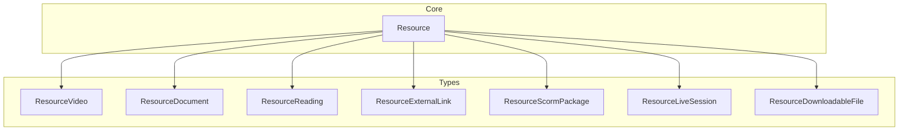
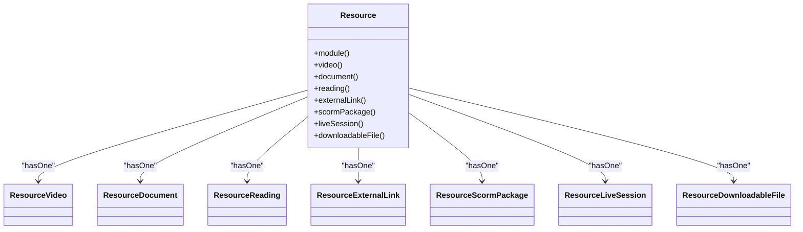
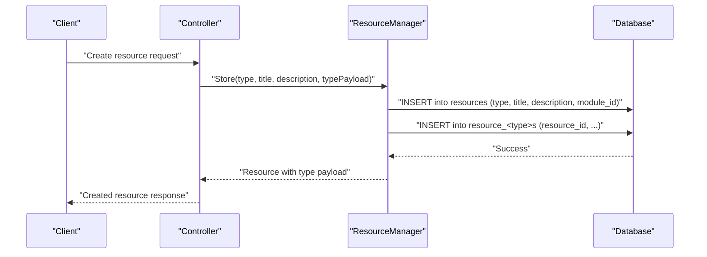
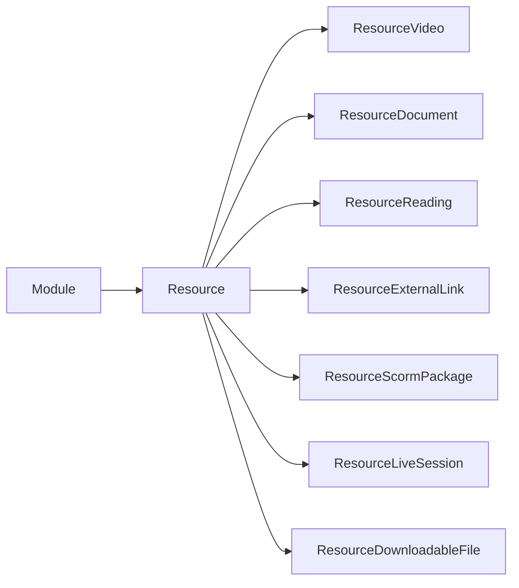

# Resource Types & Polymorphism

<cite>
**Referenced Files in This Document**
- [Resource.php](file://app/Models/Resource.php)
- [ResourceType.php](file://app/Enums/ResourceType.php)
- [2024_01_01_000120_create_resources_table.php](file://database/migrations/2024_01_01_000120_create_resources_table.php)
- [ResourceVideo.php](file://app/Models/ResourceVideo.php)
- [ResourceDocument.php](file://app/Models/ResourceDocument.php)
- [ResourceReading.php](file://app/Models/ResourceReading.php)
- [ResourceExternalLink.php](file://app/Models/ResourceExternalLink.php)
- [ResourceScormPackage.php](file://app/Models/ResourceScormPackage.php)
- [ResourceLiveSession.php](file://app/Models/ResourceLiveSession.php)
- [ResourceDownloadableFile.php](file://app/Models/ResourceDownloadableFile.php)
- [2024_01_01_000121_create_resource_videos_table.php](file://database/migrations/2024_01_01_000121_create_resource_videos_table.php)
- [2024_01_01_000122_create_resource_documents_table.php](file://database/migrations/2024_01_01_000122_create_resource_documents_table.php)
- [2024_01_01_000123_create_resource_readings_table.php](file://database/migrations/2024_01_01_000123_create_resource_readings_table.php)
- [2024_01_01_000124_create_resource_external_links_table.php](file://database/migrations/2024_01_01_000124_create_resource_external_links_table.php)
- [2024_01_01_000125_create_resource_scorm_packages_table.php](file://database/migrations/2024_01_01_000125_create_resource_scorm_packages_table.php)
- [2024_01_01_000126_create_resource_live_sessions_table.php](file://database/migrations/2024_01_01_000126_create_resource_live_sessions_table.php)
- [2024_01_01_000127_create_resource_downloadable_files_table.php](file://database/migrations/2024_01_01_000127_create_resource_downloadable_files_table.php)
</cite>

## Table of Contents
1. Introduction
2. Project Structure
3. Core Components
4. Architecture Overview
5. Detailed Component Analysis
6. Dependency Analysis
7. Performance Considerations
8. Troubleshooting Guide
9. Conclusion

## Introduction
This document explains the polymorphic resource system used to represent different learning content types within a module. The base Resource model stores common metadata (such as title and description) and uses a type field to determine which concrete resource implementation applies. Each resource type has its own table with type-specific attributes, while sharing the same parent Resource record.

The system supports video, document, reading, external link, SCORM package, live session, and downloadable file resources. A ResourceType enum centralizes valid values and is cast on the Resource model for type safety.

## Project Structure
At a high level:
- Base model: Resource holds shared fields and relationships to each specific resource type.
- Type models: One model per resource type with a one-to-one relationship back to Resource via resource_id.
- Database schema: A single resources table plus one child table per resource type.
- Enum: ResourceType defines all supported kinds of resources.

**Diagram sources**
- [Resource.php:15-103](file://app/Models/Resource.php#L15-L103)
- [ResourceVideo.php:10-29](file://app/Models/ResourceVideo.php#L10-L29)
- [ResourceDocument.php:11-35](file://app/Models/ResourceDocument.php#L11-L35)
- [ResourceReading.php:10-28](file://app/Models/ResourceReading.php#L10-L28)
- [ResourceExternalLink.php:10-28](file://app/Models/ResourceExternalLink.php#L10-L28)
- [ResourceScormPackage.php:11-34](file://app/Models/ResourceScormPackage.php#L11-L34)
- [ResourceLiveSession.php:11-37](file://app/Models/ResourceLiveSession.php#L11-L37)
- [ResourceDownloadableFile.php:10-29](file://app/Models/ResourceDownloadableFile.php#L10-L29)

**Section sources**
- [Resource.php:15-103](file://app/Models/Resource.php#L15-L103)
- [ResourceType.php:7-16](file://app/Enums/ResourceType.php#L7-L16)

## Core Components
- Base Resource model:
  - Stores module association and common fields: type, title, description.
  - Casts type to ResourceType for consistent handling.
  - Exposes typed relationships to each resource-type model.
- ResourceType enum:
  - Defines all supported resource kinds: video, document, reading, external_link, scorm, live_session, downloadable_file.
- Type-specific models:
  - Each extends Model and links back to Resource via a primary key resource_id.
  - Store only the attributes relevant to that resource kind.

Key behaviors:
- Shared properties: All resources share title and description from the base Resource.
- Type-specific properties: Stored in the corresponding child table and accessed through the typed relationship.
- Module ownership: Resources belong to a Module; progress tracking and ordering are handled by related entities outside this scope.

**Section sources**
- [Resource.php:20-29](file://app/Models/Resource.php#L20-L29)
- [Resource.php:34-93](file://app/Models/Resource.php#L34-L93)
- [ResourceType.php:7-16](file://app/Enums/ResourceType.php#L7-L16)

## Architecture Overview
The system uses a one-to-one “polymorphic-like” pattern where the base Resource row determines the concrete type, and each type has its own table. Relationships are explicit HasOne/BelongsTo pairs rather than Eloquent’s morph maps.

**Diagram sources**
- [Resource.php:34-93](file://app/Models/Resource.php#L34-L93)
- [ResourceVideo.php:25-28](file://app/Models/ResourceVideo.php#L25-L28)
- [ResourceDocument.php:30-33](file://app/Models/ResourceDocument.php#L30-L33)
- [ResourceReading.php:23-26](file://app/Models/ResourceReading.php#L23-L26)
- [ResourceExternalLink.php:23-26](file://app/Models/ResourceExternalLink.php#L23-L26)
- [ResourceScormPackage.php:29-32](file://app/Models/ResourceScormPackage.php#L29-L32)
- [ResourceLiveSession.php:32-35](file://app/Models/ResourceLiveSession.php#L32-L35)
- [ResourceDownloadableFile.php:24-27](file://app/Models/ResourceDownloadableFile.php#L24-L27)

## Detailed Component Analysis

### Base Resource Model
- Purpose: Central entity for all learning resources; owns shared metadata and relationships to type-specific details.
- Shared fields:
  - module_id: belongs to a Module.
  - type: ResourceType enum value indicating the concrete resource kind.
  - title: human-readable name.
  - description: optional rich text or plain description.
- Relationships:
  - One-to-one to each resource type model via typed methods.
  - Attendance relationship for live sessions.

Usage patterns:
- Create a Resource with a given type.
- Populate the corresponding type-specific record via the typed relationship.
- Access shared fields directly on Resource; access type-specific fields via the appropriate relationship.

**Section sources**
- [Resource.php:20-29](file://app/Models/Resource.php#L20-L29)
- [Resource.php:34-101](file://app/Models/Resource.php#L34-L101)

### ResourceType Enum
- Values:
  - video
  - document
  - reading
  - external_link
  - scorm
  - live_session
  - downloadable_file
- Role:
  - Enforces allowed values for the type column.
  - Provides strongly-typed access across the application.

**Section sources**
- [ResourceType.php:7-16](file://app/Enums/ResourceType.php#L7-L16)

### Resource Video
- Table: resource_videos
- Key fields:
  - bunny_stream_video_id: identifier for the hosted video.
  - duration_seconds: optional duration.
  - caption_url: optional captions URL for accessibility.
- Relationship: BelongsTo Resource via resource_id.

**Section sources**
- [ResourceVideo.php:10-29](file://app/Models/ResourceVideo.php#L10-L29)
- [2024_01_01_000121_create_resource_videos_table.php:13-18](file://database/migrations/2024_01_01_000121_create_resource_videos_table.php#L13-L18)

### Resource Document
- Table: resource_documents
- Key fields:
  - file_url: location of the document.
  - file_type: restricted set of document formats.
  - file_size_kb: optional size in kilobytes.
- Relationship: BelongsTo Resource via resource_id.

**Section sources**
- [ResourceDocument.php:11-35](file://app/Models/ResourceDocument.php#L11-L35)
- [2024_01_01_000122_create_resource_documents_table.php:13-18](file://database/migrations/2024_01_01_000122_create_resource_documents_table.php#L13-L18)

### Resource Reading
- Table: resource_readings
- Key fields:
  - content_html: inline HTML content for the reading.
- Relationship: BelongsTo Resource via resource_id.

**Section sources**
- [ResourceReading.php:10-28](file://app/Models/ResourceReading.php#L10-L28)
- [2024_01_01_000123_create_resource_readings_table.php:13-16](file://database/migrations/2024_01_01_000123_create_resource_readings_table.php#L13-L16)

### Resource External Link
- Table: resource_external_links
- Key fields:
  - url: destination URL.
- Relationship: BelongsTo Resource via resource_id.

**Section sources**
- [ResourceExternalLink.php:10-28](file://app/Models/ResourceExternalLink.php#L10-L28)
- [2024_01_01_000124_create_resource_external_links_table.php:13-16](file://database/migrations/2024_01_01_000124_create_resource_external_links_table.php#L13-L16)

### Resource SCORM Package
- Table: resource_scorm_packages
- Key fields:
  - package_url: location of the SCORM package.
  - standard: SCORM standard variant.
- Relationship: BelongsTo Resource via resource_id.

**Section sources**
- [ResourceScormPackage.php:11-34](file://app/Models/ResourceScormPackage.php#L11-L34)
- [2024_01_01_000125_create_resource_scorm_packages_table.php:13-17](file://database/migrations/2024_01_01_000125_create_resource_scorm_packages_table.php#L13-L17)

### Resource Live Session
- Table: resource_live_sessions
- Key fields:
  - provider: service provider for the live session.
  - meeting_url: join URL for participants.
  - scheduled_at: start time.
  - duration_minutes: planned length.
- Relationship: BelongsTo Resource via resource_id.

**Section sources**
- [ResourceLiveSession.php:11-37](file://app/Models/ResourceLiveSession.php#L11-L37)
- [2024_01_01_000126_create_resource_live_sessions_table.php:1-20](file://database/migrations/2024_01_01_000126_create_resource_live_sessions_table.php#L1-L20)

### Resource Downloadable File
- Table: resource_downloadable_files
- Key fields:
  - file_url: location of the downloadable asset.
  - file_size_kb: optional size in kilobytes.
- Relationship: BelongsTo Resource via resource_id.

**Section sources**
- [ResourceDownloadableFile.php:10-29](file://app/Models/ResourceDownloadableFile.php#L10-L29)
- [2024_01_01_000127_create_resource_downloadable_files_table.php:1-20](file://database/migrations/2024_01_01_000127_create_resource_downloadable_files_table.php#L1-L20)

### Data Flow: Creating a Resource

[No diagram sources needed since this diagram shows conceptual workflow, not actual code structure]

## Dependency Analysis
- Resource depends on:
  - Module (via foreign key).
  - Each type-specific model via HasOne relationships.
- Type models depend on:
  - Resource via BelongsTo using resource_id as the foreign key.
- Enum dependency:
  - Resource casts type to ResourceType, ensuring consistent validation and serialization.

**Diagram sources**
- [Resource.php:34-93](file://app/Models/Resource.php#L34-L93)
- [ResourceVideo.php:25-28](file://app/Models/ResourceVideo.php#L25-L28)
- [ResourceDocument.php:30-33](file://app/Models/ResourceDocument.php#L30-L33)
- [ResourceReading.php:23-26](file://app/Models/ResourceReading.php#L23-L26)
- [ResourceExternalLink.php:23-26](file://app/Models/ResourceExternalLink.php#L23-L26)
- [ResourceScormPackage.php:29-32](file://app/Models/ResourceScormPackage.php#L29-L32)
- [ResourceLiveSession.php:32-35](file://app/Models/ResourceLiveSession.php#L32-L35)
- [ResourceDownloadableFile.php:24-27](file://app/Models/ResourceDownloadableFile.php#L24-L27)

**Section sources**
- [Resource.php:34-101](file://app/Models/Resource.php#L34-L101)

## Performance Considerations
- Single read path: When listing resources, prefer loading only the base Resource fields unless the type payload is required.
- Lazy loading caution: Accessing a type-specific relationship triggers an additional query; eager-load only when necessary.
- Indexing: Ensure foreign keys (module_id, resource_id) are indexed for fast joins and cascading deletes.
- Payload size: Readings may contain large HTML; consider pagination or lazy rendering on the client side.

[No sources needed since this section provides general guidance]

## Troubleshooting Guide
Common issues and resolutions:
- Missing type payload:
  - Symptom: Accessing a type-specific property returns null.
  - Cause: No matching row in the type-specific table.
  - Resolution: Ensure the correct type-specific record exists for the Resource.
- Invalid type value:
  - Symptom: Validation error when creating or updating a Resource.
  - Cause: type not present in ResourceType enum or database enum list.
  - Resolution: Use a valid ResourceType value and ensure migration matches.
- Orphaned type records:
  - Symptom: Orphan rows after deleting a Resource.
  - Cause: Foreign key constraints should cascade; verify constraint names and cascade settings.
  - Resolution: Confirm cascadeOnDelete is configured in migrations.

**Section sources**
- [Resource.php:20-29](file://app/Models/Resource.php#L20-L29)
- [ResourceType.php:7-16](file://app/Enums/ResourceType.php#L7-L16)
- [2024_01_01_000120_create_resources_table.php:13-19](file://database/migrations/2024_01_01_000120_create_resources_table.php#L13-L19)

## Conclusion
The polymorphic resource system cleanly separates shared metadata from type-specific details. The base Resource model provides a unified interface for all content types, while each type model encapsulates its own attributes and behavior. ResourceType enforces consistency across the application and database. This design makes it straightforward to add new resource types by introducing a new model, migration, and enum value, then wiring up the relationship on Resource.