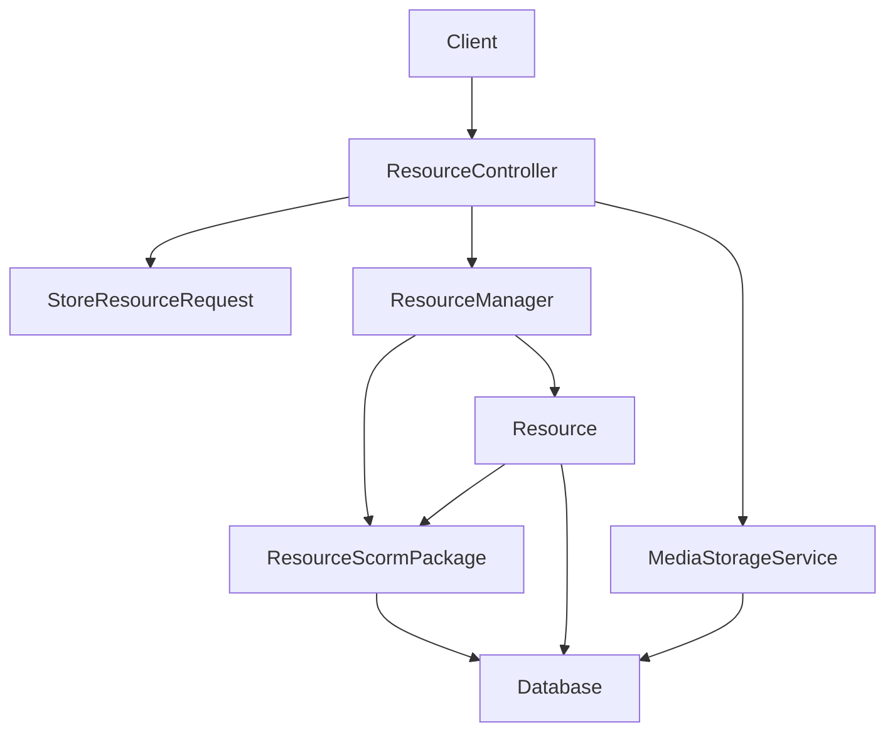
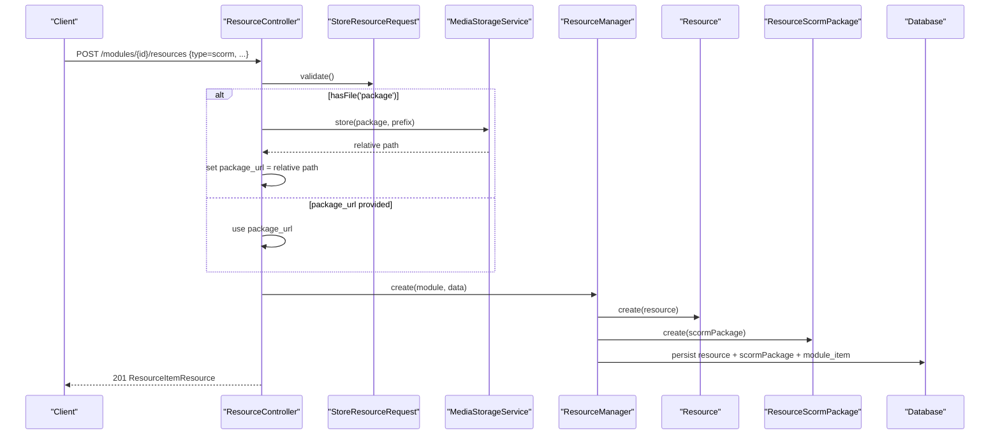
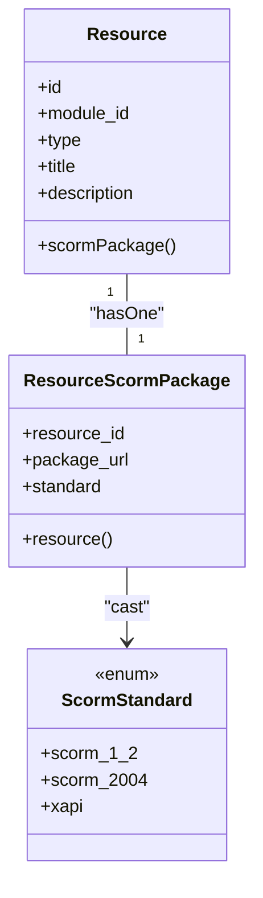
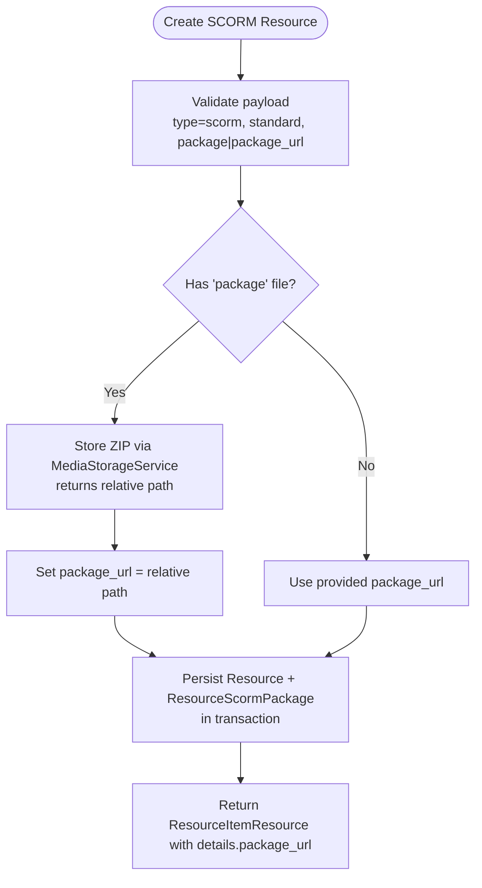
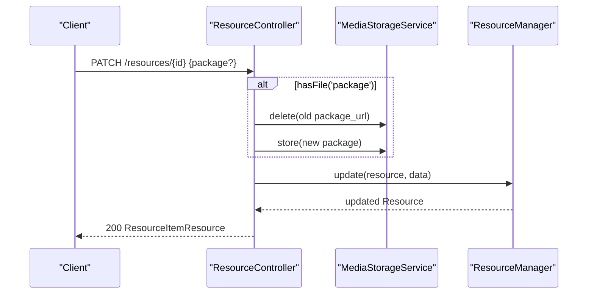
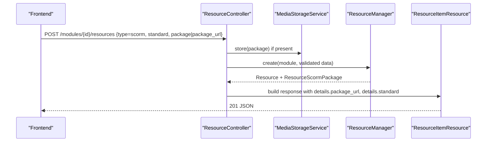
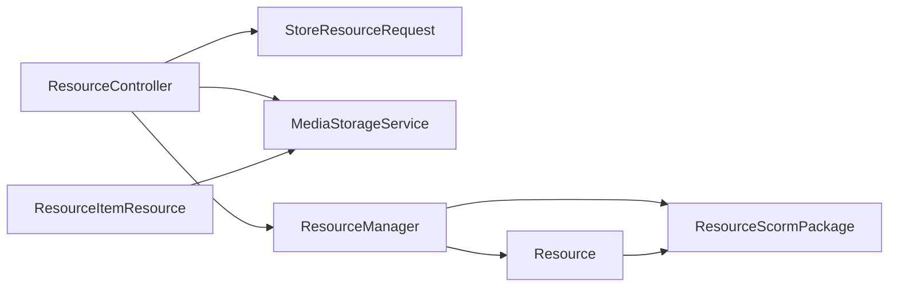

# SCORM Package Resources

<cite>
**Referenced Files in This Document**
- [ResourceScormPackage.php](file://app/Models/ResourceScormPackage.php)
- [ScormStandard.php](file://app/Enums/ScormStandard.php)
- [Resource.php](file://app/Models/Resource.php)
- [2024_01_01_000125_create_resource_scorm_packages_table.php](file://database/migrations/2024_01_01_000125_create_resource_scorm_packages_table.php)
- [ResourceController.php](file://app/Http/Controllers/Api/V1/ResourceController.php)
- [StoreResourceRequest.php](file://app/Http/Requests/Api/V1/StoreResourceRequest.php)
- [ResourceManager.php](file://app/Services/Content/ResourceManager.php)
- [ResourceItemResource.php](file://app/Http/Resources/ResourceItemResource.php)
- [MediaStorageService.php](file://app/Services/Storage/MediaStorageService.php)
- [ResourceTest.php](file://tests/Feature/CourseStructure/ResourceTest.php)
</cite>

## Table of Contents
1. [Introduction](#introduction)
2. [Project Structure](#project-structure)
3. [Core Components](#core-components)
4. [Architecture Overview](#architecture-overview)
5. [Detailed Component Analysis](#detailed-component-analysis)
6. [Dependency Analysis](#dependency-analysis)
7. [Performance Considerations](#performance-considerations)
8. [Troubleshooting Guide](#troubleshooting-guide)
9. [Conclusion](#conclusion)

## Introduction
This document explains the SCORM package resource type in the system, focusing on the ResourceScormPackage data model, SCORM standard compliance options, and how SCORM packages are uploaded, packaged, and integrated with the LMS for interactive content delivery. It also provides examples of creating SCORM resources and managing their metadata through the API.

## Project Structure
SCORM support is implemented as a specialized resource subtype alongside other resource types (video, document, reading, external link, live session, downloadable file). The key parts include:
- A dedicated detail table for SCORM packages linked to the generic Resource entity
- Validation rules that enforce SCORM-specific fields when type is scorm
- Storage handling for ZIP packages via a centralized storage service
- A unified resource manager that persists SCORM details atomically with the resource and its module item slot
- An API resource that returns normalized SCORM details including resolved URLs

**Diagram sources**
- [ResourceController.php:30-66](file://app/Http/Controllers/Api/V1/ResourceController.php#L30-L66)
- [StoreResourceRequest.php:25-62](file://app/Http/Requests/Api/V1/StoreResourceRequest.php#L25-L62)
- [ResourceManager.php:33-58](file://app/Services/Content/ResourceManager.php#L33-L58)
- [Resource.php:70-77](file://app/Models/Resource.php#L70-L77)
- [ResourceScormPackage.php:11-33](file://app/Models/ResourceScormPackage.php#L11-L33)
- [MediaStorageService.php:24-34](file://app/Services/Storage/MediaStorageService.php#L24-L34)

**Section sources**
- [ResourceController.php:30-66](file://app/Http/Controllers/Api/V1/ResourceController.php#L30-L66)
- [StoreResourceRequest.php:25-62](file://app/Http/Requests/Api/V1/StoreResourceRequest.php#L25-L62)
- [ResourceManager.php:33-58](file://app/Services/Content/ResourceManager.php#L33-L58)
- [Resource.php:70-77](file://app/Models/Resource.php#L70-L77)
- [ResourceScormPackage.php:11-33](file://app/Models/ResourceScormPackage.php#L11-L33)
- [MediaStorageService.php:24-34](file://app/Services/Storage/MediaStorageService.php#L24-L34)

## Core Components
- ResourceScormPackage model: Stores the package URL and selected SCORM standard for a given resource.
- ScormStandard enum: Enumerates supported standards (SCORM 1.2, SCORM 2004, xAPI).
- Resource model relationship: One-to-one relationship from Resource to ResourceScormPackage.
- Database schema: A dedicated table linking to resources with a primary key foreign key and an enum column for standard.
- API request validation: Enforces required fields for SCORM resources and validates standard values.
- Resource manager: Creates and updates SCORM subtypes atomically with the parent resource and module item.
- API response shaping: Normalizes SCORM details into a consistent envelope with resolved URLs.

**Section sources**
- [ResourceScormPackage.php:11-33](file://app/Models/ResourceScormPackage.php#L11-L33)
- [ScormStandard.php:7-12](file://app/Enums/ScormStandard.php#L7-L12)
- [Resource.php:70-77](file://app/Models/Resource.php#L70-L77)
- [2024_01_01_000125_create_resource_scorm_packages_table.php:11-17](file://database/migrations/2024_01_01_000125_create_resource_scorm_packages_table.php#L11-L17)
- [StoreResourceRequest.php:52-55](file://app/Http/Requests/Api/V1/StoreResourceRequest.php#L52-L55)
- [ResourceManager.php:124-128](file://app/Services/Content/ResourceManager.php#L124-L128)
- [ResourceItemResource.php:82-85](file://app/Http/Resources/ResourceItemResource.php#L82-L85)

## Architecture Overview
The SCORM workflow spans validation, storage, persistence, and response shaping:

**Diagram sources**
- [ResourceController.php:30-46](file://app/Http/Controllers/Api/V1/ResourceController.php#L30-L46)
- [StoreResourceRequest.php:25-62](file://app/Http/Requests/Api/V1/StoreResourceRequest.php#L25-L62)
- [ResourceManager.php:33-58](file://app/Services/Content/ResourceManager.php#L33-L58)
- [ResourceScormPackage.php:11-33](file://app/Models/ResourceScormPackage.php#L11-L33)

## Detailed Component Analysis

### Data Model: ResourceScormPackage
- Primary key: resource_id (foreign key to resources)
- Fields:
  - package_url: string (max length enforced by migration)
  - standard: enum constrained to scorm_1_2, scorm_2004, xapi
- Casting: standard is cast to ScormStandard enum
- Relationship: belongsTo Resource via resource_id

**Diagram sources**
- [Resource.php:70-77](file://app/Models/Resource.php#L70-L77)
- [ResourceScormPackage.php:11-33](file://app/Models/ResourceScormPackage.php#L11-L33)
- [ScormStandard.php:7-12](file://app/Enums/ScormStandard.php#L7-L12)

**Section sources**
- [ResourceScormPackage.php:11-33](file://app/Models/ResourceScormPackage.php#L11-L33)
- [ScormStandard.php:7-12](file://app/Enums/ScormStandard.php#L7-L12)
- [2024_01_01_000125_create_resource_scorm_packages_table.php:11-17](file://database/migrations/2024_01_01_000125_create_resource_scorm_packages_table.php#L11-L17)

### Upload and Packaging Flow
- Accepts either:
  - A ZIP file upload via field package
  - A direct URL via package_url
- Validates MIME type zip and size limits
- Stores uploads under a per-course prefix using MediaStorageService
- Persists package_url and standard to ResourceScormPackage

**Diagram sources**
- [StoreResourceRequest.php:52-55](file://app/Http/Requests/Api/V1/StoreResourceRequest.php#L52-L55)
- [ResourceController.php:35-41](file://app/Http/Controllers/Api/V1/ResourceController.php#L35-L41)
- [ResourceManager.php:124-128](file://app/Services/Content/ResourceManager.php#L124-L128)
- [ResourceItemResource.php:82-85](file://app/Http/Resources/ResourceItemResource.php#L82-L85)

**Section sources**
- [StoreResourceRequest.php:52-55](file://app/Http/Requests/Api/V1/StoreResourceRequest.php#L52-L55)
- [ResourceController.php:35-41](file://app/Http/Controllers/Api/V1/ResourceController.php#L35-L41)
- [ResourceManager.php:124-128](file://app/Services/Content/ResourceManager.php#L124-L128)
- [ResourceItemResource.php:82-85](file://app/Http/Resources/ResourceItemResource.php#L82-L85)

### Update and Deletion Behavior
- Update:
  - If a new package file is uploaded, the previous scorm package URL is deleted from storage before storing the new one
  - Updates package_url and standard if provided
- Delete:
  - Removes associated ModuleItem and Resource; cascade delete removes ResourceScormPackage due to foreign key constraints

**Diagram sources**
- [ResourceController.php:48-66](file://app/Http/Controllers/Api/V1/ResourceController.php#L48-L66)
- [ResourceManager.php:64-83](file://app/Services/Content/ResourceManager.php#L64-L83)

**Section sources**
- [ResourceController.php:48-66](file://app/Http/Controllers/Api/V1/ResourceController.php#L48-L66)
- [ResourceManager.php:64-83](file://app/Services/Content/ResourceManager.php#L64-L83)

### API Integration and LMS Delivery
- Creation endpoint: POST /api/v1/modules/{module_id}/resources with type=scorm
- Payload supports:
  - title, description, is_required, order_index
  - For SCORM: package or package_url, and standard
- Response envelope includes details.package_url (resolved public URL) and details.standard
- Progress tracking notes indicate SCORM reuses mark-as-read signal in this MVP (no in-house runtime)

**Diagram sources**
- [ResourceController.php:30-46](file://app/Http/Controllers/Api/V1/ResourceController.php#L30-L46)
- [StoreResourceRequest.php:25-62](file://app/Http/Requests/Api/V1/StoreResourceRequest.php#L25-L62)
- [ResourceManager.php:33-58](file://app/Services/Content/ResourceManager.php#L33-L58)
- [ResourceItemResource.php:82-85](file://app/Http/Resources/ResourceItemResource.php#L82-L85)

**Section sources**
- [ResourceController.php:30-46](file://app/Http/Controllers/Api/V1/ResourceController.php#L30-L46)
- [StoreResourceRequest.php:25-62](file://app/Http/Requests/Api/V1/StoreResourceRequest.php#L25-L62)
- [ResourceManager.php:33-58](file://app/Services/Content/ResourceManager.php#L33-L58)
- [ResourceItemResource.php:82-85](file://app/Http/Resources/ResourceItemResource.php#L82-L85)

## Dependency Analysis
- ResourceController depends on:
  - StoreResourceRequest for validation
  - MediaStorageService for file operations
  - ResourceManager for persistence
- ResourceManager orchestrates creation/update across Resource and ResourceScormPackage within a transaction
- ResourceItemResource resolves storage URLs for package_url and exposes standard value
- Database enforces referential integrity via foreign key on resource_scorm_packages.resource_id

**Diagram sources**
- [ResourceController.php:30-66](file://app/Http/Controllers/Api/V1/ResourceController.php#L30-L66)
- [StoreResourceRequest.php:25-62](file://app/Http/Requests/Api/V1/StoreResourceRequest.php#L25-L62)
- [ResourceManager.php:33-58](file://app/Services/Content/ResourceManager.php#L33-L58)
- [ResourceItemResource.php:82-85](file://app/Http/Resources/ResourceItemResource.php#L82-L85)

**Section sources**
- [ResourceController.php:30-66](file://app/Http/Controllers/Api/V1/ResourceController.php#L30-L66)
- [ResourceManager.php:33-58](file://app/Services/Content/ResourceManager.php#L33-L58)
- [ResourceItemResource.php:82-85](file://app/Http/Resources/ResourceItemResource.php#L82-L85)

## Performance Considerations
- Atomic transactions ensure consistency between Resource, ResourceScormPackage, and ModuleItem records during create/update/delete.
- Storage operations are centralized via MediaStorageService, reducing duplication and enabling consistent URL resolution.
- Avoid unnecessary eager loading; only load scormPackage when needed (e.g., show endpoint loads related details).

[No sources needed since this section provides general guidance]

## Troubleshooting Guide
- Validation errors:
  - Ensure type=scorm when providing package or package_url
  - standard must be one of scorm_1_2, scorm_2004, xapi
  - package must be a ZIP file and within size limits
- Storage issues:
  - Verify MediaStorageService disk configuration and permissions
  - On update, confirm old package_url is deleted before storing new file
- API behavior:
  - Response details.package_url should be a resolved public URL
  - Test coverage demonstrates successful upload and URL exposure

**Section sources**
- [StoreResourceRequest.php:52-55](file://app/Http/Requests/Api/V1/StoreResourceRequest.php#L52-L55)
- [ResourceController.php:58-61](file://app/Http/Controllers/Api/V1/ResourceController.php#L58-L61)
- [ResourceItemResource.php:82-85](file://app/Http/Resources/ResourceItemResource.php#L82-L85)
- [ResourceTest.php:111-125](file://tests/Feature/CourseStructure/ResourceTest.php#L111-L125)

## Conclusion
SCORM packages are modeled as a dedicated subtype of Resource with strict validation, secure storage, and atomic persistence. The system supports multiple SCORM standards and integrates seamlessly with the LMS by exposing normalized endpoints and resolved URLs. In this MVP, progress tracking for SCORM reuses the mark-as-read signal, while future enhancements can integrate a full SCORM/xAPI runtime.

[No sources needed since this section summarizes without analyzing specific files]