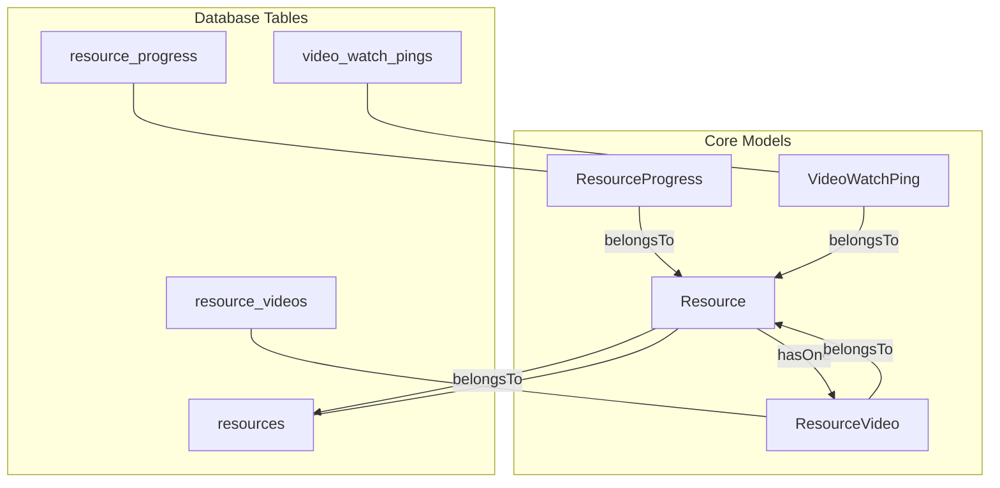
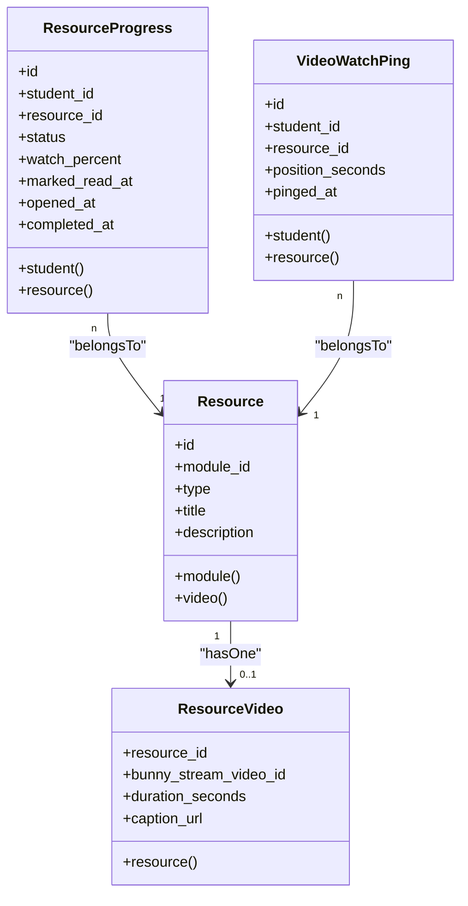
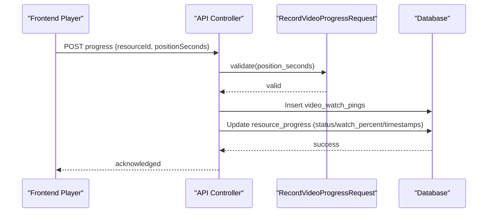
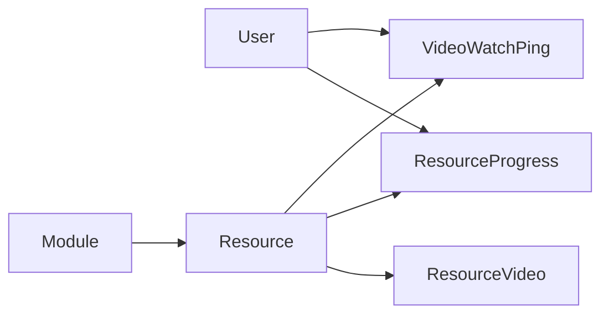

# Video Resources

<cite>
**Referenced Files in This Document**
- [Resource.php](file://app/Models/Resource.php)
- [ResourceVideo.php](file://app/Models/ResourceVideo.php)
- [ResourceProgress.php](file://app/Models/ResourceProgress.php)
- [VideoWatchPing.php](file://app/Models/VideoWatchPing.php)
- [ResourceType.php](file://app/Enums/ResourceType.php)
- [ResourceProgressStatus.php](file://app/Enums/ResourceProgressStatus.php)
- [2024_01_01_000120_create_resources_table.php](file://database/migrations/2024_01_01_000120_create_resources_table.php)
- [2024_01_01_000121_create_resource_videos_table.php](file://database/migrations/2024_01_01_000121_create_resource_videos_table.php)
- [2024_01_01_000151_create_resource_progress_table.php](file://database/migrations/2024_01_01_000151_create_resource_progress_table.php)
- [2024_01_01_000152_create_video_watch_pings_table.php](file://database/migrations/2024_01_01_000152_create_video_watch_pings_table.php)
- [ResourceController.php](file://app/Http/Controllers/Api/V1/ResourceController.php)
- [RecordVideoProgressRequest.php](file://app/Http/Requests/Api/V1/RecordVideoProgressRequest.php)
- [ResourceViewerPage.tsx](file://frontend/src/features/learning\ResourceViewerPage.tsx)
</cite>

## Table of Contents
1. Introduction
2. Project Structure
3. Core Components
4. Architecture Overview
5. Detailed Component Analysis
6. Dependency Analysis
7. Performance Considerations
8. Troubleshooting Guide
9. Conclusion

## Introduction
This document explains the data model and behavior for video resources in the system. It focuses on the ResourceVideo model, its relationship to the base Resource model, and how video metadata is stored and accessed. It also documents the progress tracking system that records watch activity and completion for videos, including the database tables, models, API requests, and frontend integration points.

## Project Structure
Video resources are implemented as a polymorphic resource type using a base Resource record with a dedicated ResourceVideo table for video-specific fields. Progress is tracked per student via ResourceProgress, and detailed playback positions are recorded through VideoWatchPing. The API exposes resource retrieval and creation/update flows, while the frontend simulates playback and sends periodic progress pings.

**Diagram sources**
- [Resource.php:15-45](file://app/Models/Resource.php#L15-L45)
- [ResourceVideo.php:10-28](file://app/Models/ResourceVideo.php#L10-L28)
- [ResourceProgress.php:11-47](file://app/Models/ResourceProgress.php#L11-L47)
- [VideoWatchPing.php:10-34](file://app/Models/VideoWatchPing.php#L10-L34)
- [2024_01_01_000120_create_resources_table.php:13-19](file://database/migrations/2024_01_01_000120_create_resources_table.php#L13-L19)
- [2024_01_01_000121_create_resource_videos_table.php:13-18](file://database/migrations/2024_01_01_000121_create_resource_videos_table.php#L13-L18)
- [2024_01_01_000151_create_resource_progress_table.php:13-23](file://database/migrations/2024_01_01_000151_create_resource_progress_table.php#L13-L23)
- [2024_01_01_000152_create_video_watch_pings_table.php:13-19](file://database/migrations/2024_01_01_000152_create_video_watch_pings_table.php#L13-L19)

**Section sources**
- [Resource.php:15-45](file://app/Models/Resource.php#L15-L45)
- [ResourceVideo.php:10-28](file://app/Models/ResourceVideo.php#L10-L28)
- [ResourceProgress.php:11-47](file://app/Models/ResourceProgress.php#L11-L47)
- [VideoWatchPing.php:10-34](file://app/Models/VideoWatchPing.php#L10-L34)
- [2024_01_01_000120_create_resources_table.php:13-19](file://database/migrations/2024_01_01_000120_create_resources_table.php#L13-L19)
- [2024_01_01_000121_create_resource_videos_table.php:13-18](file://database/migrations/2024_01_01_000121_create_resource_videos_table.php#L13-L18)
- [2024_01_01_000151_create_resource_progress_table.php:13-23](file://database/migrations/2024_01_01_000151_create_resource_progress_table.php#L13-L23)
- [2024_01_01_000152_create_video_watch_pings_table.php:13-19](file://database/migrations/2024_01_01_000152_create_video_watch_pings_table.php#L13-L19)

## Core Components
- Base Resource model defines common fields (module association, type, title, description) and typed relationships to specific resource types. For videos, it exposes a hasOne relationship to ResourceVideo.
- ResourceVideo stores video-specific metadata such as Bunny Stream identifier, duration, and caption URL. It belongs to Resource via a one-to-one link keyed by resource_id.
- ResourceProgress tracks per-student progress against any resource, including status, watch percentage, and timestamps for opened/marked-read/completed events.
- VideoWatchPing records granular playback position events for a student watching a video resource.

Key behaviors:
- ResourceType enum includes Video to identify video resources at the Resource level.
- ResourceProgressStatus enum supports NotStarted, InProgress, Completed states for resources.
- API controller loads related video details when showing a resource, enabling clients to access video metadata.
- Frontend simulates playback and periodically posts progress updates to the backend.

**Section sources**
- [Resource.php:15-45](file://app/Models/Resource.php#L15-L45)
- [ResourceVideo.php:10-28](file://app/Models/ResourceVideo.php#L10-L28)
- [ResourceProgress.php:11-47](file://app/Models/ResourceProgress.php#L11-L47)
- [VideoWatchPing.php:10-34](file://app/Models/VideoWatchPing.php#L10-L34)
- [ResourceType.php:7-16](file://app/Enums/ResourceType.php#L7-L16)
- [ResourceProgressStatus.php:7-12](file://app/Enums/ResourceProgressStatus.php#L7-L12)
- [ResourceController.php:25-28](file://app/Http/Controllers/Api/V1/ResourceController.php#L25-L28)
- [ResourceViewerPage.tsx:65-138](file://frontend/src/features/learning\ResourceViewerPage.tsx#L65-L138)

## Architecture Overview
The system uses a single Resource entity with typed extensions. For videos, ResourceVideo holds streaming and media metadata. Progress is tracked per user-resource pair, and detailed watch events are captured separately to support analytics and completion logic.

**Diagram sources**
- [Resource.php:15-45](file://app/Models/Resource.php#L15-L45)
- [ResourceVideo.php:10-28](file://app/Models/ResourceVideo.php#L10-L28)
- [ResourceProgress.php:11-47](file://app/Models/ResourceProgress.php#L11-L47)
- [VideoWatchPing.php:10-34](file://app/Models/VideoWatchPing.php#L10-L34)

## Detailed Component Analysis

### Resource and ResourceVideo Data Model
- Resource stores module linkage, type, title, and description. Type is cast to an enum; Video is a supported value.
- ResourceVideo is a one-to-one extension keyed by resource_id. It stores:
  - bunny_stream_video_id: identifier for the hosted video asset
  - duration_seconds: optional duration used for progress calculations
  - caption_url: optional WCAG-compliant captions URL
- Relationships:
  - Resource.video returns the associated ResourceVideo
  - ResourceVideo.resource returns the owning Resource

Storage schema highlights:
- resources: id, module_id, type, title, description, timestamps
- resource_videos: resource_id (PK), bunny_stream_video_id, duration_seconds, caption_url

Access patterns:
- GET /resources/{id} loads the resource with its video relation to expose video metadata to clients.

Examples:
- Create a video resource: Use the resource store endpoint with type set to video and include required video metadata via the manager. See controller flow for validation and persistence.
- Access video metadata: Retrieve a resource and load the video relation to read duration and caption URL.

**Section sources**
- [Resource.php:15-45](file://app/Models/Resource.php#L15-L45)
- [ResourceVideo.php:10-28](file://app/Models/ResourceVideo.php#L10-L28)
- [2024_01_01_000120_create_resources_table.php:13-19](file://database/migrations/2024_01_01_000120_create_resources_table.php#L13-L19)
- [2024_01_01_000121_create_resource_videos_table.php:13-18](file://database/migrations/2024_01_01_000121_create_resource_videos_table.php#L13-L18)
- [ResourceController.php:25-28](file://app/Http/Controllers/Api/V1/ResourceController.php#L25-L28)

### Progress Tracking for Videos
- ResourceProgress maintains per-student progress for each resource:
  - status: not_started, in_progress, completed
  - watch_percent: decimal percentage; comment indicates video completion threshold at >= 90%
  - opened_at, marked_read_at, completed_at: event timestamps
  - Unique constraint ensures one row per student-resource pair
- VideoWatchPing captures frequent playback position events:
  - student_id, resource_id, position_seconds, pinged_at
  - Indexed by student_id and resource_id for efficient queries

Completion logic:
- When a student watches a video up to or beyond 90% of duration, the progress status should be updated to completed.

Example scenarios:
- Start watching: Create or update ResourceProgress to in_progress and set opened_at if needed.
- Periodic updates: Append VideoWatchPing entries as the student watches.
- Complete: Update ResourceProgress status to completed and set completed_at when watch_percent reaches the threshold.

**Section sources**
- [ResourceProgress.php:11-47](file://app/Models/ResourceProgress.php#L11-L47)
- [VideoWatchPing.php:10-34](file://app/Models/VideoWatchPing.php#L10-L34)
- [2024_01_01_000151_create_resource_progress_table.php:13-23](file://database/migrations/2024_01_01_000151_create_resource_progress_table.php#L13-L23)
- [2024_01_01_000152_create_video_watch_pings_table.php:13-19](file://database/migrations/2024_01_01_000152_create_video_watch_pings_table.php#L13-L19)

### API and Frontend Integration for Watch Tracking
- RecordVideoProgressRequest validates incoming progress payloads, requiring a non-negative integer position_seconds.
- ResourceController demonstrates loading resource relations including video for display.
- Frontend simulates playback and periodically posts progress updates with resourceId and positionSeconds.

Sequence of a watch session:
- Client starts playback and begins sending periodic progress pings.
- Backend persists VideoWatchPing entries and may update ResourceProgress based on thresholds.
- Upon reaching completion threshold, ResourceProgress status transitions to completed.

**Diagram sources**
- [RecordVideoProgressRequest.php:11-21](file://app/Http/Requests/Api/V1/RecordVideoProgressRequest.php#L11-L21)
- [ResourceController.php:25-28](file://app/Http/Controllers/Api/V1/ResourceController.php#L25-L28)
- [VideoWatchPing.php:10-34](file://app/Models/VideoWatchPing.php#L10-L34)
- [ResourceProgress.php:11-47](file://app/Models/ResourceProgress.php#L11-L47)

**Section sources**
- [RecordVideoProgressRequest.php:11-21](file://app/Http/Requests/Api/V1/RecordVideoProgressRequest.php#L11-L21)
- [ResourceController.php:25-28](file://app/Http/Controllers/Api/V1/ResourceController.php#L25-L28)
- [ResourceViewerPage.tsx:65-138](file://frontend/src/features/learning\ResourceViewerPage.tsx#L65-L138)

### Video Metadata Fields and Usage
- bunny_stream_video_id: Used to reference the hosted video asset for playback.
- duration_seconds: Used to compute watch percentage and determine completion.
- caption_url: Optional accessibility field for closed captions.

Usage examples:
- Displaying duration and captions in the player UI.
- Calculating watch percent from position_seconds and duration_seconds.
- Enabling accessibility features by rendering captions when available.

**Section sources**
- [ResourceVideo.php:18-23](file://app/Models/ResourceVideo.php#L18-L23)
- [2024_01_01_000121_create_resource_videos_table.php:13-18](file://database/migrations/2024_01_01_000121_create_resource_videos_table.php#L13-L18)

## Dependency Analysis
- Resource depends on Module and enumerates ResourceType values.
- ResourceVideo depends on Resource via foreign key resource_id.
- ResourceProgress depends on User (student) and Resource.
- VideoWatchPing depends on User (student) and Resource.
- API layer depends on request validation and controllers to orchestrate persistence.

**Diagram sources**
- [Resource.php:15-45](file://app/Models/Resource.php#L15-L45)
- [ResourceVideo.php:10-28](file://app/Models/ResourceVideo.php#L10-L28)
- [ResourceProgress.php:11-47](file://app/Models/ResourceProgress.php#L11-L47)
- [VideoWatchPing.php:10-34](file://app/Models/VideoWatchPing.php#L10-L34)

**Section sources**
- [Resource.php:15-45](file://app/Models/Resource.php#L15-L45)
- [ResourceVideo.php:10-28](file://app/Models/ResourceVideo.php#L10-L28)
- [ResourceProgress.php:11-47](file://app/Models/ResourceProgress.php#L11-L47)
- [VideoWatchPing.php:10-34](file://app/Models/VideoWatchPing.php#L10-L34)

## Performance Considerations
- VideoWatchPing can grow rapidly; ensure indexing on student_id and resource_id for efficient aggregation and latest-position queries.
- Batch or throttle progress pings to reduce write load while maintaining accurate completion detection.
- Cache ResourceVideo metadata where appropriate to avoid repeated joins for frequently accessed resources.
- Use transactions when updating ResourceProgress alongside creating VideoWatchPing to maintain consistency.

[No sources needed since this section provides general guidance]

## Troubleshooting Guide
Common issues and resolutions:
- Missing video metadata: Ensure ResourceVideo exists for video-type resources and that duration_seconds is set to enable completion calculation.
- Progress not completing: Verify watch_percent reaches the completion threshold and that ResourceProgress status is updated accordingly.
- Duplicate progress rows: Confirm unique constraint on student_id and resource_id prevents duplicates in ResourceProgress.
- High write volume: Adjust ping frequency and consider server-side aggregation to limit database writes.

Validation checks:
- Validate incoming position_seconds is non-negative.
- Ensure resource_id references a valid Resource.
- Confirm student_id corresponds to an authenticated user.

**Section sources**
- [RecordVideoProgressRequest.php:11-21](file://app/Http/Requests/Api/V1/RecordVideoProgressRequest.php#L11-L21)
- [2024_01_01_000151_create_resource_progress_table.php:13-23](file://database/migrations/2024_01_01_000151_create_resource_progress_table.php#L13-L23)
- [2024_01_01_000152_create_video_watch_pings_table.php:13-19](file://database/migrations/2024_01_01_000152_create_video_watch_pings_table.php#L13-L19)

## Conclusion
The video resource model centers around a unified Resource entity extended by ResourceVideo for media-specific fields. Progress tracking leverages ResourceProgress for high-level state and VideoWatchPing for detailed playback telemetry. Together, these components enable robust video learning experiences with accessible metadata, reliable completion tracking, and scalable performance considerations.

[No sources needed since this section summarizes without analyzing specific files]