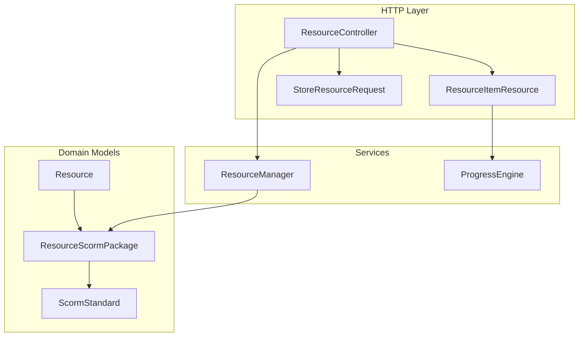
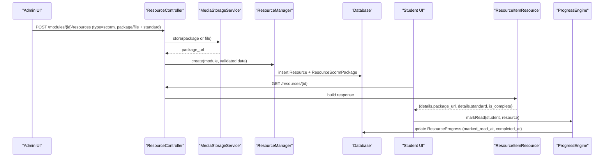
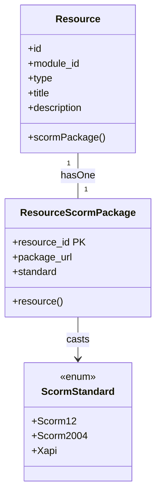
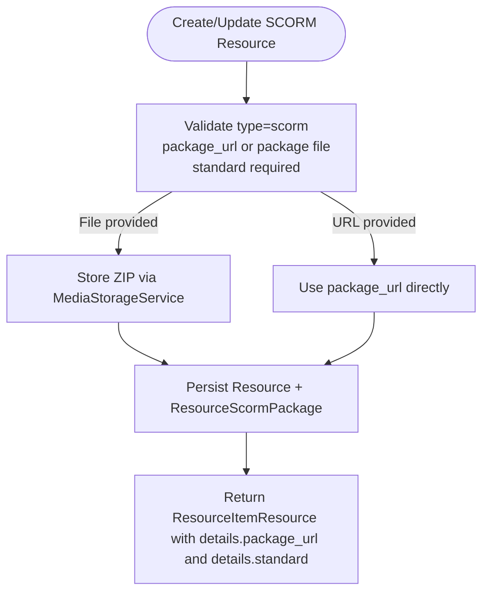
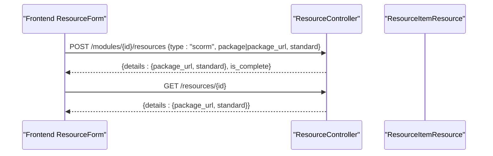
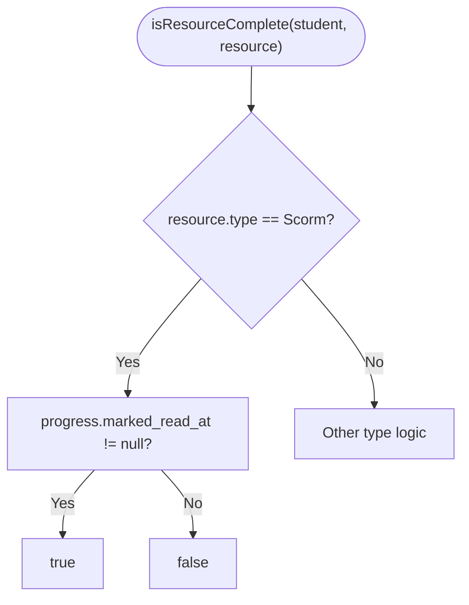
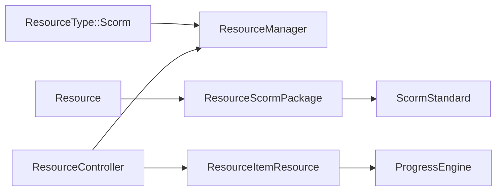

# SCORM Package Resources

<cite>
**Referenced Files in This Document**
- [ResourceScormPackage.php](file://app/Models/ResourceScormPackage.php)
- [ScormStandard.php](file://app/Enums/ScormStandard.php)
- [Resource.php](file://app/Models/Resource.php)
- [2024_01_01_000125_create_resource_scorm_packages_table.php](file://database/migrations/2024_01_01_000125_create_resource_scorm_packages_table.php)
- [ResourceManager.php](file://app/Services/Content/ResourceManager.php)
- [ResourceController.php](file://app/Http/Controllers/Api/V1/ResourceController.php)
- [StoreResourceRequest.php](file://app/Http/Requests/Api/V1/StoreResourceRequest.php)
- [ResourceItemResource.php](file://app/Http/Resources/ResourceItemResource.php)
- [ProgressEngine.php](file://app/Services/Progress/ProgressEngine.php)
- [ResourceType.php](file://app/Enums/ResourceType.php)
- [ResourceForm.tsx](file://frontend/src/features/courseStructure\ResourceForm.tsx)
</cite>

## Table of Contents
1. [Introduction](#introduction)
2. [Project Structure](#project-structure)
3. [Core Components](#core-components)
4. [Architecture Overview](#architecture-overview)
5. [Detailed Component Analysis](#detailed-component-analysis)
6. [Dependency Analysis](#dependency-analysis)
7. [Performance Considerations](#performance-considerations)
8. [Troubleshooting Guide](#troubleshooting-guide)
9. [Conclusion](#conclusion)
10. [Appendices](#appendices)

## Introduction
This document explains how SCORM package resources are modeled, stored, and consumed within the LMS. It focuses on the ResourceScormPackage data model, supported SCORM standards, upload and storage behavior, API exposure, and progress tracking integration. It also clarifies the current communication bridge between SCORM packages and the LMS for progress, scoring, and completion reporting as implemented in this codebase.

## Project Structure
SCORM support is part of a unified resource system where each learning resource (video, document, reading, external link, live session, downloadable file, or SCORM/xAPI package) shares a common Resource entity and type-specific detail tables. SCORM packages are represented by a dedicated detail table linked to Resource, with an enum defining supported standards.



**Diagram sources**
- [Resource.php:71-77](file://app/Models/Resource.php#L71-L77)
- [ResourceScormPackage.php:11-32](file://app/Models/ResourceScormPackage.php#L11-L32)
- [ScormStandard.php:7-12](file://app/Enums/ScormStandard.php#L7-L12)
- [ResourceManager.php:101-142](file://app/Services/Content/ResourceManager.php#L101-L142)
- [ResourceController.php:30-66](file://app/Http/Controllers/Api/V1/ResourceController.php#L30-L66)
- [ResourceItemResource.php:27-53](file://app/Http/Resources/ResourceItemResource.php#L27-L53)
- [StoreResourceRequest.php:25-62](file://app/Http/Requests/Api/V1/StoreResourceRequest.php#L25-L62)
- [ProgressEngine.php:170-205](file://app/Services/Progress/ProgressEngine.php#L170-L205)

**Section sources**
- [Resource.php:71-77](file://app/Models/Resource.php#L71-L77)
- [ResourceScormPackage.php:11-32](file://app/Models/ResourceScormPackage.php#L11-L32)
- [ScormStandard.php:7-12](file://app/Enums/ScormStandard.php#L7-L12)
- [ResourceManager.php:101-142](file://app/Services/Content/ResourceManager.php#L101-L142)
- [ResourceController.php:30-66](file://app/Http/Controllers/Api/V1/ResourceController.php#L30-L66)
- [ResourceItemResource.php:27-53](file://app/Http/Resources/ResourceItemResource.php#L27-L53)
- [StoreResourceRequest.php:25-62](file://app/Http/Requests/Api/V1/StoreResourceRequest.php#L25-L62)
- [ProgressEngine.php:170-205](file://app/Services/Progress/ProgressEngine.php#L170-L205)

## Core Components
- ResourceScormPackage: Stores the SCORM package URL and selected standard per resource.
- ScormStandard: Enumerates supported standards (SCORM 1.2, SCORM 2004, xAPI).
- ResourceManager: Creates/updates SCORM subtype records alongside the base Resource.
- ResourceController: Handles SCORM package uploads or URL-based references via a shared media storage service.
- StoreResourceRequest: Validates SCORM fields and enforces required inputs based on resource type.
- ResourceItemResource: Exposes SCORM details (package URL and standard) through a consistent API envelope.
- ProgressEngine: Treats SCORM completion using the same “mark as read” signal used for documents/readings.

**Section sources**
- [ResourceScormPackage.php:11-32](file://app/Models/ResourceScormPackage.php#L11-L32)
- [ScormStandard.php:7-12](file://app/Enums/ScormStandard.php#L7-L12)
- [ResourceManager.php:101-142](file://app/Services/Content/ResourceManager.php#L101-L142)
- [ResourceController.php:30-66](file://app/Http/Controllers/Api/V1/ResourceController.php#L30-L66)
- [StoreResourceRequest.php:25-62](file://app/Http/Requests/Api/V1/StoreResourceRequest.php#L25-L62)
- [ResourceItemResource.php:82-85](file://app/Http/Resources/ResourceItemResource.php#L82-L85)
- [ProgressEngine.php:170-205](file://app/Services/Progress/ProgressEngine.php#L170-L205)

## Architecture Overview
The SCORM workflow spans creation, storage, retrieval, and progress tracking:



**Diagram sources**
- [ResourceController.php:30-66](file://app/Http/Controllers/Api/V1/ResourceController.php#L30-L66)
- [ResourceManager.php:33-58](file://app/Services/Content/ResourceManager.php#L33-L58)
- [ResourceManager.php:101-142](file://app/Services/Content/ResourceManager.php#L101-L142)
- [ResourceItemResource.php:27-53](file://app/Http/Resources/ResourceItemResource.php#L27-L53)
- [ProgressEngine.php:246-258](file://app/Services/Progress/ProgressEngine.php#L246-L258)

## Detailed Component Analysis

### Data Model: ResourceScormPackage and Relationships
- Primary key is resource_id, one-to-one with Resource.
- Stores package_url and standard (cast to ScormStandard).
- No timestamps; lifecycle managed by Resource deletion cascade.



**Diagram sources**
- [Resource.php:71-77](file://app/Models/Resource.php#L71-L77)
- [ResourceScormPackage.php:11-32](file://app/Models/ResourceScormPackage.php#L11-L32)
- [ScormStandard.php:7-12](file://app/Enums/ScormStandard.php#L7-L12)

**Section sources**
- [ResourceScormPackage.php:11-32](file://app/Models/ResourceScormPackage.php#L11-L32)
- [Resource.php:71-77](file://app/Models/Resource.php#L71-L77)
- [ScormStandard.php:7-12](file://app/Enums/ScormStandard.php#L7-L12)

### Database Schema for SCORM Packages
- Table resource_scorm_packages links to resources via foreign key.
- Columns: package_url (string), standard (enum scorm_1_2 | scorm_2004 | xapi).

```mermaid
erDiagram
RESOURCE ||--|| RESOURCE_SCORM_PACKAGES : "has one"
RESOURCE {
bigint id PK
}
RESOURCE_SCORM_PACKAGES {
bigint resource_id PK FK
string package_url
enum standard
}
```

**Diagram sources**
- [2024_01_01_000125_create_resource_scorm_packages_table.php:13-17](file://database/migrations/2024_01_01_000125_create_resource_scorm_packages_table.php#L13-L17)

**Section sources**
- [2024_01_01_000125_create_resource_scorm_packages_table.php:13-17](file://database/migrations/2024_01_01_000125_create_resource_scorm_packages_table.php#L13-L17)

### Upload, Extraction, and Execution Environment
- Upload: The controller accepts either a ZIP file or a URL for the SCORM package. Uploaded files are stored via the media storage service and saved as package_url.
- Extraction: There is no extraction step in this codebase; the package URL is persisted and served to clients.
- Execution environment: The frontend receives package_url and standard from the API and can embed or launch the SCORM content externally. The LMS does not include an in-house SCORM runtime in this implementation.



**Diagram sources**
- [StoreResourceRequest.php:52-55](file://app/Http/Requests/Api/V1/StoreResourceRequest.php#L52-L55)
- [ResourceController.php:39-41](file://app/Http/Controllers/Api/V1/ResourceController.php#L39-L41)
- [ResourceManager.php:124-128](file://app/Services/Content/ResourceManager.php#L124-L128)
- [ResourceItemResource.php:82-85](file://app/Http/Resources/ResourceItemResource.php#L82-L85)

**Section sources**
- [StoreResourceRequest.php:52-55](file://app/Http/Requests/Api/V1/StoreResourceRequest.php#L52-L55)
- [ResourceController.php:39-41](file://app/Http/Controllers/Api/V1/ResourceController.php#L39-L41)
- [ResourceManager.php:124-128](file://app/Services/Content/ResourceManager.php#L124-L128)
- [ResourceItemResource.php:82-85](file://app/Http/Resources/ResourceItemResource.php#L82-L85)

### API Exposure and Frontend Integration
- API shape: A single ResourceItemResource normalizes all resource types under a common envelope. For SCORM, details includes package_url and standard.
- Frontend form: The course builder provides a file-or-URL input for the SCORM package and a selector for the standard.



**Diagram sources**
- [ResourceForm.tsx:246-267](file://frontend/src/features/courseStructure\ResourceForm.tsx#L246-L267)
- [ResourceController.php:30-66](file://app/Http/Controllers/Api/V1/ResourceController.php#L30-L66)
- [ResourceItemResource.php:82-85](file://app/Http/Resources/ResourceItemResource.php#L82-L85)

**Section sources**
- [ResourceForm.tsx:246-267](file://frontend/src/features/courseStructure\ResourceForm.tsx#L246-L267)
- [ResourceController.php:30-66](file://app/Http/Controllers/Api/V1/ResourceController.php#L30-L66)
- [ResourceItemResource.php:82-85](file://app/Http/Resources/ResourceItemResource.php#L82-L85)

### Progress Tracking and Completion Logic
- Completion rule: SCORM resources are considered complete when marked as read, identical to documents/readings.
- Enforcement: All progress actions assert that the module is unlocked before recording progress.
- Signals: markRead sets status to Completed and timestamps both marked_read_at and completed_at.



**Diagram sources**
- [ProgressEngine.php:170-205](file://app/Services/Progress/ProgressEngine.php#L170-L205)

**Section sources**
- [ProgressEngine.php:170-205](file://app/Services/Progress/ProgressEngine.php#L170-L205)
- [ProgressEngine.php:246-258](file://app/Services/Progress/ProgressEngine.php#L246-L258)

### Communication Bridge Between SCORM Packages and the LMS
- Current state: There is no in-house SCORM runtime or xAPI endpoint in this codebase. SCORM completion is recorded via the generic “mark as read” action rather than parsing SCORM/xAPI calls.
- Implication: Any SCORM-level scoring or detailed interactions must be surfaced to the LMS through explicit client actions that call the progress endpoints; otherwise, only completion is tracked.

**Section sources**
- [ProgressEngine.php:170-205](file://app/Services/Progress/ProgressEngine.php#L170-L205)

## Dependency Analysis
Key relationships and coupling:
- Resource has a one-to-one relationship with ResourceScormPackage.
- ResourceScormPackage casts standard to ScormStandard.
- ResourceManager orchestrates creation/update of subtype records.
- ResourceController coordinates file handling and delegates persistence to ResourceManager.
- ResourceItemResource exposes normalized details including SCORM fields.
- ProgressEngine integrates SCORM into the overall module completion algorithm.



**Diagram sources**
- [ResourceType.php:7-16](file://app/Enums/ResourceType.php#L7-L16)
- [ResourceManager.php:101-142](file://app/Services/Content/ResourceManager.php#L101-L142)
- [Resource.php:71-77](file://app/Models/Resource.php#L71-L77)
- [ResourceScormPackage.php:11-32](file://app/Models/ResourceScormPackage.php#L11-L32)
- [ScormStandard.php:7-12](file://app/Enums/ScormStandard.php#L7-L12)
- [ResourceController.php:30-66](file://app/Http/Controllers/Api/V1/ResourceController.php#L30-L66)
- [ResourceItemResource.php:27-53](file://app/Http/Resources/ResourceItemResource.php#L27-L53)
- [ProgressEngine.php:170-205](file://app/Services/Progress/ProgressEngine.php#L170-L205)

**Section sources**
- [ResourceType.php:7-16](file://app/Enums/ResourceType.php#L7-L16)
- [ResourceManager.php:101-142](file://app/Services/Content/ResourceManager.php#L101-L142)
- [Resource.php:71-77](file://app/Models/Resource.php#L71-L77)
- [ResourceScormPackage.php:11-32](file://app/Models/ResourceScormPackage.php#L11-L32)
- [ScormStandard.php:7-12](file://app/Enums/ScormStandard.php#L7-L12)
- [ResourceController.php:30-66](file://app/Http/Controllers/Api/V1/ResourceController.php#L30-L66)
- [ResourceItemResource.php:27-53](file://app/Http/Resources/ResourceItemResource.php#L27-L53)
- [ProgressEngine.php:170-205](file://app/Services/Progress/ProgressEngine.php#L170-L205)

## Performance Considerations
- Storage: SCORM packages are stored as ZIP files via the media storage service; ensure appropriate size limits and CDN configuration for large assets.
- API payload: ResourceItemResource returns normalized details; avoid unnecessary eager loading to keep responses lean.
- Progress updates: markRead is lightweight; batch operations should still respect module unlock checks to prevent redundant writes.

[No sources needed since this section provides general guidance]

## Troubleshooting Guide
Common issues and resolutions:
- Validation errors on SCORM creation: Ensure type is set to scorm, provide either a valid package URL or a ZIP file, and include a valid standard value.
- Missing package_url in API response: Confirm that the resource was created with type scorm and that the subtype record exists.
- SCORM not marking complete: Verify that the student’s module is unlocked and that markRead has been called for the resource.

**Section sources**
- [StoreResourceRequest.php:52-55](file://app/Http/Requests/Api/V1/StoreResourceRequest.php#L52-L55)
- [ResourceItemResource.php:82-85](file://app/Http/Resources/ResourceItemResource.php#L82-L85)
- [ProgressEngine.php:246-258](file://app/Services/Progress/ProgressEngine.php#L246-L258)

## Conclusion
SCORM packages are first-class resources in this LMS, stored as ZIP files or URLs and exposed through a consistent API. Completion is tracked via the existing mark-as-read mechanism, aligning SCORM with other content types. While there is no built-in SCORM runtime or xAPI bridge in this implementation, the design allows straightforward extension to capture richer interaction data if needed.

[No sources needed since this section summarizes without analyzing specific files]

## Appendices

### Example Workflows

#### Importing a SCORM Package
- Create a resource with type=scorm.
- Provide either:
  - A ZIP file (accepted by the request validator) which will be stored and returned as package_url, or
  - A direct package_url pointing to a hosted ZIP.
- Include standard (scorm_1_2, scorm_2004, or xapi).

**Section sources**
- [StoreResourceRequest.php:52-55](file://app/Http/Requests/Api/V1/StoreResourceRequest.php#L52-L55)
- [ResourceController.php:39-41](file://app/Http/Controllers/Api/V1/ResourceController.php#L39-L41)
- [ResourceManager.php:124-128](file://app/Services/Content/ResourceManager.php#L124-L128)

#### Configuring Learning Objectives
- Learning objectives are not stored in the SCORM subtype; they would typically be embedded within the SCORM package metadata or handled separately by your authoring tool. The LMS stores only package_url and standard for SCORM resources.

**Section sources**
- [ResourceScormPackage.php:19-27](file://app/Models/ResourceScormPackage.php#L19-L27)

#### Tracking Student Performance Within SCORM Content
- In this implementation, performance beyond completion is not captured automatically by the LMS. To mark a SCORM resource complete, call the mark-read action for the resource.
- If you need scoring or detailed interactions, integrate a custom flow that calls the progress endpoints after the SCORM content reports results back to the LMS.

**Section sources**
- [ProgressEngine.php:170-205](file://app/Services/Progress/ProgressEngine.php#L170-L205)
- [ProgressEngine.php:246-258](file://app/Services/Progress/ProgressEngine.php#L246-L258)