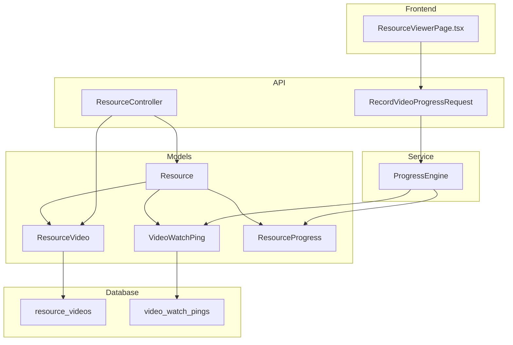
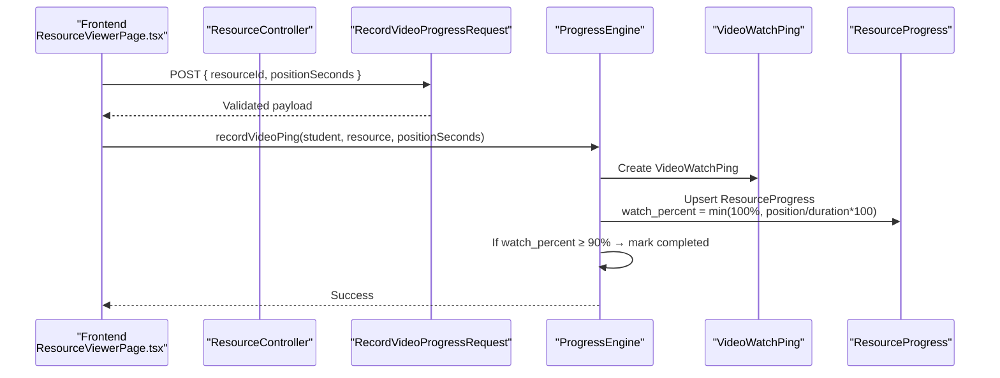
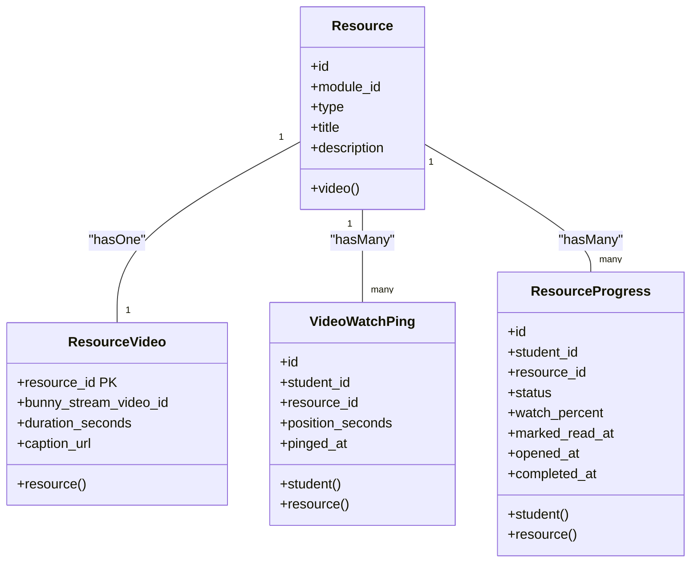
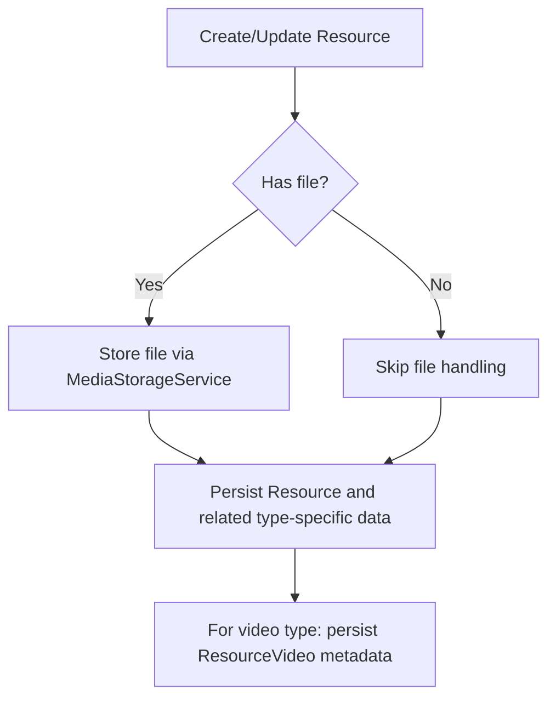
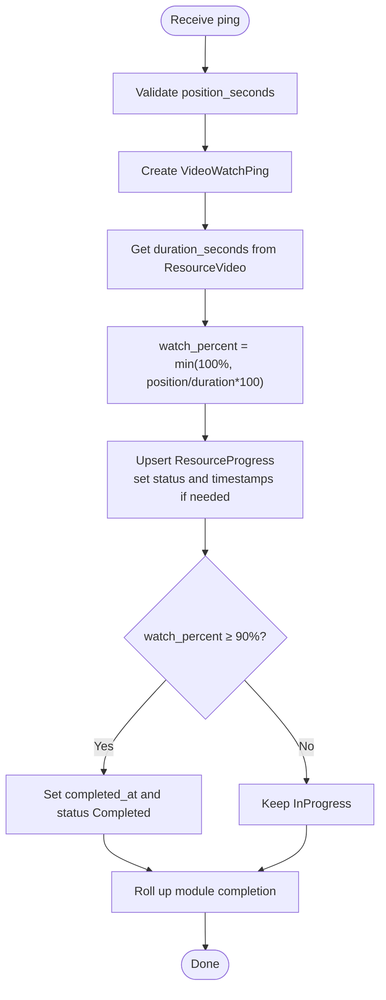
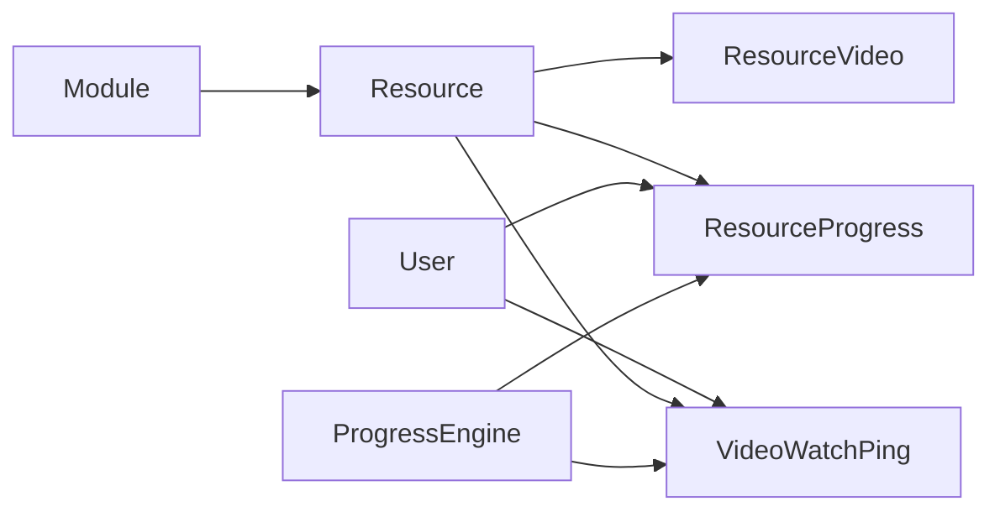

# Video Resources

<cite>
**Referenced Files in This Document**
- [Resource.php](file://app/Models/Resource.php)
- [ResourceVideo.php](file://app/Models/ResourceVideo.php)
- [VideoWatchPing.php](file://app/Models/VideoWatchPing.php)
- [ResourceProgress.php](file://app/Models/ResourceProgress.php)
- [2024_01_01_000121_create_resource_videos_table.php](file://database/migrations/2024_01_01_000121_create_resource_videos_table.php)
- [2024_01_01_000152_create_video_watch_pings_table.php](file://database/migrations/2024_01_01_000152_create_video_watch_pings_table.php)
- [ResourceController.php](file://app/Http/Controllers/Api/V1/ResourceController.php)
- [RecordVideoProgressRequest.php](file://app/Http/Requests/Api/V1/RecordVideoProgressRequest.php)
- [ProgressEngine.php](file://app/Services/Progress/ProgressEngine.php)
- [ResourceViewerPage.tsx](file://frontend/src/features/learning/ResourceViewerPage.tsx)
</cite>

## Table of Contents
1. Introduction
2. Project Structure
3. Core Components
4. Architecture Overview
5. Detailed Component Analysis
6. Dependency Analysis
7. Performance Considerations
8. Troubleshooting Guide
9. Conclusion
10. Appendices

## Introduction
This document explains the data model and behavior for video resources in the system. It covers:
- The Resource base model and its one-to-one relationship with ResourceVideo
- Video metadata fields and how they are stored
- How student viewing is tracked via VideoWatchPing
- How progress is computed and persisted in ResourceProgress
- Completion rules (≥90% watched marks a video as complete)
- Examples of uploading videos, tracking watch progress, and calculating completion percentages

## Project Structure
The video resource feature spans models, migrations, controllers, requests, services, and frontend components:
- Models define entities and relationships
- Migrations define database schema
- Controllers handle API endpoints for creating/updating resources
- Requests validate incoming data
- Services implement business logic for progress and completion
- Frontend simulates playback and sends progress pings

**Diagram sources**
- [Resource.php:15-103](file://app/Models/Resource.php#L15-L103)
- [ResourceVideo.php:10-29](file://app/Models/ResourceVideo.php#L10-L29)
- [VideoWatchPing.php:10-35](file://app/Models/VideoWatchPing.php#L10-L35)
- [ResourceProgress.php:11-49](file://app/Models/ResourceProgress.php#L11-L49)
- [2024_01_01_000121_create_resource_videos_table.php:11-19](file://database/migrations/2024_01_01_000121_create_resource_videos_table.php#L11-L19)
- [2024_01_01_000152_create_video_watch_pings_table.php:11-20](file://database/migrations/2024_01_01_000152_create_video_watch_pings_table.php#L11-L20)
- [ResourceController.php:18-85](file://app/Http/Controllers/Api/V1/ResourceController.php#L18-L85)
- [RecordVideoProgressRequest.php:9-22](file://app/Http/Requests/Api/V1/RecordVideoProgressRequest.php#L9-L22)
- [ProgressEngine.php:218-244](file://app/Services/Progress/ProgressEngine.php#L218-L244)
- [ResourceViewerPage.tsx:65-138](file://frontend/src/features/learning/ResourceViewerPage.tsx#L65-L138)

**Section sources**
- [Resource.php:15-103](file://app/Models/Resource.php#L15-L103)
- [ResourceVideo.php:10-29](file://app/Models/ResourceVideo.php#L10-L29)
- [VideoWatchPing.php:10-35](file://app/Models/VideoWatchPing.php#L10-L35)
- [ResourceProgress.php:11-49](file://app/Models/ResourceProgress.php#L11-L49)
- [2024_01_01_000121_create_resource_videos_table.php:11-19](file://database/migrations/2024_01_01_000121_create_resource_videos_table.php#L11-L19)
- [2024_01_01_000152_create_video_watch_pings_table.php:11-20](file://database/migrations/2024_01_01_000152_create_video_watch_pings_table.php#L11-L20)
- [ResourceController.php:18-85](file://app/Http/Controllers/Api/V1/ResourceController.php#L18-L85)
- [RecordVideoProgressRequest.php:9-22](file://app/Http/Requests/Api/V1/RecordVideoProgressRequest.php#L9-L22)
- [ProgressEngine.php:218-244](file://app/Services/Progress/ProgressEngine.php#L218-L244)
- [ResourceViewerPage.tsx:65-138](file://frontend/src/features/learning/ResourceViewerPage.tsx#L65-L138)

## Core Components
- Resource: Base entity for all content types; holds module association and type; defines relationships to specific media like video.
- ResourceVideo: One-to-one extension for video resources; stores Bunny Stream identifier, duration, and caption URL.
- VideoWatchPing: Records per-viewer position pongs during playback.
- ResourceProgress: Tracks per-student per-resource progress including watch percentage and completion timestamps.
- ProgressEngine: Central service that computes completion and updates progress based on signals (e.g., video pings).
- ResourceController: Handles creation/update of resources and delegates file storage to MediaStorageService.
- RecordVideoProgressRequest: Validates progress ping payloads.
- ResourceViewerPage (frontend): Simulates playback and periodically sends progress pings.

**Section sources**
- [Resource.php:15-103](file://app/Models/Resource.php#L15-L103)
- [ResourceVideo.php:10-29](file://app/Models/ResourceVideo.php#L10-L29)
- [VideoWatchPing.php:10-35](file://app/Models/VideoWatchPing.php#L10-L35)
- [ResourceProgress.php:11-49](file://app/Models/ResourceProgress.php#L11-L49)
- [ProgressEngine.php:170-244](file://app/Services/Progress/ProgressEngine.php#L170-L244)
- [ResourceController.php:18-85](file://app/Http/Controllers/Api/V1/ResourceController.php#L18-L85)
- [RecordVideoProgressRequest.php:9-22](file://app/Http/Requests/Api/V1/RecordVideoProgressRequest.php#L9-L22)
- [ResourceViewerPage.tsx:65-138](file://frontend/src/features/learning/ResourceViewerPage.tsx#L65-L138)

## Architecture Overview
The video workflow integrates frontend playback simulation, API validation, service-level progress computation, and persistence.

**Diagram sources**
- [ResourceViewerPage.tsx:65-138](file://frontend/src/features/learning/ResourceViewerPage.tsx#L65-L138)
- [RecordVideoProgressRequest.php:9-22](file://app/Http/Requests/Api/V1/RecordVideoProgressRequest.php#L9-L22)
- [ProgressEngine.php:218-244](file://app/Services/Progress/ProgressEngine.php#L218-L244)
- [VideoWatchPing.php:10-35](file://app/Models/VideoWatchPing.php#L10-L35)
- [ResourceProgress.php:11-49](file://app/Models/ResourceProgress.php#L11-L49)

## Detailed Component Analysis

### Data Model Relationships
- Resource has a one-to-one relationship with ResourceVideo via resource_id.
- ResourceProgress links student and resource to track per-user progress.
- VideoWatchPing records each viewer’s position over time for analytics and progress calculation.

**Diagram sources**
- [Resource.php:15-103](file://app/Models/Resource.php#L15-L103)
- [ResourceVideo.php:10-29](file://app/Models/ResourceVideo.php#L10-L29)
- [VideoWatchPing.php:10-35](file://app/Models/VideoWatchPing.php#L10-L35)
- [ResourceProgress.php:11-49](file://app/Models/ResourceProgress.php#L11-L49)

**Section sources**
- [Resource.php:15-103](file://app/Models/Resource.php#L15-L103)
- [ResourceVideo.php:10-29](file://app/Models/ResourceVideo.php#L10-L29)
- [VideoWatchPing.php:10-35](file://app/Models/VideoWatchPing.php#L10-L35)
- [ResourceProgress.php:11-49](file://app/Models/ResourceProgress.php#L11-L49)

### Video Metadata and Storage
- Video metadata includes:
  - bunny_stream_video_id: external streaming ID
  - duration_seconds: total length in seconds
  - caption_url: WCAG-compliant captions
- These fields are defined by the resource_videos table migration.
- Resource controller handles generic resource uploads via MediaStorageService; video-specific metadata is managed through the ResourceVideo model.

**Diagram sources**
- [ResourceController.php:30-66](file://app/Http/Controllers/Api/V1/ResourceController.php#L30-L66)
- [2024_01_01_000121_create_resource_videos_table.php:11-19](file://database/migrations/2024_01_01_000121_create_resource_videos_table.php#L11-L19)

**Section sources**
- [ResourceController.php:30-66](file://app/Http/Controllers/Api/V1/ResourceController.php#L30-L66)
- [2024_01_01_000121_create_resource_videos_table.php:11-19](file://database/migrations/2024_01_01_000121_create_resource_videos_table.php#L11-L19)

### Watch Progress Tracking and Completion Calculation
- The frontend simulates playback and periodically sends progress pings with current position in seconds.
- The backend validates the request and persists a VideoWatchPing.
- ProgressEngine computes watch_percent from position_seconds and duration_seconds, caps at 100%, and updates ResourceProgress.
- When watch_percent reaches or exceeds 90%, the resource is marked completed and timestamps are set accordingly.

**Diagram sources**
- [ResourceViewerPage.tsx:65-138](file://frontend/src/features/learning/ResourceViewerPage.tsx#L65-L138)
- [RecordVideoProgressRequest.php:9-22](file://app/Http/Requests/Api/V1/RecordVideoProgressRequest.php#L9-L22)
- [ProgressEngine.php:218-244](file://app/Services/Progress/ProgressEngine.php#L218-L244)
- [ResourceProgress.php:11-49](file://app/Models/ResourceProgress.php#L11-L49)
- [VideoWatchPing.php:10-35](file://app/Models/VideoWatchPing.php#L10-L35)

**Section sources**
- [ResourceViewerPage.tsx:65-138](file://frontend/src/features/learning/ResourceViewerPage.tsx#L65-L138)
- [RecordVideoProgressRequest.php:9-22](file://app/Http/Requests/Api/V1/RecordVideoProgressRequest.php#L9-L22)
- [ProgressEngine.php:218-244](file://app/Services/Progress/ProgressEngine.php#L218-L244)
- [ResourceProgress.php:11-49](file://app/Models/ResourceProgress.php#L11-L49)
- [VideoWatchPing.php:10-35](file://app/Models/VideoWatchPing.php#L10-L35)

### Example Workflows

#### Uploading a Video Resource
- Use the resource creation endpoint to upload files; the controller delegates storage to MediaStorageService and then persists the resource via ResourceManager.
- For video-type resources, ensure ResourceVideo metadata (duration, Bunny Stream ID, captions) is associated with the created resource.

**Section sources**
- [ResourceController.php:30-66](file://app/Http/Controllers/Api/V1/ResourceController.php#L30-L66)
- [Resource.php:40-45](file://app/Models/Resource.php#L40-L45)

#### Tracking Watch Progress
- The frontend advances a simulated position and sends periodic pings with position_seconds.
- Backend validates input, records VideoWatchPing, and updates ResourceProgress with computed watch_percent.

**Section sources**
- [ResourceViewerPage.tsx:65-138](file://frontend/src/features/learning/ResourceViewerPage.tsx#L65-L138)
- [RecordVideoProgressRequest.php:9-22](file://app/Http/Requests/Api/V1/RecordVideoProgressRequest.php#L9-L22)
- [ProgressEngine.php:218-244](file://app/Services/Progress/ProgressEngine.php#L218-L244)

#### Calculating Completion Percentage
- watch_percent is calculated as min(100%, position_seconds / duration_seconds * 100).
- At ≥90%, the resource is considered complete and ResourceProgress.completed_at is set.

**Section sources**
- [ProgressEngine.php:218-244](file://app/Services/Progress/ProgressEngine.php#L218-L244)
- [ResourceProgress.php:11-49](file://app/Models/ResourceProgress.php#L11-L49)

## Dependency Analysis
- Resource depends on Module and has typed relationships to specific resource types (e.g., video).
- ResourceVideo depends on Resource via resource_id primary key.
- VideoWatchPing depends on User (student) and Resource.
- ResourceProgress depends on User (student) and Resource.
- ProgressEngine orchestrates interactions between these models and triggers rollups when thresholds are met.

**Diagram sources**
- [Resource.php:15-103](file://app/Models/Resource.php#L15-L103)
- [ResourceVideo.php:10-29](file://app/Models/ResourceVideo.php#L10-L29)
- [VideoWatchPing.php:10-35](file://app/Models/VideoWatchPing.php#L10-L35)
- [ResourceProgress.php:11-49](file://app/Models/ResourceProgress.php#L11-L49)
- [ProgressEngine.php:218-244](file://app/Services/Progress/ProgressEngine.php#L218-L244)

**Section sources**
- [Resource.php:15-103](file://app/Models/Resource.php#L15-L103)
- [ResourceVideo.php:10-29](file://app/Models/ResourceVideo.php#L10-L29)
- [VideoWatchPing.php:10-35](file://app/Models/VideoWatchPing.php#L10-L35)
- [ResourceProgress.php:11-49](file://app/Models/ResourceProgress.php#L11-L49)
- [ProgressEngine.php:218-244](file://app/Services/Progress/ProgressEngine.php#L218-L244)

## Performance Considerations
- Pinging frequency: The frontend sends pings every few seconds; ensure backend can handle frequent writes to VideoWatchPing.
- Indexing: video_watch_pings uses an index on (student_id, resource_id) to optimize queries for progress retrieval and aggregation.
- Duration availability: watch_percent calculation depends on duration_seconds being present; missing durations result in 0% until known.
- Idempotency: ProgressEngine ensures watch_percent only increases and completion timestamps are set once.

[No sources needed since this section provides general guidance]

## Troubleshooting Guide
- Module locked: ProgressEngine asserts that the module must be unlocked before recording progress; otherwise, access is denied.
- Missing duration: If duration_seconds is null, watch_percent remains 0 until duration is provided.
- Validation errors: Ensure position_seconds is a non-negative integer as validated by RecordVideoProgressRequest.
- Completion not updating: Verify that watch_percent reaches or exceeds 90%; completion requires both threshold and timestamp setting.

**Section sources**
- [ProgressEngine.php:210-216](file://app/Services/Progress/ProgressEngine.php#L210-L216)
- [ProgressEngine.php:218-244](file://app/Services/Progress/ProgressEngine.php#L218-L244)
- [RecordVideoProgressRequest.php:9-22](file://app/Http/Requests/Api/V1/RecordVideoProgressRequest.php#L9-L22)

## Conclusion
The video resource system combines a clear data model with robust progress tracking. ResourceVideo stores essential metadata, while VideoWatchPing captures detailed engagement. ProgressEngine centralizes completion logic, ensuring consistent behavior across the platform. The frontend demonstrates realistic interaction patterns by sending periodic pings and visualizing progress toward the 90% completion threshold.

[No sources needed since this section summarizes without analyzing specific files]

## Appendices

### Database Schema Highlights
- resource_videos: Primary key resource_id references resources; includes bunny_stream_video_id, duration_seconds, caption_url.
- video_watch_pings: Stores student_id, resource_id, position_seconds, pinged_at; indexed on (student_id, resource_id).

**Section sources**
- [2024_01_01_000121_create_resource_videos_table.php:11-19](file://database/migrations/2024_01_01_000121_create_resource_videos_table.php#L11-L19)
- [2024_01_01_000152_create_video_watch_pings_table.php:11-20](file://database/migrations/2024_01_01_000152_create_video_watch_pings_table.php#L11-L20)