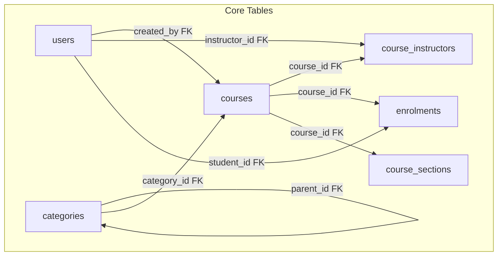
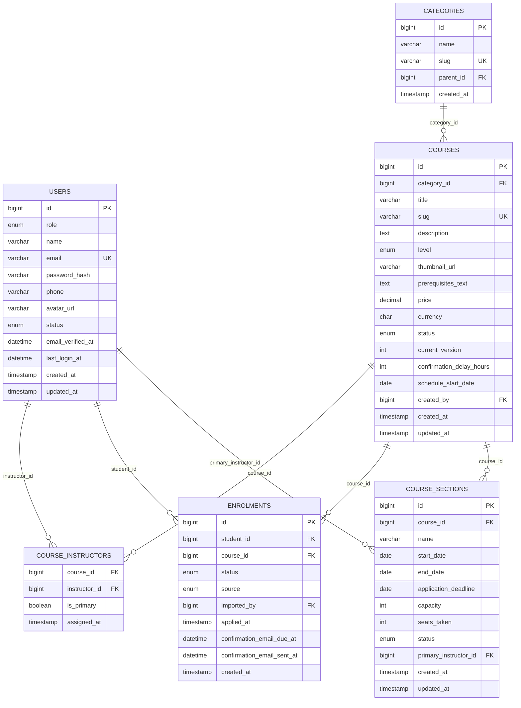
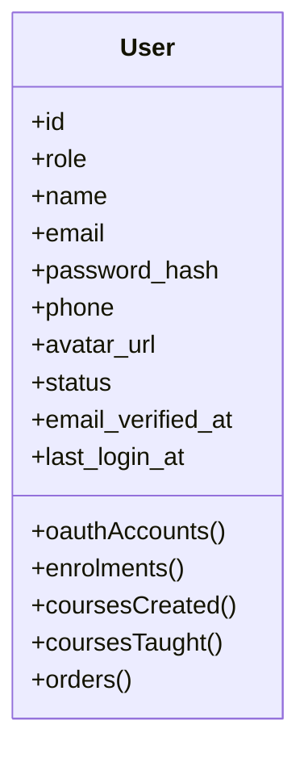
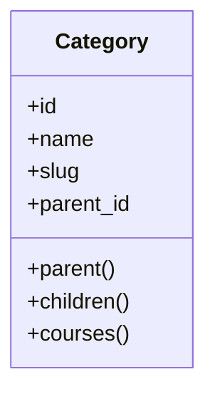
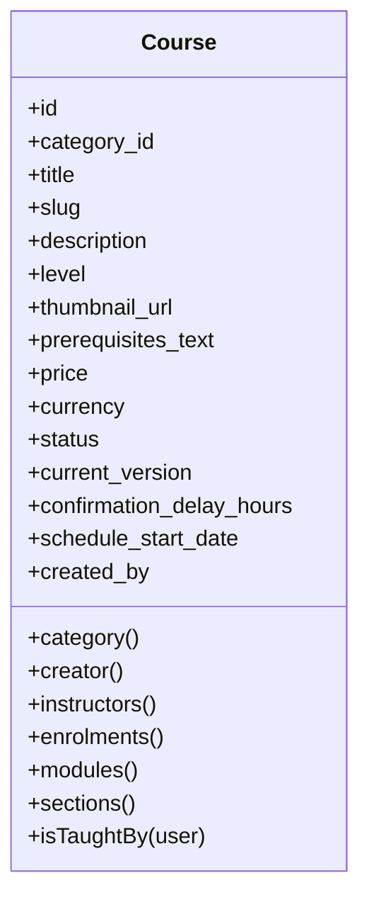
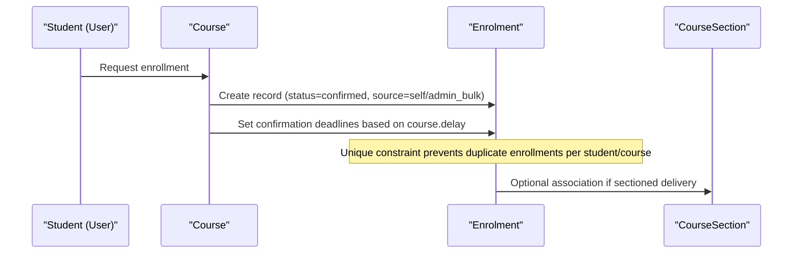
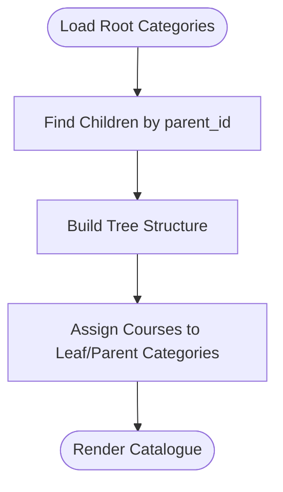
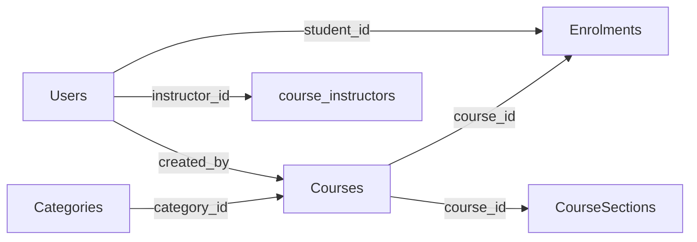

# Core Entities

<cite>
**Referenced Files in This Document**
- [0001_01_01_000000_create_users_table.php](file://database/migrations/0001_01_01_000000_create_users_table.php)
- [2024_01_01_000020_create_categories_table.php](file://database/migrations/2024_01_01_000020_create_categories_table.php)
- [2024_01_01_000030_create_courses_table.php](file://database/migrations/2024_01_01_000030_create_courses_table.php)
- [2024_01_01_000040_create_course_instructors_table.php](file://database/migrations/2024_01_01_000040_create_course_instructors_table.php)
- [2024_01_01_000060_create_enrolments_table.php](file://database/migrations/2024_01_01_000060_create_enrolments_table.php)
- [2026_07_29_010000_add_profile_fields_to_users_table.php](file://database/migrations/2026_07_29_010000_add_profile_fields_to_users_table.php)
- [2026_08_10_010000_create_course_sections_table.php](file://database/migrations/2026_08_10_010000_create_course_sections_table.php)
- [User.php](file://app/Models/User.php)
- [Category.php](file://app/Models/Category.php)
- [Course.php](file://app/Models/Course.php)
- [Enrolment.php](file://app/Models/Enrolment.php)
- [UserRole.php](file://app/Enums/UserRole.php)
- [UserStatus.php](file://app/Enums/UserStatus.php)
- [CourseLevel.php](file://app/Enums/CourseLevel.php)
- [CourseStatus.php](file://app/Enums/CourseStatus.php)
</cite>

## Table of Contents
1. Introduction
2. Project Structure
3. Core Components
4. Architecture Overview
5. Detailed Component Analysis
6. Dependency Analysis
7. Performance Considerations
8. Troubleshooting Guide
9. Conclusion

## Introduction
This document describes the foundational data model for ResNet Academy’s Learning Management System (LMS). It focuses on three core entities: Users, Courses, and Categories. It explains field definitions, data types, constraints, relationships, roles, course structures, category hierarchies, and how these entities form the backbone of the LMS. It also includes sample data structures to illustrate typical records and their relationships.

## Project Structure
The core entities are defined through database migrations and represented by Eloquent models with typed enums for controlled values. The primary tables involved are users, categories, courses, course_instructors, enrolments, and course_sections. Models define relationships that connect users to courses (as creators or instructors), courses to categories, and students to courses via enrolments.

**Diagram sources**
- [0001_01_01_000000_create_users_table.php:14-27](file://database/migrations/0001_01_01_000000_create_users_table.php#L14-L27)
- [2024_01_01_000020_create_categories_table.php:13-20](file://database/migrations/2024_01_01_000020_create_categories_table.php#L13-L20)
- [2024_01_01_000030_create_courses_table.php:13-32](file://database/migrations/2024_01_01_000030_create_courses_table.php#L13-L32)
- [2024_01_01_000040_create_course_instructors_table.php:13-19](file://database/migrations/2024_01_01_000040_create_course_instructors_table.php#L13-L19)
- [2024_01_01_000060_create_enrolments_table.php:13-29](file://database/migrations/2024_01_01_000060_create_enrolments_table.php#L13-L29)
- [2026_08_10_010000_create_course_sections_table.php:18-32](file://database/migrations/2026_08_10_010000_create_course_sections_table.php#L18-L32)

**Section sources**
- [0001_01_01_000000_create_users_table.php:14-27](file://database/migrations/0001_01_01_000000_create_users_table.php#L14-L27)
- [2024_01_01_000020_create_categories_table.php:13-20](file://database/migrations/2024_01_01_000020_create_categories_table.php#L13-L20)
- [2024_01_01_000030_create_courses_table.php:13-32](file://database/migrations/2024_01_01_000030_create_courses_table.php#L13-L32)
- [2024_01_01_000040_create_course_instructors_table.php:13-19](file://database/migrations/2024_01_01_000040_create_course_instructors_table.php#L13-L19)
- [2024_01_01_000060_create_enrolments_table.php:13-29](file://database/migrations/2024_01_01_000060_create_enrolments_table.php#L13-L29)
- [2026_08_10_010000_create_course_sections_table.php:18-32](file://database/migrations/2026_08_10_010000_create_course_sections_table.php#L18-L32)

## Core Components
This section details each core entity’s fields, types, constraints, and relationships as implemented in migrations and models.

### Users
- Purpose: Represents system actors (students, instructors, admins) with authentication and profile data.
- Key fields:
  - id: Primary key
  - role: Enum (admin, instructor, student)
  - name: String (max length 150)
  - email: Unique string (max length 191)
  - password_hash: String (hashed storage)
  - phone: Nullable string (max length 30)
  - avatar_url: Nullable string (max length 500)
  - status: Enum (active, suspended, deactivated), default active
  - email_verified_at: Nullable timestamp
  - last_login_at: Nullable timestamp
  - timestamps: created_at, updated_at
  - Indexes: role index
- Additional profile fields added later:
  - first_name, last_name, bio, country, city, postal_code, tax_id, social URLs (nullable)
- Model behaviors:
  - Casts role to UserRole enum and status to UserStatus enum
  - Customizes auth password column to password_hash
  - Relationships: oauthAccounts, enrolments (as student), coursesCreated (as creator), coursesTaught (many-to-many via course_instructors), orders

**Section sources**
- [0001_01_01_000000_create_users_table.php:14-27](file://database/migrations/0001_01_01_000000_create_users_table.php#L14-L27)
- [2026_07_29_010000_add_profile_fields_to_users_table.php:14-26](file://database/migrations/2026_07_29_010000_add_profile_fields_to_users_table.php#L14-L26)
- [User.php:24-55](file://app/Models/User.php#L24-L55)
- [User.php:57-99](file://app/Models/User.php#L57-L99)
- [UserRole.php:7-12](file://app/Enums/UserRole.php#L7-L12)
- [UserStatus.php:7-12](file://app/Enums/UserStatus.php#L7-L12)

### Categories
- Purpose: Organize courses into hierarchical groups.
- Key fields:
  - id: Primary key
  - name: String (max length 120)
  - slug: Unique string (max length 140)
  - parent_id: Nullable foreign key to categories (self-referencing hierarchy)
  - created_at: Timestamp with default current time
- Constraints:
  - Unique slug
  - Self-referential parent_id with null-on-delete behavior
- Model relationships:
  - parent: BelongsTo self
  - children: HasMany self
  - courses: HasMany Course

**Section sources**
- [2024_01_01_000020_create_categories_table.php:13-20](file://database/migrations/2024_01_01_000020_create_categories_table.php#L13-L20)
- [Category.php:20-39](file://app/Models/Category.php#L20-L39)

### Courses
- Purpose: Represent learning offerings with metadata, pricing, and lifecycle state.
- Key fields:
  - id: Primary key
  - category_id: Nullable foreign key to categories
  - title: String (max length 200)
  - slug: Unique string (max length 220)
  - description: Nullable text
  - level: Enum (beginner, intermediate, advanced), default beginner
  - thumbnail_url: Nullable string (max length 500)
  - prerequisites_text: Nullable text (informational only)
  - price: Decimal (precision 10, scale 2), default 0
  - currency: Char(3), default UGX
  - status: Enum (draft, published, archived), default draft
  - current_version: Unsigned integer, default 1
  - confirmation_delay_hours: Unsigned integer, default 24
  - schedule_start_date: Nullable date
  - created_by: Foreign key to users (restrict delete)
  - timestamps: created_at, updated_at
  - Indexes: status index
- Model relationships:
  - category: BelongsTo Category
  - creator: BelongsTo User (created_by)
  - instructors: Many-to-many via course_instructors
  - enrolments, orders, applications, modules, reviews, groups, sections, questionBanks, announcements, tickets: HasMany
  - Utility method: isTaughtBy(User) checks instructor relationship

**Section sources**
- [2024_01_01_000030_create_courses_table.php:13-32](file://database/migrations/2024_01_01_000030_create_courses_table.php#L13-L32)
- [Course.php:22-56](file://app/Models/Course.php#L22-L56)
- [Course.php:58-179](file://app/Models/Course.php#L58-L179)
- [CourseLevel.php:7-12](file://app/Enums/CourseLevel.php#L7-L12)
- [CourseStatus.php:7-12](file://app/Enums/CourseStatus.php#L7-L12)

### Supporting Entities
- course_instructors: Many-to-many bridge between courses and users (instructors), with pivot attributes is_primary and assigned_at; composite primary key on course_id and instructor_id.
- enrolments: Links students to courses with status and source tracking, unique constraint per student-course pair, indexes for performance.
- course_sections: Scheduled runs of a course with capacity management, dates, status, and primary instructor.

**Section sources**
- [2024_01_01_000040_create_course_instructors_table.php:13-19](file://database/migrations/2024_01_01_000040_create_course_instructors_table.php#L13-L19)
- [2024_01_01_000060_create_enrolments_table.php:13-29](file://database/migrations/2024_01_01_000060_create_enrolments_table.php#L13-L29)
- [2026_08_10_010000_create_course_sections_table.php:18-32](file://database/migrations/2026_08_10_010000_create_course_sections_table.php#L18-L32)
- [Enrolment.php:22-74](file://app/Models/Enrolment.php#L22-L74)

## Architecture Overview
The core data architecture centers around Users, Courses, and Categories, with supporting tables enabling enrollment, instruction assignments, and cohort-based delivery.

**Diagram sources**
- [0001_01_01_000000_create_users_table.php:14-27](file://database/migrations/0001_01_01_000000_create_users_table.php#L14-L27)
- [2024_01_01_000020_create_categories_table.php:13-20](file://database/migrations/2024_01_01_000020_create_categories_table.php#L13-L20)
- [2024_01_01_000030_create_courses_table.php:13-32](file://database/migrations/2024_01_01_000030_create_courses_table.php#L13-L32)
- [2024_01_01_000040_create_course_instructors_table.php:13-19](file://database/migrations/2024_01_01_000040_create_course_instructors_table.php#L13-L19)
- [2024_01_01_000060_create_enrolments_table.php:13-29](file://database/migrations/2024_01_01_000060_create_enrolments_table.php#L13-L29)
- [2026_08_10_010000_create_course_sections_table.php:18-32](file://database/migrations/2026_08_10_010000_create_course_sections_table.php#L18-L32)

## Detailed Component Analysis

### Users Entity
- Role enumeration: Admin, Instructor, Student
- Status enumeration: Active, Suspended, Deactivated
- Authentication integration: Uses custom password column and queued email verification
- Relationships:
  - Enrolments as student
  - Courses created (creator)
  - Courses taught (via many-to-many)
  - Orders

**Diagram sources**
- [User.php:24-99](file://app/Models/User.php#L24-L99)
- [UserRole.php:7-12](file://app/Enums/UserRole.php#L7-L12)
- [UserStatus.php:7-12](file://app/Enums/UserStatus.php#L7-L12)

**Section sources**
- [User.php:24-99](file://app/Models/User.php#L24-L99)
- [UserRole.php:7-12](file://app/Enums/UserRole.php#L7-L12)
- [UserStatus.php:7-12](file://app/Enums/UserStatus.php#L7-L12)

### Categories Entity
- Hierarchical structure via self-referencing parent_id
- Slug uniqueness ensures stable URLs
- Relationship to courses enables catalog organization

**Diagram sources**
- [Category.php:20-39](file://app/Models/Category.php#L20-L39)
- [2024_01_01_000020_create_categories_table.php:13-20](file://database/migrations/2024_01_01_000020_create_categories_table.php#L13-L20)

**Section sources**
- [Category.php:20-39](file://app/Models/Category.php#L20-L39)
- [2024_01_01_000020_create_categories_table.php:13-20](file://database/migrations/2024_01_01_000020_create_categories_table.php#L13-L20)

### Courses Entity
- Structured metadata including level, pricing, and lifecycle status
- References to category and creator
- Many-to-many with instructors
- Extensive relationships to other LMS features (modules, evaluations, tickets, etc.)

**Diagram sources**
- [Course.php:22-179](file://app/Models/Course.php#L22-L179)
- [2024_01_01_000030_create_courses_table.php:13-32](file://database/migrations/2024_01_01_000030_create_courses_table.php#L13-L32)

**Section sources**
- [Course.php:22-179](file://app/Models/Course.php#L22-L179)
- [2024_01_01_000030_create_courses_table.php:13-32](file://database/migrations/2024_01_01_000030_create_courses_table.php#L13-L32)

### Enrolment Flow
Illustrates how a student enrolls in a course, including timing and confirmation scheduling.

**Diagram sources**
- [2024_01_01_000060_create_enrolments_table.php:13-29](file://database/migrations/2024_01_01_000060_create_enrolments_table.php#L13-L29)
- [Enrolment.php:22-74](file://app/Models/Enrolment.php#L22-L74)
- [2026_08_10_010000_create_course_sections_table.php:18-32](file://database/migrations/2026_08_10_010000_create_course_sections_table.php#L18-L32)

**Section sources**
- [2024_01_01_000060_create_enrolments_table.php:13-29](file://database/migrations/2024_01_01_000060_create_enrolments_table.php#L13-L29)
- [Enrolment.php:22-74](file://app/Models/Enrolment.php#L22-L74)

### Category Hierarchy Algorithm
Shows how categories can be organized into trees using parent_id.

[No sources needed since this diagram shows conceptual workflow, not actual code structure]

## Dependency Analysis
Key dependencies among core entities:
- Users to Courses:
  - created_by (foreign key)
  - course_instructors (many-to-many)
- Courses to Categories:
  - category_id (foreign key)
- Students to Courses:
  - enrolments (many-to-one from student to course)
- Courses to Sections:
  - course_sections (one-to-many)

**Diagram sources**
- [0001_01_01_000000_create_users_table.php:14-27](file://database/migrations/0001_01_01_000000_create_users_table.php#L14-L27)
- [2024_01_01_000030_create_courses_table.php:13-32](file://database/migrations/2024_01_01_000030_create_courses_table.php#L13-L32)
- [2024_01_01_000040_create_course_instructors_table.php:13-19](file://database/migrations/2024_01_01_000040_create_course_instructors_table.php#L13-L19)
- [2024_01_01_000060_create_enrolments_table.php:13-29](file://database/migrations/2024_01_01_000060_create_enrolments_table.php#L13-L29)
- [2026_08_10_010000_create_course_sections_table.php:18-32](file://database/migrations/2026_08_10_010000_create_course_sections_table.php#L18-L32)

**Section sources**
- [2024_01_01_000030_create_courses_table.php:13-32](file://database/migrations/2024_01_01_000030_create_courses_table.php#L13-L32)
- [2024_01_01_000040_create_course_instructors_table.php:13-19](file://database/migrations/2024_01_01_000040_create_course_instructors_table.php#L13-L19)
- [2024_01_01_000060_create_enrolments_table.php:13-29](file://database/migrations/2024_01_01_000060_create_enrolments_table.php#L13-L29)
- [2026_08_10_010000_create_course_sections_table.php:18-32](file://database/migrations/2026_08_10_010000_create_course_sections_table.php#L18-L32)

## Performance Considerations
- Indexes:
  - users.role for role-based queries
  - courses.status for filtering catalogue listings
  - enrolments.course_id for efficient student-to-course lookups
- Unique constraints:
  - users.email prevents duplicate accounts
  - categories.slug ensures stable URLs
  - courses.slug ensures unique course identifiers
  - enrolments(student_id, course_id) prevents duplicate enrollments
- Delete behaviors:
  - courses.created_by uses restrictOnDelete to preserve auditability
  - categories.parent_id uses nullOnDelete to allow orphaning when parents are removed
  - course_instructors and enrolments use cascadeOnDelete for referential cleanup

[No sources needed since this section provides general guidance]

## Troubleshooting Guide
Common issues and resolutions related to core entities:
- Duplicate user registration:
  - Cause: Attempting to create a user with an existing email
  - Resolution: Ensure email uniqueness; handle validation errors appropriately
- Duplicate enrollment:
  - Cause: Creating multiple enrolments for the same student-course pair
  - Resolution: Check unique constraint and handle conflict gracefully
- Deleting a course creator:
  - Cause: Trying to delete a user referenced by courses.created_by
  - Resolution: Use restrictOnDelete semantics; prevent deletion or reassign ownership
- Category hierarchy breaks:
  - Cause: Deleting a parent category
  - Resolution: nullOnDelete allows children to remain; update references if necessary

**Section sources**
- [0001_01_01_000000_create_users_table.php:14-27](file://database/migrations/0001_01_01_000000_create_users_table.php#L14-L27)
- [2024_01_01_000020_create_categories_table.php:13-20](file://database/migrations/2024_01_01_000020_create_categories_table.php#L13-L20)
- [2024_01_01_000030_create_courses_table.php:13-32](file://database/migrations/2024_01_01_000030_create_courses_table.php#L13-L32)
- [2024_01_01_000060_create_enrolments_table.php:13-29](file://database/migrations/2024_01_01_000060_create_enrolments_table.php#L13-L29)

## Conclusion
The Users, Courses, and Categories entities form the foundation of ResNet Academy’s LMS. Users provide identity and roles; Categories organize content; Courses encapsulate learning offerings with structured metadata and lifecycle states. Supporting tables like course_instructors, enrolments, and course_sections enable rich interactions such as teaching assignments, enrollment workflows, and cohort-based delivery. Together, these entities establish a robust, scalable data model that supports catalog browsing, enrollment management, progress tracking, and administrative oversight across the platform.