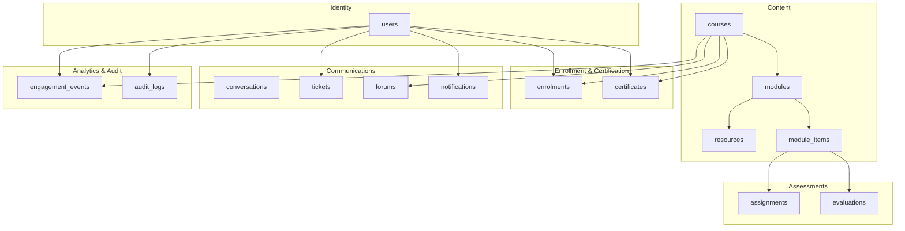
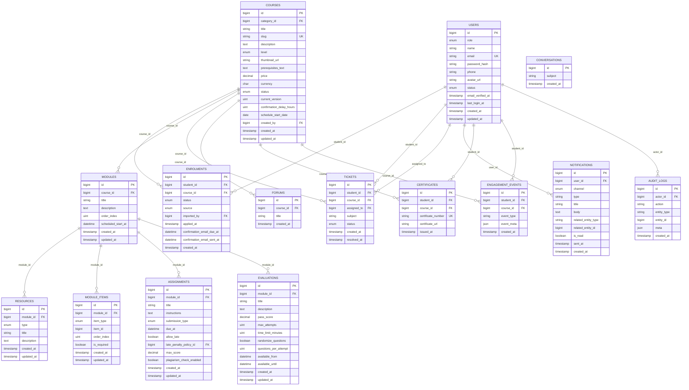
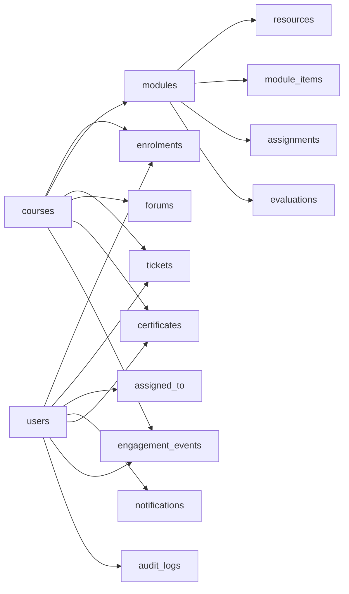

# Database Schema

<cite>
**Referenced Files in This Document**
- [0001_01_01_000000_create_users_table.php](file://database/migrations/0001_01_01_000000_create_users_table.php)
- [2024_01_01_000030_create_courses_table.php](file://database/migrations/2024_01_01_000030_create_courses_table.php)
- [2024_01_01_000100_create_modules_table.php](file://database/migrations/2024_01_01_000100_create_modules_table.php)
- [2024_01_01_000120_create_resources_table.php](file://database/migrations/2024_01_01_000120_create_resources_table.php)
- [2024_01_01_000060_create_enrolments_table.php](file://database/migrations/2024_01_01_000060_create_enrolments_table.php)
- [2024_01_01_000132_create_assignments_table.php](file://database/migrations/2024_01_01_000132_create_assignments_table.php)
- [2024_01_01_000143_create_evaluations_table.php](file://database/migrations/2024_01_01_000143_create_evaluations_table.php)
- [2024_01_01_000150_create_module_items_table.php](file://database/migrations/2024_01_01_000150_create_module_items_table.php)
- [2024_01_01_000170_create_conversations_table.php](file://database/migrations/2024_01_01_000170_create_conversations_table.php)
- [2024_01_01_000173_create_tickets_table.php](file://database/migrations/2024_01_01_000173_create_tickets_table.php)
- [2024_01_01_000176_create_forums_table.php](file://database/migrations/2024_01_01_000176_create_forums_table.php)
- [2024_01_01_000180_create_notifications_table.php](file://database/migrations/2024_01_01_000180_create_notifications_table.php)
- [2024_01_01_000160_create_certificates_table.php](file://database/migrations/2024_01_01_000160_create_certificates_table.php)
- [2024_01_01_000190_create_engagement_events_table.php](file://database/migrations/2024_01_01_000190_create_engagement_events_table.php)
- [2024_01_01_000191_create_audit_logs_table.php](file://database/migrations/2024_01_01_000191_create_audit_logs_table.php)
</cite>

## Table of Contents
1. Introduction
2. Project Structure
3. Core Components
4. Architecture Overview
5. Detailed Component Analysis
6. Dependency Analysis
7. Performance Considerations
8. Troubleshooting Guide
9. Conclusion
10. Appendices

## Introduction
This document provides comprehensive data model documentation for the ResNet Academy database schema. It details entity relationships, field definitions, and data types across major tables including users, courses, modules, resources, enrollments, assessments, and communications. It also documents primary and foreign keys, indexes, constraints, validation rules enforced at the database level, and business rules reflected by the schema. Additionally, it outlines data access patterns, caching strategies, performance considerations, and lifecycle/archival policies inferred from the schema design.

## Project Structure
The database is defined using Laravel migrations under database/migrations. Each migration creates a table with explicit columns, constraints, indexes, and comments that encode business rules. The core entities include:
- Identity and accounts: users
- Learning content: courses, modules, resources, module items
- Enrollment and progression: enrolments, certificates
- Assessments: assignments, evaluations
- Communications: conversations, tickets, forums, notifications
- Analytics and audit: engagement events, audit logs

**Diagram sources**
- [0001_01_01_000000_create_users_table.php](file://database/migrations/0001_01_01_000000_create_users_table.php)
- [2024_01_01_000030_create_courses_table.php](file://database/migrations/2024_01_01_000030_create_courses_table.php)
- [2024_01_01_000100_create_modules_table.php](file://database/migrations/2024_01_01_000100_create_modules_table.php)
- [2024_01_01_000120_create_resources_table.php](file://database/migrations/2024_01_01_000120_create_resources_table.php)
- [2024_01_01_000060_create_enrolments_table.php](file://database/migrations/2024_01_01_000060_create_enrolments_table.php)
- [2024_01_01_000132_create_assignments_table.php](file://database/migrations/2024_01_01_000132_create_assignments_table.php)
- [2024_01_01_000143_create_evaluations_table.php](file://database/migrations/2024_01_01_000143_create_evaluations_table.php)
- [2024_01_01_000150_create_module_items_table.php](file://database/migrations/2024_01_01_000150_create_module_items_table.php)
- [2024_01_01_000170_create_conversations_table.php](file://database/migrations/2024_01_01_000170_create_conversations_table.php)
- [2024_01_01_000173_create_tickets_table.php](file://database/migrations/2024_01_01_000173_create_tickets_table.php)
- [2024_01_01_000176_create_forums_table.php](file://database/migrations/2024_01_01_000176_create_forums_table.php)
- [2024_01_01_000180_create_notifications_table.php](file://database/migrations/2024_01_01_000180_create_notifications_table.php)
- [2024_01_01_000160_create_certificates_table.php](file://database/migrations/2024_01_01_000160_create_certificates_table.php)
- [2024_01_01_000190_create_engagement_events_table.php](file://database/migrations/2024_01_01_000190_create_engagement_events_table.php)
- [2024_01_01_000191_create_audit_logs_table.php](file://database/migrations/2024_01_01_000191_create_audit_logs_table.php)

**Section sources**
- [0001_01_01_000000_create_users_table.php](file://database/migrations/0001_01_01_000000_create_users_table.php)
- [2024_01_01_000030_create_courses_table.php](file://database/migrations/2024_01_01_000030_create_courses_table.php)
- [2024_01_01_000100_create_modules_table.php](file://database/migrations/2024_01_01_000100_create_modules_table.php)
- [2024_01_01_000120_create_resources_table.php](file://database/migrations/2024_01_01_000120_create_resources_table.php)
- [2024_01_01_000060_create_enrolments_table.php](file://database/migrations/2024_01_01_000060_create_enrolments_table.php)
- [2024_01_01_000132_create_assignments_table.php](file://database/migrations/2024_01_01_000132_create_assignments_table.php)
- [2024_01_01_000143_create_evaluations_table.php](file://database/migrations/2024_01_01_000143_create_evaluations_table.php)
- [2024_01_01_000150_create_module_items_table.php](file://database/migrations/2024_01_01_000150_create_module_items_table.php)
- [2024_01_01_000170_create_conversations_table.php](file://database/migrations/2024_01_01_000170_create_conversations_table.php)
- [2024_01_01_000173_create_tickets_table.php](file://database/migrations/2024_01_01_000173_create_tickets_table.php)
- [2024_01_01_000176_create_forums_table.php](file://database/migrations/2024_01_01_000176_create_forums_table.php)
- [2024_01_01_000180_create_notifications_table.php](file://database/migrations/2024_01_01_000180_create_notifications_table.php)
- [2024_01_01_000160_create_certificates_table.php](file://database/migrations/2024_01_01_000160_create_certificates_table.php)
- [2024_01_01_000190_create_engagement_events_table.php](file://database/migrations/2024_01_01_000190_create_engagement_events_table.php)
- [2024_01_01_000191_create_audit_logs_table.php](file://database/migrations/2024_01_01_000191_create_audit_logs_table.php)

## Core Components
This section summarizes each major table’s purpose, key fields, constraints, and indexes as defined by migrations.

- users
  - Purpose: Central identity for students, instructors, and admins.
  - Key fields: id (PK), role (enum), name, email (unique), password_hash, phone, avatar_url, status (enum), email_verified_at, last_login_at, timestamps.
  - Indexes: unique on email; index on role.
  - Constraints: enum values enforce allowed roles and statuses.

- courses
  - Purpose: Catalog entries for learning offerings.
  - Key fields: id (PK), category_id (FK nullable), title, slug (unique), description, level (enum), thumbnail_url, prerequisites_text (informational), price (decimal), currency (char(3)), status (enum), current_version, confirmation_delay_hours, schedule_start_date, created_by (FK to users), timestamps.
  - Indexes: unique on slug; index on status.
  - Constraints: FK to categories and users; enums constrain level/status.

- modules
  - Purpose: Ordered sections within a course.
  - Key fields: id (PK), course_id (FK to courses), title, description, order_index, scheduled_start_at, timestamps.
  - Indexes: composite index on (course_id, order_index).
  - Constraints: cascade delete on course removal.

- resources
  - Purpose: Content items attached to modules.
  - Key fields: id (PK), module_id (FK to modules), type (enum), title, description, timestamps.
  - Constraints: enum restricts resource types; cascade delete on module removal.

- module_items
  - Purpose: Sequences resources, assignments, or evaluations within a module.
  - Key fields: id (PK), module_id (FK to modules), item_type (enum: resource|assignment|evaluation), item_id (unsigned bigint), order_index, is_required (boolean), timestamps.
  - Indexes: composite index on (module_id, order_index); unique constraint on (item_type, item_id).
  - Constraints: enforces one-to-one mapping per item_type/item_id.

- enrolments
  - Purpose: Links students to courses with enrollment state.
  - Key fields: id (PK), student_id (FK to users), course_id (FK to courses), status (enum), source (enum), imported_by (nullable FK to users), applied_at, confirmation_email_due_at, confirmation_email_sent_at, created_at.
  - Indexes: unique on (student_id, course_id); index on course_id.
  - Constraints: cascade deletes on user/course removal.

- assignments
  - Purpose: Assignable tasks within modules.
  - Key fields: id (PK), module_id (FK to modules), title, instructions, submission_type (enum), due_at, allow_late, late_penalty_policy_id (nullable FK), max_score (decimal), plagiarism_check_enabled (boolean), timestamps.
  - Constraints: cascade delete on module removal.

- evaluations
  - Purpose: Quizzes/tests associated with modules.
  - Key fields: id (PK), module_id (FK to modules), title, description, pass_score (decimal), max_attempts (nullable unsigned int), time_limit_minutes (nullable unsigned int), randomize_questions (boolean), questions_per_attempt (nullable unsigned int), available_from (datetime), available_until (datetime), timestamps.
  - Constraints: cascade delete on module removal.

- conversations
  - Purpose: General conversation containers.
  - Key fields: id (PK), subject (nullable string), created_at.

- tickets
  - Purpose: Support requests raised by students.
  - Key fields: id (PK), student_id (FK to users), course_id (nullable FK to courses), assigned_to (nullable FK to users), subject, status (enum), created_at, resolved_at.
  - Constraints: cascade null/restrict behavior per FK definitions.

- forums
  - Purpose: Course-specific discussion areas.
  - Key fields: id (PK), course_id (FK to courses), title (default “General Discussion”), created_at.
  - Constraints: cascade delete on course removal.

- notifications
  - Purpose: User-targeted messages across channels.
  - Key fields: id (PK), user_id (FK to users), channel (enum), type (string), title, body (text), related_entity_type (string), related_entity_id (unsigned bigint), is_read (boolean), sent_at (timestamp), created_at.
  - Indexes: composite index on (user_id, is_read).
  - Constraints: cascade delete on user removal.

- certificates
  - Purpose: Proof of completion per course.
  - Key fields: id (PK), student_id (FK to users), course_id (FK to courses), certificate_number (unique), certificate_url (nullable string), issued_at (timestamp).
  - Indexes: unique on certificate_number; unique on (student_id, course_id).
  - Constraints: cascade delete on user/course removal.

- engagement_events
  - Purpose: Event log for analytics.
  - Key fields: id (PK), student_id (FK to users), course_id (FK to courses), event_type (string), event_meta (json), created_at.
  - Indexes: composite index on (course_id, event_type); index on student_id.
  - Constraints: cascade delete on user/course removal.

- audit_logs
  - Purpose: Immutable audit trail.
  - Key fields: id (PK), actor_id (nullable FK to users), action (string), entity_type (string), entity_id (unsigned bigint), meta (json), created_at.
  - Indexes: composite index on (entity_type, entity_id).
  - Constraints: null-on-delete for actor_id.

**Section sources**
- [0001_01_01_000000_create_users_table.php](file://database/migrations/0001_01_01_000000_create_users_table.php)
- [2024_01_01_000030_create_courses_table.php](file://database/migrations/2024_01_01_000030_create_courses_table.php)
- [2024_01_01_000100_create_modules_table.php](file://database/migrations/2024_01_01_000100_create_modules_table.php)
- [2024_01_01_000120_create_resources_table.php](file://database/migrations/2024_01_01_000120_create_resources_table.php)
- [2024_01_01_000060_create_enrolments_table.php](file://database/migrations/2024_01_01_000060_create_enrolments_table.php)
- [2024_01_01_000132_create_assignments_table.php](file://database/migrations/2024_01_01_000132_create_assignments_table.php)
- [2024_01_01_000143_create_evaluations_table.php](file://database/migrations/2024_01_01_000143_create_evaluations_table.php)
- [2024_01_01_000150_create_module_items_table.php](file://database/migrations/2024_01_01_000150_create_module_items_table.php)
- [2024_01_01_000170_create_conversations_table.php](file://database/migrations/2024_01_01_000170_create_conversations_table.php)
- [2024_01_01_000173_create_tickets_table.php](file://database/migrations/2024_01_01_000173_create_tickets_table.php)
- [2024_01_01_000176_create_forums_table.php](file://database/migrations/2024_01_01_000176_create_forums_table.php)
- [2024_01_01_000180_create_notifications_table.php](file://database/migrations/2024_01_01_000180_create_notifications_table.php)
- [2024_01_01_000160_create_certificates_table.php](file://database/migrations/2024_01_01_000160_create_certificates_table.php)
- [2024_01_01_000190_create_engagement_events_table.php](file://database/migrations/2024_01_01_000190_create_engagement_events_table.php)
- [2024_01_01_000191_create_audit_logs_table.php](file://database/migrations/2024_01_01_000191_create_audit_logs_table.php)

## Architecture Overview
The schema centers around users and courses. Modules organize content and assessments. Resources represent media/content pieces. Enrollments bind users to courses. Notifications, tickets, and forums provide communication channels. Certificates record completions. Engagement events and audit logs capture activity and changes.

**Diagram sources**
- [0001_01_01_000000_create_users_table.php](file://database/migrations/0001_01_01_000000_create_users_table.php)
- [2024_01_01_000030_create_courses_table.php](file://database/migrations/2024_01_01_000030_create_courses_table.php)
- [2024_01_01_000100_create_modules_table.php](file://database/migrations/2024_01_01_000100_create_modules_table.php)
- [2024_01_01_000120_create_resources_table.php](file://database/migrations/2024_01_01_000120_create_resources_table.php)
- [2024_01_01_000060_create_enrolments_table.php](file://database/migrations/2024_01_01_000060_create_enrolments_table.php)
- [2024_01_01_000132_create_assignments_table.php](file://database/migrations/2024_01_01_000132_create_assignments_table.php)
- [2024_01_01_000143_create_evaluations_table.php](file://database/migrations/2024_01_01_000143_create_evaluations_table.php)
- [2024_01_01_000150_create_module_items_table.php](file://database/migrations/2024_01_01_000150_create_module_items_table.php)
- [2024_01_01_000170_create_conversations_table.php](file://database/migrations/2024_01_01_000170_create_conversations_table.php)
- [2024_01_01_000173_create_tickets_table.php](file://database/migrations/2024_01_01_000173_create_tickets_table.php)
- [2024_01_01_000176_create_forums_table.php](file://database/migrations/2024_01_01_000176_create_forums_table.php)
- [2024_01_01_000180_create_notifications_table.php](file://database/migrations/2024_01_01_000180_create_notifications_table.php)
- [2024_01_01_000160_create_certificates_table.php](file://database/migrations/2024_01_01_000160_create_certificates_table.php)
- [2024_01_01_000190_create_engagement_events_table.php](file://database/migrations/2024_01_01_000190_create_engagement_events_table.php)
- [2024_01_01_000191_create_audit_logs_table.php](file://database/migrations/2024_01_01_000191_create_audit_logs_table.php)

## Detailed Component Analysis

### Users and Accounts
- Primary key: users.id
- Unique constraint: users.email
- Role and status are constrained via enums to ensure valid identities.
- Session and password reset tokens are supported by dedicated tables.

Business rules enforced at DB level:
- Only allowed roles and statuses can be stored.
- Email uniqueness prevents duplicate accounts.

Indexes:
- idx_users_role for role-based queries.
- uq_users_email for fast lookups and uniqueness.

**Section sources**
- [0001_01_01_000000_create_users_table.php](file://database/migrations/0001_01_01_000000_create_users_table.php)

### Courses and Categories
- Primary key: courses.id
- Unique constraint: courses.slug
- Status constrained to draft/published/archived.
- Price and currency support monetary values.
- Created-by links to users for ownership.

Indexes:
- idx_courses_status for filtering by status.
- uq_courses_slug for routing and lookup.

Constraints:
- FK to categories (nullable) and users (created_by) with appropriate delete behaviors.

**Section sources**
- [2024_01_01_000030_create_courses_table.php](file://database/migrations/2024_01_01_000030_create_courses_table.php)

### Modules and Module Items
- Modules belong to courses and define ordered learning steps.
- Module items sequence resources, assignments, or evaluations within a module.

Key constraints and indexes:
- Composite index on (course_id, order_index) for efficient sequencing.
- Unique constraint on (item_type, item_id) ensures single inclusion per type.
- Cascade deletes propagate when modules/courses are removed.

Business rules:
- order_index defines sequential unlocking logic.
- is_required flags whether an item blocks module completion.

**Section sources**
- [2024_01_01_000100_create_modules_table.php](file://database/migrations/2024_01_01_000100_create_modules_table.php)
- [2024_01_01_000150_create_module_items_table.php](file://database/migrations/2024_01_01_000150_create_module_items_table.php)

### Resources
- Resources attach to modules and are typed (video, document, reading, external_link, scorm, live_session, downloadable_file).
- Cascade delete ensures cleanup when modules are removed.

Indexes:
- No additional indexes beyond PK; typical queries filter by module_id.

**Section sources**
- [2024_01_01_000120_create_resources_table.php](file://database/migrations/2024_01_01_000120_create_resources_table.php)

### Enrollments
- Enrollments link students to courses with state tracking.
- Unique constraint on (student_id, course_id) prevents duplicate enrollments.
- Source indicates self vs admin bulk import.
- Confirmation scheduling fields support automated reminders.

Indexes:
- idx_enrolments_course for course-centric queries.
- uq_enrolment_student_course for uniqueness.

Constraints:
- Cascade deletes on user/course removal.

**Section sources**
- [2024_01_01_000060_create_enrolments_table.php](file://database/migrations/2024_01_01_000060_create_enrolments_table.php)

### Assessments: Assignments and Evaluations
- Assignments: tied to modules with submission settings, deadlines, scoring, and optional plagiarism checks.
- Evaluations: quiz/test configuration including pass score, attempts, time limits, availability windows, and question selection.

Constraints:
- Cascade deletes on module removal.
- Enums and numeric fields enforce valid assessment parameters.

**Section sources**
- [2024_01_01_000132_create_assignments_table.php](file://database/migrations/2024_01_01_000132_create_assignments_table.php)
- [2024_01_01_000143_create_evaluations_table.php](file://database/migrations/2024_01_01_000143_create_evaluations_table.php)

### Communications: Conversations, Tickets, Forums, Notifications
- Conversations: lightweight containers with optional subjects.
- Tickets: support requests linked to students and optionally courses; assignable to users; status tracked.
- Forums: per-course discussion spaces.
- Notifications: multi-channel messages with read status and optional references to related entities.

Indexes:
- idx_notifications_user(user_id, is_read) optimizes unread retrieval.

Constraints:
- Cascade deletes where applicable; nullable FKs allow flexible linking.

**Section sources**
- [2024_01_01_000170_create_conversations_table.php](file://database/migrations/2024_01_01_000170_create_conversations_table.php)
- [2024_01_01_000173_create_tickets_table.php](file://database/migrations/2024_01_01_000173_create_tickets_table.php)
- [2024_01_01_000176_create_forums_table.php](file://database/migrations/2024_01_01_000176_create_forums_table.php)
- [2024_01_01_000180_create_notifications_table.php](file://database/migrations/2024_01_01_000180_create_notifications_table.php)

### Certificates
- Records issuance per student and course.
- Unique certificate numbers and one certificate per student-course pair.

Constraints:
- Cascade deletes on user/course removal.

**Section sources**
- [2024_01_01_000160_create_certificates_table.php](file://database/migrations/2024_01_01_000160_create_certificates_table.php)

### Analytics and Audit
- Engagement events: high-volume event logging with JSON metadata; indexed for course-level analytics and student tracking.
- Audit logs: immutable records of actions with actor, target entity, and metadata; indexed for entity-centric audits.

Indexes:
- idx_engagement_course(course_id, event_type)
- idx_engagement_student(student_id)
- idx_audit_entity(entity_type, entity_id)

**Section sources**
- [2024_01_01_000190_create_engagement_events_table.php](file://database/migrations/2024_01_01_000190_create_engagement_events_table.php)
- [2024_01_01_000191_create_audit_logs_table.php](file://database/migrations/2024_01_01_000191_create_audit_logs_table.php)

## Dependency Analysis
The following diagram highlights direct dependencies between core tables based on foreign keys.

**Diagram sources**
- [2024_01_01_000060_create_enrolments_table.php](file://database/migrations/2024_01_01_000060_create_enrolments_table.php)
- [2024_01_01_000100_create_modules_table.php](file://database/migrations/2024_01_01_000100_create_modules_table.php)
- [2024_01_01_000120_create_resources_table.php](file://database/migrations/2024_01_01_000120_create_resources_table.php)
- [2024_01_01_000132_create_assignments_table.php](file://database/migrations/2024_01_01_000132_create_assignments_table.php)
- [2024_01_01_000143_create_evaluations_table.php](file://database/migrations/2024_01_01_000143_create_evaluations_table.php)
- [2024_01_01_000150_create_module_items_table.php](file://database/migrations/2024_01_01_000150_create_module_items_table.php)
- [2024_01_01_000173_create_tickets_table.php](file://database/migrations/2024_01_01_000173_create_tickets_table.php)
- [2024_01_01_000176_create_forums_table.php](file://database/migrations/2024_01_01_000176_create_forums_table.php)
- [2024_01_01_000180_create_notifications_table.php](file://database/migrations/2024_01_01_000180_create_notifications_table.php)
- [2024_01_01_000160_create_certificates_table.php](file://database/migrations/2024_01_01_000160_create_certificates_table.php)
- [2024_01_01_000190_create_engagement_events_table.php](file://database/migrations/2024_01_01_000190_create_engagement_events_table.php)
- [2024_01_01_000191_create_audit_logs_table.php](file://database/migrations/2024_01_01_000191_create_audit_logs_table.php)

**Section sources**
- [2024_01_01_000060_create_enrolments_table.php](file://database/migrations/2024_01_01_000060_create_enrolments_table.php)
- [2024_01_01_000100_create_modules_table.php](file://database/migrations/2024_01_01_000100_create_modules_table.php)
- [2024_01_01_000120_create_resources_table.php](file://database/migrations/2024_01_01_000120_create_resources_table.php)
- [2024_01_01_000132_create_assignments_table.php](file://database/migrations/2024_01_01_000132_create_assignments_table.php)
- [2024_01_01_000143_create_evaluations_table.php](file://database/migrations/2024_01_01_000143_create_evaluations_table.php)
- [2024_01_01_000150_create_module_items_table.php](file://database/migrations/2024_01_01_000150_create_module_items_table.php)
- [2024_01_01_000173_create_tickets_table.php](file://database/migrations/2024_01_01_000173_create_tickets_table.php)
- [2024_01_01_000176_create_forums_table.php](file://database/migrations/2024_01_01_000176_create_forums_table.php)
- [2024_01_01_000180_create_notifications_table.php](file://database/migrations/2024_01_01_000180_create_notifications_table.php)
- [2024_01_01_000160_create_certificates_table.php](file://database/migrations/2024_01_01_000160_create_certificates_table.php)
- [2024_01_01_000190_create_engagement_events_table.php](file://database/migrations/2024_01_01_000190_create_engagement_events_table.php)
- [2024_01_01_000191_create_audit_logs_table.php](file://database/migrations/2024_01_01_000191_create_audit_logs_table.php)

## Performance Considerations
- Indexing strategy:
  - Frequent filters: users.role, courses.status, notifications(user_id, is_read), engagement_events(course_id, event_type), engagement_events(student_id), audit_logs(entity_type, entity_id).
  - Ordering: modules(course_id, order_index) supports sequential rendering and locking.
  - Uniqueness: users.email, courses.slug, enrolments(student_id, course_id), certificates(certificate_number), certificates(student_id, course_id), module_items(item_type, item_id).
- Denormalization trade-offs:
  - engagement_events and audit_logs use JSON for flexible metadata; consider partitioning or archival if volumes grow large.
- Delete cascades:
  - Many-to-one relationships use cascadeOnDelete; ensure application-level safeguards to avoid accidental mass deletions.
- Query patterns:
  - Use indexes for course-centric analytics and user-centric notifications.
  - Avoid full-table scans on high-volume tables like engagement_events and audit_logs by leveraging existing indexes.

[No sources needed since this section provides general guidance]

## Troubleshooting Guide
Common issues and how the schema helps detect them:
- Duplicate enrollments: prevented by unique constraint on (student_id, course_id).
- Invalid roles/statuses: enforced by enum constraints on users.
- Orphaned records: cascade deletes maintain referential integrity; verify application logic before deleting parents.
- Notification delivery: use is_read flag and user_id index to efficiently query unread notifications.
- Auditability: rely on audit_logs to trace changes; use entity_type/entity_id index to retrieve history for specific entities.

**Section sources**
- [2024_01_01_000060_create_enrolments_table.php](file://database/migrations/2024_01_01_000060_create_enrolments_table.php)
- [0001_01_01_000000_create_users_table.php](file://database/migrations/0001_01_01_000000_create_users_table.php)
- [2024_01_01_000180_create_notifications_table.php](file://database/migrations/2024_01_01_000180_create_notifications_table.php)
- [2024_01_01_000191_create_audit_logs_table.php](file://database/migrations/2024_01_01_000191_create_audit_logs_table.php)

## Conclusion
The ResNet Academy database schema is structured around clear entity boundaries and strong constraints. Enums and unique indexes enforce critical business rules such as role validity, enrollment uniqueness, and certificate numbering. Indexes are strategically placed to optimize common queries for analytics, notifications, and module sequencing. The schema supports robust communication, assessment, and certification workflows while maintaining auditability through dedicated logs.

[No sources needed since this section summarizes without analyzing specific files]

## Appendices

### Data Validation Rules and Business Rules Enforced at Database Level
- Enum constraints:
  - users.role, users.status
  - courses.level, courses.status
  - resources.type
  - module_items.item_type
  - enrolments.status, enrolments.source
  - assignments.submission_type
  - tickets.status
  - notifications.channel
- Unique constraints:
  - users.email
  - courses.slug
  - enrolments(student_id, course_id)
  - certificates(certificate_number)
  - certificates(student_id, course_id)
  - module_items(item_type, item_id)
- Referential integrity:
  - Foreign keys with cascade or restrict/null-on-delete behaviors ensure consistency across related entities.
- Defaults and computed fields:
  - Timestamps and default values (e.g., status defaults, currency) reduce application burden.

**Section sources**
- [0001_01_01_000000_create_users_table.php](file://database/migrations/0001_01_01_000000_create_users_table.php)
- [2024_01_01_000030_create_courses_table.php](file://database/migrations/2024_01_01_000030_create_courses_table.php)
- [2024_01_01_000120_create_resources_table.php](file://database/migrations/2024_01_01_000120_create_resources_table.php)
- [2024_01_01_000150_create_module_items_table.php](file://database/migrations/2024_01_01_000150_create_module_items_table.php)
- [2024_01_01_000060_create_enrolments_table.php](file://database/migrations/2024_01_01_000060_create_enrolments_table.php)
- [2024_01_01_000132_create_assignments_table.php](file://database/migrations/2024_01_01_000132_create_assignments_table.php)
- [2024_01_01_000173_create_tickets_table.php](file://database/migrations/2024_01_01_000173_create_tickets_table.php)
- [2024_01_01_000180_create_notifications_table.php](file://database/migrations/2024_01_01_000180_create_notifications_table.php)
- [2024_01_01_000160_create_certificates_table.php](file://database/migrations/2024_01_01_000160_create_certificates_table.php)

### Data Access Patterns
- Read-heavy analytics:
  - engagement_events filtered by course_id and event_type; leverage composite index.
- User-centric operations:
  - notifications queried by user_id with is_read filter; leverage composite index.
- Course/module navigation:
  - modules ordered by course_id and order_index; leverage composite index.
- Audit retrieval:
  - audit_logs filtered by entity_type and entity_id; leverage composite index.

**Section sources**
- [2024_01_01_000190_create_engagement_events_table.php](file://database/migrations/2024_01_01_000190_create_engagement_events_table.php)
- [2024_01_01_000180_create_notifications_table.php](file://database/migrations/2024_01_01_000180_create_notifications_table.php)
- [2024_01_01_000100_create_modules_table.php](file://database/migrations/2024_01_01_000100_create_modules_table.php)
- [2024_01_01_000191_create_audit_logs_table.php](file://database/migrations/2024_01_01_000191_create_audit_logs_table.php)

### Caching Strategies
- Cache frequently accessed course catalogs and module sequences keyed by course_id and order_index.
- Cache user notification counts and unread lists keyed by user_id.
- Cache analytics aggregates derived from engagement_events by course_id and time windows.
- Invalidate caches on write operations that affect referenced entities (e.g., module updates, enrollment changes).

[No sources needed since this section provides general guidance]

### Data Lifecycle, Retention Policies, and Archival Rules
- High-volume tables:
  - engagement_events and audit_logs should be archived periodically based on retention policies; consider partitioning by created_at.
- Soft deletion:
  - Some entities may adopt soft deletes at the application layer; schema currently relies on hard deletes via cascade for certain relationships.
- Certificate retention:
  - certificates are long-lived records; ensure backups and immutability.
- Notifications:
  - Mark as read and archive old notifications based on policy; leverage is_read and created_at for cleanup.

[No sources needed since this section provides general guidance]