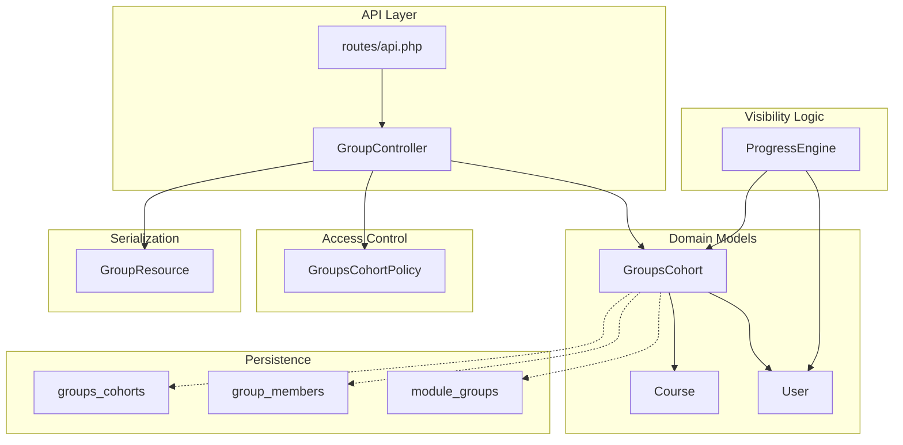
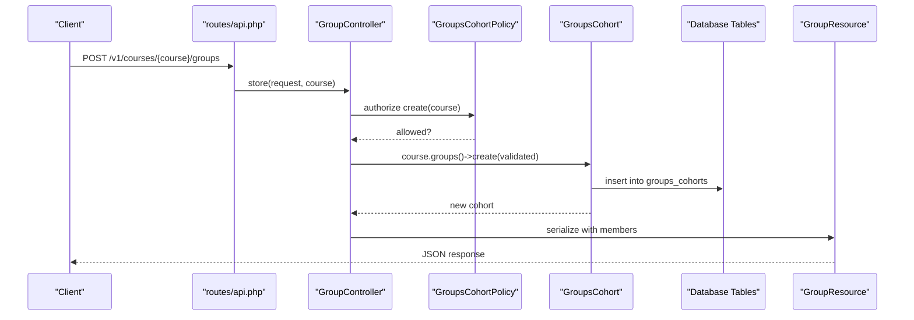
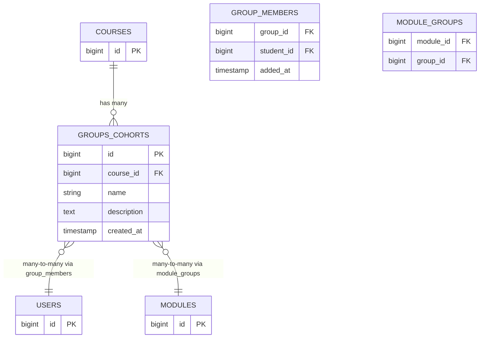
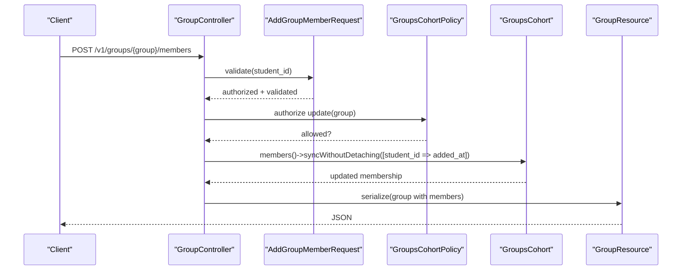
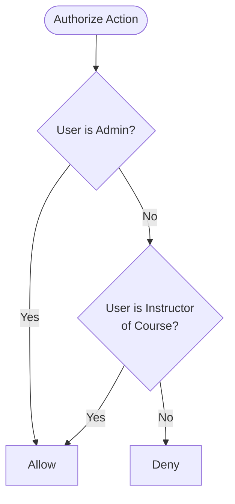
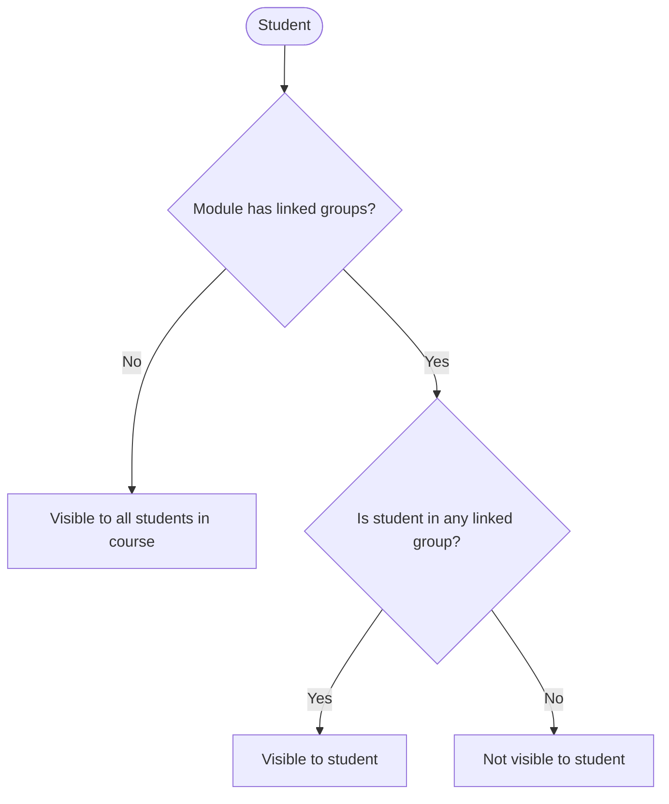
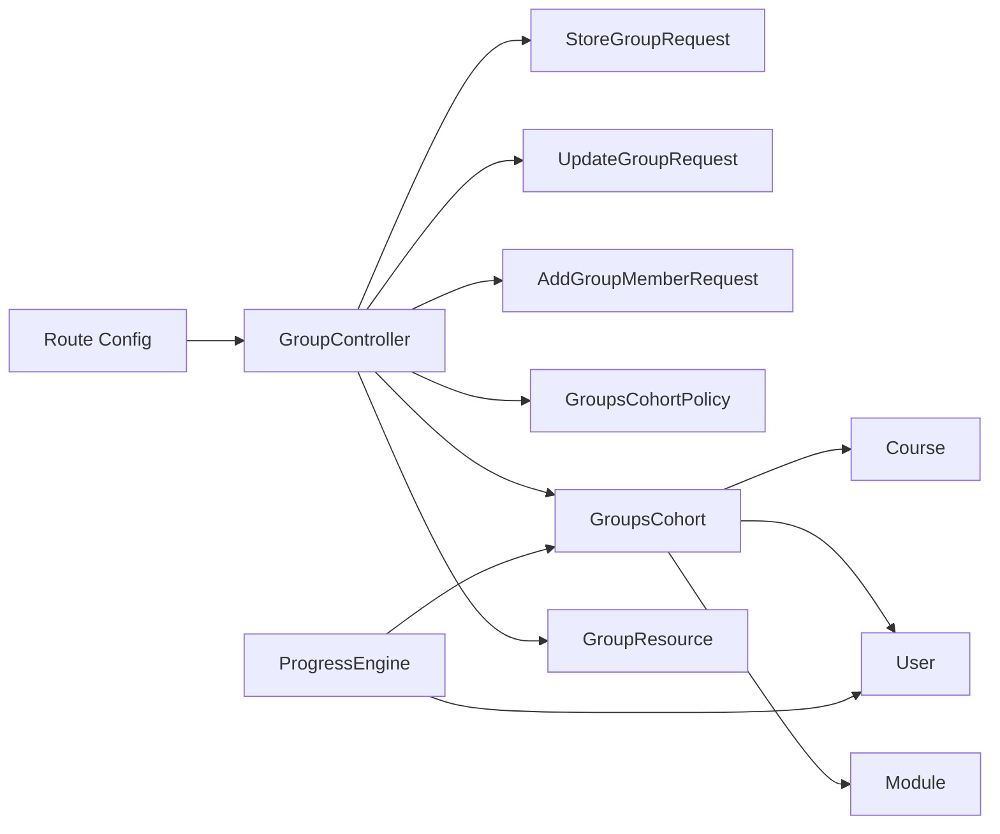

# Cohort & Group Management

<cite>
**Referenced Files in This Document**
- [GroupsCohort.php](file://app/Models/GroupsCohort.php)
- [Course.php](file://app/Models/Course.php)
- [User.php](file://app/Models/User.php)
- [GroupsCohortPolicy.php](file://app/Policies/GroupsCohortPolicy.php)
- [GroupController.php](file://app/Http/Controllers/Api/V1/GroupController.php)
- [StoreGroupRequest.php](file://app/Http/Requests/Api/V1/StoreGroupRequest.php)
- [UpdateGroupRequest.php](file://app/Http/Requests/Api/V1/UpdateGroupRequest.php)
- [AddGroupMemberRequest.php](file://app/Http/Requests/Api/V1/AddGroupMemberRequest.php)
- [GroupResource.php](file://app/Http/Resources/GroupResource.php)
- [2024_01_01_000080_create_groups_cohorts_table.php](file://database/migrations/2024_01_01_000080_create_groups_cohorts_table.php)
- [2024_01_01_000090_create_group_members_table.php](file://database/migrations/2024_01_01_000090_create_group_members_table.php)
- [2024_01_01_000110_create_module_groups_table.php](file://database/migrations/2024_01_01_000110_create_module_groups_table.php)
- [api.php](file://routes/api.php)
- [ProgressEngine.php](file://app/Services/Progress/ProgressEngine.php)
</cite>

## Table of Contents
1. Introduction
2. Project Structure
3. Core Components
4. Architecture Overview
5. Detailed Component Analysis
6. Dependency Analysis
7. Performance Considerations
8. Troubleshooting Guide
9. Conclusion

## Introduction
This document explains the data model and workflows for cohort and group management. It focuses on the GroupsCohort model, its relationships with users (students) and modules, how groups are created and managed via API endpoints, and how access control is enforced through policies. It also covers cohort-based enrollment patterns where module visibility depends on group membership.

## Project Structure
The cohort/group feature spans models, migrations, controllers, requests, resources, policies, routes, and a service that enforces module visibility rules.

**Diagram sources**
- [GroupController.php:19-61](file://app/Http/Controllers/Api/V1/GroupController.php#L19-L61)
- [GroupsCohort.php:13-51](file://app/Models/GroupsCohort.php#L13-L51)
- [Course.php:132-137](file://app/Models/Course.php#L132-L137)
- [User.php:79-93](file://app/Models/User.php#L79-L93)
- [2024_01_01_000080_create_groups_cohorts_table.php:13-19](file://database/migrations/2024_01_01_000080_create_groups_cohorts_table.php#L13-L19)
- [2024_01_01_000090_create_group_members_table.php:13-18](file://database/migrations/2024_01_01_000090_create_group_members_table.php#L13-L18)
- [2024_01_01_000110_create_module_groups_table.php:16-20](file://database/migrations/2024_01_01_000110_create_module_groups_table.php#L16-L20)
- [GroupsCohortPolicy.php:14-32](file://app/Policies/GroupsCohortPolicy.php#L14-L32)
- [GroupResource.php:15-24](file://app/Http/Resources/GroupResource.php#L15-L24)
- [api.php:132-137](file://routes/api.php#L132-L137)
- [ProgressEngine.php:102-114](file://app/Services/Progress/ProgressEngine.php#L102-L114)

**Section sources**
- [GroupController.php:19-61](file://app/Http/Controllers/Api/V1/GroupController.php#L19-L61)
- [api.php:132-137](file://routes/api.php#L132-L137)

## Core Components
- GroupsCohort: Represents a cohort/group within a course. Stores name and description, belongs to a Course, has many Students as members, and can be linked to Modules.
- Course: Owns cohorts via a one-to-many relationship; provides an instructor check used by policies.
- User: Represents students and instructors; students become members of cohorts.
- Policies: Enforce that only admins or course instructors can create/update/delete cohorts and manage members.
- Controller and Requests: Provide REST endpoints for listing, creating, updating, deleting cohorts and adding/removing members.
- Resources: Serialize cohort data including members when loaded.
- Migrations: Define tables for cohorts, group memberships, and module-group associations.
- Progress Engine: Uses group membership to determine which modules a student can see.

**Section sources**
- [GroupsCohort.php:13-51](file://app/Models/GroupsCohort.php#L13-L51)
- [Course.php:132-137](file://app/Models/Course.php#L132-L137)
- [User.php:79-93](file://app/Models/User.php#L79-L93)
- [GroupsCohortPolicy.php:14-32](file://app/Policies/GroupsCohortPolicy.php#L14-L32)
- [GroupController.php:19-61](file://app/Http/Controllers/Api/V1/GroupController.php#L19-L61)
- [StoreGroupRequest.php:12-23](file://app/Http/Requests/Api/V1/StoreGroupRequest.php#L12-L23)
- [UpdateGroupRequest.php:11-22](file://app/Http/Requests/Api/V1/UpdateGroupRequest.php#L11-L22)
- [AddGroupMemberRequest.php:12-22](file://app/Http/Requests/Api/V1/AddGroupMemberRequest.php#L12-L22)
- [GroupResource.php:15-24](file://app/Http/Resources/GroupResource.php#L15-L24)
- [2024_01_01_000080_create_groups_cohorts_table.php:13-19](file://database/migrations/2024_01_01_000080_create_groups_cohorts_table.php#L13-L19)
- [2024_01_01_000090_create_group_members_table.php:13-18](file://database/migrations/2024_01_01_000090_create_group_members_table.php#L13-L18)
- [2024_01_01_000110_create_module_groups_table.php:16-20](file://database/migrations/2024_01_01_000110_create_module_groups_table.php#L16-L20)
- [ProgressEngine.php:102-114](file://app/Services/Progress/ProgressEngine.php#L102-L114)

## Architecture Overview
The system exposes a set of REST endpoints under authenticated routes to manage cohorts and their members. Authorization is enforced via policies tied to the Course context. Data is persisted using Eloquent models backed by migrations. Module visibility for students is computed based on whether a module is assigned to any of the student’s cohorts.

**Diagram sources**
- [api.php:132-137](file://routes/api.php#L132-L137)
- [GroupController.php:24-29](file://app/Http/Controllers/Api/V1/GroupController.php#L24-L29)
- [StoreGroupRequest.php:12-23](file://app/Http/Requests/Api/V1/StoreGroupRequest.php#L12-L23)
- [GroupsCohortPolicy.php:14-17](file://app/Policies/GroupsCohortPolicy.php#L14-L17)
- [GroupsCohort.php:22-26](file://app/Models/GroupsCohort.php#L22-L26)
- [2024_01_01_000080_create_groups_cohorts_table.php:13-19](file://database/migrations/2024_01_01_000080_create_groups_cohorts_table.php#L13-L19)
- [GroupResource.php:15-24](file://app/Http/Resources/GroupResource.php#L15-L24)

## Detailed Component Analysis

### Data Model: GroupsCohort and Relationships
- GroupsCohort belongs to Course and has many Users as members via a pivot table that records when a user was added.
- GroupsCohort has a many-to-many relationship with Modules via a pivot table that scopes module visibility to specific cohorts.

**Diagram sources**
- [GroupsCohort.php:28-51](file://app/Models/GroupsCohort.php#L28-L51)
- [Course.php:132-137](file://app/Models/Course.php#L132-L137)
- [2024_01_01_000080_create_groups_cohorts_table.php:13-19](file://database/migrations/2024_01_01_000080_create_groups_cohorts_table.php#L13-L19)
- [2024_01_01_000090_create_group_members_table.php:13-18](file://database/migrations/2024_01_01_000090_create_group_members_table.php#L13-L18)
- [2024_01_01_000110_create_module_groups_table.php:16-20](file://database/migrations/2024_01_01_000110_create_module_groups_table.php#L16-L20)

**Section sources**
- [GroupsCohort.php:13-51](file://app/Models/GroupsCohort.php#L13-L51)
- [Course.php:132-137](file://app/Models/Course.php#L132-L137)
- [2024_01_01_000080_create_groups_cohorts_table.php:13-19](file://database/migrations/2024_01_01_000080_create_groups_cohorts_table.php#L13-L19)
- [2024_01_01_000090_create_group_members_table.php:13-18](file://database/migrations/2024_01_01_000090_create_group_members_table.php#L13-L18)
- [2024_01_01_000110_create_module_groups_table.php:16-20](file://database/migrations/2024_01_01_000110_create_module_groups_table.php#L16-L20)

### API Endpoints and Workflows
- List cohorts for a course: returns cohorts with members when loaded.
- Create a cohort: validates input, authorizes via policy, persists cohort, returns serialized resource.
- Update a cohort: validates and authorizes update, persists changes, returns updated resource.
- Delete a cohort: authorizes deletion, removes cohort.
- Add member to cohort: validates student exists and is a student, adds with timestamp, returns updated cohort.
- Remove member from cohort: authorizes removal, detaches member.

**Diagram sources**
- [GroupController.php:47-52](file://app/Http/Controllers/Api/V1/GroupController.php#L47-L52)
- [AddGroupMemberRequest.php:12-22](file://app/Http/Requests/Api/V1/AddGroupMemberRequest.php#L12-L22)
- [GroupsCohortPolicy.php:19-22](file://app/Policies/GroupsCohortPolicy.php#L19-L22)
- [GroupResource.php:15-24](file://app/Http/Resources/GroupResource.php#L15-L24)

**Section sources**
- [GroupController.php:19-61](file://app/Http/Controllers/Api/V1/GroupController.php#L19-L61)
- [StoreGroupRequest.php:12-23](file://app/Http/Requests/Api/V1/StoreGroupRequest.php#L12-L23)
- [UpdateGroupRequest.php:11-22](file://app/Http/Requests/Api/V1/UpdateGroupRequest.php#L11-L22)
- [AddGroupMemberRequest.php:12-22](file://app/Http/Requests/Api/V1/AddGroupMemberRequest.php#L12-L22)
- [GroupResource.php:15-24](file://app/Http/Resources/GroupResource.php#L15-L24)
- [api.php:132-137](file://routes/api.php#L132-L137)

### Access Control and Policies
- Creation requires admin or instructor of the target course.
- Update/Delete require admin or instructor of the course owning the cohort.
- The policy delegates to a shared helper that checks role and teaching assignment.

**Diagram sources**
- [GroupsCohortPolicy.php:14-32](file://app/Policies/GroupsCohortPolicy.php#L14-L32)
- [Course.php:175-178](file://app/Models/Course.php#L175-L178)

**Section sources**
- [GroupsCohortPolicy.php:14-32](file://app/Policies/GroupsCohortPolicy.php#L14-L32)
- [Course.php:175-178](file://app/Models/Course.php#L175-L178)

### Cohort-Based Enrollment and Module Visibility
- If a module has no linked groups, it applies to every student in the course.
- Otherwise, only students who belong to at least one of the module’s linked groups can see and progress through it.

**Diagram sources**
- [ProgressEngine.php:102-114](file://app/Services/Progress/ProgressEngine.php#L102-L114)
- [GroupsCohort.php:45-51](file://app/Models/GroupsCohort.php#L45-L51)

**Section sources**
- [ProgressEngine.php:102-114](file://app/Services/Progress/ProgressEngine.php#L102-L114)

### Group Administration Tasks
- Create a cohort scoped to a course.
- Update cohort metadata (name, description).
- Add students to a cohort with an audit timestamp.
- Remove students from a cohort.
- Delete a cohort (subject to policy).

These tasks are implemented by the controller methods and guarded by request authorization and validation.

**Section sources**
- [GroupController.php:24-61](file://app/Http/Controllers/Api/V1/GroupController.php#L24-L61)
- [StoreGroupRequest.php:12-23](file://app/Http/Requests/Api/V1/StoreGroupRequest.php#L12-L23)
- [UpdateGroupRequest.php:11-22](file://app/Http/Requests/Api/V1/UpdateGroupRequest.php#L11-L22)
- [AddGroupMemberRequest.php:12-22](file://app/Http/Requests/Api/V1/AddGroupMemberRequest.php#L12-L22)

## Dependency Analysis
- GroupController depends on:
  - Request classes for validation and authorization.
  - GroupsCohort model for persistence and relationships.
  - GroupsCohortPolicy for authorization.
  - GroupResource for serialization.
- GroupsCohort depends on:
  - Course (ownership).
  - User (membership).
  - Module (visibility scoping).
- ProgressEngine depends on:
  - GroupsCohort and User to compute module visibility per student.

**Diagram sources**
- [api.php:132-137](file://routes/api.php#L132-L137)
- [GroupController.php:19-61](file://app/Http/Controllers/Api/V1/GroupController.php#L19-L61)
- [StoreGroupRequest.php:12-23](file://app/Http/Requests/Api/V1/StoreGroupRequest.php#L12-L23)
- [UpdateGroupRequest.php:11-22](file://app/Http/Requests/Api/V1/UpdateGroupRequest.php#L11-L22)
- [AddGroupMemberRequest.php:12-22](file://app/Http/Requests/Api/V1/AddGroupMemberRequest.php#L12-L22)
- [GroupsCohortPolicy.php:14-32](file://app/Policies/GroupsCohortPolicy.php#L14-L32)
- [GroupsCohort.php:13-51](file://app/Models/GroupsCohort.php#L13-L51)
- [Course.php:132-137](file://app/Models/Course.php#L132-L137)
- [User.php:79-93](file://app/Models/User.php#L79-L93)
- [ProgressEngine.php:102-114](file://app/Services/Progress/ProgressEngine.php#L102-L114)

**Section sources**
- [GroupController.php:19-61](file://app/Http/Controllers/Api/V1/GroupController.php#L19-L61)
- [GroupsCohort.php:13-51](file://app/Models/GroupsCohort.php#L13-L51)
- [ProgressEngine.php:102-114](file://app/Services/Progress/ProgressEngine.php#L102-L114)

## Performance Considerations
- Use eager loading for members when listing cohorts to avoid N+1 queries.
- Prefer sync operations for adding/removing members to minimize database writes.
- Keep module-group associations minimal; large fan-out can impact visibility checks.
- Indexes on foreign keys (already defined by migrations) support efficient joins and lookups.

[No sources needed since this section provides general guidance]

## Troubleshooting Guide
- Authorization failures: Ensure the requesting user is an admin or an instructor of the course associated with the cohort.
- Validation errors: Confirm that the student_id exists and has the student role when adding members.
- Duplicate memberships: Adding an existing member uses a safe sync operation that avoids duplicates.
- Visibility issues: Verify that modules intended for a cohort are linked to that cohort; otherwise, students in the cohort will not see them.

**Section sources**
- [GroupsCohortPolicy.php:14-32](file://app/Policies/GroupsCohortPolicy.php#L14-L32)
- [AddGroupMemberRequest.php:17-22](file://app/Http/Requests/Api/V1/AddGroupMemberRequest.php#L17-L22)
- [GroupController.php:47-52](file://app/Http/Controllers/Api/V1/GroupController.php#L47-L52)
- [ProgressEngine.php:102-114](file://app/Services/Progress/ProgressEngine.php#L102-L114)

## Conclusion
The cohort and group management system centers on the GroupsCohort model, which ties courses, students, and modules together. Policies enforce strict access control based on roles and course ownership. The API provides clear endpoints to create, update, delete cohorts and manage memberships. Cohort-based module scoping enables precise control over student visibility and progression, supporting flexible cohort-driven learning experiences.