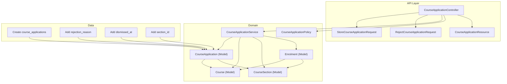
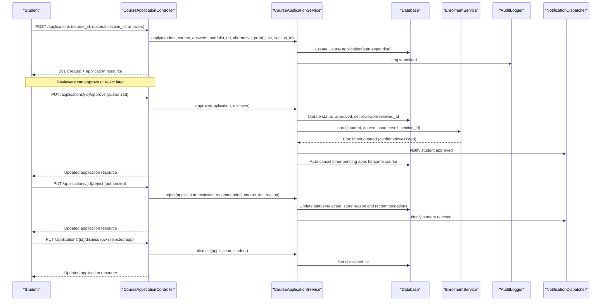
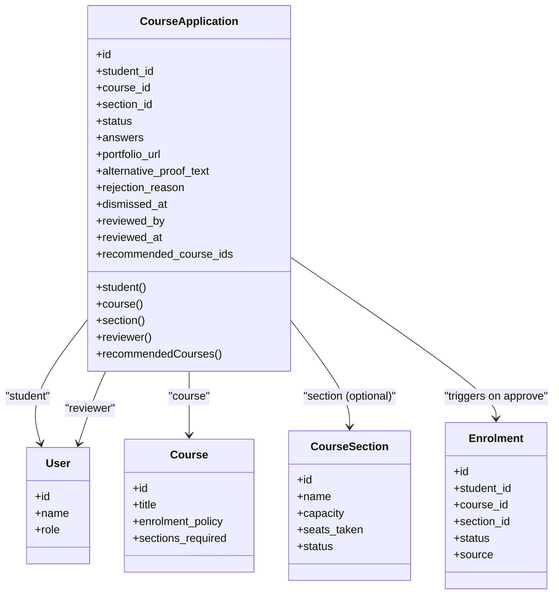
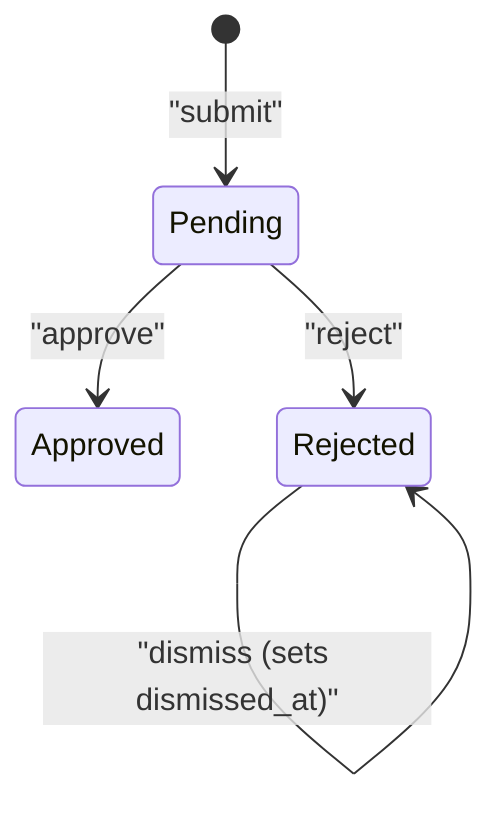
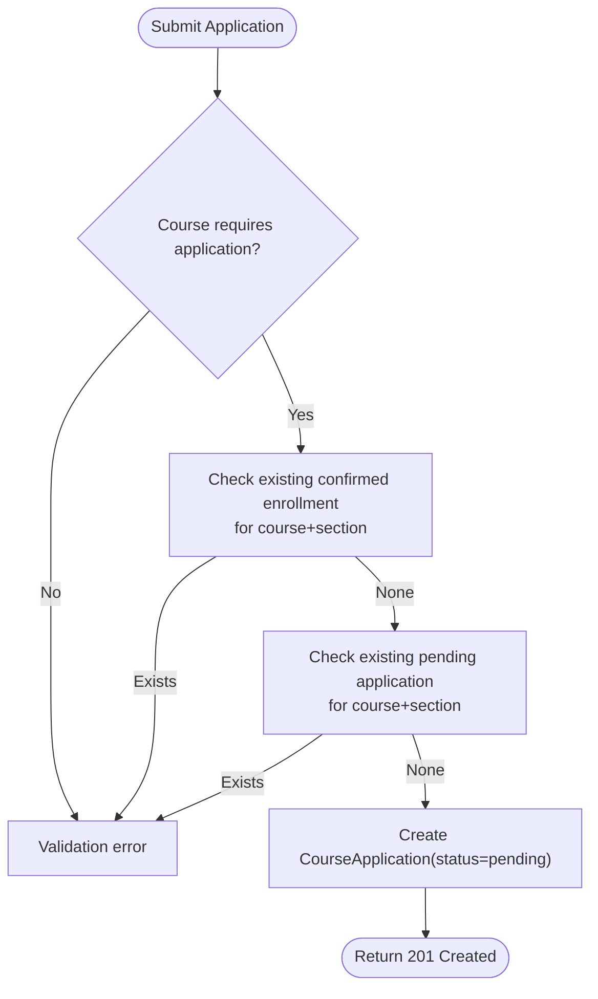
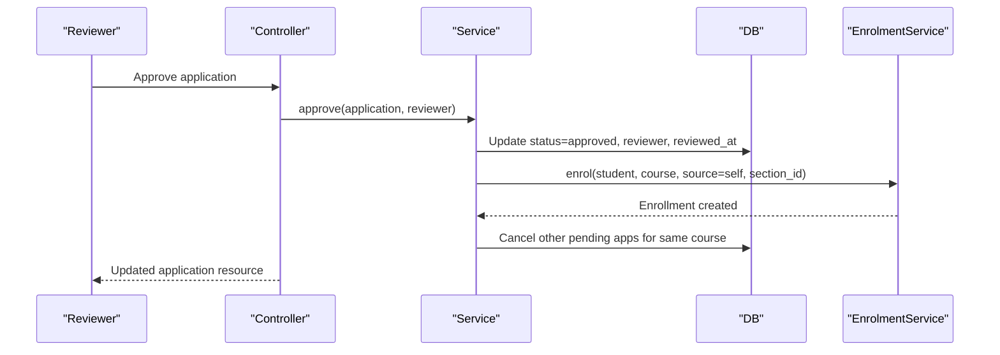
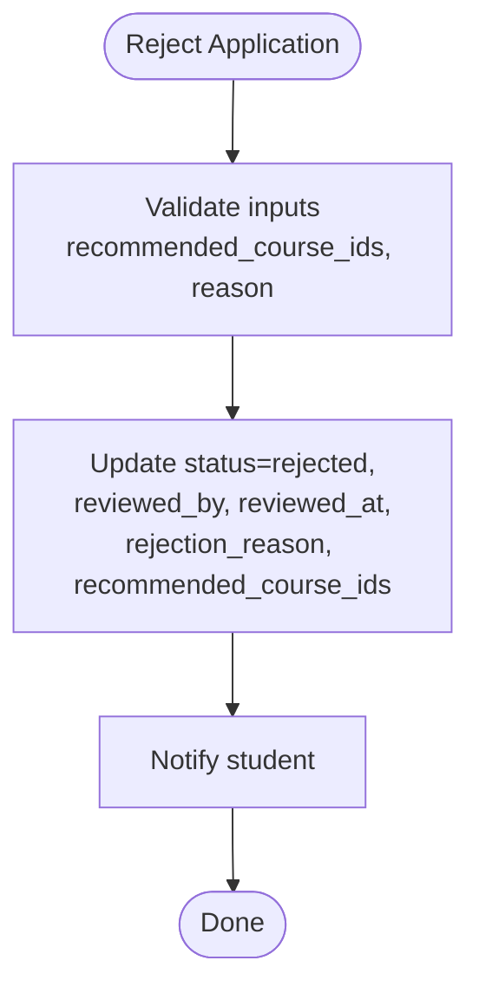
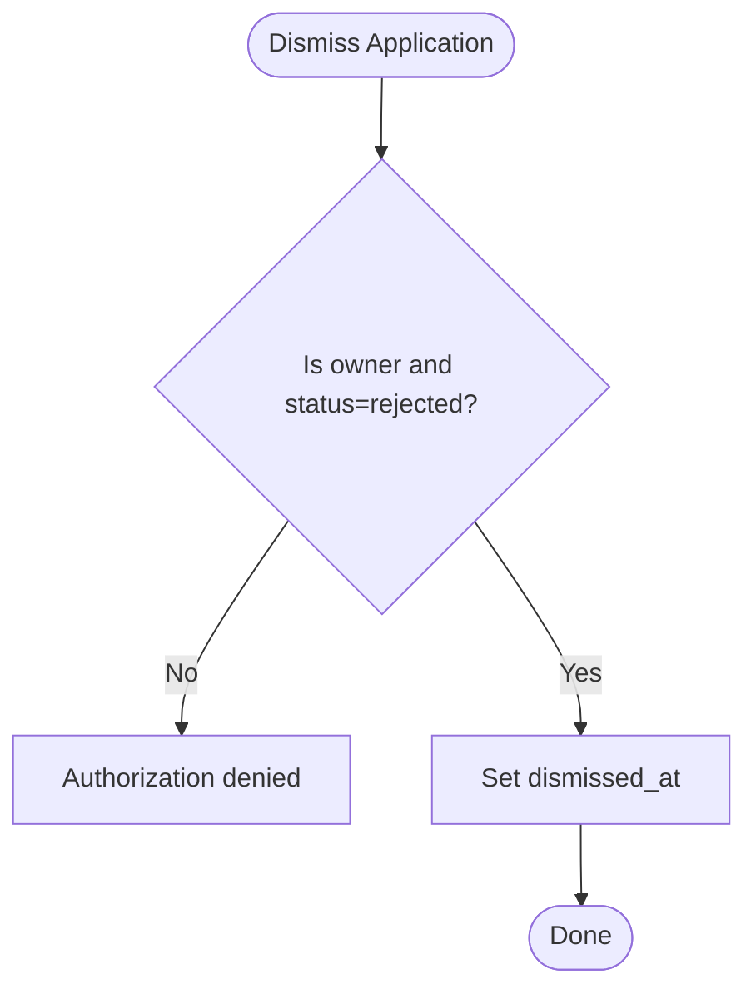
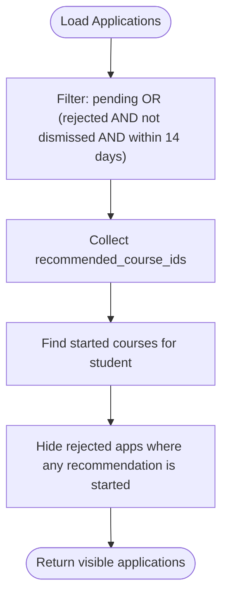
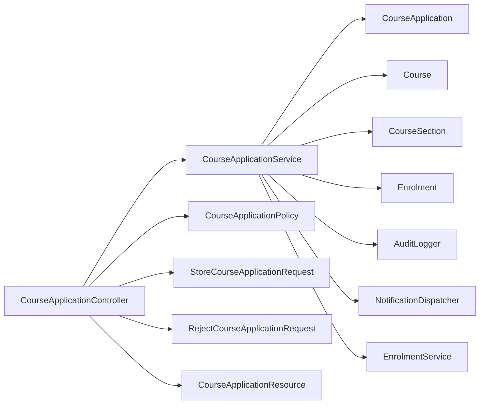

# Course Applications

<cite>
**Referenced Files in This Document**
- [CourseApplication.php](file://app/Models/CourseApplication.php)
- [CourseApplicationStatus.php](file://app/Enums/CourseApplicationStatus.php)
- [CourseApplicationController.php](file://app/Http/Controllers/Api/V1/CourseApplicationController.php)
- [CourseApplicationService.php](file://app/Services/Enrolment/CourseApplicationService.php)
- [CourseApplicationPolicy.php](file://app/Policies/CourseApplicationPolicy.php)
- [CourseApplicationResource.php](file://app/Http/Resources/CourseApplicationResource.php)
- [StoreCourseApplicationRequest.php](file://app/Http/Requests/Api/V1/StoreCourseApplicationRequest.php)
- [RejectCourseApplicationRequest.php](file://app/Http/Requests/Api/V1/RejectCourseApplicationRequest.php)
- [Course.php](file://app/Models/Course.php)
- [CourseSection.php](file://app/Models/CourseSection.php)
- [Enrolment.php](file://app/Models/Enrolment.php)
- [2026_07_29_040000_create_course_applications_table.php](file://database/migrations/2026_07_29_040000_create_course_applications_table.php)
- [2026_08_04_010000_add_rejection_reason_to_course_applications_table.php](file://database/migrations/2026_08_04_010000_add_rejection_reason_to_course_applications_table.php)
- [2026_08_04_020000_add_dismissed_at_to_course_applications_table.php](file://database/migrations/2026_08_04_020000_add_dismissed_at_to_course_applications_table.php)
- [2026_08_10_030000_add_section_id_to_course_applications_table.php](file://database/migrations/2026_08_10_030000_add_section_id_to_course_applications_table.php)
</cite>

## Table of Contents
1. Introduction
2. Project Structure
3. Core Components
4. Architecture Overview
5. Detailed Component Analysis
6. Dependency Analysis
7. Performance Considerations
8. Troubleshooting Guide
9. Conclusion

## Introduction
This document describes the data model and workflow for course applications in the system. It explains how students apply to courses, how applications are reviewed and decided, how section-based applications work, and how approved applications integrate with enrollment. It also covers statuses, rejection reasons, dismissal handling, and business rules that govern application processing.

## Project Structure
The course application feature spans models, enums, controllers, services, policies, resources, request validators, and database migrations:
- Data model: CourseApplication, Course, CourseSection, Enrolment
- Status enum: CourseApplicationStatus
- API layer: CourseApplicationController, StoreCourseApplicationRequest, RejectCourseApplicationRequest, CourseApplicationResource
- Business logic: CourseApplicationService
- Authorization: CourseApplicationPolicy
- Schema: migrations creating and evolving the course_applications table

**Diagram sources**
- [CourseApplicationController.php:1-104](file://app/Http/Controllers/Api/V1/CourseApplicationController.php#L1-L104)
- [StoreCourseApplicationRequest.php:1-30](file://app/Http/Requests/Api/V1/StoreCourseApplicationRequest.php#L1-L30)
- [RejectCourseApplicationRequest.php:1-26](file://app/Http/Requests/Api/V1/RejectCourseApplicationRequest.php#L1-L26)
- [CourseApplicationService.php:1-289](file://app/Services/Enrolment/CourseApplicationService.php#L1-L289)
- [CourseApplicationPolicy.php:1-54](file://app/Policies/CourseApplicationPolicy.php#L1-L54)
- [CourseApplication.php:1-89](file://app/Models/CourseApplication.php#L1-L89)
- [Course.php:1-180](file://app/Models/Course.php#L1-L180)
- [CourseSection.php:1-119](file://app/Models/CourseSection.php#L1-L119)
- [Enrolment.php:1-76](file://app/Models/Enrolment.php#L1-L76)
- [2026_07_29_040000_create_course_applications_table.php:1-41](file://database/migrations/2026_07_29_040000_create_course_applications_table.php#L1-L41)
- [2026_08_04_010000_add_rejection_reason_to_course_applications_table.php:1-25](file://database/migrations/2026_08_04_010000_add_rejection_reason_to_course_applications_table.php#L1-L25)
- [2026_08_04_020000_add_dismissed_at_to_course_applications_table.php:1-25](file://database/migrations/2026_08_04_020000_add_dismissed_at_to_course_applications_table.php#L1-L25)
- [2026_08_10_030000_add_section_id_to_course_applications_table.php:1-34](file://database/migrations/2026_08_10_030000_add_section_id_to_course_applications_table.php#L1-L34)

**Section sources**
- [CourseApplicationController.php:1-104](file://app/Http/Controllers/Api/V1/CourseApplicationController.php#L1-L104)
- [CourseApplicationService.php:1-289](file://app/Services/Enrolment/CourseApplicationService.php#L1-L289)
- [CourseApplication.php:1-89](file://app/Models/CourseApplication.php#L1-L89)
- [Course.php:1-180](file://app/Models/Course.php#L1-L180)
- [CourseSection.php:1-119](file://app/Models/CourseSection.php#L1-L119)
- [Enrolment.php:1-76](file://app/Models/Enrolment.php#L1-L76)
- [2026_07_29_040000_create_course_applications_table.php:1-41](file://database/migrations/2026_07_29_040000_create_course_applications_table.php#L1-L41)
- [2026_08_04_010000_add_rejection_reason_to_course_applications_table.php:1-25](file://database/migrations/2026_08_04_010000_add_rejection_reason_to_course_applications_table.php#L1-L25)
- [2026_08_04_020000_add_dismissed_at_to_course_applications_table.php:1-25](file://database/migrations/2026_08_04_020000_add_dismissed_at_to_course_applications_table.php#L1-L25)
- [2026_08_10_030000_add_section_id_to_course_applications_table.php:1-34](file://database/migrations/2026_08_10_030000_add_section_id_to_course_applications_table.php#L1-L34)

## Core Components
- CourseApplication model: Represents a student’s application to a course or a specific section. Stores answers, portfolio URL, alternative proof text, status, reviewer info, recommended courses, and timestamps.
- CourseApplicationStatus enum: Defines lifecycle states pending, approved, rejected.
- CourseApplicationService: Encapsulates application creation, approval, rejection, dashboard visibility filtering, and dismissal. Integrates with enrollment on approval.
- CourseApplicationController: Exposes API endpoints for listing, submitting, approving, rejecting, and dismissing applications.
- Policies and Requests: Enforce authorization and input validation for actions.
- Resources: Shape API responses for applications.
- Migrations: Define the course_applications schema and its evolution (rejection reason, dismissal timestamp, section support).

Key relationships:
- CourseApplication belongs to User (student), Course, CourseSection (optional), and User (reviewer).
- Approved applications trigger an Enrolment record via the enrollment service.

**Section sources**
- [CourseApplication.php:1-89](file://app/Models/CourseApplication.php#L1-L89)
- [CourseApplicationStatus.php:1-13](file://app/Enums/CourseApplicationStatus.php#L1-L13)
- [CourseApplicationService.php:1-289](file://app/Services/Enrolment/CourseApplicationService.php#L1-L289)
- [CourseApplicationController.php:1-104](file://app/Http/Controllers/Api/V1/CourseApplicationController.php#L1-L104)
- [CourseApplicationPolicy.php:1-54](file://app/Policies/CourseApplicationPolicy.php#L1-L54)
- [StoreCourseApplicationRequest.php:1-30](file://app/Http/Requests/Api/V1/StoreCourseApplicationRequest.php#L1-L30)
- [RejectCourseApplicationRequest.php:1-26](file://app/Http/Requests/Api/V1/RejectCourseApplicationRequest.php#L1-L26)
- [CourseApplicationResource.php:1-43](file://app/Http/Resources/CourseApplicationResource.php#L1-L43)

## Architecture Overview
The application workflow is driven by the controller delegating to the service, which enforces business rules, persists state changes, integrates with enrollment, logs audit events, and dispatches notifications.

**Diagram sources**
- [CourseApplicationController.php:23-102](file://app/Http/Controllers/Api/V1/CourseApplicationController.php#L23-L102)
- [CourseApplicationService.php:44-287](file://app/Services/Enrolment/CourseApplicationService.php#L44-L287)

## Detailed Component Analysis

### Data Model and Relationships
- CourseApplication fields include student_id, course_id, section_id (nullable), status, answers (JSON array), portfolio_url, alternative_proof_text, rejection_reason, dismissed_at, reviewed_by, reviewed_at, recommended_course_ids (JSON array).
- Relationships:
  - student: BelongsTo User
  - course: BelongsTo Course
  - section: BelongsTo CourseSection (optional)
  - reviewer: BelongsTo User
  - recommendedCourses(): helper returning related Courses from JSON IDs

**Diagram sources**
- [CourseApplication.php:14-87](file://app/Models/CourseApplication.php#L14-L87)
- [Course.php:17-145](file://app/Models/Course.php#L17-L145)
- [CourseSection.php:14-119](file://app/Models/CourseSection.php#L14-L119)
- [Enrolment.php:15-76](file://app/Models/Enrolment.php#L15-L76)

**Section sources**
- [CourseApplication.php:19-87](file://app/Models/CourseApplication.php#L19-L87)
- [Course.php:22-145](file://app/Models/Course.php#L22-L145)
- [CourseSection.php:19-119](file://app/Models/CourseSection.php#L19-L119)
- [Enrolment.php:22-76](file://app/Models/Enrolment.php#L22-L76)

### Application Lifecycle and States
- States: pending, approved, rejected.
- Transitions:
  - Submit: creates pending application.
  - Approve: transitions to approved; triggers enrollment; auto-cancels other pending applications for the same course.
  - Reject: transitions to rejected; stores rejection_reason and recommended_course_ids; notifies student.
  - Dismiss: only for rejected applications owned by the student; sets dismissed_at to hide from dashboard after visibility window.

**Diagram sources**
- [CourseApplicationStatus.php:7-12](file://app/Enums/CourseApplicationStatus.php#L7-L12)
- [CourseApplicationService.php:108-153](file://app/Services/Enrolment/CourseApplicationService.php#L108-L153)
- [CourseApplicationService.php:195-233](file://app/Services/Enrolment/CourseApplicationService.php#L195-L233)
- [CourseApplicationService.php:274-287](file://app/Services/Enrolment/CourseApplicationService.php#L274-L287)

**Section sources**
- [CourseApplicationStatus.php:7-12](file://app/Enums/CourseApplicationStatus.php#L7-L12)
- [CourseApplicationService.php:108-233](file://app/Services/Enrolment/CourseApplicationService.php#L108-L233)
- [CourseApplicationService.php:274-287](file://app/Services/Enrolment/CourseApplicationService.php#L274-L287)

### Section-Based Applications
- Applications can be scoped to a specific section via section_id.
- Validation prevents duplicate pending applications for the same course+section combination.
- Existing confirmed enrollments block re-application for the same course+section.
- Approval enrolls the student into the specified section through the enrollment service.
- Dashboard visibility filters include section context where applicable.

**Diagram sources**
- [CourseApplicationService.php:44-99](file://app/Services/Enrolment/CourseApplicationService.php#L44-L99)
- [StoreCourseApplicationRequest.php:18-28](file://app/Http/Requests/Api/V1/StoreCourseApplicationRequest.php#L18-L28)

**Section sources**
- [CourseApplicationService.php:44-99](file://app/Services/Enrolment/CourseApplicationService.php#L44-L99)
- [StoreCourseApplicationRequest.php:18-28](file://app/Http/Requests/Api/V1/StoreCourseApplicationRequest.php#L18-L28)

### Approval and Enrollment Integration
- On approve:
  - Mark application as approved and record reviewer details.
  - Call enrollment service to create an Enrolment for the student and course (and section if provided).
  - Send notification to the student.
  - Auto-cancel any other pending applications for the same course to avoid conflicting enrollments.

**Diagram sources**
- [CourseApplicationService.php:108-153](file://app/Services/Enrolment/CourseApplicationService.php#L108-L153)
- [CourseApplicationService.php:160-190](file://app/Services/Enrolment/CourseApplicationService.php#L160-L190)

**Section sources**
- [CourseApplicationService.php:108-190](file://app/Services/Enrolment/CourseApplicationService.php#L108-L190)

### Rejection and Recommendations
- On reject:
  - Mark application as rejected and record reviewer details.
  - Optionally store recommended_course_ids and rejection_reason.
  - Notify the student; if recommendations exist, inform them about suggested courses.

**Diagram sources**
- [RejectCourseApplicationRequest.php:17-24](file://app/Http/Requests/Api/V1/RejectCourseApplicationRequest.php#L17-L24)
- [CourseApplicationService.php:195-233](file://app/Services/Enrolment/CourseApplicationService.php#L195-L233)

**Section sources**
- [RejectCourseApplicationRequest.php:17-24](file://app/Http/Requests/Api/V1/RejectCourseApplicationRequest.php#L17-L24)
- [CourseApplicationService.php:195-233](file://app/Services/Enrolment/CourseApplicationService.php#L195-L233)

### Dismissal Handling
- Only the owning student can dismiss a rejected application.
- Dismissal sets dismissed_at, hiding the application from the dashboard after the visibility window.

**Diagram sources**
- [CourseApplicationPolicy.php:33-39](file://app/Policies/CourseApplicationPolicy.php#L33-L39)
- [CourseApplicationService.php:274-287](file://app/Services/Enrolment/CourseApplicationService.php#L274-L287)

**Section sources**
- [CourseApplicationPolicy.php:33-39](file://app/Policies/CourseApplicationPolicy.php#L33-L39)
- [CourseApplicationService.php:274-287](file://app/Services/Enrolment/CourseApplicationService.php#L274-L287)

### Dashboard Visibility Rules
- The student dashboard shows:
  - All pending applications.
  - Rejected applications within a visibility window (14 days since review) that have not been dismissed.
  - Rejected applications are hidden if the student has already started any of the recommended courses.

**Diagram sources**
- [CourseApplicationService.php:243-272](file://app/Services/Enrolment/CourseApplicationService.php#L243-L272)

**Section sources**
- [CourseApplicationService.php:243-272](file://app/Services/Enrolment/CourseApplicationService.php#L243-L272)

### API Endpoints Summary
- GET /api/v1/applications: List all applications (instructor sees their courses; admin sees all); supports status filter.
- GET /api/v1/applications/mine: List applications visible to the authenticated student dashboard.
- POST /api/v1/applications: Submit a new application (requires published course; validates section_id, answers, portfolio_url, alternative_proof_text).
- PUT /api/v1/applications/{id}/approve: Approve an application (authorized reviewers only).
- PUT /api/v1/applications/{id}/reject: Reject an application with optional recommendations and reason.
- PUT /api/v1/applications/{id}/dismiss: Dismiss a rejected application (owner only).

**Section sources**
- [CourseApplicationController.php:23-102](file://app/Http/Controllers/Api/V1/CourseApplicationController.php#L23-L102)
- [StoreCourseApplicationRequest.php:13-28](file://app/Http/Requests/Api/V1/StoreCourseApplicationRequest.php#L13-L28)
- [RejectCourseApplicationRequest.php:12-24](file://app/Http/Requests/Api/V1/RejectCourseApplicationRequest.php#L12-L24)

### Database Schema Highlights
- course_applications table includes:
  - student_id, course_id, section_id (nullable), status enum, answers JSON, portfolio_url, alternative_proof_text, rejection_reason, dismissed_at, reviewed_by, reviewed_at, recommended_course_ids JSON, timestamps.
- Indexes optimize lookups by course/status and student/course/section/status combinations.
- Foreign keys enforce referential integrity with users, courses, and course_sections.

**Section sources**
- [2026_07_29_040000_create_course_applications_table.php:19-33](file://database/migrations/2026_07_29_040000_create_course_applications_table.php#L19-L33)
- [2026_08_04_010000_add_rejection_reason_to_course_applications_table.php:13-15](file://database/migrations/2026_08_04_010000_add_rejection_reason_to_course_applications_table.php#L13-L15)
- [2026_08_04_020000_add_dismissed_at_to_course_applications_table.php:13-15](file://database/migrations/2026_08_04_020000_add_dismissed_at_to_course_applications_table.php#L13-L15)
- [2026_08_10_030000_add_section_id_to_course_applications_table.php:18-22](file://database/migrations/2026_08_10_030000_add_section_id_to_course_applications_table.php#L18-L22)

## Dependency Analysis
- Controller depends on Service, Policy, and Request validators; returns Resource objects.
- Service depends on Models (CourseApplication, Course, CourseSection, Enrolment), AuditLogger, NotificationDispatcher, and EnrolmentService.
- Models define relationships to Users, Courses, Sections, and Enrollments.
- Migrations evolve the schema to support sectioning, rejection reasons, and dismissal.

**Diagram sources**
- [CourseApplicationController.php:1-104](file://app/Http/Controllers/Api/V1/CourseApplicationController.php#L1-L104)
- [CourseApplicationService.php:1-289](file://app/Services/Enrolment/CourseApplicationService.php#L1-L289)
- [CourseApplicationPolicy.php:1-54](file://app/Policies/CourseApplicationPolicy.php#L1-L54)
- [StoreCourseApplicationRequest.php:1-30](file://app/Http/Requests/Api/V1/StoreCourseApplicationRequest.php#L1-L30)
- [RejectCourseApplicationRequest.php:1-26](file://app/Http/Requests/Api/V1/RejectCourseApplicationRequest.php#L1-L26)
- [CourseApplicationResource.php:1-43](file://app/Http/Resources/CourseApplicationResource.php#L1-L43)

**Section sources**
- [CourseApplicationController.php:1-104](file://app/Http/Controllers/Api/V1/CourseApplicationController.php#L1-L104)
- [CourseApplicationService.php:1-289](file://app/Services/Enrolment/CourseApplicationService.php#L1-L289)

## Performance Considerations
- Use indexes on course_id, status, and composite index on student_id, course_id, section_id, status to speed up queries for listing and filtering.
- Eager load relationships (student, course, section, reviewer) in list endpoints to reduce N+1 queries.
- Avoid unnecessary recomputation by caching or limiting payload size in resources when needed.
- Keep application submission validations efficient by leveraging database constraints and targeted checks.

[No sources needed since this section provides general guidance]

## Troubleshooting Guide
Common issues and resolutions:
- Duplicate application attempts:
  - If a student tries to submit again while a pending application exists for the same course+section, the system rejects with a validation message. Ensure the UI disables resubmission until the first decision.
- Already enrolled:
  - If a confirmed enrollment exists for the course+section, submissions are blocked. Direct students to check their enrollments.
- Unauthorized actions:
  - Only admins or instructors teaching the course can approve/reject. Students can only dismiss their own rejected applications.
- Dashboard visibility confusion:
  - Rejected applications remain visible for 14 days unless dismissed or if the student started a recommended course. Explain this behavior to users.

**Section sources**
- [CourseApplicationService.php:44-99](file://app/Services/Enrolment/CourseApplicationService.php#L44-L99)
- [CourseApplicationPolicy.php:18-52](file://app/Policies/CourseApplicationPolicy.php#L18-L52)
- [CourseApplicationService.php:243-272](file://app/Services/Enrolment/CourseApplicationService.php#L243-L272)

## Conclusion
The course application system provides a robust, section-aware workflow for managing student applications. It separates pending applications from enrollments, integrates seamlessly with enrollment upon approval, and offers clear controls for rejection, recommendations, and dismissal. The data model and business rules ensure consistency, prevent conflicts, and maintain a transparent user experience across the application lifecycle.

[No sources needed since this section summarizes without analyzing specific files]