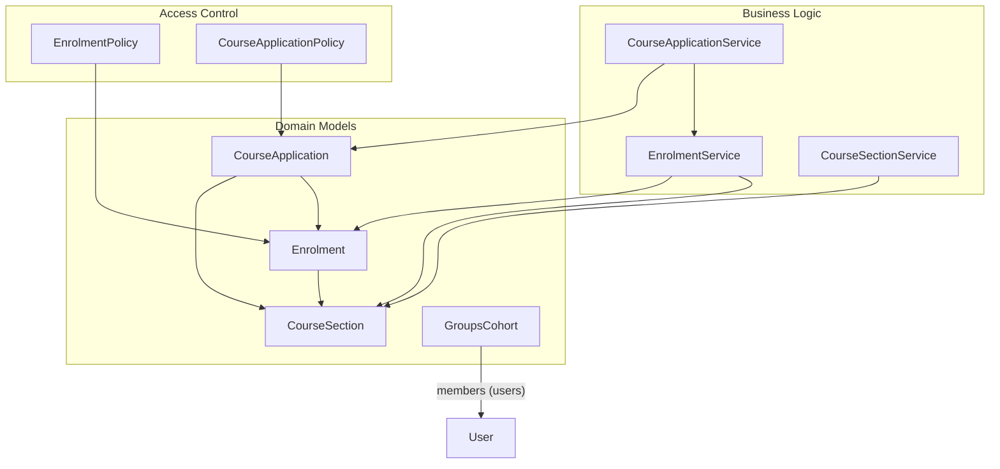
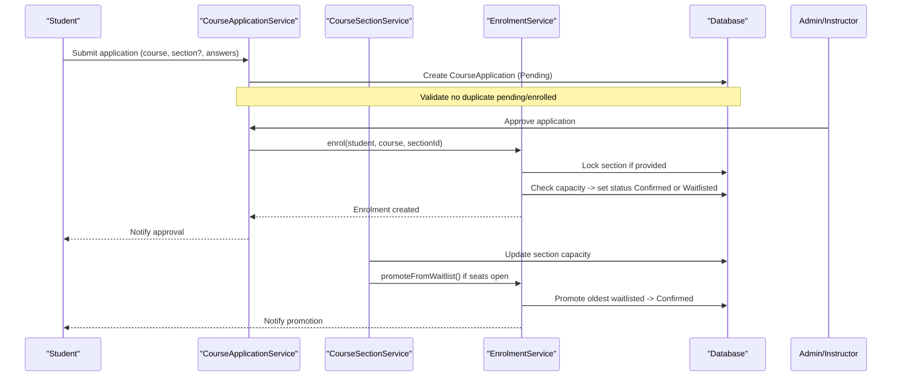
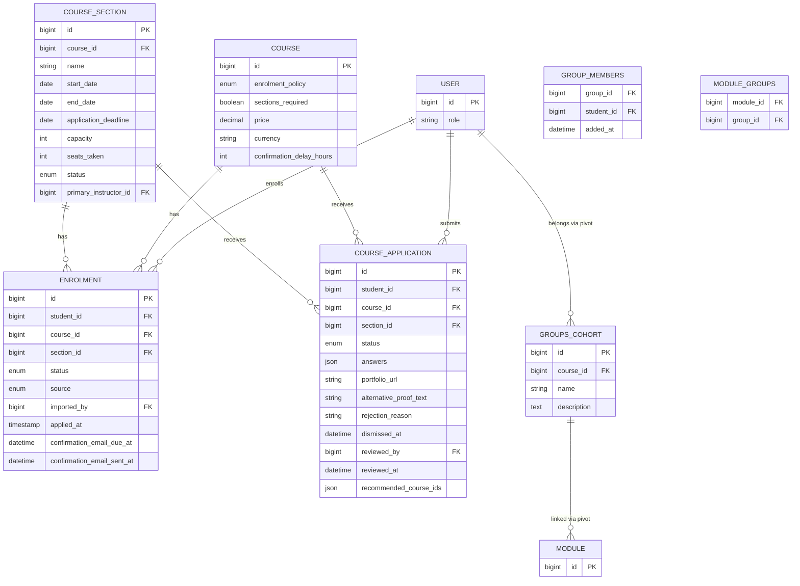
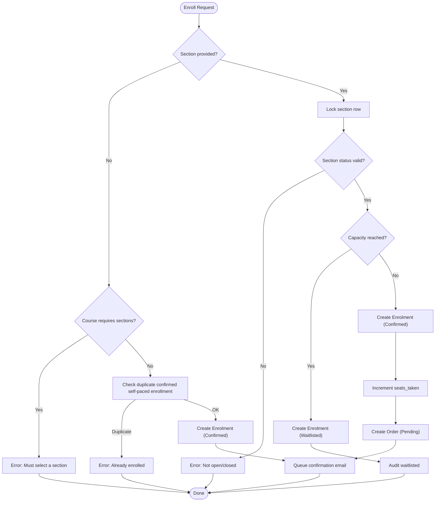
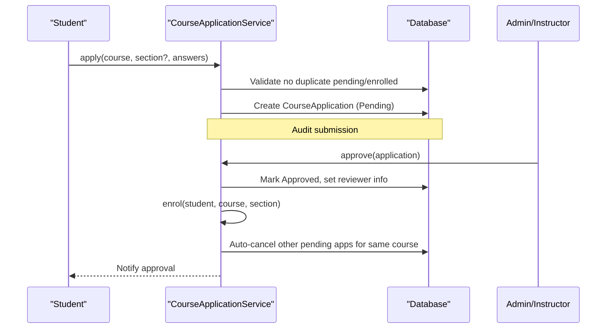
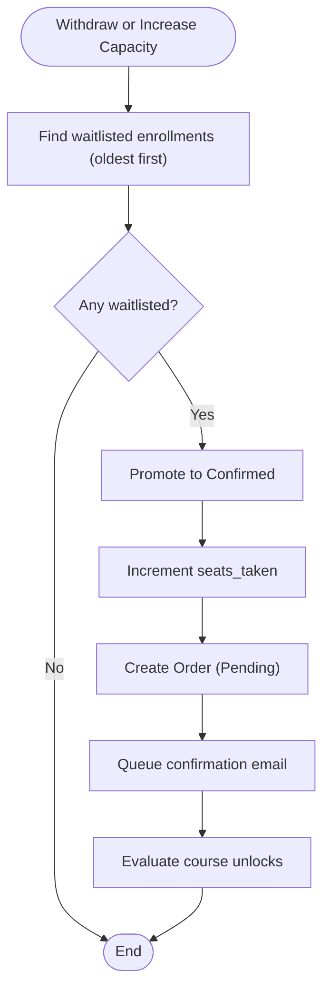
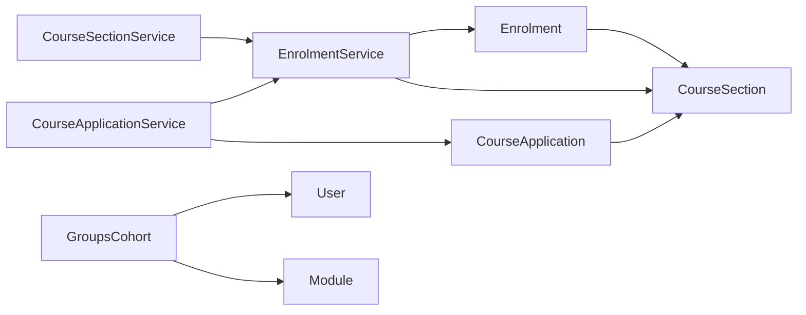

# Enrollment System

<cite>
**Referenced Files in This Document**
- [Enrolment.php](file://app/Models/Enrolment.php)
- [CourseApplication.php](file://app/Models/CourseApplication.php)
- [CourseSection.php](file://app/Models/CourseSection.php)
- [GroupsCohort.php](file://app/Models/GroupsCohort.php)
- [EnrolmentStatus.php](file://app/Enums/EnrolmentStatus.php)
- [CourseApplicationStatus.php](file://app/Enums/CourseApplicationStatus.php)
- [EnrolmentService.php](file://app/Services/Enrolment/EnrolmentService.php)
- [CourseApplicationService.php](file://app/Services/Enrolment/CourseApplicationService.php)
- [CourseSectionService.php](file://app/Services/Enrolment/CourseSectionService.php)
- [EnrolmentPolicy.php](file://app/Policies/EnrolmentPolicy.php)
- [CourseApplicationPolicy.php](file://app/Policies/CourseApplicationPolicy.php)
- [2024_01_01_000060_create_enrolments_table.php](file://database/migrations/2024_01_01_000060_create_enrolments_table.php)
- [2026_08_10_030000_add_section_id_to_course_applications_table.php](file://database/migrations/2026_08_10_030000_add_section_id_to_course_applications_table.php)
- [2026_08_10_040000_add_section_id_to_enrolments_table.php](file://database/migrations/2026_08_10_040000_add_section_id_to_enrolments_table.php)
- [2026_07_29_030000_add_enrolment_policy_to_courses_table.php](file://database/migrations/2026_07_29_030000_add_enrolment_policy_to_courses_table.php)
- [2026_08_10_050000_add_waitlisted_to_enrolments_status_enum.php](file://database/migrations/2026_08_10_050000_add_waitlisted_to_enrolments_status_enum.php)
</cite>

## Table of Contents
1. Introduction
2. Project Structure
3. Core Components
4. Architecture Overview
5. Detailed Component Analysis
6. Dependency Analysis
7. Performance Considerations
8. Troubleshooting Guide
9. Conclusion

## Introduction
This document explains the enrollment system’s data model and workflows, focusing on course applications, section-based enrollments, cohort management, and group memberships. It covers enrollment statuses, waitlist handling, and how users, courses, sections, and cohorts relate to each other. It also documents enrollment policies, application processing, and cohort membership management.

## Project Structure
The enrollment domain spans models, services, policies, and database migrations:
- Models define entities such as Enrolment, CourseApplication, CourseSection, and GroupsCohort.
- Services implement business logic for applying, approving, enrolling, withdrawing, and managing capacity and waitlists.
- Policies enforce access control for students, instructors, and admins.
- Migrations define schema changes including section support, waitlist status, and course enrollment policy configuration.



**Diagram sources**
- [Enrolment.php:15-75](file://app/Models/Enrolment.php#L15-L75)
- [CourseApplication.php:14-88](file://app/Models/CourseApplication.php#L14-L88)
- [CourseSection.php:14-118](file://app/Models/CourseSection.php#L14-L118)
- [GroupsCohort.php:13-52](file://app/Models/GroupsCohort.php#L13-L52)
- [EnrolmentService.php:44-248](file://app/Services/Enrolment/EnrolmentService.php#L44-L248)
- [CourseApplicationService.php:44-287](file://app/Services/Enrolment/CourseApplicationService.php#L44-L287)
- [CourseSectionService.php:29-163](file://app/Services/Enrolment/CourseSectionService.php#L29-L163)
- [EnrolmentPolicy.php:11-43](file://app/Policies/EnrolmentPolicy.php#L11-L43)
- [CourseApplicationPolicy.php:12-53](file://app/Policies/CourseApplicationPolicy.php#L12-L53)

**Section sources**
- [Enrolment.php:15-75](file://app/Models/Enrolment.php#L15-L75)
- [CourseApplication.php:14-88](file://app/Models/CourseApplication.php#L14-L88)
- [CourseSection.php:14-118](file://app/Models/CourseSection.php#L14-L118)
- [GroupsCohort.php:13-52](file://app/Models/GroupsCohort.php#L13-L52)
- [EnrolmentService.php:44-248](file://app/Services/Enrolment/EnrolmentService.php#L44-L248)
- [CourseApplicationService.php:44-287](file://app/Services/Enrolment/CourseApplicationService.php#L44-L287)
- [CourseSectionService.php:29-163](file://app/Services/Enrolment/CourseSectionService.php#L29-L163)
- [EnrolmentPolicy.php:11-43](file://app/Policies/EnrolmentPolicy.php#L11-L43)
- [CourseApplicationPolicy.php:12-53](file://app/Policies/CourseApplicationPolicy.php#L12-L53)

## Core Components
- Enrolment: Represents a student’s enrollment in a course, optionally tied to a specific section. Tracks status, source, timestamps, and confirmation email scheduling.
- CourseApplication: Captures a student’s application to a course (optionally for a specific section), with answers, portfolio or alternative proof fields, and review metadata.
- CourseSection: Defines a time-bound offering of a course with capacity, seats_taken, status, and instructor assignment; exposes computed attributes for enrolled count and available seats.
- GroupsCohort: A cohort scoped to a course that groups users via a pivot table and can be associated with modules.

Key relationships:
- Enrolment belongs to User (student), Course, and optional CourseSection.
- CourseApplication belongs to User (student), Course, and optional CourseSection; reviewed by a User.
- CourseSection belongs to Course and has many Enrolments and Applications.
- GroupsCohort belongs to Course and has many Users through a pivot; can link to Modules.

**Section sources**
- [Enrolment.php:15-75](file://app/Models/Enrolment.php#L15-L75)
- [CourseApplication.php:14-88](file://app/Models/CourseApplication.php#L14-L88)
- [CourseSection.php:14-118](file://app/Models/CourseSection.php#L14-L118)
- [GroupsCohort.php:13-52](file://app/Models/GroupsCohort.php#L13-L52)

## Architecture Overview
The enrollment architecture separates concerns into models, services, and policies:
- Services orchestrate workflows: application submission/approval/rejection, enrollment creation, waitlist promotion, and withdrawal.
- Policies gate access based on roles and ownership.
- Migrations evolve schema to support sections, waitlisting, and enrollment policies.



**Diagram sources**
- [CourseApplicationService.php:44-153](file://app/Services/Enrolment/CourseApplicationService.php#L44-L153)
- [EnrolmentService.php:44-248](file://app/Services/Enrolment/EnrolmentService.php#L44-L248)
- [CourseSectionService.php:54-163](file://app/Services/Enrolment/CourseSectionService.php#L54-L163)

## Detailed Component Analysis

### Data Model Relationships


**Diagram sources**
- [Enrolment.php:15-75](file://app/Models/Enrolment.php#L15-L75)
- [CourseApplication.php:14-88](file://app/Models/CourseApplication.php#L14-L88)
- [CourseSection.php:14-118](file://app/Models/CourseSection.php#L14-L118)
- [GroupsCohort.php:13-52](file://app/Models/GroupsCohort.php#L13-L52)
- [2026_08_10_040000_add_section_id_to_enrolments_table.php:22-38](file://database/migrations/2026_08_10_040000_add_section_id_to_enrolments_table.php#L22-L38)
- [2026_08_10_030000_add_section_id_to_course_applications_table.php:16-22](file://database/migrations/2026_08_10_030000_add_section_id_to_course_applications_table.php#L16-L22)
- [2026_07_29_030000_add_enrolment_policy_to_courses_table.php:18-28](file://database/migrations/2026_07_29_030000_add_enrolment_policy_to_courses_table.php#L18-L28)

**Section sources**
- [Enrolment.php:15-75](file://app/Models/Enrolment.php#L15-L75)
- [CourseApplication.php:14-88](file://app/Models/CourseApplication.php#L14-L88)
- [CourseSection.php:14-118](file://app/Models/CourseSection.php#L14-L118)
- [GroupsCohort.php:13-52](file://app/Models/GroupsCohort.php#L13-L52)
- [2026_08_10_040000_add_section_id_to_enrolments_table.php:22-38](file://database/migrations/2026_08_10_040000_add_section_id_to_enrolments_table.php#L22-L38)
- [2026_08_10_030000_add_section_id_to_course_applications_table.php:16-22](file://database/migrations/2026_08_10_030000_add_section_id_to_course_applications_table.php#L16-L22)
- [2026_07_29_030000_add_enrolment_policy_to_courses_table.php:18-28](file://database/migrations/2026_07_29_030000_add_enrolment_policy_to_courses_table.php#L18-L28)

### Enrollment Workflow (Self-Paced and Section-Based)
- Self-paced enrollment: If a course does not require sections, a student can enroll directly. Duplicate confirmed self-paced enrollments are prevented.
- Section-based enrollment: If a section is provided, the service locks the section row, validates its status, checks capacity, and sets status to Confirmed or Waitlisted accordingly.
- Orders and emails: On Confirmed status, an order is created and a delayed confirmation email is queued. Progress unlocks are evaluated.
- Withdrawal: Withdrawing a Confirmed section enrollment decrements seats and promotes the oldest waitlisted student if any.



**Diagram sources**
- [EnrolmentService.php:44-147](file://app/Services/Enrolment/EnrolmentService.php#L44-L147)

**Section sources**
- [EnrolmentService.php:44-147](file://app/Services/Enrolment/EnrolmentService.php#L44-L147)

### Application Processing Workflow
- Submission: Students submit applications for courses (optionally per section). The system prevents duplicate pending applications and existing confirmed enrollments for the same course/section combination.
- Approval: An admin or authorized instructor approves an application, which triggers enrollment via the enrollment service. Other pending applications for the same course are auto-cancelled.
- Rejection: Applications can be rejected with optional recommended courses and reasons. Rejected applications remain visible on the dashboard for a limited period unless dismissed.



**Diagram sources**
- [CourseApplicationService.php:44-153](file://app/Services/Enrolment/CourseApplicationService.php#L44-L153)

**Section sources**
- [CourseApplicationService.php:44-153](file://app/Services/Enrolment/CourseApplicationService.php#L44-L153)

### Cohort and Group Membership Management
- Cohorts: GroupsCohort represents a cohort scoped to a course. Members are linked via a pivot table with an added timestamp.
- Module linkage: Cohorts can be associated with modules via a pivot table.
- Access control: Policies govern who can view or manage cohorts and their members.

```mermaid
classDiagram
class GroupsCohort {
+int id
+int course_id
+string name
+text description
+members()
+modules()
}
class User {
+int id
+string role
}
class Module {
+int id
}
GroupsCohort --> User : "belongsToMany (pivot : group_members)"
GroupsCohort --> Module : "belongsToMany (pivot : module_groups)"
```

**Diagram sources**
- [GroupsCohort.php:13-52](file://app/Models/GroupsCohort.php#L13-L52)

**Section sources**
- [GroupsCohort.php:13-52](file://app/Models/GroupsCohort.php#L13-L52)

### Enrollment Statuses and Waitlist Handling
- Statuses:
  - Confirmed: Active enrollment; may create orders and trigger progress evaluation.
  - Waitlisted: Capacity full; eligible for promotion when seats open.
  - Withdrawn: Removed from active enrollment; may free a seat and trigger promotions.
- Waitlist promotion:
  - Triggered by withdrawals or capacity increases.
  - Oldest waitlisted enrollments are promoted first.
  - Promotion creates orders, queues confirmation emails, and evaluates progress.



**Diagram sources**
- [EnrolmentService.php:157-248](file://app/Services/Enrolment/EnrolmentService.php#L157-L248)
- [CourseSectionService.php:134-163](file://app/Services/Enrolment/CourseSectionService.php#L134-L163)

**Section sources**
- [EnrolmentStatus.php:7-12](file://app/Enums/EnrolmentStatus.php#L7-L12)
- [EnrolmentService.php:157-248](file://app/Services/Enrolment/EnrolmentService.php#L157-L248)
- [CourseSectionService.php:134-163](file://app/Services/Enrolment/CourseSectionService.php#L134-L163)

### Enrollment Policies and Access Control
- EnrolmentPolicy:
  - Students can create enrollments.
  - Only the student or admin can view an enrollment.
  - Only admins can perform bulk imports.
  - Students can withdraw their own enrollments; admins can withdraw any.
- CourseApplicationPolicy:
  - Admins and instructors can view applications.
  - Instructors can decide only for courses they teach; admins can decide any.
  - Students can dismiss rejected applications once.

**Section sources**
- [EnrolmentPolicy.php:11-43](file://app/Policies/EnrolmentPolicy.php#L11-L43)
- [CourseApplicationPolicy.php:12-53](file://app/Policies/CourseApplicationPolicy.php#L12-L53)

### Schema Evolution and Key Constraints
- Enrolments table:
  - Supports section_id and unique constraint on (student_id, course_id, section_id).
  - Status enum extended to include waitlisted.
- CourseApplications table:
  - Added section_id to allow section-specific applications.
- Courses table:
  - Added enrolment_policy and related fields to configure flows (open, advisory, application).

**Section sources**
- [2024_01_01_000060_create_enrolments_table.php:11-29](file://database/migrations/2024_01_01_000060_create_enrolments_table.php#L11-L29)
- [2026_08_10_040000_add_section_id_to_enrolments_table.php:22-38](file://database/migrations/2026_08_10_040000_add_section_id_to_enrolments_table.php#L22-L38)
- [2026_08_10_050000_add_waitlisted_to_enrolments_status_enum.php:13-23](file://database/migrations/2026_08_10_050000_add_waitlisted_to_enrolments_status_enum.php#L13-L23)
- [2026_08_10_030000_add_section_id_to_course_applications_table.php:16-22](file://database/migrations/2026_08_10_030000_add_section_id_to_course_applications_table.php#L16-L22)
- [2026_07_29_030000_add_enrolment_policy_to_courses_table.php:18-28](file://database/migrations/2026_07_29_030000_add_enrolment_policy_to_courses_table.php#L18-L28)

## Dependency Analysis
- Service dependencies:
  - CourseApplicationService depends on EnrolmentService to convert approved applications into enrollments.
  - CourseSectionService depends on EnrolmentService to promote waitlisted students when capacity increases.
- Model relationships:
  - Enrolment links to User, Course, and optional CourseSection.
  - CourseApplication links to User, Course, and optional CourseSection; reviewed by a User.
  - CourseSection links to Course and has many Enrolments and Applications.
  - GroupsCohort links to Course and has many Users and Modules via pivots.



**Diagram sources**
- [CourseApplicationService.php:44-287](file://app/Services/Enrolment/CourseApplicationService.php#L44-L287)
- [CourseSectionService.php:29-163](file://app/Services/Enrolment/CourseSectionService.php#L29-L163)
- [EnrolmentService.php:44-248](file://app/Services/Enrolment/EnrolmentService.php#L44-L248)
- [Enrolment.php:15-75](file://app/Models/Enrolment.php#L15-L75)
- [CourseApplication.php:14-88](file://app/Models/CourseApplication.php#L14-L88)
- [CourseSection.php:14-118](file://app/Models/CourseSection.php#L14-L118)
- [GroupsCohort.php:13-52](file://app/Models/GroupsCohort.php#L13-L52)

**Section sources**
- [CourseApplicationService.php:44-287](file://app/Services/Enrolment/CourseApplicationService.php#L44-L287)
- [CourseSectionService.php:29-163](file://app/Services/Enrolment/CourseSectionService.php#L29-L163)
- [EnrolmentService.php:44-248](file://app/Services/Enrolment/EnrolmentService.php#L44-L248)
- [Enrolment.php:15-75](file://app/Models/Enrolment.php#L15-L75)
- [CourseApplication.php:14-88](file://app/Models/CourseApplication.php#L14-L88)
- [CourseSection.php:14-118](file://app/Models/CourseSection.php#L14-L118)
- [GroupsCohort.php:13-52](file://app/Models/GroupsCohort.php#L13-L52)

## Performance Considerations
- Concurrency safety: Section capacity checks use pessimistic locking to prevent race conditions during enrollment and promotion.
- Efficient queries: Section computed attributes calculate enrolled counts and available seats using targeted queries.
- Indexing: Migrations add indexes for common query patterns (e.g., student/course/section/status combinations).
- Asynchronous tasks: Confirmation emails are queued with configurable delays to avoid blocking enrollment operations.

[No sources needed since this section provides general guidance]

## Troubleshooting Guide
- Duplicate enrollment errors:
  - Occur when attempting to enroll again in the same course/section or when a confirmed self-paced enrollment already exists.
  - Resolution: Verify current enrollments and ensure section requirements are met.
- Section not open/closed errors:
  - Occur when trying to enroll in a section with Draft or Closed status.
  - Resolution: Adjust section status to Open before enrollment.
- Capacity constraints:
  - When a section is full, new enrollments become Waitlisted.
  - Resolution: Monitor waitlist and increase capacity or await withdrawals.
- Policy violations:
  - Unauthorized actions (e.g., non-instructor deciding applications) are blocked by policies.
  - Resolution: Ensure correct roles and course associations.

**Section sources**
- [EnrolmentService.php:44-147](file://app/Services/Enrolment/EnrolmentService.php#L44-L147)
- [CourseApplicationService.php:44-153](file://app/Services/Enrolment/CourseApplicationService.php#L44-L153)
- [EnrolmentPolicy.php:11-43](file://app/Policies/EnrolmentPolicy.php#L11-L43)
- [CourseApplicationPolicy.php:12-53](file://app/Policies/CourseApplicationPolicy.php#L12-L53)

## Conclusion
The enrollment system provides a robust, section-aware workflow with clear separation between applications and enrollments. It supports flexible enrollment policies, capacity management with waitlisting, and cohort-based grouping. Policies enforce secure access, while services ensure data integrity and consistent state transitions. The design scales to handle concurrent enrollments and asynchronous notifications, making it suitable for complex academic environments.

[No sources needed since this section summarizes without analyzing specific files]