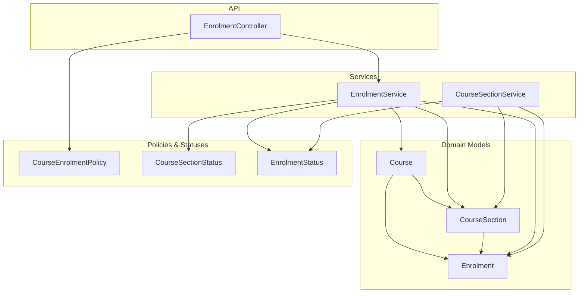
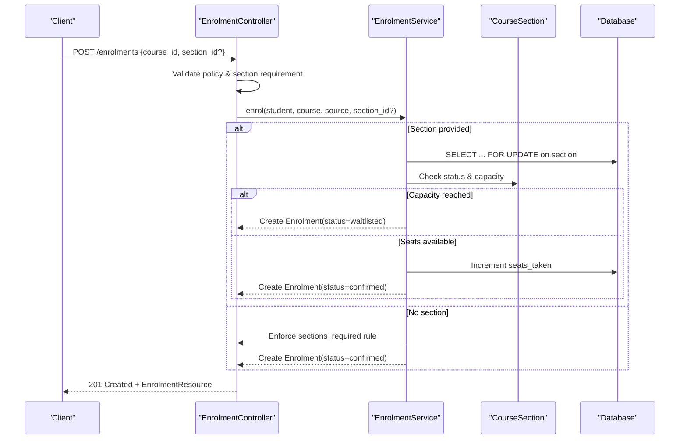
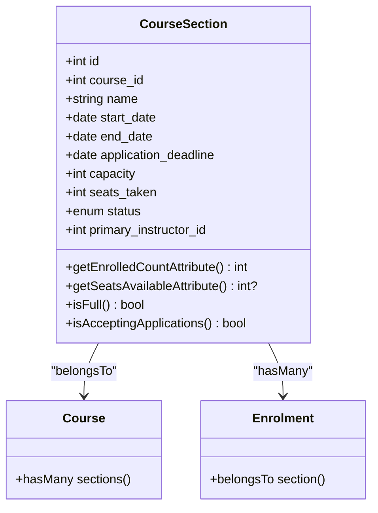
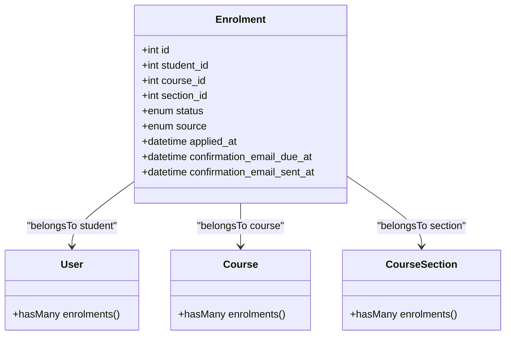
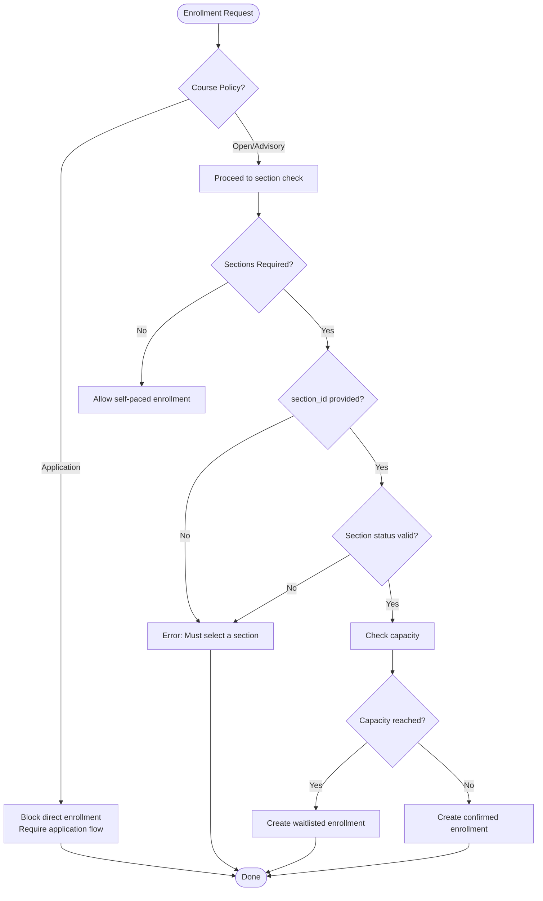
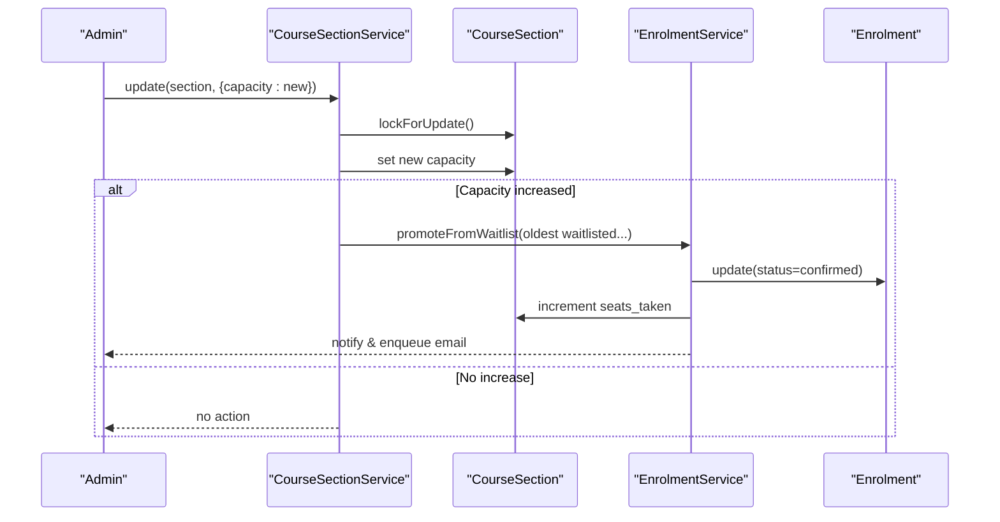
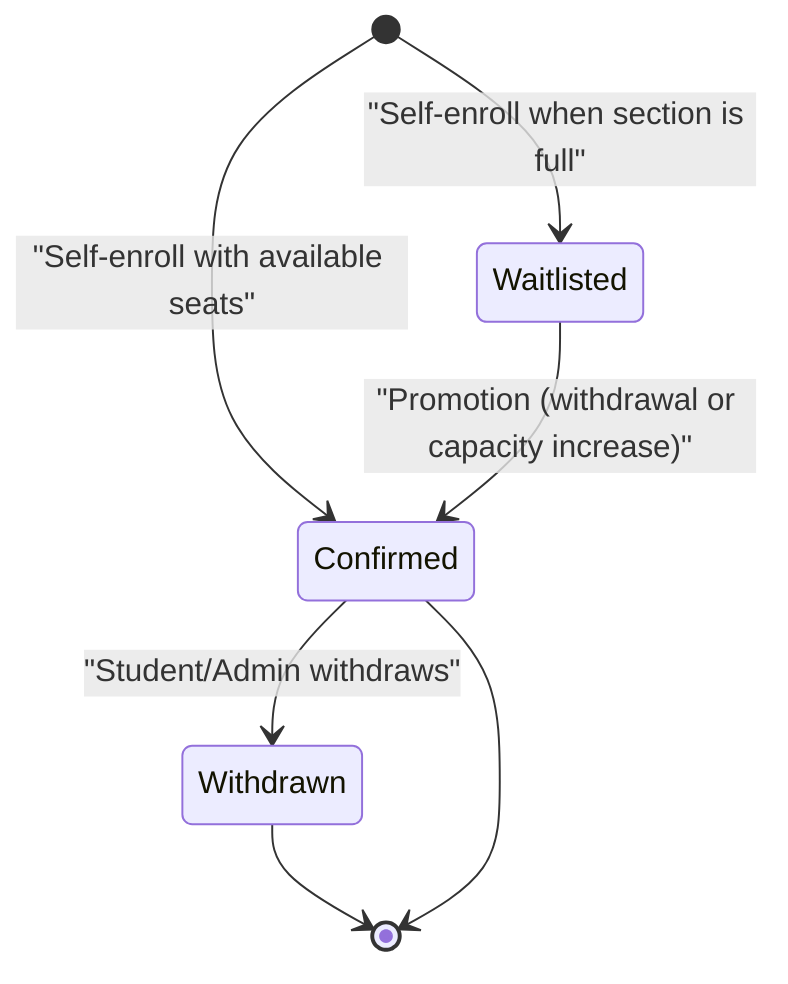
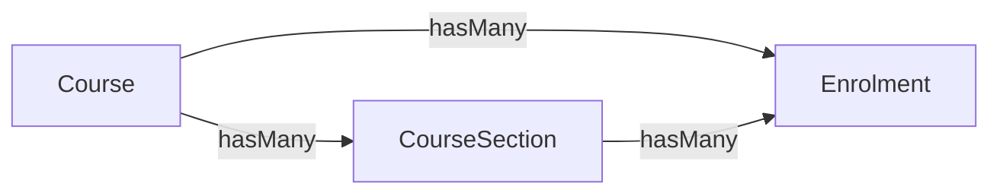
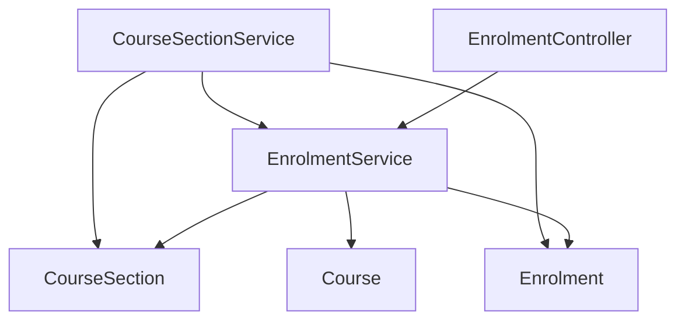

# Section-Based Enrollments

<cite>
**Referenced Files in This Document**
- [CourseSection.php](file://app/Models/CourseSection.php)
- [Enrolment.php](file://app/Models/Enrolment.php)
- [Course.php](file://app/Models/Course.php)
- [CourseEnrolmentPolicy.php](file://app/Enums/CourseEnrolmentPolicy.php)
- [EnrolmentStatus.php](file://app/Enums/EnrolmentStatus.php)
- [CourseSectionStatus.php](file://app/Enums/CourseSectionStatus.php)
- [EnrolmentController.php](file://app/Http/Controllers/Api/V1/EnrolmentController.php)
- [EnrolmentService.php](file://app/Services/Enrolment/EnrolmentService.php)
- [CourseSectionService.php](file://app/Services/Enrolment/CourseSectionService.php)
- [2026_08_10_010000_create_course_sections_table.php](file://database/migrations/2026_08_10_010000_create_course_sections_table.php)
- [2026_08_10_040000_add_section_id_to_enrolments_table.php](file://database/migrations/2026_08_10_040000_add_section_id_to_enrolments_table.php)
- [2026_08_10_050000_add_waitlisted_to_enrolments_status_enum.php](file://database/migrations/2026_08_10_050000_add_waitlisted_to_enrolments_status_enum.php)
- [2026_08_10_020000_add_sections_required_to_courses_table.php](file://database/migrations/2026_08_10_020000_add_sections_required_to_courses_table.php)
</cite>

## Table of Contents
1. Introduction
2. Project Structure
3. Core Components
4. Architecture Overview
5. Detailed Component Analysis
6. Dependency Analysis
7. Performance Considerations
8. Troubleshooting Guide
9. Conclusion
10. Appendices

## Introduction
This document explains the section-based enrollment system with a focus on data models, policies, waitlist mechanics, and workflows that tie enrollments to course sections. It covers how capacity is managed, how enrollments transition between statuses, and how sections integrate with courses. It also provides scenario-driven examples to illustrate enrollment behavior under different conditions.

## Project Structure
The section-based enrollment feature spans models, enums, services, controllers, and database migrations:
- Models define entities and relationships for Course, CourseSection, and Enrolment.
- Enums capture policy and status values used across the system.
- Services implement business logic for enrollment, withdrawal, and section management.
- Controllers expose API endpoints for self-enrollment and withdrawal.
- Migrations define schema changes including section support, unique constraints, and waitlist status.

**Diagram sources**
- [Course.php:140-145](file://app/Models/Course.php#L140-L145)
- [CourseSection.php:43-70](file://app/Models/CourseSection.php#L43-L70)
- [Enrolment.php:45-74](file://app/Models/Enrolment.php#L45-L74)
- [CourseEnrolmentPolicy.php:7-26](file://app/Enums/CourseEnrolmentPolicy.php#L7-L26)
- [CourseSectionStatus.php:7-14](file://app/Enums/CourseSectionStatus.php#L7-L14)
- [EnrolmentStatus.php:7-12](file://app/Enums/EnrolmentStatus.php#L7-L12)
- [EnrolmentController.php:20-75](file://app/Http/Controllers/Api/V1/EnrolmentController.php#L20-L75)
- [EnrolmentService.php:44-147](file://app/Services/Enrolment/EnrolmentService.php#L44-L147)
- [CourseSectionService.php:29-89](file://app/Services/Enrolment/CourseSectionService.php#L29-L89)

**Section sources**
- [Course.php:140-145](file://app/Models/Course.php#L140-L145)
- [CourseSection.php:43-70](file://app/Models/CourseSection.php#L43-L70)
- [Enrolment.php:45-74](file://app/Models/Enrolment.php#L45-L74)
- [EnrolmentController.php:20-75](file://app/Http/Controllers/Api/V1/EnrolmentController.php#L20-L75)
- [EnrolmentService.php:44-147](file://app/Services/Enrolment/EnrolmentService.php#L44-L147)
- [CourseSectionService.php:29-89](file://app/Services/Enrolment/CourseSectionService.php#L29-L89)

## Core Components
- CourseSection: Represents a scheduled cohort with dates, capacity, seats_taken, and status. Provides helpers for enrolled count, available seats, fullness checks, and application acceptance.
- Enrolment: Links a student to a course and optionally a specific section. Tracks status (confirmed, withdrawn, waitlisted), source, timestamps, and email scheduling fields.
- Course: Holds enrolment policy and whether sections are required; exposes sections and enrolments relationships.
- Policies and Statuses:
  - CourseEnrolmentPolicy: open, advisory, application.
  - CourseSectionStatus: draft, open, closed, in_progress, completed.
  - EnrolmentStatus: confirmed, withdrawn, waitlisted.

Key behaviors:
- Enrollment can be direct (self-paced or sectioned) depending on course policy and settings.
- When a section is full, new enrollments become waitlisted.
- Withdrawals from a section free a seat and promote the oldest waitlisted student.
- Increasing section capacity automatically promotes eligible waitlisted students.

**Section sources**
- [CourseSection.php:19-38](file://app/Models/CourseSection.php#L19-L38)
- [CourseSection.php:72-117](file://app/Models/CourseSection.php#L72-L117)
- [Enrolment.php:22-40](file://app/Models/Enrolment.php#L22-L40)
- [Enrolment.php:45-74](file://app/Models/Enrolment.php#L45-L74)
- [Course.php:22-56](file://app/Models/Course.php#L22-L56)
- [CourseEnrolmentPolicy.php:7-26](file://app/Enums/CourseEnrolmentPolicy.php#L7-L26)
- [CourseSectionStatus.php:7-14](file://app/Enums/CourseSectionStatus.php#L7-L14)
- [EnrolmentStatus.php:7-12](file://app/Enums/EnrolmentStatus.php#L7-L12)

## Architecture Overview
The enrollment flow integrates controller validation, service logic, model relationships, and database constraints:
- Self-enrollment route validates course policy and optional section requirements.
- Service enrolls the student, enforces section capacity using row-level locking, and sets status accordingly.
- Waitlist promotion occurs on withdrawals or capacity increases.
- Database constraints ensure uniqueness per student/course/section and protect referential integrity.

**Diagram sources**
- [EnrolmentController.php:43-61](file://app/Http/Controllers/Api/V1/EnrolmentController.php#L43-L61)
- [EnrolmentService.php:44-147](file://app/Services/Enrolment/EnrolmentService.php#L44-L147)
- [CourseSection.php:98-117](file://app/Models/CourseSection.php#L98-L117)
- [2026_08_10_040000_add_section_id_to_enrolments_table.php:24-38](file://database/migrations/2026_08_10_040000_add_section_id_to_enrolments_table.php#L24-L38)

## Detailed Component Analysis

### Data Model: CourseSection
- Fields include course association, name, start/end dates, application deadline, capacity, seats_taken, status, and primary instructor.
- Relationships: belongs to Course and User (primary instructor); has many Enrolments and CourseApplications.
- Computed attributes:
  - enrolled_count counts confirmed and waitlisted enrollments.
  - seats_available returns remaining capacity or null if unlimited.
  - is_full checks if capacity is reached.
  - is_accepting_applications checks status and deadline.

**Diagram sources**
- [CourseSection.php:19-38](file://app/Models/CourseSection.php#L19-L38)
- [CourseSection.php:43-70](file://app/Models/CourseSection.php#L43-L70)
- [CourseSection.php:72-117](file://app/Models/CourseSection.php#L72-L117)
- [Course.php:140-145](file://app/Models/Course.php#L140-L145)
- [Enrolment.php:58-64](file://app/Models/Enrolment.php#L58-L64)

**Section sources**
- [CourseSection.php:19-38](file://app/Models/CourseSection.php#L19-L38)
- [CourseSection.php:43-70](file://app/Models/CourseSection.php#L43-L70)
- [CourseSection.php:72-117](file://app/Models/CourseSection.php#L72-L117)

### Data Model: Enrolment
- Fields include student, course, optional section, status, source, import metadata, applied_at, and confirmation email scheduling.
- Relationships: belongs to User (student), Course, and CourseSection; has one Order.
- Unique constraint ensures a student cannot have multiple confirmed enrollments for the same course without a section (self-paced), while allowing multiple enrollments per section.

**Diagram sources**
- [Enrolment.php:22-40](file://app/Models/Enrolment.php#L22-L40)
- [Enrolment.php:45-74](file://app/Models/Enrolment.php#L45-L74)
- [2026_08_10_040000_add_section_id_to_enrolments_table.php:24-38](file://database/migrations/2026_08_10_040000_add_section_id_to_enrolments_table.php#L24-L38)

**Section sources**
- [Enrolment.php:22-40](file://app/Models/Enrolment.php#L22-L40)
- [Enrolment.php:45-74](file://app/Models/Enrolment.php#L45-L74)
- [2026_08_10_040000_add_section_id_to_enrolments_table.php:24-38](file://database/migrations/2026_08_10_040000_add_section_id_to_enrolments_table.php#L24-L38)

### Enrollment Policies and Section Requirements
- CourseEnrolmentPolicy determines enrollment path:
  - Open: direct self-enrollment allowed.
  - Advisory: direct self-enrollment allowed (with attestation rules elsewhere).
  - Application: must go through application workflow; direct enrollment is blocked.
- Sections Required:
  - If true and active sections exist, enrollment must specify a section_id.
  - Without a section, self-paced enrollment is prevented when sections are required.

**Diagram sources**
- [EnrolmentController.php:43-61](file://app/Http/Controllers/Api/V1/EnrolmentController.php#L43-L61)
- [EnrolmentService.php:44-147](file://app/Services/Enrolment/EnrolmentService.php#L44-L147)
- [CourseEnrolmentPolicy.php:7-26](file://app/Enums/CourseEnrolmentPolicy.php#L7-L26)
- [2026_08_10_020000_add_sections_required_to_courses_table.php:16-20](file://database/migrations/2026_08_10_020000_add_sections_required_to_courses_table.php#L16-L20)

**Section sources**
- [EnrolmentController.php:43-61](file://app/Http/Controllers/Api/V1/EnrolmentController.php#L43-L61)
- [EnrolmentService.php:44-147](file://app/Services/Enrolment/EnrolmentService.php#L44-L147)
- [CourseEnrolmentPolicy.php:7-26](file://app/Enums/CourseEnrolmentPolicy.php#L7-L26)
- [2026_08_10_020000_add_sections_required_to_courses_table.php:16-20](file://database/migrations/2026_08_10_020000_add_sections_required_to_courses_table.php#L16-L20)

### Waitlist Mechanism and Capacity Management
- Capacity tracking:
  - Section.capacity defines maximum seats; NULL means unlimited.
  - Section.seats_taken increments only for confirmed enrollments.
  - enrolled_count includes both confirmed and waitlisted enrollments for UI/reporting.
- Waitlist creation:
  - If section capacity is reached, new enrollments are created as waitlisted.
- Promotion triggers:
  - Withdrawal from a confirmed enrollment frees a seat and promotes the oldest waitlisted enrollment.
  - Increasing section capacity promotes the oldest waitlisted enrollments up to the newly available seats.
- Promotion actions:
  - Update enrollment status to confirmed.
  - Increment seats_taken.
  - Create order and queue confirmation email.
  - Notify the student and evaluate course unlocks.

**Diagram sources**
- [CourseSectionService.php:54-89](file://app/Services/Enrolment/CourseSectionService.php#L54-L89)
- [CourseSectionService.php:134-162](file://app/Services/Enrolment/CourseSectionService.php#L134-L162)
- [EnrolmentService.php:208-248](file://app/Services/Enrolment/EnrolmentService.php#L208-L248)
- [CourseSection.php:72-101](file://app/Models/CourseSection.php#L72-L101)

**Section sources**
- [CourseSectionService.php:54-89](file://app/Services/Enrolment/CourseSectionService.php#L54-L89)
- [CourseSectionService.php:134-162](file://app/Services/Enrolment/CourseSectionService.php#L134-L162)
- [EnrolmentService.php:208-248](file://app/Services/Enrolment/EnrolmentService.php#L208-L248)
- [CourseSection.php:72-101](file://app/Models/CourseSection.php#L72-L101)

### Enrollment Status Transitions
- Initial states:
  - Confirmed: when seats are available or self-paced enrollment is allowed.
  - Waitlisted: when section capacity is reached.
- Withdrawn:
  - Only explicit withdrawal transitions to withdrawn.
  - On withdrawal from a section, seats_taken decrements and oldest waitlisted is promoted if any.
- Promoted from waitlist:
  - Transition from waitlisted to confirmed via withdrawal-triggered promotion or capacity increase.

**Diagram sources**
- [EnrolmentStatus.php:7-12](file://app/Enums/EnrolmentStatus.php#L7-L12)
- [EnrolmentService.php:157-200](file://app/Services/Enrolment/EnrolmentService.php#L157-L200)
- [EnrolmentService.php:208-248](file://app/Services/Enrolment/EnrolmentService.php#L208-L248)

**Section sources**
- [EnrolmentStatus.php:7-12](file://app/Enums/EnrolmentStatus.php#L7-L12)
- [EnrolmentService.php:157-200](file://app/Services/Enrolment/EnrolmentService.php#L157-L200)
- [EnrolmentService.php:208-248](file://app/Services/Enrolment/EnrolmentService.php#L208-L248)

### Section Integration with Courses
- A course may have zero or many sections.
- When sections_required is true and active sections exist, every enrollment must target a specific section.
- Section lifecycle states control enrollment eligibility (draft/open/closed/in_progress/completed).

**Diagram sources**
- [Course.php:140-145](file://app/Models/Course.php#L140-L145)
- [CourseSection.php:56-70](file://app/Models/CourseSection.php#L56-L70)
- [Enrolment.php:58-64](file://app/Models/Enrolment.php#L58-L64)

**Section sources**
- [Course.php:140-145](file://app/Models/Course.php#L140-L145)
- [CourseSection.php:56-70](file://app/Models/CourseSection.php#L56-L70)
- [Enrolment.php:58-64](file://app/Models/Enrolment.php#L58-L64)

## Dependency Analysis
- EnrolmentController depends on EnrolmentService and validates course policy before calling service methods.
- EnrolmentService depends on CourseSection and Enrolment models, plus external services for auditing, notifications, and progress evaluation.
- CourseSectionService depends on EnrolmentService for promotions and uses pessimistic locking to avoid race conditions.
- Database constraints enforce uniqueness per student/course/section and restrict deletion of sections with history.

**Diagram sources**
- [EnrolmentController.php:20-75](file://app/Http/Controllers/Api/V1/EnrolmentController.php#L20-L75)
- [EnrolmentService.php:44-147](file://app/Services/Enrolment/EnrolmentService.php#L44-L147)
- [CourseSectionService.php:29-89](file://app/Services/Enrolment/CourseSectionService.php#L29-L89)
- [CourseSectionService.php:134-162](file://app/Services/Enrolment/CourseSectionService.php#L134-L162)

**Section sources**
- [EnrolmentController.php:20-75](file://app/Http/Controllers/Api/V1/EnrolmentController.php#L20-L75)
- [EnrolmentService.php:44-147](file://app/Services/Enrolment/EnrolmentService.php#L44-L147)
- [CourseSectionService.php:29-89](file://app/Services/Enrolment/CourseSectionService.php#L29-L89)
- [CourseSectionService.php:134-162](file://app/Services/Enrolment/CourseSectionService.php#L134-L162)

## Performance Considerations
- Use pessimistic locking (SELECT ... FOR UPDATE) on section rows during enrollment and promotion to prevent race conditions when checking and updating capacity.
- Avoid unnecessary queries by leveraging computed attributes like enrolled_count and seats_available.
- Batch promotions when increasing capacity to minimize repeated locking and I/O.
- Ensure indexes on frequently filtered columns (e.g., course_id, status) to speed up queries.

[No sources needed since this section provides general guidance]

## Troubleshooting Guide
Common issues and resolutions:
- Direct enrollment blocked for application-policy courses:
  - Cause: CourseEnrolmentPolicy is application; direct enrollment is not allowed.
  - Resolution: Use the application workflow instead.
- Missing section_id when sections are required:
  - Cause: Course has sections_required enabled and active sections exist.
  - Resolution: Provide a valid section_id in the enrollment request.
- Section not open or closed:
  - Cause: Section status is draft or closed.
  - Resolution: Change section status to open before enrolling.
- Capacity exceeded leads to waitlist:
  - Cause: Section capacity reached.
  - Resolution: Increase capacity or wait for a seat to open via withdrawal.
- Cannot delete section with history:
  - Cause: Section has enrollments or applications.
  - Resolution: Close the section instead of deleting it.

**Section sources**
- [EnrolmentController.php:43-61](file://app/Http/Controllers/Api/V1/EnrolmentController.php#L43-L61)
- [EnrolmentService.php:44-147](file://app/Services/Enrolment/EnrolmentService.php#L44-L147)
- [CourseSectionService.php:96-128](file://app/Services/Enrolment/CourseSectionService.php#L96-L128)

## Conclusion
The section-based enrollment system provides robust capacity management, clear policy enforcement, and reliable waitlist handling. By tying enrollments to sections and enforcing uniqueness and referential integrity at the database level, the system supports both self-paced and cohort-based learning paths. The use of pessimistic locking and transactional updates ensures consistency during high-concurrency scenarios.

[No sources needed since this section summarizes without analyzing specific files]

## Appendices

### Example Scenarios
- Scenario A: Open course, section with available seats
  - Student enrolls with section_id; enrollment becomes confirmed; seats_taken increments; order created; confirmation email queued.
- Scenario B: Open course, section full
  - Student enrolls with section_id; enrollment becomes waitlisted; no seats_taken increment; no order created until promotion.
- Scenario C: Application-policy course
  - Student attempts direct enrollment; request rejected; must complete application process.
- Scenario D: Sections required, no section provided
  - Enrollment blocked; user must select a valid section.
- Scenario E: Capacity increase
  - Admin increases section capacity; oldest waitlisted enrollments are promoted to confirmed; orders created; emails queued; notifications sent.
- Scenario F: Withdrawal from section
  - Student withdraws; seats_taken decrements; oldest waitlisted promoted if any; audit logged.

[No sources needed since this section provides conceptual examples]